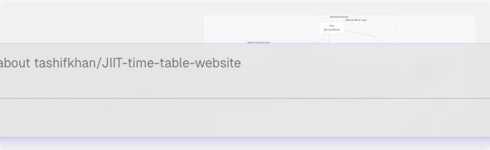
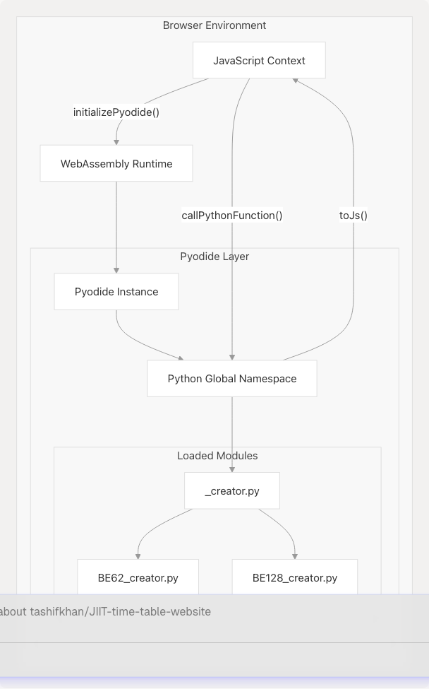
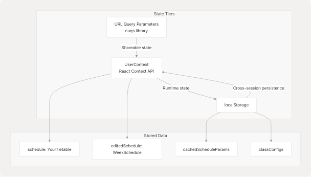
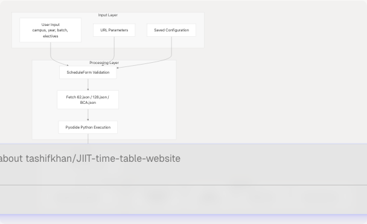

# Overview

The JIIT Personalized Timetable Creator is a browser-based Progressive Web App (PWA) that generates customized class schedules for students at Jaypee Institute of Information Technology. The system executes Python timetable generation logic entirely in the browser using Pyodide WebAssembly, eliminating traditional backend infrastructure. The application operates fully offline through service worker caching and provides features including personalized schedule generation, timeline visualization, timetable comparison, academic calendar integration, and Google Calendar synchronization.

**Architectural Approach**: The system implements a three-layer architecture: React frontend (Next.js App Router), Python processing layer (Pyodide WASM), and PWA/offline layer (Service Worker with Workbox). Static JSON data files serve as the data layer, generated at build time from Excel sources.

**Scope**: This page provides a high-level overview of the system architecture, core features, technology stack, and data flow. For detailed information about specific subsystems, refer to:

* System architecture: [#3](3-system-architecture)
* Schedule generation pipeline: [#4](4-schedule-generation-(core-feature))
* Pyodide WASM integration: [#3.2](3.2-pyodide-wasm-integration)
* PWA and offline capabilities: [#3.3](3.3-pwa-and-offline-capabilities)
* State management: [#3.5](3.5-state-management)
* Export and sharing mechanisms: [#9](9-export-and-sharing)

## System Overview

The application consists of three primary runtime layers operating in the browser: React frontend (UI and routing), Python processing layer (Pyodide WASM), and PWA/offline layer (Service Worker). Static JSON files provide timetable and calendar data, while external services handle Google Calendar integration and Pyodide runtime delivery.

**System Architecture Diagram**



**Key Architectural Characteristics**:

| Aspect | Implementation |
| --- | --- |
| **Frontend Framework** | Next.js 15 with App Router, React 18, TypeScript |
| **Backend Alternative** | Pyodide WebAssembly (Python 3.11) running client-side |
| **Data Layer** | Static JSON files served via service worker cache |
| **Offline Support** | Service worker with Workbox caching strategies |
| **State Persistence** | React Context API + localStorage + URL parameters |
| **External Integrations** | Google Calendar API (OAuth 2.0), PostHog analytics |

The service worker at [public/sw.js](https://github.com/tashifkhan/JIIT-time-table-website/blob/0ffdedf5/public/sw.js) implements three caching strategies:

* **NetworkFirst**: Root path `/` to prioritize fresh content
* **CacheFirst**: Pyodide CDN assets with 1-year TTL for performance
* **Precache**: Static assets (Next.js chunks, JSON data, Python modules)

## Core Features

The system provides five primary feature areas, each implemented as a distinct route and component:

| Feature | Route | Primary Component | Purpose |
| --- | --- | --- | --- |
| Schedule Generation | `/` | `App.tsx` | Create personalized timetables based on campus, year, batch, and electives |
| Timeline View | `/timeline` | `timeline-wrapper.tsx` | Display schedules in calendar format with event details |
| Timetable Comparison | `/compare-timetables` | `compare-timetable.tsx` | Compare two schedules to find common free slots |
| Academic Calendar | `/academic-calendar` | `academic-calendar.tsx` | View institutional calendar with Google Calendar sync |
| Mess Menu | `/mess-menu` | `mess-menu.tsx` | Display weekly dining schedule |

### Schedule Generation Workflow

The schedule generation process involves user input collection, Python-based parsing, and display rendering:


## Architecture Highlights

### Client-Side Python Execution

The most distinctive architectural decision is using Pyodide to execute Python code client-side. The `initializePyodide()` function in `pyodide.ts` loads the Pyodide WASM runtime (~10MB) from CDN, then fetches and executes the `_creator.py` module containing timetable generation logic.



The `evaluteTimeTable()` function at [src/App.tsx115-152](https://github.com/tashifkhan/JIIT-time-table-website/blob/0ffdedf5/src/App.tsx#L115-L152) implements function selection logic that maps user parameters to specific Python functions:

* Campus 62, Year 1: `time_table_creator`
* Campus 62, Year 2-4: `time_table_creator_v2`
* Campus 128, Year 1: `bando128_year1`
* Campus 128, Year 2-4: `banado128`
* Campus BCA, Year 1: `bca_creator_year1`
* Campus BCA, Year 2-3: `bca_creator`

### State Management Strategy

The application implements a three-tier state persistence model:



The `UserContext` defined in [src/context/userContext.ts](https://github.com/tashifkhan/JIIT-time-table-website/blob/0ffdedf5/src/context/userContext.ts) and provided by `UserContextProvider` [src/context/userContextProvider.tsx](https://github.com/tashifkhan/JIIT-time-table-website/blob/0ffdedf5/src/context/userContextProvider.tsx) maintains two schedule objects:

* `schedule`: Base schedule generated by Python processing
* `editedSchedule`: User modifications that override the base schedule

The `nuqs` library synchronizes form state with URL parameters, enabling shareable links. When URL parameters conflict with cached data, the `UrlParamsDialog` component [src/components/url-params-dialog.tsx](https://github.com/tashifkhan/JIIT-time-table-website/blob/0ffdedf5/src/components/url-params-dialog.tsx) prompts the user to choose between overriding, prefilling, or viewing the existing schedule.

## Technology Stack

### Technology Stack

**Frontend Technologies**

| Category | Technology | Version/Details | Purpose |
| --- | --- | --- | --- |
| **Framework** | Next.js | 15.x (App Router) | React meta-framework with routing |
| **UI Library** | React | 18.x + TypeScript | Component-based UI with type safety |
| **Styling** | Tailwind CSS | 3.x | Utility-first CSS framework |
| **UI Components** | shadcn/ui | Built on Radix UI | Accessible, composable component library |
| **Animation** | Framer Motion | 11.x | Declarative animations and transitions |
| **Icons** | Lucide React | 0.x | Icon library |
| **State Management** | React Context API | Native | Global state management |
| **URL State** | nuqs | Latest | URL query parameter synchronization |
| **Mobile Gestures** | react-swipeable | Latest | Touch navigation support |

**Python Processing Layer**

| Component | Technology | Purpose |
| --- | --- | --- |
| **Runtime** | Pyodide | v0.27.0 - WebAssembly Python runtime |
| **Delivery** | jsdelivr CDN | Pyodide distribution delivery |
| **Modules** | Custom Python | `_creator.py`, `BE62_creator.py`, `BE128_creator.py` |
| **Integration** | `pyodide.ts` | JavaScript-Python bridge with `initializePyodide()`, `callPythonFunction()` |

The `initializePyodide()` function at [src/utils/pyodide.ts](https://github.com/tashifkhan/JIIT-time-table-website/blob/0ffdedf5/src/utils/pyodide.ts) performs one-time initialization, downloading ~10MB Pyodide runtime from CDN and caching the instance globally. The `callPythonFunction()` bridge converts JavaScript objects to Python using `toPy()` and Python objects to JavaScript using `toJs()`.

**PWA & Performance**

| Component | Technology | Purpose |
| --- | --- | --- |
| **PWA Plugin** | `@ducanh2912/next-pwa` | Next.js PWA generation |
| **Service Worker** | Workbox | Caching strategies and offline support |
| **Build Tool** | Turbopack | Fast Next.js bundler |
| **Deployment** | Vercel | Static hosting with edge functions |

**External Integrations**

| Service | Purpose | Implementation |
| --- | --- | --- |
| **Google Calendar API** | Schedule synchronization | OAuth 2.0 + REST API via `calendar.ts`, `calendar-AC.ts` |
| **PostHog** | Analytics | Proxied through `/ph/*` routes |
| **Google Identity** | OAuth authentication | `@react-oauth/google` library |

**Development Tools**

The development environment supports multiple package managers (npm, yarn, pnpm, bun) and includes ESLint configuration [eslint.config.mjs](https://github.com/tashifkhan/JIIT-time-table-website/blob/0ffdedf5/eslint.config.mjs) PostCSS configuration [postcss.config.mjs](https://github.com/tashifkhan/JIIT-time-table-website/blob/0ffdedf5/postcss.config.mjs) and Tailwind configuration [tailwind.config.ts](https://github.com/tashifkhan/JIIT-time-table-website/blob/0ffdedf5/tailwind.config.ts) The `.gitignore` file at [.gitignore](https://github.com/tashifkhan/JIIT-time-table-website/blob/0ffdedf5/.gitignore) excludes build artifacts (`.next/`, `out/`), dependency directories (`node_modules/`), and environment files.

### Data Sources & Build Pipeline

**Static JSON Data Layer**

| Data Type | Location Pattern | Structure | Access |
| --- | --- | --- | --- |
| **Timetable Data** | `/data/time-table/{semester}/{campus}.json` | Campus-specific schedules with subjects, time slots, batches | `fetch()` via service worker |
| **Academic Calendar** | `/data/calender/{academic_year}/calender.json` | Institutional events with dates, descriptions, types | API routes or direct fetch |
| **Python Modules** | `/public/_creator.py`, `/public/modules/*.py` | Schedule generation logic | Loaded by Pyodide runtime |

**Example data paths**:

* Timetable: `/data/time-table/ODD25/62.json`, `/data/time-table/EVEN25/128.json`, `/data/time-table/ODD25/BCA.json`
* Calendar: `/data/calender/2425/calendar.json`, `/data/calender/2526/calender.json`

**Data Preparation Pipeline**


The `json_creater.py` Streamlit application at [json\_creater.py](https://github.com/tashifkhan/JIIT-time-table-website/blob/0ffdedf5/json_creater.py) converts Excel files to JSON format. The timetable parser ([JIIT-time-table-parser](https://github.com/tashifkhan/JIIT-time-table-website/blob/0ffdedf5/JIIT-time-table-parser)) and academic calendar parser ([JIIT-Academic-Calender](https://github.com/tashifkhan/JIIT-time-table-website/blob/0ffdedf5/JIIT-Academic-Calender)) are external tools that process raw Excel data.

The Next.js build process at [next.config.ts](https://github.com/tashifkhan/JIIT-time-table-website/blob/0ffdedf5/next.config.ts) integrates the `@ducanh2912/next-pwa` plugin, which generates service worker files with precache manifests. See [Timetable Data Format Reference](11-timetable-data-format-reference) for detailed JSON structure specifications.

## Data Flow Overview



The data flow follows a unidirectional pattern:

1. User provides parameters through `ScheduleForm` component
2. `App.tsx` component fetches appropriate JSON data based on campus selection [src/App.tsx43-53](https://github.com/tashifkhan/JIIT-time-table-website/blob/0ffdedf5/src/App.tsx#L43-L53)
3. `handleFormSubmit()` function invokes Pyodide execution [src/App.tsx154-229](https://github.com/tashifkhan/JIIT-time-table-website/blob/0ffdedf5/src/App.tsx#L154-L229)
4. Generated schedule updates `UserContext` and persists to `localStorage`
5. Display components consume schedule from context
6. Export utilities transform schedule data to PDF, PNG, or Google Calendar events

## Project Structure

The codebase is organized into functional directories:

```
src/
├── components/          # React components for UI
│   ├── schedule-form.tsx        # Input collection
│   ├── schedule-display.tsx     # Grid timetable view
│   ├── timeline.tsx             # Calendar visualization
│   ├── compare-timetable.tsx    # Comparison tool
│   ├── academic-calendar.tsx    # Institutional calendar
│   └── mess-menu.tsx            # Dining schedule
├── context/             # Global state management
│   ├── userContext.ts           # Context definition
│   └── userContextProvider.tsx  # Context provider
├── utils/               # Utility functions
│   ├── pyodide.ts               # Python WASM integration
│   ├── calendar.ts              # Google Calendar sync
│   └── download.ts              # PDF/PNG export
├── App.tsx              # Main schedule creator page
└── main.tsx             # Application entry point

public/
├── _creator.py          # Main Python module
├── modules/             # Campus-specific Python modules
│   ├── BE62_creator.py
│   └── BE128_creator.py
└── data/                # Static JSON data
    ├── time-table/      # Timetable data by semester
    └── calender/        # Academic calendar by year
```

The entry point at [src/main.tsx1-73](https://github.com/tashifkhan/JIIT-time-table-website/blob/0ffdedf5/src/main.tsx#L1-L73) configures routing with `BrowserRouter`, wraps the application in `UserContextProvider`, and integrates analytics through Vercel and PostHog. The `Navbar` component provides navigation with mobile gesture support via `react-swipeable`.

## Key Interfaces

### YourTietable Type

The primary data structure for generated schedules:

```
interface YourTietable {
  [day: string]: {
    [timeSlot: string]: {
      subject_name: string;
      type: "L" | "T" | "P" | "C";  // Lecture, Tutorial, Practical, Club
      location: string;
    };
  };
}
```

Defined at [src/App.tsx28-36](https://github.com/tashifkhan/JIIT-time-table-website/blob/0ffdedf5/src/App.tsx#L28-L36) and used throughout the application for schedule representation.

### Schedule Generation Functions

Python functions exposed to JavaScript:

* `time_table_creator()` - Campus 62, Year 1
* `time_table_creator_v2()` - Campus 62, Years 2-4
* `bando128_year1()` - Campus 128, Year 1
* `banado128()` - Campus 128, Years 2-4
* `bca_creator_year1()` - BCA, Year 1
* `bca_creator()` - BCA, Years 2-3
* `compare_timetables()` - Compare two schedules

Each function accepts `time_table_json`, `subject_json`, `batch`, and `electives_subject_codes` parameters and returns a `YourTietable` object.

## Deployment Architecture

The application is deployed on Vercel with custom rewrites defined in [vercel.json1-17](https://github.com/tashifkhan/JIIT-time-table-website/blob/0ffdedf5/vercel.json#L1-L17):

* PostHog analytics proxied through `/ph/*` routes
* All other routes serve `index.html` for client-side routing

The system operates as a Progressive Web App (PWA) with service worker [public/service-worker.js](https://github.com/tashifkhan/JIIT-time-table-website/blob/0ffdedf5/public/service-worker.js) for offline functionality and web manifest [public/manifest.json](https://github.com/tashifkhan/JIIT-time-table-website/blob/0ffdedf5/public/manifest.json) for installability.
