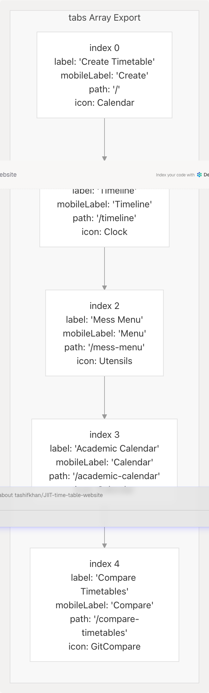
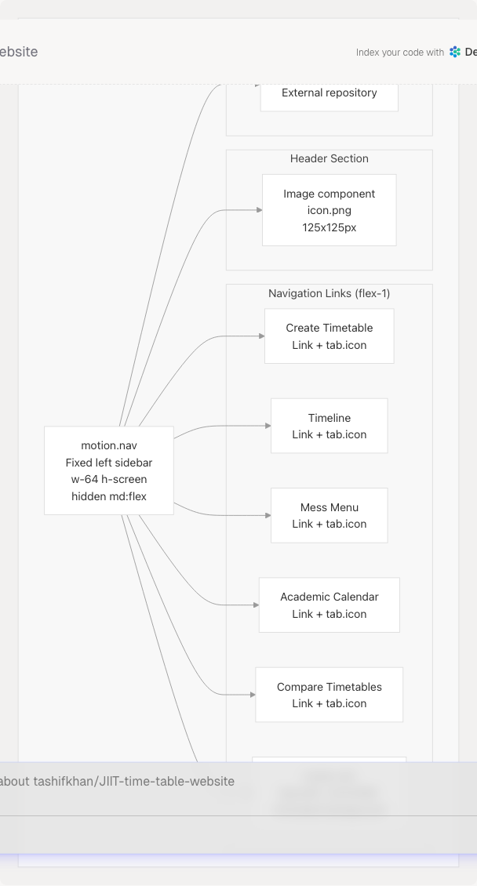
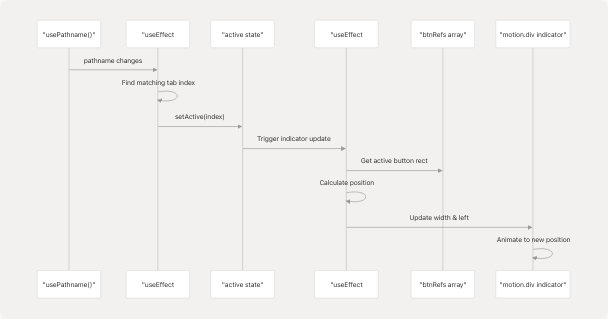
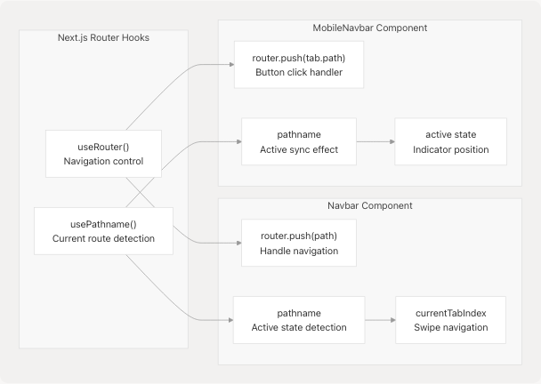

# Navigation & Mobile Experience

Relevant source files

* [README.md](https://github.com/tashifkhan/JIIT-time-table-website/blob/0ffdedf5/README.md)
* [website/components/mobile-navbar.tsx](https://github.com/tashifkhan/JIIT-time-table-website/blob/0ffdedf5/website/components/mobile-navbar.tsx)
* [website/components/navbar.tsx](https://github.com/tashifkhan/JIIT-time-table-website/blob/0ffdedf5/website/components/navbar.tsx)

## Purpose and Scope

This document describes the navigation system implementation, including the dual-navigation architecture (desktop sidebar and mobile bottom bar), swipe gesture support, and responsive design patterns. The navigation system provides consistent routing across five main pages while adapting to different screen sizes and input methods.

For information about specific page implementations, see the following pages:

* Schedule creation interface: [Schedule Generation](/tashifkhan/JIIT-time-table-website/4-schedule-generation-(core-feature))
* Timeline/calendar view: [Timeline View](/tashifkhan/JIIT-time-table-website/5-timeline-view)
* Academic calendar features: [Academic Calendar](/tashifkhan/JIIT-time-table-website/6-academic-calendar)
* Timetable comparison: [Compare Timetables](/tashifkhan/JIIT-time-table-website/7-compare-timetables)
* Dining schedules: [Mess Menu](/tashifkhan/JIIT-time-table-website/8-mess-menu)

---

## Navigation Architecture Overview

The application implements a dual-navigation pattern with distinct interfaces for desktop and mobile devices. Both navigation components share the same route configuration but render differently based on screen size.


```

**Sources:** [website/components/navbar.tsx1-201](https://github.com/tashifkhan/JIIT-time-table-website/blob/0ffdedf5/website/components/navbar.tsx#L1-L201) [website/components/mobile-navbar.tsx1-98](https://github.com/tashifkhan/JIIT-time-table-website/blob/0ffdedf5/website/components/mobile-navbar.tsx#L1-L98)

---

## Route Configuration

All navigation routes are defined in a centralized `tabs` array exported from `navbar.tsx`. This configuration is shared between both navigation components to ensure consistency.

### Tab Definition Structure

| Property | Type | Purpose |
| --- | --- | --- |
| `label` | string | Full label for desktop sidebar |
| `mobileLabel` | string | Abbreviated label for mobile bottom bar |
| `path` | string | Next.js route path |
| `icon` | LucideIcon | Icon component from lucide-react |

```

```

The `tabs` array is imported by `MobileNavbar` to maintain identical route definitions across both navigation implementations.

**Sources:** [website/components/navbar.tsx19-50](https://github.com/tashifkhan/JIIT-time-table-website/blob/0ffdedf5/website/components/navbar.tsx#L19-L50) [website/components/mobile-navbar.tsx6](https://github.com/tashifkhan/JIIT-time-table-website/blob/0ffdedf5/website/components/mobile-navbar.tsx#L6-L6)

---

## Desktop Sidebar Navigation

The desktop navigation renders as a fixed left sidebar visible only on medium and larger screens (`md:flex` breakpoint). It occupies a 256px width (`w-64`) and extends the full viewport height.

### Desktop Navigation Layout

```

```

### Active State Detection

Active route detection uses Next.js `usePathname()` with special handling for the root path:

* Root path (`/`): Exact match required (`pathname === "/"`)
* Other paths: Prefix match allowed (`pathname.startsWith(tab.path)`)

The active tab receives:

* Text color: `text-[#F0BB78]` (golden highlight)
* Background: `bg-[#F0BB78]/10` (10% opacity golden)
* Animated indicator: `motion.div` with `layoutId="activeTab"` for smooth transitions
* Right edge indicator: 1px vertical bar (`layoutId="activeIndicator"`)

**Sources:** [website/components/navbar.tsx102-177](https://github.com/tashifkhan/JIIT-time-table-website/blob/0ffdedf5/website/components/navbar.tsx#L102-L177) [website/components/navbar.tsx119-162](https://github.com/tashifkhan/JIIT-time-table-website/blob/0ffdedf5/website/components/navbar.tsx#L119-L162)

---

## Mobile Bottom Navigation

The mobile navigation bar renders as a fixed bottom element, visible only on small screens (`md:hidden`). It uses a horizontally scrollable layout with icons and abbreviated labels.

### Mobile Navigation Component Architecture

```

```

### Indicator Animation System

The mobile navbar uses a sliding indicator that animates between active tabs. The system tracks button positions using refs and calculates indicator dimensions dynamically.

**Indicator Update Flow:**

1. **Active State Change**: `useEffect` monitors `pathname` and updates `active` index [website/components/mobile-navbar.tsx17-26](https://github.com/tashifkhan/JIIT-time-table-website/blob/0ffdedf5/website/components/mobile-navbar.tsx#L17-L26)
2. **Position Calculation**: Second `useEffect` monitors `active` and calculates indicator position [website/components/mobile-navbar.tsx29-53](https://github.com/tashifkhan/JIIT-time-table-website/blob/0ffdedf5/website/components/mobile-navbar.tsx#L29-L53)
3. **Ref Management**: `btnRefs.current[]` array stores references to all tab buttons [website/components/mobile-navbar.tsx14](https://github.com/tashifkhan/JIIT-time-table-website/blob/0ffdedf5/website/components/mobile-navbar.tsx#L14-L14) [website/components/mobile-navbar.tsx73-75](https://github.com/tashifkhan/JIIT-time-table-website/blob/0ffdedf5/website/components/mobile-navbar.tsx#L73-L75)
4. **Rectangle Calculation**: `getBoundingClientRect()` measures button and container positions [website/components/mobile-navbar.tsx35-36](https://github.com/tashifkhan/JIIT-time-table-website/blob/0ffdedf5/website/components/mobile-navbar.tsx#L35-L36)
5. **Style Update**: `setIndicatorStyle()` updates `{width, left}` for animation [website/components/mobile-navbar.tsx38-41](https://github.com/tashifkhan/JIIT-time-table-website/blob/0ffdedf5/website/components/mobile-navbar.tsx#L38-L41)
6. **Animation**: Framer Motion's `motion.div` animates to new dimensions [website/components/mobile-navbar.tsx62-66](https://github.com/tashifkhan/JIIT-time-table-website/blob/0ffdedf5/website/components/mobile-navbar.tsx#L62-L66)

**Animation Configuration:**

* Type: Spring animation
* Stiffness: 400
* Damping: 30

### Mobile Tab Button Layout

Each tab button contains:

* Icon: 20px size from lucide-react
* Label: 10px text with abbreviated name
* Flex column layout for vertical stacking
* Active color: `text-[#F0BB78]`
* Inactive color: `text-slate-400` with hover effect

**Sources:** [website/components/mobile-navbar.tsx1-98](https://github.com/tashifkhan/JIIT-time-table-website/blob/0ffdedf5/website/components/mobile-navbar.tsx#L1-L98) [website/components/mobile-navbar.tsx55-94](https://github.com/tashifkhan/JIIT-time-table-website/blob/0ffdedf5/website/components/mobile-navbar.tsx#L55-L94)

---

## Swipe Gesture Navigation

The application implements horizontal swipe gestures for mobile navigation using the `react-swipeable` library. Swipe navigation allows users to move between pages with left/right gestures.

### Swipe Handler Configuration

```

```

### Swipe Navigation Flow

**Left Swipe (Forward Navigation):**

1. User swipes left on screen
2. Check if current page is timeline (`isTimelinePage`)
3. If timeline, return early (disable navigation)
4. Calculate next index: `(currentTabIndex + 1) % tabs.length`
5. Navigate to `tabs[nextIndex].path` using `router.push()`

**Right Swipe (Backward Navigation):**

1. User swipes right on screen
2. Check if current page is timeline
3. If timeline, return early (disable navigation)
4. Calculate previous index: `currentTabIndex <= 0 ? tabs.length - 1 : currentTabIndex - 1`
5. Navigate to `tabs[prevIndex].path`

**Timeline Page Exception:**

Swipe navigation is explicitly disabled on the timeline page (`/timeline`) to prevent conflicts with the timeline's own horizontal scrolling functionality. The check occurs at line [website/components/navbar.tsx76](https://github.com/tashifkhan/JIIT-time-table-website/blob/0ffdedf5/website/components/navbar.tsx#L76-L76) and early returns in both swipe handlers [website/components/navbar.tsx81](https://github.com/tashifkhan/JIIT-time-table-website/blob/0ffdedf5/website/components/navbar.tsx#L81-L81) [website/components/navbar.tsx88](https://github.com/tashifkhan/JIIT-time-table-website/blob/0ffdedf5/website/components/navbar.tsx#L88-L88)

### Swipe Area Implementation

Two invisible touch target areas are rendered at the left and right edges of the screen to capture swipe gestures:

| Area | Position | Dimensions | Purpose |
| --- | --- | --- | --- |
| Left Edge | `fixed left-0` | `w-6` (24px) | Capture right swipe gestures |
| Right Edge | `fixed right-0` | `w-6` (24px) | Capture left swipe gestures |

Both areas:

* Span from top to bottom of viewport
* Exclude the top navbar area on mobile (`top-20`)
* Adjust for desktop sidebar (`md:ml-48 md:top-0`)
* Are conditionally rendered only when NOT on timeline page (`!isTimelinePage`)
* Use `pointer-events-auto` for touch capture
* Have transparent backgrounds

**Sources:** [website/components/navbar.tsx78-98](https://github.com/tashifkhan/JIIT-time-table-website/blob/0ffdedf5/website/components/navbar.tsx#L78-L98) [website/components/navbar.tsx180-195](https://github.com/tashifkhan/JIIT-time-table-website/blob/0ffdedf5/website/components/navbar.tsx#L180-L195) [README.md32-33](https://github.com/tashifkhan/JIIT-time-table-website/blob/0ffdedf5/README.md#L32-L33) [README.md210-213](https://github.com/tashifkhan/JIIT-time-table-website/blob/0ffdedf5/README.md#L210-L213)

---

## Responsive Design Breakpoints

The navigation system uses Tailwind CSS breakpoint utilities to switch between mobile and desktop modes.

### Breakpoint Configuration

| Breakpoint | Class Prefix | Viewport Width | Navigation Mode |
| --- | --- | --- | --- |
| Default (mobile) | (none) | < 768px | Bottom bar visible, sidebar hidden |
| Medium+ (desktop) | `md:` | ≥ 768px | Sidebar visible, bottom bar hidden |

### Component Visibility Controls

**Desktop Sidebar:**

* Base: `hidden` (not displayed on mobile)
* Medium+: `md:flex` (displayed as flexbox)
* Implementation: [website/components/navbar.tsx103](https://github.com/tashifkhan/JIIT-time-table-website/blob/0ffdedf5/website/components/navbar.tsx#L103-L103)

**Mobile Bottom Bar:**

* Container: `md:hidden` (hidden on medium+ screens)
* Implementation: [website/components/mobile-navbar.tsx56](https://github.com/tashifkhan/JIIT-time-table-website/blob/0ffdedf5/website/components/mobile-navbar.tsx#L56-L56)

**Swipe Areas:**

* Mobile positioning: `top-20` (below mobile header)
* Desktop adjustment: `md:ml-48 md:top-0` (account for sidebar)
* Implementation: [website/components/navbar.tsx185](https://github.com/tashifkhan/JIIT-time-table-website/blob/0ffdedf5/website/components/navbar.tsx#L185-L185) [website/components/navbar.tsx191](https://github.com/tashifkhan/JIIT-time-table-website/blob/0ffdedf5/website/components/navbar.tsx#L191-L191)

---

## Navigation State Management

Both navigation components use Next.js routing hooks for state management and navigation control.

### Routing Hook Usage

```

```

### Active Route Detection Logic

Both components implement identical logic for determining the active tab:

**Root Path Special Case:**

```
```
if (tab.path === "/" && pathname === "/") return true;
```
```

**Other Paths Prefix Matching:**

```
```
if (tab.path !== "/" && pathname.startsWith(tab.path)) return true;
```
```

This logic ensures that:

* Root path (`/`) only matches exact pathname `/`
* Other paths match any route that starts with their path (e.g., `/timeline` matches `/timeline/anything`)

**Implementation Locations:**

* Desktop navbar: [website/components/navbar.tsx59-63](https://github.com/tashifkhan/JIIT-time-table-website/blob/0ffdedf5/website/components/navbar.tsx#L59-L63) [website/components/navbar.tsx120-123](https://github.com/tashifkhan/JIIT-time-table-website/blob/0ffdedf5/website/components/navbar.tsx#L120-L123)
* Mobile navbar: [website/components/mobile-navbar.tsx18-22](https://github.com/tashifkhan/JIIT-time-table-website/blob/0ffdedf5/website/components/mobile-navbar.tsx#L18-L22)

---

## Animation and Visual Effects

The navigation system uses Framer Motion for smooth transitions and visual feedback.

### Desktop Sidebar Animations

**Initial Load Animation:**

* Entry from left: `initial={{ x: -100, opacity: 0 }}`
* Animate to visible: `animate={{ x: 0, opacity: 1 }}`
* Duration: 0.5 seconds
* Implementation: [website/components/navbar.tsx104-106](https://github.com/tashifkhan/JIIT-time-table-website/blob/0ffdedf5/website/components/navbar.tsx#L104-L106)

**Active Tab Indicator:**

* Component: `motion.div` with `layoutId="activeTab"`
* Transition: Spring animation (stiffness: 500, damping: 30)
* Effect: Smooth background animation when switching tabs
* Implementation: [website/components/navbar.tsx135-144](https://github.com/tashifkhan/JIIT-time-table-website/blob/0ffdedf5/website/components/navbar.tsx#L135-L144)

**Right Edge Indicator:**

* Component: `motion.div` with `layoutId="activeIndicator"`
* Visual: Vertical bar on right edge of active tab
* Implementation: [website/components/navbar.tsx155-158](https://github.com/tashifkhan/JIIT-time-table-website/blob/0ffdedf5/website/components/navbar.tsx#L155-L158)

### Mobile Bottom Bar Animations

**Sliding Indicator:**

* Animated properties: `width` and `left` position
* Transition type: Spring (stiffness: 400, damping: 30)
* Updates: Responds to screen resize events
* Delay: 50ms timeout for layout stabilization
* Implementation: [website/components/mobile-navbar.tsx62-66](https://github.com/tashifkhan/JIIT-time-table-website/blob/0ffdedf5/website/components/mobile-navbar.tsx#L62-L66) [website/components/mobile-navbar.tsx46](https://github.com/tashifkhan/JIIT-time-table-website/blob/0ffdedf5/website/components/mobile-navbar.tsx#L46-L46)

### Visual Design Theme

**Color Palette:**

* Active state: `#F0BB78` (golden/tan color)
* Active background: `#F0BB78/10` (10% opacity)
* Inactive text: `text-slate-400`
* Hover text: `text-slate-200`
* Background: `bg-[#0a0a0a]/95` with backdrop blur

**Glassmorphism Effects:**

* Backdrop blur: `backdrop-blur-xl`
* Semi-transparent backgrounds
* Border overlays: `border-white/10`

**Sources:** [website/components/navbar.tsx102-177](https://github.com/tashifkhan/JIIT-time-table-website/blob/0ffdedf5/website/components/navbar.tsx#L102-L177) [website/components/mobile-navbar.tsx55-94](https://github.com/tashifkhan/JIIT-time-table-website/blob/0ffdedf5/website/components/mobile-navbar.tsx#L55-L94)

---

## Integration with Application Layout

The navigation components are rendered at the application root level and persist across all pages.

### Layout Integration Pattern

```


### Z-Index Layering

| Element | Z-Index | Purpose |
| --- | --- | --- |
| Desktop Sidebar | `z-50` | Above page content |
| Mobile Bottom Bar | `z-50` | Above page content |
| Swipe Detection Areas | `z-20` | Below navigation, above content |

### Content Margin Adjustment

The desktop sidebar occupies 256px (`w-64`) of horizontal space. Page content automatically adjusts on desktop screens to account for this offset, though specific margin implementations are handled by individual page layouts rather than the navigation component itself.

**Sources:** [website/components/navbar.tsx102-177](https://github.com/tashifkhan/JIIT-time-table-website/blob/0ffdedf5/website/components/navbar.tsx#L102-L177) [website/components/mobile-navbar.tsx56-59](https://github.com/tashifkhan/JIIT-time-table-website/blob/0ffdedf5/website/components/mobile-navbar.tsx#L56-L59)

---

## Touch Optimization

The mobile navigation implements several touch-specific optimizations for improved user experience on mobile devices.

### Touch Target Sizing

**Mobile Bottom Bar Buttons:**

* Minimum touch area: 44px height (iOS guideline compliance)
* Padding: `px-1 py-2` provides adequate touch targets
* Flex-1 width: Each button takes equal space
* Implementation: [website/components/mobile-navbar.tsx77-82](https://github.com/tashifkhan/JIIT-time-table-website/blob/0ffdedf5/website/components/mobile-navbar.tsx#L77-L82)

**Swipe Detection Areas:**

* Width: 24px (`w-6`) for edge-to-edge swipes
* Height: Full viewport (`top-20 bottom-0` on mobile)
* Transparent background: No visual interference
* Implementation: [website/components/navbar.tsx183-194](https://github.com/tashifkhan/JIIT-time-table-website/blob/0ffdedf5/website/components/navbar.tsx#L183-L194)

### Gesture Configuration

**React Swipeable Settings:**

* Minimum delta: 50px (prevents accidental swipes)
* Touch tracking: Enabled for mobile gestures
* Mouse tracking: Enabled for desktop testing
* Scroll prevention: Disabled to allow vertical scrolling
* Implementation: [website/components/navbar.tsx94-97](https://github.com/tashifkhan/JIIT-time-table-website/blob/0ffdedf5/website/components/navbar.tsx#L94-L97)

### Hover State Handling

Mobile buttons use color transitions instead of hover backgrounds to avoid "sticky" hover states on touch devices:

* Active: `text-[#F0BB78]`
* Inactive: `text-slate-400 hover:text-slate-200`
* No background color changes on hover

**Sources:** [website/components/mobile-navbar.tsx77-89](https://github.com/tashifkhan/JIIT-time-table-website/blob/0ffdedf5/website/components/mobile-navbar.tsx#L77-L89) [website/components/navbar.tsx78-98](https://github.com/tashifkhan/JIIT-time-table-website/blob/0ffdedf5/website/components/navbar.tsx#L78-L98)

---

## Known Limitations and Considerations

### Timeline Page Swipe Conflict

Swipe navigation is explicitly disabled on the `/timeline` route to prevent conflicts with the timeline's horizontal day-switching gestures. This is enforced by the `isTimelinePage` check in both swipe handlers.

**Rationale:** The timeline view has its own swipe gestures for navigating between days/weeks, which would conflict with the global page navigation swipes.

**Implementation:** [website/components/navbar.tsx76](https://github.com/tashifkhan/JIIT-time-table-website/blob/0ffdedf5/website/components/navbar.tsx#L76-L76) [website/components/navbar.tsx81](https://github.com/tashifkhan/JIIT-time-table-website/blob/0ffdedf5/website/components/navbar.tsx#L81-L81) [website/components/navbar.tsx88](https://github.com/tashifkhan/JIIT-time-table-website/blob/0ffdedf5/website/components/navbar.tsx#L88-L88)

### Mobile Bottom Bar Screen Real Estate

The mobile bottom navigation bar is fixed at the bottom of the screen with a height of approximately 80px (including margins). This reduces available screen space for page content on mobile devices.

**Positioning:** `fixed bottom-6` with `max-w-md` and 90% width

### Indicator Animation Dependencies

The mobile navbar's sliding indicator relies on DOM measurement APIs (`getBoundingClientRect`) which may not be immediately available during server-side rendering or initial hydration. A 50ms timeout is used to ensure layout stability before calculating positions.

**Implementation:** [website/components/mobile-navbar.tsx46](https://github.com/tashifkhan/JIIT-time-table-website/blob/0ffdedf5/website/components/mobile-navbar.tsx#L46-L46)

### Browser Compatibility

**Swipe Gestures:** Require modern touch event support (not supported in older browsers)

**Backdrop Blur:** The `backdrop-blur-xl` effect requires browser support for CSS backdrop-filter property

**Framer Motion:** Animations require JavaScript enabled; navigation remains functional without animations but loses visual polish

**Sources:** [website/components/navbar.tsx75-98](https://github.com/tashifkhan/JIIT-time-table-website/blob/0ffdedf5/website/components/navbar.tsx#L75-L98) [website/components/mobile-navbar.tsx29-53](https://github.com/tashifkhan/JIIT-time-table-website/blob/0ffdedf5/website/components/mobile-navbar.tsx#L29-L53)