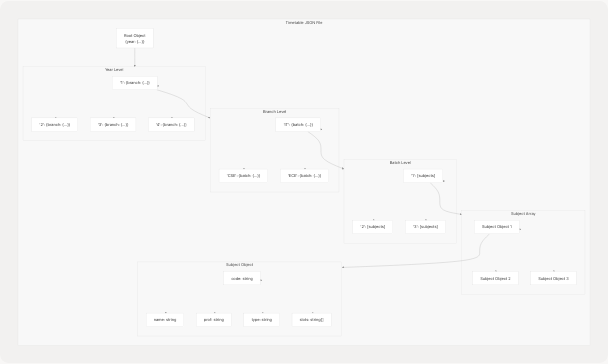
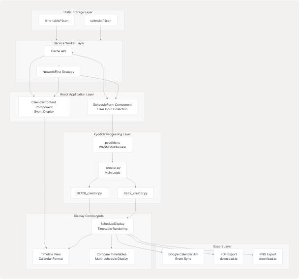

# Timetable Data Format Reference

> Source: https://deepwiki.com/tashifkhan/JIIT-time-table-website/11-timetable-data-format-reference

# Timetable Data Format Reference

Relevant source files

* [README.md](https://github.com/tashifkhan/JIIT-time-table-website/blob/0ffdedf5/README.md)

## Purpose and Scope

This document defines the JSON data formats used for timetable and academic calendar storage in the JIIT Time Table application. It covers the structure of timetable JSON files, academic calendar JSON files, directory organization, API endpoints for data access, and the data generation pipeline using `json_creater.py`.

For information about how this data is processed by Python modules, see [Python Processing Pipeline](/tashifkhan/JIIT-time-table-website/4.2-python-processing-pipeline). For details on how the data is consumed by React components, see [Data Model & Types](/tashifkhan/JIIT-time-table-website/3.4-data-model-and-types).

**Sources:** [README.md1-138](https://github.com/tashifkhan/JIIT-time-table-website/blob/0ffdedf5/README.md#L1-L138)

---

## Data Directory Structure

All static JSON data is stored in the `/public/data/` directory, organized hierarchically by data type, academic period, and campus variant.


```

### Directory Organization

| Directory Path | Purpose | Contents |
| --- | --- | --- |
| `/public/data/time-table/` | Timetable data storage | Semester-specific subdirectories (ODD25, EVEN25) |
| `/public/data/time-table/ODD25/` | Odd semester 2025 timetables | `62.json`, `128.json`, `BCA.json` |
| `/public/data/time-table/EVEN25/` | Even semester 2025 timetables | `62.json`, `128.json` |
| `/public/data/calender/` | Academic calendar data | Academic year subdirectories (2425, 2526) |
| `/public/data/calender/2425/` | Academic year 2024-25 | `calendar.json` |
| `/public/data/calender/2526/` | Academic year 2025-26 | `calender.json` |
| `/public/modules/` | Python processing modules | `BE128_creator.py`, `BE62_creator.py` |

**Sources:** [README.md68-97](https://github.com/tashifkhan/JIIT-time-table-website/blob/0ffdedf5/README.md#L68-L97)

---

## Timetable JSON Format

### File Naming Convention

Timetable files follow the pattern: `<campus>.json` where campus is one of:

* `62` - 62 Campus (Noida Sector 62)
* `128` - 128 Campus (Noida Sector 128)
* `BCA` - BCA Program (available only for ODD semesters)

### Access Paths

Timetable JSON files are accessed via the following URL pattern:

```
/data/time-table/<SEMESTER>/<CAMPUS>.json
```

Examples:

* `/data/time-table/ODD25/62.json`
* `/data/time-table/ODD25/128.json`
* `/data/time-table/ODD25/BCA.json`
* `/data/time-table/EVEN25/62.json`
* `/data/time-table/EVEN25/128.json`

### Data Structure

```

```

### Subject Object Schema

Each subject in the timetable JSON follows this structure:

| Field | Type | Description | Example |
| --- | --- | --- | --- |
| `code` | `string` | Subject code identifier | `"22B11CI111"` |
| `name` | `string` | Full subject name | `"Data Structures"` |
| `prof` | `string` | Professor/Instructor name | `"Dr. John Doe"` |
| `type` | `string` | Class type (Lecture/Lab/Tutorial) | `"Lecture"`, `"Lab"`, `"Tutorial"` |
| `slots` | `string[]` | Array of time slot identifiers | `["L1", "L2", "L3"]` |

### Time Slot Identifiers

Time slots use standard JIIT notation:

* Lecture slots: `L1`, `L2`, `L3`, `L4`, `L5`, `L6`, `L7`, `L8`, `L9`
* Lab slots: `LA1`, `LA2`, `LB1`, `LB2`, `LC1`, `LC2`, etc.
* Tutorial slots: `T1`, `T2`, `T3`, etc.

### Example Timetable JSON Structure

```
```
{
  "1": {
    "IT": {
      "1": [
        {
          "code": "22B11CI111",
          "name": "Data Structures",
          "prof": "Dr. John Doe",
          "type": "Lecture",
          "slots": ["L1", "L2", "L3"]
        },
        {
          "code": "22B11CI112",
          "name": "Data Structures Lab",
          "prof": "Dr. John Doe",
          "type": "Lab",
          "slots": ["LA1", "LA2"]
        }
      ],
      "2": [
        // Batch 2 subjects
      ]
    },
    "CSE": {
      // CSE branch data
    }
  },
  "2": {
    // Year 2 data
  }
}
```
```

**Sources:** [README.md56-64](https://github.com/tashifkhan/JIIT-time-table-website/blob/0ffdedf5/README.md#L56-L64) [README.md68-97](https://github.com/tashifkhan/JIIT-time-table-website/blob/0ffdedf5/README.md#L68-L97)

---

## Academic Calendar JSON Format

### File Naming Convention

Academic calendar files are named `calender.json` (note the spelling variant) and organized by academic year.

### Access Paths

Academic calendar JSON files are accessed via:

```
/data/calender/<ACADEMIC_YEAR>/calender.json
```

Examples:

* `/data/calender/2425/calendar.json` (2024-25 academic year)
* `/data/calender/2526/calender.json` (2025-26 academic year)

Note: The 2425 directory uses `calendar.json` while 2526 uses `calender.json` (inconsistent spelling in the codebase).

### Event Object Schema

Each event in the academic calendar follows this structure:

| Field | Type | Description | Example |
| --- | --- | --- | --- |
| `title` | `string` | Event name | `"Mid-Term Examination"` |
| `startDate` | `string` | ISO 8601 date format | `"2025-03-15"` |
| `endDate` | `string` | ISO 8601 date format | `"2025-03-20"` |
| `description` | `string` (optional) | Event details | `"Mid-term exams for all branches"` |
| `category` | `string` | Event category | `"Examination"`, `"Holiday"`, `"Event"` |

### Example Academic Calendar JSON Structure

```
```
[
  {
    "title": "Mid-Term Examination",
    "startDate": "2025-03-15",
    "endDate": "2025-03-20",
    "description": "Mid-term exams for all branches",
    "category": "Examination"
  },
  {
    "title": "Spring Break",
    "startDate": "2025-04-01",
    "endDate": "2025-04-07",
    "category": "Holiday"
  },
  {
    "title": "Tech Fest",
    "startDate": "2025-05-10",
    "endDate": "2025-05-12",
    "description": "Annual technical festival",
    "category": "Event"
  }
]
```
```

### Event Categories

Common event categories include:

* `"Examination"` - Mid-term, end-term, re-examination periods
* `"Holiday"` - University holidays, breaks
* `"Event"` - Fests, seminars, workshops
* `"Registration"` - Course registration periods
* `"Academic"` - Semester start/end dates

**Sources:** [README.md12-13](https://github.com/tashifkhan/JIIT-time-table-website/blob/0ffdedf5/README.md#L12-L13) [README.md74-78](https://github.com/tashifkhan/JIIT-time-table-website/blob/0ffdedf5/README.md#L74-L78)

---

## Data Access Endpoints

The application serves timetable and calendar data as static JSON files through predictable URL patterns.

```

```

### Timetable Endpoints

| Endpoint Pattern | Parameters | Returns |
| --- | --- | --- |
| `/data/time-table/<SEMESTER>/<CAMPUS>.json` | `SEMESTER`: `ODD25`, `EVEN25` `CAMPUS`: `62`, `128`, `BCA` | Timetable JSON for specified semester and campus |

### Academic Calendar Endpoints

| Endpoint Pattern | Parameters | Returns |
| --- | --- | --- |
| `/data/calender/<YEAR>/calender.json` | `YEAR`: `2425`, `2526`, etc. | Academic calendar events array |

### cURL Examples

Fetch 62 campus timetable for Odd 2025 semester:

```
```
curl https://simple-timetable.tashif.codes/data/time-table/ODD25/62.json
```
```

Fetch 128 campus timetable for Even 2025 semester:

```
```
curl https://simple-timetable.tashif.codes/data/time-table/EVEN25/128.json
```
```

Fetch academic calendar for 2025-26:

```
```
curl https://simple-timetable.tashif.codes/data/calender/2526/calender.json
```
```

**Sources:** [README.md53-64](https://github.com/tashifkhan/JIIT-time-table-website/blob/0ffdedf5/README.md#L53-L64)

---

## Data Generation Pipeline

The timetable and calendar data is generated from Excel files using external parsers and a Streamlit application (`json_creater.py`).

### json\_creater.py

The `json_creater.py` file is a Streamlit application that converts Excel files into the structured JSON format required by the application.

**Location:** Root directory (`json_creater.py`)

**Purpose:**

* Convert raw Excel timetable data into hierarchical JSON structure
* Organize data by year, branch, and batch
* Generate properly formatted academic calendar JSON
* Validate data structure before output

**Workflow:**

1. User uploads Excel files through Streamlit interface
2. Parser scripts extract structured data from Excel
3. `json_creater.py` processes and organizes data
4. JSON files are written to `/public/data/` directory
5. Files are committed to repository for deployment

### External Parser Dependencies

The data generation relies on two external parser projects:

| Parser | Repository | Purpose |
| --- | --- | --- |
| **JIIT Time Table Parser** | [github.com/tashifkhan/JIIT-time-table-parser](https://github.com/tashifkhan/JIIT-time-table-website/blob/0ffdedf5/github.com/tashifkhan/JIIT-time-table-parser) | Extracts timetable data from Excel files |
| **JIIT Academic Calendar Parser** | [github.com/tashifkhan/JIIT-Academic-Calender](https://github.com/tashifkhan/JIIT-time-table-website/blob/0ffdedf5/github.com/tashifkhan/JIIT-Academic-Calender) | Extracts academic calendar events from Excel files |

**Sources:** [README.md12-16](https://github.com/tashifkhan/JIIT-time-table-website/blob/0ffdedf5/README.md#L12-L16) [README.md71](https://github.com/tashifkhan/JIIT-time-table-website/blob/0ffdedf5/README.md#L71-L71) [README.md190-202](https://github.com/tashifkhan/JIIT-time-table-website/blob/0ffdedf5/README.md#L190-L202)

---

## Data Consumption Flow

The JSON data flows through multiple layers of the application from storage to display.

```

```

### Data Loading Process

1. **Initial Request:** React component requests timetable data for specific semester/campus
2. **Service Worker Interception:** Request intercepted by service worker (`sw.js`)
3. **Cache Check:** Service worker checks cache storage for existing data
4. **Network Fallback:** If not cached, fetch from network
5. **Cache Update:** Store fetched data in cache for offline access

### Data Processing Pipeline

1. **User Input:** User selects campus, year, branch, batch via `ScheduleForm`
2. **JSON Retrieval:** Appropriate JSON file fetched via service worker
3. **Pyodide Processing:** JSON passed to Python modules via `pyodide.ts` middleware
4. **Schedule Generation:** `_creator.py` and branch-specific modules process data
5. **React Rendering:** Processed schedule returned to React components
6. **Display:** `ScheduleDisplay` renders color-coded timetable

### Academic Calendar Flow

1. **Calendar Selection:** User navigates to academic calendar page
2. **JSON Fetch:** Calendar JSON fetched for selected academic year
3. **Event Parsing:** Events parsed and formatted by `CalendarContent`
4. **Display:** Events shown in calendar grid or list view
5. **Export:** Optional sync to Google Calendar via Google Calendar API

**Sources:** [README.md140-146](https://github.com/tashifkhan/JIIT-time-table-website/blob/0ffdedf5/README.md#L140-L146) [README.md56-64](https://github.com/tashifkhan/JIIT-time-table-website/blob/0ffdedf5/README.md#L56-L64)

---

## JSON Schema Validation

While the application does not enforce strict schema validation, the expected structure is implicitly defined by the Python processing modules and React components.

### Timetable JSON Expected Structure

```
```
// TypeScript type definition (inferred from usage)
type TimetableData = {
  [year: string]: {
    [branch: string]: {
      [batch: string]: Subject[]
    }
  }
}

type Subject = {
  code: string
  name: string
  prof: string
  type: "Lecture" | "Lab" | "Tutorial"
  slots: string[]
}
```
```

### Academic Calendar JSON Expected Structure

```
```
// TypeScript type definition (inferred from usage)
type CalendarData = CalendarEvent[]

type CalendarEvent = {
  title: string
  startDate: string  // ISO 8601 format
  endDate: string    // ISO 8601 format
  description?: string
  category: string
}
```
```

### Data Integrity Requirements

| Requirement | Timetable JSON | Calendar JSON |
| --- | --- | --- |
| **Required Fields** | `code`, `name`, `prof`, `type`, `slots` | `title`, `startDate`, `endDate`, `category` |
| **Optional Fields** | None | `description` |
| **Date Format** | N/A | ISO 8601 (`YYYY-MM-DD`) |
| **Slot Format** | JIIT standard notation | N/A |
| **Nested Structure** | Year → Branch → Batch → Subjects | Flat array |
| **Empty Values** | Not allowed | `description` can be empty |

**Sources:** [README.md68-97](https://github.com/tashifkhan/JIIT-time-table-website/blob/0ffdedf5/README.md#L68-L97)

---

## Caching and Offline Access

The service worker implements aggressive caching for JSON data to enable offline functionality.

### Cache Strategy

| Resource Type | Strategy | Cache Name | TTL |
| --- | --- | --- | --- |
| Timetable JSON | NetworkFirst → CacheFirst | `workbox-precache-v2` | Build-time precache |
| Calendar JSON | NetworkFirst → CacheFirst | `workbox-precache-v2` | Build-time precache |
| Static assets | Precache | `workbox-precache-v2` | Indefinite |

### Precache Manifest

During build, Next.js with `@ducanh2912/next-pwa` generates a precache manifest that includes all JSON data files:

```
```
// Generated precache manifest (example)
[
  {
    "url": "/data/time-table/ODD25/62.json",
    "revision": "abc123..."
  },
  {
    "url": "/data/time-table/ODD25/128.json",
    "revision": "def456..."
  },
  {
    "url": "/data/calender/2526/calender.json",
    "revision": "ghi789..."
  }
]
```
```

### Offline Behavior

When offline:

1. Service worker serves all resources from cache
2. Timetable generation continues using cached JSON + Pyodide WASM
3. Academic calendar displays cached events
4. Google Calendar sync is disabled (requires network)
5. Export functions (PDF/PNG) continue to work

**Sources:** [README.md21](https://github.com/tashifkhan/JIIT-time-table-website/blob/0ffdedf5/README.md#L21-L21) [README.md96](https://github.com/tashifkhan/JIIT-time-table-website/blob/0ffdedf5/README.md#L96-L96)

---

## Updating Timetable Data

When new semester data becomes available, the update process is:

```


### Update Checklist

* Obtain latest timetable Excel files from JIIT
* Run JIIT Time Table Parser on Excel files
* Run JIIT Academic Calendar Parser for calendar events
* Execute `json_creater.py` to generate JSON files
* Verify JSON structure matches expected schema
* Check all year/branch/batch combinations present
* Validate date formats in calendar JSON
* Commit changes to Git repository
* Trigger deployment pipeline
* Verify service worker updates on live site
* Test offline functionality with new data

**Sources:** [README.md12-16](https://github.com/tashifkhan/JIIT-time-table-website/blob/0ffdedf5/README.md#L12-L16) [README.md71](https://github.com/tashifkhan/JIIT-time-table-website/blob/0ffdedf5/README.md#L71-L71)

---

## Common Data Issues and Troubleshooting

| Issue | Symptom | Solution |
| --- | --- | --- |
| **Missing Branch** | Branch not appearing in dropdown | Add branch data to year object in JSON |
| **Empty Batch** | No subjects for selected batch | Verify batch number exists in JSON structure |
| **Invalid Slots** | Schedule not rendering correctly | Ensure slot identifiers match JIIT notation |
| **Date Parse Error** | Calendar events not displaying | Validate ISO 8601 date format (`YYYY-MM-DD`) |
| **Missing Electives** | Elective subjects not available | Check subject type is correctly set |
| **Cache Stale Data** | Old timetable showing after update | Clear browser cache and service worker cache |
| **JSON Syntax Error** | Application fails to load | Validate JSON syntax using linter |
| **Inconsistent Structure** | Some years/branches broken | Ensure all levels follow hierarchy: year → branch → batch → subjects |

### Validation Commands

Check JSON validity:

```
```
# Validate timetable JSON
jq empty public/data/time-table/ODD25/62.json

# Validate calendar JSON
jq empty public/data/calender/2526/calender.json
```
```

**Sources:** [README.md215-223](https://github.com/tashifkhan/JIIT-time-table-website/blob/0ffdedf5/README.md#L215-L223)