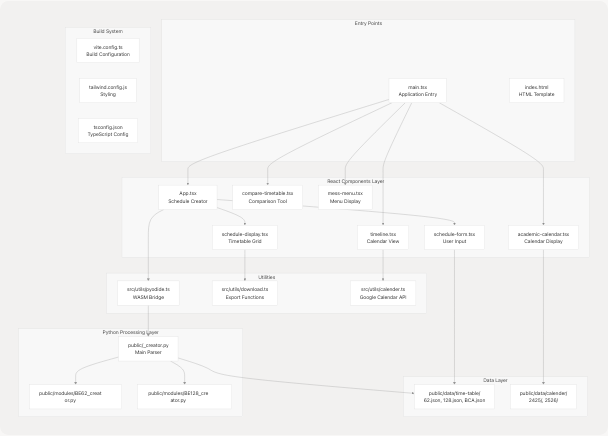
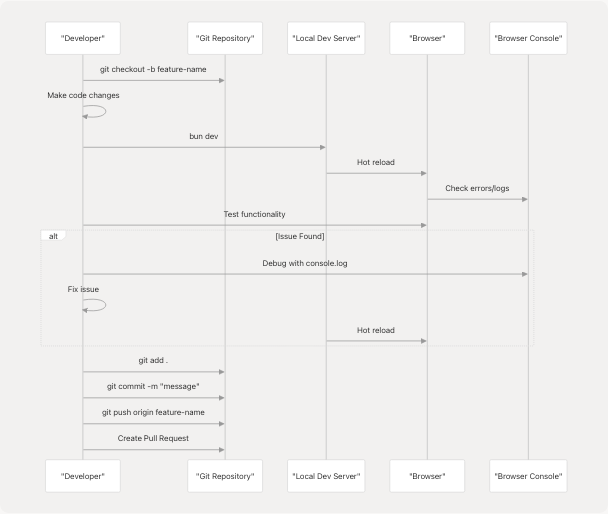
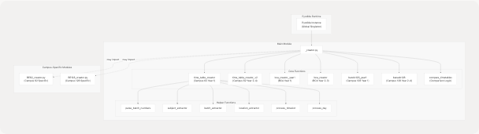
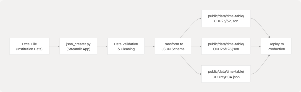

# Development Guide

Relevant source files

* [.gitignore](https://github.com/tashifkhan/JIIT-time-table-website/blob/0ffdedf5/.gitignore)
* [README.md](https://github.com/tashifkhan/JIIT-time-table-website/blob/0ffdedf5/README.md)
* [website/app/layout.tsx](https://github.com/tashifkhan/JIIT-time-table-website/blob/0ffdedf5/website/app/layout.tsx)
* [website/next.config.ts](https://github.com/tashifkhan/JIIT-time-table-website/blob/0ffdedf5/website/next.config.ts)
* [website/public/sw.js](https://github.com/tashifkhan/JIIT-time-table-website/blob/0ffdedf5/website/public/sw.js)
* [website/public/workbox-da59eb65.js](https://github.com/tashifkhan/JIIT-time-table-website/blob/0ffdedf5/website/public/workbox-da59eb65.js)

This document provides comprehensive instructions for developers working on the JIIT Timetable Creator. It covers environment setup, development workflows, modifying Python processing logic, managing timetable data, and deployment procedures.

For information about the system architecture, see [System Architecture](/tashifkhan/JIIT-time-table-website/3-system-architecture). For details on specific features, refer to pages [4](/tashifkhan/JIIT-time-table-website/4-schedule-generation-(core-feature)) through [10](/tashifkhan/JIIT-time-table-website/10-navigation-and-mobile-experience).

---

## Environment Setup

### Prerequisites

The following software must be installed on your development machine:

| Tool | Minimum Version | Purpose |
| --- | --- | --- |
| Node.js | 16.x or higher | JavaScript runtime |
| bun or npm | Latest stable | Package manager |
| Python | 3.8+ | For data preparation scripts |
| Git | Latest | Version control |

### Installation Steps

**Step 1: Clone Repository**

```
```
git clone https://github.com/tashifkhan/JIIT-time-table-website
cd JIIT-time-table-website
```
```

**Step 2: Install Dependencies**

Using bun (recommended):

```
```
bun install
```
```

Using npm:

```
```
npm install
```
```

**Step 3: Start Development Server**

Using bun:

```
```
bun dev
```
```

Using npm:

```
```
npm run dev
```
```

The application will be available at `http://localhost:5173`

**Step 4: Verify Setup**

Access the application in a browser and confirm:

* The form loads without errors
* Pyodide initializes (check browser console)
* Static JSON data loads from `/data/time-table/ODD25/`

Sources: [README.md148-186](https://github.com/tashifkhan/JIIT-time-table-website/blob/0ffdedf5/README.md#L148-L186)

---

## Project Structure Reference

The codebase is organized into distinct layers with clear separation of concerns:


```

### Key Directories

| Directory | Purpose | Key Files |
| --- | --- | --- |
| `src/` | React application source | `App.tsx`, `main.tsx` |
| `src/components/` | UI components | `schedule-form.tsx`, `schedule-display.tsx`, `timeline.tsx` |
| `src/utils/` | Helper utilities | `pyodide.ts`, `download.ts`, `calender.ts` |
| `src/context/` | State management | `userContext.ts`, `userContextProvider.tsx` |
| `public/` | Static assets | `_creator.py`, `manifest.json`, `service-worker.js` |
| `public/data/` | JSON data files | `time-table/`, `calender/` |
| `public/modules/` | Python modules | `BE62_creator.py`, `BE128_creator.py` |

Sources: [README.md66-138](https://github.com/tashifkhan/JIIT-time-table-website/blob/0ffdedf5/README.md#L66-L138) [src/main.tsx1-73](https://github.com/tashifkhan/JIIT-time-table-website/blob/0ffdedf5/src/main.tsx#L1-L73)

---

## Development Workflow

### Development Cycle

```

```

### Hot Module Replacement

The development server uses Vite's HMR (Hot Module Replacement). Changes to the following trigger automatic reloads:

* **React Components** (`.tsx`, `.jsx`): Instant update without page refresh
* **CSS/Tailwind** (`.css`): Instant style injection
* **TypeScript** (`.ts`): Compiles and updates affected modules
* **Python Files** (`_creator.py`): Requires manual page refresh to reload Pyodide

### Debugging Tools

**Browser Console Logging**

Key log points in the application:

* [src/App.tsx140](https://github.com/tashifkhan/JIIT-time-table-website/blob/0ffdedf5/src/App.tsx#L140-L140): Logs selected Python function name
* [src/App.tsx174-178](https://github.com/tashifkhan/JIIT-time-table-website/blob/0ffdedf5/src/App.tsx#L174-L178): Logs mapping data and form inputs
* [public/\_creator.py429-437](https://github.com/tashifkhan/JIIT-time-table-website/blob/0ffdedf5/public/_creator.py#L429-L437): Logs processing inputs in Python

**React DevTools**

Install React DevTools browser extension to inspect:

* Component hierarchy
* Props and state
* Context values from `UserContext`

**Network Tab Inspection**

Monitor these requests:

* `/data/time-table/ODD25/62.json` - Timetable data
* Pyodide CDN requests during initialization
* `/_creator.py` fetch during Pyodide setup

Sources: [src/App.tsx115-152](https://github.com/tashifkhan/JIIT-time-table-website/blob/0ffdedf5/src/App.tsx#L115-L152)

---

## Adding New Features

### Feature Addition Workflow

```

```

### Example: Adding a New Page

**Step 1: Create Component File**

Create `src/components/new-feature.tsx`:

```
```
import React from 'react';
import { motion } from 'framer-motion';

export const NewFeature: React.FC = () => {
  return (
    <motion.div
      initial={{ opacity: 0 }}
      animate={{ opacity: 1 }}
    >
      {/* Feature content */}
    </motion.div>
  );
};
```
```

**Step 2: Add Route**

Update [src/main.tsx22-50](https://github.com/tashifkhan/JIIT-time-table-website/blob/0ffdedf5/src/main.tsx#L22-L50):

```
```
import { NewFeature } from './components/new-feature';

// In Routes:
<Route path="/new-feature" element={<NewFeature />} />
```
```

**Step 3: Add Navigation Link**

Update [src/components/navbar.tsx](https://github.com/tashifkhan/JIIT-time-table-website/blob/0ffdedf5/src/components/navbar.tsx) to add navigation item.

**Step 4: Add to Context (if needed)**

If feature requires global state, update [src/context/userContext.ts](https://github.com/tashifkhan/JIIT-time-table-website/blob/0ffdedf5/src/context/userContext.ts) and [src/context/userContextProvider.tsx](https://github.com/tashifkhan/JIIT-time-table-website/blob/0ffdedf5/src/context/userContextProvider.tsx)

### Example: Adding New Timetable Processing Logic

**Step 1: Define Python Function**

Add to [public/\_creator.py](https://github.com/tashifkhan/JIIT-time-table-website/blob/0ffdedf5/public/_creator.py):

```
```
def custom_processor(
    time_table_json: dict,
    subject_json: list,
    batch: str,
    custom_param: str
) -> dict:
    """
    Process timetable with custom logic.
    """
    formatted_timetable = {}
    # Implementation
    return formatted_timetable
```
```

**Step 2: Update Function Selection**

Modify [src/App.tsx115-152](https://github.com/tashifkhan/JIIT-time-table-website/blob/0ffdedf5/src/App.tsx#L115-L152) in `evaluteTimeTable`:

```
```
let functionName;
if (customCondition) {
  functionName = "custom_processor";
} else {
  // existing logic
}
```
```

**Step 3: Call Function**

The existing `callPythonFunction` at [src/App.tsx141-146](https://github.com/tashifkhan/JIIT-time-table-website/blob/0ffdedf5/src/App.tsx#L141-L146) will handle the new function automatically.

Sources: [src/main.tsx22-50](https://github.com/tashifkhan/JIIT-time-table-website/blob/0ffdedf5/src/main.tsx#L22-L50) [src/App.tsx115-152](https://github.com/tashifkhan/JIIT-time-table-website/blob/0ffdedf5/src/App.tsx#L115-L152) [public/\_creator.py423-531](https://github.com/tashifkhan/JIIT-time-table-website/blob/0ffdedf5/public/_creator.py#L423-L531)

---

## Modifying Python Modules

### Python Module Architecture

```

```

### Understanding Python Functions

**Function Naming Convention**

| Function Name | Campus | Year | Description |
| --- | --- | --- | --- |
| `time_table_creator` | 62 | 1 | First year with basic batch parsing |
| `time_table_creator_v2` | 62 | 2-4 | Advanced years with elective matching |
| `bca_creator_year1` | BCA | 1 | BCA first year logic |
| `bca_creator` | BCA | 2-3 | BCA higher years |
| `bando128_year1` | 128 | 1 | Campus 128 first year |
| `banado128` | 128 | 2-4 | Campus 128 higher years |

**Key Helper Functions**

1. **`parse_batch_numbers(batch_input: str) -> list[str]`** [public/\_creator.py8-94](https://github.com/tashifkhan/JIIT-time-table-website/blob/0ffdedf5/public/_creator.py#L8-L94)

   * Handles various batch formats: "A15", "A15-A17", "A15,A16", "ABC"
   * Returns list of individual batch identifiers
2. **`subject_extractor(text: str) -> str`** [public/\_creator.py177-208](https://github.com/tashifkhan/JIIT-time-table-website/blob/0ffdedf5/public/_creator.py#L177-L208)

   * Extracts subject code from activity string
   * Handles formats like "L(CS101-A15)" → "CS101"
3. **`batch_extractor(text: str) -> str`** [public/\_creator.py158-174](https://github.com/tashifkhan/JIIT-time-table-website/blob/0ffdedf5/public/_creator.py#L158-L174)

   * Extracts batch specification from activity string
   * Handles formats like "L(CS101-A15)" → "A15"
4. **`process_timeslot(timeslot: str, type: str) -> tuple[str, str]`** [public/\_creator.py364-421](https://github.com/tashifkhan/JIIT-time-table-website/blob/0ffdedf5/public/_creator.py#L364-L421)

   * Converts time formats: "9:00 AM-10:00 AM" → ("09:00", "10:00")
   * Handles special cases like "NOON" and missing AM/PM indicators

### Modifying Existing Functions

**Example: Updating Batch Parsing Logic**

To modify how batch numbers are parsed, edit [public/\_creator.py8-94](https://github.com/tashifkhan/JIIT-time-table-website/blob/0ffdedf5/public/_creator.py#L8-L94):

1. Locate the `parse_batch_numbers` function
2. Add new parsing logic for special cases
3. Test with various batch formats
4. Update unit tests if they exist

**Example: Adding New Subject Code Pattern**

To handle a new subject code format in `subject_name_extractor` [public/\_creator.py220-253](https://github.com/tashifkhan/JIIT-time-table-website/blob/0ffdedf5/public/_creator.py#L220-L253):

```
```
# Add new pattern in the patterns list
patterns = [
    full_code,
    full_code[:2] + subject["Code"],
    full_code[3:],
    # Add new pattern here
    full_code[:3] + subject["Code"][1:],
]
```
```

### Testing Python Changes

**Method 1: Browser Console Testing**

After modifying Python files:

1. Hard refresh browser (Ctrl+Shift+R / Cmd+Shift+R)
2. Open browser console
3. Generate a timetable
4. Check console logs for Python print statements

**Method 2: Direct Python Testing**

Create a test script `test_parser.py`:

```
```
import json
from _creator import parse_batch_numbers, subject_extractor

# Test batch parsing
assert parse_batch_numbers("A15-A17") == ["A15", "A16", "A17"]

# Test subject extraction
assert subject_extractor("L(CS101-A15)") == "CS101"

print("All tests passed!")
```
```

Run: `python test_parser.py`

Sources: [public/\_creator.py8-94](https://github.com/tashifkhan/JIIT-time-table-website/blob/0ffdedf5/public/_creator.py#L8-L94) [public/\_creator.py177-208](https://github.com/tashifkhan/JIIT-time-table-website/blob/0ffdedf5/public/_creator.py#L177-L208) [public/\_creator.py364-421](https://github.com/tashifkhan/JIIT-time-table-website/blob/0ffdedf5/public/_creator.py#L364-L421)

---

## Creating and Updating Timetable Data

### Data Preparation Pipeline

```

```

### JSON Data Schema

Timetable JSON files follow this structure:

```
```
{
  "1": {
    "subjects": [
      {
        "Code": "CS101",
        "Full Code": "22B11CS101",
        "Subject": "Introduction to Programming"
      }
    ],
    "timetable": {
      "Monday": {
        "09:00 AM - 09:50 AM": [
          "L(CS101-A15)-101/LH1"
        ]
      }
    }
  }
}
```
```

**Schema Components**

| Field | Type | Description | Example |
| --- | --- | --- | --- |
| Year Key | `string` | Academic year ("1", "2", "3", "4") | `"1"` |
| `subjects` | `array` | List of subject metadata | See below |
| `timetable` | `object` | Day-wise schedule | See below |

**Subject Object**

```
```
{
  "Code": "CS101",
  "Full Code": "22B11CS101",
  "Subject": "Introduction to Programming"
}
```
```

**Timetable Activity String Format**

Pattern: `<Type>(<SubjectCode>-<Batch>)-<Location>/<Faculty>`

Examples:

* `L(CS101-A15)-101/LH1` - Lecture for CS101, batch A15, room 101/LH1
* `T(CS101-A15,A16)-202` - Tutorial for batches A15 and A16
* `P(CS101-ABC)-Lab1` - Practical for batches A, B, C

**Activity Type Codes**

| Code | Type | Duration Adjustment |
| --- | --- | --- |
| `L` | Lecture | Standard (50 min) |
| `T` | Tutorial | Standard (50 min) |
| `P` | Practical | +1 hour from end time |
| `C` | Combined | Standard (50 min) |

### Using the Streamlit Data Creator

**Step 1: Install Dependencies**

```
```
pip install streamlit pandas openpyxl
```
```

**Step 2: Run Streamlit App**

```
```
streamlit run json_creater.py
```
```

**Step 3: Upload Excel File**

The app expects Excel with these sheets:

* Sheet for each year (1, 2, 3, 4)
* Columns: Day, Time, Subject Code, Batch, Location

**Step 4: Download Generated JSON**

The app generates JSON files for each campus (62, 128, BCA).

**Step 5: Place Files in Project**

Move generated files to:

```
public/data/time-table/ODD25/62.json
public/data/time-table/ODD25/128.json
public/data/time-table/ODD25/BCA.json
```

### Manual JSON Editing

For minor corrections, edit JSON files directly:

**Adding a New Class**

```
```
"Monday": {
  "09:00 AM - 09:50 AM": [
    "L(CS101-A15)-101/LH1",
    "L(CS102-A16)-102/LH2"  // Add new entry
  ]
}
```
```

**Updating Subject Name**

```
```
"subjects": [
  {
    "Code": "CS101",
    "Full Code": "22B11CS101",
    "Subject": "Updated Subject Name"  // Modify here
  }
]
```
```

### Adding New Semester Data

To add a new semester (e.g., EVEN26):

1. Create directory: `public/data/time-table/EVEN26/`
2. Generate JSON files for each campus
3. Update fetch URLs in [src/App.tsx44-52](https://github.com/tashifkhan/JIIT-time-table-website/blob/0ffdedf5/src/App.tsx#L44-L52):

```
```
fetch("/data/time-table/EVEN26/62.json")
  .then((res) => res.json())
  .then(setMapping62);
```
```

4. Update logic to dynamically select semester based on current date

Sources: [README.md66-138](https://github.com/tashifkhan/JIIT-time-table-website/blob/0ffdedf5/README.md#L66-L138) [src/App.tsx43-53](https://github.com/tashifkhan/JIIT-time-table-website/blob/0ffdedf5/src/App.tsx#L43-L53)

---

## Testing and Quality Assurance

### Testing Checklist

**Unit Testing (Manual)**

| Component | Test Case | Expected Result |
| --- | --- | --- |
| Pyodide Initialization | Load page | Console logs "Pyodide loaded" |
| Batch Parsing | Input "A15-A17" | Returns ["A15", "A16", "A17"] |
| Schedule Generation | Submit form | Displays timetable grid |
| Export PDF | Click export | Downloads PDF file |
| Google Calendar | Click sync | Opens OAuth flow |

**Integration Testing**

Test the complete workflow:

```

```

1. Fill schedule form with valid data
2. Verify schedule generates correctly
3. Edit a time slot using EditEventDialog
4. Refresh page - confirm edits persist
5. Export to PDF/PNG - verify download
6. Sync to Google Calendar - verify events created

**Browser Compatibility**

Test in these browsers:

| Browser | Version | Priority |
| --- | --- | --- |
| Chrome | Latest | High |
| Firefox | Latest | High |
| Safari | Latest | Medium |
| Edge | Latest | Medium |
| Mobile Chrome | Latest | High |
| Mobile Safari | Latest | High |

### Common Issues and Fixes

**Issue: Pyodide Not Loading**

Symptoms: Form submission results in no schedule

Fix:

1. Check browser console for WASM errors
2. Verify `_creator.py` is accessible at `/public/_creator.py`
3. Clear browser cache
4. Check if browser supports WebAssembly

**Issue: Schedule Generation Hangs**

Symptoms: Loading indicator never stops

Debug:

1. Open browser console
2. Look for Python exceptions
3. Verify JSON data structure matches expected format
4. Check [src/App.tsx115-152](https://github.com/tashifkhan/JIIT-time-table-website/blob/0ffdedf5/src/App.tsx#L115-L152) function selection logic

**Issue: Edited Events Not Persisting**

Symptoms: Custom events disappear on refresh

Fix:

1. Check localStorage in browser DevTools
2. Verify `editedSchedule` key exists
3. Inspect [src/context/userContextProvider.tsx](https://github.com/tashifkhan/JIIT-time-table-website/blob/0ffdedf5/src/context/userContextProvider.tsx) localStorage logic

Sources: [src/App.tsx111-113](https://github.com/tashifkhan/JIIT-time-table-website/blob/0ffdedf5/src/App.tsx#L111-L113) [src/utils/pyodide.ts](https://github.com/tashifkhan/JIIT-time-table-website/blob/0ffdedf5/src/utils/pyodide.ts)

---

## Build and Deployment

### Build Process

```

```

### Local Production Build

**Step 1: Build Application**

```
```
bun run build
```
```

or

```
```
npm run build
```
```

This generates the `dist/` directory with:

* Minified JavaScript bundles
* Optimized CSS
* Static assets (JSON, Python files)
* Service worker for PWA

**Step 2: Preview Build**

```
```
bun run preview
```
```

or

```
```
npm run preview
```
```

Access at `http://localhost:4173`

### Deployment to Vercel

**Automated Deployment**

The repository is configured for automatic deployment on push to main branch.

**Manual Deployment**

```
```
vercel --prod
```
```

**Vercel Configuration**

The [vercel.json1-16](https://github.com/tashifkhan/JIIT-time-table-website/blob/0ffdedf5/vercel.json#L1-L16) file configures:

1. **PostHog Analytics Proxy** - Routes `/ph/*` requests to PostHog
2. **SPA Routing** - Rewrites all routes to `index.html`

```
```
{
  "rewrites": [
    {
      "source": "/ph/(.*)",
      "destination": "https://eu.i.posthog.com/$1"
    },
    {
      "source": "/(.*)",
      "destination": "/index.html"
    }
  ]
}
```
```

### Environment Variables

No environment variables are required for basic deployment. For analytics:

| Variable | Purpose | Required |
| --- | --- | --- |
| `VITE_PUBLIC_POSTHOG_KEY` | PostHog analytics key | Optional |

Set in Vercel dashboard under Project Settings → Environment Variables.

### PWA Deployment

The application includes Progressive Web App support via [public/service-worker.js](https://github.com/tashifkhan/JIIT-time-table-website/blob/0ffdedf5/public/service-worker.js) and [public/manifest.json](https://github.com/tashifkhan/JIIT-time-table-website/blob/0ffdedf5/public/manifest.json)

**Verify PWA Installation**

After deployment:

1. Open site in Chrome
2. Check address bar for install icon
3. Click install
4. Verify app opens as standalone

**Update Service Worker**

When modifying cached resources, update version in [public/service-worker.js](https://github.com/tashifkhan/JIIT-time-table-website/blob/0ffdedf5/public/service-worker.js):

```
```
const CACHE_VERSION = 'v2.0.0'; // Increment version
```
```

### Post-Deployment Verification

**Checklist**

* Navigate to deployed URL
* Verify Pyodide loads (check console)
* Generate a timetable successfully
* Test export to PDF/PNG
* Test Google Calendar integration
* Verify PWA installability
* Test on mobile devices
* Check analytics reporting (if enabled)

**Monitoring**

Use Vercel Analytics and PostHog (if configured) to monitor:

* Page load times
* User interactions
* Error rates
* Browser/device distribution

Sources: [vercel.json1-16](https://github.com/tashifkhan/JIIT-time-table-website/blob/0ffdedf5/vercel.json#L1-L16) [README.md148-186](https://github.com/tashifkhan/JIIT-time-table-website/blob/0ffdedf5/README.md#L148-L186) [src/main.tsx16-26](https://github.com/tashifkhan/JIIT-time-table-website/blob/0ffdedf5/src/main.tsx#L16-L26)

---

## Code Style Guidelines

### TypeScript/React Conventions

**Component Structure**

```
```
// 1. Imports
import React, { useContext, useState } from 'react';
import { ComponentProps } from './types';

// 2. Type definitions
interface Props {
  data: string;
  onSubmit: (value: string) => void;
}

// 3. Component
export const Component: React.FC<Props> = ({ data, onSubmit }) => {
  // 3a. Hooks
  const [state, setState] = useState('');

  // 3b. Handlers
  const handleClick = () => {
    onSubmit(state);
  };

  // 3c. Render
  return (
    <div>{/* JSX */}</div>
  );
};
```
```

**Naming Conventions**

| Type | Convention | Example |
| --- | --- | --- |
| Components | PascalCase | `ScheduleForm` |
| Functions | camelCase | `handleFormSubmit` |
| Constants | UPPER\_SNAKE\_CASE | `DEFAULT_CAMPUS` |
| Types/Interfaces | PascalCase | `YourTietable` |
| Files | kebab-case | `schedule-form.tsx` |

### Python Conventions

Follow PEP 8 standards:

* Use 4 spaces for indentation
* Function names in snake\_case
* Type hints for function signatures
* Docstrings for public functions

```
```
def parse_batch_numbers(batch_input: str) -> list[str]:
    """
    Parse batch number formats and return array of individual batches.

    Args:
        batch_input: Raw batch string (e.g., "A15-A17")

    Returns:
        List of individual batch identifiers
    """
    # Implementation
```
```

Sources: [src/App.tsx38-839](https://github.com/tashifkhan/JIIT-time-table-website/blob/0ffdedf5/src/App.tsx#L38-L839) [public/\_creator.py8-94](https://github.com/tashifkhan/JIIT-time-table-website/blob/0ffdedf5/public/_creator.py#L8-L94)

---

## Contributing Workflow

### Pull Request Process

```


**Step-by-Step Guide**

1. **Fork and Clone**

   ```
   ```
   git clone https://github.com/YOUR_USERNAME/JIIT-time-table-website
   cd JIIT-time-table-website
   ```
   ```
2. **Create Feature Branch**

   ```
   ```
   git checkout -b feature/descriptive-name
   ```
   ```
3. **Make Changes**

   * Write code following style guidelines
   * Test thoroughly
   * Update documentation if needed
4. **Commit Changes**

   ```
   ```
   git add .
   git commit -m "feat: add descriptive feature name"
   ```
   ```

   Commit message format:

   * `feat:` New feature
   * `fix:` Bug fix
   * `docs:` Documentation changes
   * `style:` Code style changes
   * `refactor:` Code refactoring
   * `test:` Adding tests
5. **Push and Create PR**

   ```
   ```
   git push origin feature/descriptive-name
   ```
   ```

   Then create Pull Request on GitHub with:

   * Clear description of changes
   * Screenshots if UI changes
   * Testing steps performed

### Code Review Guidelines

Reviewers check for:

* Code follows style guidelines
* Changes are well-tested
* No breaking changes to existing features
* Documentation is updated
* Performance implications considered

Sources: [README.md224-246](https://github.com/tashifkhan/JIIT-time-table-website/blob/0ffdedf5/README.md#L224-L246)

---

## Advanced Topics

### Adding New Campus Support

To add support for a new campus (e.g., Campus 227):

**Step 1: Create Python Parser Function**

Add to [public/\_creator.py](https://github.com/tashifkhan/JIIT-time-table-website/blob/0ffdedf5/public/_creator.py):

```
```
def campus227_creator(
    time_table_json: dict,
    subject_json: list,
    batch: str,
    electives: list[str]
) -> dict:
    # Campus-specific logic
    pass
```
```

**Step 2: Update Function Selection**

Modify [src/App.tsx115-152](https://github.com/tashifkhan/JIIT-time-table-website/blob/0ffdedf5/src/App.tsx#L115-L152) `evaluteTimeTable`:

```
```
let functionName;
if (campus === "227") {
  functionName = year === "1" 
    ? "campus227_creator_year1" 
    : "campus227_creator";
} else {
  // existing logic
}
```
```

**Step 3: Add Data Files**

Create `public/data/time-table/ODD25/227.json` following the schema.

**Step 4: Update Form Options**

Add "227" to campus dropdown in [src/components/schedule-form.tsx](https://github.com/tashifkhan/JIIT-time-table-website/blob/0ffdedf5/src/components/schedule-form.tsx)

### Optimizing Pyodide Load Time

Pyodide initialization is ~10MB download. Optimization strategies:

1. **Lazy Load Pyodide**
   Only initialize when user submits form (already implemented in [src/App.tsx183-185](https://github.com/tashifkhan/JIIT-time-table-website/blob/0ffdedf5/src/App.tsx#L183-L185))
2. **Cache Pyodide Instance**
   Store loaded instance globally (already implemented in [src/utils/pyodide.ts](https://github.com/tashifkhan/JIIT-time-table-website/blob/0ffdedf5/src/utils/pyodide.ts))
3. **Preload in Service Worker**
   Update [public/service-worker.js](https://github.com/tashifkhan/JIIT-time-table-website/blob/0ffdedf5/public/service-worker.js) to cache Pyodide CDN resources
4. **Use CDN with HTTP/2**
   Pyodide CDN already uses HTTP/2 for faster parallel downloads

### Implementing Custom Export Formats

To add new export format (e.g., iCal):

**Step 1: Create Export Function**

Add to `src/utils/download.ts`:

```
```
export const exportToICAL = (schedule: YourTietable) => {
  // Generate iCal format string
  const icalContent = generateICAL(schedule);

  // Trigger download
  const blob = new Blob([icalContent], { type: 'text/calendar' });
  const url = URL.createObjectURL(blob);
  const a = document.createElement('a');
  a.href = url;
  a.download = 'timetable.ics';
  a.click();
};
```
```

**Step 2: Add Button**

Update [src/components/action-buttons.tsx](https://github.com/tashifkhan/JIIT-time-table-website/blob/0ffdedf5/src/components/action-buttons.tsx) or [src/components/schedule-display.tsx](https://github.com/tashifkhan/JIIT-time-table-website/blob/0ffdedf5/src/components/schedule-display.tsx) to include new export button.

Sources: [src/App.tsx115-152](https://github.com/tashifkhan/JIIT-time-table-website/blob/0ffdedf5/src/App.tsx#L115-L152) [src/utils/pyodide.ts](https://github.com/tashifkhan/JIIT-time-table-website/blob/0ffdedf5/src/utils/pyodide.ts) [src/utils/download.ts](https://github.com/tashifkhan/JIIT-time-table-website/blob/0ffdedf5/src/utils/download.ts)