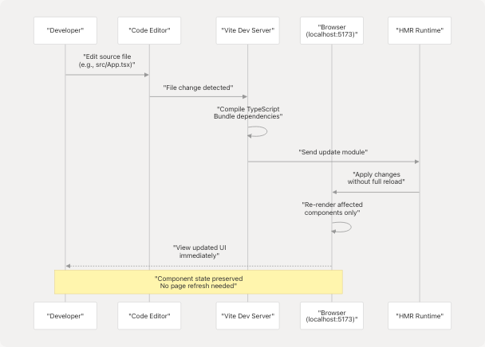

# Getting Started

This document guides developers through setting up the JIIT Personalized Timetable Creator development environment, running the application locally, and understanding the core project structure and build system. For information about the overall system architecture and how components interact, see [System Architecture](3-system-architecture). For specific feature implementation details, see [Schedule Generation](4-schedule-generation-(core-feature)).

## Purpose and Scope

This page covers:

* Prerequisites and system requirements
* Repository cloning and dependency installation
* Running the development server
* Project directory structure and organization
* Build system configuration
* Development workflow basics

## Prerequisites

The following tools are required before beginning development:

| Tool | Version | Purpose |
| --- | --- | --- |
| **Node.js** | 18.x or higher | JavaScript runtime for build tools |
| **Package Manager** | bun (recommended) or npm | Dependency management |
| **Git** | Any recent version | Version control |
| **Modern Browser** | Chrome/Edge/Firefox latest | WebAssembly support required |

**Note**: Python is NOT required for local development. The application uses Pyodide (Python compiled to WebAssembly) which runs entirely in the browser. The external Python Streamlit app mentioned in [README.md71](https://github.com/tashifkhan/JIIT-time-table-website/blob/0ffdedf5/README.md#L71-L71) is only used for data preparation and is not part of the development workflow.

## Installation Steps

### 1. Clone the Repository

```
git clone https://github.com/tashifkhan/JIIT-time-table-website
cd JIIT-time-table-website
```

This creates a local copy of the repository with the following structure:

```
JIIT-time-table-website/
├── public/          # Static assets served directly
├── src/             # React application source code
├── package.json     # Node.js dependencies and scripts
├── vite.config.ts   # Vite build configuration
└── tsconfig.json    # TypeScript compiler settings
```

### 2. Install Dependencies

Using **bun** (recommended for faster installation):

```
bun i
```

Or using **npm**:

```
npm i
```

This command reads `package.json` and installs all required dependencies into `node_modules/`, including:

* React 18 and React DOM
* TypeScript and type definitions
* Vite build tooling
* Tailwind CSS and PostCSS
* Pyodide WASM runtime (loaded from CDN at runtime, not bundled)
* Various UI libraries (Radix UI, Framer Motion, etc.)

The `node_modules/` directory is excluded from version control via [.gitignore10](https://github.com/tashifkhan/JIIT-time-table-website/blob/0ffdedf5/.gitignore#L10-L10)

### 3. Run the Development Server

```
bun dev
```

Or with npm:

```
npm run dev
```

This executes the `dev` script defined in `package.json`, which starts Vite's development server. The application will be available at:

```
http://localhost:5173
```

The development server provides:

* **Hot Module Replacement (HMR)**: Changes to source files automatically update in the browser without full page reload
* **Fast refresh**: React component state is preserved during updates
* **TypeScript compilation**: Type checking occurs in real-time
* **Asset serving**: Files in `public/` are served at the root path

## Application Entry Point Flow

The following diagram shows how the application initializes when the development server starts, mapping natural language concepts to actual code entities:


**Component Initialization Order**:

1. **[main.tsx22](https://github.com/tashifkhan/JIIT-time-table-website/blob/0ffdedf5/main.tsx#L22-L22)**: `createRoot()` mounts React to DOM element with id `root`
2. **[main.tsx23](https://github.com/tashifkhan/JIIT-time-table-website/blob/0ffdedf5/main.tsx#L23-L23)**: `StrictMode` wrapper enables additional development checks
3. **[main.tsx24-27](https://github.com/tashifkhan/JIIT-time-table-website/blob/0ffdedf5/main.tsx#L24-L27)**: `PostHogProvider` initializes analytics with API key from environment variable `VITE_PUBLIC_POSTHOG_KEY`
4. **[main.tsx28](https://github.com/tashifkhan/JIIT-time-table-website/blob/0ffdedf5/main.tsx#L28-L28)**: `Background` component provides visual styling
5. **[main.tsx29](https://github.com/tashifkhan/JIIT-time-table-website/blob/0ffdedf5/main.tsx#L29-L29)**: `UserContextProvider` establishes global state management (see [State Management](3.4-data-model-and-types))
6. **[main.tsx30](https://github.com/tashifkhan/JIIT-time-table-website/blob/0ffdedf5/main.tsx#L30-L30)**: `Analytics` component from Vercel tracks page views
7. **[main.tsx31](https://github.com/tashifkhan/JIIT-time-table-website/blob/0ffdedf5/main.tsx#L31-L31)**: `NuqsAdapter` enables URL query parameter synchronization
8. **[main.tsx32](https://github.com/tashifkhan/JIIT-time-table-website/blob/0ffdedf5/main.tsx#L32-L32)**: `BrowserRouter` enables client-side routing
9. **[main.tsx33](https://github.com/tashifkhan/JIIT-time-table-website/blob/0ffdedf5/main.tsx#L33-L33)**: `Navbar` renders persistent navigation
10. **[main.tsx35-49](https://github.com/tashifkhan/JIIT-time-table-website/blob/0ffdedf5/main.tsx#L35-L49)**: `Routes` defines path-to-component mappings

## Project Structure

The repository follows a standard React TypeScript project layout with specific directories for static assets and data:


### Directory Breakdown

| Path | Purpose | Key Files |
| --- | --- | --- |
| **`public/`** | Static files served at root URL | All files accessible via `https://domain/filename` |
| **`public/data/`** | JSON data files for timetables and calendars | `time-table/ODD25/62.json`, `calender/2526/calender.json` |
| **`public/modules/`** | Python modules for specific campus logic | `BE128_creator.py`, `BE62_creator.py` |
| **`public/_creator.py`** | Main Python timetable generation logic | Loaded by Pyodide at runtime (see [Pyodide WASM Integration](3.2-pyodide-wasm-integration)) |
| **`src/components/`** | React UI components | 15+ components including forms, displays, dialogs |
| **`src/context/`** | React Context API state management | `userContext.ts`, `userContextProvider.tsx` |
| **`src/utils/`** | Utility functions and integrations | `pyodide.ts`, `calender.ts`, `download.ts` |
| **`src/types/`** | TypeScript type definitions | Interfaces for schedules, events, and API responses |
| **`src/App.tsx`** | Main schedule creator page component | Primary user interface (see [Schedule Generation](4-schedule-generation-(core-feature))) |
| **`src/main.tsx`** | Application entry point | Routing and provider setup |

## Build System Configuration

The application uses **Vite** as its build tool, configured via `vite.config.ts`. Key characteristics:

### Development Mode

When running `bun dev` or `npm run dev`:

* **Port**: 5173 by default
* **Hot Module Replacement**: Enabled
* **Source maps**: Inline for debugging
* **TypeScript**: Compiled on-the-fly without type checking (use separate `tsc --noEmit` for type validation)
* **Asset serving**: Files in `public/` served at `/` path

### Production Build

The `bun run build` or `npm run build` command:

1. Compiles TypeScript to JavaScript
2. Bundles React components and dependencies
3. Minifies output
4. Generates static HTML/CSS/JS in `dist/` directory
5. Optimizes assets (images, fonts, etc.)

The `dist/` directory is excluded from version control via [.gitignore11](https://github.com/tashifkhan/JIIT-time-table-website/blob/0ffdedf5/.gitignore#L11-L11)

### Deployment Configuration

The [vercel.json1-16](https://github.com/tashifkhan/JIIT-time-table-website/blob/0ffdedf5/vercel.json#L1-L16) file configures deployment on Vercel:

* **PostHog Proxy**: Requests to `/ph/*` are proxied to PostHog analytics servers [vercel.json3-10](https://github.com/tashifkhan/JIIT-time-table-website/blob/0ffdedf5/vercel.json#L3-L10)
* **SPA Routing**: All routes redirect to `/index.html` for client-side routing [vercel.json12-14](https://github.com/tashifkhan/JIIT-time-table-website/blob/0ffdedf5/vercel.json#L12-L14)

This configuration ensures:

* Analytics tracking works without CORS issues
* Direct URL access to routes like `/timeline` or `/compare-timetables` loads the SPA correctly

## Environment Variables

The application uses environment variables for external service configuration. Create a `.env` file in the project root (excluded from version control via [.gitignore25](https://github.com/tashifkhan/JIIT-time-table-website/blob/0ffdedf5/.gitignore#L25-L25)):

```
VITE_PUBLIC_POSTHOG_KEY=your_posthog_api_key_here
```

**Usage in code**: Environment variables prefixed with `VITE_` are accessible via `import.meta.env` [main.tsx25](https://github.com/tashifkhan/JIIT-time-table-website/blob/0ffdedf5/main.tsx#L25-L25)

| Variable | Purpose | Required | Used In |
| --- | --- | --- | --- |
| `VITE_PUBLIC_POSTHOG_KEY` | PostHog analytics API key | No | [main.tsx25](https://github.com/tashifkhan/JIIT-time-table-website/blob/0ffdedf5/main.tsx#L25-L25) |

**Note**: Google Calendar API credentials are configured client-side during the OAuth flow, not via environment variables. See [Google Calendar Integration](9.1-google-calendar-integration) for details.

## Development Workflow

The typical development cycle follows this pattern:



### Recommended Development Practices

1. **File Watching**: The dev server automatically detects changes to:

   * `src/**/*.tsx` and `src/**/*.ts` files
   * `src/**/*.css` files
   * `public/**/*` static assets
2. **Type Checking**: Run `tsc --noEmit` in a separate terminal for continuous type validation, as the dev server skips type checking for speed
3. **Linting**: Configure ESLint integration in your editor for real-time code quality feedback
4. **Browser DevTools**:

   * React DevTools extension for component inspection
   * Network tab to verify Pyodide WASM loading
   * Application tab to inspect localStorage state
5. **Testing Routes**: Navigate directly to routes during development:

   * `http://localhost:5173/` - Schedule creator
   * `http://localhost:5173/timeline` - Calendar view
   * `http://localhost:5173/compare-timetables` - Comparison tool
   * `http://localhost:5173/academic-calendar` - Institutional calendar
   * `http://localhost:5173/mess-menu` - Dining schedule

## Accessing Static Data

During development, static JSON files in `public/data/` are accessible at the root path:

```
http://localhost:5173/data/time-table/ODD25/62.json
http://localhost:5173/data/time-table/ODD25/128.json
http://localhost:5173/data/calender/2526/calender.json
```

Python modules in `public/modules/` and `public/_creator.py` are fetched by the Pyodide runtime [README.md89-93](https://github.com/tashifkhan/JIIT-time-table-website/blob/0ffdedf5/README.md#L89-L93) See [Pyodide WASM Integration](3.2-pyodide-wasm-integration) for details on how these files are loaded and executed.

**External Access**: The production API allows external access to data [README.md56-64](https://github.com/tashifkhan/JIIT-time-table-website/blob/0ffdedf5/README.md#L56-L64):

```
# Timetable data
curl https://simple-timetable.tashif.codes/data/time-table/ODD25/62.json

# Calendar data
curl https://simple-timetable.tashif.codes/data/calender/2526/calender.json
```

## Troubleshooting Common Issues

| Issue | Symptom | Solution |
| --- | --- | --- |
| **Port already in use** | `EADDRINUSE: address already in use :::5173` | Kill process on port 5173 or use `--port 3000` flag |
| **Module not found** | Import errors after adding dependencies | Run `bun i` or `npm i` again |
| **TypeScript errors** | Red squiggles in editor | Restart TypeScript server in editor or run `tsc --noEmit` |
| **WASM loading failure** | Pyodide initialization errors | Check browser console, ensure WebAssembly is supported |
| **Stale cache** | Old version loads after changes | Hard refresh (Ctrl+Shift+R) or clear browser cache |
| **Build errors** | `dist/` directory has issues | Delete `dist/` and `.vite/` directories, rebuild |

**Browser Compatibility**: Modern browsers with WebAssembly support are required [README.md220](https://github.com/tashifkhan/JIIT-time-table-website/blob/0ffdedf5/README.md#L220-L220) Verify support at `chrome://flags` (Chrome) or `about:config` (Firefox).

## Next Steps

After successfully running the development server:

1. **Understand the Architecture**: Read [System Architecture](3-system-architecture) to learn how components interact
2. **Explore the Core Feature**: See [Schedule Generation](4-schedule-generation-(core-feature)) for the main timetable creation pipeline
3. **Review Data Structures**: Consult [Data Model & Types](3.3-pwa-and-offline-capabilities) for TypeScript interfaces
4. **Learn State Management**: Study [State Management](3.4-data-model-and-types) for context and persistence patterns
5. **Explore Python Integration**: Read [Pyodide WASM Integration](3.2-pyodide-wasm-integration) for client-side Python execution details
