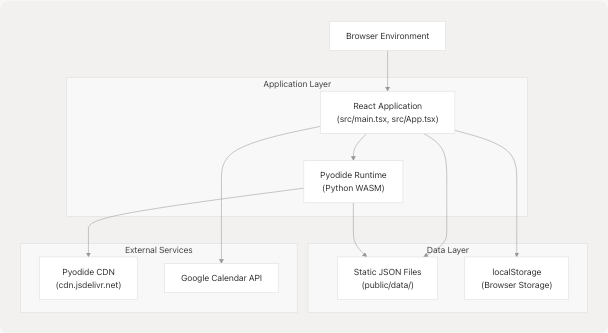
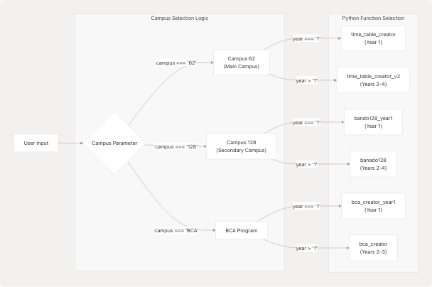
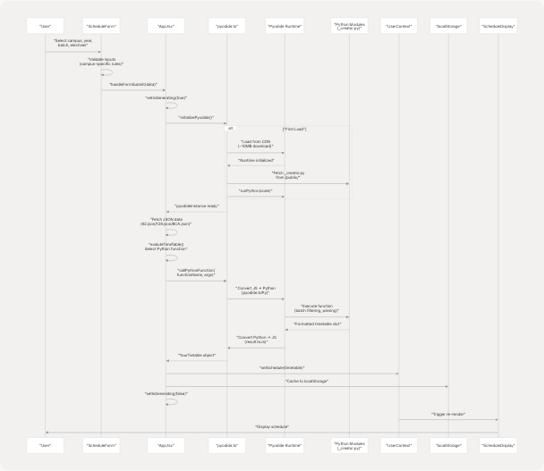
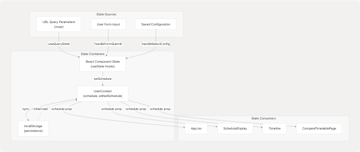
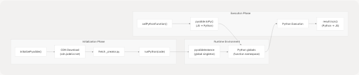
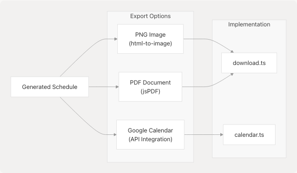
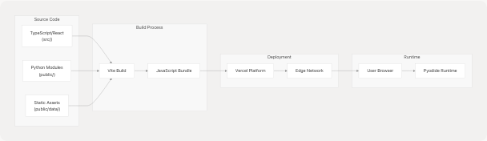

# System Architecture

> Source: https://deepwiki.com/tashifkhan/JIIT-time-table-website/3-system-architecture

# System Architecture

Relevant source files

* [README.md](https://github.com/tashifkhan/JIIT-time-table-website/blob/0ffdedf5/README.md)
* [website/app/layout.tsx](https://github.com/tashifkhan/JIIT-time-table-website/blob/0ffdedf5/website/app/layout.tsx)
* [website/next.config.ts](https://github.com/tashifkhan/JIIT-time-table-website/blob/0ffdedf5/website/next.config.ts)
* [website/public/sw.js](https://github.com/tashifkhan/JIIT-time-table-website/blob/0ffdedf5/website/public/sw.js)
* [website/public/workbox-da59eb65.js](https://github.com/tashifkhan/JIIT-time-table-website/blob/0ffdedf5/website/public/workbox-da59eb65.js)

## Purpose and Scope

This document describes the overall system architecture of the JIIT Personalized Timetable Creator application. It explains the high-level design decisions, component interactions, data flow patterns, and the unique client-side architecture that eliminates the need for a traditional backend server.

For detailed information about specific architectural subsystems:

* Frontend component hierarchy and routing: see [Frontend Architecture & Routing](/tashifkhan/JIIT-time-table-website/3.1-frontend-architecture-and-routing)
* Pyodide integration and Python execution: see [Pyodide WASM Integration](/tashifkhan/JIIT-time-table-website/3.2-pyodide-wasm-integration)
* Data structures and TypeScript types: see [Data Model & Types](/tashifkhan/JIIT-time-table-website/3.3-pwa-and-offline-capabilities)
* State persistence and synchronization: see [State Management](/tashifkhan/JIIT-time-table-website/3.4-data-model-and-types)

## High-Level Overview

The JIIT Timetable website is a **fully client-side application** that runs entirely in the user's browser. It leverages WebAssembly through Pyodide to execute Python timetable generation logic without requiring a backend server. The application fetches static JSON data files, processes them using Python modules compiled to WASM, and renders personalized schedules using React components.

The system is deployed as a static site on Vercel, with all computation happening client-side. This architecture provides several advantages:

* Zero server infrastructure costs
* Instant schedule generation after initial load
* Offline functionality via PWA capabilities
* No data transmission to external servers (privacy-preserving)

**Key Technologies:**

* **Frontend Framework:** React 18 with TypeScript
* **Runtime Environment:** Pyodide v0.27.0 (Python 3.11 in WebAssembly)
* **State Management:** React Context API + localStorage
* **Routing:** React Router v6 with nuqs for URL state
* **Build Tool:** Vite
* **Deployment:** Vercel (static hosting)

Sources: [README.md35-50](https://github.com/tashifkhan/JIIT-time-table-website/blob/0ffdedf5/README.md#L35-L50) [src/main.tsx1-73](https://github.com/tashifkhan/JIIT-time-table-website/blob/0ffdedf5/src/main.tsx#L1-L73) [src/App.tsx1-841](https://github.com/tashifkhan/JIIT-time-table-website/blob/0ffdedf5/src/App.tsx#L1-L841)

## Core Architectural Principles

### 1. Client-Side First Architecture

The application implements all business logic in the browser, with no backend API:


```

**Architectural Decision: No Backend Server**

The system fetches the Pyodide runtime (~10MB) and Python modules from CDN on first load. All timetable generation, filtering, and processing occurs in the browser's WASM runtime. This eliminates deployment complexity and server costs while maintaining full functionality.

Sources: [README.md45-49](https://github.com/tashifkhan/JIIT-time-table-website/blob/0ffdedf5/README.md#L45-L49) [src/utils/pyodide.ts1-109](https://github.com/tashifkhan/JIIT-time-table-website/blob/0ffdedf5/src/utils/pyodide.ts#L1-L109) [vercel.json1-16](https://github.com/tashifkhan/JIIT-time-table-website/blob/0ffdedf5/vercel.json#L1-L16)

### 2. Data-Driven Schedule Generation

The application operates on static JSON files containing timetable and subject data:

| Data Source | Path Pattern | Purpose |
| --- | --- | --- |
| Timetable JSON | `/data/time-table/{SEMESTER}/{CAMPUS}.json` | Raw class schedules by day and time |
| Subject JSON | Nested within timetable JSON | Subject codes, names, and metadata |
| Academic Calendar | `/data/calender/{ACADEMIC_YEAR}/calender.json` | Institutional calendar events |
| Mess Menu | `/data/mess-menu/mess_menu.json` | Dining schedule |

The JSON structure is generated by an external Streamlit app ([json\_creater.py](https://github.com/tashifkhan/JIIT-time-table-website/blob/0ffdedf5/json_creater.py)) that parses Excel files from the institution.

Sources: [README.md52-64](https://github.com/tashifkhan/JIIT-time-table-website/blob/0ffdedf5/README.md#L52-L64) [src/App.tsx43-53](https://github.com/tashifkhan/JIIT-time-table-website/blob/0ffdedf5/src/App.tsx#L43-L53)

### 3. Multi-Campus Support

The system handles three distinct campus/program types with different timetable structures:

```

```

**Function Selection Algorithm**

The `evaluteTimeTable` function in [src/App.tsx115-152](https://github.com/tashifkhan/JIIT-time-table-website/blob/0ffdedf5/src/App.tsx#L115-L152) implements dynamic Python function selection based on campus and year parameters. Each campus has distinct batch naming conventions, subject code formats, and timetable structures requiring specialized parsing logic.

Sources: [src/App.tsx115-152](https://github.com/tashifkhan/JIIT-time-table-website/blob/0ffdedf5/src/App.tsx#L115-L152) [public/modules/BE62\_creator.py1-589](https://github.com/tashifkhan/JIIT-time-table-website/blob/0ffdedf5/public/modules/BE62_creator.py#L1-L589) [public/modules/BE128\_creator.py1-317](https://github.com/tashifkhan/JIIT-time-table-website/blob/0ffdedf5/public/modules/BE128_creator.py#L1-L317)

## Component Architecture

### React Component Hierarchy

```

```

**Component Responsibilities:**

| Component | File | Primary Responsibility |
| --- | --- | --- |
| `App` | [src/App.tsx](https://github.com/tashifkhan/JIIT-time-table-website/blob/0ffdedf5/src/App.tsx) | Schedule generation orchestration, form state management |
| `ScheduleForm` | [src/components/schedule-form.tsx](https://github.com/tashifkhan/JIIT-time-table-website/blob/0ffdedf5/src/components/schedule-form.tsx) | User input collection, validation, saved configs |
| `ScheduleDisplay` | [src/components/schedule-display.tsx](https://github.com/tashifkhan/JIIT-time-table-website/blob/0ffdedf5/src/components/schedule-display.tsx) | Timetable rendering, event editing |
| `TimelineWrapper` | [src/components/timeline-wrapper.tsx](https://github.com/tashifkhan/JIIT-time-table-website/blob/0ffdedf5/src/components/timeline-wrapper.tsx) | Calendar view router wrapper |
| `Timeline` | [src/components/timeline.tsx](https://github.com/tashifkhan/JIIT-time-table-website/blob/0ffdedf5/src/components/timeline.tsx) | Week-view calendar with current time indicator |
| `CompareTimetablePage` | [src/components/compare-timetable.tsx](https://github.com/tashifkhan/JIIT-time-table-website/blob/0ffdedf5/src/components/compare-timetable.tsx) | Dual schedule generation and comparison |
| `AcademicCalendar` | [src/components/academic-calendar.tsx](https://github.com/tashifkhan/JIIT-time-table-website/blob/0ffdedf5/src/components/academic-calendar.tsx) | Institutional calendar display |
| `Navbar` | [src/components/navbar.tsx](https://github.com/tashifkhan/JIIT-time-table-website/blob/0ffdedf5/src/components/navbar.tsx) | Navigation with swipe gesture support |

Sources: [src/main.tsx1-73](https://github.com/tashifkhan/JIIT-time-table-website/blob/0ffdedf5/src/main.tsx#L1-L73) [src/App.tsx1-841](https://github.com/tashifkhan/JIIT-time-table-website/blob/0ffdedf5/src/App.tsx#L1-L841)

## Data Flow Architecture

### Schedule Generation Pipeline

```

```

**Critical Code Paths:**

1. **Form Submission**: [src/App.tsx154-229](https://github.com/tashifkhan/JIIT-time-table-website/blob/0ffdedf5/src/App.tsx#L154-L229) - Coordinates the entire generation process
2. **Pyodide Initialization**: [src/utils/pyodide.ts23-58](https://github.com/tashifkhan/JIIT-time-table-website/blob/0ffdedf5/src/utils/pyodide.ts#L23-L58) - Loads WASM runtime and Python code
3. **Function Calling**: [src/utils/pyodide.ts91-109](https://github.com/tashifkhan/JIIT-time-table-website/blob/0ffdedf5/src/utils/pyodide.ts#L91-L109) - Bridges JavaScript and Python
4. **Python Processing**: [public/modules/BE62\_creator.py316-410](https://github.com/tashifkhan/JIIT-time-table-website/blob/0ffdedf5/public/modules/BE62_creator.py#L316-L410) - Parses and filters timetable

Sources: [src/App.tsx154-229](https://github.com/tashifkhan/JIIT-time-table-website/blob/0ffdedf5/src/App.tsx#L154-L229) [src/utils/pyodide.ts1-109](https://github.com/tashifkhan/JIIT-time-table-website/blob/0ffdedf5/src/utils/pyodide.ts#L1-L109)

### State Management Flow

```

```

**State Persistence Strategy:**

The application uses a three-tier persistence model:

1. **URL Parameters** ([src/App.tsx231-247](https://github.com/tashifkhan/JIIT-time-table-website/blob/0ffdedf5/src/App.tsx#L231-L247)): For shareable links using `nuqs` library
2. **UserContext** ([src/context/userContext.ts](https://github.com/tashifkhan/JIIT-time-table-website/blob/0ffdedf5/src/context/userContext.ts)): Runtime state with React Context API
3. **localStorage** ([src/App.tsx84-109](https://github.com/tashifkhan/JIIT-time-table-website/blob/0ffdedf5/src/App.tsx#L84-L109)): Cross-session persistence with keys:
   * `cachedSchedule`: Generated timetable
   * `cachedScheduleParams`: Generation parameters for comparison
   * `classConfigs`: Saved configuration presets
   * `editedSchedule`: User modifications to base schedule

Sources: [src/App.tsx231-247](https://github.com/tashifkhan/JIIT-time-table-website/blob/0ffdedf5/src/App.tsx#L231-L247) [src/context/userContextProvider.tsx](https://github.com/tashifkhan/JIIT-time-table-website/blob/0ffdedf5/src/context/userContextProvider.tsx)

## Client-Side Python Execution

### Pyodide Integration Architecture

The system uses Pyodide to run Python timetable generation logic in the browser:

```

```

**Implementation Details:**

* **Runtime Caching**: [src/utils/pyodide.ts6](https://github.com/tashifkhan/JIIT-time-table-website/blob/0ffdedf5/src/utils/pyodide.ts#L6-L6) maintains a global `pyodideInstance` to avoid reloading
* **Async Initialization**: [src/utils/pyodide.ts23-58](https://github.com/tashifkhan/JIIT-time-table-website/blob/0ffdedf5/src/utils/pyodide.ts#L23-L58) handles concurrent initialization requests
* **Type Conversion**: [src/utils/pyodide.ts99-102](https://github.com/tashifkhan/JIIT-time-table-website/blob/0ffdedf5/src/utils/pyodide.ts#L99-L102) converts between JavaScript and Python objects
* **Function Registry**: Python modules expose functions in global namespace via [public/script.py1-6](https://github.com/tashifkhan/JIIT-time-table-website/blob/0ffdedf5/public/script.py#L1-L6)

The Python modules ([public/modules/BE62\_creator.py](https://github.com/tashifkhan/JIIT-time-table-website/blob/0ffdedf5/public/modules/BE62_creator.py) [public/modules/BE128\_creator.py](https://github.com/tashifkhan/JIIT-time-table-website/blob/0ffdedf5/public/modules/BE128_creator.py)) contain complex parsing logic for:

* Batch number expansion (e.g., "A1-A10" → ["A1", "A2", ..., "A10"])
* Subject code extraction from activity strings
* Location parsing from formatted strings
* Time format conversion (12-hour → 24-hour)
* Elective subject matching

For detailed implementation: see [Pyodide WASM Integration](/tashifkhan/JIIT-time-table-website/3.2-pyodide-wasm-integration)

Sources: [src/utils/pyodide.ts1-109](https://github.com/tashifkhan/JIIT-time-table-website/blob/0ffdedf5/src/utils/pyodide.ts#L1-L109) [public/modules/BE62\_creator.py1-589](https://github.com/tashifkhan/JIIT-time-table-website/blob/0ffdedf5/public/modules/BE62_creator.py#L1-L589)

## Routing and Navigation

### Route Structure

```

```

**Navigation Implementation:**

* **Router Configuration**: [src/main.tsx32-50](https://github.com/tashifkhan/JIIT-time-table-website/blob/0ffdedf5/src/main.tsx#L32-L50) defines all application routes
* **Navbar Component**: [src/components/navbar.tsx](https://github.com/tashifkhan/JIIT-time-table-website/blob/0ffdedf5/src/components/navbar.tsx) provides swipeable mobile navigation
* **URL State Sync**: Uses `nuqs` library for bidirectional URL parameter synchronization
* **Route Protection**: `/timeline` checks for cached schedule, redirects to landing if absent

The navbar implements touch gestures via `react-swipeable` for mobile-first navigation experience.

For detailed routing implementation: see [Frontend Architecture & Routing](/tashifkhan/JIIT-time-table-website/3.1-frontend-architecture-and-routing)

Sources: [src/main.tsx32-50](https://github.com/tashifkhan/JIIT-time-table-website/blob/0ffdedf5/src/main.tsx#L32-L50) [src/components/navbar.tsx](https://github.com/tashifkhan/JIIT-time-table-website/blob/0ffdedf5/src/components/navbar.tsx)

## External Dependencies and Services

### Third-Party Integrations

| Service | Purpose | Integration Point | Configuration |
| --- | --- | --- | --- |
| **Pyodide CDN** | Python WASM runtime | [src/utils/pyodide.ts42](https://github.com/tashifkhan/JIIT-time-table-website/blob/0ffdedf5/src/utils/pyodide.ts#L42-L42) | v0.27.0 from jsdelivr.net |
| **Google Calendar API** | Schedule export | [src/utils/calendar.ts](https://github.com/tashifkhan/JIIT-time-table-website/blob/0ffdedf5/src/utils/calendar.ts) | OAuth 2.0 with GSI client |
| **Google Calendar API** | Academic calendar sync | [src/utils/calender-AC.ts](https://github.com/tashifkhan/JIIT-time-table-website/blob/0ffdedf5/src/utils/calender-AC.ts) | Separate event creation flow |
| **Vercel Analytics** | Usage tracking | [src/main.tsx30](https://github.com/tashifkhan/JIIT-time-table-website/blob/0ffdedf5/src/main.tsx#L30-L30) | Automatic integration |
| **PostHog** | Product analytics | [src/main.tsx24-27](https://github.com/tashifkhan/JIIT-time-table-website/blob/0ffdedf5/src/main.tsx#L24-L27) | Proxied via `/ph` endpoint |

**API Proxy Configuration:**

The [vercel.json1-16](https://github.com/tashifkhan/JIIT-time-table-website/blob/0ffdedf5/vercel.json#L1-L16) file configures reverse proxies:

* PostHog analytics → `eu.i.posthog.com` (avoids ad-blockers)
* Catch-all SPA routing → `index.html`

Sources: [src/utils/pyodide.ts42](https://github.com/tashifkhan/JIIT-time-table-website/blob/0ffdedf5/src/utils/pyodide.ts#L42-L42) [src/utils/calendar.ts](https://github.com/tashifkhan/JIIT-time-table-website/blob/0ffdedf5/src/utils/calendar.ts) [vercel.json1-16](https://github.com/tashifkhan/JIIT-time-table-website/blob/0ffdedf5/vercel.json#L1-L16)

### Export Capabilities

The system provides multiple export formats:

```

```

**Export Implementations:**

* **Image Export**: [src/utils/download.ts](https://github.com/tashifkhan/JIIT-time-table-website/blob/0ffdedf5/src/utils/download.ts) uses `html-to-image` to capture DOM as PNG
* **PDF Export**: Same module uses `jsPDF` to convert PNG to downloadable PDF
* **Google Calendar**: [src/utils/calendar.ts](https://github.com/tashifkhan/JIIT-time-table-website/blob/0ffdedf5/src/utils/calendar.ts) creates recurring events with RRULE specifications

Sources: [src/utils/download.ts](https://github.com/tashifkhan/JIIT-time-table-website/blob/0ffdedf5/src/utils/download.ts) [src/utils/calendar.ts](https://github.com/tashifkhan/JIIT-time-table-website/blob/0ffdedf5/src/utils/calendar.ts)

## Deployment Architecture

### Build and Deployment Pipeline

```


**Deployment Characteristics:**

* **Static Site Generation**: All assets compiled to static files via Vite
* **Edge Distribution**: Served via Vercel's global CDN
* **No Server-Side Logic**: Zero compute costs beyond CDN bandwidth
* **PWA Support**: Service worker ([public/service-worker.js](https://github.com/tashifkhan/JIIT-time-table-website/blob/0ffdedf5/public/service-worker.js)) enables offline functionality
* **Build Output**: Single-page application with client-side routing

The application is production-ready at `https://simple-timetable.tashif.codes/` with automatic deployments on git push.

Sources: [README.md148-186](https://github.com/tashifkhan/JIIT-time-table-website/blob/0ffdedf5/README.md#L148-L186) [vercel.json1-16](https://github.com/tashifkhan/JIIT-time-table-website/blob/0ffdedf5/vercel.json#L1-L16)

## Data Types and Structures

### Core Data Interfaces

The application uses TypeScript interfaces for type safety:

**YourTietable Interface** ([src/App.tsx28-36](https://github.com/tashifkhan/JIIT-time-table-website/blob/0ffdedf5/src/App.tsx#L28-L36)):

```
```
interface YourTietable {
  [day: string]: {
    [timeSlot: string]: {
      subject_name: string;
      type: "L" | "T" | "P" | "C";  // Lecture/Tutorial/Practical/Custom
      location: string;
    };
  };
}
```
```

**Example Data Flow:**

1. Python returns dict: `{"Monday": {"09:00-10:00": {...}}}`
2. Converted via `result.toJs()` to JavaScript object
3. Type-asserted as `YourTietable` in React
4. Stored in UserContext and rendered by `ScheduleDisplay`

For complete type definitions: see [Data Model & Types](/tashifkhan/JIIT-time-table-website/3.3-pwa-and-offline-capabilities)

Sources: [src/App.tsx28-36](https://github.com/tashifkhan/JIIT-time-table-website/blob/0ffdedf5/src/App.tsx#L28-L36) [src/types/](https://github.com/tashifkhan/JIIT-time-table-website/blob/0ffdedf5/src/types/)

## Performance Considerations

### Optimization Strategies

| Aspect | Strategy | Implementation |
| --- | --- | --- |
| **Initial Load** | Lazy Pyodide loading | [src/utils/pyodide.ts23-58](https://github.com/tashifkhan/JIIT-time-table-website/blob/0ffdedf5/src/utils/pyodide.ts#L23-L58) |
| **Caching** | localStorage persistence | [src/App.tsx84-109](https://github.com/tashifkhan/JIIT-time-table-website/blob/0ffdedf5/src/App.tsx#L84-L109) |
| **Redundant Execution** | Double-run workaround | [src/App.tsx194-204](https://github.com/tashifkhan/JIIT-time-table-website/blob/0ffdedf5/src/App.tsx#L194-L204) |
| **Bundle Size** | Code splitting via Vite | Automatic tree-shaking |
| **Offline Access** | Service worker caching | [public/service-worker.js](https://github.com/tashifkhan/JIIT-time-table-website/blob/0ffdedf5/public/service-worker.js) |

**Known Performance Issue:**

The first Pyodide execution returns incorrect results (warm-up issue). The system runs generation twice on initial load: [src/App.tsx194-204](https://github.com/tashifkhan/JIIT-time-table-website/blob/0ffdedf5/src/App.tsx#L194-L204) This is a Pyodide runtime quirk that requires investigation.

Sources: [src/App.tsx194-204](https://github.com/tashifkhan/JIIT-time-table-website/blob/0ffdedf5/src/App.tsx#L194-L204) [src/utils/pyodide.ts23-58](https://github.com/tashifkhan/JIIT-time-table-website/blob/0ffdedf5/src/utils/pyodide.ts#L23-L58)

---

This architecture enables a fully functional timetable generation system with zero backend infrastructure, leveraging modern web technologies to deliver computation-intensive features entirely client-side.