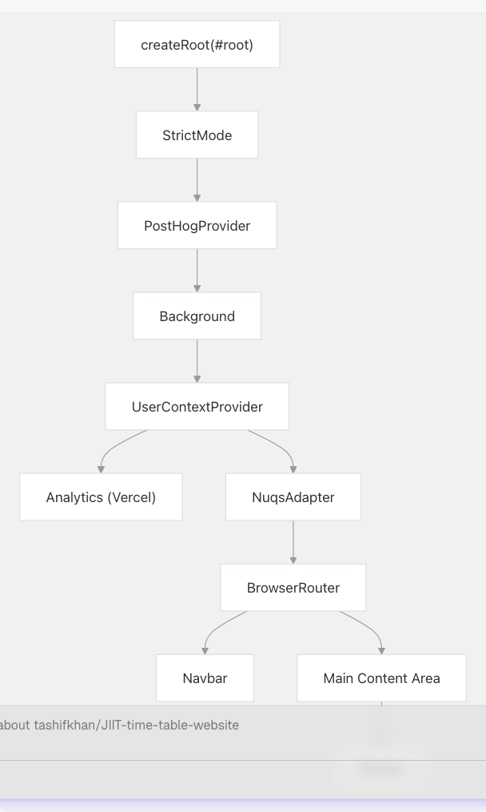
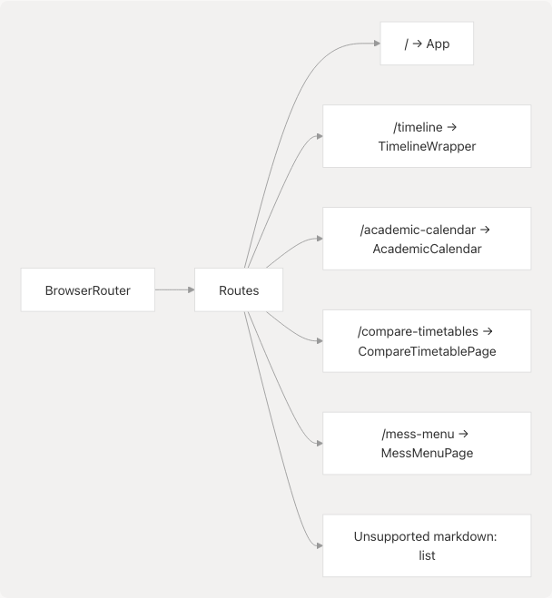
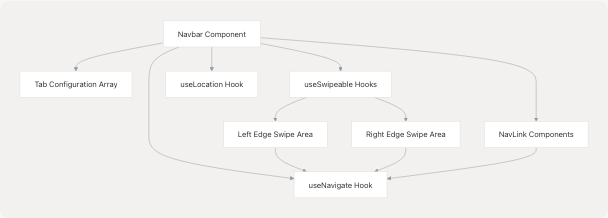
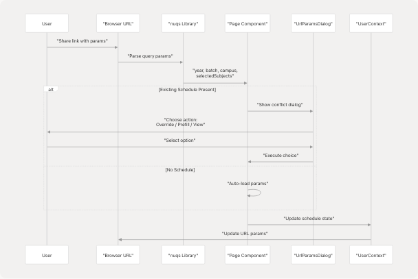
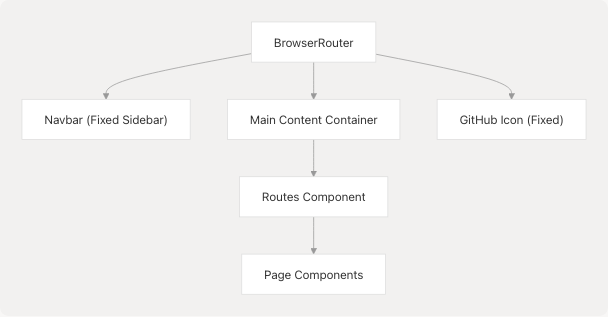
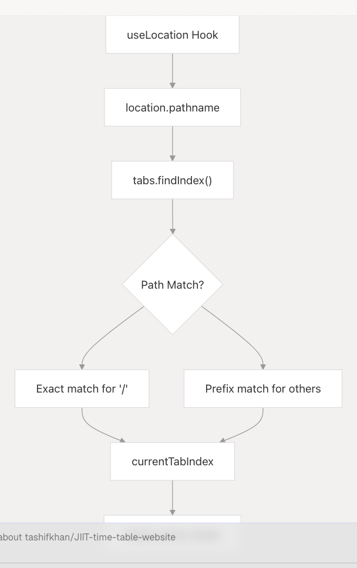

# Frontend Architecture & Routing

> Source: https://deepwiki.com/tashifkhan/JIIT-time-table-website/3.1-frontend-architecture-and-routing

# Frontend Architecture & Routing

Relevant source files

* [README.md](https://github.com/tashifkhan/JIIT-time-table-website/blob/0ffdedf5/README.md)
* [website/app/layout.tsx](https://github.com/tashifkhan/JIIT-time-table-website/blob/0ffdedf5/website/app/layout.tsx)
* [website/components/mobile-navbar.tsx](https://github.com/tashifkhan/JIIT-time-table-website/blob/0ffdedf5/website/components/mobile-navbar.tsx)
* [website/components/navbar.tsx](https://github.com/tashifkhan/JIIT-time-table-website/blob/0ffdedf5/website/components/navbar.tsx)
* [website/next.config.ts](https://github.com/tashifkhan/JIIT-time-table-website/blob/0ffdedf5/website/next.config.ts)
* [website/public/sw.js](https://github.com/tashifkhan/JIIT-time-table-website/blob/0ffdedf5/website/public/sw.js)
* [website/public/workbox-da59eb65.js](https://github.com/tashifkhan/JIIT-time-table-website/blob/0ffdedf5/website/public/workbox-da59eb65.js)

## Purpose and Scope

This document describes the frontend architecture of the JIIT Timetable application, focusing on the application structure, routing system, navigation implementation, and URL state management. It covers how the React application is initialized, how pages are organized and connected via React Router, and how URL parameters enable shareable schedule configurations.

For information about individual page components and their features, see [Schedule Generation](/tashifkhan/JIIT-time-table-website/4-schedule-generation-(core-feature)), [Timeline View](/tashifkhan/JIIT-time-table-website/5-timeline-view), [Compare Timetables](/tashifkhan/JIIT-time-table-website/6-academic-calendar), [Academic Calendar](/tashifkhan/JIIT-time-table-website/7-compare-timetables), and [Mess Menu](/tashifkhan/JIIT-time-table-website/8-mess-menu). For state management details, see [State Management](/tashifkhan/JIIT-time-table-website/3.4-data-model-and-types). For URL parameter encoding specifics, see [Shareable URLs & Configuration Sharing](/tashifkhan/JIIT-time-table-website/9.3-shareable-urls-and-configuration-saving).

---

## Application Entry Point

The application entry point is [src/main.tsx1-72](https://github.com/tashifkhan/JIIT-time-table-website/blob/0ffdedf5/src/main.tsx#L1-L72) This file initializes the React application with a multi-layered provider structure that establishes global context, routing, analytics, and UI theming.

### Provider Hierarchy


```

**Sources:** [src/main.tsx22-72](https://github.com/tashifkhan/JIIT-time-table-website/blob/0ffdedf5/src/main.tsx#L22-L72)

### Provider Stack Details

| Provider | Purpose | Configuration |
| --- | --- | --- |
| `PostHogProvider` | Product analytics tracking | API key from `VITE_PUBLIC_POSTHOG_KEY`, proxied through `/ph` endpoint |
| `Background` | Animated background component | Wraps entire application |
| `UserContextProvider` | Global schedule state management | Provides `schedule` and `editedSchedule` context |
| `NuqsAdapter` | URL state synchronization | Enables URL query parameter state management with React Router v6 |
| `BrowserRouter` | Client-side routing | React Router v6 implementation |
| `Analytics` | Vercel Analytics | Page view and performance tracking |

**Sources:** [src/main.tsx18-32](https://github.com/tashifkhan/JIIT-time-table-website/blob/0ffdedf5/src/main.tsx#L18-L32)

---

## Routing Configuration

The application uses React Router v6 for client-side routing with a flat route structure. All routes are defined in [src/main.tsx35-49](https://github.com/tashifkhan/JIIT-time-table-website/blob/0ffdedf5/src/main.tsx#L35-L49)

### Route Definition Diagram

```

```

**Sources:** [src/main.tsx32-49](https://github.com/tashifkhan/JIIT-time-table-website/blob/0ffdedf5/src/main.tsx#L32-L49)

### Route Table

| Path | Component | Description | Import |
| --- | --- | --- | --- |
| `/` | `App` | Schedule creator form and display | [src/main.tsx4](https://github.com/tashifkhan/JIIT-time-table-website/blob/0ffdedf5/src/main.tsx#L4-L4) |
| `/timeline` | `TimelineWrapper` | Calendar-style timeline view | [src/main.tsx5](https://github.com/tashifkhan/JIIT-time-table-website/blob/0ffdedf5/src/main.tsx#L5-L5) |
| `/academic-calendar` | `AcademicCalendar` | Institutional calendar viewer | [src/main.tsx11](https://github.com/tashifkhan/JIIT-time-table-website/blob/0ffdedf5/src/main.tsx#L11-L11) |
| `/compare-timetables` | `CompareTimetablePage` | Side-by-side schedule comparison | [src/main.tsx13](https://github.com/tashifkhan/JIIT-time-table-website/blob/0ffdedf5/src/main.tsx#L13-L13) |
| `/mess-menu` | `MessMenuPage` | Dining hall menu display | [src/main.tsx7](https://github.com/tashifkhan/JIIT-time-table-website/blob/0ffdedf5/src/main.tsx#L7-L7) |
| `*` (catch-all) | `NotFoundPage` | 404 error page | [src/main.tsx6](https://github.com/tashifkhan/JIIT-time-table-website/blob/0ffdedf5/src/main.tsx#L6-L6) |

**Sources:** [src/main.tsx35-49](https://github.com/tashifkhan/JIIT-time-table-website/blob/0ffdedf5/src/main.tsx#L35-L49)

### Server-Side Routing Configuration

The [vercel.json1-16](https://github.com/tashifkhan/JIIT-time-table-website/blob/0ffdedf5/vercel.json#L1-L16) file configures URL rewriting for deployment:

1. **PostHog Proxy Rewrites** ([vercel.json3-10](https://github.com/tashifkhan/JIIT-time-table-website/blob/0ffdedf5/vercel.json#L3-L10)): Proxies analytics requests to PostHog EU servers through `/ph` to avoid ad blockers
2. **SPA Fallback** ([vercel.json12-14](https://github.com/tashifkhan/JIIT-time-table-website/blob/0ffdedf5/vercel.json#L12-L14)): All unmatched routes redirect to `index.html` for client-side routing

**Sources:** [vercel.json1-16](https://github.com/tashifkhan/JIIT-time-table-website/blob/0ffdedf5/vercel.json#L1-L16)

---

## Navigation System

The navigation system is implemented in [src/components/navbar.tsx1-90](https://github.com/tashifkhan/JIIT-time-table-website/blob/0ffdedf5/src/components/navbar.tsx#L1-L90) It provides both click-based and swipe-based navigation with responsive design.

### Navigation Component Architecture

```

```

**Sources:** [src/components/navbar.tsx1-90](https://github.com/tashifkhan/JIIT-time-table-website/blob/0ffdedf5/src/components/navbar.tsx#L1-L90)

### Navigation Tabs Configuration

The tabs are defined as a static array at [src/components/navbar.tsx4-10](https://github.com/tashifkhan/JIIT-time-table-website/blob/0ffdedf5/src/components/navbar.tsx#L4-L10):

```
```
const tabs = [
  { name: "Create TimeTables", path: "/" },
  { name: "Timeline View", path: "/timeline" },
  { name: "Mess Menu", path: "/mess-menu" },
  { name: "Academic Calender", path: "/academic-calendar" },
  { name: "Compare TimeTables", path: "/compare-timetables" },
];
```
```

**Sources:** [src/components/navbar.tsx4-10](https://github.com/tashifkhan/JIIT-time-table-website/blob/0ffdedf5/src/components/navbar.tsx#L4-L10)

### Swipe Navigation Implementation

The swipe navigation system is implemented using `react-swipeable` library:

| Feature | Implementation | Details |
| --- | --- | --- |
| Swipe Direction | `onSwipedLeft`, `onSwipedRight` | Navigate to next/previous tab in array |
| Edge Detection | Fixed positioned divs on left/right edges | 6px wide invisible areas at screen edges |
| Conditional Disable | `isTimelinePage` check | Swipe disabled on `/timeline` to avoid conflict with calendar swiping |
| Delta Threshold | `delta: 50` | Minimum 50px movement required to trigger navigation |
| Touch/Mouse Support | `trackTouch`, `trackMouse` | Works on both mobile and desktop |

**Sources:** [src/components/navbar.tsx26-46](https://github.com/tashifkhan/JIIT-time-table-website/blob/0ffdedf5/src/components/navbar.tsx#L26-L46) [src/components/navbar.tsx71-86](https://github.com/tashifkhan/JIIT-time-table-website/blob/0ffdedf5/src/components/navbar.tsx#L71-L86)

### Active Tab Highlighting

Active tab detection is implemented in [src/components/navbar.tsx16-21](https://github.com/tashifkhan/JIIT-time-table-website/blob/0ffdedf5/src/components/navbar.tsx#L16-L21):

* For root path (`/`): Exact match required
* For other paths: Prefix match using `location.pathname.startsWith()`
* Active styling: Background color, text color, and border styling via `NavLink` `isActive` prop

**Sources:** [src/components/navbar.tsx53-66](https://github.com/tashifkhan/JIIT-time-table-website/blob/0ffdedf5/src/components/navbar.tsx#L53-L66)

### Responsive Layout

The navbar adapts its layout based on screen size:

| Screen Size | Layout | Styling |
| --- | --- | --- |
| Mobile (`< md`) | Horizontal bottom nav | Fixed at top with `md:ml-56 mt-9` offset |
| Desktop (`≥ md`) | Vertical sidebar | Fixed left sidebar 192px wide (`md:w-48`) |

**Sources:** [src/components/navbar.tsx34](https://github.com/tashifkhan/JIIT-time-table-website/blob/0ffdedf5/src/components/navbar.tsx#L34-L34) [src/components/navbar.tsx49](https://github.com/tashifkhan/JIIT-time-table-website/blob/0ffdedf5/src/components/navbar.tsx#L49-L49)

---

## URL State Management

The application uses `nuqs` library for URL query parameter state synchronization, enabling shareable schedule configurations.

### URL Parameter Flow

```

```

**Sources:** [src/components/url-params-dialog.tsx1-161](https://github.com/tashifkhan/JIIT-time-table-website/blob/0ffdedf5/src/components/url-params-dialog.tsx#L1-L161) [src/main.tsx12](https://github.com/tashifkhan/JIIT-time-table-website/blob/0ffdedf5/src/main.tsx#L12-L12)

### URL Parameter Conflict Resolution

The `UrlParamsDialog` component ([src/components/url-params-dialog.tsx22-160](https://github.com/tashifkhan/JIIT-time-table-website/blob/0ffdedf5/src/components/url-params-dialog.tsx#L22-L160)) handles conflicts when URL parameters are detected but a schedule already exists:

| Action | Behavior | Implementation |
| --- | --- | --- |
| **Generate New Schedule** | Replace existing schedule with URL params | `onOverride` callback |
| **Use as Form Prefill** | Populate form fields without generating | `onPrefill` callback |
| **View Existing Schedule** | Dismiss dialog, keep current schedule | `onViewExisting` callback |

**Sources:** [src/components/url-params-dialog.tsx133-155](https://github.com/tashifkhan/JIIT-time-table-website/blob/0ffdedf5/src/components/url-params-dialog.tsx#L133-L155)

### URL Parameters Display

The dialog displays parsed parameters in a structured format ([src/components/url-params-dialog.tsx81-130](https://github.com/tashifkhan/JIIT-time-table-website/blob/0ffdedf5/src/components/url-params-dialog.tsx#L81-L130)):

1. **Basic Parameters**: Campus, Year, Batch
2. **Subject Codes**: Displays subject names with code mapping
3. **Deduplication**: Handles concatenated codes and removes duplicates
4. **Code-to-Name Mapping**: Resolves subject codes to readable names from mapping data

**Sources:** [src/components/url-params-dialog.tsx46-53](https://github.com/tashifkhan/JIIT-time-table-website/blob/0ffdedf5/src/components/url-params-dialog.tsx#L46-L53) [src/components/url-params-dialog.tsx106-128](https://github.com/tashifkhan/JIIT-time-table-website/blob/0ffdedf5/src/components/url-params-dialog.tsx#L106-L128)

---

## Layout Structure

The main content area is wrapped with consistent layout structure in [src/main.tsx34-50](https://github.com/tashifkhan/JIIT-time-table-website/blob/0ffdedf5/src/main.tsx#L34-L50)

### Layout Hierarchy Diagram

```

```

**Sources:** [src/main.tsx32-66](https://github.com/tashifkhan/JIIT-time-table-website/blob/0ffdedf5/src/main.tsx#L32-L66)

### Layout Specifications

| Element | Positioning | Styling |
| --- | --- | --- |
| Navbar | Fixed sidebar (desktop) or top bar (mobile) | `md:fixed md:top-0 md:left-0 md:h-full md:w-48` |
| Main Content | Offset by navbar width | `md:ml-56 mt-9 md:mt-0 p-4` |
| GitHub Icon | Fixed bottom-right | `fixed right-2 bottom-2 z-50` |

**Sources:** [src/main.tsx34](https://github.com/tashifkhan/JIIT-time-table-website/blob/0ffdedf5/src/main.tsx#L34-L34) [src/main.tsx51-65](https://github.com/tashifkhan/JIIT-time-table-website/blob/0ffdedf5/src/main.tsx#L51-L65)

### Content Area Offset Calculation

The main content area includes responsive margins to prevent overlap with the navbar:

* **Mobile**: `mt-9` (top margin) to account for fixed top navbar
* **Desktop**: `md:ml-56` (left margin) to account for 192px sidebar + padding
* **Padding**: `p-4` applied to all sides for consistent spacing

**Sources:** [src/main.tsx34](https://github.com/tashifkhan/JIIT-time-table-website/blob/0ffdedf5/src/main.tsx#L34-L34)

---

## Component Import Map

All page-level components are imported at the top of [src/main.tsx4-14](https://github.com/tashifkhan/JIIT-time-table-website/blob/0ffdedf5/src/main.tsx#L4-L14):

```

```

**Sources:** [src/main.tsx4-15](https://github.com/tashifkhan/JIIT-time-table-website/blob/0ffdedf5/src/main.tsx#L4-L15)

---

## Router Integration with State

The routing system integrates tightly with the `UserContext` state management:

| Route | State Access | Persistence |
| --- | --- | --- |
| `/` | Full read/write to `schedule`, `editedSchedule` | Auto-saves to `localStorage` |
| `/timeline` | Read-only access to `schedule` + `editedSchedule` | No modification |
| `/compare-timetables` | Generates two separate schedules | Not persisted to context |
| `/academic-calendar` | Independent of schedule state | N/A |
| `/mess-menu` | Independent of schedule state | N/A |

All routes wrapped by `UserContextProvider` can access schedule state, but only the home route (`/`) modifies it. Other routes consume the cached schedule for display purposes.

**Sources:** [src/main.tsx29](https://github.com/tashifkhan/JIIT-time-table-website/blob/0ffdedf5/src/main.tsx#L29-L29)

---

## Navigation State Tracking

The navbar tracks the current route to highlight the active tab using `useLocation` hook:

```


**Sources:** [src/components/navbar.tsx14-21](https://github.com/tashifkhan/JIIT-time-table-website/blob/0ffdedf5/src/components/navbar.tsx#L14-L21)

The active tab index is used for:

1. **Visual Highlighting**: Border, background, and text color changes
2. **Swipe Navigation**: Calculating next/previous tab indices
3. **Accessibility**: Marking current page for screen readers

**Sources:** [src/components/navbar.tsx53-66](https://github.com/tashifkhan/JIIT-time-table-website/blob/0ffdedf5/src/components/navbar.tsx#L53-L66)

---

## Summary

The frontend architecture follows a standard React SPA pattern with React Router v6 for routing. Key architectural decisions include:

1. **Multi-layered provider stack** for analytics, state, and URL management
2. **Flat routing structure** with catch-all 404 handling
3. **Hybrid navigation** supporting both clicks and swipes
4. **URL-based state sharing** with conflict resolution
5. **Responsive layout** with fixed sidebar/navbar positioning
6. **Centralized state management** via `UserContext` accessible across all routes

The routing system enables shareable schedule URLs while the navigation system provides an intuitive mobile-first experience with desktop enhancements.

**Sources:** [src/main.tsx1-72](https://github.com/tashifkhan/JIIT-time-table-website/blob/0ffdedf5/src/main.tsx#L1-L72) [src/components/navbar.tsx1-90](https://github.com/tashifkhan/JIIT-time-table-website/blob/0ffdedf5/src/components/navbar.tsx#L1-L90) [src/components/url-params-dialog.tsx1-161](https://github.com/tashifkhan/JIIT-time-table-website/blob/0ffdedf5/src/components/url-params-dialog.tsx#L1-L161) [vercel.json1-16](https://github.com/tashifkhan/JIIT-time-table-website/blob/0ffdedf5/vercel.json#L1-L16)