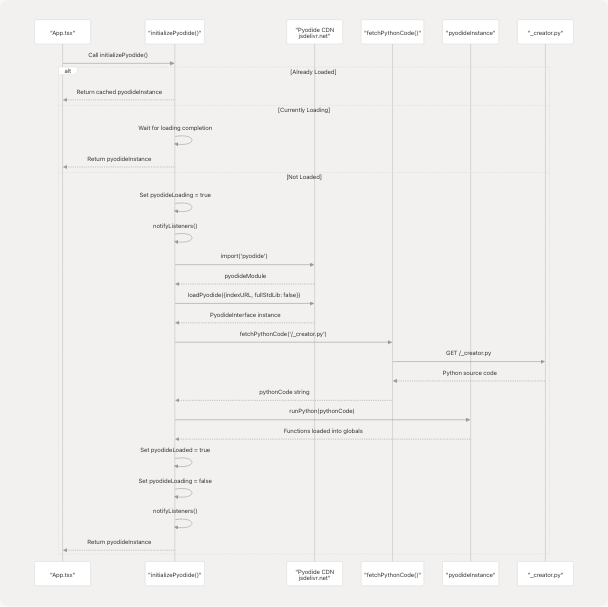
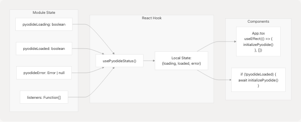
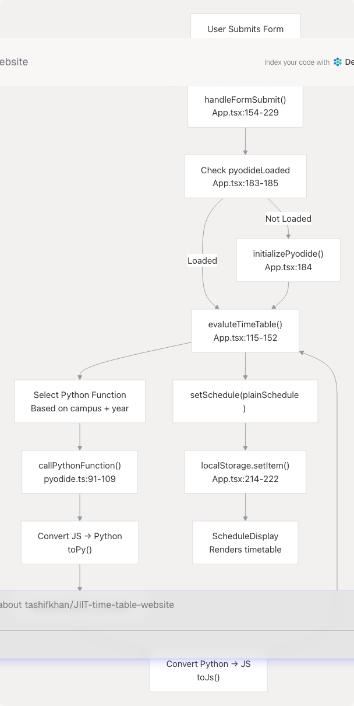

# Pyodide WASM Integration

## Purpose and Scope

This document details the client-side Python execution system powered by Pyodide WebAssembly. The system enables timetable generation logic to run entirely in the browser without requiring a backend server. This page covers Pyodide initialization, Python module loading, function invocation, and type conversion between JavaScript and Python.

For information about the Python timetable generation algorithms themselves, see [Python Processing Pipeline](4.2-python-processing-pipeline). For how schedule generation is orchestrated at the application level, see [Schedule Generation](4-schedule-generation-(core-feature)).

---

## System Overview

The Pyodide integration consists of three main components:

| Component | Location | Purpose |
| --- | --- | --- |
| **Initialization Layer** | [src/utils/pyodide.ts23-58](https://github.com/tashifkhan/JIIT-time-table-website/blob/0ffdedf5/src/utils/pyodide.ts#L23-L58) | Loads Pyodide runtime from CDN and initializes Python environment |
| **Python Modules** | [public/\_creator.py](https://github.com/tashifkhan/JIIT-time-table-website/blob/0ffdedf5/public/_creator.py) [public/modules/BE62\_creator.py](https://github.com/tashifkhan/JIIT-time-table-website/blob/0ffdedf5/public/modules/BE62_creator.py) [public/modules/BE128\_creator.py](https://github.com/tashifkhan/JIIT-time-table-website/blob/0ffdedf5/public/modules/BE128_creator.py) | Contains timetable parsing and generation logic |
| **Function Bridge** | [src/utils/pyodide.ts91-109](https://github.com/tashifkhan/JIIT-time-table-website/blob/0ffdedf5/src/utils/pyodide.ts#L91-L109) | Converts JavaScript data to Python objects and calls Python functions |

### Pyodide Instance Management

The system maintains a single global Pyodide instance to avoid repeated loading overhead. The instance lifecycle is managed through module-level variables in [src/utils/pyodide.ts6-10](https://github.com/tashifkhan/JIIT-time-table-website/blob/0ffdedf5/src/utils/pyodide.ts#L6-L10):

```
let pyodideInstance: PyodideInterface | null = null;
let pyodideLoading = false;
let pyodideLoaded = false;
let pyodideError: Error | null = null;
let listeners: (() => void)[] = [];
```

**Sources:** [src/utils/pyodide.ts1-82](https://github.com/tashifkhan/JIIT-time-table-website/blob/0ffdedf5/src/utils/pyodide.ts#L1-L82)

---

## Initialization Flow



### Initialization Steps

1. **Check Existing State** [src/utils/pyodide.ts24-35](https://github.com/tashifkhan/JIIT-time-table-website/blob/0ffdedf5/src/utils/pyodide.ts#L24-L35)

   * Returns cached `pyodideInstance` if already loaded
   * Waits for completion if loading is in progress
   * Prevents duplicate initialization
2. **Load Pyodide Runtime** [src/utils/pyodide.ts39-44](https://github.com/tashifkhan/JIIT-time-table-website/blob/0ffdedf5/src/utils/pyodide.ts#L39-L44)

   * Dynamic import from `'pyodide'` package
   * Loads WASM runtime from `https://cdn.jsdelivr.net/pyodide/v0.27.0/full/`
   * Uses `fullStdLib: false` to reduce download size (~10MB vs ~50MB)
3. **Fetch Python Module** [src/utils/pyodide.ts15-21](https://github.com/tashifkhan/JIIT-time-table-website/blob/0ffdedf5/src/utils/pyodide.ts#L15-L21) [src/utils/pyodide.ts45](https://github.com/tashifkhan/JIIT-time-table-website/blob/0ffdedf5/src/utils/pyodide.ts#L45-L45)

   * Fetches `/_creator.py` from public directory
   * Module URL defined in [src/utils/pyodide.ts13](https://github.com/tashifkhan/JIIT-time-table-website/blob/0ffdedf5/src/utils/pyodide.ts#L13-L13): `const pythonModuleURL = '/_creator.py'`
4. **Execute Python Code** [src/utils/pyodide.ts46](https://github.com/tashifkhan/JIIT-time-table-website/blob/0ffdedf5/src/utils/pyodide.ts#L46-L46)

   * Calls `pyodideInstance.runPython(pythonCode)`
   * Functions become available in `pyodide.globals`
   * Includes functions: `time_table_creator`, `time_table_creator_v2`, `bca_creator`, `bca_creator_year1`, `banado128`, `bando128_year1`, `compare_timetables`

**Sources:** [src/utils/pyodide.ts23-58](https://github.com/tashifkhan/JIIT-time-table-website/blob/0ffdedf5/src/utils/pyodide.ts#L23-L58) [src/utils/pyodide.ts15-21](https://github.com/tashifkhan/JIIT-time-table-website/blob/0ffdedf5/src/utils/pyodide.ts#L15-L21)

---

## Python Module Architecture

The Python timetable generation logic is organized across multiple modules:


### Function Selection Logic

The application dynamically selects which Python function to call based on campus and year parameters in [src/App.tsx115-152](https://github.com/tashifkhan/JIIT-time-table-website/blob/0ffdedf5/src/App.tsx#L115-L152):

| Campus | Year | Function Name | Location |
| --- | --- | --- | --- |
| 62 | 1 | `time_table_creator` | [public/\_creator.py423-531](https://github.com/tashifkhan/JIIT-time-table-website/blob/0ffdedf5/public/_creator.py#L423-L531) |
| 62 | 2-4 | `time_table_creator_v2` | [public/\_creator.py949-1015](https://github.com/tashifkhan/JIIT-time-table-website/blob/0ffdedf5/public/_creator.py#L949-L1015) |
| 128 | 1 | `bando128_year1` | [public/\_creator.py817-883](https://github.com/tashifkhan/JIIT-time-table-website/blob/0ffdedf5/public/_creator.py#L817-L883) |
| 128 | 2-4 | `banado128` | [public/\_creator.py739-815](https://github.com/tashifkhan/JIIT-time-table-website/blob/0ffdedf5/public/_creator.py#L739-L815) |
| BCA | 1 | `bca_creator_year1` | [public/\_creator.py1018-1084](https://github.com/tashifkhan/JIIT-time-table-website/blob/0ffdedf5/public/_creator.py#L1018-L1084) |
| BCA | 2-3 | `bca_creator` | [public/\_creator.py1087-1153](https://github.com/tashifkhan/JIIT-time-table-website/blob/0ffdedf5/public/_creator.py#L1087-L1153) |

**Sources:** [src/App.tsx115-152](https://github.com/tashifkhan/JIIT-time-table-website/blob/0ffdedf5/src/App.tsx#L115-L152) [public/\_creator.py423-531](https://github.com/tashifkhan/JIIT-time-table-website/blob/0ffdedf5/public/_creator.py#L423-L531) [public/\_creator.py739-883](https://github.com/tashifkhan/JIIT-time-table-website/blob/0ffdedf5/public/_creator.py#L739-L883) [public/\_creator.py949-1153](https://github.com/tashifkhan/JIIT-time-table-website/blob/0ffdedf5/public/_creator.py#L949-L1153)

---

## Function Invocation Pipeline


### Type Conversion Layer

The `callPythonFunction` in [src/utils/pyodide.ts91-109](https://github.com/tashifkhan/JIIT-time-table-website/blob/0ffdedf5/src/utils/pyodide.ts#L91-L109) handles bidirectional type conversion:

**JavaScript to Python** [src/utils/pyodide.ts99-102](https://github.com/tashifkhan/JIIT-time-table-website/blob/0ffdedf5/src/utils/pyodide.ts#L99-L102):

```
const pyTimeTable = pyodide.toPy(args.time_table_json);
const pySubjects = pyodide.toPy(args.subject_json);
const pyBatch = pyodide.toPy(args.batch);
const pyElectives = pyodide.toPy(args.electives_subject_codes);
```

**Python to JavaScript** [src/utils/pyodide.ts104](https://github.com/tashifkhan/JIIT-time-table-website/blob/0ffdedf5/src/utils/pyodide.ts#L104-L104):

```
return result.toJs();
```

### Function Arguments Interface

The TypeScript interface defines the expected structure in [src/utils/pyodide.ts84-89](https://github.com/tashifkhan/JIIT-time-table-website/blob/0ffdedf5/src/utils/pyodide.ts#L84-L89):

```
interface PythonFunctionArgs {
  time_table_json: YourTietable, 
  subject_json: Subject[], 
  batch: string, 
  electives_subject_codes: string[]
}
```

**Sources:** [src/utils/pyodide.ts91-109](https://github.com/tashifkhan/JIIT-time-table-website/blob/0ffdedf5/src/utils/pyodide.ts#L91-L109) [src/utils/pyodide.ts84-89](https://github.com/tashifkhan/JIIT-time-table-website/blob/0ffdedf5/src/utils/pyodide.ts#L84-L89) [src/App.tsx115-152](https://github.com/tashifkhan/JIIT-time-table-website/blob/0ffdedf5/src/App.tsx#L115-L152)

---

## Status Tracking System

The Pyodide integration provides a React hook for tracking initialization status:



### Status Hook Implementation

The `usePyodideStatus` hook in [src/utils/pyodide.ts64-82](https://github.com/tashifkhan/JIIT-time-table-website/blob/0ffdedf5/src/utils/pyodide.ts#L64-L82) provides reactive status updates:

```
export function usePyodideStatus() {
  const [status, setStatus] = useState<{
    loading: boolean;
    loaded: boolean;
    error: Error | null;
  }>({ loading: pyodideLoading, loaded: pyodideLoaded, error: pyodideError });

  useEffect(() => {
    const cb = () => {
      setStatus({ loading: pyodideLoading, loaded: pyodideLoaded, error: pyodideError });
    };
    listeners.push(cb);
    return () => {
      listeners = listeners.filter((l) => l !== cb);
    };
  }, []);

  return status;
}
```

### Usage in Application

**Initialization Trigger** [src/App.tsx111-113](https://github.com/tashifkhan/JIIT-time-table-website/blob/0ffdedf5/src/App.tsx#L111-L113):

```
React.useEffect(() => {
  initializePyodide();
}, []);
```

**Conditional Loading** [src/App.tsx183-185](https://github.com/tashifkhan/JIIT-time-table-website/blob/0ffdedf5/src/App.tsx#L183-L185):

```
if (!pyodideLoaded) {
  await initializePyodide();
}
```

**Status Check** [src/App.tsx102](https://github.com/tashifkhan/JIIT-time-table-website/blob/0ffdedf5/src/App.tsx#L102-L102):

```
const { loaded: pyodideLoaded } = usePyodideStatus();
```

**Sources:** [src/utils/pyodide.ts64-82](https://github.com/tashifkhan/JIIT-time-table-website/blob/0ffdedf5/src/utils/pyodide.ts#L64-L82) [src/App.tsx102](https://github.com/tashifkhan/JIIT-time-table-website/blob/0ffdedf5/src/App.tsx#L102-L102) [src/App.tsx111-113](https://github.com/tashifkhan/JIIT-time-table-website/blob/0ffdedf5/src/App.tsx#L111-L113) [src/App.tsx183-185](https://github.com/tashifkhan/JIIT-time-table-website/blob/0ffdedf5/src/App.tsx#L183-L185)

---

## Error Handling

The system implements multiple error handling strategies:

### Initialization Errors

Errors during Pyodide loading are captured and stored in [src/utils/pyodide.ts52-57](https://github.com/tashifkhan/JIIT-time-table-website/blob/0ffdedf5/src/utils/pyodide.ts#L52-L57):

```
catch (err) {
  pyodideError = err as Error;
  pyodideLoading = false;
  notifyListeners();
  throw err;
}
```

### Function Invocation Errors

Errors during Python function calls are logged and re-thrown in [src/utils/pyodide.ts105-108](https://github.com/tashifkhan/JIIT-time-table-website/blob/0ffdedf5/src/utils/pyodide.ts#L105-L108):

```
catch (error) {
  console.error('Error calling Python function:', error);
  throw error;
}
```

### Function Validation

The system validates Python function existence before invocation in [src/utils/pyodide.ts94-98](https://github.com/tashifkhan/JIIT-time-table-website/blob/0ffdedf5/src/utils/pyodide.ts#L94-L98):

```
const pythonFunction = pyodide.globals.get(functionName);
if (!pythonFunction || typeof pythonFunction !== 'function') {
  console.error('Available globals:', Object.keys(pyodide.globals.toJs()));
  throw new Error(`Function ${functionName} is not a valid Python function`);
}
```

**Sources:** [src/utils/pyodide.ts52-57](https://github.com/tashifkhan/JIIT-time-table-website/blob/0ffdedf5/src/utils/pyodide.ts#L52-L57) [src/utils/pyodide.ts94-98](https://github.com/tashifkhan/JIIT-time-table-website/blob/0ffdedf5/src/utils/pyodide.ts#L94-L98) [src/utils/pyodide.ts105-108](https://github.com/tashifkhan/JIIT-time-table-website/blob/0ffdedf5/src/utils/pyodide.ts#L105-L108)

---

## Performance Considerations

### Cold Start Performance

| Phase | Duration | Description |
| --- | --- | --- |
| **CDN Download** | ~3-5 seconds | Downloads ~10MB Pyodide WASM runtime |
| **WASM Compilation** | ~1-2 seconds | Browser compiles WebAssembly modules |
| **Python Module Load** | ~100-200ms | Fetches and executes `_creator.py` |
| **First Execution** | ~500ms-1s | Initial Python function execution |
| **Subsequent Executions** | ~50-150ms | Cached and optimized |

### Optimization Strategies

1. **Reduced Standard Library** [src/utils/pyodide.ts43](https://github.com/tashifkhan/JIIT-time-table-website/blob/0ffdedf5/src/utils/pyodide.ts#L43-L43)

   * Sets `fullStdLib: false` to minimize download size
   * Only essential packages loaded
2. **Global Instance Caching** [src/utils/pyodide.ts6](https://github.com/tashifkhan/JIIT-time-table-website/blob/0ffdedf5/src/utils/pyodide.ts#L6-L6)

   * Single `pyodideInstance` reused across all function calls
   * Eliminates repeated initialization overhead
3. **Listener Pattern** [src/utils/pyodide.ts60-62](https://github.com/tashifkhan/JIIT-time-table-website/blob/0ffdedf5/src/utils/pyodide.ts#L60-L62)

   * Notifies React components of status changes
   * Prevents polling or repeated checks
4. **Double Execution Workaround** [src/App.tsx194-204](https://github.com/tashifkhan/JIIT-time-table-website/blob/0ffdedf5/src/App.tsx#L194-L204)

   * First execution may be slower; runs twice initially
   * Ensures proper WASM optimization

**Sources:** [src/utils/pyodide.ts6](https://github.com/tashifkhan/JIIT-time-table-website/blob/0ffdedf5/src/utils/pyodide.ts#L6-L6) [src/utils/pyodide.ts41-44](https://github.com/tashifkhan/JIIT-time-table-website/blob/0ffdedf5/src/utils/pyodide.ts#L41-L44) [src/utils/pyodide.ts60-62](https://github.com/tashifkhan/JIIT-time-table-website/blob/0ffdedf5/src/utils/pyodide.ts#L60-L62) [src/App.tsx194-204](https://github.com/tashifkhan/JIIT-time-table-website/blob/0ffdedf5/src/App.tsx#L194-L204)

---

## Integration Points

### Main Application Flow



### External Module Loading

The system can be extended to load additional Python modules. Currently, only `_creator.py` is loaded, but the architecture in [src/utils/pyodide.ts15-21](https://github.com/tashifkhan/JIIT-time-table-website/blob/0ffdedf5/src/utils/pyodide.ts#L15-L21) supports fetching multiple modules:

```
async function fetchPythonCode(url: string): Promise<string> {
  const response = await fetch(url);
  if (!response.ok) {
    throw new Error(`Failed to fetch Python module from ${url}: ${response.statusText}`);
  }
  return response.text();
}
```

**Sources:** [src/App.tsx154-229](https://github.com/tashifkhan/JIIT-time-table-website/blob/0ffdedf5/src/App.tsx#L154-L229) [src/App.tsx115-152](https://github.com/tashifkhan/JIIT-time-table-website/blob/0ffdedf5/src/App.tsx#L115-L152) [src/utils/pyodide.ts91-109](https://github.com/tashifkhan/JIIT-time-table-website/blob/0ffdedf5/src/utils/pyodide.ts#L91-L109) [src/utils/pyodide.ts15-21](https://github.com/tashifkhan/JIIT-time-table-website/blob/0ffdedf5/src/utils/pyodide.ts#L15-L21)

---

## Summary

The Pyodide WASM integration provides a serverless architecture by executing Python timetable generation logic directly in the browser. Key characteristics:

* **Single Global Instance**: Cached `pyodideInstance` eliminates repeated initialization
* **Dynamic Function Selection**: Routes to appropriate Python function based on campus/year
* **Type Safety**: TypeScript interfaces define function arguments and ensure type correctness
* **Reactive Status**: `usePyodideStatus` hook enables UI to respond to loading states
* **Optimized Loading**: `fullStdLib: false` reduces initial payload size

This architecture eliminates the need for a backend server while maintaining full Python compatibility for complex timetable parsing and generation algorithms.

**Sources:** [src/utils/pyodide.ts1-109](https://github.com/tashifkhan/JIIT-time-table-website/blob/0ffdedf5/src/utils/pyodide.ts#L1-L109) [src/App.tsx102-229](https://github.com/tashifkhan/JIIT-time-table-website/blob/0ffdedf5/src/App.tsx#L102-L229) [public/\_creator.py](https://github.com/tashifkhan/JIIT-time-table-website/blob/0ffdedf5/public/_creator.py)
