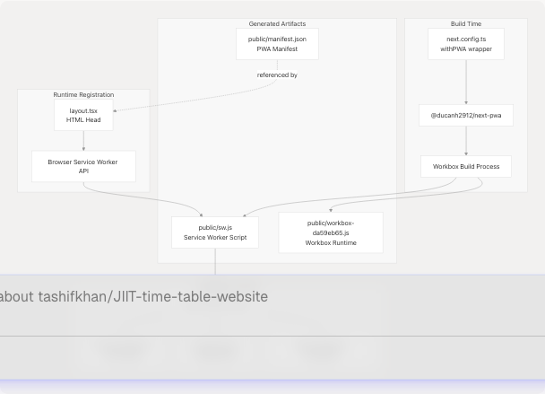
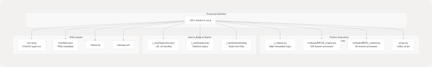

# PWA & Offline Capabilities

Relevant source files

* [README.md](https://github.com/tashifkhan/JIIT-time-table-website/blob/0ffdedf5/README.md)
* [website/app/layout.tsx](https://github.com/tashifkhan/JIIT-time-table-website/blob/0ffdedf5/website/app/layout.tsx)
* [website/next.config.ts](https://github.com/tashifkhan/JIIT-time-table-website/blob/0ffdedf5/website/next.config.ts)
* [website/public/sw.js](https://github.com/tashifkhan/JIIT-time-table-website/blob/0ffdedf5/website/public/sw.js)
* [website/public/workbox-da59eb65.js](https://github.com/tashifkhan/JIIT-time-table-website/blob/0ffdedf5/website/public/workbox-da59eb65.js)

This document describes the Progressive Web App (PWA) implementation and offline capabilities of the JIIT Time Table website. It covers the service worker architecture, caching strategies, precaching manifest generation, and how the application achieves full offline functionality.

For information about the Next.js application structure and routing, see [Frontend Architecture & Routing](/tashifkhan/JIIT-time-table-website/3.1-frontend-architecture-and-routing). For details on how Python modules are loaded and cached for offline use, see [Pyodide WASM Integration](/tashifkhan/JIIT-time-table-website/3.2-pyodide-wasm-integration).

---

## Purpose and Scope

The JIIT Time Table website is designed as a fully-functional offline-first Progressive Web App. Once installed, users can:

* Generate personalized timetables without internet connectivity
* Access all previously loaded timetable data
* Execute Python timetable processing logic via cached Pyodide WebAssembly runtime
* View the timeline/calendar interface with locally stored schedules

This is achieved through a sophisticated service worker implementation that caches static assets, timetable JSON data, Python modules, and the multi-megabyte Pyodide runtime.

---

## PWA Architecture Overview

The PWA implementation uses `@ducanh2912/next-pwa`, a Next.js plugin that wraps Workbox strategies to generate an optimized service worker at build time.


```

**Sources**: [website/next.config.ts1-41](https://github.com/tashifkhan/JIIT-time-table-website/blob/0ffdedf5/website/next.config.ts#L1-L41) [website/app/layout.tsx1-104](https://github.com/tashifkhan/JIIT-time-table-website/blob/0ffdedf5/website/app/layout.tsx#L1-L104) [website/public/sw.js1-2](https://github.com/tashifkhan/JIIT-time-table-website/blob/0ffdedf5/website/public/sw.js#L1-L2) [website/public/workbox-da59eb65.js1-2](https://github.com/tashifkhan/JIIT-time-table-website/blob/0ffdedf5/website/public/workbox-da59eb65.js#L1-L2)

---

## Service Worker Configuration

The service worker is configured in `next.config.ts` using the `withPWA` wrapper function. The configuration is disabled during development and only active in production builds.

### Configuration Options

| Option | Value | Purpose |
| --- | --- | --- |
| `dest` | `"public"` | Output directory for generated SW files |
| `register` | `true` | Auto-register service worker on page load |
| `skipWaiting` | `true` | Activate new SW immediately without waiting |
| `disable` | `process.env.NODE_ENV === "development"` | Disable during local development |

### Workbox Runtime Caching Configuration

```

```

The Pyodide CDN cache rule at [website/next.config.ts21-36](https://github.com/tashifkhan/JIIT-time-table-website/blob/0ffdedf5/website/next.config.ts#L21-L36) implements an aggressive `CacheFirst` strategy:

```
```
runtimeCaching: [
  {
    urlPattern: /^https:\/\/cdn\.jsdelivr\.net\/pyodide\/v0\.27\.0\/full\/.*/,
    handler: "CacheFirst",
    options: {
      cacheName: "pyodide-cache",
      expiration: {
        maxEntries: 10,
        maxAgeSeconds: 60 * 60 * 24 * 365, // 1 year
      },
      cacheableResponse: {
        statuses: [0, 200],
      },
    },
  },
]
```
```

**Sources**: [website/next.config.ts15-38](https://github.com/tashifkhan/JIIT-time-table-website/blob/0ffdedf5/website/next.config.ts#L15-L38)

---

## Precache Manifest

At build time, the PWA plugin generates a precache manifest containing all static assets that should be available offline. The generated service worker includes this manifest inline.

### Precached Asset Categories

```

```

### Sample Precache Entries

The precache list in [website/public/sw.js1-2](https://github.com/tashifkhan/JIIT-time-table-website/blob/0ffdedf5/website/public/sw.js#L1-L2) includes entries with revision hashes for cache invalidation:

| Resource Type | Example Path | Revision Hash |
| --- | --- | --- |
| Python module | `/_creator.py` | `51e7cbe1d5819fbb969373faecb24a03` |
| Python module | `/modules/BE128_creator.py` | `179b16b198ee6f34988320b9ec3f0942` |
| Next.js chunk | `/_next/static/chunks/125.9d1280b435bd664c.js` | `9d1280b435bd664c` |
| CSS | `/_next/static/css/688463ca9d49603e.css` | `688463ca9d49603e` |
| Font | `/_next/static/media/747892c23ea88013-s.woff2` | `a0761690ccf4441ace5cec893b82d4ab` |
| PWA asset | `/icon.png` | `51cb25401a45c2e1b666fd401d2a6f51` |
| Manifest | `/manifest.json` | `5af93678251ec28139ff157755eb78a2` |

**Sources**: [website/public/sw.js1-2](https://github.com/tashifkhan/JIIT-time-table-website/blob/0ffdedf5/website/public/sw.js#L1-L2)

---

## Caching Strategies

The service worker implements three distinct caching strategies optimized for different resource types.

```

```

### Strategy Breakdown

#### 1. NetworkFirst Strategy

Applied to: Root path (`/`)

This strategy prioritizes fresh content while maintaining offline fallback capability. Defined in [website/public/sw.js1-2](https://github.com/tashifkhan/JIIT-time-table-website/blob/0ffdedf5/website/public/sw.js#L1-L2):

```
```
e.registerRoute("/",new e.NetworkFirst({
  cacheName:"start-url",
  plugins:[{
    cacheWillUpdate:async({response:e})=>
      e&&"opaqueredirect"===e.type?
        new Response(e.body,{status:200,statusText:"OK",headers:e.headers}):
        e
  }]
}),"GET")
```
```

**Behavior**:

1. Always attempt network request first
2. On success: cache response and return it
3. On failure: serve from `start-url` cache if available
4. Handles opaque redirects by converting to transparent responses

#### 2. CacheFirst Strategy

Applied to: Pyodide CDN resources (`https://cdn.jsdelivr.net/pyodide/v0.27.0/full/*`)

This aggressive caching strategy is essential for offline Python execution. Configuration at [website/next.config.ts23-35](https://github.com/tashifkhan/JIIT-time-table-website/blob/0ffdedf5/website/next.config.ts#L23-L35):

**Behavior**:

1. Check `pyodide-cache` cache first
2. On cache hit: return immediately (no network request)
3. On cache miss: fetch from CDN and cache for 1 year
4. Maximum 10 entries (sufficient for Pyodide runtime files)
5. Caches both CORS (`status: 200`) and opaque (`status: 0`) responses

#### 3. Precache Matching

Applied to: All precached assets (Next.js chunks, Python files, fonts, etc.)

**Behavior**:

1. Assets are cached during service worker installation
2. Requests are intercepted and matched against precache manifest
3. Returns cached asset immediately (fastest strategy)
4. No network request is made
5. Cache is invalidated when revision hash changes

**Sources**: [website/public/sw.js1-2](https://github.com/tashifkhan/JIIT-time-table-website/blob/0ffdedf5/website/public/sw.js#L1-L2) [website/next.config.ts20-37](https://github.com/tashifkhan/JIIT-time-table-website/blob/0ffdedf5/website/next.config.ts#L20-L37) [website/public/workbox-da59eb65.js1-2](https://github.com/tashifkhan/JIIT-time-table-website/blob/0ffdedf5/website/public/workbox-da59eb65.js#L1-L2)

---

## Service Worker Lifecycle

The service worker follows a standard lifecycle with specific handling for updates and cache management.

### Service Worker Registration

The service worker is auto-registered by the PWA plugin. The `register: true` option at [website/next.config.ts17](https://github.com/tashifkhan/JIIT-time-table-website/blob/0ffdedf5/website/next.config.ts#L17-L17) ensures automatic registration on page load.

### Skip Waiting Behavior

The `skipWaiting: true` option at [website/next.config.ts18](https://github.com/tashifkhan/JIIT-time-table-website/blob/0ffdedf5/website/next.config.ts#L18-L18) causes new service workers to activate immediately without waiting for all tabs to close. This is reflected in the generated code:

```
```
self.skipWaiting()
e.clientsClaim()
```

This ensures users get updates as soon as they refresh the page.

### Cache Cleanup

The service worker includes automatic cleanup of outdated caches using `cleanupOutdatedCaches()` from [website/public/sw.js1-2](https://github.com/tashifkhan/JIIT-time-table-website/blob/0ffdedf5/website/public/sw.js#L1-L2) This removes caches from previous versions that no longer match the current precache manifest.

**Sources**: [website/next.config.ts15-19](https://github.com/tashifkhan/JIIT-time-table-website/blob/0ffdedf5/website/next.config.ts#L15-L19) [website/public/sw.js1-2](https://github.com/tashifkhan/JIIT-time-table-website/blob/0ffdedf5/website/public/sw.js#L1-L2)

---

## Offline Functionality Matrix

The following table shows which features are available offline after the initial load:

| Feature | Offline Capable | Requirements |
| --- | --- | --- |
| Schedule generation | ✅ Yes | Timetable JSON must be previously accessed |
| Python timetable processing | ✅ Yes | Pyodide runtime cached from CDN |
| Timeline view | ✅ Yes | Schedule stored in localStorage (see [State Management](/tashifkhan/JIIT-time-table-website/3.5-state-management)) |
| Academic calendar display | ✅ Yes | Calendar JSON must be previously loaded |
| Edit events | ✅ Yes | All editing happens client-side |
| Custom events | ✅ Yes | Stored in localStorage |
| Google Calendar sync | ❌ No | Requires OAuth and network connection |
| PDF export | ✅ Yes | Uses client-side rendering |
| PNG export | ✅ Yes | Uses client-side canvas rendering |
| Compare timetables | ✅ Yes | If both timetable JSONs are cached |
| Mess menu | ❌ Partial | Requires network for fresh data |

### Offline Data Requirements

**Note**: Timetable and calendar JSON files are NOT precached because they are dynamic and version-specific (e.g., `ODD25` vs `EVEN25`, `2425` vs `2526`). They are cached on first access via the browser's HTTP cache or explicit runtime caching.

**Sources**: [README.md18-34](https://github.com/tashifkhan/JIIT-time-table-website/blob/0ffdedf5/README.md#L18-L34) [website/next.config.ts20-37](https://github.com/tashifkhan/JIIT-time-table-website/blob/0ffdedf5/website/next.config.ts#L20-L37)

---

## PWA Manifest Configuration

The PWA manifest defines how the application appears when installed on a device. It is referenced in the application layout at [website/app/layout.tsx44](https://github.com/tashifkhan/JIIT-time-table-website/blob/0ffdedf5/website/app/layout.tsx#L44-L44)

### Manifest Metadata

The manifest file at `/public/manifest.json` contains:

| Field | Value/Purpose |
| --- | --- |
| `name` | "JIIT Time Table Simplified" |
| `short_name` | Abbreviated name for home screen |
| `description` | Application description from [website/app/layout.tsx26-27](https://github.com/tashifkhan/JIIT-time-table-website/blob/0ffdedf5/website/app/layout.tsx#L26-L27) |
| `start_url` | "/" (root path) |
| `display` | "standalone" (full-screen app mode) |
| `background_color` | Theme color |
| `theme_color` | "#F0BB78" (specified at [website/app/layout.tsx21](https://github.com/tashifkhan/JIIT-time-table-website/blob/0ffdedf5/website/app/layout.tsx#L21-L21)) |
| `icons` | 512x512 PNG icon |

### Icon Configuration

Multiple icon declarations ensure proper display across platforms:

```
```
icons: {
  icon: [
    { url: "/icon.png", sizes: "512x512", type: "image/png" },
    {
      url: "/icon.png",
      sizes: "512x512",
      type: "image/png",
      media: "(display-mode: standalone)",
    },
  ],
  apple: "/icon.png",
}
```
```

### iOS-Specific Configuration

Additional metadata for iOS devices at [website/app/layout.tsx57-62](https://github.com/tashifkhan/JIIT-time-table-website/blob/0ffdedf5/website/app/layout.tsx#L57-L62):

```
```
appleWebApp: {
  capable: true,
  statusBarStyle: "black-translucent",
  title: "JIIT Timetable",
  startupImage: ["/icon.png"],
}
```
```

**Sources**: [website/app/layout.tsx44-62](https://github.com/tashifkhan/JIIT-time-table-website/blob/0ffdedf5/website/app/layout.tsx#L44-L62) [README.md21](https://github.com/tashifkhan/JIIT-time-table-website/blob/0ffdedf5/README.md#L21-L21)

---

## Security Headers for WASM

The application requires specific security headers to enable SharedArrayBuffer support for Pyodide WebAssembly execution:

```
```
other: {
  "Cross-Origin-Opener-Policy": "same-origin",
  "Cross-Origin-Embedder-Policy": "require-corp",
}
```
```

These headers are defined at [website/app/layout.tsx63-66](https://github.com/tashifkhan/JIIT-time-table-website/blob/0ffdedf5/website/app/layout.tsx#L63-L66) and are critical for:

* Enabling `SharedArrayBuffer` API required by Pyodide
* Isolating the document in its own browsing context
* Preventing cross-origin resource access vulnerabilities

**Note**: These headers must be set at the server level during deployment to take effect.

**Sources**: [website/app/layout.tsx63-66](https://github.com/tashifkhan/JIIT-time-table-website/blob/0ffdedf5/website/app/layout.tsx#L63-L66)

---

## Cache Storage Structure

When the service worker is active, the following caches are created in the browser:

### Cache Inspection

Developers can inspect these caches in browser DevTools:

1. Open DevTools → Application tab
2. Navigate to Cache Storage
3. Expand to see `workbox-precache-v2`, `start-url`, and `pyodide-cache`
4. Click each cache to inspect stored entries

### Cache Size Considerations

| Cache | Approximate Size | Notes |
| --- | --- | --- |
| `workbox-precache-v2` | 2-4 MB | Varies with Next.js bundle size |
| `pyodide-cache` | 8-10 MB | Largest cache, contains WASM runtime |
| `start-url` | < 100 KB | Single HTML document |
| **Total** | **~10-15 MB** | Acceptable for PWA standards |

**Sources**: [website/next.config.ts20-37](https://github.com/tashifkhan/JIIT-time-table-website/blob/0ffdedf5/website/next.config.ts#L20-L37) [website/public/sw.js1-2](https://github.com/tashifkhan/JIIT-time-table-website/blob/0ffdedf5/website/public/sw.js#L1-L2)

---

## Development vs Production Behavior

The PWA functionality is environment-aware:

### Development Mode (`npm run dev`)

When `process.env.NODE_ENV === "development"`:

```
```
disable: process.env.NODE_ENV === "development"
```
```

**Behavior**:

* Service worker is NOT registered
* No caching occurs
* Hot module replacement works normally
* Changes reflect immediately
* Easier debugging without cache interference

### Production Mode (`npm run build` + deployment)

When built for production:

**Behavior**:

* Service worker is generated at build time
* All precache assets are included with revision hashes
* Service worker registers automatically on first page load
* Caching strategies activate immediately
* Application becomes fully offline-capable after first visit

### Testing PWA Locally

To test PWA functionality locally:

1. Build the production version: `npm run build`
2. Serve the build output (use a static server)
3. Open in browser and install PWA
4. Disconnect network to test offline mode

**Sources**: [website/next.config.ts19](https://github.com/tashifkhan/JIIT-time-table-website/blob/0ffdedf5/website/next.config.ts#L19-L19) [README.md148-186](https://github.com/tashifkhan/JIIT-time-table-website/blob/0ffdedf5/README.md#L148-L186)

---

## Build Configuration Details

The complete Next.js configuration showing PWA integration:

```
```
const nextConfig: NextConfig = {
  async rewrites() {
    return [
      {
        source: "/ph/:path*",
        destination: "https://eu.posthog.com/:path*",
      },
    ];
  },
  turbopack: {},
};

const withPWA = require("@ducanh2912/next-pwa").default({
  dest: "public",
  register: true,
  skipWaiting: true,
  disable: process.env.NODE_ENV === "development",
  workboxOptions: {
    runtimeCaching: [
      {
        urlPattern: /^https:\/\/cdn\.jsdelivr\.net\/pyodide\/v0\.27\.0\/full\/.*/,
        handler: "CacheFirst",
        options: {
          cacheName: "pyodide-cache",
          expiration: {
            maxEntries: 10,
            maxAgeSeconds: 60 * 60 * 24 * 365, // 1 year
          },
          cacheableResponse: {
            statuses: [0, 200],
          },
        },
      },
    ],
  },
});

export default withPWA(nextConfig);
```
```

The `withPWA` wrapper:

1. Takes the base `nextConfig` object
2. Adds service worker generation to the build process
3. Injects service worker registration code into the HTML
4. Generates precache manifest from build output
5. Creates workbox configuration files

**Sources**: [website/next.config.ts1-41](https://github.com/tashifkhan/JIIT-time-table-website/blob/0ffdedf5/website/next.config.ts#L1-L41)

---

## Troubleshooting Offline Issues

Common issues and solutions:

| Issue | Cause | Solution |
| --- | --- | --- |
| Service worker not registering | Development mode active | Build for production with `npm run build` |
| Assets not cached | First visit hasn't completed | Wait for all assets to load on first visit |
| Python execution fails offline | Pyodide runtime not cached | Visit the schedule creator page while online first |
| Old version persists | Service worker not updating | Hard refresh (Ctrl+Shift+R) or unregister SW in DevTools |
| Timetable data not available offline | JSON not previously accessed | Access timetable for desired semester while online |
| Large cache size warning | Normal for Pyodide | 10-15 MB is expected and acceptable |

### Manual Service Worker Unregistration

To force a clean state during debugging:

```
```
// Run in browser console
navigator.serviceWorker.getRegistrations().then(function(registrations) {
  for(let registration of registrations) {
    registration.unregister();
  }
});
```
```

**Sources**: [README.md215-222](https://github.com/tashifkhan/JIIT-time-table-website/blob/0ffdedf5/README.md#L215-L222) [website/next.config.ts15-38](https://github.com/tashifkhan/JIIT-time-table-website/blob/0ffdedf5/website/next.config.ts#L15-L38)

---

## Summary

The PWA implementation provides:

1. **Full offline functionality** after initial load
2. **Intelligent caching** with three strategies optimized for different resource types
3. **Automatic updates** via service worker lifecycle with skipWaiting
4. **Minimal cache footprint** (~10-15 MB total)
5. **One-year Pyodide cache** to avoid re-downloading 8-10 MB WASM runtime
6. **Installability** with proper manifest and icons
7. **Development-friendly** with automatic disable during local development

The service worker ensures that all critical resources (Python modules, application code, Pyodide runtime) are available offline, enabling the unique browser-based Python execution model to work without network connectivity.

**Sources**: [website/next.config.ts1-41](https://github.com/tashifkhan/JIIT-time-table-website/blob/0ffdedf5/website/next.config.ts#L1-L41) [website/app/layout.tsx1-104](https://github.com/tashifkhan/JIIT-time-table-website/blob/0ffdedf5/website/app/layout.tsx#L1-L104) [website/public/sw.js1-2](https://github.com/tashifkhan/JIIT-time-table-website/blob/0ffdedf5/website/public/sw.js#L1-L2) [website/public/workbox-da59eb65.js1-2](https://github.com/tashifkhan/JIIT-time-table-website/blob/0ffdedf5/website/public/workbox-da59eb65.js#L1-L2) [README.md18-34](https://github.com/tashifkhan/JIIT-time-table-website/blob/0ffdedf5/README.md#L18-L34)