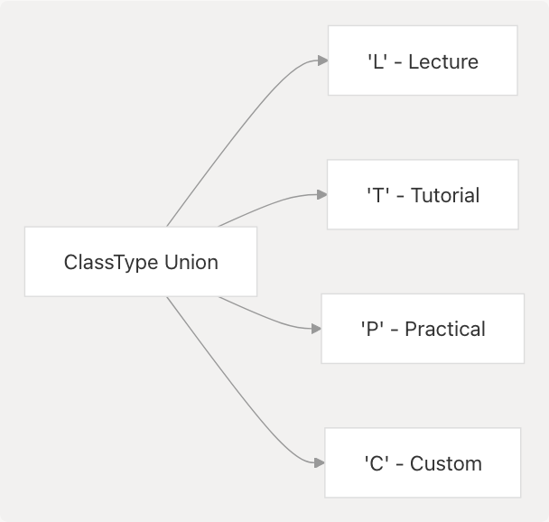
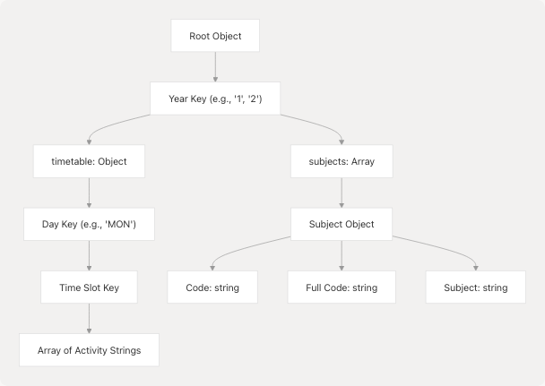
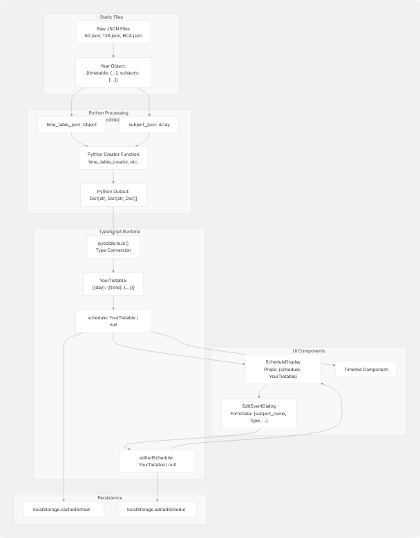

# Data Model & Types

This document defines the TypeScript interfaces and data structures that represent timetable data throughout the application. It covers the primary `YourTietable` interface, schedule event structures, class type enumerations, and the raw JSON data format consumed from static files.

For information about how these types are managed in React state and persisted to localStorage, see [State Management](3.4-data-model-and-types). For details on how Python processing transforms raw JSON into these structures, see [Python Processing Pipeline](4.2-python-processing-pipeline).

---

## Core Type Definitions

### YourTietable Interface

The `YourTietable` interface represents a complete weekly schedule. It is a nested dictionary structure mapping days to time slots to class details.

```
interface YourTietable {
  [key: string]: {
    [key: string]: {
      subject_name: string;
      type: "L" | "T" | "P" | "C";
      location: string;
    };
  };
}
```

**Structure Breakdown:**

| Level | Key Type | Value Type | Description |
| --- | --- | --- | --- |
| 1 | `string` | Day Object | Day of week (e.g., "MON", "TUE", "WED") |
| 2 | `string` | Event Object | Time slot (e.g., "9-9.50", "10:00-10:50 AM") |
| 3 | Object | — | Class details with subject, type, and location |

**Event Object Properties:**

| Property | Type | Description | Example |
| --- | --- | --- | --- |
| `subject_name` | `string` | Full name of subject or custom event | "Software Development Fundamentals-1" |
| `type` | `"L" | "T" | "P" | "C"` | Class type enumeration | "L" (Lecture) |
| `location` | `string` | Room number or location code | "G2/NSK", "CL01/MGR,NIY" |

**Sources:** [src/App.tsx28-36](https://github.com/tashifkhan/JIIT-time-table-website/blob/0ffdedf5/src/App.tsx#L28-L36) [src/components/schedule-display.tsx12-14](https://github.com/tashifkhan/JIIT-time-table-website/blob/0ffdedf5/src/components/schedule-display.tsx#L12-L14)

---

### ClassType Enumeration

The `ClassType` defines four possible class types using a union type:



**Type Values:**

| Value | Label | Description | Usage |
| --- | --- | --- | --- |
| `"L"` | Lecture | Theory classes from timetable data | Generated by Python |
| `"T"` | Tutorial | Small-group sessions from timetable data | Generated by Python |
| `"P"` | Practical | Lab sessions from timetable data | Generated by Python |
| `"C"` | Custom | User-created events via EditEventDialog | Created by user |

The type determines visual styling in the UI through color mappings:

```
const typeColors: Record<ClassType | "C", string> = {
  L: "bg-[#F0BB78]/10 border-[#F0BB78]/20 hover:bg-[#F0BB78]/20",
  T: "bg-[#543A14]/10 border-[#543A14]/20 hover:bg-[#543A14]/20",
  P: "bg-[#FFF0DC]/10 border-[#FFF0DC]/20 hover:bg-[#FFF0DC]/20",
  C: "bg-[#FF9B50]/10 border-[#FF9B50]/20 hover:bg-[#FF9B50]/20",
};
```

**Sources:** [src/components/schedule-display.tsx4](https://github.com/tashifkhan/JIIT-time-table-website/blob/0ffdedf5/src/components/schedule-display.tsx#L4-L4) [src/components/schedule-display.tsx26-31](https://github.com/tashifkhan/JIIT-time-table-website/blob/0ffdedf5/src/components/schedule-display.tsx#L26-L31) [src/components/schedule-display.tsx33-38](https://github.com/tashifkhan/JIIT-time-table-website/blob/0ffdedf5/src/components/schedule-display.tsx#L33-L38)

---

## Raw Timetable Data Format

Static JSON files in `/public/data/time-table/ODD25/` provide the source data. Each file (e.g., `62.json`, `128.json`, `BCA.json`) contains timetable and subject information structured by academic year.

### JSON Structure Schema



**Top-Level Structure:**

```
{
  "1": {
    "timetable": { ... },
    "subjects": [ ... ]
  },
  "2": { ... }
}
```

| Key | Type | Description |
| --- | --- | --- |
| `"1"`, `"2"`, `"3"`, `"4"` | Object | Academic year data (1st year, 2nd year, etc.) |
| `timetable` | Object | Weekly schedule with days and time slots |
| `subjects` | Array | List of all subjects with codes and names |

**Sources:** [public/data/time-table/ODD25/62.json1-703](https://github.com/tashifkhan/JIIT-time-table-website/blob/0ffdedf5/public/data/time-table/ODD25/62.json#L1-L703) [public/data/time-table/ODD25/128.json1-510](https://github.com/tashifkhan/JIIT-time-table-website/blob/0ffdedf5/public/data/time-table/ODD25/128.json#L1-L510)

---

### Timetable Format

Within each year's `timetable` object, days map to time slots which contain arrays of activity strings.

**Example from Campus 62 (Year 1, Monday):**

```
"MON": {
  "9-9.50": [
    "TC2(EC112)-TS6/MN",
    "TA4(CI111)-TS7/SHV",
    "PB10(GE111)-CAD1/SWET"
  ],
  "10-10.50": [
    "LA1,A2(PH111)-G2/GPK",
    "LA3,A4(PH111)-G9/NFP1"
  ]
}
```

**Example from Campus 128 (Year 1, Monday):**

```
"MON": {
  "9 - 9:50 AM": [
    "LE3E4(15B11PH111) -123 /SHALU",
    "PF7F8F9(24B15CS111) - /CL1/AKB/SHG/NIB"
  ]
}
```

**Activity String Format:**

Each activity string encodes multiple pieces of information in a specific pattern:

| Pattern | Example | Components |
| --- | --- | --- |
| Campus 62 | `LA1,A2(PH111)-G2/GPK` | `{BatchCodes}({SubjectCode})-{Location}/{Faculty}` |
| Campus 128 | `LE3E4(15B11PH111) -123 /SHALU` | `{BatchCodes}({SubjectCode}) -{Room} /{Faculty}` |

**Sources:** [public/data/time-table/ODD25/62.json4-48](https://github.com/tashifkhan/JIIT-time-table-website/blob/0ffdedf5/public/data/time-table/ODD25/62.json#L4-L48) [public/data/time-table/ODD25/128.json4-91](https://github.com/tashifkhan/JIIT-time-table-website/blob/0ffdedf5/public/data/time-table/ODD25/128.json#L4-L91)

---

### Subjects Array Format

The `subjects` array contains metadata for all courses offered in that year:

```
{
  "Code": "15B17PH171",
  "Full Code": "PH171",
  "Subject": "Physics Lab-1"
}
```

| Field | Description | Purpose |
| --- | --- | --- |
| `Code` | Full course code including prefix | Unique identifier |
| `Full Code` | Shortened version used in activity strings | Matching activities to subjects |
| `Subject` | Human-readable subject name | Display in UI |

**Sources:** [public/data/time-table/ODD25/62.json637-703](https://github.com/tashifkhan/JIIT-time-table-website/blob/0ffdedf5/public/data/time-table/ODD25/62.json#L637-L703) [public/data/time-table/ODD25/128.json458-509](https://github.com/tashifkhan/JIIT-time-table-website/blob/0ffdedf5/public/data/time-table/ODD25/128.json#L458-L509)

---

## State Management Types

### UserContext Schedule State

The React Context stores two schedule objects that share the same `YourTietable` structure:

```
const [schedule, setSchedule] = React.useState<{
  [day: string]: {
    [time: string]: {
      subject_name: string;
      type: "L" | "T" | "P" | "C";
      location: string;
    };
  };
} | null>(null);

const [editedSchedule, setEditedSchedule] = 
  React.useState<UserContextType["editedSchedule"]>(null);
```

| State Variable | Purpose | Initialized From | Persisted To |
| --- | --- | --- | --- |
| `schedule` | Base generated schedule | Python creator output | `localStorage.cachedSchedule` |
| `editedSchedule` | User-modified version | Copy of `schedule` or previous edits | `localStorage.editedSchedule` |

**Display Priority Logic:**

```
const displaySchedule = editedSchedule || schedule;
```

If `editedSchedule` exists, it completely overrides `schedule` for display. Otherwise, the base `schedule` is shown.

**Sources:** [src/context/userContextProvider.tsx5-16](https://github.com/tashifkhan/JIIT-time-table-website/blob/0ffdedf5/src/context/userContextProvider.tsx#L5-L16) [src/components/schedule-display.tsx40](https://github.com/tashifkhan/JIIT-time-table-website/blob/0ffdedf5/src/components/schedule-display.tsx#L40-L40)

---

### EditEventDialog Form Data

When editing events, a temporary form state structure is used:

```
const [formData, setFormData] = React.useState({
  subject_name: currentEvent?.subject_name || "",
  type: currentEvent?.type || "C",
  location: currentEvent?.location || "",
  startTime: time ? time.split("-")[0] || "" : "",
  endTime: time ? time.split("-")[1] || "" : "",
});
```

| Field | Type | Description |
| --- | --- | --- |
| `subject_name` | `string` | Event name |
| `type` | `"L" | "T" | "P" | "C"` | Class type |
| `location` | `string` | Room/location |
| `startTime` | `string` | Start time in `HH:mm` format |
| `endTime` | `string` | End time in `HH:mm` format |

**Time Slot Formatting:**

The dialog splits and rejoins time slot strings:

* **Input:** `"9-9.50"` or `"10:00-10:50 AM"`
* **Split:** `startTime = "9"`, `endTime = "9.50"`
* **Output:** `"09:00-09:00"` (normalized to `HH:mm` format)

**Sources:** [src/components/edit-event-dialog.tsx45-51](https://github.com/tashifkhan/JIIT-time-table-website/blob/0ffdedf5/src/components/edit-event-dialog.tsx#L45-L51) [src/components/edit-event-dialog.tsx91-99](https://github.com/tashifkhan/JIIT-time-table-website/blob/0ffdedf5/src/components/edit-event-dialog.tsx#L91-L99)

---

## Type Flow Through System

The following diagram shows how data types transform as they flow through the application:



**Data Transformation Steps:**

1. **Fetch:** React loads JSON from `/public/data/time-table/ODD25/{campus}.json`
2. **Extract:** Year-specific `timetable` and `subjects` objects are passed to Pyodide
3. **Process:** Python creator function filters by batch, extracts electives, formats time slots
4. **Convert:** `pyodide.toJs()` transforms Python dictionary to JavaScript object
5. **Store:** `setSchedule()` stores in React state, triggers `localStorage` persistence
6. **Display:** Components receive typed `YourTietable` props
7. **Edit:** User modifications create `editedSchedule` which overrides base schedule

**Sources:** [src/App.tsx115-152](https://github.com/tashifkhan/JIIT-time-table-website/blob/0ffdedf5/src/App.tsx#L115-L152) [src/App.tsx186-214](https://github.com/tashifkhan/JIIT-time-table-website/blob/0ffdedf5/src/App.tsx#L186-L214) [src/context/userContextProvider.tsx4-49](https://github.com/tashifkhan/JIIT-time-table-website/blob/0ffdedf5/src/context/userContextProvider.tsx#L4-L49)

---

## Time Format Variations

Different campuses use different time slot formats in their raw JSON data:

| Campus | Format Example | Pattern |
| --- | --- | --- |
| 62 | `"9-9.50"` | `H-H.MM` or `HH-HH.MM` |
| 128 | `"9 - 9:50 AM"` | `H - H:MM AM/PM` |
| BCA | Similar to 62 | `H-H.MM` |

**Normalization in Python:**

Python creator functions standardize these to consistent formats before returning to JavaScript. The `formatTime()` helper function adds spaces for display readability:

```
const formatTime = (time: string) => {
  return time.replace("-", " - ");
};
```

**Sources:** [src/components/schedule-display.tsx42-44](https://github.com/tashifkhan/JIIT-time-table-website/blob/0ffdedf5/src/components/schedule-display.tsx#L42-L44) [public/data/time-table/ODD25/62.json5-13](https://github.com/tashifkhan/JIIT-time-table-website/blob/0ffdedf5/public/data/time-table/ODD25/62.json#L5-L13) [public/data/time-table/ODD25/128.json5-18](https://github.com/tashifkhan/JIIT-time-table-website/blob/0ffdedf5/public/data/time-table/ODD25/128.json#L5-L18)

---

## Type Safety Considerations

### Optional Chaining for Data Access

Since schedule data comes from external JSON and Python processing, defensive coding is used throughout:

```
{displaySchedule &&
  typeof displaySchedule === "object" &&
  Object.entries(displaySchedule).map(([day, slots]) => (
    // ...
    {slots &&
      typeof slots === "object" &&
      Object.entries(slots).map(([time, class_]) => {
        if (!class_ || typeof class_ !== "object") return null;
        // ...
      })}
  ))}
```

This pattern guards against:

* `schedule` being `null` (initial state)
* Malformed data from Python processing
* Missing day or time slot keys
* Type mismatches during JSON parsing

**Sources:** [src/components/schedule-display.tsx52-84](https://github.com/tashifkhan/JIIT-time-table-website/blob/0ffdedf5/src/components/schedule-display.tsx#L52-L84)

---

### Null Safety in Context

The UserContext explicitly allows `null` values for both schedule states:

```
schedule: {
  [day: string]: {
    [time: string]: {
      subject_name: string;
      type: "L" | "T" | "P" | "C";
      location: string;
    };
  };
} | null
```

This reflects the application lifecycle:

1. **Initial:** Both `schedule` and `editedSchedule` are `null`
2. **After Generation:** `schedule` contains data, `editedSchedule` remains `null`
3. **After Editing:** `editedSchedule` contains modified data
4. **After Reset:** `editedSchedule` can be set back to `null`

**Sources:** [src/context/userContextProvider.tsx5-13](https://github.com/tashifkhan/JIIT-time-table-website/blob/0ffdedf5/src/context/userContextProvider.tsx#L5-L13) [src/context/userContextProvider.tsx15-16](https://github.com/tashifkhan/JIIT-time-table-website/blob/0ffdedf5/src/context/userContextProvider.tsx#L15-L16)

---

## Summary Table: All Type Interfaces

| Interface/Type | Location | Purpose |
| --- | --- | --- |
| `YourTietable` | [src/App.tsx28-36](https://github.com/tashifkhan/JIIT-time-table-website/blob/0ffdedf5/src/App.tsx#L28-L36) | Main schedule structure exported from App |
| `ClassType` | `src/types/schedule.ts` (implied) | Union of "L" | "T" | "P" | "C" |
| Schedule Event | Inline in `YourTietable` | Object with subject\_name, type, location |
| UserContext Schedule | [src/context/userContextProvider.tsx5-13](https://github.com/tashifkhan/JIIT-time-table-website/blob/0ffdedf5/src/context/userContextProvider.tsx#L5-L13) | State type matching YourTietable structure |
| EditEventDialog Props | [src/components/edit-event-dialog.tsx15-34](https://github.com/tashifkhan/JIIT-time-table-website/blob/0ffdedf5/src/components/edit-event-dialog.tsx#L15-L34) | Dialog component interface |
| Form Data | [src/components/edit-event-dialog.tsx45-51](https://github.com/tashifkhan/JIIT-time-table-website/blob/0ffdedf5/src/components/edit-event-dialog.tsx#L45-L51) | Temporary edit state with split times |
| Raw JSON Structure | [public/data/time-table/ODD25/](https://github.com/tashifkhan/JIIT-time-table-website/blob/0ffdedf5/public/data/time-table/ODD25/) | Static file format consumed by Python |
