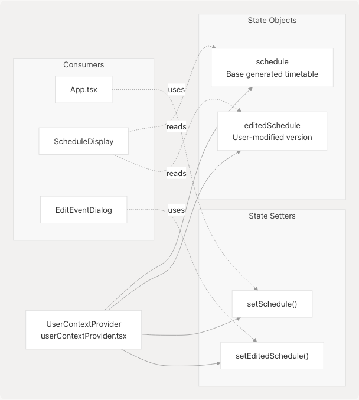
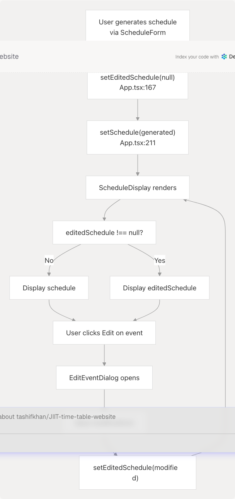
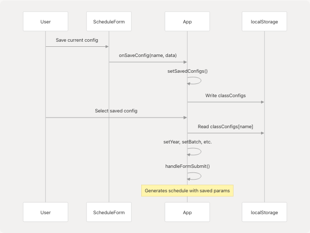
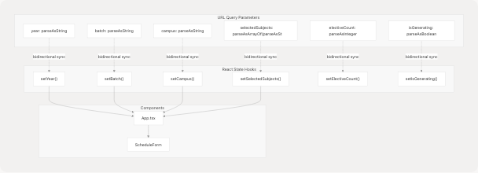
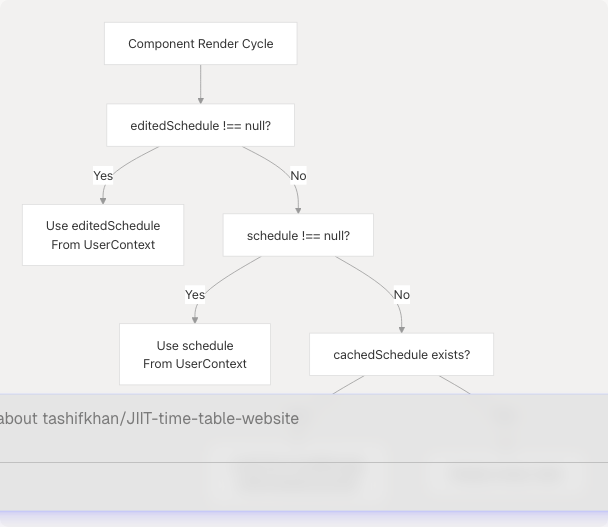
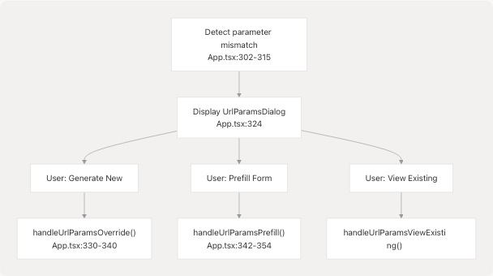

# State Management

This page documents the state management architecture used throughout the JIIT Timetable Creator application. The system employs a three-tier approach: **React Context API** for runtime global state, **localStorage** for cross-session persistence, and **nuqs** for URL state synchronization. This design enables offline functionality, shareable links, and seamless state recovery across browser sessions.

For information about data type definitions, see [Data Model & Types](3.3-pwa-and-offline-capabilities). For details on how Python processing generates schedule data, see [Python Processing Pipeline](4.2-python-processing-pipeline).

---

## State Management Architecture Overview

The application maintains state across three complementary layers, each serving a distinct purpose in the data lifecycle.


**Sources:** [src/App.tsx1-841](https://github.com/tashifkhan/JIIT-time-table-website/blob/0ffdedf5/src/App.tsx#L1-L841) [src/context/userContextProvider.tsx1-52](https://github.com/tashifkhan/JIIT-time-table-website/blob/0ffdedf5/src/context/userContextProvider.tsx#L1-L52) [src/context/userContext.tsx](https://github.com/tashifkhan/JIIT-time-table-website/blob/0ffdedf5/src/context/userContext.tsx)

---

## UserContext: React Context Provider

The `UserContext` provides global state management using React's Context API. It maintains two primary state objects that are consumed by display components throughout the application.

### Context Structure

The context is defined in [src/context/userContext.tsx](https://github.com/tashifkhan/JIIT-time-table-website/blob/0ffdedf5/src/context/userContext.tsx) and implemented by [src/context/userContextProvider.tsx1-52](https://github.com/tashifkhan/JIIT-time-table-website/blob/0ffdedf5/src/context/userContextProvider.tsx#L1-L52):



**Data Types:**

| State Variable | Type | Purpose |
| --- | --- | --- |
| `schedule` | `YourTietable | null` | Base schedule generated from Pyodide |
| `editedSchedule` | `YourTietable | null` | User-customized overlay with added/modified events |
| `setSchedule` | `(schedule: YourTietable | null) => void` | Updates base schedule |
| `setEditedSchedule` | `(schedule: YourTietable | null) => void` | Updates edited schedule |

**Sources:** [src/context/userContextProvider.tsx5-16](https://github.com/tashifkhan/JIIT-time-table-website/blob/0ffdedf5/src/context/userContextProvider.tsx#L5-L16) [src/context/userContext.tsx](https://github.com/tashifkhan/JIIT-time-table-website/blob/0ffdedf5/src/context/userContext.tsx)

### Schedule vs EditedSchedule

The system maintains two separate schedule objects to support non-destructive editing:

* **`schedule`**: The original timetable generated by Python processing. This represents the "source of truth" from the timetable JSON data.
* **`editedSchedule`**: User modifications overlaid on the base schedule. When non-null, this takes precedence in display components.



**Sources:** [src/App.tsx166-167](https://github.com/tashifkhan/JIIT-time-table-website/blob/0ffdedf5/src/App.tsx#L166-L167) [src/App.tsx211-212](https://github.com/tashifkhan/JIIT-time-table-website/blob/0ffdedf5/src/App.tsx#L211-L212) [src/components/schedule-display.tsx17-40](https://github.com/tashifkhan/JIIT-time-table-website/blob/0ffdedf5/src/components/schedule-display.tsx#L17-L40) [src/components/edit-event-dialog.tsx66-127](https://github.com/tashifkhan/JIIT-time-table-website/blob/0ffdedf5/src/components/edit-event-dialog.tsx#L66-L127)

### Context Initialization and Persistence

The provider automatically loads and persists `editedSchedule` to localStorage:

**Initialization** [src/context/userContextProvider.tsx18-26](https://github.com/tashifkhan/JIIT-time-table-website/blob/0ffdedf5/src/context/userContextProvider.tsx#L18-L26):

```
useEffect(() => {
    const cachedEdited = localStorage.getItem("editedSchedule");
    if (cachedEdited) {
        try {
            setEditedSchedule(JSON.parse(cachedEdited));
        } catch {}
    }
}, []);
```

**Persistence** [src/context/userContextProvider.tsx29-35](https://github.com/tashifkhan/JIIT-time-table-website/blob/0ffdedf5/src/context/userContextProvider.tsx#L29-L35):

```
React.useEffect(() => {
    if (editedSchedule) {
        localStorage.setItem("editedSchedule", JSON.stringify(editedSchedule));
    } else {
        localStorage.removeItem("editedSchedule");
    }
}, [editedSchedule]);
```

**Sources:** [src/context/userContextProvider.tsx18-35](https://github.com/tashifkhan/JIIT-time-table-website/blob/0ffdedf5/src/context/userContextProvider.tsx#L18-L35)

---

## localStorage Persistence Layer

The application uses browser localStorage to persist state across sessions. Multiple keys store different aspects of the application state.

### Storage Keys and Data Structures


**Storage Schema:**

| Key | Data Structure | Purpose |
| --- | --- | --- |
| `cachedSchedule` | `YourTietable` (JSON) | Base generated schedule for quick recovery |
| `cachedScheduleParams` | `{year, batch, campus, selectedSubjects}` | Parameters used to generate current schedule |
| `classConfigs` | `{[configName]: {year, batch, campus, selectedSubjects, electiveCount}}` | Named presets for quick loading |
| `editedSchedule` | `YourTietable` (JSON) | User modifications to schedule |

**Sources:** [src/App.tsx64-82](https://github.com/tashifkhan/JIIT-time-table-website/blob/0ffdedf5/src/App.tsx#L64-L82) [src/App.tsx85-95](https://github.com/tashifkhan/JIIT-time-table-website/blob/0ffdedf5/src/App.tsx#L85-L95) [src/App.tsx105-109](https://github.com/tashifkhan/JIIT-time-table-website/blob/0ffdedf5/src/App.tsx#L105-L109) [src/App.tsx214-222](https://github.com/tashifkhan/JIIT-time-table-website/blob/0ffdedf5/src/App.tsx#L214-L222) [src/context/userContextProvider.tsx18-35](https://github.com/tashifkhan/JIIT-time-table-website/blob/0ffdedf5/src/context/userContextProvider.tsx#L18-L35)

### cachedSchedule and cachedScheduleParams

These two keys work together to enable intelligent schedule recovery and conflict detection:

**Write Logic** [src/App.tsx105-109](https://github.com/tashifkhan/JIIT-time-table-website/blob/0ffdedf5/src/App.tsx#L105-L109) and [src/App.tsx214-222](https://github.com/tashifkhan/JIIT-time-table-website/blob/0ffdedf5/src/App.tsx#L214-L222):

```
// After successful generation
React.useEffect(() => {
    if (schedule && Object.keys(schedule).length > 0) {
        localStorage.setItem("cachedSchedule", JSON.stringify(schedule));
    }
}, [schedule]);

// Inside handleFormSubmit
localStorage.setItem(
    "cachedScheduleParams",
    JSON.stringify({
        year,
        batch,
        campus,
        selectedSubjects: electives,
    })
);
```

**Read and Comparison** [src/App.tsx274-328](https://github.com/tashifkhan/JIIT-time-table-website/blob/0ffdedf5/src/App.tsx#L274-L328):

The application compares URL parameters against cached parameters to detect conflicts:

```
const urlParams = new URLSearchParams(window.location.search);
const cachedParams = localStorage.getItem("cachedScheduleParams");

// Compare URL params to cached params
let isSame = false;
try {
    const cachedObj = cachedParams ? JSON.parse(cachedParams) : {};
    isSame =
        cachedObj.year === year &&
        cachedObj.batch === batch &&
        cachedObj.campus === campus &&
        Array.isArray(cachedObj.selectedSubjects) &&
        Array.isArray(selectedSubjects) &&
        cachedObj.selectedSubjects.length === selectedSubjects.length &&
        cachedObj.selectedSubjects.every((s: string) =>
            selectedSubjects.includes(s)
        );
} catch {}

if (!isSame) {
    setShowUrlParamsDialog(true); // Show conflict resolution dialog
}
```

**Sources:** [src/App.tsx105-109](https://github.com/tashifkhan/JIIT-time-table-website/blob/0ffdedf5/src/App.tsx#L105-L109) [src/App.tsx214-222](https://github.com/tashifkhan/JIIT-time-table-website/blob/0ffdedf5/src/App.tsx#L214-L222) [src/App.tsx274-328](https://github.com/tashifkhan/JIIT-time-table-website/blob/0ffdedf5/src/App.tsx#L274-L328)

### classConfigs: Saved Configurations

Users can save multiple configuration presets with custom names. These are stored as a single JSON object in localStorage:

**Data Structure:**

```
{
    [configName: string]: {
        year: string;
        batch: string;
        campus: string;
        selectedSubjects: string[];
        electiveCount?: number;
    }
}
```

**Initialization** [src/App.tsx64-69](https://github.com/tashifkhan/JIIT-time-table-website/blob/0ffdedf5/src/App.tsx#L64-L69):

```
const [savedConfigs, setSavedConfigs] = React.useState<{
    [key: string]: any;
}>(() => {
    const configs = localStorage.getItem("classConfigs");
    return configs ? JSON.parse(configs) : {};
});
```

**Persistence** [src/App.tsx80-82](https://github.com/tashifkhan/JIIT-time-table-website/blob/0ffdedf5/src/App.tsx#L80-L82):

```
React.useEffect(() => {
    localStorage.setItem("classConfigs", JSON.stringify(savedConfigs));
}, [savedConfigs]);
```

**Usage Flow:**



**Sources:** [src/App.tsx64-82](https://github.com/tashifkhan/JIIT-time-table-website/blob/0ffdedf5/src/App.tsx#L64-L82) [src/App.tsx361-386](https://github.com/tashifkhan/JIIT-time-table-website/blob/0ffdedf5/src/App.tsx#L361-L386) [src/App.tsx388-390](https://github.com/tashifkhan/JIIT-time-table-website/blob/0ffdedf5/src/App.tsx#L388-L390)

---

## URL State Synchronization with nuqs

The application uses the `nuqs` library to synchronize form state with URL query parameters. This enables shareable links and browser history integration.

### Managed Query Parameters



**Parameter Definitions** [src/App.tsx231-247](https://github.com/tashifkhan/JIIT-time-table-website/blob/0ffdedf5/src/App.tsx#L231-L247):

| Parameter | Parser | Default | Purpose |
| --- | --- | --- | --- |
| `year` | `parseAsString` | `""` | Academic year (1-4) |
| `batch` | `parseAsString` | `""` | Batch number or range |
| `campus` | `parseAsString` | `""` | Campus code (62, 128, BCA) |
| `selectedSubjects` | `parseAsArrayOf(parseAsString)` | `[]` | Array of subject codes |
| `electiveCount` | `parseAsInteger` | `0` | Number of electives to select |
| `isGenerating` | `parseAsBoolean` | `false` | Loading indicator state |

**Sources:** [src/App.tsx231-247](https://github.com/tashifkhan/JIIT-time-table-website/blob/0ffdedf5/src/App.tsx#L231-L247) [src/App.tsx15-20](https://github.com/tashifkhan/JIIT-time-table-website/blob/0ffdedf5/src/App.tsx#L15-L20)

### URL-Based Auto-Generation

When URL parameters are present and valid, the application automatically generates a schedule:

**Detection and Auto-Generate** [src/App.tsx253-271](https://github.com/tashifkhan/JIIT-time-table-website/blob/0ffdedf5/src/App.tsx#L253-L271):

```
React.useEffect(() => {
    if (
        !autoGeneratedRef.current &&
        _year &&
        _batch &&
        _campus &&
        _selectedSubjects &&
        _selectedSubjects.length > 0
    ) {
        autoGeneratedRef.current = true;
        handleFormSubmit({
            year: _year,
            batch: _batch,
            electives: _selectedSubjects,
            campus: _campus,
        });
    }
}, [_year, _batch, _campus, _selectedSubjects]);
```

**Conflict Resolution:**

If URL parameters differ from cached parameters, the `UrlParamsDialog` presents three options:

1. **Override**: Generate new schedule from URL parameters
2. **Prefill**: Load URL parameters into form without generating
3. **View Existing**: Ignore URL and display cached schedule

**Sources:** [src/App.tsx274-328](https://github.com/tashifkhan/JIIT-time-table-website/blob/0ffdedf5/src/App.tsx#L274-L328) [src/App.tsx330-359](https://github.com/tashifkhan/JIIT-time-table-website/blob/0ffdedf5/src/App.tsx#L330-L359) [src/components/url-params-dialog.tsx1-161](https://github.com/tashifkhan/JIIT-time-table-website/blob/0ffdedf5/src/components/url-params-dialog.tsx#L1-L161)

---

## State Flow and Lifecycle

The following diagram illustrates the complete state lifecycle from user interaction to persistence:


**Sources:** [src/App.tsx154-229](https://github.com/tashifkhan/JIIT-time-table-website/blob/0ffdedf5/src/App.tsx#L154-L229) [src/components/schedule-display.tsx1-151](https://github.com/tashifkhan/JIIT-time-table-website/blob/0ffdedf5/src/components/schedule-display.tsx#L1-L151) [src/components/edit-event-dialog.tsx66-127](https://github.com/tashifkhan/JIIT-time-table-website/blob/0ffdedf5/src/components/edit-event-dialog.tsx#L66-L127)

### State Priority Hierarchy

When multiple state sources exist, the application follows this priority order:



**Implementation** [src/components/schedule-display.tsx40](https://github.com/tashifkhan/JIIT-time-table-website/blob/0ffdedf5/src/components/schedule-display.tsx#L40-L40):

```
const displaySchedule = editedSchedule || schedule;
```

**Sources:** [src/components/schedule-display.tsx17-40](https://github.com/tashifkhan/JIIT-time-table-website/blob/0ffdedf5/src/components/schedule-display.tsx#L17-L40) [src/App.tsx85-95](https://github.com/tashifkhan/JIIT-time-table-website/blob/0ffdedf5/src/App.tsx#L85-L95)

---

## State Modification Operations

### Generating a New Schedule

**Entry Point:** [src/App.tsx154-229](https://github.com/tashifkhan/JIIT-time-table-website/blob/0ffdedf5/src/App.tsx#L154-L229)

**State Changes:**

1. Clear `editedSchedule` → `null` [src/App.tsx167](https://github.com/tashifkhan/JIIT-time-table-website/blob/0ffdedf5/src/App.tsx#L167-L167)
2. Set `isGenerating` → `true` [src/App.tsx181](https://github.com/tashifkhan/JIIT-time-table-website/blob/0ffdedf5/src/App.tsx#L181-L181)
3. Call Python processing via Pyodide
4. Set `schedule` → generated result [src/App.tsx211-212](https://github.com/tashifkhan/JIIT-time-table-website/blob/0ffdedf5/src/App.tsx#L211-L212)
5. Write `cachedSchedule` and `cachedScheduleParams` to localStorage
6. Set `isGenerating` → `false` [src/App.tsx227](https://github.com/tashifkhan/JIIT-time-table-website/blob/0ffdedf5/src/App.tsx#L227-L227)

### Editing an Event

**Entry Point:** [src/components/edit-event-dialog.tsx66-127](https://github.com/tashifkhan/JIIT-time-table-website/blob/0ffdedf5/src/components/edit-event-dialog.tsx#L66-L127)

**State Changes:**

1. If `editedSchedule` is `null`, deep copy `schedule` → `editedSchedule`
2. Modify specific day/time slot in `editedSchedule`
3. Trigger `setEditedSchedule()` which persists to localStorage
4. Display components re-render with priority on `editedSchedule`

### Loading a Saved Configuration

**Entry Point:** [src/App.tsx361-386](https://github.com/tashifkhan/JIIT-time-table-website/blob/0ffdedf5/src/App.tsx#L361-L386)

**State Changes:**

1. Clear `editedSchedule` → `null` [src/App.tsx366](https://github.com/tashifkhan/JIIT-time-table-website/blob/0ffdedf5/src/App.tsx#L366-L366)
2. Load config from `classConfigs` in localStorage
3. Update URL parameters via nuqs setters [src/App.tsx369-374](https://github.com/tashifkhan/JIIT-time-table-website/blob/0ffdedf5/src/App.tsx#L369-L374)
4. Call `handleFormSubmit()` to generate schedule
5. Follow normal generation flow

### Deleting an Event

**Entry Point:** [src/components/edit-event-dialog.tsx130-146](https://github.com/tashifkhan/JIIT-time-table-website/blob/0ffdedf5/src/components/edit-event-dialog.tsx#L130-L146)

**State Changes:**

1. Create copy of `editedSchedule`
2. Delete specific time slot from day
3. If day becomes empty, delete day key
4. Call `setEditedSchedule()` with updated schedule
5. Persist to localStorage automatically

**Sources:** [src/App.tsx154-229](https://github.com/tashifkhan/JIIT-time-table-website/blob/0ffdedf5/src/App.tsx#L154-L229) [src/App.tsx361-386](https://github.com/tashifkhan/JIIT-time-table-website/blob/0ffdedf5/src/App.tsx#L361-L386) [src/components/edit-event-dialog.tsx66-146](https://github.com/tashifkhan/JIIT-time-table-website/blob/0ffdedf5/src/components/edit-event-dialog.tsx#L66-L146)

---

## Data Structure Details

### YourTietable Type

The core data structure for both `schedule` and `editedSchedule`:

```
interface YourTietable {
    [day: string]: {
        [timeSlot: string]: {
            subject_name: string;
            type: "L" | "T" | "P" | "C";
            location: string;
            isCustom?: boolean;  // Added by EditEventDialog
        };
    };
}
```

**Example Data:**

```
{
    "Monday": {
        "09:00-10:00": {
            "subject_name": "Data Structures",
            "type": "L",
            "location": "C-101"
        },
        "10:00-11:00": {
            "subject_name": "Lab Session",
            "type": "P",
            "location": "Lab-3"
        }
    },
    "Tuesday": {
        "11:00-12:00": {
            "subject_name": "Team Meeting",
            "type": "C",
            "location": "Online",
            "isCustom": true
        }
    }
}
```

**Sources:** [src/App.tsx28-36](https://github.com/tashifkhan/JIIT-time-table-website/blob/0ffdedf5/src/App.tsx#L28-L36) [src/components/edit-event-dialog.tsx25-34](https://github.com/tashifkhan/JIIT-time-table-website/blob/0ffdedf5/src/components/edit-event-dialog.tsx#L25-L34)

### Saved Configuration Object

Structure stored in `classConfigs`:

```
{
    "My CS Configuration": {
        year: "2",
        batch: "E1",
        campus: "62",
        selectedSubjects: ["CS501", "CS502", "CS503"],
        electiveCount: 3
    },
    "Fall Semester Setup": {
        year: "3",
        batch: "E2",
        campus: "128",
        selectedSubjects: ["IT601", "IT602"],
        electiveCount: 2
    }
}
```

**Sources:** [src/App.tsx64-69](https://github.com/tashifkhan/JIIT-time-table-website/blob/0ffdedf5/src/App.tsx#L64-L69) [src/App.tsx388-390](https://github.com/tashifkhan/JIIT-time-table-website/blob/0ffdedf5/src/App.tsx#L388-L390)

---

## State Synchronization Patterns

### Bidirectional URL Sync

The nuqs library provides automatic bidirectional synchronization between React state and URL parameters:


**Benefits:**

* Browser back/forward buttons work correctly
* URLs are shareable and bookmarkable
* State survives page refresh via URL

**Sources:** [src/App.tsx231-247](https://github.com/tashifkhan/JIIT-time-table-website/blob/0ffdedf5/src/App.tsx#L231-L247) [src/App.tsx15-20](https://github.com/tashifkhan/JIIT-time-table-website/blob/0ffdedf5/src/App.tsx#L15-L20)

### Optimistic Updates

Edit operations use optimistic updates - the UI updates immediately while persistence happens asynchronously:


**Implementation:** [src/context/userContextProvider.tsx29-35](https://github.com/tashifkhan/JIIT-time-table-website/blob/0ffdedf5/src/context/userContextProvider.tsx#L29-L35)

**Sources:** [src/components/edit-event-dialog.tsx66-127](https://github.com/tashifkhan/JIIT-time-table-website/blob/0ffdedf5/src/components/edit-event-dialog.tsx#L66-L127) [src/context/userContextProvider.tsx29-35](https://github.com/tashifkhan/JIIT-time-table-website/blob/0ffdedf5/src/context/userContextProvider.tsx#L29-L35)

---

## Edge Cases and Error Handling

### Missing or Corrupted localStorage Data

The application gracefully handles localStorage errors:

**Example** [src/App.tsx85-95](https://github.com/tashifkhan/JIIT-time-table-website/blob/0ffdedf5/src/App.tsx#L85-L95):

```
React.useEffect(() => {
    const cached = localStorage.getItem("cachedSchedule");
    if (cached) {
        try {
            const parsed = JSON.parse(cached);
            if (parsed && typeof parsed === "object") {
                setSchedule(parsed);
            }
        } catch {}  // Silent failure - app continues normally
    }
}, []);
```

### Concurrent Modifications

Since the app runs entirely client-side in a single tab, true concurrency issues don't occur. However, if a user opens multiple tabs:

1. Each tab maintains independent React state
2. localStorage updates from one tab don't automatically sync to others
3. The last tab to write wins for localStorage data

**Note:** There is no mechanism to sync state between tabs. Users working across multiple tabs may experience inconsistent state.

**Sources:** [src/App.tsx85-95](https://github.com/tashifkhan/JIIT-time-table-website/blob/0ffdedf5/src/App.tsx#L85-L95) [src/context/userContextProvider.tsx18-35](https://github.com/tashifkhan/JIIT-time-table-website/blob/0ffdedf5/src/context/userContextProvider.tsx#L18-L35)

### URL Parameter Conflicts

When URL parameters conflict with cached data, the `UrlParamsDialog` component provides explicit user choice rather than making assumptions:



**Sources:** [src/App.tsx274-359](https://github.com/tashifkhan/JIIT-time-table-website/blob/0ffdedf5/src/App.tsx#L274-L359) [src/components/url-params-dialog.tsx1-161](https://github.com/tashifkhan/JIIT-time-table-website/blob/0ffdedf5/src/components/url-params-dialog.tsx#L1-L161)

---

## Performance Considerations

### localStorage Throttling

The application writes to localStorage on every state change without throttling. For most operations this is acceptable, but rapid consecutive edits could potentially cause performance issues.

**Current Implementation:** No throttling or debouncing
**Write Frequency:** Every `editedSchedule` change triggers immediate write

**Potential Improvement:** Implement debounced writes for edit operations.

**Sources:** [src/context/userContextProvider.tsx29-35](https://github.com/tashifkhan/JIIT-time-table-website/blob/0ffdedf5/src/context/userContextProvider.tsx#L29-L35)

### JSON Serialization Overhead

Large timetables with many events require JSON serialization on every persistence operation:

**Serialization Points:**

* UserContext → localStorage: [src/context/userContextProvider.tsx31](https://github.com/tashifkhan/JIIT-time-table-website/blob/0ffdedf5/src/context/userContextProvider.tsx#L31-L31)
* App → localStorage: [src/App.tsx107](https://github.com/tashifkhan/JIIT-time-table-website/blob/0ffdedf5/src/App.tsx#L107-L107)
* Schedule display: Multiple JSON.parse operations

**Mitigation:** The application uses `JSON.parse(JSON.stringify())` to create deep copies, which is performant for the expected data size (typically <50 events per schedule).

**Sources:** [src/App.tsx107-109](https://github.com/tashifkhan/JIIT-time-table-website/blob/0ffdedf5/src/App.tsx#L107-L109) [src/context/userContextProvider.tsx31](https://github.com/tashifkhan/JIIT-time-table-website/blob/0ffdedf5/src/context/userContextProvider.tsx#L31-L31)
