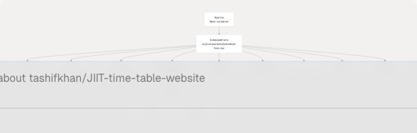
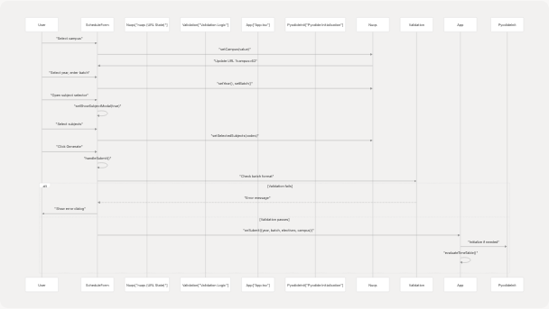
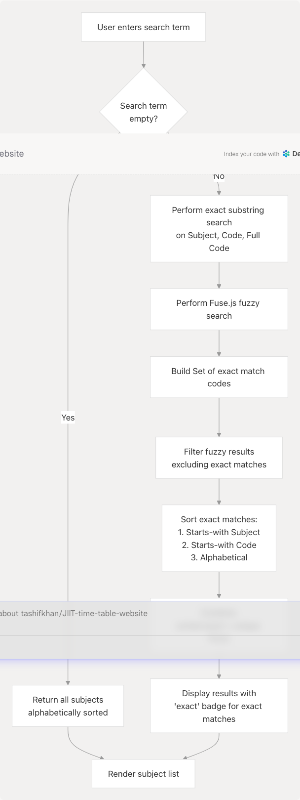
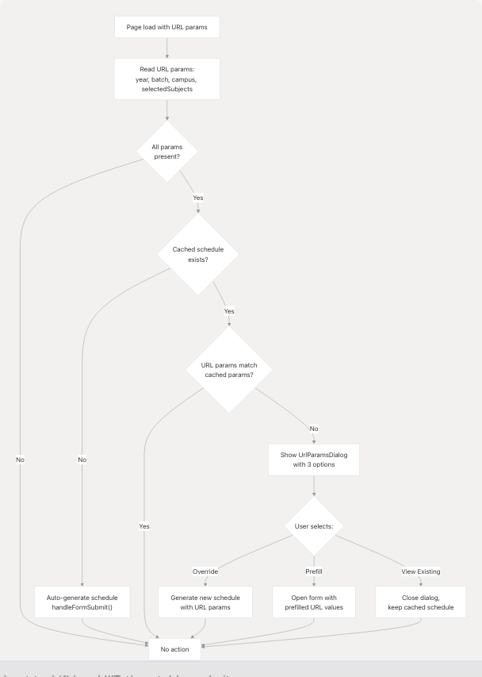

# Schedule Form & User Input

## Purpose and Scope

This page documents the **ScheduleForm** component and the complete user input system that enables users to configure and generate personalized timetables. It covers form structure, campus-specific validation rules, subject selection with fuzzy search, saved configurations, and URL parameter synchronization.

**Related pages:**

* For Python timetable processing after form submission, see [Python Processing Pipeline](4.2-python-processing-pipeline)
* For schedule display and editing functionality, see [Schedule Display & Editing](4.3-schedule-display-and-editing)
* For URL conflict resolution dialog, see [Shareable URLs & Configuration Sharing](9.3-shareable-urls-and-configuration-saving)

---

## Form Component Architecture

The schedule generation form is implemented through two primary components: `ScheduleForm` (the main form) and `SubjectSelector` (the subject picker dialog). The form integrates with URL state management via `nuqs` and persists configurations to `localStorage`.

### Component Hierarchy Diagram



**Sources:** [src/components/schedule-form.tsx1-792](https://github.com/tashifkhan/JIIT-time-table-website/blob/0ffdedf5/src/components/schedule-form.tsx#L1-L792) [src/App.tsx539-551](https://github.com/tashifkhan/JIIT-time-table-website/blob/0ffdedf5/src/App.tsx#L539-L551)

---

## Form Fields and Data Flow

The form manages four primary input fields, each synchronized with URL query parameters via `nuqs`:

| Field | Type | Query Param | Validation | Notes |
| --- | --- | --- | --- | --- |
| **Campus** | Select | `campus` | Required | Options: `"62"`, `"128"`, `"BCA"` |
| **Year** | Select | `year` | Required | Range: 1-4 for 62/128, 1-3 for BCA |
| **Batch** | Text Input | `batch` | Campus-specific regex | Auto-uppercase conversion |
| **Subjects** | Multi-select | `selectedSubjects` | Optional (required for year ≠ 1) | Array of subject codes |

### State Management

The form uses React hooks with `nuqs` for URL synchronization:

```
// URL-synchronized state
const [year, setYear] = useQueryState("year", parseAsString.withDefault(""));
const [batch, setBatch] = useQueryState("batch", parseAsString.withDefault(""));
const [campus, setCampus] = useQueryState("campus", parseAsString.withDefault(""));
const [selectedSubjects, setSelectedSubjects] = useQueryState(
    "selectedSubjects",
    parseAsArrayOf(parseAsString).withDefault([])
);
```

**Sources:** [src/components/schedule-form.tsx251-263](https://github.com/tashifkhan/JIIT-time-table-website/blob/0ffdedf5/src/components/schedule-form.tsx#L251-L263)

### Data Flow Sequence



**Sources:** [src/components/schedule-form.tsx364-398](https://github.com/tashifkhan/JIIT-time-table-website/blob/0ffdedf5/src/components/schedule-form.tsx#L364-L398) [src/App.tsx154-229](https://github.com/tashifkhan/JIIT-time-table-website/blob/0ffdedf5/src/App.tsx#L154-L229)

---

## Campus-Specific Batch Validation

The form implements strict batch validation rules based on the selected campus. Validation occurs in `handleSubmit()` before calling the parent `onSubmit` callback.

### Validation Rules Table

| Campus | Allowed Batches | Regex Pattern | Example Valid | Example Invalid |
| --- | --- | --- | --- | --- |
| **62** | A, B, C, G, H + numbers | `!match(/^[DFH]|BBA|BCA|BSC|MCA|MBA|^[E]/)` | `A6`, `B3`, `G12` | `F4`, `E7`, `BBA1` |
| **128** | E, F, G, H + numbers | `match(/^[EFGH]/)` | `E4`, `F12`, `G8` | `A6`, `B3`, `C5` |
| **BCA** | BCA + numbers | `match(/^BCA\d*$/)` | `BCA1`, `BCA12` | `A1`, `128` |

### Validation Implementation

The validation logic at [src/components/schedule-form.tsx366-386](https://github.com/tashifkhan/JIIT-time-table-website/blob/0ffdedf5/src/components/schedule-form.tsx#L366-L386) checks batch format on form submission:

```
let error = "";
if (campus === "62") {
    if (batch.match(/^[DFH]|BBA|BCA|BSC|MCA|MBA|^[E]/)) {
        error = "62 campus only allows A, B, C, G, and H batches.";
    }
} else if (campus === "128") {
    if (!batch.match(/^[EFGH]/)) {
        error = "128 campus only allows E, F, G, and H batches.";
    }
} else if (campus === "BCA") {
    if (!batch.match(/^BCA\d*$/)) {
        error = "BCA campus only allows batches like BCA1, BCA2, etc.";
    }
}
```

When validation fails, a modal dialog displays the error message at [src/components/schedule-form.tsx755-789](https://github.com/tashifkhan/JIIT-time-table-website/blob/0ffdedf5/src/components/schedule-form.tsx#L755-L789)

**Sources:** [src/components/schedule-form.tsx366-386](https://github.com/tashifkhan/JIIT-time-table-website/blob/0ffdedf5/src/components/schedule-form.tsx#L366-L386) [src/components/schedule-form.tsx755-789](https://github.com/tashifkhan/JIIT-time-table-website/blob/0ffdedf5/src/components/schedule-form.tsx#L755-L789)

---

## Subject Selection System

The `SubjectSelector` component provides a searchable dialog for elective selection, featuring both exact string matching and fuzzy search via Fuse.js.

### SubjectSelector Architecture


**Sources:** [src/components/schedule-form.tsx38-219](https://github.com/tashifkhan/JIIT-time-table-website/blob/0ffdedf5/src/components/schedule-form.tsx#L38-L219)

### Fuzzy Search Configuration

Fuse.js is initialized with weighted search keys at [src/components/schedule-form.tsx47-61](https://github.com/tashifkhan/JIIT-time-table-website/blob/0ffdedf5/src/components/schedule-form.tsx#L47-L61):

```
const fuse = useMemo(() => {
    if (!year || !subjects) return null;
    return new Fuse(subjects, {
        keys: [
            { name: "Subject", weight: 0.7 },    // Primary: subject name
            { name: "Code", weight: 0.3 },       // Secondary: subject code
            { name: "Full Code", weight: 0.2 },  // Tertiary: full code
        ],
        threshold: 0.4,           // Lenient matching
        includeScore: true,
        shouldSort: true,
        findAllMatches: true,
        minMatchCharLength: 2,
    });
}, [year, subjects]);
```

**Configuration parameters:**

* **`threshold: 0.4`**: Allows moderate typos and variations
* **`minMatchCharLength: 2`**: Requires at least 2 characters to trigger fuzzy search
* **Weighted keys**: Subject name prioritized over codes

**Sources:** [src/components/schedule-form.tsx47-61](https://github.com/tashifkhan/JIIT-time-table-website/blob/0ffdedf5/src/components/schedule-form.tsx#L47-L61)

### Search Algorithm

The search algorithm at [src/components/schedule-form.tsx63-105](https://github.com/tashifkhan/JIIT-time-table-website/blob/0ffdedf5/src/components/schedule-form.tsx#L63-L105) implements a two-tier approach:



**Prioritization logic** (from [src/components/schedule-form.tsx89-103](https://github.com/tashifkhan/JIIT-time-table-website/blob/0ffdedf5/src/components/schedule-form.tsx#L89-L103)):

1. Exact matches that **start with** the search term in subject name
2. Exact matches that **start with** the search term in code
3. Exact matches that **contain** the search term (alphabetical)
4. Fuzzy matches (by Fuse.js score)

**Sources:** [src/components/schedule-form.tsx63-105](https://github.com/tashifkhan/JIIT-time-table-website/blob/0ffdedf5/src/components/schedule-form.tsx#L63-L105)

### Subject Interface

Each subject object conforms to the `Subject` interface:

```
export interface Subject {
    Code: string;           // e.g., "CSE101"
    "Full Code"?: string;   // e.g., "CSE101L"
    "Subject "?: string;    // Note: some JSON has trailing space
    Subject?: string;       // Subject name
}
```

**Sources:** [src/components/schedule-form.tsx22-27](https://github.com/tashifkhan/JIIT-time-table-website/blob/0ffdedf5/src/components/schedule-form.tsx#L22-L27)

---

## Saved Configurations

The form supports saving multiple configurations to `localStorage` for quick access. This feature is managed in `App.tsx` with UI in `ScheduleForm`.

### Configuration Storage Structure


### Save Configuration Flow


**Sources:** [src/components/schedule-form.tsx402-427](https://github.com/tashifkhan/JIIT-time-table-website/blob/0ffdedf5/src/components/schedule-form.tsx#L402-L427) [src/App.tsx388-390](https://github.com/tashifkhan/JIIT-time-table-website/blob/0ffdedf5/src/App.tsx#L388-L390)

### Load Configuration Flow

Saved configurations are displayed in a dropdown at the top of the page (App.tsx). When a user selects a saved config:

1. **State update** at [src/App.tsx361-386](https://github.com/tashifkhan/JIIT-time-table-website/blob/0ffdedf5/src/App.tsx#L361-L386):

   * Form state is populated with saved values
   * `editedSchedule` is cleared
   * Form is closed after loading
2. **Auto-generation** at [src/App.tsx379-385](https://github.com/tashifkhan/JIIT-time-table-website/blob/0ffdedf5/src/App.tsx#L379-L385):

   * `handleFormSubmit` is called automatically with saved config data
   * Schedule regenerates without manual form submission
3. **URL synchronization**: Query parameters update via `nuqs` hooks

**Sources:** [src/App.tsx361-386](https://github.com/tashifkhan/JIIT-time-table-website/blob/0ffdedf5/src/App.tsx#L361-L386) [src/components/schedule-form.tsx432-461](https://github.com/tashifkhan/JIIT-time-table-website/blob/0ffdedf5/src/components/schedule-form.tsx#L432-L461)

### Delete Configuration

Configuration deletion is handled in App.tsx at [src/App.tsx394-401](https://github.com/tashifkhan/JIIT-time-table-website/blob/0ffdedf5/src/App.tsx#L394-L401):

```
const handleDeleteConfig = (name: string) => {
    setSavedConfigs((prev) => {
        const newConfigs = { ...prev };
        delete newConfigs[name];
        return newConfigs;
    });
    if (selectedConfig === name) setSelectedConfig("");
};
```

**Sources:** [src/App.tsx394-401](https://github.com/tashifkhan/JIIT-time-table-website/blob/0ffdedf5/src/App.tsx#L394-L401)

---

## URL Parameter Synchronization

The form uses `nuqs` for bidirectional URL state synchronization, enabling shareable links and browser history integration.

### Query Parameter Mapping

The `nuqs` library provides typed query state hooks that automatically sync with the URL:

```
// In ScheduleForm
const [year, setYear] = useQueryState("year", parseAsString.withDefault(""));
const [batch, setBatch] = useQueryState("batch", parseAsString.withDefault(""));
const [campus, setCampus] = useQueryState("campus", parseAsString.withDefault(""));
const [selectedSubjects, setSelectedSubjects] = useQueryState(
    "selectedSubjects",
    parseAsArrayOf(parseAsString).withDefault([])
);
```

**Result**: URL updates automatically when form values change:

```
/?year=2&batch=A6&campus=62&selectedSubjects=CSE101,CSE102
```

**Sources:** [src/components/schedule-form.tsx251-263](https://github.com/tashifkhan/JIIT-time-table-website/blob/0ffdedf5/src/components/schedule-form.tsx#L251-L263)

### URL Parameter Auto-Generation

When a user loads the app with URL parameters present, the system automatically generates a schedule if no cached schedule exists at [src/App.tsx273-327](https://github.com/tashifkhan/JIIT-time-table-website/blob/0ffdedf5/src/App.tsx#L273-L327):



**Sources:** [src/App.tsx273-327](https://github.com/tashifkhan/JIIT-time-table-website/blob/0ffdedf5/src/App.tsx#L273-L327)

### Conflict Resolution

When URL parameters conflict with a cached schedule, the `UrlParamsDialog` component (documented in [9.3](9.3-shareable-urls-and-configuration-saving)) presents three options:

1. **Override**: Replace cached schedule with new generation
2. **Prefill**: Open form with URL values but don't generate
3. **View Existing**: Keep cached schedule, ignore URL

**Sources:** [src/App.tsx330-359](https://github.com/tashifkhan/JIIT-time-table-website/blob/0ffdedf5/src/App.tsx#L330-L359) [src/App.tsx645-657](https://github.com/tashifkhan/JIIT-time-table-website/blob/0ffdedf5/src/App.tsx#L645-L657)

---

## Form Submission Handler

The `handleFormSubmit` function in App.tsx orchestrates the complete schedule generation pipeline after form submission.

### Submission Flow


**Sources:** [src/App.tsx154-229](https://github.com/tashifkhan/JIIT-time-table-website/blob/0ffdedf5/src/App.tsx#L154-L229)

### Function Selection Logic

The `evaluateTimeTable` function at [src/App.tsx115-152](https://github.com/tashifkhan/JIIT-time-table-website/blob/0ffdedf5/src/App.tsx#L115-L152) determines which Python function to call based on campus and year:

| Campus | Year | Python Function |
| --- | --- | --- |
| 62 | 1 | `time_table_creator` |
| 62 | 2-4 | `time_table_creator_v2` |
| 128 | 1 | `bando128_year1` |
| 128 | 2-4 | `banado128` |
| BCA | 1 | `bca_creator_year1` |
| BCA | 2-3 | `bca_creator` |

```
let functionName;
if (year === "1") {
    functionName = 
        campus === "62" ? "time_table_creator"
        : campus === "BCA" ? "bca_creator_year1"
        : "bando128_year1";
} else {
    functionName = 
        campus === "62" ? "time_table_creator_v2"
        : campus === "BCA" ? "bca_creator"
        : "banado128";
}
```

**Sources:** [src/App.tsx123-139](https://github.com/tashifkhan/JIIT-time-table-website/blob/0ffdedf5/src/App.tsx#L123-L139)

---

## Loading and Error States

The form includes comprehensive loading and error UI states managed through local state and animations via Framer Motion.

### Loading State

When generating a schedule, a full-screen modal overlay displays at [src/components/schedule-form.tsx471-502](https://github.com/tashifkhan/JIIT-time-table-website/blob/0ffdedf5/src/components/schedule-form.tsx#L471-L502):

* **Animation**: Rotating sparkle icon
* **Backdrop**: Black overlay with blur effect
* **Message**: "Generating your schedule... This may take a few seconds"
* **Triggered by**: `isGenerating` state set to `true` in `handleSubmit`

**Sources:** [src/components/schedule-form.tsx471-502](https://github.com/tashifkhan/JIIT-time-table-website/blob/0ffdedf5/src/components/schedule-form.tsx#L471-L502)

### Error States

**Batch validation errors** are displayed:

1. **Inline**: Below batch input field at [src/components/schedule-form.tsx583-587](https://github.com/tashifkhan/JIIT-time-table-website/blob/0ffdedf5/src/components/schedule-form.tsx#L583-L587)
2. **Modal**: Full dialog on submit attempt at [src/components/schedule-form.tsx755-789](https://github.com/tashifkhan/JIIT-time-table-website/blob/0ffdedf5/src/components/schedule-form.tsx#L755-L789)

**Save config errors** appear inline in the save modal at [src/components/schedule-form.tsx716-720](https://github.com/tashifkhan/JIIT-time-table-website/blob/0ffdedf5/src/components/schedule-form.tsx#L716-L720):

* "Please enter a name"
* "A config with this name already exists"

**Sources:** [src/components/schedule-form.tsx583-587](https://github.com/tashifkhan/JIIT-time-table-website/blob/0ffdedf5/src/components/schedule-form.tsx#L583-L587) [src/components/schedule-form.tsx716-720](https://github.com/tashifkhan/JIIT-time-table-website/blob/0ffdedf5/src/components/schedule-form.tsx#L716-L720) [src/components/schedule-form.tsx755-789](https://github.com/tashifkhan/JIIT-time-table-website/blob/0ffdedf5/src/components/schedule-form.tsx#L755-L789)

---

## Props Interface and Component Integration

### ScheduleForm Props

```
interface ScheduleFormProps {
    mapping: {
        [key: string]: {
            timetable: { [day: string]: { [time: string]: string[] } };
            subjects: Subject[];
        };
    };
    onSubmit: (data: {
        year: string;
        batch: string;
        electives: string[];
        campus: string;
    }) => void;
    onSaveConfig?: (name: string, configData: any) => void;
    savedConfigs?: { [key: string]: any };
    autoSubmitKey?: string;
}
```

**Prop descriptions:**

* **`mapping`**: Timetable and subject JSON data keyed by year
* **`onSubmit`**: Callback invoked when form is submitted (handled by App.tsx)
* **`onSaveConfig`**: Optional callback for saving configurations
* **`savedConfigs`**: Object of saved configuration names and data
* **`autoSubmitKey`**: Triggers auto-submission when a saved config is selected

**Sources:** [src/components/schedule-form.tsx221-241](https://github.com/tashifkhan/JIIT-time-table-website/blob/0ffdedf5/src/components/schedule-form.tsx#L221-L241)

### SubjectSelector Props

```
interface SubjectSelectorProps {
    subjects: Subject[];
    selectedSubjects: string[];
    setSelectedSubjects: (fn: (prev: string[]) => string[]) => void;
    open: boolean;
    setOpen: (open: boolean) => void;
    year: string;
}
```

**Sources:** [src/components/schedule-form.tsx29-36](https://github.com/tashifkhan/JIIT-time-table-website/blob/0ffdedf5/src/components/schedule-form.tsx#L29-L36)

---

## Summary

The schedule form system provides a comprehensive input interface with:

1. **Campus-aware validation**: Batch format rules enforce institutional structure
2. **Intelligent subject search**: Dual exact/fuzzy matching with weighted prioritization
3. **Persistent configurations**: localStorage-backed saved configs with share capability
4. **URL synchronization**: Shareable links via nuqs query state management
5. **Loading/error feedback**: Animated states for user clarity

The form serves as the entry point to the schedule generation pipeline, passing validated user input to the Pyodide-based Python processing layer documented in [4.2](4.2-python-processing-pipeline).
