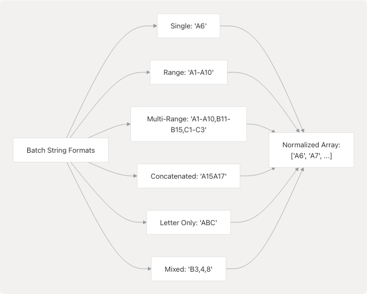
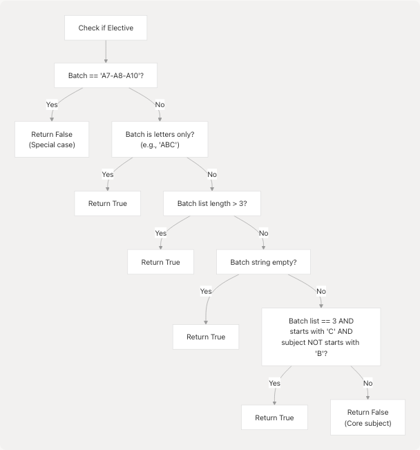
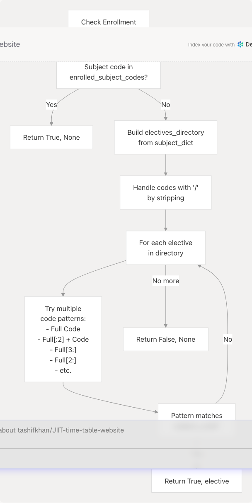
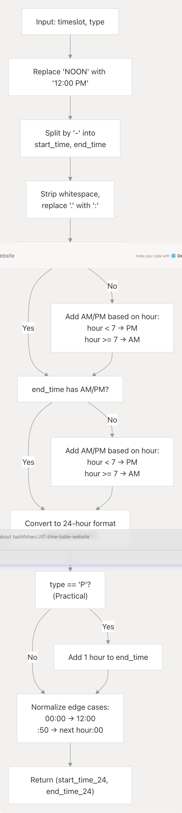
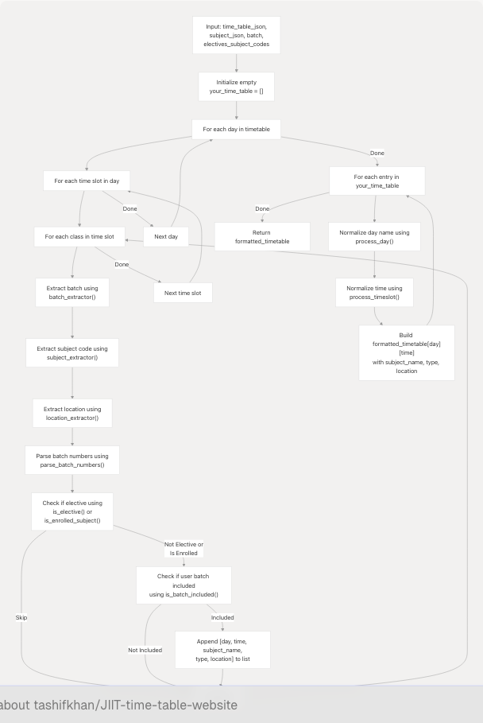
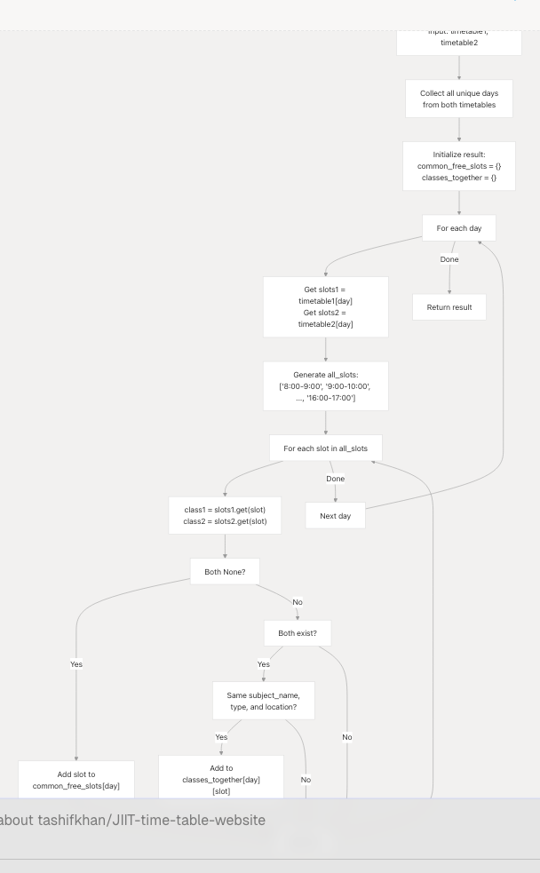

# Python Processing Pipeline

Relevant source files

* [README.md](https://github.com/tashifkhan/JIIT-time-table-website/blob/0ffdedf5/README.md)

This page documents the Python modules that parse timetable JSON data, extract subject and batch information, filter classes based on user enrollment, and generate formatted personalized schedules. This is the core algorithmic logic that transforms raw institutional data into individual student timetables.

For information about how Python is executed client-side via Pyodide, see [Pyodide WASM Integration](/tashifkhan/JIIT-time-table-website/3.2-pyodide-wasm-integration). For the TypeScript layer that invokes these functions, see [Schedule Form & User Input](/tashifkhan/JIIT-time-table-website/4.1-schedule-form-and-user-input).

---

## Overview

The Python processing pipeline consists of multiple creator functions that handle different campus and year combinations. All functions follow the same general workflow: parse batch strings, extract metadata from activity strings, filter by enrollment, normalize time formats, and build the final timetable dictionary.

**Sources:** [public/\_creator.py1-1059](https://github.com/tashifkhan/JIIT-time-table-website/blob/0ffdedf5/public/_creator.py#L1-L1059)

---

## Function Selection Logic

The application dynamically selects which Python function to call based on user parameters:


```

**Sources:** [public/\_creator.py423-531](https://github.com/tashifkhan/JIIT-time-table-website/blob/0ffdedf5/public/_creator.py#L423-L531) [public/\_creator.py739-814](https://github.com/tashifkhan/JIIT-time-table-website/blob/0ffdedf5/public/_creator.py#L739-L814) [public/\_creator.py817-882](https://github.com/tashifkhan/JIIT-time-table-website/blob/0ffdedf5/public/_creator.py#L817-L882) [public/\_creator.py949-1058](https://github.com/tashifkhan/JIIT-time-table-website/blob/0ffdedf5/public/_creator.py#L949-L1058)

---

## Core Processing Functions

### Campus 62 Functions

| Function | Purpose | Year(s) | Elective Handling |
| --- | --- | --- | --- |
| `time_table_creator` | First year schedule generation | 1 | Uses `is_elective()` heuristics |
| `time_table_creator_v2` | Advanced years schedule generation | 2-4 | Uses explicit enrollment list |

**Key Differences:**

* **Year 1:** Uses heuristic `is_elective()` logic to determine if a class is an elective based on batch patterns
* **Years 2-4:** Uses explicit `is_enrolled_subject()` checking against user-provided subject codes

**Sources:** [public/\_creator.py423-531](https://github.com/tashifkhan/JIIT-time-table-website/blob/0ffdedf5/public/_creator.py#L423-L531) [public/\_creator.py949-1058](https://github.com/tashifkhan/JIIT-time-table-website/blob/0ffdedf5/public/_creator.py#L949-L1058)

### Campus 128 Functions

| Function | Purpose | Year(s) | Batch Handling |
| --- | --- | --- | --- |
| `bando128_year1` | First year schedule generation | 1 | Includes all classes for batch |
| `banado128` | Advanced years schedule generation | 2-4 | Filters by enrolled subject codes |

**Sources:** [public/\_creator.py817-882](https://github.com/tashifkhan/JIIT-time-table-website/blob/0ffdedf5/public/_creator.py#L817-L882) [public/\_creator.py739-814](https://github.com/tashifkhan/JIIT-time-table-website/blob/0ffdedf5/public/_creator.py#L739-L814)

---

## Batch Number Parsing

Batch numbers appear in various complex formats in the timetable data and must be normalized to individual batch identifiers.

### Supported Formats

```

```

### `parse_batch_numbers()` Implementation

The function handles multiple parsing strategies:

1. **Empty String:** Returns default batches `["A", "B", "C", "D", "G", "H"]`
2. **Concatenated Format (A15A17):** Uses regex `[A-Za-z]\d+` to find all matches
3. **Letter-Only (ABC):** Splits into individual letters `["A", "B", "C"]`
4. **Comma-Separated Ranges:** Iterates through comma-split parts, handling ranges with hyphens
5. **Single Range:** Expands `A1-A10` to `["A1", "A2", ..., "A10"]`

**Sources:** [public/\_creator.py8-93](https://github.com/tashifkhan/JIIT-time-table-website/blob/0ffdedf5/public/_creator.py#L8-L93) [public/modules/BE62\_creator.py7-77](https://github.com/tashifkhan/JIIT-time-table-website/blob/0ffdedf5/public/modules/BE62_creator.py#L7-L77)

### Campus-Specific Variations

**Campus 62:**

```
```
# Default batches if empty
return ["A", "B", "C", "D", "G", "H"]
```
```

**Campus 128:**

```
```
# Default for ALL keyword
if batch_code == "ALL":
    return ["E", "F", "H", "D"]

# Uses simpler regex matching
matches = re.findall(r"([A-Z])(\d+)", batch_code)
```
```

**Sources:** [public/\_creator.py8-93](https://github.com/tashifkhan/JIIT-time-table-website/blob/0ffdedf5/public/_creator.py#L8-L93) [public/modules/BE128\_creator.py29-41](https://github.com/tashifkhan/JIIT-time-table-website/blob/0ffdedf5/public/modules/BE128_creator.py#L29-L41)

---

## String Extraction Functions

Activity strings in the timetable JSON encode multiple pieces of information that must be parsed:

### Activity String Format

```
Format: [Type]<FileRef file-url="https://github.com/tashifkhan/JIIT-time-table-website/blob/0ffdedf5/Batch" undefined  file-path="Batch">Hii</FileRef>-[Location]/[Faculty]
Example: "LA5,A6(EC214)-G2/RB"
```

| Component | Extractor Function | Example Input | Example Output |
| --- | --- | --- | --- |
| Batch | `batch_extractor()` | "LA5,A6(EC214)-G2/RB" | "A5,A6" |
| Subject Code | `subject_extractor()` | "LA5,A6(EC214)-G2/RB" | "EC214" |
| Location | `location_extractor()` | "LA5,A6(EC214)-G2/RB" | "G2" |

### Extraction Algorithm Flow

```

```

**Sources:** [public/\_creator.py158-218](https://github.com/tashifkhan/JIIT-time-table-website/blob/0ffdedf5/public/_creator.py#L158-L218) [public/\_creator.py536-581](https://github.com/tashifkhan/JIIT-time-table-website/blob/0ffdedf5/public/_creator.py#L536-L581)

### Edge Cases Handled

**Batch Extraction:**

* Handles missing parentheses (returns default batches)
* Checks for L/P/T prefix to avoid false extraction

**Subject Extraction:**

* Handles missing closing parenthesis (looks for dash instead)
* Handles subjects without brackets (extracts until dash)
* Handles L/P/T prefix by skipping first character

**Location Extraction:**

* Splits by dash, takes last component
* Splits by slash, takes first component (removes faculty)

**Sources:** [public/\_creator.py158-218](https://github.com/tashifkhan/JIIT-time-table-website/blob/0ffdedf5/public/_creator.py#L158-L218)

---

## Elective Identification

The system uses different strategies to identify elective courses versus core courses.

### Year 1 Heuristic Approach (`is_elective()`)

Uses pattern-based rules to infer if a subject is an elective:

```

```

**Logic Rationale:**

* **Letter-only batches (ABC):** Indicates multiple batch groups, likely an elective open to many students
* **Many batches (>3):** Suggests optional course with enrollment across sections
* **Empty batch:** Defaults to treating as elective for safety
* **Special C-batch rule:** Biotechnology program specifics

**Sources:** [public/\_creator.py96-128](https://github.com/tashifkhan/JIIT-time-table-website/blob/0ffdedf5/public/_creator.py#L96-L128)

### Years 2-4 Explicit Approach (`is_enrolled_subject()`)

Matches subject code against user-provided enrollment list:

```

```

**Pattern Matching:**
The function tries multiple subject code variations because institutional data uses inconsistent formatting:

* `Full Code` (direct match)
* `Full Code[:2] + Code` (prefix + code)
* `Full Code[3:]` (suffix only)
* `Full Code[2:]` (trim first 2)
* `Full Code[:5] + Code` (longer prefix)
* Multiple other slicing patterns

**Sources:** [public/\_creator.py255-307](https://github.com/tashifkhan/JIIT-time-table-website/blob/0ffdedf5/public/_creator.py#L255-L307)

---

## Time Format Normalization

Timetable JSON files contain time strings in various formats that must be standardized.

### Input Format Variations

| Format | Example | Description |
| --- | --- | --- |
| Range with AM/PM | "9-9.50 AM" | Start and end with period notation |
| Hyphenated | "10-10.50 AM" | Colon or period separator |
| NOON keyword | "12 NOON-1 PM" | Special noon handling |
| Mixed periods/colons | "2.30-3:20 PM" | Inconsistent separators |
| No AM/PM | "9-10" | Assumed based on hour value |

### `process_timeslot()` Algorithm

```

```

**Special Handling:**

* **Practical classes (type='P'):** End time extended by 1 hour to account for longer lab sessions
* **Times ending in :50:** Rounded up to next hour (e.g., 9:50 becomes 10:00)
* **Midnight handling:** "00:00" converted to "12:00" for consistency

**Sources:** [public/\_creator.py364-420](https://github.com/tashifkhan/JIIT-time-table-website/blob/0ffdedf5/public/_creator.py#L364-L420) [public/\_creator.py645-689](https://github.com/tashifkhan/JIIT-time-table-website/blob/0ffdedf5/public/_creator.py#L645-L689)

---

## Day Name Standardization

Day abbreviations from JSON are normalized to full English names.

### `process_day()` Mapping

```
```
day_mapping = {
    "MON": "Monday", "M": "Monday", "MONDAY": "Monday",
    "TUES": "Tuesday", "TUE": "Tuesday", "T": "Tuesday", "TUESDAY": "Tuesday",
    "WED": "Wednesday", "W": "Wednesday", "WEDNESDAY": "Wednesday",
    "THUR": "Thursday", "THURS": "Thursday", "THU": "Thursday", "TH": "Thursday",
    "FRI": "Friday", "F": "Friday", "FRIDAY": "Friday",
    "SAT": "Saturday", "S": "Saturday", "SA": "Saturday", "SATUR": "Saturday",
    "SUN": "Sunday", "SU": "Sunday", "U": "Sunday", "SUNDAY": "Sunday",
}
```
```

**Sources:** [public/\_creator.py310-342](https://github.com/tashifkhan/JIIT-time-table-website/blob/0ffdedf5/public/_creator.py#L310-L342) [public/\_creator.py595-627](https://github.com/tashifkhan/JIIT-time-table-website/blob/0ffdedf5/public/_creator.py#L595-L627)

---

## Subject Name Resolution

Subject codes must be resolved to full subject names using the subjects dictionary.

### `subject_name_extractor()` Matching Logic

The function tries multiple matching strategies because subject codes appear in various formats:

```

```

**Why Multiple Patterns?**
The timetable data uses inconsistent subject code formats across different years and semesters. This comprehensive matching ensures the correct subject name is found regardless of format variation.

**Sources:** [public/\_creator.py220-252](https://github.com/tashifkhan/JIIT-time-table-website/blob/0ffdedf5/public/_creator.py#L220-L252) [public/\_creator.py704-736](https://github.com/tashifkhan/JIIT-time-table-website/blob/0ffdedf5/public/_creator.py#L704-L736)

---

## Main Processing Loop

Each creator function follows the same general structure for building the timetable.

### Processing Flow

```

```

**Sources:** [public/\_creator.py423-530](https://github.com/tashifkhan/JIIT-time-table-website/blob/0ffdedf5/public/_creator.py#L423-L530) [public/\_creator.py739-814](https://github.com/tashifkhan/JIIT-time-table-website/blob/0ffdedf5/public/_creator.py#L739-L814)

---

## Output Data Structure

All creator functions return the same standardized timetable format.

### Formatted Timetable Schema

```
```
type FormattedTimetable = {
  [day: string]: {
    [timeSlot: string]: {
      subject_name: string;
      type: "L" | "P" | "T";  // Lecture, Practical, Tutorial
      location: string;
    }
  }
}
```
```

### Example Output

```
```
{
  "Monday": {
    "10:00-10:50": {
      "subject_name": "Data Structures and Algorithms",
      "type": "L",
      "location": "G7"
    },
    "15:00-16:50": {
      "subject_name": "Data Structures Lab",
      "type": "P",
      "location": "CL04"
    }
  },
  "Tuesday": {
    "09:00-09:50": {
      "subject_name": "Mathematics-2",
      "type": "L",
      "location": "FF1"
    }
  }
}
```
```

**Key Characteristics:**

* **Day keys:** Full English names (Monday, Tuesday, etc.)
* **Time keys:** 24-hour format with hyphen separator (HH:MM-HH:MM)
* **Type codes:** Single letter L/P/T for UI styling
* **Location strings:** Room/building codes as stored in source data

**Sources:** [public/\_creator.py495-530](https://github.com/tashifkhan/JIIT-time-table-website/blob/0ffdedf5/public/_creator.py#L495-L530) [public/\_creator.py780-814](https://github.com/tashifkhan/JIIT-time-table-website/blob/0ffdedf5/public/_creator.py#L780-L814)

---

## Timetable Comparison Function

The `compare_timetables()` function identifies common free slots and shared classes between two schedules.

### Algorithm

```

```

**Use Case:** The Compare Timetables feature uses this to help students find when they can meet with friends who have different schedules.

**Sources:** [public/\_creator.py900-946](https://github.com/tashifkhan/JIIT-time-table-website/blob/0ffdedf5/public/_creator.py#L900-L946)

---

## Error Handling

All processing functions include error handling to gracefully manage parsing failures.

### Error Recovery Strategy

```
```
try:
    # Main processing logic
    code = subject_extractor(indi_class.strip())
    batchs = batch_extractor(indi_class.strip())
    # ... more processing
except Exception as e:
    print(f"Error processing: {str(e)}")
    return {}
```
```

**Behavior:**

* **Parse failures:** Print error message, skip problematic entry
* **Function-level failures:** Return empty dictionary `{}`
* **Time format errors:** Return `("00:00", "00:00")` as fallback

This ensures partial timetable generation succeeds even if some entries are malformed.

**Sources:** [public/\_creator.py418-420](https://github.com/tashifkhan/JIIT-time-table-website/blob/0ffdedf5/public/_creator.py#L418-L420) [public/\_creator.py528-530](https://github.com/tashifkhan/JIIT-time-table-website/blob/0ffdedf5/public/_creator.py#L528-L530) [public/\_creator.py812-814](https://github.com/tashifkhan/JIIT-time-table-website/blob/0ffdedf5/public/_creator.py#L812-L814)

---

## Integration with TypeScript

The Python functions are called from TypeScript via Pyodide's type conversion layer.

### Type Conversion Flow

```


**Type Mapping:**

* JavaScript `object` ↔ Python `dict`
* JavaScript `Array` ↔ Python `list`
* JavaScript `string` ↔ Python `str`

**Sources:** [src/utils/pyodide.ts91-108](https://github.com/tashifkhan/JIIT-time-table-website/blob/0ffdedf5/src/utils/pyodide.ts#L91-L108)

---

## Performance Characteristics

### Time Complexity

For a timetable with:

* D days
* T time slots per day
* C classes per time slot
* S subjects in subject dictionary
* B batch numbers to parse

**Overall:** O(D × T × C × (B + S))

**Bottlenecks:**

* Batch number parsing with complex comma-separated ranges
* Subject name lookup through multiple pattern matching
* String manipulation and regex operations

**Typical Execution Time:** < 500ms for a full semester timetable on modern browsers

**Sources:** Analysis of [public/\_creator.py423-530](https://github.com/tashifkhan/JIIT-time-table-website/blob/0ffdedf5/public/_creator.py#L423-L530)

---

## Data Dependencies

### Required Input Structure

**Timetable JSON:**

```
```
{
  "MON": {
    "9-9.50 AM": ["LA1,A2(MA111)-G2/NSK", "LB1,B2(MA111)-FF1/GA"]
  }
}
```
```

**Subjects JSON:**

```
```
[
  {
    "Code": "MA111",
    "Full Code": "15B11MA111",
    "Subject": "Mathematics-1"
  }
]
```
```

**User Parameters:**

* `batch`: String (e.g., "A6", "F5")
* `electives_subject_codes`: Array of strings (e.g., ["EC215", "CS212"])

**Sources:** [public/data/time-table/ODD25/62.json1-50](https://github.com/tashifkhan/JIIT-time-table-website/blob/0ffdedf5/public/data/time-table/ODD25/62.json#L1-L50) [public/data/time-table/ODD25/128.json1-50](https://github.com/tashifkhan/JIIT-time-table-website/blob/0ffdedf5/public/data/time-table/ODD25/128.json#L1-L50)