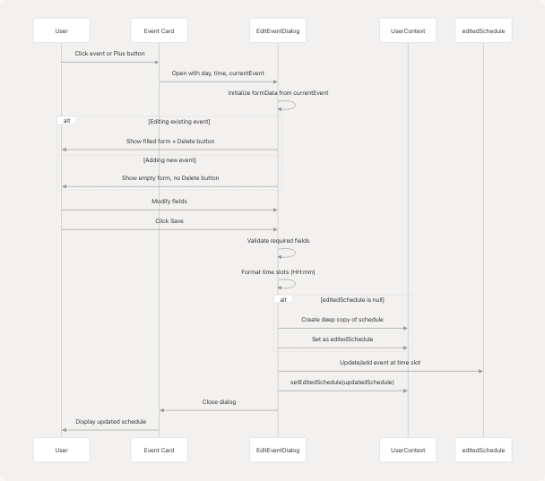
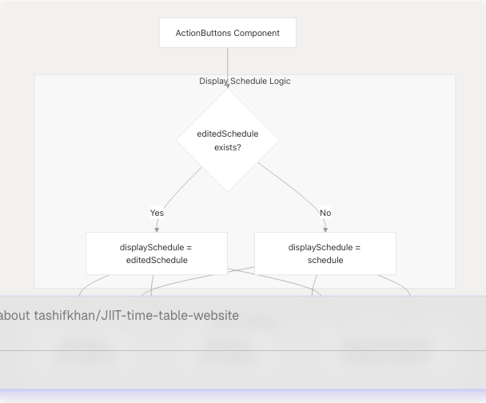
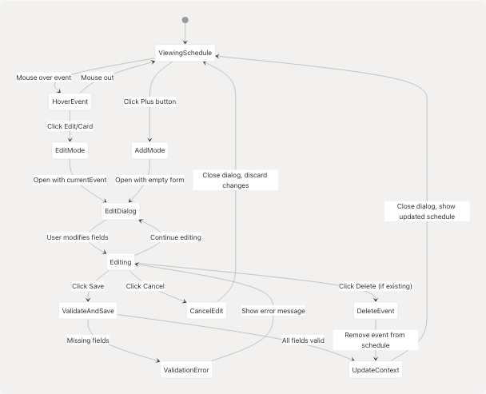
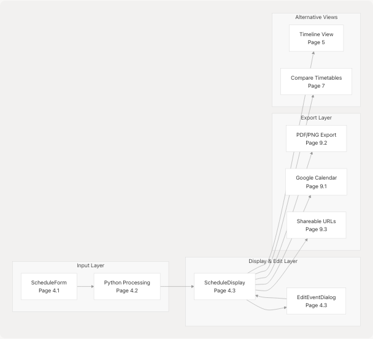

# Schedule Display & Editing

> Source: https://deepwiki.com/tashifkhan/JIIT-time-table-website/4.3-schedule-display-and-editing

# Schedule Display & Editing

Relevant source files

* [README.md](https://github.com/tashifkhan/JIIT-time-table-website/blob/0ffdedf5/README.md)
* [website/app/academic-calendar/calendar-content.tsx](https://github.com/tashifkhan/JIIT-time-table-website/blob/0ffdedf5/website/app/academic-calendar/calendar-content.tsx)
* [website/components/action-buttons.tsx](https://github.com/tashifkhan/JIIT-time-table-website/blob/0ffdedf5/website/components/action-buttons.tsx)
* [website/components/background.tsx](https://github.com/tashifkhan/JIIT-time-table-website/blob/0ffdedf5/website/components/background.tsx)
* [website/components/edit-event-dialog.tsx](https://github.com/tashifkhan/JIIT-time-table-website/blob/0ffdedf5/website/components/edit-event-dialog.tsx)
* [website/components/google-calendar-button.tsx](https://github.com/tashifkhan/JIIT-time-table-website/blob/0ffdedf5/website/components/google-calendar-button.tsx)
* [website/components/schedule-display.tsx](https://github.com/tashifkhan/JIIT-time-table-website/blob/0ffdedf5/website/components/schedule-display.tsx)
* [website/components/schedule-form.tsx](https://github.com/tashifkhan/JIIT-time-table-website/blob/0ffdedf5/website/components/schedule-form.tsx)
* [website/components/timeline-landing.tsx](https://github.com/tashifkhan/JIIT-time-table-website/blob/0ffdedf5/website/components/timeline-landing.tsx)

This document covers the visual presentation of generated timetables and the inline editing capabilities that allow users to modify events, add custom entries, and manage their schedule display. The system uses a card-based layout with color-coded events and provides modal dialogs for editing.

For information about how schedules are generated from user input, see [4.2](/tashifkhan/JIIT-time-table-website/4.2-python-processing-pipeline). For export and sharing capabilities, see [9](/tashifkhan/JIIT-time-table-website/9-export-and-sharing).

---

## Overview

The Schedule Display & Editing system consists of three primary components:

* **`ScheduleDisplay`**: Renders the timetable in a responsive grid layout with color-coded cards
* **`EditEventDialog`**: Modal interface for creating, modifying, and deleting schedule events
* **`ActionButtons`**: Provides export controls and Google Calendar integration

The system maintains two schedule states: the original generated schedule and an optional `editedSchedule` that contains user modifications. All display and export operations prioritize the edited version when available.

---

## Component Architecture

**Sources:** [website/components/schedule-display.tsx1-151](https://github.com/tashifkhan/JIIT-time-table-website/blob/0ffdedf5/website/components/schedule-display.tsx#L1-L151) [website/components/edit-event-dialog.tsx1-238](https://github.com/tashifkhan/JIIT-time-table-website/blob/0ffdedf5/website/components/edit-event-dialog.tsx#L1-L238) [website/components/action-buttons.tsx1-152](https://github.com/tashifkhan/JIIT-time-table-website/blob/0ffdedf5/website/components/action-buttons.tsx#L1-L152)

---

## Display Component Structure

### ScheduleDisplay Component

The `ScheduleDisplay` component is the primary rendering engine for timetables. It receives a `schedule` prop but prioritizes `editedSchedule` from context.

**Key Features:**

* Responsive grid: 1 column (mobile), 2 columns (tablet), 3 columns (desktop)
* Color-coded event cards based on type
* Hover-activated edit buttons
* Click-to-edit functionality
* Plus button for adding new events to each day

**Component Flow:**


```

**Sources:** [website/components/schedule-display.tsx12-49](https://github.com/tashifkhan/JIIT-time-table-website/blob/0ffdedf5/website/components/schedule-display.tsx#L12-L49)

### Grid Layout Implementation

The display uses a responsive grid system that adapts to screen size:

| Screen Size | Columns | Class |
| --- | --- | --- |
| Mobile (< 768px) | 1 | `grid-cols-1` |
| Tablet (768px - 1024px) | 2 | `md:grid-cols-2` |
| Desktop (> 1024px) | 3 | `lg:grid-cols-3` |

Each day renders as a `motion.div` with backdrop blur and glassmorphic styling:

* Background: `bg-[#131010]/50`
* Border: `border-[#F0BB78]/20`
* Blur effect: `backdrop-blur-lg`

**Sources:** [website/components/schedule-display.tsx48-60](https://github.com/tashifkhan/JIIT-time-table-website/blob/0ffdedf5/website/components/schedule-display.tsx#L48-L60)

---

## Color Coding System

Events are color-coded based on their `type` field using predefined color palettes. The system uses Tailwind CSS utility classes with custom color values.

### Type-Color Mapping

```

```

### Type Colors Object

The `typeColors` object maps each class type to its corresponding Tailwind classes:

```
```
const typeColors: Record<ClassType | "C", string> = {
  L: "bg-[#F0BB78]/10 border-[#F0BB78]/20 hover:bg-[#F0BB78]/20",
  T: "bg-[#543A14]/10 border-[#543A14]/20 hover:bg-[#543A14]/20",
  P: "bg-[#FFF0DC]/10 border-[#FFF0DC]/20 hover:bg-[#FFF0DC]/20",
  C: "bg-[#FF9B50]/10 border-[#FF9B50]/20 hover:bg-[#FF9B50]/20",
};
```
```

The `typeLabels` object provides human-readable labels:

| Type Code | Label |
| --- | --- |
| L | Lecture |
| T | Tutorial |
| P | Practical |
| C | Custom |

**Sources:** [website/components/schedule-display.tsx26-38](https://github.com/tashifkhan/JIIT-time-table-website/blob/0ffdedf5/website/components/schedule-display.tsx#L26-L38)

---

## Event Card Layout

Each time slot renders as a clickable card with the following information hierarchy:

```

```

### Card Structure

1. **Edit Button** (absolute positioned, top-right)

   * Opacity 0 by default, transitions to opacity 100 on group hover
   * Uses `Edit2` icon from Lucide React
   * Stops propagation when clicked
2. **Subject Name** (h4 heading)

   * `font-medium mb-2`
3. **Metadata Section** (space-y-2, text-sm, opacity-80)

   * **Time**: `Clock` icon + formatted time range
   * **Location**: `MapPin` icon + location string
   * **Type**: `User` icon + type label

**Sources:** [website/components/schedule-display.tsx86-131](https://github.com/tashifkhan/JIIT-time-table-website/blob/0ffdedf5/website/components/schedule-display.tsx#L86-L131)

### Time Formatting

The `formatTime` function adds spacing around the hyphen for improved readability:

```
```
const formatTime = (time: string) => {
  return time.replace("-", " - "); // "09:00-10:00" → "09:00 - 10:00"
};
```
```

**Sources:** [website/components/schedule-display.tsx42-44](https://github.com/tashifkhan/JIIT-time-table-website/blob/0ffdedf5/website/components/schedule-display.tsx#L42-L44)

---

## Edit Event Dialog

The `EditEventDialog` component provides a modal interface for modifying or creating schedule events. It handles both editing existing events and adding new custom events.

### Dialog Data Flow

```

```

**Sources:** [website/components/edit-event-dialog.tsx36-147](https://github.com/tashifkhan/JIIT-time-table-website/blob/0ffdedf5/website/components/edit-event-dialog.tsx#L36-L147)

### Form Fields

The dialog includes the following editable fields:

| Field | Input Type | Values | Validation |
| --- | --- | --- | --- |
| `startTime` | time | HH:mm format | Required |
| `endTime` | time | HH:mm format | Required |
| `type` | Select | L, T, P, C | Required |
| `subject_name` | Input | Free text | Required |
| `location` | Input | Free text | Required |

**Form State Management:**

```
```
const [formData, setFormData] = useState({
  subject_name: currentEvent?.subject_name || "",
  type: currentEvent?.type || "C",
  location: currentEvent?.location || "",
  startTime: time ? time.split("-")[0] || "" : "",
  endTime: time ? time.split("-")[1] || "" : "",
});
```
```

**Sources:** [website/components/edit-event-dialog.tsx45-51](https://github.com/tashifkhan/JIIT-time-table-website/blob/0ffdedf5/website/components/edit-event-dialog.tsx#L45-L51)

### Save Logic

The save operation performs the following steps:

1. **Validate Required Fields**: All fields must be non-empty
2. **Format Time Slots**: Ensures HH:mm format with zero-padding
3. **Initialize editedSchedule**: Creates deep copy if null
4. **Remove Old Slot**: If time changed, delete old time slot
5. **Add New Slot**: Insert event at new time with `isCustom: true` flag
6. **Update Context**: Call `setEditedSchedule(updatedSchedule)`

**Time Slot Formatting:**

```
```
const formatTime = (time: string) => {
  const [hours, minutes] = time.split(":");
  return `${hours.padStart(2, "0")}:${minutes || "00"}`;
};

const newTimeSlot = `${formatTime(formData.startTime)}-${formatTime(formData.endTime)}`;
```
```

**Sources:** [website/components/edit-event-dialog.tsx66-128](https://github.com/tashifkhan/JIIT-time-table-website/blob/0ffdedf5/website/components/edit-event-dialog.tsx#L66-L128)

### Delete Functionality

The delete button appears only when editing an existing event (when `currentEvent` is defined). It removes the event from `editedSchedule`:

1. Create shallow copy of `editedSchedule`
2. Create shallow copy of the day's schedule
3. Delete the time slot from the day
4. If day is now empty, remove the day entirely
5. Update context with modified schedule

**Sources:** [website/components/edit-event-dialog.tsx130-146](https://github.com/tashifkhan/JIIT-time-table-website/blob/0ffdedf5/website/components/edit-event-dialog.tsx#L130-L146)

---

## State Management

The editing system relies on React Context to maintain schedule state across components.

### Context Structure

### State Lifecycle

1. **Initial State**: `editedSchedule = null`, display shows original `schedule`
2. **First Edit**: `EditEventDialog` creates deep copy: `JSON.parse(JSON.stringify(schedule))`
3. **Subsequent Edits**: Modify the existing `editedSchedule` object
4. **Reset**: When user generates new schedule, `ScheduleForm` calls `setEditedSchedule(null)`

**Sources:** [website/components/edit-event-dialog.tsx44-76](https://github.com/tashifkhan/JIIT-time-table-website/blob/0ffdedf5/website/components/edit-event-dialog.tsx#L44-L76) [website/components/schedule-form.tsx391](https://github.com/tashifkhan/JIIT-time-table-website/blob/0ffdedf5/website/components/schedule-form.tsx#L391-L391)

---

## Adding Custom Events

Users can add custom events by clicking the Plus button on any day card. This opens the `EditEventDialog` with an empty form.

### Add Event Flow

```

```

### Custom Event Flag

Custom events are marked with `isCustom: true` when added to the schedule. This flag is used by export functions to determine recurrence behavior (custom events are not recurring in Google Calendar).

**Sources:** [website/components/schedule-display.tsx66-75](https://github.com/tashifkhan/JIIT-time-table-website/blob/0ffdedf5/website/components/schedule-display.tsx#L66-L75) [website/components/edit-event-dialog.tsx116-124](https://github.com/tashifkhan/JIIT-time-table-website/blob/0ffdedf5/website/components/edit-event-dialog.tsx#L116-L124)

---

## Action Buttons Integration

The `ActionButtons` component displays export controls below the schedule. It always uses the edited schedule when available for export operations.

### Component Structure

```

```

### Export Operations

All export functions receive `displaySchedule` which prioritizes edited content:

1. **PNG/PDF Export**: Navigates to `/timeline?download=1` and renders the edited schedule
2. **Google Calendar Sync**: Sends edited schedule to `createGoogleCalendarEvents()`
3. **Share URL**: Copies current URL with encoded parameters

**Important Note**: The component displays a warning that custom events will not be recurring in Google Calendar, as these lack the institutional schedule metadata required for recurrence rules.

**Sources:** [website/components/action-buttons.tsx14-151](https://github.com/tashifkhan/JIIT-time-table-website/blob/0ffdedf5/website/components/action-buttons.tsx#L14-L151)

---

## Edit Interaction Patterns

The system provides multiple entry points for editing:

### Interaction Entry Points

| Trigger | Location | Action | Dialog State |
| --- | --- | --- | --- |
| Click event card | Any time slot | Opens edit dialog | Filled with event data |
| Click Edit icon | Hover on event card | Opens edit dialog | Filled with event data |
| Click Plus button | Day card header | Opens edit dialog | Empty, default type = "C" |

### Editing UX Flow

```

```

**Sources:** [website/components/schedule-display.tsx66-146](https://github.com/tashifkhan/JIIT-time-table-website/blob/0ffdedf5/website/components/schedule-display.tsx#L66-L146) [website/components/edit-event-dialog.tsx66-146](https://github.com/tashifkhan/JIIT-time-table-website/blob/0ffdedf5/website/components/edit-event-dialog.tsx#L66-L146)

---

## Visual Styling Details

The display uses a consistent glassmorphic design system with backdrop blur effects and transparent backgrounds.

### Color Palette

| Element | Background | Border | Text |
| --- | --- | --- | --- |
| Day card | `#131010/50` | `#F0BB78/20` | `slate-100` |
| Event card (L) | `#F0BB78/10` | `#F0BB78/20` | Inherited |
| Event card (T) | `#543A14/10` | `#543A14/20` | Inherited |
| Event card (P) | `#FFF0DC/10` | `#FFF0DC/20` | Inherited |
| Event card (C) | `#FF9B50/10` | `#FF9B50/20` | Inherited |
| Action button panel | `#FFF0DC/10` | `#F0BB78/20` | `#F0BB78` |

### Motion Effects

All cards use Framer Motion for entrance animations:

* **Initial**: `opacity: 0, y: 20`
* **Animate**: `opacity: 1, y: 0`
* **Transition**: Index-based stagger effect

**Sources:** [website/components/schedule-display.tsx55-60](https://github.com/tashifkhan/JIIT-time-table-website/blob/0ffdedf5/website/components/schedule-display.tsx#L55-L60) [website/components/background.tsx1-26](https://github.com/tashifkhan/JIIT-time-table-website/blob/0ffdedf5/website/components/background.tsx#L1-L26)

---

## Integration with Other Systems

The Schedule Display & Editing system integrates with several other application components:

### Related Systems

```


**Sources:** [website/components/schedule-display.tsx1-151](https://github.com/tashifkhan/JIIT-time-table-website/blob/0ffdedf5/website/components/schedule-display.tsx#L1-L151) [website/components/action-buttons.tsx1-152](https://github.com/tashifkhan/JIIT-time-table-website/blob/0ffdedf5/website/components/action-buttons.tsx#L1-L152)

---

## Code Entity Reference

### Key Components

| Component | File | Primary Responsibility |
| --- | --- | --- |
| `ScheduleDisplay` | `components/schedule-display.tsx` | Render timetable grid with color-coded events |
| `EditEventDialog` | `components/edit-event-dialog.tsx` | Modal for editing/adding/deleting events |
| `ActionButtons` | `components/action-buttons.tsx` | Export controls and sharing options |
| `GoogleCalendarButton` | `components/google-calendar-button.tsx` | Google Calendar OAuth and sync |

### Key Types

| Type | Definition | Usage |
| --- | --- | --- |
| `YourTietable` | `{ [day: string]: { [time: string]: {...} } }` | Schedule data structure |
| `ClassType` | `"L" | "T" | "P"` | Event type enumeration |
| `EditEventDialogProps` | Interface for dialog props | Dialog configuration |

### Context API

| Context Property | Type | Purpose |
| --- | --- | --- |
| `schedule` | `YourTietable | null` | Original generated schedule |
| `editedSchedule` | `YourTietable | null` | User-modified schedule |
| `setEditedSchedule` | `Function` | Update edited schedule state |

**Sources:** [website/components/schedule-display.tsx12-14](https://github.com/tashifkhan/JIIT-time-table-website/blob/0ffdedf5/website/components/schedule-display.tsx#L12-L14) [website/components/edit-event-dialog.tsx15-34](https://github.com/tashifkhan/JIIT-time-table-website/blob/0ffdedf5/website/components/edit-event-dialog.tsx#L15-L34) [website/types/schedule.ts](https://github.com/tashifkhan/JIIT-time-table-website/blob/0ffdedf5/website/types/schedule.ts)