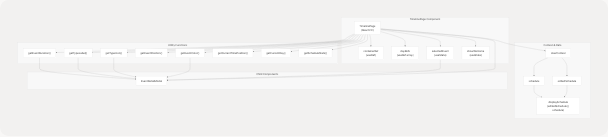
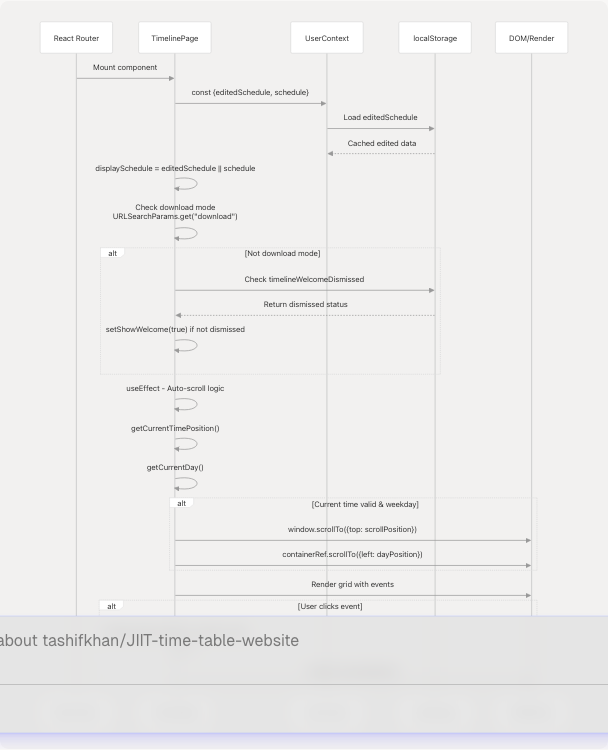
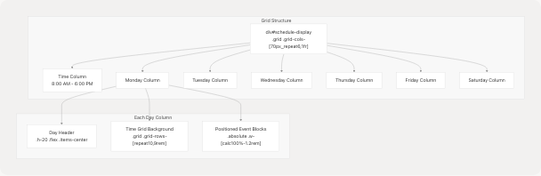
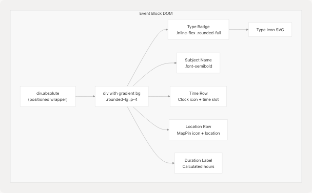
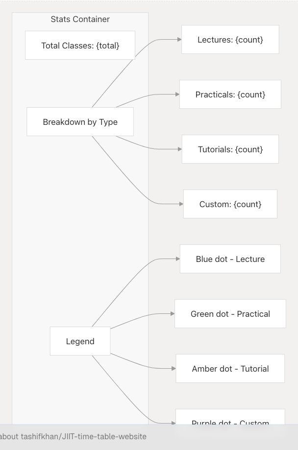
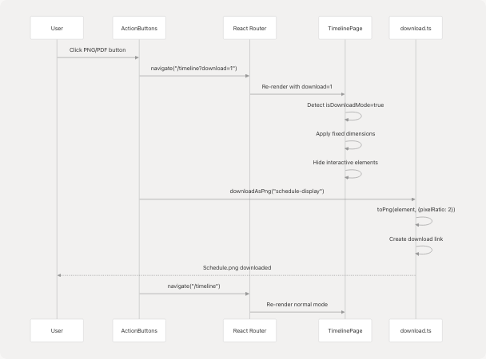

# Timeline View

## Purpose and Scope

The Timeline View provides a calendar-style weekly schedule visualization that displays classes in a time-grid format. This page documents the `TimelinePage` component, its rendering logic, time-based auto-scrolling, event interaction modal, and download mode support.

For information about the grid-based schedule display with day cards, see [Schedule Display & Editing](/tashifkhan/JIIT-time-table-website/4.3-schedule-display-and-editing). For exporting schedules as images and PDFs, see [PDF & PNG Export](/tashifkhan/JIIT-time-table-website/9.2-pdf-and-png-export).

**Sources:** [src/components/timeline.tsx1-774](https://github.com/tashifkhan/JIIT-time-table-website/blob/0ffdedf5/src/components/timeline.tsx#L1-L774)

---

## Overview

The Timeline View renders a weekly schedule as a vertical timeline grid with columns for each weekday (Monday-Saturday) and rows representing hourly time slots from 8:00 AM to 6:00 PM. Classes appear as positioned blocks within the grid, with visual styling that reflects their type (Lecture, Practical, Tutorial, Custom).

### Key Features

| Feature | Description | Lines |
| --- | --- | --- |
| **Time Grid Layout** | 6 day columns with 11-hour rows (8 AM - 6 PM) | [src/components/timeline.tsx444-616](https://github.com/tashifkhan/JIIT-time-table-website/blob/0ffdedf5/src/components/timeline.tsx#L444-L616) |
| **Current Time Indicator** | Animated red line showing current time position | [src/components/timeline.tsx500-520](https://github.com/tashifkhan/JIIT-time-table-website/blob/0ffdedf5/src/components/timeline.tsx#L500-L520) |
| **Auto-Scroll** | Automatically scrolls to current day and time on mount | [src/components/timeline.tsx40-90](https://github.com/tashifkhan/JIIT-time-table-website/blob/0ffdedf5/src/components/timeline.tsx#L40-L90) |
| **Event Modal** | Click-to-view detailed event information | [src/components/timeline.tsx637-771](https://github.com/tashifkhan/JIIT-time-table-website/blob/0ffdedf5/src/components/timeline.tsx#L637-L771) |
| **Download Mode** | Special rendering for PNG/PDF export | [src/components/timeline.tsx21-25](https://github.com/tashifkhan/JIIT-time-table-website/blob/0ffdedf5/src/components/timeline.tsx#L21-L25) [src/components/timeline.tsx297-299](https://github.com/tashifkhan/JIIT-time-table-website/blob/0ffdedf5/src/components/timeline.tsx#L297-L299) |
| **Statistics Dashboard** | Display total classes and breakdown by type | [src/components/timeline.tsx266-285](https://github.com/tashifkhan/JIIT-time-table-website/blob/0ffdedf5/src/components/timeline.tsx#L266-L285) |

**Sources:** [src/components/timeline.tsx13-635](https://github.com/tashifkhan/JIIT-time-table-website/blob/0ffdedf5/src/components/timeline.tsx#L13-L635)

---

## Component Architecture

The Timeline View consists of two main components: the primary `TimelinePage` component and the `EventDetailModal` child component.


```

**Sources:** [src/components/timeline.tsx13-635](https://github.com/tashifkhan/JIIT-time-table-website/blob/0ffdedf5/src/components/timeline.tsx#L13-L635)

---

## Data Flow and State Management

The Timeline View consumes schedule data from `UserContext` and renders it in a time-grid format.



**Sources:** [src/components/timeline.tsx13-25](https://github.com/tashifkhan/JIIT-time-table-website/blob/0ffdedf5/src/components/timeline.tsx#L13-L25) [src/components/timeline.tsx40-90](https://github.com/tashifkhan/JIIT-time-table-website/blob/0ffdedf5/src/components/timeline.tsx#L40-L90) [src/context/userContextProvider.tsx1-52](https://github.com/tashifkhan/JIIT-time-table-website/blob/0ffdedf5/src/context/userContextProvider.tsx#L1-L52)

---

## Layout Structure

The Timeline View uses a CSS Grid layout with a fixed time column and six dynamic day columns.

### Grid Configuration

**Desktop Layout:**

* Grid template: `[110px_repeat(6,1fr)]`
* Time slot height: `12rem` (192px)
* Min-width: `1500px`

**Mobile Layout:**

* Grid template: `[70px_repeat(6,1fr)]`
* Time slot height: `9rem` (144px)
* Horizontal scrolling enabled

**Download Mode:**

* Grid template: `[150px_repeat(6,1fr)]`
* Fixed width: `2550px`
* Optimized for PDF export



**Sources:** [src/components/timeline.tsx444-616](https://github.com/tashifkhan/JIIT-time-table-website/blob/0ffdedf5/src/components/timeline.tsx#L444-L616)

### Event Positioning

Events are positioned absolutely within their day column using calculated `top` and `height` styles based on their time slots.

| Function | Purpose | Formula |
| --- | --- | --- |
| `getEventPosition()` | Calculate top position | `(startHour - 8) * slotHeight` |
| `getEventDuration()` | Calculate height | `(endHour - startHour) * slotHeight` |

**Example:**

* Event: `09:00-11:00`
* Position: `(9 - 8) * 12rem = 12rem` from top
* Height: `(11 - 9) * 12rem = 24rem`

**Sources:** [src/components/timeline.tsx224-235](https://github.com/tashifkhan/JIIT-time-table-website/blob/0ffdedf5/src/components/timeline.tsx#L224-L235) [src/components/timeline.tsx529-543](https://github.com/tashifkhan/JIIT-time-table-website/blob/0ffdedf5/src/components/timeline.tsx#L529-L543)

---

## Time-Based Features

### Current Time Indicator

The Timeline View displays a live red line indicating the current time, visible only on the current weekday during regular hours (8 AM - 6 PM).


The indicator position is calculated dynamically:

```
top position = ((currentHour - 8) + currentMinute / 60 - floorHour) * 100%
```

This results in the red line appearing at the precise fractional hour position within the current time slot row.

**Sources:** [src/components/timeline.tsx237-260](https://github.com/tashifkhan/JIIT-time-table-website/blob/0ffdedf5/src/components/timeline.tsx#L237-L260) [src/components/timeline.tsx500-520](https://github.com/tashifkhan/JIIT-time-table-website/blob/0ffdedf5/src/components/timeline.tsx#L500-L520)

### Auto-Scroll on Mount

When a visitor (non-download mode) first loads the Timeline View, the page automatically scrolls to center the current time and day.


**Two-stage scroll timing:**

1. **Vertical scroll** (100ms delay): Brings current time to vertical center
2. **Horizontal scroll** (200ms delay): Centers current day horizontally

**Sources:** [src/components/timeline.tsx40-90](https://github.com/tashifkhan/JIIT-time-table-website/blob/0ffdedf5/src/components/timeline.tsx#L40-L90)

---

## Event Styling and Type Colors

Each event block is styled with gradients, borders, and accent colors based on its type.

### Color Mapping

The `getEventColor()` function returns styling objects for each event type:

| Type | Label | Background Gradient | Border | Accent Color |
| --- | --- | --- | --- | --- |
| `L` | Lecture | Blue gradient (opacity 0.15-0.25) | Blue border (opacity 0.3) | `#3B82F6` |
| `P` | Practical | Green gradient (opacity 0.15-0.25) | Green border (opacity 0.3) | `#10B981` |
| `T` | Tutorial | Amber gradient (opacity 0.15-0.25) | Amber border (opacity 0.3) | `#F59E0B` |
| `C` | Custom | Purple gradient (opacity 0.15-0.25) | Purple border (opacity 0.3) | `#8B5CF6` |

### Event Block Structure



**Event styling formula:**

```
background: linear-gradient(135deg, rgba(..., 0.15), rgba(..., 0.25))
backdropFilter: blur(10px)
border: 1px solid rgba(..., 0.3)
borderRadius: 18px
boxShadow: 0 6px 18px rgba(0, 0, 0, 0.1), inset 0 1px 0 rgba(255, 255, 255, 0.1)
```

**Sources:** [src/components/timeline.tsx101-138](https://github.com/tashifkhan/JIIT-time-table-website/blob/0ffdedf5/src/components/timeline.tsx#L101-L138) [src/components/timeline.tsx204-222](https://github.com/tashifkhan/JIIT-time-table-website/blob/0ffdedf5/src/components/timeline.tsx#L204-L222) [src/components/timeline.tsx529-611](https://github.com/tashifkhan/JIIT-time-table-website/blob/0ffdedf5/src/components/timeline.tsx#L529-L611)

---

## Event Detail Modal

Clicking any event opens the `EventDetailModal`, a dismissible overlay showing complete event information.

### Modal Structure


### Dismiss Mechanisms

The modal can be closed three ways:

1. **Click overlay** (outside card): [src/components/timeline.tsx669](https://github.com/tashifkhan/JIIT-time-table-website/blob/0ffdedf5/src/components/timeline.tsx#L669-L669)
2. **Click X button**: [src/components/timeline.tsx682-700](https://github.com/tashifkhan/JIIT-time-table-website/blob/0ffdedf5/src/components/timeline.tsx#L682-L700)
3. **Press ESC key**: [src/components/timeline.tsx658-664](https://github.com/tashifkhan/JIIT-time-table-website/blob/0ffdedf5/src/components/timeline.tsx#L658-L664)

The ESC key listener is registered via `useEffect`:

```
useEffect(() => {
  function handleKey(e: KeyboardEvent) {
    if (e.key === "Escape") onClose();
  }
  document.addEventListener("keydown", handleKey);
  return () => document.removeEventListener("keydown", handleKey);
}, [onClose]);
```

**Sources:** [src/components/timeline.tsx637-771](https://github.com/tashifkhan/JIIT-time-table-website/blob/0ffdedf5/src/components/timeline.tsx#L637-L771)

---

## Statistics Dashboard

The Timeline View displays aggregate statistics above the schedule grid, showing total classes and breakdown by type.

### Statistics Calculation

The `getScheduleStats()` function iterates through the schedule to compute:

```
{
  total: number,              // Total number of classes
  byType: {[key: string]: number},  // Count per type (L, P, T, C)
  todayCount: number          // Classes scheduled for current day
}
```

**Algorithm:**

1. Iterate through each day in `displaySchedule`
2. Iterate through each time slot in the day
3. Increment `total` counter
4. Increment `byType[event.type]` counter
5. If day matches current day, increment `todayCount`

### Display Layout



**Sources:** [src/components/timeline.tsx266-285](https://github.com/tashifkhan/JIIT-time-table-website/blob/0ffdedf5/src/components/timeline.tsx#L266-L285) [src/components/timeline.tsx360-402](https://github.com/tashifkhan/JIIT-time-table-website/blob/0ffdedf5/src/components/timeline.tsx#L360-L402)

---

## Download Mode

The Timeline View supports a special "download mode" optimized for PDF/PNG export, activated via URL query parameter `?download=1`.

### Download Mode Detection

```
const isDownloadMode = React.useMemo(() => {
  const params = new URLSearchParams(location.search);
  return params.get("download") === "1";
}, [location.search]);
```

### Rendering Differences

| Feature | Normal Mode | Download Mode |
| --- | --- | --- |
| **Minimum width** | `1500px` | `2550px` |
| **Container width** | Responsive | Fixed `2700px` |
| **Grid template** | `[70px_repeat(6,1fr)]` md:`[110px_repeat(6,1fr)]` | `[150px_repeat(6,1fr)]` |
| **Page title** | Outside grid, centered | Inside grid, with stats |
| **Welcome banner** | Displayed | Hidden |
| **Stats dashboard** | Outside grid | Hidden |
| **Current time indicator** | Visible on current day | Hidden |
| **Auto-scroll** | Enabled | Disabled |

### Integration with Download Utilities

The Timeline View is exported as an image or PDF via the `download.ts` utility functions:



**Sources:** [src/components/timeline.tsx21-25](https://github.com/tashifkhan/JIIT-time-table-website/blob/0ffdedf5/src/components/timeline.tsx#L21-L25) [src/components/timeline.tsx297-299](https://github.com/tashifkhan/JIIT-time-table-website/blob/0ffdedf5/src/components/timeline.tsx#L297-L299) [src/components/timeline.tsx408-439](https://github.com/tashifkhan/JIIT-time-table-website/blob/0ffdedf5/src/components/timeline.tsx#L408-L439) [src/utils/download.ts1-103](https://github.com/tashifkhan/JIIT-time-table-website/blob/0ffdedf5/src/utils/download.ts#L1-L103)

---

## Welcome Banner

First-time visitors see a dismissible welcome banner explaining Timeline View features.

### Persistence Logic


**Banner features list:**

1. View classes color-coded by type
2. Hover for details, today is highlighted
3. Click events to view full details
4. Download as PNG/PDF or sync to Google Calendar
5. Navigate to create/edit schedules

**Sources:** [src/components/timeline.tsx27-38](https://github.com/tashifkhan/JIIT-time-table-website/blob/0ffdedf5/src/components/timeline.tsx#L27-L38) [src/components/timeline.tsx325-357](https://github.com/tashifkhan/JIIT-time-table-website/blob/0ffdedf5/src/components/timeline.tsx#L325-L357)

---

## Type Icon Mapping

The Timeline View uses SVG icons to visually represent different class types throughout the interface.

### Icon Definitions

| Type | Icon | SVG Path Description |
| --- | --- | --- |
| `L` (Lecture) | Book | Open book with pages |
| `P` (Practical) | Flask | Laboratory flask with liquid |
| `T` (Tutorial) | Pencil | Pencil for writing/editing |
| `C` (Custom) | Star | Filled star shape |

The `getTypeIcon()` function returns JSX.Element SVG components:

```
const getTypeIcon = (type: string) => {
  const iconProps = "w-4 h-4 inline-block";
  switch (type) {
    case "L": return <svg className={iconProps} fill="currentColor" viewBox="0 0 20 20">...</svg>;
    case "P": return <svg className={iconProps} fill="currentColor" viewBox="0 0 20 20">...</svg>;
    case "T": return <svg className={iconProps} fill="currentColor" viewBox="0 0 20 20">...</svg>;
    case "C": return <svg className={iconProps} fill="currentColor" viewBox="0 0 20 20">...</svg>;
    default: return <svg className={iconProps} fill="currentColor" viewBox="0 0 20 20">...</svg>;
  }
};
```

**Icon usage locations:**

* Event type badges within event blocks
* Statistics dashboard type breakdown
* Event detail modal type badge
* Legend in stats container

**Sources:** [src/components/timeline.tsx155-202](https://github.com/tashifkhan/JIIT-time-table-website/blob/0ffdedf5/src/components/timeline.tsx#L155-L202)

---

## Responsive Design

The Timeline View adapts to different screen sizes with distinct layouts for mobile and desktop.

### Breakpoint Strategy

| Breakpoint | Width | Grid Template | Time Slot Height | Scroll Behavior |
| --- | --- | --- | --- | --- |
| **Mobile** | < 768px | `[70px_repeat(6,1fr)]` | `9rem` (144px) | Horizontal + vertical |
| **Desktop** | ≥ 768px | `[110px_repeat(6,1fr)]` | `12rem` (192px) | Vertical only (grid wider than screen) |

### Responsive Utilities

Several utility classes toggle based on screen size:

```
// Time column text
className="text-sm md:text-base"

// Day header text
className="text-sm md:text-base"

// Event subject name
className="text-sm md:text-base"

// Event details
className="text-xs md:text-sm"

// Grid rows
className="grid-rows-[repeat(10,9rem)] md:grid-rows-[repeat(10,12rem)]"
```

### Mobile-Specific Features

1. **Reduced padding**: `p-0 md:p-8` on main container
2. **Smaller time column**: `70px` vs `110px`
3. **Compressed event heights**: `9rem` vs `12rem`
4. **Horizontal scroll**: Container `overflow-x-auto` enables day swiping
5. **Flexible headers**: Title and stats use `flex-col md:flex-row`

**Sources:** [src/components/timeline.tsx296-299](https://github.com/tashifkhan/JIIT-time-table-website/blob/0ffdedf5/src/components/timeline.tsx#L296-L299) [src/components/timeline.tsx444-616](https://github.com/tashifkhan/JIIT-time-table-website/blob/0ffdedf5/src/components/timeline.tsx#L444-L616)

---

## Integration with UserContext

The Timeline View consumes schedule data from the global `UserContext` provider, which manages both base and edited schedules.

```


### Context Structure

```
interface UserContextType {
  schedule: {
    [day: string]: {
      [time: string]: {
        subject_name: string;
        type: "L" | "T" | "P" | "C";
        location: string;
      };
    };
  } | null;
  setSchedule: (schedule: ...) => void;
  editedSchedule: {...} | null;
  setEditedSchedule: (schedule: ...) => void;
}
```

### Priority Resolution

The Timeline View prioritizes `editedSchedule` over `schedule`:

```
const displaySchedule = editedSchedule || schedule;
```

This allows user customizations (created via `EditEventDialog` in Schedule Display) to override the base generated schedule without modifying the original data.

**Sources:** [src/components/timeline.tsx14-15](https://github.com/tashifkhan/JIIT-time-table-website/blob/0ffdedf5/src/components/timeline.tsx#L14-L15) [src/context/userContextProvider.tsx1-52](https://github.com/tashifkhan/JIIT-time-table-website/blob/0ffdedf5/src/context/userContextProvider.tsx#L1-L52) [src/context/userContext.tsx1-28](https://github.com/tashifkhan/JIIT-time-table-website/blob/0ffdedf5/src/context/userContext.tsx#L1-L28)

---

## Performance Considerations

### Refs for DOM Access

The Timeline View uses React refs to efficiently access DOM nodes for scrolling:

```
const containerRef = useRef<HTMLDivElement>(null);
const dayRefs = useRef<(HTMLDivElement | null)[]>([]);
```

* `containerRef`: Main schedule container for horizontal scrolling
* `dayRefs`: Array of day column elements for calculating scroll offsets

### Memoization

The `isDownloadMode` check is memoized to prevent unnecessary recalculation:

```
const isDownloadMode = React.useMemo(() => {
  const params = new URLSearchParams(location.search);
  return params.get("download") === "1";
}, [location.search]);
```

### Conditional Rendering

Several features are conditionally rendered based on `isDownloadMode` to optimize both normal viewing and export performance:

* Welcome banner: Rendered only in normal mode
* Current time indicator: Rendered only in normal mode
* Statistics dashboard: Different positions for each mode
* Auto-scroll effect: Executes only in normal mode

**Sources:** [src/components/timeline.tsx16-25](https://github.com/tashifkhan/JIIT-time-table-website/blob/0ffdedf5/src/components/timeline.tsx#L16-L25) [src/components/timeline.tsx40-90](https://github.com/tashifkhan/JIIT-time-table-website/blob/0ffdedf5/src/components/timeline.tsx#L40-L90)
