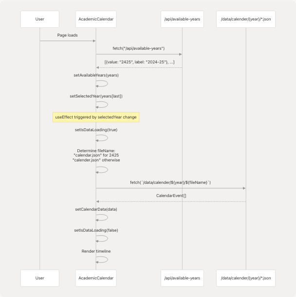

# Academic Calendar

> Source: https://deepwiki.com/tashifkhan/JIIT-time-table-website/6-academic-calendar

# Academic Calendar

Relevant source files

* [README.md](https://github.com/tashifkhan/JIIT-time-table-website/blob/0ffdedf5/README.md)
* [website/app/academic-calendar/calendar-content.tsx](https://github.com/tashifkhan/JIIT-time-table-website/blob/0ffdedf5/website/app/academic-calendar/calendar-content.tsx)
* [website/components/action-buttons.tsx](https://github.com/tashifkhan/JIIT-time-table-website/blob/0ffdedf5/website/components/action-buttons.tsx)
* [website/components/background.tsx](https://github.com/tashifkhan/JIIT-time-table-website/blob/0ffdedf5/website/components/background.tsx)
* [website/components/edit-event-dialog.tsx](https://github.com/tashifkhan/JIIT-time-table-website/blob/0ffdedf5/website/components/edit-event-dialog.tsx)
* [website/components/google-calendar-button.tsx](https://github.com/tashifkhan/JIIT-time-table-website/blob/0ffdedf5/website/components/google-calendar-button.tsx)
* [website/components/schedule-display.tsx](https://github.com/tashifkhan/JIIT-time-table-website/blob/0ffdedf5/website/components/schedule-display.tsx)
* [website/components/schedule-form.tsx](https://github.com/tashifkhan/JIIT-time-table-website/blob/0ffdedf5/website/components/schedule-form.tsx)
* [website/components/timeline-landing.tsx](https://github.com/tashifkhan/JIIT-time-table-website/blob/0ffdedf5/website/components/timeline-landing.tsx)

## Purpose and Scope

The Academic Calendar feature displays institutional events, holidays, and important dates for JIIT academic sessions. It provides a chronological timeline view with filtering capabilities and Google Calendar synchronization. For information about personal timetable scheduling, see [Schedule Generation](/tashifkhan/JIIT-time-table-website/4-schedule-generation-(core-feature)). For exporting personal schedules to Google Calendar, see [Google Calendar Integration](/tashifkhan/JIIT-time-table-website/9.1-google-calendar-integration).

**Sources:** [src/components/academic-calendar.tsx1-414](https://github.com/tashifkhan/JIIT-time-table-website/blob/0ffdedf5/src/components/academic-calendar.tsx#L1-L414)

---

## Overview

The academic calendar system loads event data from static JSON files organized by academic year and renders them in an interactive timeline. Users can view past and upcoming events, filter by holidays, and sync all events to their Google Calendar account.

### System Architecture


```

**Sources:** [src/components/academic-calendar.tsx20-54](https://github.com/tashifkhan/JIIT-time-table-website/blob/0ffdedf5/src/components/academic-calendar.tsx#L20-L54) [src/utils/calendar-AC.ts21-107](https://github.com/tashifkhan/JIIT-time-table-website/blob/0ffdedf5/src/utils/calendar-AC.ts#L21-L107)

---

## Data Model

### CalendarEvent Type

The calendar system expects event data in the following structure:

| Field | Type | Description | Example |
| --- | --- | --- | --- |
| `summary` | `string` | Event title (prefix "Holiday -" for holidays) | `"Holiday - Republic Day"` |
| `start.date` | `string` | ISO date string for event start | `"2025-01-26"` |
| `end.date` | `string` | ISO date string for event end | `"2025-01-27"` |

```
```
// Type definition from calendar-AC.ts
type CalendarEvent = {
    summary: string;
    start: { date: string };
    end: { date: string };
};
```
```

The component automatically detects holidays by checking if `summary.startsWith("Holiday -")` and applies special styling.

**Sources:** [src/utils/calendar-AC.ts9-13](https://github.com/tashifkhan/JIIT-time-table-website/blob/0ffdedf5/src/utils/calendar-AC.ts#L9-L13) [src/components/academic-calendar.tsx260-261](https://github.com/tashifkhan/JIIT-time-table-website/blob/0ffdedf5/src/components/academic-calendar.tsx#L260-L261)

---

## Component State Management

### State Variables

```

```

| State Variable | Type | Purpose |
| --- | --- | --- |
| `isLoading` | `boolean` | Controls loading spinner display |
| `calendarData` | `CalendarEvent[]` | Raw event data from JSON |
| `isDataLoading` | `boolean` | Tracks fetch operation status |
| `selectedYear` | `string` | Currently selected academic year (`"2425"` or `"2526"`) |
| `visibleEventsCount` | `number` | Number of past events to display (starts at 0) |
| `showHolidaysOnly` | `boolean` | Filter state for holiday-only view |
| `availableYears` | `Array<{value: string, label: string}>` | List of selectable years |
| `eventRefs` | `HTMLDivElement[]` | Refs for auto-scroll functionality |
| `upcomingDividerRef` | `HTMLDivElement` | Ref to "Upcoming Events" divider |

**Sources:** [src/components/academic-calendar.tsx7-18](https://github.com/tashifkhan/JIIT-time-table-website/blob/0ffdedf5/src/components/academic-calendar.tsx#L7-L18)

---

## Data Loading Pipeline

### Year Selection and Data Fetching

```

```

The component uses different filename conventions based on the year:

* Year `2425`: Loads `calendar.json` (correct spelling)
* Other years: Loads `calender.json` (alternate spelling)

**Sources:** [src/components/academic-calendar.tsx28-54](https://github.com/tashifkhan/JIIT-time-table-website/blob/0ffdedf5/src/components/academic-calendar.tsx#L28-L54)

---

## Event Processing and Display Logic

### Event Categorization

The component processes events through several transformations:

```

```

**Code Implementation:**

```
```
// Sort events chronologically
const sortedEvents = [...calendarData].sort(
    (a, b) => new Date(a.start.date).getTime() - new Date(b.start.date).getTime()
);

// Filter for holidays if enabled
const filteredEvents = showHolidaysOnly
    ? sortedEvents.filter((event) => event.summary.startsWith("Holiday -"))
    : sortedEvents;

// Separate past and upcoming
const today = new Date();
const upcomingEvents = filteredEvents.filter((event) => {
    const eventDate = new Date(event.start.date);
    return eventDate >= today;
});

const pastEvents = filteredEvents
    .filter((event) => {
        const eventDate = new Date(event.start.date);
        return eventDate < today;
    })
    .reverse(); // Most recent past events first

// Combine for display
const eventsToShow = [
    ...pastEvents.slice(0, visibleEventsCount).reverse(),
    ...upcomingEvents,
];
```
```

**Sources:** [src/components/academic-calendar.tsx56-83](https://github.com/tashifkhan/JIIT-time-table-website/blob/0ffdedf5/src/components/academic-calendar.tsx#L56-L83)

---

## UI Features

### Timeline View

The timeline uses an alternating left-right layout for desktop (responsive single-column for mobile):

| Element | Styling | Purpose |
| --- | --- | --- |
| Central Timeline | Vertical line with `bg-[#F0BB78]/30` | Visual anchor for chronology |
| Event Dots | Circle with `bg-[#F0BB78]` (holidays: `bg-orange-500`) | Mark event position on timeline |
| Event Cards | Even: right-aligned, Odd: left-aligned | Zigzag layout for readability |
| Holiday Badge | Red background with "Holiday" label | Quick visual identification |
| Past Events | Reduced opacity (75%) and muted colors | De-emphasize historical data |
| "Upcoming Events" Divider | Horizontal line with badge | Clear separation point |

**Sources:** [src/components/academic-calendar.tsx253-378](https://github.com/tashifkhan/JIIT-time-table-website/blob/0ffdedf5/src/components/academic-calendar.tsx#L253-L378)

### Auto-Scroll Behavior

On year change, the component automatically scrolls to the first upcoming event:

```
```
useEffect(() => {
    if (eventsToShow.length === 0) return;

    // Find first upcoming event index
    let targetIndex = eventsToShow.findIndex((event) => {
        const eventDate = new Date(event.start.date);
        return eventDate >= today;
    }) - 1; // Scroll to event just before upcoming

    if (targetIndex >= 0 && eventRefs.current[targetIndex]) {
        eventRefs.current[targetIndex].scrollIntoView({ behavior: "smooth" });
    }
}, [selectedYear]);
```
```

**Sources:** [src/components/academic-calendar.tsx85-104](https://github.com/tashifkhan/JIIT-time-table-website/blob/0ffdedf5/src/components/academic-calendar.tsx#L85-L104)

---

## Google Calendar Synchronization

### OAuth Flow

```


**Sources:** [src/components/academic-calendar.tsx106-128](https://github.com/tashifkhan/JIIT-time-table-website/blob/0ffdedf5/src/components/academic-calendar.tsx#L106-L128) [src/utils/calendar-AC.ts21-107](https://github.com/tashifkhan/JIIT-time-table-website/blob/0ffdedf5/src/utils/calendar-AC.ts#L21-L107)

### Event Transformation

The `addAcademicCalendarEvents` function transforms calendar events into Google Calendar API format:

```
```
const calendarEvents = events.map(event => ({
    summary: event.summary,
    start: {
        date: event.start.date,
        timeZone: 'Asia/Kolkata'
    },
    end: {
        date: event.end.date,
        timeZone: 'Asia/Kolkata'
    },
    description: `Academic Calendar Event for JIIT 2024-25`,
    transparency: 'transparent', // All-day event, doesn't block time
    visibility: 'public',
    colorId: event.summary.toLowerCase().includes('holiday') ? '11' : '1',
}));
```
```

**Key Properties:**

| Property | Value | Purpose |
| --- | --- | --- |
| `date` (not `dateTime`) | ISO date string | Creates all-day events |
| `timeZone` | `'Asia/Kolkata'` | Ensures correct date interpretation |
| `transparency` | `'transparent'` | Events don't show as "busy" |
| `colorId` | `'11'` (holidays) or `'1'` (default) | Visual distinction in calendar |

**Sources:** [src/utils/calendar-AC.ts38-52](https://github.com/tashifkhan/JIIT-time-table-website/blob/0ffdedf5/src/utils/calendar-AC.ts#L38-L52)

---

## Interactive Controls

### Year Selector

```
```
<select
    value={selectedYear}
    onChange={(e) => {
        setSelectedYear(e.target.value);
        setVisibleEventsCount(0); // Reset to show only upcoming events
    }}
    className="appearance-none bg-white/10 border border-[#F0BB78]/30 
               rounded-lg px-4 py-2 pr-8 text-[#F0BB78] font-semibold"
>
    {availableYears.map((year) => (
        <option key={year.value} value={year.value}>
            {year.label}
        </option>
    ))}
</select>
```
```

Changing the year triggers a complete data reload and resets the visible past events count.

**Sources:** [src/components/academic-calendar.tsx182-202](https://github.com/tashifkhan/JIIT-time-table-website/blob/0ffdedf5/src/components/academic-calendar.tsx#L182-L202)

### Holiday Filter Button

Fixed-position button that toggles between all events and holidays only:

```
```
<button
    onClick={() => {
        setShowHolidaysOnly(!showHolidaysOnly);
        setVisibleEventsCount(0); // Reset view
    }}
    className={`fixed bottom-16 left-4 ... ${
        showHolidaysOnly
            ? "bg-red-500/20 border-red-500/50 text-red-300"
            : "bg-white/10 border-white/20 text-[#F0BB78]"
    }`}
>
    <Filter className="w-4 h-4 sm:w-5 sm:h-5" />
    <span>{showHolidaysOnly ? "All Events" : "Holidays Only"}</span>
</button>
```
```

**Sources:** [src/components/academic-calendar.tsx381-397](https://github.com/tashifkhan/JIIT-time-table-website/blob/0ffdedf5/src/components/academic-calendar.tsx#L381-L397)

### Load Previous Events Button

Displays at the top of the timeline when past events exist but are hidden:

```
```
{pastEvents.length > visibleEventsCount && (
    <button
        onClick={() => {
            setVisibleEventsCount(pastEvents.length);
            // Auto-scroll to "Upcoming Events" divider after loading
            setTimeout(() => {
                if (upcomingDividerRef.current) {
                    const rect = upcomingDividerRef.current.getBoundingClientRect();
                    const scrollTop = window.scrollY + rect.top - 80; // 80px header offset
                    window.scrollTo({ top: scrollTop, behavior: "smooth" });
                }
            }, 200);
        }}
    >
        Load All Previous Events ({pastEvents.length - visibleEventsCount} remaining)
    </button>
)}
```
```

**Sources:** [src/components/academic-calendar.tsx211-236](https://github.com/tashifkhan/JIIT-time-table-website/blob/0ffdedf5/src/components/academic-calendar.tsx#L211-L236)

---

## Error Handling

### Data Loading Errors

The component includes basic error handling for year availability fetching:

```
```
fetch("/api/available-years")
    .then((res) => res.json())
    .then((years) => {
        setAvailableYears(years);
        if (years.length > 0) {
            setSelectedYear(years[years.length - 1].value);
        }
    })
    .catch((error) => {
        console.error("Failed to fetch available years:", error);
    });
```
```

If the years API fails, the component falls back to default years set in state initialization:

```
```
const [availableYears, setAvailableYears] = useState([
    { value: "2425", label: "2024-25" },
    { value: "2526", label: "2025-26" },
]);
```
```

**Sources:** [src/components/academic-calendar.tsx28-43](https://github.com/tashifkhan/JIIT-time-table-website/blob/0ffdedf5/src/components/academic-calendar.tsx#L28-L43)

### Google Calendar Sync Errors

The `addAcademicCalendarEvents` function returns detailed error information:

```
```
type GoogleCalendarResponse = {
    success: boolean;
    message: string;
    error?: string;
};
```
```

Error scenarios handled:

1. OAuth authentication failure
2. Individual event creation failure
3. Network errors

All errors are caught and returned in the response object, with user-facing alerts displaying the error message.

**Sources:** [src/utils/calendar-AC.ts15-19](https://github.com/tashifkhan/JIIT-time-table-website/blob/0ffdedf5/src/utils/calendar-AC.ts#L15-L19) [src/components/academic-calendar.tsx118-125](https://github.com/tashifkhan/JIIT-time-table-website/blob/0ffdedf5/src/components/academic-calendar.tsx#L118-L125)

---

## Loading States

### Initial Load

```
```
if (isDataLoading) {
    return (
        <main>
            <div className="bg-white/10 border border-[#F0BB78]/20 rounded-2xl">
                <div className="mb-6 flex flex-row items-end gap-2 h-10">
                    {[0, 1, 2].map((i) => (
                        <motion.div
                            key={i}
                            className="w-4 h-4 sm:w-5 sm:h-5 rounded-full bg-[#F0BB78]"
                            animate={{ y: [0, -18, 0] }}
                            transition={{
                                repeat: Infinity,
                                duration: 0.9,
                                delay: i * 0.15,
                            }}
                        />
                    ))}
                </div>
                <p className="text-lg font-semibold text-[#F0BB78]">
                    Loading Academic Calendar...
                </p>
            </div>
        </main>
    );
}
```
```

Displays animated bouncing dots with loading message while fetching calendar data.

**Sources:** [src/components/academic-calendar.tsx130-159](https://github.com/tashifkhan/JIIT-time-table-website/blob/0ffdedf5/src/components/academic-calendar.tsx#L130-L159)

### Calendar Sync Loading

```
```
<button
    onClick={handleAddToCalendar}
    disabled={isLoading}
>
    <span>{isLoading ? "Adding to Calendar..." : "Add to Calendar"}</span>
</button>
```
```

Button text changes and becomes disabled during Google Calendar sync operation.

**Sources:** [src/components/academic-calendar.tsx399-410](https://github.com/tashifkhan/JIIT-time-table-website/blob/0ffdedf5/src/components/academic-calendar.tsx#L399-L410)

---

## Summary

The Academic Calendar system provides a comprehensive view of institutional events through:

1. **Data Management**: Static JSON files organized by year with automatic fetching
2. **Timeline Visualization**: Chronological display with past/upcoming separation
3. **Filtering**: Toggle between all events and holidays-only view
4. **Progressive Disclosure**: Load past events on-demand to avoid clutter
5. **External Integration**: One-click sync to Google Calendar via OAuth 2.0
6. **Responsive Design**: Adapts layout from desktop zigzag to mobile single-column

The component is self-contained with minimal external dependencies, relying primarily on React state management and the Google Calendar API for synchronization functionality.

**Sources:** [src/components/academic-calendar.tsx1-414](https://github.com/tashifkhan/JIIT-time-table-website/blob/0ffdedf5/src/components/academic-calendar.tsx#L1-L414) [src/utils/calendar-AC.ts1-108](https://github.com/tashifkhan/JIIT-time-table-website/blob/0ffdedf5/src/utils/calendar-AC.ts#L1-L108)