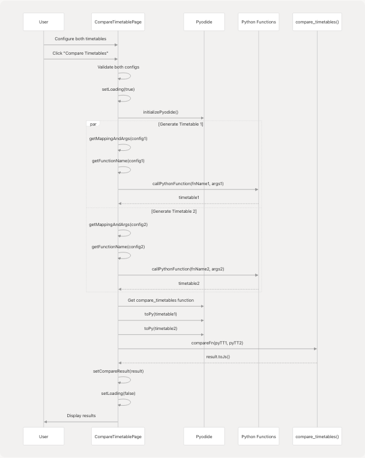
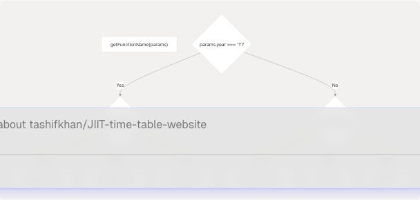
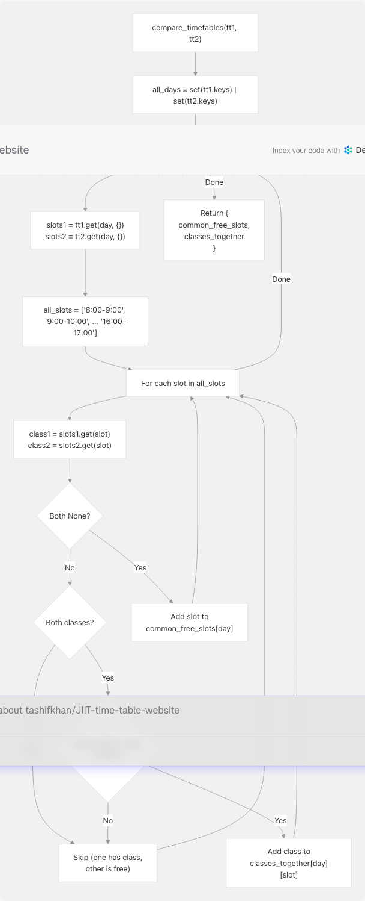
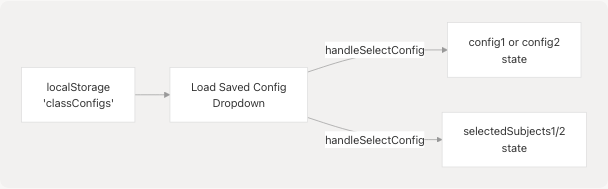
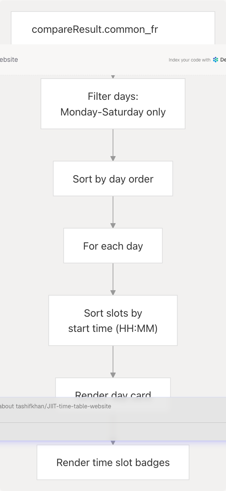
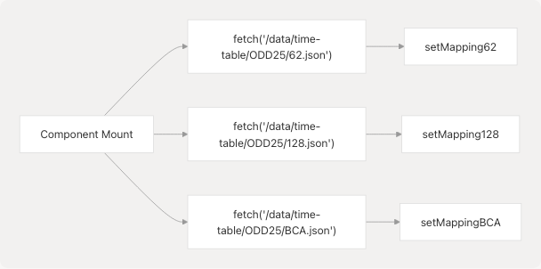

# Compare Timetables

Relevant source files

* [README.md](https://github.com/tashifkhan/JIIT-time-table-website/blob/0ffdedf5/README.md)
* [website/app/academic-calendar/calendar-content.tsx](https://github.com/tashifkhan/JIIT-time-table-website/blob/0ffdedf5/website/app/academic-calendar/calendar-content.tsx)
* [website/components/action-buttons.tsx](https://github.com/tashifkhan/JIIT-time-table-website/blob/0ffdedf5/website/components/action-buttons.tsx)
* [website/components/background.tsx](https://github.com/tashifkhan/JIIT-time-table-website/blob/0ffdedf5/website/components/background.tsx)
* [website/components/edit-event-dialog.tsx](https://github.com/tashifkhan/JIIT-time-table-website/blob/0ffdedf5/website/components/edit-event-dialog.tsx)
* [website/components/google-calendar-button.tsx](https://github.com/tashifkhan/JIIT-time-table-website/blob/0ffdedf5/website/components/google-calendar-button.tsx)
* [website/components/schedule-display.tsx](https://github.com/tashifkhan/JIIT-time-table-website/blob/0ffdedf5/website/components/schedule-display.tsx)
* [website/components/schedule-form.tsx](https://github.com/tashifkhan/JIIT-time-table-website/blob/0ffdedf5/website/components/schedule-form.tsx)
* [website/components/timeline-landing.tsx](https://github.com/tashifkhan/JIIT-time-table-website/blob/0ffdedf5/website/components/timeline-landing.tsx)

## Purpose and Scope

The Compare Timetables feature enables users to generate and compare two different class schedules to identify common free time slots and classes they attend together. This is useful for students coordinating study groups, planning meetups with friends, or identifying overlap in schedules across different batches or programs.

For information about generating a single timetable, see page **4** (Schedule Generation - Core Feature). For viewing schedules in calendar format, see page **5** (Timeline View).

---

## System Architecture

The comparison feature operates as a standalone page that leverages the same schedule generation pipeline used in the main application, but processes two configurations in parallel and applies comparison logic to the results.


```

**Sources:** [website/components/compare-timetable.tsx](https://github.com/tashifkhan/JIIT-time-table-website/blob/0ffdedf5/website/components/compare-timetable.tsx) README.md

---

## Component Structure

The `CompareTimetablePage` component manages two independent timetable configurations and coordinates their generation and comparison.

### State Management

| State Variable | Type | Purpose |
| --- | --- | --- |
| `config1`, `config2` | `{campus, year, batch, electives}` | User input for each timetable |
| `selectedSubjects1`, `selectedSubjects2` | `string[]` | Subject codes selected for each config |
| `timetable1`, `timetable2` | `YourTietable` | Generated schedule objects |
| `compareResult` | `{common_free_slots, classes_together}` | Comparison output |
| `loading` | `boolean` | Generation/comparison status |
| `savedConfigs` | `{[key: string]: any}` | Persisted configurations from localStorage |
| `mapping62`, `mapping128`, `mappingBCA` | `any` | Loaded timetable data JSON |

**Sources:** [website/components/compare-timetable.tsx](https://github.com/tashifkhan/JIIT-time-table-website/blob/0ffdedf5/website/components/compare-timetable.tsx)

---

## Timetable Generation Pipeline

The component generates both timetables in parallel using the same Python functions as the main application, with dynamic function selection based on campus and year.

```

```

### Function Selection Logic

The component uses the same dynamic function selection as the main application:

```

```

**Sources:** [website/components/compare-timetable.tsx](https://github.com/tashifkhan/JIIT-time-table-website/blob/0ffdedf5/website/components/compare-timetable.tsx)

---

## Comparison Algorithm

The `compare_timetables` Python function analyzes two timetable objects to identify commonalities.

### Python Function Signature

```
```
def compare_timetables(timetable1: dict, timetable2: dict) -> dict
```
```

**Sources:** [public/\_creator.py900-946](https://github.com/tashifkhan/JIIT-time-table-website/blob/0ffdedf5/public/_creator.py#L900-L946)

### Comparison Logic

The algorithm operates on a time-slot-by-time-slot basis:

1. **Collect all days** from both timetables (union of day keys)
2. **For each day**, iterate through all possible time slots (8:00-17:00)
3. **For each time slot**, check:
   * If both timetables have no class → add to `common_free_slots`
   * If both have a class with identical `subject_name`, `type`, and `location` → add to `classes_together`

```

```

### Time Slot Generation

The function generates hourly slots from 8:00 to 17:00 (5 PM):

```
```
all_slots = [f"{time}:00-{time+1}:00" for time in range(8, 17)]
```
```

This creates a standardized time grid: `['8:00-9:00', '9:00-10:00', ..., '16:00-17:00']`

**Sources:** [public/\_creator.py900-946](https://github.com/tashifkhan/JIIT-time-table-website/blob/0ffdedf5/public/_creator.py#L900-L946) [public/\_creator.py919](https://github.com/tashifkhan/JIIT-time-table-website/blob/0ffdedf5/public/_creator.py#L919-L919)

---

## Result Structure

The comparison returns a structured object with two main sections:

### TypeScript Interface (Inferred)

```
```
interface CompareResult {
  common_free_slots: {
    [day: string]: string[]  // Array of time slots
  };
  classes_together: {
    [day: string]: {
      [timeSlot: string]: {
        subject_name: string;
        type: "L" | "T" | "P" | "C";
        location: string;
      }
    }
  };
}
```
```

### Example Result

```
```
{
  "common_free_slots": {
    "Monday": ["09:00-10:00", "14:00-15:00"],
    "Tuesday": ["11:00-12:00"]
  },
  "classes_together": {
    "Monday": {
      "10:00-11:00": {
        "subject_name": "Data Structures and Algorithms",
        "type": "L",
        "location": "G7"
      }
    }
  }
}
```
```

**Sources:** [public/\_creator.py907-911](https://github.com/tashifkhan/JIIT-time-table-website/blob/0ffdedf5/public/_creator.py#L907-L911) [public/\_creator.py913-944](https://github.com/tashifkhan/JIIT-time-table-website/blob/0ffdedf5/public/_creator.py#L913-L944)

---

## User Interface Components

### Configuration Forms

The page displays two side-by-side forms for configuring timetables:

| Field | Input Type | Validation |
| --- | --- | --- |
| Campus | Select dropdown | Required: "62", "128", or "BCA" |
| Year | Select dropdown | Required: "1", "2", "3", or "4" (no 4th for BCA) |
| Batch | Text input | Required: Uppercase alphanumeric (e.g., "A6", "F4") |
| Subjects | Subject selector modal | Required for year > 1 |

**Sources:** [website/components/compare-timetable.tsx](https://github.com/tashifkhan/JIIT-time-table-website/blob/0ffdedf5/website/components/compare-timetable.tsx)

### Saved Configuration Integration

Each configuration form includes a dropdown to load saved configs from `localStorage`:

```

```

Configuration saving and loading is documented on page **9.3** (Shareable URLs & Configuration Saving).

**Sources:** [website/components/compare-timetable.tsx](https://github.com/tashifkhan/JIIT-time-table-website/blob/0ffdedf5/website/components/compare-timetable.tsx)

### Compare Button

The comparison is triggered by a button with validation:

```
```
disabled={
  !isConfigValid(config1) || 
  !isConfigValid(config2) || 
  loading
}
```
```

Validation checks:

* Campus, year, and batch are present
* For year > 1: at least one elective selected

**Sources:** [website/components/compare-timetable.tsx](https://github.com/tashifkhan/JIIT-time-table-website/blob/0ffdedf5/website/components/compare-timetable.tsx)

---

## Results Display

### Common Free Slots Section

Displays free time slots grouped by day, sorted chronologically:

```

```

**Sources:** [website/components/compare-timetable.tsx](https://github.com/tashifkhan/JIIT-time-table-website/blob/0ffdedf5/website/components/compare-timetable.tsx)

### Classes Together Section

Displays shared classes with full details:

Each class entry shows:

* Time slot (e.g., "10:00-11:00")
* Subject name
* Class type (Lecture/Tutorial/Practical)
* Location

The display adapts for mobile (stacked layout) vs desktop (horizontal layout).

**Sources:** [website/components/compare-timetable.tsx](https://github.com/tashifkhan/JIIT-time-table-website/blob/0ffdedf5/website/components/compare-timetable.tsx)

### Time Sorting Logic

Both sections implement time-based sorting:

```
```
const getMinutes = (time: string) => {
  const [hours, minutes] = time.split(":").map(Number);
  return hours * 60 + minutes;
};

sortedSlots.sort((a, b) => {
  const timeA = a.split("-")[0];
  const timeB = b.split("-")[0];
  return getMinutes(timeA) - getMinutes(timeB);
});
```
```

This ensures slots appear in chronological order regardless of the order they were added.

**Sources:** [website/components/compare-timetable.tsx](https://github.com/tashifkhan/JIIT-time-table-website/blob/0ffdedf5/website/components/compare-timetable.tsx)

---

## Data Loading

The component fetches timetable data on mount:

```


The component displays a loading message until all three mappings are loaded.

**Sources:** [website/components/compare-timetable.tsx](https://github.com/tashifkhan/JIIT-time-table-website/blob/0ffdedf5/website/components/compare-timetable.tsx)

---

## Integration with Schedule Form Components

The component reuses the `SubjectSelector` component from the main schedule form:

```
```
import { SubjectSelector, Subject } from "./schedule-form";
```
```

This provides:

* Fuzzy search functionality (powered by Fuse.js)
* Subject filtering with exact and fuzzy matching
* Consistent UI/UX with the main form

The `SubjectSelector` component is documented in detail on page **4.1** (Schedule Form & User Input).

**Sources:** [website/components/compare-timetable.tsx](https://github.com/tashifkhan/JIIT-time-table-website/blob/0ffdedf5/website/components/compare-timetable.tsx) [website/components/schedule-form.tsx22-219](https://github.com/tashifkhan/JIIT-time-table-website/blob/0ffdedf5/website/components/schedule-form.tsx#L22-L219)

---

## Error Handling

The component handles errors at two levels:

1. **Generation errors**: Caught in try-catch, displayed as error result
2. **Validation errors**: Button disabled until valid configuration

```
```
try {
  // Generation and comparison logic
} catch (e) {
  setCompareResult({ error: "Failed to compare timetables." });
}
```
```

**Sources:** [website/components/compare-timetable.tsx](https://github.com/tashifkhan/JIIT-time-table-website/blob/0ffdedf5/website/components/compare-timetable.tsx)

---

## Pyodide Integration

The comparison uses direct Pyodide globals access to call the comparison function:

```
```
const pyodide = (await initializePyodide()) as PyodideInterface;
const compareFn = pyodide.globals.get("compare_timetables");
const pyTT1 = pyodide.toPy(tt1);
const pyTT2 = pyodide.toPy(tt2);
const result = compareFn(pyTT1, pyTT2).toJs();
```
```

This differs from the standard `callPythonFunction` approach because the comparison function takes timetable objects (not JSON) as arguments.

**Sources:** [src/components/compare-timetable.tsx159-164](https://github.com/tashifkhan/JIIT-time-table-website/blob/0ffdedf5/src/components/compare-timetable.tsx#L159-L164)