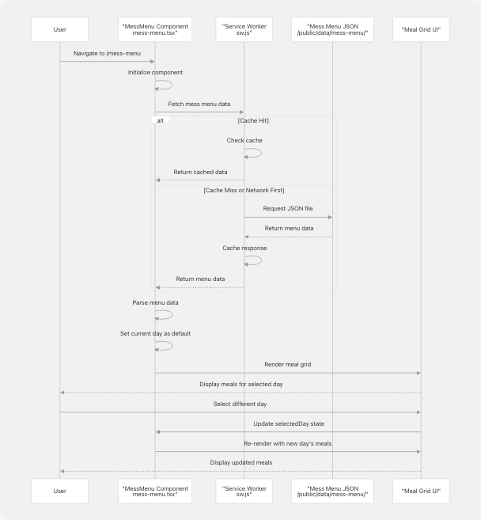
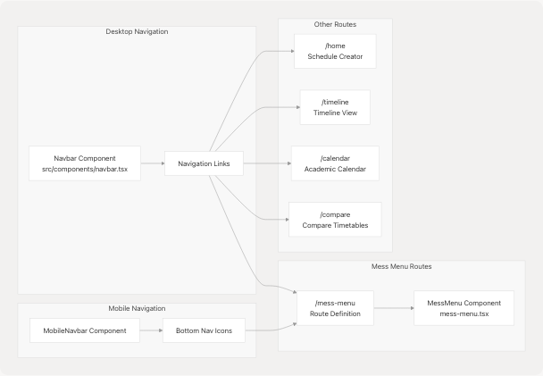
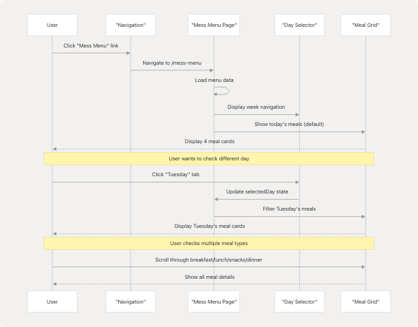

# Mess Menu

> Source: https://deepwiki.com/tashifkhan/JIIT-time-table-website/8-mess-menu

# Mess Menu

Relevant source files

* [README.md](https://github.com/tashifkhan/JIIT-time-table-website/blob/0ffdedf5/README.md)

## Purpose and Scope

This document describes the **Mess Menu** feature of the JIIT Time Table website, which provides students with access to dining hall meal schedules. The mess menu displays daily meal information organized by time slots (breakfast, lunch, snacks, dinner), helping students plan their meals throughout the week.

This page covers the mess menu component implementation, data structure, and user interface. For information about other timetable-related features, see [Schedule Generation](/tashifkhan/JIIT-time-table-website/4-schedule-generation-(core-feature)) and [Timeline View](/tashifkhan/JIIT-time-table-website/5-timeline-view). For the academic calendar feature, which shares similar display patterns, see [Academic Calendar](/tashifkhan/JIIT-time-table-website/6-academic-calendar).

**Sources:** [README.md27](https://github.com/tashifkhan/JIIT-time-table-website/blob/0ffdedf5/README.md#L27-L27) [README.md107](https://github.com/tashifkhan/JIIT-time-table-website/blob/0ffdedf5/README.md#L107-L107)

---

## Feature Overview

The mess menu feature serves as a dedicated page accessible via the application's navigation system. It displays weekly meal schedules for JIIT campus dining halls, allowing students to quickly check what meals are being served on any given day.

### Key Capabilities

| Capability | Description |
| --- | --- |
| **Weekly View** | Display meal schedules for all days of the week |
| **Meal Categories** | Organized by breakfast, lunch, snacks, and dinner |
| **Campus-Specific** | Shows menus relevant to the user's campus selection |
| **Mobile-Optimized** | Responsive design for viewing on mobile devices |
| **Offline Access** | Cached for PWA offline functionality |

**Sources:** [README.md27](https://github.com/tashifkhan/JIIT-time-table-website/blob/0ffdedf5/README.md#L27-L27) [README.md18-33](https://github.com/tashifkhan/JIIT-time-table-website/blob/0ffdedf5/README.md#L18-L33)

---

## Component Architecture

The mess menu follows the application's component-based architecture pattern, integrating with the navigation system and leveraging the PWA capabilities for offline access.

### Component Location and Integration


```

**Diagram: Mess Menu Component Integration**

The mess menu integrates into the application's routing structure as a standalone page, accessible through both desktop and mobile navigation components.

**Sources:** [README.md107](https://github.com/tashifkhan/JIIT-time-table-website/blob/0ffdedf5/README.md#L107-L107) [README.md108-109](https://github.com/tashifkhan/JIIT-time-table-website/blob/0ffdedf5/README.md#L108-L109)

---

## Component Structure

The `mess-menu.tsx` component serves as the primary implementation for the mess menu feature. Based on the application's architectural patterns, it follows a structured approach to displaying meal information.

### Mess Menu Component Organization

```

```

**Diagram: MessMenu Component Internal Structure**

The component manages state for day selection and menu data, rendering a responsive grid of meal cards organized by time slots.

**Sources:** [README.md107](https://github.com/tashifkhan/JIIT-time-table-website/blob/0ffdedf5/README.md#L107-L107)

---

## Data Model

The mess menu data follows a structured format that organizes meals by day of the week and meal type. The data structure aligns with the application's pattern of storing static JSON data in the `/public/data/` directory.

### Expected Data Structure

```
```
interface MealItem {
  name: string;           // Name of the dish
  category: string;       // meal type: breakfast, lunch, snacks, dinner
  vegetarian?: boolean;   // dietary information
  description?: string;   // additional details
}

interface DayMenu {
  day: string;           // Day of week (Monday, Tuesday, etc.)
  date?: string;         // Optional date information
  breakfast: MealItem[];
  lunch: MealItem[];
  snacks: MealItem[];
  dinner: MealItem[];
}

interface MessMenuData {
  campus: string;        // "62" or "128"
  week: number;          // Week number or identifier
  effectiveFrom: string; // Start date for this menu
  effectiveTo: string;   // End date for this menu
  menu: DayMenu[];
}
```
```

### Data Organization

| Attribute | Type | Description |
| --- | --- | --- |
| `campus` | string | Campus identifier ("62" or "128") |
| `week` | number | Week identifier for the menu cycle |
| `effectiveFrom` | string | ISO date when menu becomes active |
| `effectiveTo` | string | ISO date when menu expires |
| `menu` | DayMenu[] | Array of daily meal schedules |

**Sources:** [README.md73-87](https://github.com/tashifkhan/JIIT-time-table-website/blob/0ffdedf5/README.md#L73-L87) [README.md52-64](https://github.com/tashifkhan/JIIT-time-table-website/blob/0ffdedf5/README.md#L52-L64)

---

## Data Flow and Fetching

The mess menu follows the application's established pattern for fetching and caching static JSON data, similar to how timetable and academic calendar data are handled.

### Data Flow Sequence

```

```

**Diagram: Mess Menu Data Flow**

The data fetching leverages the service worker's caching strategy to enable offline access, consistent with the application's PWA architecture.

**Sources:** [README.md21](https://github.com/tashifkhan/JIIT-time-table-website/blob/0ffdedf5/README.md#L21-L21) [README.md96](https://github.com/tashifkhan/JIIT-time-table-website/blob/0ffdedf5/README.md#L96-L96)

---

## User Interface Layout

The mess menu interface provides an intuitive, card-based layout that displays meal information in an organized, scannable format.

### Layout Structure

The component likely uses a responsive grid system with the following structure:

| Section | Purpose | Implementation |
| --- | --- | --- |
| **Page Header** | Title and description | Displays "Mess Menu" with subtitle |
| **Day Selector** | Week navigation | Tabs or buttons for each day (Mon-Sun) |
| **Meal Grid** | Main content area | 2x2 or 1x4 grid for meal categories |
| **Meal Cards** | Individual meal display | Card components showing meal items |
| **Footer Actions** | Additional options | Refresh, campus toggle, or export options |

### Responsive Behavior

* **Desktop**: 2x2 grid showing all four meal categories simultaneously
* **Tablet**: 1x2 grid with scrollable meal sections
* **Mobile**: Single column stack with swipe navigation between meal types

**Sources:** [README.md32](https://github.com/tashifkhan/JIIT-time-table-website/blob/0ffdedf5/README.md#L32-L32) [README.md204-213](https://github.com/tashifkhan/JIIT-time-table-website/blob/0ffdedf5/README.md#L204-L213)

---

## Integration with Navigation System

The mess menu integrates with the application's navigation system, appearing as a route accessible from both desktop sidebar and mobile bottom navigation.

### Navigation Integration

```

```

**Diagram: Navigation Integration for Mess Menu**

The mess menu appears alongside other primary features in the navigation hierarchy, providing equal visibility and accessibility.

**Sources:** [README.md108](https://github.com/tashifkhan/JIIT-time-table-website/blob/0ffdedf5/README.md#L108-L108) [README.md204-206](https://github.com/tashifkhan/JIIT-time-table-website/blob/0ffdedf5/README.md#L204-L206)

---

## PWA and Offline Capabilities

Following the application's PWA architecture, the mess menu feature supports offline access through service worker caching strategies.

### Caching Strategy

| Resource Type | Caching Strategy | Purpose |
| --- | --- | --- |
| Mess Menu Component | Precache | Component code cached at build time |
| Mess Menu JSON Data | NetworkFirst or CacheFirst | Menu data available offline |
| UI Assets (icons, images) | Precache | Immediate availability |

### Service Worker Configuration

The mess menu resources are likely included in the service worker's precache manifest, generated during the build process by the PWA plugin:

* Component chunks: `/_next/static/chunks/*mess-menu*.js`
* Data files: `/public/data/mess-menu/*.json`
* Related assets: Any images or icons specific to the mess menu

**Sources:** [README.md21](https://github.com/tashifkhan/JIIT-time-table-website/blob/0ffdedf5/README.md#L21-L21) [README.md96](https://github.com/tashifkhan/JIIT-time-table-website/blob/0ffdedf5/README.md#L96-L96) [README.md213](https://github.com/tashifkhan/JIIT-time-table-website/blob/0ffdedf5/README.md#L213-L213)

---

## State Management

The mess menu component manages its own local state for day selection and menu display, following React best practices.

### Local State Structure

```
```
// Within MessMenu component
const [selectedDay, setSelectedDay] = useState<string>('Monday');
const [menuData, setMenuData] = useState<MessMenuData | null>(null);
const [loading, setLoading] = useState<boolean>(true);
const [error, setError] = useState<string | null>(null);
```
```

### State Flow

1. **Initial Load**: Component mounts and sets loading state
2. **Data Fetch**: Retrieves menu data from JSON endpoint
3. **Default Selection**: Sets current day of week as default
4. **User Interaction**: Updates selectedDay when user clicks different day
5. **UI Update**: React re-renders meal grid with filtered data

**Sources:** [README.md118-120](https://github.com/tashifkhan/JIIT-time-table-website/blob/0ffdedf5/README.md#L118-L120)

---

## Typical User Workflow

The mess menu provides a straightforward user experience for checking meal schedules.

### User Journey

```

```

**Diagram: Mess Menu User Interaction Flow**

The workflow emphasizes simplicity and quick access to meal information without requiring additional configuration or authentication.

**Sources:** [README.md188-206](https://github.com/tashifkhan/JIIT-time-table-website/blob/0ffdedf5/README.md#L188-L206)

---

## Styling and Visual Design

The mess menu component follows the application's design system, utilizing glassmorphic UI elements and the established color scheme.

### Design Elements

| Element | Styling Approach | Purpose |
| --- | --- | --- |
| Background | `background.tsx` component | Consistent app-wide backdrop |
| Meal Cards | shadcn/ui Card component | Elevated, readable containers |
| Day Selector | Tab or button group | Clear navigation between days |
| Typography | Tailwind CSS utilities | Hierarchical text presentation |
| Spacing | Consistent grid system | Organized, scannable layout |

### Color Coding

While the mess menu may not use extensive color coding like the timetable feature, it can employ:

* Vegetarian indicators (green icon)
* Meal type headers (distinct colors per category)
* Current day highlighting (accent color)

**Sources:** [README.md40](https://github.com/tashifkhan/JIIT-time-table-website/blob/0ffdedf5/README.md#L40-L40) [README.md103](https://github.com/tashifkhan/JIIT-time-table-website/blob/0ffdedf5/README.md#L103-L103) [README.md116](https://github.com/tashifkhan/JIIT-time-table-website/blob/0ffdedf5/README.md#L116-L116)

---

## Mobile Optimization

The mess menu is optimized for mobile viewing, consistent with the application's mobile-first design philosophy.

### Mobile Features

| Feature | Implementation | Benefit |
| --- | --- | --- |
| **Touch Navigation** | Swipe between days | Quick day switching |
| **Responsive Cards** | Stack on small screens | Vertical scrolling |
| **Bottom Nav Access** | Icon in mobile navbar | Easy access point |
| **Compact Layout** | Condensed meal information | More content visible |
| **Gesture Support** | React Swipeable integration | Natural mobile interaction |

### Touch Gesture Support

Similar to other pages in the application, the mess menu likely supports:

* **Swipe Left**: Navigate to next day
* **Swipe Right**: Navigate to previous day
* **Tap**: Expand meal details if truncated

**Sources:** [README.md32-33](https://github.com/tashifkhan/JIIT-time-table-website/blob/0ffdedf5/README.md#L32-L33) [README.md43](https://github.com/tashifkhan/JIIT-time-table-website/blob/0ffdedf5/README.md#L43-L43) [README.md204-213](https://github.com/tashifkhan/JIIT-time-table-website/blob/0ffdedf5/README.md#L204-L213)

---

## Data Update Mechanism

The mess menu data requires periodic updates to reflect changing weekly menus. The update mechanism follows the application's static data update pattern.

### Update Process

```


**Diagram: Mess Menu Data Update Pipeline**

Updates are deployed as static file changes, with the service worker handling cache invalidation and refresh.

**Sources:** [README.md71-87](https://github.com/tashifkhan/JIIT-time-table-website/blob/0ffdedf5/README.md#L71-L87) [README.md148-186](https://github.com/tashifkhan/JIIT-time-table-website/blob/0ffdedf5/README.md#L148-L186)

---

## Error Handling

The mess menu component implements error handling for common failure scenarios.

### Error Scenarios

| Scenario | Handling | User Experience |
| --- | --- | --- |
| **Data Fetch Failure** | Display error message | "Unable to load menu" with retry button |
| **Invalid JSON** | Log error and show fallback | "Menu data unavailable" message |
| **Network Offline** | Serve cached data | Seamless offline experience |
| **Missing Week Data** | Show most recent available | Automatic fallback to last known menu |
| **Component Error** | Error boundary catches | Graceful degradation, navigation still works |

### Loading States

The component manages loading states during data fetching:

* **Initial Load**: Skeleton or spinner while fetching
* **Day Switch**: Optional transition animation
* **Data Refresh**: Background update without blocking UI

**Sources:** [README.md216-222](https://github.com/tashifkhan/JIIT-time-table-website/blob/0ffdedf5/README.md#L216-L222)

---

## Extension Points

The mess menu feature can be extended with additional functionality in future iterations.

### Potential Enhancements

| Enhancement | Description | Implementation Approach |
| --- | --- | --- |
| **Dietary Filters** | Filter by vegetarian, vegan, etc. | Add filter controls and state |
| **Favorites** | Mark favorite meals | LocalStorage persistence |
| **Meal Ratings** | Community ratings for meals | API integration for voting |
| **Nutrition Info** | Display nutritional information | Expand data model |
| **Meal Reminders** | Notifications for meal times | PWA notification API |
| **Campus Toggle** | Switch between campus menus | UserContext integration |
| **Menu History** | View past weeks' menus | Archive JSON files |
| **Export Options** | Download menu as PDF/image | Leverage existing download.ts utilities |

**Sources:** [README.md248-256](https://github.com/tashifkhan/JIIT-time-table-website/blob/0ffdedf5/README.md#L248-L256) [README.md129](https://github.com/tashifkhan/JIIT-time-table-website/blob/0ffdedf5/README.md#L129-L129)

---

## Relationship to Other Features

The mess menu feature exists alongside other informational pages in the application ecosystem.

### Feature Comparison

| Feature | Primary Purpose | Data Source | User Input Required |
| --- | --- | --- | --- |
| **Mess Menu** | Display meal schedules | Static JSON | None (browsing only) |
| **Academic Calendar** | Show university events | Static JSON + API | Filtering, Google Calendar sync |
| **Schedule Creator** | Generate personalized timetable | Static JSON + Python processing | Campus, year, batch, electives |
| **Timeline View** | Calendar view of schedule | LocalStorage (user's schedule) | Prior schedule creation |
| **Compare Timetables** | Find common free slots | Static JSON + Python processing | Multiple schedule configurations |

The mess menu is the simplest of these features, requiring no configuration or personalization—it's purely informational content.

**Sources:** [README.md18-31](https://github.com/tashifkhan/JIIT-time-table-website/blob/0ffdedf5/README.md#L18-L31) [README.md101-114](https://github.com/tashifkhan/JIIT-time-table-website/blob/0ffdedf5/README.md#L101-L114)

---

## Summary

The Mess Menu feature provides JIIT students with quick access to dining hall meal schedules through a dedicated, mobile-optimized interface. Implemented in [src/components/mess-menu.tsx](https://github.com/tashifkhan/JIIT-time-table-website/blob/0ffdedf5/src/components/mess-menu.tsx) the component follows the application's established patterns for:

* **Data Management**: Static JSON files cached by the service worker
* **Navigation**: Integrated into both desktop and mobile navigation systems
* **UI/UX**: Glassmorphic design with responsive layout
* **Offline Support**: Full PWA capabilities for offline viewing
* **Mobile Optimization**: Touch gestures and responsive design

The feature requires minimal user interaction—simply navigate to the page and browse meal schedules by day of the week. The implementation aligns with the application's serverless, browser-based architecture, requiring no backend infrastructure or user authentication.

**Sources:** [README.md27](https://github.com/tashifkhan/JIIT-time-table-website/blob/0ffdedf5/README.md#L27-L27) [README.md107](https://github.com/tashifkhan/JIIT-time-table-website/blob/0ffdedf5/README.md#L107-L107) [README.md18-33](https://github.com/tashifkhan/JIIT-time-table-website/blob/0ffdedf5/README.md#L18-L33)