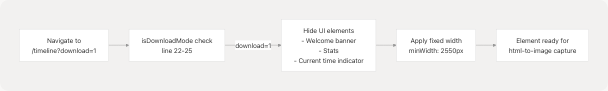
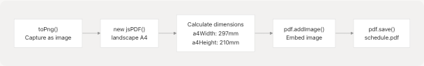
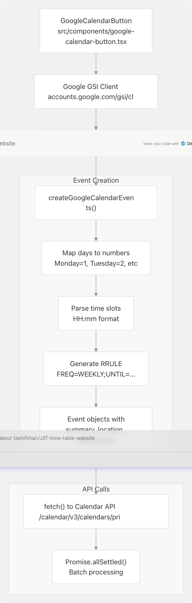

# Export & Sharing

> Source: https://deepwiki.com/tashifkhan/JIIT-time-table-website/9-export-and-sharing

# Export & Sharing

Relevant source files

* [README.md](https://github.com/tashifkhan/JIIT-time-table-website/blob/0ffdedf5/README.md)
* [website/app/academic-calendar/calendar-content.tsx](https://github.com/tashifkhan/JIIT-time-table-website/blob/0ffdedf5/website/app/academic-calendar/calendar-content.tsx)
* [website/components/action-buttons.tsx](https://github.com/tashifkhan/JIIT-time-table-website/blob/0ffdedf5/website/components/action-buttons.tsx)
* [website/components/background.tsx](https://github.com/tashifkhan/JIIT-time-table-website/blob/0ffdedf5/website/components/background.tsx)
* [website/components/edit-event-dialog.tsx](https://github.com/tashifkhan/JIIT-time-table-website/blob/0ffdedf5/website/components/edit-event-dialog.tsx)
* [website/components/google-calendar-button.tsx](https://github.com/tashifkhan/JIIT-time-table-website/blob/0ffdedf5/website/components/google-calendar-button.tsx)
* [website/components/schedule-display.tsx](https://github.com/tashifkhan/JIIT-time-table-website/blob/0ffdedf5/website/components/schedule-display.tsx)
* [website/components/schedule-form.tsx](https://github.com/tashifkhan/JIIT-time-table-website/blob/0ffdedf5/website/components/schedule-form.tsx)
* [website/components/timeline-landing.tsx](https://github.com/tashifkhan/JIIT-time-table-website/blob/0ffdedf5/website/components/timeline-landing.tsx)

This document covers the mechanisms for exporting schedules to various formats and sharing configurations between users. The system provides three primary sharing/export capabilities: downloadable images (PNG/PDF), Google Calendar synchronization, and URL-based configuration sharing.

For details on individual export mechanisms, see:

* Google Calendar integration: [9.1](/tashifkhan/JIIT-time-table-website/9.1-google-calendar-integration)
* PDF/PNG export: [9.2](/tashifkhan/JIIT-time-table-website/9.2-pdf-and-png-export)
* URL parameter sharing: [9.3](/tashifkhan/JIIT-time-table-website/9.3-shareable-urls-and-configuration-saving)

---

## Overview of Export & Sharing Architecture

The export and sharing system operates on the current schedule state, with special handling for edited schedules. All export operations use the `editedSchedule` if available, otherwise falling back to the base `schedule`.

**Export & Sharing Flow**


```

Sources: [src/components/action-buttons.tsx1-124](https://github.com/tashifkhan/JIIT-time-table-website/blob/0ffdedf5/src/components/action-buttons.tsx#L1-L124) [src/utils/download.ts1-103](https://github.com/tashifkhan/JIIT-time-table-website/blob/0ffdedf5/src/utils/download.ts#L1-L103) [src/components/google-calendar-button.tsx1-111](https://github.com/tashifkhan/JIIT-time-table-website/blob/0ffdedf5/src/components/google-calendar-button.tsx#L1-L111)

---

## Export Mechanism Entry Point

The `ActionButtons` component serves as the primary UI for all export operations. It manages loading states, progress notifications, and routing between export types.

| Export Type | Trigger Function | Output Format | Processing Library |
| --- | --- | --- | --- |
| PNG | `downloadAsPng` | Raster image | html-to-image |
| PDF | `downloadAsPdf` | PDF document | jsPDF + html-to-image |
| Google Calendar | `handleAddToCalendar` | iCal events | Google Calendar API |
| URL Share | nuqs automatic | Query parameters | react-router-dom |

**Key Components**

* **Schedule Resolution**: Uses `editedSchedule || schedule` to respect user modifications [src/components/action-buttons.tsx24](https://github.com/tashifkhan/JIIT-time-table-website/blob/0ffdedf5/src/components/action-buttons.tsx#L24-L24)
* **Navigation to Download Mode**: Triggers navigation to `/timeline?download=1` before export [src/components/action-buttons.tsx36](https://github.com/tashifkhan/JIIT-time-table-website/blob/0ffdedf5/src/components/action-buttons.tsx#L36-L36)
* **Toast Notifications**: Provides progress feedback using the `useToast` hook [src/components/action-buttons.tsx32-57](https://github.com/tashifkhan/JIIT-time-table-website/blob/0ffdedf5/src/components/action-buttons.tsx#L32-L57)
* **Loading State Management**: Tracks active export operation with `loading` state [src/components/action-buttons.tsx20](https://github.com/tashifkhan/JIIT-time-table-website/blob/0ffdedf5/src/components/action-buttons.tsx#L20-L20)

Sources: [src/components/action-buttons.tsx12-124](https://github.com/tashifkhan/JIIT-time-table-website/blob/0ffdedf5/src/components/action-buttons.tsx#L12-L124)

---

## Download Mode & Schedule Capture

The Timeline page implements a special download mode that prepares the schedule for capture. This mode is activated via the `download=1` query parameter.

**Timeline Download Mode Configuration**

```

```

Sources: [src/components/timeline.tsx22-25](https://github.com/tashifkhan/JIIT-time-table-website/blob/0ffdedf5/src/components/timeline.tsx#L22-L25) [src/components/timeline.tsx298-299](https://github.com/tashifkhan/JIIT-time-table-website/blob/0ffdedf5/src/components/timeline.tsx#L298-L299) [src/components/timeline.tsx409](https://github.com/tashifkhan/JIIT-time-table-website/blob/0ffdedf5/src/components/timeline.tsx#L409-L409)

**Download Mode Behavior**

The Timeline component detects download mode and modifies rendering:

```
```
const isDownloadMode = React.useMemo(() => {
    const params = new URLSearchParams(location.search);
    return params.get("download") === "1";
}, [location.search]);
```
```

When `isDownloadMode` is `true`:

* Welcome banner is hidden [src/components/timeline.tsx30-33](https://github.com/tashifkhan/JIIT-time-table-website/blob/0ffdedf5/src/components/timeline.tsx#L30-L33)
* Stats and legend section is conditionally hidden [src/components/timeline.tsx360-403](https://github.com/tashifkhan/JIIT-time-table-website/blob/0ffdedf5/src/components/timeline.tsx#L360-L403)
* Current time indicator is not rendered [src/components/timeline.tsx501-520](https://github.com/tashifkhan/JIIT-time-table-website/blob/0ffdedf5/src/components/timeline.tsx#L501-L520)
* Fixed minimum width is applied for consistent export size [src/components/timeline.tsx298-299](https://github.com/tashifkhan/JIIT-time-table-website/blob/0ffdedf5/src/components/timeline.tsx#L298-L299)
* Title is rendered inside the schedule display for inclusion in export [src/components/timeline.tsx412-439](https://github.com/tashifkhan/JIIT-time-table-website/blob/0ffdedf5/src/components/timeline.tsx#L412-L439)

Sources: [src/components/timeline.tsx22-25](https://github.com/tashifkhan/JIIT-time-table-website/blob/0ffdedf5/src/components/timeline.tsx#L22-L25) [src/components/timeline.tsx298-439](https://github.com/tashifkhan/JIIT-time-table-website/blob/0ffdedf5/src/components/timeline.tsx#L298-L439)

---

## Image Export Implementation

The download utilities provide PNG and PDF export by capturing the DOM as an image using the `html-to-image` library.

**PNG Export Flow**

Sources: [src/components/action-buttons.tsx26-74](https://github.com/tashifkhan/JIIT-time-table-website/blob/0ffdedf5/src/components/action-buttons.tsx#L26-L74) [src/utils/download.ts5-46](https://github.com/tashifkhan/JIIT-time-table-website/blob/0ffdedf5/src/utils/download.ts#L5-L46)

**Export Configuration**

Both PNG and PDF exports use identical capture settings:

```
```
await toPng(element, {
    quality: 1,
    backgroundColor: '#131010',
    pixelRatio: window.devicePixelRatio || 2,
    style: {
        transform: 'scale(1)',
        transformOrigin: 'top left',
    },
});
```
```

| Parameter | Value | Purpose |
| --- | --- | --- |
| `quality` | 1 | Maximum quality |
| `backgroundColor` | #131010 | Match app background |
| `pixelRatio` | devicePixelRatio || 2 | High-DPI display support |
| `transform` | scale(1) | Prevent scaling artifacts |

Sources: [src/utils/download.ts26-34](https://github.com/tashifkhan/JIIT-time-table-website/blob/0ffdedf5/src/utils/download.ts#L26-L34) [src/utils/download.ts67-71](https://github.com/tashifkhan/JIIT-time-table-website/blob/0ffdedf5/src/utils/download.ts#L67-L71)

**PDF Generation**

PDF export captures the schedule as an image, then embeds it in a landscape A4 document:

```

```

Sources: [src/utils/download.ts48-103](https://github.com/tashifkhan/JIIT-time-table-website/blob/0ffdedf5/src/utils/download.ts#L48-L103)

The PDF dimensions are calculated to fit the schedule within A4 landscape format:

```
```
const a4Width = 297;
const a4Height = 210;
const imageWidth = a4Width;
const imageHeight = (element.offsetHeight * a4Width) / element.offsetWidth;

pdf.addImage(
    dataUrl,
    'PNG',
    0,
    0,
    imageWidth,
    Math.min(imageHeight, a4Height)
);
```
```

Sources: [src/utils/download.ts73-94](https://github.com/tashifkhan/JIIT-time-table-website/blob/0ffdedf5/src/utils/download.ts#L73-L94)

**Progress Callbacks**

Both export functions support progress callbacks for user feedback:

* `onProgress(msg)`: Called with status messages [src/utils/download.ts19](https://github.com/tashifkhan/JIIT-time-table-website/blob/0ffdedf5/src/utils/download.ts#L19-L19) [src/utils/download.ts36](https://github.com/tashifkhan/JIIT-time-table-website/blob/0ffdedf5/src/utils/download.ts#L36-L36)
* `onSuccess()`: Called when download completes [src/utils/download.ts41](https://github.com/tashifkhan/JIIT-time-table-website/blob/0ffdedf5/src/utils/download.ts#L41-L41)
* `onError(err)`: Called on failure [src/utils/download.ts44](https://github.com/tashifkhan/JIIT-time-table-website/blob/0ffdedf5/src/utils/download.ts#L44-L44)

Sources: [src/utils/download.ts5-17](https://github.com/tashifkhan/JIIT-time-table-website/blob/0ffdedf5/src/utils/download.ts#L5-L17) [src/utils/download.ts48-60](https://github.com/tashifkhan/JIIT-time-table-website/blob/0ffdedf5/src/utils/download.ts#L48-L60)

---

## Google Calendar Integration

The Google Calendar integration creates recurring events from the schedule using OAuth 2.0 authentication and the Google Calendar API.

**Calendar Sync Architecture**

```

```

Sources: [src/components/google-calendar-button.tsx1-111](https://github.com/tashifkhan/JIIT-time-table-website/blob/0ffdedf5/src/components/google-calendar-button.tsx#L1-L111) [src/utils/calendar.ts1-72](https://github.com/tashifkhan/JIIT-time-table-website/blob/0ffdedf5/src/utils/calendar.ts#L1-L72)

**OAuth 2.0 Flow**

The authentication process uses Google's Identity Services (GSI) client:

```
```
const client = window.google.accounts.oauth2.initTokenClient({
    client_id: CLIENT_ID,
    scope: "https://www.googleapis.com/auth/calendar.events",
    prompt: "consent",
    ux_mode: "popup",
    hosted_domain: "gmail.com",
    state: window.location.origin,
    callback: async (response) => { /* ... */ }
});

client.requestAccessToken();
```
```

Sources: [src/components/google-calendar-button.tsx38-83](https://github.com/tashifkhan/JIIT-time-table-website/blob/0ffdedf5/src/components/google-calendar-button.tsx#L38-L83)

**Event Generation Process**

The `createGoogleCalendarEvents` function transforms the schedule structure into Google Calendar event objects:

| Step | Function | Purpose |
| --- | --- | --- |
| 1 | Day mapping | Convert day names to numeric values (Monday=1, etc) |
| 2 | Time parsing | Split time slots and ensure HH:mm format |
| 3 | Date calculation | Find next occurrence of target day |
| 4 | Recurrence rules | Generate RRULE for 5-month recurring events |
| 5 | Event creation | Build event objects with metadata |

Sources: [src/utils/calendar.ts2-46](https://github.com/tashifkhan/JIIT-time-table-website/blob/0ffdedf5/src/utils/calendar.ts#L2-L46)

**Recurrence Rule Generation**

Regular classes (not custom events) receive recurrence rules:

```
```
recurrence: isCustom ? [] : [
    `RRULE:FREQ=WEEKLY;UNTIL=${endDate.toISOString()
        .replace(/[-:]/g, '')
        .split('.')[0]}Z`
]
```
```

* Custom events (`type === 'C'`) have empty recurrence arrays (one-time events)
* Regular classes recur weekly for 5 months from the start date
* End date is formatted in ISO 8601 format without punctuation

Sources: [src/utils/calendar.ts30](https://github.com/tashifkhan/JIIT-time-table-website/blob/0ffdedf5/src/utils/calendar.ts#L30-L30)

**Event Properties**

Each calendar event includes:

```
```
{
    summary: `${isCustom ? '✨' : ''} ${slot.type} - ${slot.subject_name}`,
    location: slot.location,
    description: getEventDescription(slot),
    recurrence: [...],
    start: {
        timeZone: 'Asia/Kolkata',
        dateTime: getNextDateForDayAndTime(dayMapping[day], startTime).toISOString()
    },
    end: {
        timeZone: 'Asia/Kolkata',
        dateTime: getNextDateForDayAndTime(dayMapping[day], endTime).toISOString()
    },
    colorId: slot.type === 'C' ? '2' : '6'
}
```
```

* `summary`: Event title with emoji prefix for custom events
* `colorId`: "2" (green) for custom events, "6" (orange) for classes
* `timeZone`: Always set to 'Asia/Kolkata'
* `description`: Formatted with class type, room, and subject name

Sources: [src/utils/calendar.ts26-41](https://github.com/tashifkhan/JIIT-time-table-website/blob/0ffdedf5/src/utils/calendar.ts#L26-L41) [src/utils/calendar.ts48-58](https://github.com/tashifkhan/JIIT-time-table-website/blob/0ffdedf5/src/utils/calendar.ts#L48-L58)

**Batch Processing**

Events are created using `Promise.allSettled` to handle partial failures:

```
```
const results = await Promise.allSettled(
    events.map((event) =>
        fetch("https://www.googleapis.com/calendar/v3/calendars/primary/events", {
            method: "POST",
            headers: {
                Authorization: `Bearer ${response.access_token}`,
                "Content-Type": "application/json",
            },
            body: JSON.stringify(event),
        })
    )
);

const failures = results.filter((r) => r.status === "rejected");
```
```

This ensures that if some events fail to create, others still succeed. Failures are logged and reported to the user.

Sources: [src/components/google-calendar-button.tsx53-75](https://github.com/tashifkhan/JIIT-time-table-website/blob/0ffdedf5/src/components/google-calendar-button.tsx#L53-L75)

---

## URL Parameter Sharing

The application supports sharing schedules via URL parameters using the `nuqs` library for type-safe URL state synchronization. This enables users to share complete schedule configurations via links.

**URL Parameter Structure**

```

```

Sources: [src/components/url-params-dialog.tsx8-14](https://github.com/tashifkhan/JIIT-time-table-website/blob/0ffdedf5/src/components/url-params-dialog.tsx#L8-L14)

**Conflict Resolution Flow**

When URL parameters are detected but a cached schedule already exists, the system presents a conflict resolution dialog:

```

```

Sources: [src/components/url-params-dialog.tsx1-161](https://github.com/tashifkhan/JIIT-time-table-website/blob/0ffdedf5/src/components/url-params-dialog.tsx#L1-L161)

**Dialog Options**

The `UrlParamsDialog` presents three resolution options:

| Button | Action | Behavior |
| --- | --- | --- |
| Generate New Schedule | `onOverride()` | Clear cached schedule and generate using URL params |
| Use as Form Prefill | `onPrefill()` | Populate form fields but don't auto-generate |
| View Existing Schedule | `onViewExisting()` | Dismiss dialog and display cached schedule |

Sources: [src/components/url-params-dialog.tsx133-155](https://github.com/tashifkhan/JIIT-time-table-website/blob/0ffdedf5/src/components/url-params-dialog.tsx#L133-L155)

**Parameter Display**

The dialog displays detected parameters with subject code translation:

```
```
const subjectList = mapping[year]?.subjects || [];
const codeToName = (code: string) => {
    const subj = subjectList.find((s: any) => s.Code === code);
    return subj ? subj.Subject || code : code;
};
```
```

This resolves subject codes to human-readable names for user clarity. The dialog shows:

* Campus identifier
* Academic year
* Batch designation
* Selected subject codes with translated names

Sources: [src/components/url-params-dialog.tsx46-53](https://github.com/tashifkhan/JIIT-time-table-website/blob/0ffdedf5/src/components/url-params-dialog.tsx#L46-L53) [src/components/url-params-dialog.tsx106-128](https://github.com/tashifkhan/JIIT-time-table-website/blob/0ffdedf5/src/components/url-params-dialog.tsx#L106-L128)

**Parameter Deduplication**

Subject codes are deduplicated before display:

```
```
const allCodes = subjects
    .flatMap((s) => s.split(","))
    .map((s) => s.trim())
    .filter(Boolean);
const uniqueCodes = Array.from(new Set(allCodes));
```
```

This handles cases where codes might be concatenated or duplicated in URL parameters.

Sources: [src/components/url-params-dialog.tsx39-43](https://github.com/tashifkhan/JIIT-time-table-website/blob/0ffdedf5/src/components/url-params-dialog.tsx#L39-L43)

---

## Export UI Integration

The `ActionButtons` component renders all export options with consistent styling and feedback:

**Button Layout**

```


Sources: [src/components/action-buttons.tsx76-123](https://github.com/tashifkhan/JIIT-time-table-website/blob/0ffdedf5/src/components/action-buttons.tsx#L76-L123)

**Loading State Handling**

The component manages loading states with visual feedback:

* Disabled state: All buttons disabled when any export is in progress [src/components/action-buttons.tsx91](https://github.com/tashifkhan/JIIT-time-table-website/blob/0ffdedf5/src/components/action-buttons.tsx#L91-L91) [src/components/action-buttons.tsx103](https://github.com/tashifkhan/JIIT-time-table-website/blob/0ffdedf5/src/components/action-buttons.tsx#L103-L103)
* Icon replacement: Download icon replaced with spinning loader during export [src/components/action-buttons.tsx94-96](https://github.com/tashifkhan/JIIT-time-table-website/blob/0ffdedf5/src/components/action-buttons.tsx#L94-L96) [src/components/action-buttons.tsx106-108](https://github.com/tashifkhan/JIIT-time-table-website/blob/0ffdedf5/src/components/action-buttons.tsx#L106-L108)
* Progress message: Displayed below buttons during export [src/components/action-buttons.tsx114-116](https://github.com/tashifkhan/JIIT-time-table-website/blob/0ffdedf5/src/components/action-buttons.tsx#L114-L116)

Sources: [src/components/action-buttons.tsx20](https://github.com/tashifkhan/JIIT-time-table-website/blob/0ffdedf5/src/components/action-buttons.tsx#L20-L20) [src/components/action-buttons.tsx91-116](https://github.com/tashifkhan/JIIT-time-table-website/blob/0ffdedf5/src/components/action-buttons.tsx#L91-L116)

**Toast Notifications**

Export operations trigger toast notifications at key stages:

```
```
toast({
    title: `Preparing your ${type.toUpperCase()}...`,
    description: "This may take a moment for large schedules.",
});
```
```

Notifications are shown for:

* Export initiation [src/components/action-buttons.tsx32-35](https://github.com/tashifkhan/JIIT-time-table-website/blob/0ffdedf5/src/components/action-buttons.tsx#L32-L35)
* Progress updates [src/components/action-buttons.tsx52-56](https://github.com/tashifkhan/JIIT-time-table-website/blob/0ffdedf5/src/components/action-buttons.tsx#L52-L56)
* Success [src/components/action-buttons.tsx58-62](https://github.com/tashifkhan/JIIT-time-table-website/blob/0ffdedf5/src/components/action-buttons.tsx#L58-L62)
* Errors [src/components/action-buttons.tsx65-71](https://github.com/tashifkhan/JIIT-time-table-website/blob/0ffdedf5/src/components/action-buttons.tsx#L65-L71)

Sources: [src/components/action-buttons.tsx32-71](https://github.com/tashifkhan/JIIT-time-table-website/blob/0ffdedf5/src/components/action-buttons.tsx#L32-L71)

---

## Error Handling

All export mechanisms implement error handling with user feedback:

**Download Error Handling**

```
```
try {
    // Export logic
} catch (err) {
    console.error('Error downloading PNG:', err);
    if (onError) onError(err instanceof Error ? err : new Error('Unknown error'));
}
```
```

Errors are:

1. Logged to console for debugging
2. Converted to Error objects if needed
3. Passed to error callbacks
4. Displayed via toast notifications

Sources: [src/utils/download.ts42-45](https://github.com/tashifkhan/JIIT-time-table-website/blob/0ffdedf5/src/utils/download.ts#L42-L45) [src/utils/download.ts100-102](https://github.com/tashifkhan/JIIT-time-table-website/blob/0ffdedf5/src/utils/download.ts#L100-L102)

**Calendar Sync Error Handling**

The Google Calendar integration handles errors at multiple levels:

| Error Type | Handling |
| --- | --- |
| OAuth errors | Logged and alerted to user [src/components/google-calendar-button.tsx46-49](https://github.com/tashifkhan/JIIT-time-table-website/blob/0ffdedf5/src/components/google-calendar-button.tsx#L46-L49) |
| Event creation failures | Tracked via `Promise.allSettled` [src/components/google-calendar-button.tsx53-67](https://github.com/tashifkhan/JIIT-time-table-website/blob/0ffdedf5/src/components/google-calendar-button.tsx#L53-L67) |
| Partial failures | Some events succeed, failures reported [src/components/google-calendar-button.tsx69-75](https://github.com/tashifkhan/JIIT-time-table-website/blob/0ffdedf5/src/components/google-calendar-button.tsx#L69-L75) |
| Complete failures | Alert shown, loading state cleared [src/components/google-calendar-button.tsx76-80](https://github.com/tashifkhan/JIIT-time-table-website/blob/0ffdedf5/src/components/google-calendar-button.tsx#L76-L80) |

Sources: [src/components/google-calendar-button.tsx35-91](https://github.com/tashifkhan/JIIT-time-table-website/blob/0ffdedf5/src/components/google-calendar-button.tsx#L35-L91)

---

## Integration Points

The export and sharing system integrates with multiple application components:

| Component | Integration Point | Purpose |
| --- | --- | --- |
| `UserContext` | `editedSchedule`, `schedule` | Source of schedule data |
| `Timeline` | Download mode rendering | Prepared view for capture |
| `ScheduleDisplay` | Element ID `schedule-display` | Target for image capture |
| `App.tsx` | Schedule generation | Creates shareable schedules |
| `nuqs` | URL state synchronization | Manages shareable parameters |

Sources: [src/components/action-buttons.tsx9](https://github.com/tashifkhan/JIIT-time-table-website/blob/0ffdedf5/src/components/action-buttons.tsx#L9-L9) [src/components/action-buttons.tsx17-24](https://github.com/tashifkhan/JIIT-time-table-website/blob/0ffdedf5/src/components/action-buttons.tsx#L17-L24) [src/components/timeline.tsx406](https://github.com/tashifkhan/JIIT-time-table-website/blob/0ffdedf5/src/components/timeline.tsx#L406-L406)