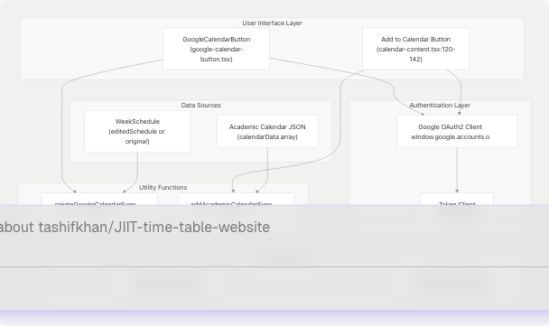
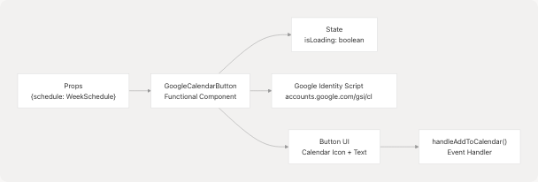
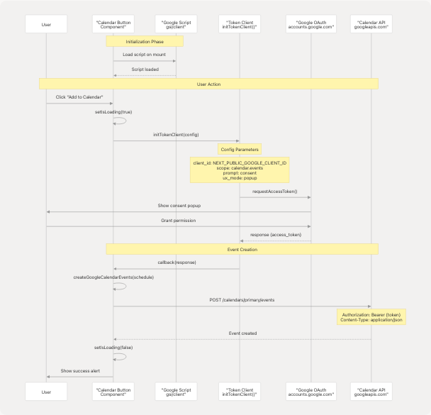
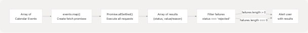
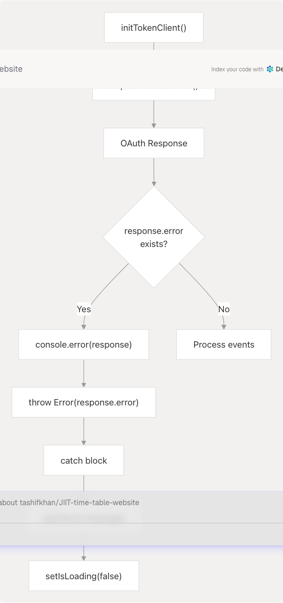
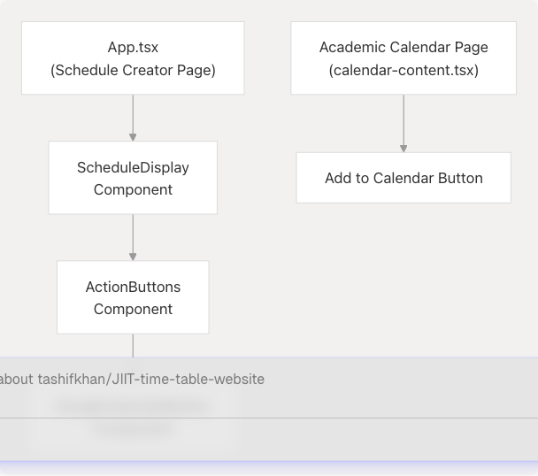

# Google Calendar Integration

## Purpose and Scope

This document details the Google Calendar integration functionality in the JIIT Time Table application. The system provides two distinct synchronization features: one for syncing personalized class schedules (timetables) and another for syncing academic calendar events (holidays, exams, etc.). Both use OAuth2 authentication and the Google Calendar API v3 to create recurring events with enhanced color coding.

For information about the schedule generation process that creates the timetable data being synced, see [Schedule Generation](4-schedule-generation-(core-feature)). For details about the academic calendar data format, see [Academic Calendar](6-academic-calendar). For general export functionality including PDF and PNG downloads, see [PDF & PNG Export](9.2-pdf-and-png-export).

---

## System Architecture Overview

The Google Calendar integration consists of two parallel implementations with separate UI components, utility functions, and event creation logic:



**Sources:** [website/components/google-calendar-button.tsx](https://github.com/tashifkhan/JIIT-time-table-website/blob/0ffdedf5/website/components/google-calendar-button.tsx) [website/app/academic-calendar/calendar-content.tsx1-142](https://github.com/tashifkhan/JIIT-time-table-website/blob/0ffdedf5/website/app/academic-calendar/calendar-content.tsx#L1-L142) [README.md10-49](https://github.com/tashifkhan/JIIT-time-table-website/blob/0ffdedf5/README.md#L10-L49)

---

## Component Architecture

### GoogleCalendarButton Component

The `GoogleCalendarButton` component provides timetable synchronization functionality:

| Property | Type | Purpose |
| --- | --- | --- |
| `schedule` | `WeekSchedule` | The timetable data structure containing daily class schedules |
| `isLoading` | `boolean` (state) | Tracks the loading state during OAuth and event creation |



**Sources:** [website/components/google-calendar-button.tsx14-110](https://github.com/tashifkhan/JIIT-time-table-website/blob/0ffdedf5/website/components/google-calendar-button.tsx#L14-L110)

### Academic Calendar Button

The academic calendar integration is embedded within the `CalendarContent` component:

| State Variable | Type | Purpose |
| --- | --- | --- |
| `isLoading` | `boolean` | Tracks sync operation status |
| `calendarData` | `any[]` | Array of academic events from JSON |
| `selectedYear` | `string` | Currently selected academic year |

**Sources:** [website/app/academic-calendar/calendar-content.tsx14-142](https://github.com/tashifkhan/JIIT-time-table-website/blob/0ffdedf5/website/app/academic-calendar/calendar-content.tsx#L14-L142)

---

## OAuth2 Authentication Flow

Both integrations use the same OAuth2 flow with Google Identity Services:



**Sources:** [website/components/google-calendar-button.tsx35-91](https://github.com/tashifkhan/JIIT-time-table-website/blob/0ffdedf5/website/components/google-calendar-button.tsx#L35-L91) [website/app/academic-calendar/calendar-content.tsx120-142](https://github.com/tashifkhan/JIIT-time-table-website/blob/0ffdedf5/website/app/academic-calendar/calendar-content.tsx#L120-L142)

### Environment Configuration

The OAuth client ID is configured via environment variable:

```
const CLIENT_ID = process.env.NEXT_PUBLIC_GOOGLE_CLIENT_ID;
```

**File Reference:** [website/components/google-calendar-button.tsx14](https://github.com/tashifkhan/JIIT-time-table-website/blob/0ffdedf5/website/components/google-calendar-button.tsx#L14-L14)

### OAuth Scope and Parameters

| Parameter | Value | Purpose |
| --- | --- | --- |
| `client_id` | `NEXT_PUBLIC_GOOGLE_CLIENT_ID` | OAuth2 client identifier |
| `scope` | `https://www.googleapis.com/auth/calendar.events` | Permission to create calendar events |
| `prompt` | `"consent"` | Always show consent screen |
| `ux_mode` | `"popup"` | Use popup window for OAuth |
| `hosted_domain` | `"gmail.com"` | Restrict to Gmail accounts |
| `state` | `window.location.origin` | CSRF protection token |

**Sources:** [website/components/google-calendar-button.tsx38-44](https://github.com/tashifkhan/JIIT-time-table-website/blob/0ffdedf5/website/components/google-calendar-button.tsx#L38-L44)

---

## Timetable Calendar Integration

### Event Creation Pipeline


**Sources:** [website/components/google-calendar-button.tsx35-91](https://github.com/tashifkhan/JIIT-time-table-website/blob/0ffdedf5/website/components/google-calendar-button.tsx#L35-L91)

### WeekSchedule to Calendar Event Transformation

The `createGoogleCalendarEvents` function (not shown in provided files but referenced) transforms the `WeekSchedule` data structure into Google Calendar API event objects:

**Input Format (WeekSchedule):**

```
{
  "Monday": {
    "09:00-10:00": {
      subject_name: "Data Structures",
      type: "L",
      location: "LT101"
    }
  }
  // ... other days
}
```

**Output Format (Calendar Event):**
Expected Google Calendar API v3 event structure includes:

* `summary` - Event title (subject\_name)
* `description` - Additional details (type, location)
* `start` - Start date/time
* `end` - End date/time
* `recurrence` - RRULE for weekly repetition
* `colorId` - Enhanced color coding based on event type

**Sources:** [website/components/google-calendar-button.tsx52](https://github.com/tashifkhan/JIIT-time-table-website/blob/0ffdedf5/website/components/google-calendar-button.tsx#L52-L52) [website/types/schedule.ts](https://github.com/tashifkhan/JIIT-time-table-website/blob/0ffdedf5/website/types/schedule.ts) (referenced), [README.md10-31](https://github.com/tashifkhan/JIIT-time-table-website/blob/0ffdedf5/README.md#L10-L31)

### Batch Request Processing

Events are submitted using `Promise.allSettled()` to handle partial failures:



**File Reference:** [website/components/google-calendar-button.tsx53-75](https://github.com/tashifkhan/JIIT-time-table-website/blob/0ffdedf5/website/components/google-calendar-button.tsx#L53-L75)

**Sources:** [website/components/google-calendar-button.tsx53-75](https://github.com/tashifkhan/JIIT-time-table-website/blob/0ffdedf5/website/components/google-calendar-button.tsx#L53-L75)

---

## Academic Calendar Integration

### Event Addition Flow

The academic calendar integration follows a similar pattern but operates on a different data structure:


**Sources:** [website/app/academic-calendar/calendar-content.tsx120-142](https://github.com/tashifkhan/JIIT-time-table-website/blob/0ffdedf5/website/app/academic-calendar/calendar-content.tsx#L120-L142)

### Academic Event Data Structure

Academic calendar events are loaded from JSON files:

```
// Data fetched from /api/academic-calendar/${selectedYear}
calendarData: Array<{
  summary: string,      // Event name (e.g., "Holiday - Diwali", "Mid Term Exam")
  start: {
    date: string        // Date in ISO format
  },
  end: {
    date: string        // Date in ISO format
  }
}>
```

**File Reference:** [website/app/academic-calendar/calendar-content.tsx60-67](https://github.com/tashifkhan/JIIT-time-table-website/blob/0ffdedf5/website/app/academic-calendar/calendar-content.tsx#L60-L67)

### Holiday Detection

Events are categorized based on their `summary` field:

```
const isHoliday = event.summary.startsWith("Holiday -");
```

This classification is used for:

1. UI filtering (holidays-only view)
2. Visual styling with different background colors
3. Enhanced color coding in Google Calendar

**File Reference:** [website/app/academic-calendar/calendar-content.tsx324-409](https://github.com/tashifkhan/JIIT-time-table-website/blob/0ffdedf5/website/app/academic-calendar/calendar-content.tsx#L324-L409)

**Sources:** [website/app/academic-calendar/calendar-content.tsx70-409](https://github.com/tashifkhan/JIIT-time-table-website/blob/0ffdedf5/website/app/academic-calendar/calendar-content.tsx#L70-L409)

---

## API Communication

### Google Calendar API Endpoint

Both integrations use the same API endpoint for event creation:

```
POST https://www.googleapis.com/calendar/v3/calendars/primary/events
```

### Request Headers

| Header | Value | Purpose |
| --- | --- | --- |
| `Authorization` | `Bearer ${response.access_token}` | OAuth2 bearer token |
| `Content-Type` | `application/json` | Request body format |

**File Reference:** [website/components/google-calendar-button.tsx59-61](https://github.com/tashifkhan/JIIT-time-table-website/blob/0ffdedf5/website/components/google-calendar-button.tsx#L59-L61)

### API Request Structure


**Sources:** [website/components/google-calendar-button.tsx55-66](https://github.com/tashifkhan/JIIT-time-table-website/blob/0ffdedf5/website/components/google-calendar-button.tsx#L55-L66)

---

## Enhanced Color Coding

The README mentions "enhanced color coding for events synced to Google Calendar" as a key feature. This is implemented through the `colorId` field in Google Calendar API events:

### Event Type Color Mapping

The timetable uses different types that should map to colors:

| Type Code | Full Name | Expected Color Usage |
| --- | --- | --- |
| `L` | Lecture | Distinct color for lectures |
| `T` | Tutorial | Distinct color for tutorials |
| `P` | Practical | Distinct color for practicals |
| `C` | Custom | Distinct color for custom events |

### Holiday vs Event Distinction

For academic calendar:

* **Holidays** - Events with `summary.startsWith("Holiday -")` receive special color coding
* **Regular Events** - Exams, deadlines, etc. receive different colors

**Sources:** [README.md10-31](https://github.com/tashifkhan/JIIT-time-table-website/blob/0ffdedf5/README.md#L10-L31) [website/app/academic-calendar/calendar-content.tsx324](https://github.com/tashifkhan/JIIT-time-table-website/blob/0ffdedf5/website/app/academic-calendar/calendar-content.tsx#L324-L324) [website/components/schedule-display.tsx26-31](https://github.com/tashifkhan/JIIT-time-table-website/blob/0ffdedf5/website/components/schedule-display.tsx#L26-L31)

---

## Error Handling

### OAuth Errors



**File Reference:** [website/components/google-calendar-button.tsx46-90](https://github.com/tashifkhan/JIIT-time-table-website/blob/0ffdedf5/website/components/google-calendar-button.tsx#L46-L90)

### API Request Failures

The system uses `Promise.allSettled()` to handle partial failures gracefully:

```
const results = await Promise.allSettled(
  events.map((event) => fetch(/* ... */))
);

const failures = results.filter((r) => r.status === "rejected");
if (failures.length > 0) {
  console.error("Some events failed to add:", failures);
  alert("Some events could not be added to your calendar");
} else {
  alert("Schedule successfully added to Google Calendar!");
}
```

**File Reference:** [website/components/google-calendar-button.tsx53-75](https://github.com/tashifkhan/JIIT-time-table-website/blob/0ffdedf5/website/components/google-calendar-button.tsx#L53-L75)

### User Feedback

Both integrations provide user feedback through alerts:

| Scenario | Message |
| --- | --- |
| OAuth failure | "Failed to connect to Google Calendar. Please try again." |
| Partial API failure | "Some events could not be added to your calendar" |
| Complete success | "Schedule successfully added to Google Calendar!" (timetable) "Events successfully added!" (academic) |
| Event creation error | Error message from exception |

**Sources:** [website/components/google-calendar-button.tsx72-89](https://github.com/tashifkhan/JIIT-time-table-website/blob/0ffdedf5/website/components/google-calendar-button.tsx#L72-L89) [website/app/academic-calendar/calendar-content.tsx127-138](https://github.com/tashifkhan/JIIT-time-table-website/blob/0ffdedf5/website/app/academic-calendar/calendar-content.tsx#L127-L138)

---

## Script Loading

Both components dynamically load the Google Identity Services script:

```
useEffect(() => {
  const script = document.createElement("script");
  script.src = "https://accounts.google.com/gsi/client";
  script.async = true;
  script.defer = true;
  document.body.appendChild(script);

  return () => {
    document.body.removeChild(script);
  };
}, []);
```

This ensures the `window.google.accounts.oauth2` API is available before user interaction.

**File Reference:** [website/components/google-calendar-button.tsx23-33](https://github.com/tashifkhan/JIIT-time-table-website/blob/0ffdedf5/website/components/google-calendar-button.tsx#L23-L33) [website/app/academic-calendar/calendar-content.tsx29-33](https://github.com/tashifkhan/JIIT-time-table-website/blob/0ffdedf5/website/app/academic-calendar/calendar-content.tsx#L29-L33)

**Sources:** [website/components/google-calendar-button.tsx23-33](https://github.com/tashifkhan/JIIT-time-table-website/blob/0ffdedf5/website/components/google-calendar-button.tsx#L23-L33) [website/app/academic-calendar/calendar-content.tsx27-52](https://github.com/tashifkhan/JIIT-time-table-website/blob/0ffdedf5/website/app/academic-calendar/calendar-content.tsx#L27-L52)

---

## Integration Points

### Context Usage

The timetable integration works with edited schedules from the `UserContext`:


**File Reference:** [website/components/action-buttons.tsx19-26](https://github.com/tashifkhan/JIIT-time-table-website/blob/0ffdedf5/website/components/action-buttons.tsx#L19-L26)

### Component Hierarchy



**Sources:** [website/components/action-buttons.tsx1-151](https://github.com/tashifkhan/JIIT-time-table-website/blob/0ffdedf5/website/components/action-buttons.tsx#L1-L151) [website/components/google-calendar-button.tsx](https://github.com/tashifkhan/JIIT-time-table-website/blob/0ffdedf5/website/components/google-calendar-button.tsx) [website/app/academic-calendar/calendar-content.tsx234-266](https://github.com/tashifkhan/JIIT-time-table-website/blob/0ffdedf5/website/app/academic-calendar/calendar-content.tsx#L234-L266)

---

## Non-Recurring Custom Events

The system explicitly notifies users that custom events will not be recurring:

```
<p className="text-xs text-gray-400 mt-2">
  Note: Custom events will not be recurring in Google Calendar
</p>
```

This distinction exists because:

1. Regular classes (`L`, `T`, `P` types) follow weekly schedules and use recurrence rules
2. Custom events added by users are one-time occurrences

**File Reference:** [website/components/action-buttons.tsx146-148](https://github.com/tashifkhan/JIIT-time-table-website/blob/0ffdedf5/website/components/action-buttons.tsx#L146-L148)

**Sources:** [website/components/action-buttons.tsx146-148](https://github.com/tashifkhan/JIIT-time-table-website/blob/0ffdedf5/website/components/action-buttons.tsx#L146-L148)

---

## Summary Table

| Feature | Timetable Integration | Academic Calendar Integration |
| --- | --- | --- |
| **Component** | `GoogleCalendarButton` | Button in `CalendarContent` |
| **Utility Function** | `createGoogleCalendarEvents()` (calendar.ts) | `addAcademicCalendarEvents()` (calendar-AC.ts) |
| **Data Source** | `WeekSchedule` object | JSON array from API |
| **Event Type** | Recurring weekly classes | Single-date events |
| **Enhanced Colors** | Based on class type (L/T/P/C) | Based on holiday vs. regular event |
| **User Context** | Yes (uses editedSchedule) | No (uses local state) |
| **Error Handling** | Partial failure support | Result object with success/error |

**Sources:** [website/components/google-calendar-button.tsx](https://github.com/tashifkhan/JIIT-time-table-website/blob/0ffdedf5/website/components/google-calendar-button.tsx) [website/app/academic-calendar/calendar-content.tsx120-142](https://github.com/tashifkhan/JIIT-time-table-website/blob/0ffdedf5/website/app/academic-calendar/calendar-content.tsx#L120-L142) [website/components/action-buttons.tsx145](https://github.com/tashifkhan/JIIT-time-table-website/blob/0ffdedf5/website/components/action-buttons.tsx#L145-L145)
