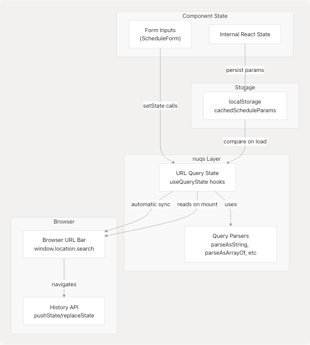
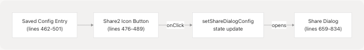
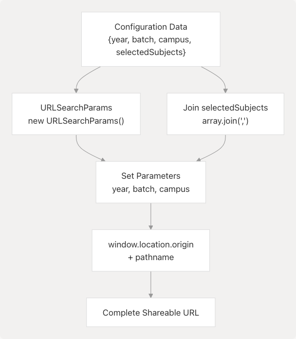
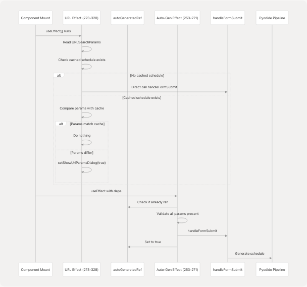
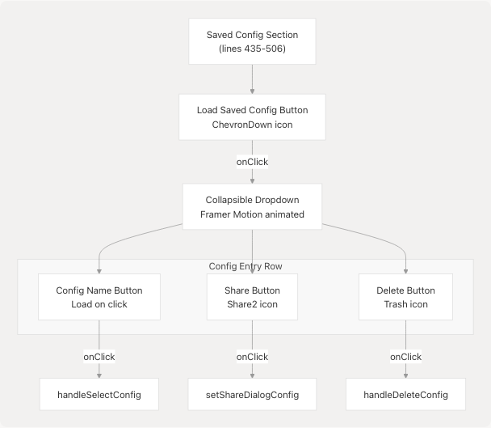

# Shareable URLs & Configuration Saving

> Source: https://deepwiki.com/tashifkhan/JIIT-time-table-website/9.3-shareable-urls-and-configuration-saving

# Shareable URLs & Configuration Sharing

Relevant source files

* [README.md](https://github.com/tashifkhan/JIIT-time-table-website/blob/0ffdedf5/README.md)
* [website/app/academic-calendar/calendar-content.tsx](https://github.com/tashifkhan/JIIT-time-table-website/blob/0ffdedf5/website/app/academic-calendar/calendar-content.tsx)
* [website/components/action-buttons.tsx](https://github.com/tashifkhan/JIIT-time-table-website/blob/0ffdedf5/website/components/action-buttons.tsx)
* [website/components/background.tsx](https://github.com/tashifkhan/JIIT-time-table-website/blob/0ffdedf5/website/components/background.tsx)
* [website/components/edit-event-dialog.tsx](https://github.com/tashifkhan/JIIT-time-table-website/blob/0ffdedf5/website/components/edit-event-dialog.tsx)
* [website/components/google-calendar-button.tsx](https://github.com/tashifkhan/JIIT-time-table-website/blob/0ffdedf5/website/components/google-calendar-button.tsx)
* [website/components/schedule-display.tsx](https://github.com/tashifkhan/JIIT-time-table-website/blob/0ffdedf5/website/components/schedule-display.tsx)
* [website/components/schedule-form.tsx](https://github.com/tashifkhan/JIIT-time-table-website/blob/0ffdedf5/website/components/schedule-form.tsx)
* [website/components/timeline-landing.tsx](https://github.com/tashifkhan/JIIT-time-table-website/blob/0ffdedf5/website/components/timeline-landing.tsx)

This page documents the system's mechanisms for encoding timetable configurations into shareable URLs and managing user-saved configuration presets. This enables users to distribute their schedule setups and quickly switch between multiple configuration profiles.

For information about how schedules are persisted locally between sessions, see State Management ([#3.4](/tashifkhan/JIIT-time-table-website/3.4-data-model-and-types)). For details on how the form handles user input, see Schedule Form & User Input ([#4.1](/tashifkhan/JIIT-time-table-website/4.1-schedule-form-and-user-input)).

## Overview

The application provides two primary methods for configuration sharing and reuse:

1. **URL-based sharing**: Encodes schedule parameters (year, batch, campus, selected subjects) directly into the URL query string, enabling instant sharing via link
2. **Named saved configurations**: Stores complete configuration sets in localStorage with user-defined names for quick switching between multiple setups

Both mechanisms integrate with the schedule generation pipeline and include conflict resolution when URL parameters differ from existing cached schedules.

**Sources**: [src/App.tsx1-841](https://github.com/tashifkhan/JIIT-time-table-website/blob/0ffdedf5/src/App.tsx#L1-L841)

## URL Parameter Structure

The system uses the `nuqs` library to synchronize application state with URL query parameters, providing automatic parsing and type safety.

### Parameter Schema

| Parameter | Type | Parser | Description |
| --- | --- | --- | --- |
| `year` | string | `parseAsString` | Academic year (1-4) |
| `batch` | string | `parseAsString` | Batch identifier (e.g., "E1", "E2") |
| `campus` | string | `parseAsString` | Campus code ("62", "128", "BCA") |
| `electiveCount` | number | `parseAsInteger` | Number of elective subjects selected |
| `selectedSubjects` | string[] | `parseAsArrayOf(parseAsString)` | Array of subject codes |
| `isGenerating` | boolean | `parseAsBoolean` | Generation state indicator |

**Query State Hooks Declaration**:

```
```
const [_year, setYear] = useQueryState("year", parseAsString.withDefault(""));
const [_batch, setBatch] = useQueryState("batch", parseAsString.withDefault(""));
const [_campus, setCampus] = useQueryState("campus", parseAsString.withDefault(""));
const [_electiveCount, setElectiveCount] = useQueryState("electiveCount", parseAsInteger.withDefault(0));
const [_selectedSubjects, setSelectedSubjects] = useQueryState("selectedSubjects", parseAsArrayOf(parseAsString).withDefault([]));
```
```

**Sources**: [src/App.tsx231-247](https://github.com/tashifkhan/JIIT-time-table-website/blob/0ffdedf5/src/App.tsx#L231-L247)

### Example URL Structure

```
https://example.com/?year=2&batch=E7&campus=62&selectedSubjects=CSE101,CSE102,CSE103
```

The `selectedSubjects` parameter is serialized as a comma-separated list when multiple subjects are selected.

**Sources**: [src/App.tsx700-712](https://github.com/tashifkhan/JIIT-time-table-website/blob/0ffdedf5/src/App.tsx#L700-L712)

## URL State Management Architecture


```

**Sources**: [src/App.tsx14-20](https://github.com/tashifkhan/JIIT-time-table-website/blob/0ffdedf5/src/App.tsx#L14-L20) [src/App.tsx231-247](https://github.com/tashifkhan/JIIT-time-table-website/blob/0ffdedf5/src/App.tsx#L231-L247)

## Generating Shareable URLs

Users can generate shareable URLs through two entry points:

### 1. Share Button on Saved Configurations

Each saved configuration displays a share icon button that opens the share dialog with a pre-populated URL.

```

```

**Implementation**:

The share button handler extracts configuration data and opens the dialog:

```
```
onClick={(e) => {
    e.stopPropagation();
    setShareDialogConfig({
        name,
        config: savedConfigs[name],
    });
    setShowShareDialog(true);
}}
```
```

**Sources**: [src/App.tsx476-489](https://github.com/tashifkhan/JIIT-time-table-website/blob/0ffdedf5/src/App.tsx#L476-L489)

### 2. Share Dialog Component

The share dialog (`Dialog` component from Radix UI) constructs the shareable URL and provides copy-to-clipboard functionality.

#### URL Construction Logic

```

```

**URL Generation Code**:

```
```
const { year, batch, campus, selectedSubjects } = shareDialogConfig.config;
const params = new URLSearchParams({
    year,
    batch,
    campus,
    selectedSubjects: (selectedSubjects || []).join(","),
});
const url = `${window.location.origin}${window.location.pathname}?${params.toString()}`;
```
```

**Sources**: [src/App.tsx700-712](https://github.com/tashifkhan/JIIT-time-table-website/blob/0ffdedf5/src/App.tsx#L700-L712) [src/App.tsx786-798](https://github.com/tashifkhan/JIIT-time-table-website/blob/0ffdedf5/src/App.tsx#L786-L798)

### Copy to Clipboard Implementation

The dialog provides two mechanisms for copying the URL:

1. **Modern Clipboard API**: Primary method using `navigator.clipboard.writeText()`
2. **Fallback Method**: Uses `document.execCommand('copy')` for older browsers

```
```
try {
    await navigator.clipboard.writeText(url);
} catch (err) {
    // Fallback for older browsers
    const input = document.querySelector("input[type='text'][readonly]") as HTMLInputElement;
    if (input) {
        input.select();
        document.execCommand("copy");
    }
}
```
```

**Sources**: [src/App.tsx731-743](https://github.com/tashifkhan/JIIT-time-table-website/blob/0ffdedf5/src/App.tsx#L731-L743) [src/App.tsx799-812](https://github.com/tashifkhan/JIIT-time-table-website/blob/0ffdedf5/src/App.tsx#L799-L812)

## Loading Configurations from URL Parameters

The application automatically detects URL parameters on mount and reconciles them with any existing cached schedule.

### Auto-Generation Flow

```

```

**Sources**: [src/App.tsx253-271](https://github.com/tashifkhan/JIIT-time-table-website/blob/0ffdedf5/src/App.tsx#L253-L271) [src/App.tsx273-328](https://github.com/tashifkhan/JIIT-time-table-website/blob/0ffdedf5/src/App.tsx#L273-L328)

### URL Parameter Reading Logic

The system reads URL parameters directly from `window.location.search` rather than relying on React state to avoid race conditions:

```
```
const urlParams = new URLSearchParams(window.location.search);
const year = urlParams.get("year") || "";
const batch = urlParams.get("batch") || "";
const campus = urlParams.get("campus") || "";
const selectedSubjectsRaw = urlParams.getAll("selectedSubjects") || [];
const selectedSubjects = selectedSubjectsRaw
    .flatMap((s) => s.split(","))
    .map((s) => s.trim())
    .filter(Boolean);
```
```

**Sources**: [src/App.tsx279-288](https://github.com/tashifkhan/JIIT-time-table-website/blob/0ffdedf5/src/App.tsx#L279-L288)

## Conflict Resolution Flow

When URL parameters are detected but a cached schedule already exists, the system presents the `UrlParamsDialog` component to resolve the conflict.

### Decision Tree

```

```

**Sources**: [src/App.tsx273-328](https://github.com/tashifkhan/JIIT-time-table-website/blob/0ffdedf5/src/App.tsx#L273-L328)

### Parameter Comparison Logic

```
```
let isSame = false;
try {
    const cachedObj = cachedParams ? JSON.parse(cachedParams) : {};
    isSame =
        cachedObj.year === year &&
        cachedObj.batch === batch &&
        cachedObj.campus === campus &&
        Array.isArray(cachedObj.selectedSubjects) &&
        Array.isArray(selectedSubjects) &&
        cachedObj.selectedSubjects.length === selectedSubjects.length &&
        cachedObj.selectedSubjects.every((s: string) =>
            selectedSubjects.includes(s)
        );
} catch {}
```
```

**Sources**: [src/App.tsx302-315](https://github.com/tashifkhan/JIIT-time-table-website/blob/0ffdedf5/src/App.tsx#L302-L315)

### UrlParamsDialog Component

The dialog component presents three resolution options:

| Option | Action | Handler |
| --- | --- | --- |
| **Generate New Schedule** | Replaces cached schedule with URL parameters | `onOverride` → `handleUrlParamsOverride` |
| **Use as Form Prefill** | Populates form fields without auto-generating | `onPrefill` → `handleUrlParamsPrefill` |
| **View Existing Schedule** | Dismisses dialog, keeps cached schedule | `onViewExisting` → `handleUrlParamsViewExisting` |

```

```

**Sources**: [src/components/url-params-dialog.tsx1-161](https://github.com/tashifkhan/JIIT-time-table-website/blob/0ffdedf5/src/components/url-params-dialog.tsx#L1-L161)

#### Handler Implementations

**Override Handler**:

```
```
const handleUrlParamsOverride = async () => {
    if (!urlParamsData) return;
    setShowUrlParamsDialog(false);
    await handleFormSubmit({
        year: urlParamsData.year,
        batch: urlParamsData.batch,
        electives: urlParamsData.selectedSubjects,
        campus: urlParamsData.campus,
    });
};
```
```

**Prefill Handler**:

```
```
const handleUrlParamsPrefill = () => {
    if (!urlParamsData) return;
    setYear(urlParamsData.year);
    setBatch(urlParamsData.batch);
    setCampus(urlParamsData.campus);
    setSelectedSubjects(urlParamsData.selectedSubjects);
    setIsFormOpen(true);
    setShowUrlParamsDialog(false);
};
```
```

**Sources**: [src/App.tsx330-359](https://github.com/tashifkhan/JIIT-time-table-website/blob/0ffdedf5/src/App.tsx#L330-L359)

## Saved Configurations

The system maintains a collection of named configuration presets persisted in localStorage under the key `"classConfigs"`.

### Data Structure

```

```

**Sources**: [src/App.tsx64-82](https://github.com/tashifkhan/JIIT-time-table-website/blob/0ffdedf5/src/App.tsx#L64-L82)

### State Management

**Initialization from localStorage**:

```
```
const [savedConfigs, setSavedConfigs] = React.useState<{[key: string]: any}>(() => {
    const configs = localStorage.getItem("classConfigs");
    return configs ? JSON.parse(configs) : {};
});
```
```

**Persistence to localStorage**:

```
```
React.useEffect(() => {
    localStorage.setItem("classConfigs", JSON.stringify(savedConfigs));
}, [savedConfigs]);
```
```

**Sources**: [src/App.tsx64-82](https://github.com/tashifkhan/JIIT-time-table-website/blob/0ffdedf5/src/App.tsx#L64-L82)

### Configuration Operations

#### Saving a Configuration

The `handleSaveConfig` function is passed to `ScheduleForm` and called when users name and save their current configuration:

```
```
const handleSaveConfig = (name: string, configData: any) => {
    setSavedConfigs((prev) => ({ ...prev, [name]: configData }));
};
```
```

**Sources**: [src/App.tsx388-390](https://github.com/tashifkhan/JIIT-time-table-website/blob/0ffdedf5/src/App.tsx#L388-L390)

#### Loading a Configuration

When a user selects a saved configuration, the system:

1. Clears any edited schedule data
2. Updates URL state with config parameters
3. Closes the form
4. Triggers automatic schedule generation

```
```
const handleSelectConfig = async (name: string) => {
    const config = savedConfigs[name];
    if (!config) return;

    // Clear any existing edited schedule to ensure fresh display
    setEditedSchedule(null);

    // Set the form state first
    setYear(config.year);
    setBatch(config.batch);
    setElectiveCount(config.electiveCount || 0);
    setSelectedSubjects(config.selectedSubjects || []);
    setCampus(config.campus);
    setSelectedConfig(name);

    // Close the form after loading config
    setIsFormOpen(false);

    // Generate schedule automatically with this config
    await handleFormSubmit({
        year: config.year,
        batch: config.batch,
        electives: config.selectedSubjects || [],
        campus: config.campus,
    });
};
```
```

**Sources**: [src/App.tsx361-386](https://github.com/tashifkhan/JIIT-time-table-website/blob/0ffdedf5/src/App.tsx#L361-L386)

#### Deleting a Configuration

```
```
const handleDeleteConfig = (name: string) => {
    setSavedConfigs((prev) => {
        const newConfigs = { ...prev };
        delete newConfigs[name];
        return newConfigs;
    });
    if (selectedConfig === name) setSelectedConfig("");
};
```
```

**Sources**: [src/App.tsx394-401](https://github.com/tashifkhan/JIIT-time-table-website/blob/0ffdedf5/src/App.tsx#L394-L401)

### UI Component Structure

The saved configurations UI appears above the schedule form when configurations exist:

```

```

**Sources**: [src/App.tsx435-506](https://github.com/tashifkhan/JIIT-time-table-website/blob/0ffdedf5/src/App.tsx#L435-L506)

**Collapsible Animation**:

```
```
<motion.div
    initial={false}
    animate={{
        height: isConfigOpen ? "auto" : 0,
        opacity: isConfigOpen ? 1 : 0,
    }}
    style={{ overflow: "hidden" }}
    transition={{ duration: 0.4, ease: "easeInOut" }}
>
```
```

**Sources**: [src/App.tsx451-458](https://github.com/tashifkhan/JIIT-time-table-website/blob/0ffdedf5/src/App.tsx#L451-L458)

## Share Dialog Implementation

The share dialog is a Radix UI `Dialog` component that provides a polished interface for copying shareable URLs.

### Component Hierarchy

```

```

**Sources**: [src/App.tsx659-834](https://github.com/tashifkhan/JIIT-time-table-website/blob/0ffdedf5/src/App.tsx#L659-L834)

### Dialog Content Structure

**Header Section**:

* SVG share icon in colored circle
* `DialogTitle`: "Share Configuration"
* `DialogDescription`: Config name display

**URL Input Section**:

* Read-only text input displaying full shareable URL
* Inline copy button with clipboard icon
* URL is auto-selected on focus for manual copying

**Action Buttons**:

* **Cancel**: Closes dialog without action
* **Copy Link**: Copies URL and closes dialog

**Sources**: [src/App.tsx664-830](https://github.com/tashifkhan/JIIT-time-table-website/blob/0ffdedf5/src/App.tsx#L664-L830)

### Responsive Design

The dialog implements mobile-responsive styling:

* `max-w-md`: Maximum width constraint
* `max-h-[90vh]`: Prevents overflow on small screens
* `overflow-y-auto`: Scrollable content when needed
* Backdrop blur effect: `backdrop-blur-xl`

**Sources**: [src/App.tsx662](https://github.com/tashifkhan/JIIT-time-table-website/blob/0ffdedf5/src/App.tsx#L662-L662)

## Integration with Schedule Generation

URL parameters trigger the standard schedule generation pipeline through `handleFormSubmit`:

```


**Sources**: [src/App.tsx154-229](https://github.com/tashifkhan/JIIT-time-table-website/blob/0ffdedf5/src/App.tsx#L154-L229)

### Parameter Caching

After successful schedule generation, parameters are cached for comparison with future URL loads:

```
```
localStorage.setItem(
    "cachedScheduleParams",
    JSON.stringify({
        year,
        batch,
        campus,
        selectedSubjects: electives,
    })
);
```
```

**Sources**: [src/App.tsx214-222](https://github.com/tashifkhan/JIIT-time-table-website/blob/0ffdedf5/src/App.tsx#L214-L222)

## Error Handling and Edge Cases

### Missing URL Parameters

The auto-generation effect validates all required parameters before triggering generation:

```
```
if (
    !autoGeneratedRef.current &&
    _year &&
    _batch &&
    _campus &&
    _selectedSubjects &&
    _selectedSubjects.length > 0
) {
    autoGeneratedRef.current = true;
    handleFormSubmit({...});
}
```
```

**Sources**: [src/App.tsx255-270](https://github.com/tashifkhan/JIIT-time-table-website/blob/0ffdedf5/src/App.tsx#L255-L270)

### Subject Code Deduplication

The `UrlParamsDialog` handles comma-separated subject lists and deduplicates codes:

```
```
const allCodes = subjects
    .flatMap((s) => s.split(","))
    .map((s) => s.trim())
    .filter(Boolean);
const uniqueCodes = Array.from(new Set(allCodes));
```
```

**Sources**: [src/components/url-params-dialog.tsx39-43](https://github.com/tashifkhan/JIIT-time-table-website/blob/0ffdedf5/src/components/url-params-dialog.tsx#L39-L43)

### Empty Configuration Objects

Guards prevent errors when accessing potentially undefined configuration data:

```
```
const subjectList =
    typeof mapping === "object" && mapping !== null && mapping[year]?.subjects
        ? mapping[year].subjects
        : [];
```
```

**Sources**: [src/components/url-params-dialog.tsx46-49](https://github.com/tashifkhan/JIIT-time-table-website/blob/0ffdedf5/src/components/url-params-dialog.tsx#L46-L49)

## Summary

The shareable URL and configuration sharing system provides:

1. **Zero-friction sharing** via URL parameters encoded with `nuqs`
2. **Named configuration presets** persisted in localStorage
3. **Intelligent conflict resolution** when URL and cache differ
4. **Polished share UI** with clipboard integration
5. **Automatic schedule generation** from URL parameters
6. **Cross-session persistence** of configuration data

This architecture enables users to share schedules with classmates, maintain multiple configuration profiles for different scenarios, and quickly switch between setups without manual re-entry of parameters.