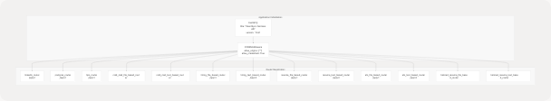
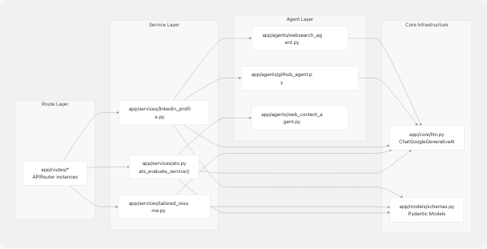
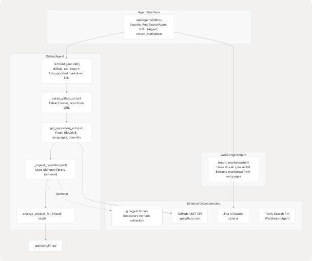
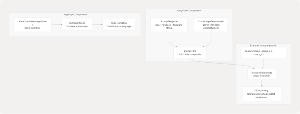
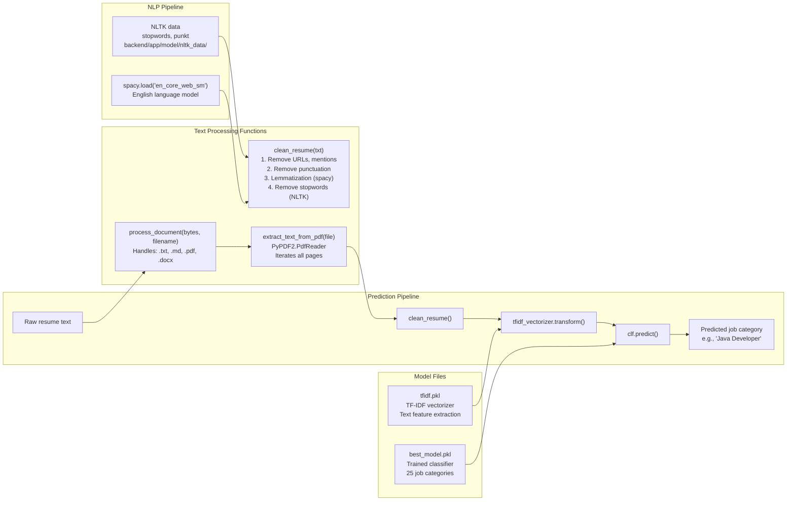

# Backend Architecture

## Purpose and Scope

This document describes the FastAPI backend architecture of TalentSync, including the application structure, API versioning strategy, service organization, AI/ML integration patterns, and dependency management. The backend follows a service-oriented architecture with clear separation between route handlers, business logic services, and external agent integrations.

For information about specific AI services (Resume Analysis, ATS Evaluation, etc.), see [Backend Services](3-backend-services). For LLM integration patterns and prompt engineering, see [LLM Integration & Prompt Engineering](3.8-llm-integration-and-prompt-engineering). For deployment configuration, see [Deployment & Infrastructure](6-deployment-and-infrastructure).

---

## High-Level Application Structure

The TalentSync backend uses two application entry points representing different architectural iterations:

1. **Monolithic Entry Point** - [backend/server.py](https://github.com/harleenkaur28/AI-Resume-Parser/blob/b2bbd83d/backend/server.py) containing FastAPI app initialization, model loading, and core resume analysis logic in a single file
2. **Modular Entry Point** - [backend/app/main.py](https://github.com/harleenkaur28/AI-Resume-Parser/blob/b2bbd83d/backend/app/main.py) with router-based architecture and clean service separation

The modular structure (app/main.py) is the current production architecture and follows these organizational principles:

```
backend/
├── server.py                    # Legacy monolithic entry point
├── app/
│   ├── main.py                 # Production entry point (v1.5.8)
│   ├── routes/                 # API route handlers
│   ├── services/               # Business logic layer
│   ├── agents/                 # External data gathering
│   ├── models/                 # Pydantic schemas
│   └── core/                   # Shared infrastructure
├── pyproject.toml              # Dependency definitions
└── uv.lock                     # Locked dependencies
```

**Sources:** [backend/server.py1-70](https://github.com/harleenkaur28/AI-Resume-Parser/blob/b2bbd83d/backend/server.py#L1-L70) [backend/app/main.py1-149](https://github.com/harleenkaur28/AI-Resume-Parser/blob/b2bbd83d/backend/app/main.py#L1-L149)

---

## FastAPI Application Initialization

### Application Entry Point

The production FastAPI application is initialized in `app/main.py`:



**Diagram: FastAPI Application and Router Registration Structure**

The application uses `app.include_router()` to register multiple routers, each handling a specific domain or API version. All routes accept wildcard CORS origins for development flexibility.

**Sources:** [backend/app/main.py4-148](https://github.com/harleenkaur28/AI-Resume-Parser/blob/b2bbd83d/backend/app/main.py#L4-L148)

---

## API Versioning Strategy

The backend implements a dual-versioning strategy where services are exposed through both v1 (file-based) and v2 (text-based) API endpoints:

| Feature | v1 API Path | v2 API Path | Input Method |
| --- | --- | --- | --- |
| Resume Analysis | `/api/v1/analyze_resume` | `/api/v2/analyze_resume` | v1: File upload, v2: Raw text |
| Cold Mail Generator | `/api/v1/generate_cold_mail` | `/api/v2/generate_cold_mail` | v1: File + form, v2: Text + JSON |
| Hiring Assistant | `/api/v1/hiring_assistant` | `/api/v2/hiring_assistant` | v1: File + questions, v2: Text + JSON |
| ATS Evaluation | `/api/v1/ats_evaluation` | `/api/v2/ats_evaluation` | v1: File + JD, v2: Text + JD |
| Tailored Resume | `/api/v1/tailored_resume` | `/api/v2/tailored_resume` | v1: File + job, v2: Text + job |

**Key Architectural Decisions:**

* **v1 APIs** accept `multipart/form-data` with file uploads using FastAPI's `UploadFile`
* **v2 APIs** accept `application/json` with resume text directly in request body
* Both versions share the same service layer (`app/services/`) but have separate route handlers
* v2 APIs reduce overhead by eliminating file parsing step for clients that already have text

**Sources:** [backend/app/main.py22-148](https://github.com/harleenkaur28/AI-Resume-Parser/blob/b2bbd83d/backend/app/main.py#L22-L148)

---

## Service Layer Architecture

The service layer implements business logic separate from HTTP concerns. Each service module encapsulates a specific AI-powered feature:



**Diagram: Service Layer Dependencies and Data Flow**

**Service Responsibilities:**

* **ats.py** - Evaluates resume-to-JD compatibility, fetches JD content via web agent if URL provided, invokes LangGraph-based evaluator
* **tailored\_resume.py** - Generates job-specific resume analysis by calling resume generator with web research context
* **linkedin\_profile.py** - Creates comprehensive LinkedIn presence content including profile sections and suggested posts

Each service follows this pattern:

1. Validate inputs using Pydantic models
2. Gather external data via agents if needed
3. Invoke LLM with structured prompts
4. Parse and validate LLM output
5. Return structured response models

**Sources:** [backend/app/services/ats.py1-214](https://github.com/harleenkaur28/AI-Resume-Parser/blob/b2bbd83d/backend/app/services/ats.py#L1-L214) [backend/app/services/tailored\_resume.py1-90](https://github.com/harleenkaur28/AI-Resume-Parser/blob/b2bbd83d/backend/app/services/tailored_resume.py#L1-L90) [backend/app/services/linkedin\_profile.py1-408](https://github.com/harleenkaur28/AI-Resume-Parser/blob/b2bbd83d/backend/app/services/linkedin_profile.py#L1-L408)

---

## Agent System

The agent system provides specialized capabilities for external data gathering and content extraction:



**Diagram: Agent System Architecture and External Service Integration**

### GitHubAgent Implementation Details

The `GitHubAgent` class ([backend/app/agents/github\_agent.py49-409](https://github.com/harleenkaur28/AI-Resume-Parser/blob/b2bbd83d/backend/app/agents/github_agent.py#L49-L409)) provides GitHub repository analysis:

| Method | Purpose | Returns |
| --- | --- | --- |
| `parse_github_url(url)` | Extracts owner/repo from various GitHub URL formats | `Dict[str, str]` with owner, repo |
| `get_repository_info(url)` | Fetches metadata via GitHub API (stars, forks, languages, README) | `Dict[str, Any]` |
| `_ingest_repository(url)` | Deep code analysis via gitingest (optional dependency) | `Optional[IngestedContent]` |
| `analyze_project_for_linkedin(url)` | Generates LinkedIn-friendly project insights using LLM | `Dict[str, Any]` |

**Optional Deep Ingestion:**

The agent attempts to use the `gitingest` library for comprehensive repository analysis. If unavailable, it gracefully falls back to basic GitHub API data:

```
# Conditional import pattern
try:
    from gitingest import ingest_async as _gitingest_async
    _HAS_GITINGEST = True
    _HAS_GITINGEST_ASYNC = True
except ImportError:
    try:
        from gitingest import ingest as _gitingest_sync
        _HAS_GITINGEST = True
        _HAS_GITINGEST_ASYNC = False
    except ImportError:
        _HAS_GITINGEST = False
```

When available, `_ingest_repository()` returns structured `IngestedContent` with tree structure, summary, and full content (truncated to 5MB for safety).

**Sources:** [backend/app/agents/github\_agent.py1-418](https://github.com/harleenkaur28/AI-Resume-Parser/blob/b2bbd83d/backend/app/agents/github_agent.py#L1-L418) [backend/app/agents/\_\_init\_\_.py1-14](https://github.com/harleenkaur28/AI-Resume-Parser/blob/b2bbd83d/backend/app/agents/__init__.py#L1-L14)

---

## LLM Integration Infrastructure

### Core LLM Configuration

The LLM is initialized in the legacy `server.py` as a global singleton:

```
llm = None
try:
    google_api_key = os.getenv("GOOGLE_API_KEY")
    if not google_api_key:
        print("Warning: GOOGLE_API_KEY not found in .env...")
    else:
        llm = ChatGoogleGenerativeAI(
            model="gemini-2.0-flash",
            google_api_key=google_api_key,
            temperature=0.1,
        )
except Exception as e:
    print(f"Error initializing Google Generative AI: {e}...")
```

**Key Configuration:**

* **Model:** `gemini-2.0-flash` (Google's Gemini 2.0 Flash model)
* **Temperature:** `0.1` (low temperature for consistent, deterministic outputs)
* **Provider:** LangChain's `ChatGoogleGenerativeAI` wrapper

The modular architecture likely mirrors this pattern in `app/core/llm.py` (not shown in provided files).

### LangChain Integration

The backend uses LangChain for prompt templating and LLM orchestration:



**Diagram: LangChain and LangGraph Integration Patterns**

**Prompt Template Examples:**

The codebase defines multiple prompt templates for different purposes:

1. **comprehensive\_analysis\_prompt\_v2** ([backend/server.py373-453](https://github.com/harleenkaur28/AI-Resume-Parser/blob/b2bbd83d/backend/server.py#L373-L453)) - Extracts structured resume data into `ComprehensiveAnalysisData` model
2. **tips\_generator\_prompt** ([backend/server.py465-500](https://github.com/harleenkaur28/AI-Resume-Parser/blob/b2bbd83d/backend/server.py#L465-L500)) - Generates resume and interview tips
3. **format\_analyse\_prompt** ([backend/server.py503-601](https://github.com/harleenkaur28/AI-Resume-Parser/blob/b2bbd83d/backend/server.py#L503-L601)) - Two-phase cleaning and analysis

Each template follows this pattern:

```
prompt_template_str = """
You are an expert resume analyzer...

Input:
- Raw Resume Text:
```text
{extracted_resume_text}
```

Instructions:

1. Extract name, email, contact...
2. Infer predicted\_field...
3. Build skills\_analysis...

Output:
Return ONLY a single JSON object...
"""

prompt = PromptTemplate(
input\_variables=["extracted\_resume\_text", "basic\_info\_json"],
template=prompt\_template\_str,
)

```
**Sources:** <FileRef file-url="https://github.com/harleenkaur28/AI-Resume-Parser/blob/b2bbd83d/backend/server.py#L68-L86" min=68 max=86 file-path="backend/server.py">Hii</FileRef> <FileRef file-url="https://github.com/harleenkaur28/AI-Resume-Parser/blob/b2bbd83d/backend/server.py#L373-L601" min=373 max=601 file-path="backend/server.py">Hii</FileRef> <FileRef file-url="https://github.com/harleenkaur28/AI-Resume-Parser/blob/b2bbd83d/backend/experiment/exp.ipynb#L1-L177" min=1 max=177 file-path="backend/experiment/exp.ipynb">Hii</FileRef>

---

## ML Models and NLP Pipeline

### Traditional ML Components

The backend loads pre-trained scikit-learn models for resume classification:



**Diagram: ML Classification Pipeline and NLP Processing Flow**

### Model Loading and Initialization

Models are loaded using pickle at application startup:

```
clf = pickle.load(
    open(
        os.path.join(
            os.path.dirname(__file__),
            "app",
            "model",
            "best_model.pkl",
        ),
        "rb",
    )
)
tfidf_vectorizer = pickle.load(
    open(
        os.path.join(
            os.path.dirname(__file__),
            "app",
            "model",
            "tfidf.pkl",
        ),
        "rb",
    )
)
```

**NLP Initialization:**

```
nlp = spacy.load("en_core_web_sm")  # English language model
nltk.download("punkt", download_dir=NLTK_DATA_PATH)
nltk.download("stopwords", download_dir=NLTK_DATA_PATH)
stop_words = set(stopwords.words("english"))
```

### Text Extraction and Cleaning

The `clean_resume()` function ([backend/server.py738-749](https://github.com/harleenkaur28/AI-Resume-Parser/blob/b2bbd83d/backend/server.py#L738-L749)) implements a multi-stage cleaning pipeline:

1. **URL Removal:** `re.sub(r"https\\S+", "", txt)`
2. **Mention/Hashtag Removal:** `re.sub(r"@\\S+|#\\S+", "", cleantxt)`
3. **Punctuation Removal:** `re.sub(r"[^\w\s]", "", cleantxt)`
4. **Lemmatization:** Uses spaCy's `token.lemma_` to convert words to base form
5. **Stopword Removal:** Filters common English words using NLTK stopwords

The `process_document()` function ([backend/server.py764-792](https://github.com/harleenkaur28/AI-Resume-Parser/blob/b2bbd83d/backend/server.py#L764-L792)) handles multiple file formats:

* **.txt, .md:** Direct UTF-8 decoding
* **.pdf:** PyPDF2's `PdfReader` with page iteration
* **.docx:** python-docx's `Document` with paragraph extraction

**Sources:** [backend/server.py702-792](https://github.com/harleenkaur28/AI-Resume-Parser/blob/b2bbd83d/backend/server.py#L702-L792) [backend/server.py714-735](https://github.com/harleenkaur28/AI-Resume-Parser/blob/b2bbd83d/backend/server.py#L714-L735)

---

## Data Models and Validation

### Pydantic Schema Organization

The `app/models/schemas.py` module defines comprehensive data models using Pydantic:


**Diagram: Pydantic Model Hierarchy and Relationships**

### Key Model Categories

| Category | Models | Purpose |
| --- | --- | --- |
| **Resume Data** | `WorkExperienceEntry`, `ProjectEntry`, `SkillProficiency`, `EducationEntry`, `LanguageEntry` | Raw extracted data from resumes |
| **UI-Optimized** | `UIDetailedWorkExperienceEntry`, `UIProjectEntry`, `UICertificationEntry`, `UIAchievementEntry` | Frontend-friendly formatted data |
| **Composite** | `ComprehensiveAnalysisData`, `ComprehensiveAnalysisResponse` | Complete resume analysis results |
| **Service Requests** | `JDEvaluatorRequest`, `ColdMailRequest`, `HiringAssistantRequest`, `PostGenerationRequest` | Service input validation |
| **Service Responses** | `JDEvaluatorResponse`, `ColdMailResponse`, `HiringAssistantResponse`, `PostGenerationResponse` | Structured service outputs |

### Validation Features

All models leverage Pydantic's validation capabilities:

* **Field Constraints:** `Field(ge=1, le=10)` for numeric ranges, `Field(min_length=1)` for strings
* **Optional Fields:** `Optional[str] = None` with default values
* **Lists with Limits:** `Field(default_factory=list, max_items=5)` for bounded collections
* **Custom Validators:** Type coercion and business logic validation
* **Datetime Handling:** `Field(default_factory=lambda: datetime.now(timezone.utc))`

**Example Model with Rich Validation:**

```
class PostGenerationRequest(BaseModel):
    topic: str
    tone: Optional[str] = None
    audience: Optional[List[str]] = None
    length: Optional[Literal["Short", "Medium", "Long", "Any"]] = "Medium"
    hashtags_option: Optional[str] = "suggest"
    post_count: int = Field(default=3, ge=1, le=5)
    emoji_level: int = Field(default=1, ge=0, le=3)
    github_project_url: Optional[HttpUrl] = None
    enable_research: bool = Field(
        default=True, 
        description="Enable web research for topic insights"
    )
```

**Sources:** [backend/app/models/schemas.py1-499](https://github.com/harleenkaur28/AI-Resume-Parser/blob/b2bbd83d/backend/app/models/schemas.py#L1-L499)

---

## Middleware and Cross-Cutting Concerns

### CORS Configuration

Both application entry points configure permissive CORS middleware for development:

```
app.add_middleware(
    CORSMiddleware,
    allow_origins=["*"],          # All origins allowed
    allow_credentials=True,        # Cookies/auth headers allowed
    allow_methods=["*"],           # All HTTP methods
    allow_headers=["*"],           # All headers allowed
)
```

This configuration should be restricted in production to specific frontend origins.

### Error Handling Pattern

Services follow a consistent error handling pattern:

1. **Validation Errors:** Raised as `HTTPException(status_code=400, detail=str(validation_error))`
2. **Service Errors:** Logged and wrapped as `HTTPException(status_code=500, detail="...")`
3. **Optional Failures:** Gracefully degraded (e.g., optional gitingest failing returns `None`)

**Example from ATS Service:**

```
try:
    JDEvaluatorRequest(
        company_name=company_name,
        company_website_content=company_website,
        jd=jd_text,
        resume=resume_text,
    )
except ValidationError as ve:
    logger.warning("ATS evaluation validation error", extra={...})
    raise HTTPException(status_code=400, detail=str(ve))

except Exception as e:
    logger.exception("ATS evaluation failed", extra={...})
    raise HTTPException(status_code=500, detail=f"ATS evaluation failed: {e}")
```

**Sources:** [backend/server.py59-65](https://github.com/harleenkaur28/AI-Resume-Parser/blob/b2bbd83d/backend/server.py#L59-L65) [backend/app/main.py10-16](https://github.com/harleenkaur28/AI-Resume-Parser/blob/b2bbd83d/backend/app/main.py#L10-L16) [backend/app/services/ats.py76-213](https://github.com/harleenkaur28/AI-Resume-Parser/blob/b2bbd83d/backend/app/services/ats.py#L76-L213)

---

## Dependency Management

### Package Manager: uv

The project uses `uv` as the Python package manager (modern Rust-based alternative to pip/poetry):

* **Manifest:** [backend/pyproject.toml](https://github.com/harleenkaur28/AI-Resume-Parser/blob/b2bbd83d/backend/pyproject.toml) defines project metadata and dependencies
* **Lockfile:** [backend/uv.lock](https://github.com/harleenkaur28/AI-Resume-Parser/blob/b2bbd83d/backend/uv.lock) pins exact versions for reproducible builds
* **Python Version:** `>=3.13` required

### Core Dependencies

| Category | Key Packages | Purpose |
| --- | --- | --- |
| **Web Framework** | `fastapi>=0.115.12`, `uvicorn>=0.34.3`, `python-multipart>=0.0.20` | API server and file handling |
| **AI/LLM** | `langchain>=0.3.25`, `langchain-google-genai>=2.1.5`, `google-genai>=1.46.0`, `langgraph>=0.2.38` | LLM orchestration and agent workflows |
| **ML/NLP** | `scikit-learn>=1.7.0`, `spacy`, `nltk`, `sentence-transformers>=5.0.0` | Traditional ML and text processing |
| **Database** | `asyncpg>=0.30.0`, `motor>=3.7.1` | PostgreSQL (async), MongoDB (async) |
| **Document Processing** | `pymupdf>=1.26.5`, `pymupdf4llm>=0.0.27`, `python-docx` (via PyPDF2) | PDF and DOCX extraction |
| **External Services** | `tavily-python>=0.7.12`, `langchain-tavily>=0.2.11`, `gitingest>=0.3.1` | Web search and repository ingestion |
| **Data Validation** | `pydantic>=2.11.5`, `pydantic-settings>=2.9.1` | Request/response validation |
| **Vector Search** | `faiss-cpu>=1.11.0` | Efficient similarity search |

### Custom Dependency Sources

The spaCy English model is loaded from a direct URL:

```
[tool.uv.sources]
en-core-web-sm = { url = "https://github.com/explosion/spacy-models/releases/download/en_core_web_sm-3.8.0/en_core_web_sm-3.8.0-py3-none-any.whl" }
```

This ensures the specific model version is available without requiring separate `spacy download` commands.

**Sources:** [backend/pyproject.toml1-40](https://github.com/harleenkaur28/AI-Resume-Parser/blob/b2bbd83d/backend/pyproject.toml#L1-L40) [backend/uv.lock1-96](https://github.com/harleenkaur28/AI-Resume-Parser/blob/b2bbd83d/backend/uv.lock#L1-L96) [backend/requirements.txt1-121](https://github.com/harleenkaur28/AI-Resume-Parser/blob/b2bbd83d/backend/requirements.txt#L1-L121)

---

## Configuration and Environment Variables

### Required Environment Variables

The backend requires the following environment variables (loaded via `python-dotenv`):

| Variable | Purpose | Used By |
| --- | --- | --- |
| `GOOGLE_API_KEY` | Google Gemini API authentication | All LLM services |
| `TAVILY_API_KEY` | Tavily search API authentication | WebSearchAgent (optional) |
| `DATABASE_URL` | PostgreSQL connection string | Database operations |

**Loading Pattern:**

```
from dotenv import load_dotenv
load_dotenv()

google_api_key = os.getenv("GOOGLE_API_KEY")
if not google_api_key:
    print("Warning: GOOGLE_API_KEY not found...")
else:
    llm = ChatGoogleGenerativeAI(
        model="gemini-2.0-flash",
        google_api_key=google_api_key,
        temperature=0.1,
    )
```

### NLTK Data Path Configuration

NLTK data is stored locally to avoid download on every startup:

```
NLTK_DATA_PATH = os.path.join(
    os.path.dirname(__file__),
    "app",
    "model",
    "nltk_data",
)

if not os.path.exists(NLTK_DATA_PATH):
    os.makedirs(NLTK_DATA_PATH)

nltk.data.path.append(NLTK_DATA_PATH)
```

This ensures offline operation after initial data download.

**Sources:** [backend/server.py47-86](https://github.com/harleenkaur28/AI-Resume-Parser/blob/b2bbd83d/backend/server.py#L47-L86) [backend/server.py660-710](https://github.com/harleenkaur28/AI-Resume-Parser/blob/b2bbd83d/backend/server.py#L660-L710)

---

## Summary

The TalentSync backend architecture demonstrates several key patterns:

1. **Dual Entry Points:** Monolithic legacy (`server.py`) vs. modular production (`app/main.py`)
2. **API Versioning:** v1 (file-based) and v2 (text-based) routes sharing service layer
3. **Service-Oriented Design:** Clear separation between routes, services, agents, and core infrastructure
4. **AI/ML Hybrid:** Traditional ML (scikit-learn) for classification + LLM (Gemini 2.0) for semantic analysis
5. **Agent System:** Specialized agents for GitHub analysis, web search, and content extraction
6. **Structured Validation:** Comprehensive Pydantic models throughout request/response pipeline
7. **Graceful Degradation:** Optional dependencies (gitingest, Tavily) fail safely

The architecture enables rapid feature development through composable services while maintaining type safety and clear API contracts.
