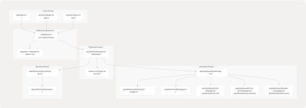
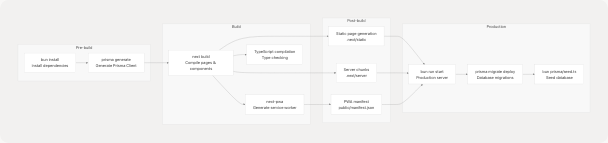

# Frontend Architecture

## Purpose and Scope

This document describes the Next.js frontend architecture for TalentSync, including application structure, routing patterns, component organization, navigation system, and state management strategies. For backend services and API structure, see [Backend Architecture](2.1-backend-architecture). For data flow between frontend and backend, see [Data Flow Patterns](2.3-data-flow-patterns). For authentication implementation details, see [Authentication System](4.2-authentication-system). For individual feature implementations, see [Frontend Application](4-frontend-application).

---

## Technology Stack

The frontend is built on the following core technologies:

| Technology | Version | Purpose |
| --- | --- | --- |
| Next.js | 15.5.6 | React framework with App Router |
| React | 18.2.0 | UI library |
| NextAuth | 4.24.11 | Authentication and session management |
| Prisma | 6.9.0 | Database ORM and client |
| Bun | 1-slim | JavaScript runtime and package manager |
| TypeScript | 5.x | Type-safe development |
| TailwindCSS | 3.3.3 | Utility-first CSS framework |
| Framer Motion | 11.0.8 | Animation library |
| next-pwa | 5.6.0 | Progressive Web App capabilities |
| PostHog | 1.279.0 | Product analytics |
| Radix UI | Various | Accessible UI primitives |

**Sources:** [frontend/package.json1-98](https://github.com/harleenkaur28/AI-Resume-Parser/blob/b2bbd83d/frontend/package.json#L1-L98)

---

## Application Structure Overview


**Diagram: Frontend Application Structure**

This diagram shows the hierarchical structure of the frontend application, mapping key files and directories to their roles in the system. The App Router organizes pages under `app/`, with `layout.tsx` providing the shell for all pages.

**Sources:** [frontend/next.config.js1-82](https://github.com/harleenkaur28/AI-Resume-Parser/blob/b2bbd83d/frontend/next.config.js#L1-L82) [frontend/package.json1-98](https://github.com/harleenkaur28/AI-Resume-Parser/blob/b2bbd83d/frontend/package.json#L1-L98) [frontend/app/dashboard/page.tsx1-109](https://github.com/harleenkaur28/AI-Resume-Parser/blob/b2bbd83d/frontend/app/dashboard/page.tsx#L1-L109)

---

## Navigation System Architecture

The navigation system adapts to three viewport sizes with distinct implementations:

### Multi-Viewport Navigation Components


**Diagram: Navigation System Component Mapping**

**Sources:** [frontend/components/navbar.tsx1-398](https://github.com/harleenkaur28/AI-Resume-Parser/blob/b2bbd83d/frontend/components/navbar.tsx#L1-L398) [frontend/components/mobile-bottom-nav.tsx1-209](https://github.com/harleenkaur28/AI-Resume-Parser/blob/b2bbd83d/frontend/components/mobile-bottom-nav.tsx#L1-L209) [frontend/components/floating-action-button.tsx1-109](https://github.com/harleenkaur28/AI-Resume-Parser/blob/b2bbd83d/frontend/components/floating-action-button.tsx#L1-L109) [frontend/lib/navigation.ts1-109](https://github.com/harleenkaur28/AI-Resume-Parser/blob/b2bbd83d/frontend/lib/navigation.ts#L1-L109)

### Navigation Item Configuration

The navigation system is driven by configuration objects in `lib/navigation.ts`:

| Configuration | Type | Purpose | Lines |
| --- | --- | --- | --- |
| `navItems` | `NavItem[]` | Main navigation items for desktop/tablet | 25-46 |
| `mobileNavItems` | `NavItem[]` | Bottom navigation items for mobile | 48-69 |
| `actionItems` | `ActionItem[]` | Quick action items (FAB menu) | 71-108 |

Each `NavItem` contains:

* `label: string` - Display text
* `href: string` - Navigation target
* `icon: LucideIcon` - Icon component from lucide-react

Each `ActionItem` extends `NavItem` with:

* `description: string` - Detailed description for expanded views

**Sources:** [frontend/lib/navigation.ts15-108](https://github.com/harleenkaur28/AI-Resume-Parser/blob/b2bbd83d/frontend/lib/navigation.ts#L15-L108)

### Desktop Sidebar Implementation

The desktop sidebar [frontend/components/navbar.tsx40-236](https://github.com/harleenkaur28/AI-Resume-Parser/blob/b2bbd83d/frontend/components/navbar.tsx#L40-L236) features:

1. **Collapsible State**: Managed by `useSidebar()` context [frontend/components/navbar.tsx31](https://github.com/harleenkaur28/AI-Resume-Parser/blob/b2bbd83d/frontend/components/navbar.tsx#L31-L31)
2. **Width Toggle**: Switches between `w-72` (expanded) and `w-16` (collapsed) [frontend/components/navbar.tsx46](https://github.com/harleenkaur28/AI-Resume-Parser/blob/b2bbd83d/frontend/components/navbar.tsx#L46-L46)
3. **Section Organization**:
   * Header with logo and collapse button [lines 51-74]
   * Main navigation items [lines 77-100]
   * Quick actions section (authenticated users) [lines 103-142]
   * User section with account link and sign out [lines 146-234]

### Mobile Bottom Navigation

The mobile implementation [frontend/components/mobile-bottom-nav.tsx1-209](https://github.com/harleenkaur28/AI-Resume-Parser/blob/b2bbd83d/frontend/components/mobile-bottom-nav.tsx#L1-L209) uses a custom interactive menu:

1. **Item Split**: Left 2 items, spacer for FAB, right 2 items [lines 139-141]
2. **Active Indicator**: Underline animation with dynamic width calculation [lines 118-132]
3. **Route Matching**: Automatic active state based on `usePathname()` [lines 31-38]
4. **Backdrop**: Dark overlay when FAB is expanded [lines 93-102]

**Sources:** [frontend/components/navbar.tsx1-398](https://github.com/harleenkaur28/AI-Resume-Parser/blob/b2bbd83d/frontend/components/navbar.tsx#L1-L398) [frontend/components/mobile-bottom-nav.tsx1-209](https://github.com/harleenkaur28/AI-Resume-Parser/blob/b2bbd83d/frontend/components/mobile-bottom-nav.tsx#L1-L209) [frontend/components/floating-action-button.tsx1-109](https://github.com/harleenkaur28/AI-Resume-Parser/blob/b2bbd83d/frontend/components/floating-action-button.tsx#L1-L109)

---

## Routing and Page Organization

Next.js App Router uses file-system based routing with the following structure:



**Diagram: Application Routing Structure**

### Route Protection Strategy

The middleware intercepts all requests and enforces:

1. **Public Paths**: Allow unauthenticated access to `/`, `/about`, `/auth`
2. **Authentication Check**: Redirect unauthenticated users to `/auth`
3. **Role Assignment Check**: Redirect users without roles to `/select-role`
4. **Role Validation**: Prevent role-assigned users from accessing `/select-role`

**Sources:** [frontend/app/dashboard/page.tsx1-109](https://github.com/harleenkaur28/AI-Resume-Parser/blob/b2bbd83d/frontend/app/dashboard/page.tsx#L1-L109)

---

## State Management Strategy


**Diagram: State Management Flow**

### State Management Patterns

The frontend uses a hybrid state management approach:

| State Type | Implementation | Scope | Example Usage |
| --- | --- | --- | --- |
| **Authentication** | NextAuth `useSession()` | Global | User identity, role, authentication status |
| **UI State** | React `useState()` | Component-local | Modal visibility, loading indicators |
| **Sidebar State** | Context API | Layout-wide | Sidebar collapse state across navigation |
| **Form State** | `react-hook-form` | Form-local | Input validation, submission handling |
| **Data Cache** | localStorage | Cross-session | Resume analysis results for reuse |
| **Server State** | `fetch()` + `useState()` | Page-specific | Dashboard data, resume lists |

### Session Management

NextAuth session structure [frontend/app/dashboard/page.tsx110-111](https://github.com/harleenkaur28/AI-Resume-Parser/blob/b2bbd83d/frontend/app/dashboard/page.tsx#L110-L111):

```
{
  data: session,  // Contains user, expires
  status          // 'loading' | 'authenticated' | 'unauthenticated'
}
```

Session data includes:

* `user.name`: User's display name
* `user.email`: User's email address
* `user.image`: Profile avatar URL
* `user.role`: "User" (job seeker) or "Admin" (recruiter)

### LocalStorage Caching Strategy

Resume analysis results are cached in localStorage to enable:

1. **Pre-population**: Forms auto-fill with last analyzed resume
2. **Cross-feature Flow**: Resume data flows from analysis → cold mail → hiring assistant
3. **Reduced API Calls**: Avoid re-fetching recently analyzed data

Implementation in dashboard [frontend/app/dashboard/page.tsx1-1500](https://github.com/harleenkaur28/AI-Resume-Parser/blob/b2bbd83d/frontend/app/dashboard/page.tsx#L1-L1500) stores analysis results after successful upload.

**Sources:** [frontend/app/dashboard/page.tsx110-172](https://github.com/harleenkaur28/AI-Resume-Parser/blob/b2bbd83d/frontend/app/dashboard/page.tsx#L110-L172) [frontend/components/navbar.tsx31-32](https://github.com/harleenkaur28/AI-Resume-Parser/blob/b2bbd83d/frontend/components/navbar.tsx#L31-L32) [frontend/lib/navigation.ts1-109](https://github.com/harleenkaur28/AI-Resume-Parser/blob/b2bbd83d/frontend/lib/navigation.ts#L1-L109)

---

## Component Architecture

### Component Hierarchy


**Diagram: Component Dependency Graph**

### Shared Component Library

The `components/ui/` directory contains Radix UI-based primitives:

| Component | Source | Purpose |
| --- | --- | --- |
| `Button` | `@radix-ui/react-slot` | Interactive buttons with variants |
| `Card` | Custom wrapper | Content containers with header/footer |
| `Dialog` | `@radix-ui/react-dialog` | Modal dialogs and confirmations |
| `Toast` | `@radix-ui/react-toast` | Notification system |
| `Avatar` | `@radix-ui/react-avatar` | User profile images |
| `Progress` | `@radix-ui/react-progress` | Progress bars |
| `Badge` | Custom styled | Status indicators and labels |
| `Loader` | Custom | Loading spinners and overlays |

### Custom Hook Patterns

Custom hooks encapsulate reusable logic:

1. **`useToast()`**: Toast notification management with queue and auto-dismiss
2. **`useSidebar()`**: Sidebar collapse state shared across components [frontend/components/navbar.tsx31](https://github.com/harleenkaur28/AI-Resume-Parser/blob/b2bbd83d/frontend/components/navbar.tsx#L31-L31)
3. **`useSession()`**: NextAuth session access throughout the app

**Sources:** [frontend/app/dashboard/page.tsx1-1500](https://github.com/harleenkaur28/AI-Resume-Parser/blob/b2bbd83d/frontend/app/dashboard/page.tsx#L1-L1500) [frontend/components/navbar.tsx1-398](https://github.com/harleenkaur28/AI-Resume-Parser/blob/b2bbd83d/frontend/components/navbar.tsx#L1-L398) [frontend/components/ui/loader.tsx1-100](https://github.com/harleenkaur28/AI-Resume-Parser/blob/b2bbd83d/frontend/components/ui/loader.tsx#L1-L100) (inferred from usage)

---

## Build and Configuration

### Next.js Configuration

The [frontend/next.config.js1-82](https://github.com/harleenkaur28/AI-Resume-Parser/blob/b2bbd83d/frontend/next.config.js#L1-L82) configures:

| Feature | Configuration | Purpose |
| --- | --- | --- |
| **PWA** | `next-pwa` plugin | Service worker generation, offline support |
| **Images** | Unoptimized, external domains | Support OAuth provider images |
| **Webpack** | Node.js polyfills disabled | Fix PostHog instrumentation in browser |
| **Rewrites** | Proxy `/ph/*` to PostHog EU | Analytics without CORS issues |
| **External Packages** | `@prisma/client`, `bcrypt` | Mark as server-only modules |

### PWA Configuration Details

PWA setup [frontend/next.config.js1-6](https://github.com/harleenkaur28/AI-Resume-Parser/blob/b2bbd83d/frontend/next.config.js#L1-L6):

* **Destination**: `public/` directory
* **Auto-registration**: Service worker registers automatically
* **Skip waiting**: Updates apply immediately
* **Disabled in dev**: Only active in production builds

### Webpack Customizations

Browser builds [frontend/next.config.js18-62](https://github.com/harleenkaur28/AI-Resume-Parser/blob/b2bbd83d/frontend/next.config.js#L18-L62) configure fallbacks for Node.js modules:

* Rewrite `node:*` imports to plain names
* Set fallbacks to `false` for unavailable modules
* Prevent UnhandledSchemeError from PostHog dependencies

**Sources:** [frontend/next.config.js1-82](https://github.com/harleenkaur28/AI-Resume-Parser/blob/b2bbd83d/frontend/next.config.js#L1-L82)

---

## Build Process

### Build Pipeline



**Diagram: Frontend Build Process**

### Build Scripts

Package scripts [frontend/package.json5-12](https://github.com/harleenkaur28/AI-Resume-Parser/blob/b2bbd83d/frontend/package.json#L5-L12):

| Script | Command | Purpose |
| --- | --- | --- |
| `dev` | `next dev` | Development server with hot reload |
| `build` | `prisma generate && next build` | Production build with Prisma client |
| `start` | `next start` | Production server |
| `postinstall` | `prisma generate` | Auto-generate Prisma client after install |
| `lint` | `next lint` | ESLint code quality checks |
| `seed` | `tsx prisma/seed.ts` | Database seeding script |

### Production Deployment Flow

1. **Docker Build**: Multi-stage Dockerfile with builder and runner stages
2. **Dependency Installation**: `bun install` for fast package installation
3. **Prisma Generation**: Generate type-safe database client
4. **Next.js Build**: Compile all pages, API routes, and components
5. **PWA Generation**: Create service worker and manifest files
6. **Container Start**: Run migrations, seed database, start Next.js server

**Sources:** [frontend/package.json1-98](https://github.com/harleenkaur28/AI-Resume-Parser/blob/b2bbd83d/frontend/package.json#L1-L98) [frontend/next.config.js1-82](https://github.com/harleenkaur28/AI-Resume-Parser/blob/b2bbd83d/frontend/next.config.js#L1-L82)

---

## Key Architectural Decisions

### Responsive Navigation Strategy

**Decision**: Implement three distinct navigation patterns instead of a single responsive component.

**Rationale**:

* **Desktop**: Sidebar provides persistent access to all navigation items
* **Tablet**: Top navigation with hamburger menu balances screen space
* **Mobile**: Bottom navigation with thumb-friendly FAB maximizes content area

**Implementation**: Single `Navbar` component [frontend/components/navbar.tsx1-398](https://github.com/harleenkaur28/AI-Resume-Parser/blob/b2bbd83d/frontend/components/navbar.tsx#L1-L398) handles desktop and tablet, while `MobileBottomNav` [frontend/components/mobile-bottom-nav.tsx1-209](https://github.com/harleenkaur28/AI-Resume-Parser/blob/b2bbd83d/frontend/components/mobile-bottom-nav.tsx#L1-L209) handles mobile viewport.

### Session vs. LocalStorage

**Decision**: Use NextAuth session for authentication, localStorage for resume data cache.

**Rationale**:

* **Session**: Secure, server-validated, expires automatically
* **LocalStorage**: Persists across sessions, reduces API calls for recently analyzed resumes

**Trade-offs**: LocalStorage can become stale, but acceptable for UX enhancement.

### App Router Over Pages Router

**Decision**: Use Next.js App Router (app directory) instead of Pages Router.

**Benefits**:

* Server Components by default (better performance)
* Nested layouts without prop drilling
* Simplified data fetching patterns
* Better TypeScript support

**Sources:** [frontend/components/navbar.tsx1-398](https://github.com/harleenkaur28/AI-Resume-Parser/blob/b2bbd83d/frontend/components/navbar.tsx#L1-L398) [frontend/components/mobile-bottom-nav.tsx1-209](https://github.com/harleenkaur28/AI-Resume-Parser/blob/b2bbd83d/frontend/components/mobile-bottom-nav.tsx#L1-L209) [frontend/app/dashboard/page.tsx1-1500](https://github.com/harleenkaur28/AI-Resume-Parser/blob/b2bbd83d/frontend/app/dashboard/page.tsx#L1-L1500)
