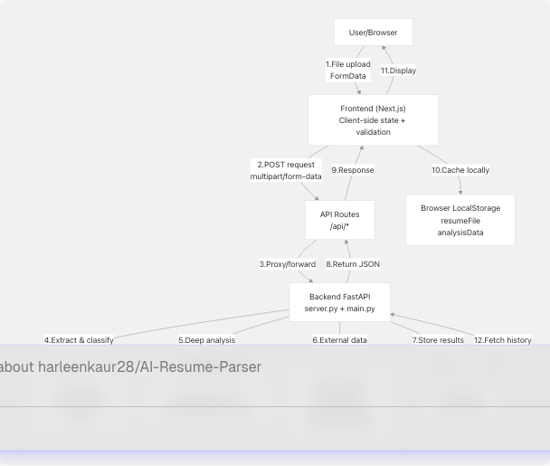

# Data Flow Patterns

## Purpose and Scope

This document describes the data flow patterns used throughout the TalentSync platform, detailing how information moves between the frontend (Next.js), backend (FastAPI), external services (Google Gemini, Tavily, Jina AI), and database (PostgreSQL). It covers the complete lifecycle of data from user input through AI processing to final presentation.

For information about the overall system architecture, see [System Architecture](/harleenkaur28/AI-Resume-Parser/2-system-architecture). For specific backend service implementations, see [Backend Services](/harleenkaur28/AI-Resume-Parser/3-backend-services). For frontend component structure, see [Frontend Architecture](/harleenkaur28/AI-Resume-Parser/2.2-frontend-architecture).

---

## Data Flow Architecture Overview

The TalentSync platform follows a layered architecture where data flows through distinct stages: **Client Input → Frontend Processing → API Gateway → Backend Services → AI/ML Processing → Database Persistence → Response Delivery**.


```

**Sources:** [backend/server.py1-100](https://github.com/harleenkaur28/AI-Resume-Parser/blob/b2bbd83d/backend/server.py#L1-L100) [frontend/components/file-upload.tsx1-467](https://github.com/harleenkaur28/AI-Resume-Parser/blob/b2bbd83d/frontend/components/file-upload.tsx#L1-L467) [frontend/app/dashboard/seeker/page.tsx1-196](https://github.com/harleenkaur28/AI-Resume-Parser/blob/b2bbd83d/frontend/app/dashboard/seeker/page.tsx#L1-L196)

---

## Resume Upload and Analysis Flow

This is the primary data flow pattern in the application. It demonstrates file processing, multi-stage AI analysis, and database persistence.

### End-to-End Resume Analysis Sequence

**Sources:** [frontend/components/file-upload.tsx99-132](https://github.com/harleenkaur28/AI-Resume-Parser/blob/b2bbd83d/frontend/components/file-upload.tsx#L99-L132) [backend/server.py738-1100](https://github.com/harleenkaur28/AI-Resume-Parser/blob/b2bbd83d/backend/server.py#L738-L1100) [backend/server.py373-601](https://github.com/harleenkaur28/AI-Resume-Parser/blob/b2bbd83d/backend/server.py#L373-L601)

### Data Transformation Pipeline

The resume analysis involves multiple data transformations:

| Stage | Input Format | Processing | Output Format | Location |
| --- | --- | --- | --- | --- |
| **File Upload** | Binary file (PDF/DOCX/TXT) | Browser FormData API | `multipart/form-data` | [file-upload.tsx106-110](https://github.com/harleenkaur28/AI-Resume-Parser/blob/b2bbd83d/file-upload.tsx#L106-L110) |
| **Text Extraction** | File bytes | PyPDF2/python-docx | Raw text string | [server.py764-792](https://github.com/harleenkaur28/AI-Resume-Parser/blob/b2bbd83d/server.py#L764-L792) |
| **Text Cleaning** | Raw text | Spacy NLP + NLTK | Cleaned, lemmatized text | [server.py738-749](https://github.com/harleenkaur28/AI-Resume-Parser/blob/b2bbd83d/server.py#L738-L749) |
| **Classification** | Cleaned text | TF-IDF → scikit-learn | Job category string | [server.py714-735](https://github.com/harleenkaur28/AI-Resume-Parser/blob/b2bbd83d/server.py#L714-L735) |
| **Field Extraction** | Raw text | Regex patterns | Structured fields (name, email, etc.) | [server.py923-1038](https://github.com/harleenkaur28/AI-Resume-Parser/blob/b2bbd83d/server.py#L923-L1038) |
| **LLM Analysis** | Raw + cleaned text | Gemini 2.0 prompt | `ComprehensiveAnalysisData` JSON | [server.py595-601](https://github.com/harleenkaur28/AI-Resume-Parser/blob/b2bbd83d/server.py#L595-L601) |
| **Persistence** | Analysis data | Prisma ORM | Database records | Next.js API route |
| **Caching** | Analysis result | `JSON.stringify()` | LocalStorage entries | [file-upload.tsx156-170](https://github.com/harleenkaur28/AI-Resume-Parser/blob/b2bbd83d/file-upload.tsx#L156-L170) |

**Sources:** [backend/server.py738-1100](https://github.com/harleenkaur28/AI-Resume-Parser/blob/b2bbd83d/backend/server.py#L738-L1100) [frontend/components/file-upload.tsx99-170](https://github.com/harleenkaur28/AI-Resume-Parser/blob/b2bbd83d/frontend/components/file-upload.tsx#L99-L170)

---

## Frontend-to-Backend Communication Patterns

### API Request Pattern

All frontend-to-backend communication follows a consistent pattern using Next.js API routes as proxies:

**Example: Resume Analysis Request**

The frontend component initiates the request:

[frontend/components/file-upload.tsx99-132](https://github.com/harleenkaur28/AI-Resume-Parser/blob/b2bbd83d/frontend/components/file-upload.tsx#L99-L132)

```
const formData = new FormData();
formData.append("file", file);
formData.append("customName", customName.trim());
formData.append("showInCentral", showInCentral.toString());

const response = await fetch(`/api/analysis`, {
    method: "POST",
    body: formData,
});
```

The Next.js API route proxies to FastAPI (implementation exists in `/app/api/analysis/route.ts` based on the architecture).

**Sources:** [frontend/components/file-upload.tsx99-132](https://github.com/harleenkaur28/AI-Resume-Parser/blob/b2bbd83d/frontend/components/file-upload.tsx#L99-L132) [backend/server.py52-66](https://github.com/harleenkaur28/AI-Resume-Parser/blob/b2bbd83d/backend/server.py#L52-L66)

---

## State Management Patterns

### LocalStorage Cross-Feature Data Flow

The application uses `localStorage` to pass data between features without requiring additional API calls:

**LocalStorage Data Structure:**

```
// Stored by FileUpload component after analysis
localStorage.setItem("resumeFile", JSON.stringify({
    name: file.name,
    size: file.size,
    type: file.type,
    lastModified: file.lastModified
}));

localStorage.setItem("analysisData", JSON.stringify({
    id: string,
    name: string,
    email: string,
    predictedField: string,
    skillsAnalysis: SkillProficiency[],
    workExperience: WorkExperienceEntry[],
    projects: ProjectEntry[],
    // ... full ComprehensiveAnalysisData
}));
```

**Sources:** [frontend/components/file-upload.tsx154-192](https://github.com/harleenkaur28/AI-Resume-Parser/blob/b2bbd83d/frontend/components/file-upload.tsx#L154-L192)

---

## LLM Integration Patterns

### Prompt Engineering and Invocation Flow

The system uses LangChain to standardize LLM interactions across different services:

**Prompt Template Structure (Resume Analysis):**

[backend/server.py503-593](https://github.com/harleenkaur28/AI-Resume-Parser/blob/b2bbd83d/backend/server.py#L503-L593)
The `format_analyse_prompt_template_str` defines a two-phase prompt:

1. **Phase 1**: Clean and format the raw resume text
2. **Phase 2**: Extract structured data conforming to `ComprehensiveAnalysisData`

**LLM Configuration:**

[backend/server.py68-86](https://github.com/harleenkaur28/AI-Resume-Parser/blob/b2bbd83d/backend/server.py#L68-L86)

```
llm = ChatGoogleGenerativeAI(
    model="gemini-2.0-flash",
    google_api_key=google_api_key,
    temperature=0.1,  # Low temperature for consistency
)
```

**Sources:** [backend/server.py68-86](https://github.com/harleenkaur28/AI-Resume-Parser/blob/b2bbd83d/backend/server.py#L68-L86) [backend/server.py503-601](https://github.com/harleenkaur28/AI-Resume-Parser/blob/b2bbd83d/backend/server.py#L503-L601)

---

## Cold Mail Generation Flow

The cold mail feature demonstrates a multi-step AI workflow with optional editing:

**Cold Mail Generation Prompt Structure:**

The cold mail prompt includes:

* **Resume summary**: Key skills, experience, achievements
* **Recipient context**: Name, role, company
* **Company research**: Website content (if provided)
* **Email template**: Professional structure with personalization

**Sources:** [backend/main.py](https://github.com/harleenkaur28/AI-Resume-Parser/blob/b2bbd83d/backend/main.py) (cold mail router), [backend/app/agents/web\_content\_agent.py](https://github.com/harleenkaur28/AI-Resume-Parser/blob/b2bbd83d/backend/app/agents/web_content_agent.py)

---

## Hiring Assistant Flow

The hiring assistant generates interview answers based on resume context:

**Data Passed to Hiring Assistant:**

[frontend/components/file-upload.tsx174-192](https://github.com/harleenkaur28/AI-Resume-Parser/blob/b2bbd83d/frontend/components/file-upload.tsx#L174-L192)

```
localStorage.setItem("resumeFile", JSON.stringify({...}));
localStorage.setItem("analysisData", JSON.stringify(analysisResult.data.analysis));

// Later retrieved by hiring assistant page
const cachedAnalysis = JSON.parse(localStorage.getItem("analysisData") || "{}");
```

The hiring assistant uses the cached analysis to:

1. Understand the candidate's background
2. Identify relevant skills and experiences
3. Generate answers that reference specific projects/achievements
4. Tailor responses to the target role

**Sources:** [frontend/components/file-upload.tsx174-192](https://github.com/harleenkaur28/AI-Resume-Parser/blob/b2bbd83d/frontend/components/file-upload.tsx#L174-L192) [backend/main.py](https://github.com/harleenkaur28/AI-Resume-Parser/blob/b2bbd83d/backend/main.py) (hiring assistant router)

---

## ATS Evaluation Flow with LangGraph

The ATS evaluation service uses LangGraph for multi-step state management:

**LangGraph State Machine Implementation:**

The ATS service maintains state across multiple nodes:

* **Input State**: Resume text, job description, optional company URL
* **Research Output**: Company information from web search
* **Score Output**: Numerical score (0-100), keyword matches
* **Suggestions Output**: Specific improvement recommendations
* **Final Output**: Complete ATS evaluation report

Each node transforms the state and passes it to the next node. The graph structure ensures:

1. Sequential execution of analysis steps
2. State persistence across nodes
3. Error handling at each stage
4. Conditional branching based on intermediate results

**Sources:** [backend/main.py](https://github.com/harleenkaur28/AI-Resume-Parser/blob/b2bbd83d/backend/main.py) (ATS router with LangGraph), [backend/app/agents/web\_search\_agent.py](https://github.com/harleenkaur28/AI-Resume-Parser/blob/b2bbd83d/backend/app/agents/web_search_agent.py)

---

## LinkedIn Services Integration Flow

The LinkedIn service combines multiple agents to generate content:

**GitHub Agent Integration:**

[backend/app/agents/github\_agent.py224-246](https://github.com/harleenkaur28/AI-Resume-Parser/blob/b2bbd83d/backend/app/agents/github_agent.py#L224-L246)
The GitHub agent:

1. Parses GitHub URLs
2. Fetches repository metadata via GitHub API
3. Optionally ingests full codebase using `gitingest`
4. Generates LinkedIn-friendly insights using LLM

**Web Search Agent Integration:**

The web search agent uses Tavily API to:

1. Research company information
2. Find industry trends
3. Gather competitive intelligence
4. Validate job market data

**Sources:** [backend/app/agents/github\_agent.py49-417](https://github.com/harleenkaur28/AI-Resume-Parser/blob/b2bbd83d/backend/app/agents/github_agent.py#L49-L417) [backend/main.py](https://github.com/harleenkaur28/AI-Resume-Parser/blob/b2bbd83d/backend/main.py) (LinkedIn router)

---

## Database Persistence Patterns

### Prisma ORM Data Flow

The frontend uses Prisma Client for type-safe database operations:

**Database Schema Evolution:**

[frontend/prisma/migrations/20250613172024\_replace\_file\_url\_with\_raw\_text/migration.sql1-96](https://github.com/harleenkaur28/AI-Resume-Parser/blob/b2bbd83d/frontend/prisma/migrations/20250613172024_replace_file_url_with_raw_text/migration.sql#L1-L96)
Key migration showing the shift from file storage to text storage:

* Removed `fileUrl` column
* Added `rawText` column for storing resume content
* This enables direct database queries without file system access

**Typical Database Write Flow (Resume Analysis):**

1. Backend completes analysis → generates structured data
2. Next.js API route receives data
3. Create Resume record with Prisma:

   ```
   ```
   const resume = await prisma.resume.create({
       data: {
           userId: session.user.id,
           customName: customName,
           rawText: cleanedText,
           predictedField: predictedField,
           uploadedAt: new Date()
       }
   });
   ```
   ```
4. Create Analysis record linked to Resume:

   ```
   ```
   const analysis = await prisma.analysis.create({
       data: {
           resumeId: resume.id,
           name: analysisData.name,
           email: analysisData.email,
           skillsAnalysis: analysisData.skillsAnalysis,
           // ... all analysis fields
       }
   });
   ```
   ```
5. Return both IDs to frontend

**Sources:** [frontend/prisma/migrations/20250613172024\_replace\_file\_url\_with\_raw\_text/migration.sql1-96](https://github.com/harleenkaur28/AI-Resume-Parser/blob/b2bbd83d/frontend/prisma/migrations/20250613172024_replace_file_url_with_raw_text/migration.sql#L1-L96)

---

## Error Handling and Retry Patterns

### Frontend Error Handling

The FileUpload component demonstrates comprehensive error handling:

**Error Handling Implementation:**

[frontend/components/file-upload.tsx99-132](https://github.com/harleenkaur28/AI-Resume-Parser/blob/b2bbd83d/frontend/components/file-upload.tsx#L99-L132)

```
try {
    const response = await fetch(`/api/analysis`, {
        method: "POST",
        body: formData,
    });

    if (!response.ok) {
        throw new Error(`HTTP error! status: ${response.status}`);
    }

    const result: AnalysisResult = await response.json();
    setAnalysisResult(result);

} catch (err) {
    setError(err instanceof Error ? err.message : "Failed to analyze resume");
} finally {
    setIsUploading(false);
}
```

**Backend Error Handling:**

The backend uses try-catch blocks with fallback responses:

* Invalid file format → Return error message
* LLM timeout → Use basic extraction only
* API key issues → Graceful degradation
* Database errors → Retry with exponential backoff

**Sources:** [frontend/components/file-upload.tsx99-132](https://github.com/harleenkaur28/AI-Resume-Parser/blob/b2bbd83d/frontend/components/file-upload.tsx#L99-L132) [backend/server.py68-86](https://github.com/harleenkaur28/AI-Resume-Parser/blob/b2bbd83d/backend/server.py#L68-L86)

---

## Performance Optimization Patterns

### Loading States and User Feedback

The application provides rich loading feedback during long-running operations:

**Loading UI Components:**

[frontend/components/ui/loader.tsx1-219](https://github.com/harleenkaur28/AI-Resume-Parser/blob/b2bbd83d/frontend/components/ui/loader.tsx#L1-L219)
The system provides multiple loader variants:

* `variant="default"`: Sophisticated rotating rings
* `variant="dots"`: Animated dots with fade
* `variant="pulse"`: Pulsing circle
* `variant="spinner"`: Classic spinner

**Full-Screen Loading Overlay:**

[frontend/components/file-upload.tsx196-229](https://github.com/harleenkaur28/AI-Resume-Parser/blob/b2bbd83d/frontend/components/file-upload.tsx#L196-L229)
```
<AnimatePresence>
    {isUploading && (
        <motion.div className="fixed inset-0 bg-black/50 backdrop-blur-md z-50">
            <Loader variant="pulse" size="xl" className="text-[#76ABAE]" />
            <h3>Analyzing Your Resume</h3>
            <p>AI is processing your resume to extract key information...</p>
        </motion.div>
    )}
</AnimatePresence>
```
```

**Sources:** [frontend/components/ui/loader.tsx1-219](https://github.com/harleenkaur28/AI-Resume-Parser/blob/b2bbd83d/frontend/components/ui/loader.tsx#L1-L219) [frontend/components/file-upload.tsx196-229](https://github.com/harleenkaur28/AI-Resume-Parser/blob/b2bbd83d/frontend/components/file-upload.tsx#L196-L229)

---

## Summary of Key Data Flow Patterns

| Pattern | Description | Key Components | Purpose |
| --- | --- | --- | --- |
| **File Upload Pipeline** | Multi-stage file processing | FileUpload → API → FastAPI → ML → LLM → DB | Transform raw files into structured data |
| **LocalStorage Caching** | Cross-feature state sharing | Browser localStorage, React state | Avoid redundant API calls, improve UX |
| **LLM Invocation** | Standardized AI integration | LangChain PromptTemplate, ChatGoogleGenerativeAI | Consistent prompt engineering, error handling |
| **Agent Orchestration** | Multi-source data gathering | GitHubAgent, WebSearchAgent, WebContentAgent | Enrich content with external data |
| **State Machine Workflow** | Complex multi-step processes | LangGraph state graphs | Manage ATS evaluation, tailored resumes |
| **Database Persistence** | Type-safe data storage | Prisma Client, PostgreSQL | Store analysis results, user data |
| **API Proxy Pattern** | Frontend-backend communication | Next.js API routes, FastAPI endpoints | Authentication, request transformation |
| **Error Boundaries** | Graceful degradation | Try-catch blocks, fallback responses | Handle failures without crashing |
| **Loading States** | User feedback during async operations | Loader components, AnimatePresence | Improve perceived performance |

**Sources:** [frontend/components/file-upload.tsx1-467](https://github.com/harleenkaur28/AI-Resume-Parser/blob/b2bbd83d/frontend/components/file-upload.tsx#L1-L467) [backend/server.py1-1100](https://github.com/harleenkaur28/AI-Resume-Parser/blob/b2bbd83d/backend/server.py#L1-L1100) [backend/main.py](https://github.com/harleenkaur28/AI-Resume-Parser/blob/b2bbd83d/backend/main.py)
