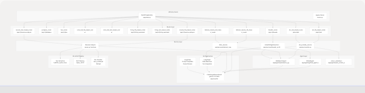
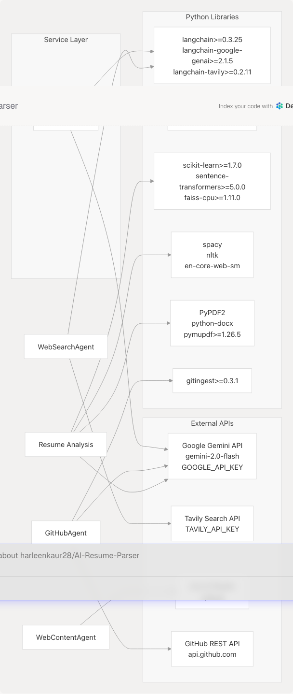
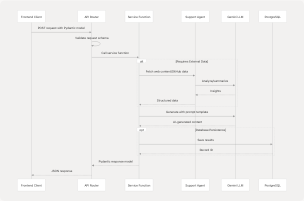
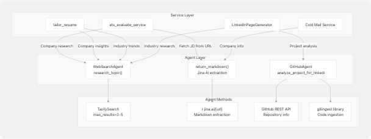

# Backend Services

## Purpose and Scope

This document provides a comprehensive overview of the backend services powering TalentSync, an AI-driven hiring intelligence platform. The backend is built on FastAPI and provides RESTful APIs for resume analysis, ATS evaluation, cold email generation, interview preparation, and LinkedIn content creation.

For information about the overall system architecture, see [System Architecture](/harleenkaur28/AI-Resume-Parser/2-system-architecture). For details on individual AI service implementations, see subsections [Resume Analysis Service](/harleenkaur28/AI-Resume-Parser/3.1-resume-analysis-service), [ATS Evaluation Service](/harleenkaur28/AI-Resume-Parser/3.2-ats-evaluation-service), [Cold Mail Generator Service](/harleenkaur28/AI-Resume-Parser/3.3-cold-mail-generator-service), [Hiring Assistant Service](/harleenkaur28/AI-Resume-Parser/3.4-hiring-assistant-service), [Tailored Resume Service](/harleenkaur28/AI-Resume-Parser/3.5-tailored-resume-service), and [LinkedIn Services](/harleenkaur28/AI-Resume-Parser/3.6-linkedin-services). For frontend integration patterns, see [Frontend Application](/harleenkaur28/AI-Resume-Parser/4-frontend-application). For deployment infrastructure, see [Deployment & Infrastructure](/harleenkaur28/AI-Resume-Parser/6-deployment-and-infrastructure).

---

## Backend Architecture Overview

The TalentSync backend follows a modular service-oriented architecture with clear separation of concerns. Services are organized into routers, each handling specific feature domains with both file-based (v1) and text-based (v2) API endpoints.

### Service Organization Diagram


```

---

## API Versioning Strategy

TalentSync implements a dual-version API strategy to support both legacy file upload workflows (v1) and modern text-based workflows (v2). This approach allows gradual migration while maintaining backward compatibility.

| Feature | v1 Endpoint | v2 Endpoint | Input Type |
| --- | --- | --- | --- |
| Cold Mail Generation | `/api/v1/cold-mail` | `/api/v2/cold-mail` | v1: File upload, v2: Text/JSON |
| Hiring Assistant | `/api/v1/hiring-assistant` | `/api/v2/hiring-assistant` | v1: File upload, v2: Text/JSON |
| Resume Analysis | `/api/v1/resume-analysis` | `/api/v2/resume-analysis` | v1: File upload, v2: Text/JSON |
| ATS Evaluation | `/api/v1/ats` | `/api/v2/ats` | v1: File upload, v2: Text/JSON |
| Tailored Resume | `/api/v1/tailored-resume` | `/api/v2/tailored-resume` | v1: File upload, v2: Text/JSON |

**Version Routing Implementation**:

* v1 routers registered at `/api/v1` prefix
* v2 routers registered at `/api/v2` prefix
* Cold mail v2 router duplicated at both `/api/v1` and `/api/v2` for migration support

---

## Service Dependency Graph



---

## Core Services Overview

### Request/Response Flow Pattern

All TalentSync services follow a consistent request/response pattern using Pydantic models for validation and structured data exchange.



---

## Data Models Architecture

### Schema Organization

TalentSync uses Pydantic models extensively for request validation, response serialization, and data structure enforcement. Models are organized by feature domain in `app/models/schemas.py`.

**Key Model Categories**:

| Category | Models | Purpose |
| --- | --- | --- |
| Resume Analysis | `ComprehensiveAnalysisData`, `ComprehensiveAnalysisResponse`, `ResumeAnalysis` | Structure resume parsing results with skills, experience, projects |
| ATS Evaluation | `JDEvaluatorRequest`, `JDEvaluatorResponse` | Job description matching with score and suggestions |
| Cold Mail | `ColdMailRequest`, `ColdMailResponse` | Personalized email generation parameters |
| Hiring Assistant | `HiringAssistantRequest`, `HiringAssistantResponse` | Interview Q&A generation |
| LinkedIn | `PostGenerationRequest`, `GeneratedPost`, `LinkedInPageRequest` | Content creation with metadata |
| Tailored Resume | `TailoredResumeRequest`, `TailoredResumeResponse` | Job-specific resume optimization |

**Nested Structures**:

* `WorkExperienceEntry` and `UIDetailedWorkExperienceEntry` for work history
* `ProjectEntry` and `UIProjectEntry` for project details
* `SkillProficiency` for skill assessment with percentage
* `EducationEntry`, `LanguageEntry`, `CertificationEntry` for profile sections

---

## Service Communication Patterns

### Service-to-Agent Communication

Services orchestrate agent calls to enrich AI-generated content with real-time web data, company research, and GitHub project insights.



**Agent Integration Examples**:

**ATS Service using Web Content Agent**:

```
# Fetch job description from URL
if jd_link is not None:
    import app.agents.web_content_agent as web_agent
    jd_text = web_agent.return_markdown(jd_link)
```

[backend/app/services/ats.py44-47](https://github.com/harleenkaur28/AI-Resume-Parser/blob/b2bbd83d/backend/app/services/ats.py#L44-L47)

**LinkedIn Service using GitHub Agent**:

```
# Analyze GitHub projects
for repo_url in request.featured_repositories:
    analysis = await self.github_agent.analyze_project_for_linkedin(str(repo_url))
    if not analysis.get("error"):
        github_insights.append(analysis)
```

[backend/app/services/linkedin\_profile.py109-115](https://github.com/harleenkaur28/AI-Resume-Parser/blob/b2bbd83d/backend/app/services/linkedin_profile.py#L109-L115)

---

## Request Processing Pipeline

### End-to-End Flow for Resume Analysis


**Key Functions**:

| Function | Location | Purpose |
| --- | --- | --- |
| `process_document()` | [server.py764-792](https://github.com/harleenkaur28/AI-Resume-Parser/blob/b2bbd83d/server.py#L764-L792) | Extract raw text from file bytes |
| `clean_resume()` | [server.py738-749](https://github.com/harleenkaur28/AI-Resume-Parser/blob/b2bbd83d/server.py#L738-L749) | Remove URLs, punctuation, lemmatize tokens |
| `predict_category()` | Uses TF-IDF + classifier | Classify resume into 25 job categories |
| `extract_name_and_email()` | [server.py923-932](https://github.com/harleenkaur28/AI-Resume-Parser/blob/b2bbd83d/server.py#L923-L932) | Regex-based contact extraction |
| `extract_skills_from_resume()` | Uses skills list | Match known skills from text |
| `comprehensive_analysis_prompt_v2` | [server.py373-453](https://github.com/harleenkaur28/AI-Resume-Parser/blob/b2bbd83d/server.py#L373-L453) | LLM prompt for structured extraction |

---

## LLM Integration Architecture

### Prompt Template System

TalentSync uses LangChain `PromptTemplate` objects to structure LLM interactions with consistent variable injection and output formatting.

**Core Prompt Templates**:

| Template | Location | Input Variables | Output Format |
| --- | --- | --- | --- |
| `comprehensive_analysis_prompt_v2` | [server.py373-453](https://github.com/harleenkaur28/AI-Resume-Parser/blob/b2bbd83d/server.py#L373-L453) | `extracted_resume_text`, `basic_info_json` | JSON conforming to `ComprehensiveAnalysisData` |
| `tips_generator_prompt` | [server.py497-500](https://github.com/harleenkaur28/AI-Resume-Parser/blob/b2bbd83d/server.py#L497-L500) | `job_category`, `skills_list_str` | JSON with `resume_tips` and `interview_tips` |
| `format_analyse_prompt` | [server.py595-601](https://github.com/harleenkaur28/AI-Resume-Parser/blob/b2bbd83d/server.py#L595-L601) | `raw_resume_text`, `basic_info_json` | JSON with `cleaned_text` and `analysis` |

**LLM Configuration**:

```
llm = ChatGoogleGenerativeAI(
    model="gemini-2.0-flash",
    google_api_key=os.getenv("GOOGLE_API_KEY"),
    temperature=0.1,  # Low temperature for consistent, factual output
)
```

[backend/server.py76-80](https://github.com/harleenkaur28/AI-Resume-Parser/blob/b2bbd83d/backend/server.py#L76-L80)

**Temperature Strategy**:

* **0.1**: Used for structured data extraction (resume analysis, ATS scoring)
* **Higher values**: Used for creative content generation (LinkedIn posts)

---

## Machine Learning Pipeline

### Traditional ML + LLM Hybrid Approach

The resume analysis service combines traditional machine learning for fast job category classification with LLM-powered semantic understanding for detailed field extraction.


**ML Model Details**:

* **Vectorizer**: TF-IDF with tokenization and feature extraction
* **Classifier**: Pre-trained scikit-learn model (`best_model.pkl`)
* **Categories**: 25 job categories (e.g., "Java Developer", "Data Science", "HR", "Advocate")
* **Purpose**: Fast category prediction to guide LLM field inference

**Model Loading**:

```
clf = pickle.load(open(
    os.path.join(os.path.dirname(__file__), "app", "model", "best_model.pkl"),
    "rb",
))
tfidf_vectorizer = pickle.load(open(
    os.path.join(os.path.dirname(__file__), "app", "model", "tfidf.pkl"),
    "rb",
))
```

[backend/server.py714-735](https://github.com/harleenkaur28/AI-Resume-Parser/blob/b2bbd83d/backend/server.py#L714-L735)

---

## Database Integration

### PostgreSQL Schema and Persistence

TalentSync uses PostgreSQL for persisting user data, resume analyses, and generated content. Database operations are handled via Prisma ORM on the frontend side, with backend services receiving pre-validated data.

**Database Router** (`postgres_router` at `/api/v1/database`):

* Handles database queries from frontend
* Returns resume lists, categories, and analysis details
* Manages cascading deletions for user account removal

**Data Persistence Pattern**:

1. Backend service generates analysis/content
2. Frontend receives response with generated data
3. Frontend persists to PostgreSQL via Prisma
4. Frontend displays cached data from database

**Note**: Backend services are stateless and do not directly manage database transactions. Database schema and management details are covered in [Database & Data Models](/harleenkaur28/AI-Resume-Parser/5-database-and-data-models).

---

## Error Handling and Validation

### Service-Level Error Strategy

All services implement consistent error handling using FastAPI's `HTTPException` for client errors and structured error responses.

**Error Response Pattern**:

```
try:
    # Validate inputs
    JDEvaluatorRequest(
        company_name=company_name,
        company_website_content=company_website,
        jd=jd_text,
        resume=resume_text,
    )
except ValidationError as ve:
    raise HTTPException(status_code=400, detail=str(ve))

try:
    # Service logic
    result = await process_request()
    return StructuredResponse(**result)
except Exception as e:
    raise HTTPException(status_code=500, detail=f"Service failed: {e}")
```

**HTTP Status Code Usage**:

| Status Code | Use Case | Example |
| --- | --- | --- |
| 400 | Bad Request - validation errors | Missing required fields, invalid URL format |
| 404 | Not Found | Resume not found in database |
| 500 | Internal Server Error | LLM timeout, API key invalid, service failure |

**Validation Layers**:

1. **Pydantic Model Validation**: Automatic field type and constraint checking
2. **Service-Level Validation**: Business logic validation (e.g., `jd_text` or `jd_link` required)
3. **External API Validation**: Check for API availability and valid responses

---

## CORS and Middleware Configuration

### FastAPI Middleware Setup

Both the legacy server and modern main application configure CORS to allow cross-origin requests from any origin during development.

```
app.add_middleware(
    CORSMiddleware,
    allow_origins=["*"],  # Development: allow all origins
    allow_credentials=True,
    allow_methods=["*"],  # Allow all HTTP methods
    allow_headers=["*"],  # Allow all headers
)
```

[backend/app/main.py9-16](https://github.com/harleenkaur28/AI-Resume-Parser/blob/b2bbd83d/backend/app/main.py#L9-L16)

**Production Recommendation**: Replace `allow_origins=["*"]` with specific frontend domain(s) for security.

---

## Environment Configuration

### Required Environment Variables

TalentSync backend requires several API keys for external service integration. These are loaded via `python-dotenv` from a `.env` file.

| Variable | Service | Required For |
| --- | --- | --- |
| `GOOGLE_API_KEY` | Google Gemini API | All LLM-powered features |
| `TAVILY_API_KEY` | Tavily Search | Web research agents (optional) |
| `DATABASE_URL` | PostgreSQL | Database operations (frontend) |

**Environment Loading**:

```
from dotenv import load_dotenv
load_dotenv()

google_api_key = os.getenv("GOOGLE_API_KEY")
if not google_api_key:
    print("Warning: GOOGLE_API_KEY not found. LLM functionality will be disabled.")
```

[backend/server.py47-74](https://github.com/harleenkaur28/AI-Resume-Parser/blob/b2bbd83d/backend/server.py#L47-L74)

**Graceful Degradation**:

* Missing `TAVILY_API_KEY`: Web search features disabled, services continue without research enrichment
* Missing `GOOGLE_API_KEY`: LLM features disabled, services return error responses

---

## Performance Considerations

### Optimization Strategies

**Async/Await Pattern**:

* All services use `async`/`await` for non-blocking I/O operations
* LLM calls: `await llm.ainvoke(prompt)`
* Agent calls: `await agent.research_topic(query)`

**Content Truncation**:

* GitHub ingestion limited to ~1.8M characters to prevent memory issues
* README content truncated to 1000 characters
* LLM context windows managed with excerpts

**Model Caching**:

* ML models (`best_model.pkl`, `tfidf.pkl`) loaded once at startup
* NLTK data downloaded once to `backend/app/model/nltk_data/`
* Spacy model (`en_core_web_sm`) loaded globally

**Timeout Management**:

* HTTP requests timeout after 10 seconds
* GitHub ingestion timeout: 60 seconds
* LLM calls inherit default timeout from LangChain

---

## Service Extension Pattern

### Adding New Services

To add a new service to TalentSync:

1. **Create Pydantic Models** in `app/models/schemas.py`:

   ```
   ```
   class NewServiceRequest(BaseModel):
       input_field: str

   class NewServiceResponse(BaseModel):
       success: bool = True
       result: str
   ```
   ```
2. **Implement Service Function** in `app/services/new_service.py`:

   ```
   ```
   async def new_service_function(request: NewServiceRequest) -> NewServiceResponse:
       # Service logic
       return NewServiceResponse(result="...")
   ```
   ```
3. **Create Router** in `app/routes/new_service.py`:

   ```
   ```
   from fastapi import APIRouter
   router = APIRouter()

   @router.post("/new-service")
   async def new_service_endpoint(request: NewServiceRequest):
       return await new_service_function(request)
   ```
   ```
4. **Register Router** in `app/main.py`:

   ```
   ```
   from app.routes.new_service import router as new_service_router
   app.include_router(new_service_router, prefix="/api/v1", tags=["New Service"])
   ```
