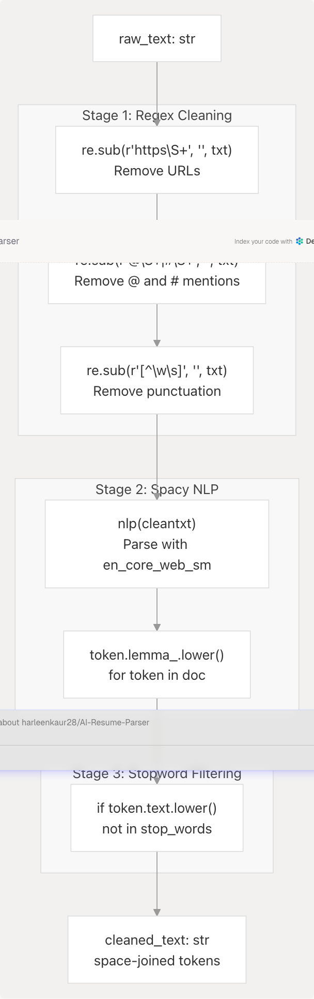
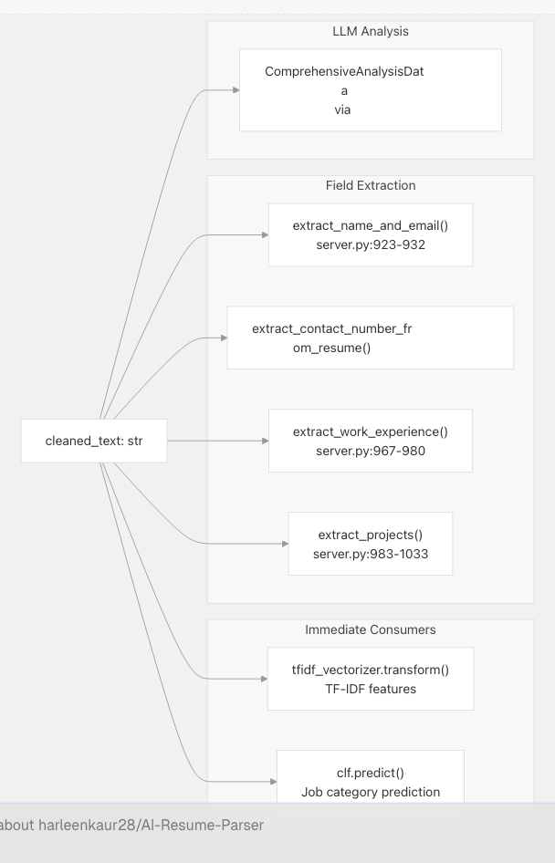

# Text Extraction & Cleaning

## Purpose and Scope

This document describes the text extraction and cleaning subsystem within the Resume Analysis Service. It covers how raw resume files (PDF, DOCX, TXT) are converted into clean, structured text suitable for downstream processing by ML classifiers and LLM-based analysis.

For information about the ML classification pipeline that follows text extraction, see [ML Classification Pipeline](3.1.2-ml-classification-pipeline). For comprehensive LLM-based analysis, see [Comprehensive Analysis with LLM](3.1.3-comprehensive-analysis-with-llm).

---

## Overview

Text extraction and cleaning is the foundational step in the resume analysis pipeline. Raw resume documents arrive in various formats and contain inconsistent formatting, special characters, URLs, and artifacts from PDF/DOCX conversion. This subsystem normalizes all inputs into clean, lemmatized text that preserves semantic content while removing noise.

The process operates in three stages:

1. **Format-specific extraction** - Converting binary/structured formats to plain text
2. **Regex-based cleaning** - Removing URLs, special characters, and artifacts
3. **NLP-based normalization** - Lemmatization and stopword removal using Spacy and NLTK

An optional fourth stage uses Google Gemini LLM to reformat extracted text into professional resume structure, though this is computationally expensive and reserved for cases where raw extraction produces poor quality output.

---

## Architecture Overview


**Sources:** [backend/server.py738-898](https://github.com/harleenkaur28/AI-Resume-Parser/blob/b2bbd83d/backend/server.py#L738-L898)

---

## File Format Support

The system supports four file formats with dedicated extraction handlers:

| Format | Extension | Handler | Library | Line Reference |
| --- | --- | --- | --- | --- |
| Plain Text | `.txt` | UTF-8 decode | Python built-in | [server.py769-770](https://github.com/harleenkaur28/AI-Resume-Parser/blob/b2bbd83d/server.py#L769-L770) |
| Markdown | `.md` | UTF-8 decode | Python built-in | [server.py769-770](https://github.com/harleenkaur28/AI-Resume-Parser/blob/b2bbd83d/server.py#L769-L770) |
| PDF | `.pdf` | `PdfReader` | PyPDF2 | [server.py772-775](https://github.com/harleenkaur28/AI-Resume-Parser/blob/b2bbd83d/server.py#L772-L775) |
| Word Document | `.docx` | `Document` | python-docx | [server.py777-780](https://github.com/harleenkaur28/AI-Resume-Parser/blob/b2bbd83d/server.py#L777-L780) |

### Format Detection

Format detection is performed via file extension matching in the `process_document()` function:

```
file_extension = os.path.splitext(file_name)[1].lower()
```

Invalid or unsupported formats return `None` and are rejected at the API layer.

**Sources:** [backend/server.py764-793](https://github.com/harleenkaur28/AI-Resume-Parser/blob/b2bbd83d/backend/server.py#L764-L793)

---

## Text Extraction Pipeline

### PDF Extraction

PDF text extraction uses the `PyPDF2` library with page-by-page iteration:


The `extract_text_from_pdf()` function ([server.py752-762](https://github.com/harleenkaur28/AI-Resume-Parser/blob/b2bbd83d/server.py#L752-L762)) handles the extraction:

* Wraps bytes in `io.BytesIO` for file-like interface
* Iterates all pages using `PdfReader.pages`
* Concatenates text with `page.extract_text() or ""`
* Returns empty string if extraction fails

**Sources:** [backend/server.py752-762](https://github.com/harleenkaur28/AI-Resume-Parser/blob/b2bbd83d/backend/server.py#L752-L762) [backend/server.py772-775](https://github.com/harleenkaur28/AI-Resume-Parser/blob/b2bbd83d/backend/server.py#L772-L775)

### DOCX Extraction

Word document extraction uses the `python-docx` library to iterate paragraphs:

```
doc = Document(io.BytesIO(file_bytes))
for para in doc.paragraphs:
    raw_text += para.text + "\n"
```

Each paragraph is extracted sequentially and newlines are preserved to maintain document structure.

**Sources:** [backend/server.py777-780](https://github.com/harleenkaur28/AI-Resume-Parser/blob/b2bbd83d/backend/server.py#L777-L780)

### TXT/MD Extraction

Plain text and Markdown files are decoded directly from bytes:

```
raw_text = file_bytes.decode()
```

UTF-8 encoding is assumed. Decoding errors result in exceptions caught at the API layer.

**Sources:** [backend/server.py769-770](https://github.com/harleenkaur28/AI-Resume-Parser/blob/b2bbd83d/backend/server.py#L769-L770)

---

## Text Cleaning Pipeline

The `clean_resume()` function ([server.py738-750](https://github.com/harleenkaur28/AI-Resume-Parser/blob/b2bbd83d/server.py#L738-L750)) applies a multi-stage cleaning process to extracted text:



### Stage 1: Regex Cleaning

Three regex substitutions remove unwanted patterns:

1. **URL Removal** - `r"https\\S+"` pattern removes all HTTPS URLs
2. **Mention Removal** - `r"@\\S+|#\\S+"` removes Twitter-style @ mentions and hashtags
3. **Punctuation Removal** - `r"[^\w\s]"` keeps only alphanumeric characters and whitespace

**Sources:** [backend/server.py740-742](https://github.com/harleenkaur28/AI-Resume-Parser/blob/b2bbd83d/backend/server.py#L740-L742)

### Stage 2: Spacy Lemmatization

The `en_core_web_sm` Spacy model ([server.py702](https://github.com/harleenkaur28/AI-Resume-Parser/blob/b2bbd83d/server.py#L702-L702)) provides:

* Part-of-speech tagging
* Dependency parsing
* Lemmatization (converting words to base form: "running" → "run")

Each token is converted to lowercase lemma: `token.lemma_.lower()`

**Sources:** [backend/server.py744-746](https://github.com/harleenkaur28/AI-Resume-Parser/blob/b2bbd83d/backend/server.py#L744-L746)

### Stage 3: NLTK Stopword Removal

English stopwords from NLTK corpus are filtered:

```
stop_words = set(stopwords.words("english"))
tokens = [token.lemma_.lower() for token in doc 
          if token.text.lower() not in stop_words]
```

This removes common words like "the", "is", "at", "which" that carry minimal semantic value for classification.

**Sources:** [backend/server.py711](https://github.com/harleenkaur28/AI-Resume-Parser/blob/b2bbd83d/backend/server.py#L711-L711) [backend/server.py745-746](https://github.com/harleenkaur28/AI-Resume-Parser/blob/b2bbd83d/backend/server.py#L745-L746)

### Output Format

The cleaned tokens are joined with spaces:

```
return " ".join(tokens)
```

Example transformation:

| Stage | Text |
| --- | --- |
| Raw | "I'm working at Google Inc. Visit <https://google.com> for more info!" |
| After Regex | "Im working at Google Inc Visit googol com for more info" |
| After Lemma | "i be work at google inc visit google com for more info" |
| After Stopwords | "work google inc visit google info" |

**Sources:** [backend/server.py749](https://github.com/harleenkaur28/AI-Resume-Parser/blob/b2bbd83d/backend/server.py#L749-L749)

---

## Optional LLM-Based Formatting

The `format_resume_text_with_llm()` function ([server.py795-898](https://github.com/harleenkaur28/AI-Resume-Parser/blob/b2bbd83d/server.py#L795-L898)) provides advanced resume formatting using Google Gemini when raw extraction produces poorly structured output.

### When LLM Formatting is Used

This expensive operation is triggered only for:

* Resumes with severe formatting issues from PDF extraction
* Documents where structural information is critical
* Cases where `ComprehensiveAnalysisData` generation requires clean input

### LLM Formatting Process


### Prompt Template

The formatting prompt ([server.py843-867](https://github.com/harleenkaur28/AI-Resume-Parser/blob/b2bbd83d/server.py#L843-L867)) instructs the LLM to:

1. **Preserve all key information** - Experience, education, skills, projects, contact info
2. **Logical presentation** - Organize sections consistently (Contact, Summary, Experience, Education, Skills, Projects)
3. **Clarity and readability** - Correct spacing, consistent formatting
4. **Remove artifacts** - Eliminate "Page 1 of 2", file paths, watermarks
5. **Conciseness** - Optimize phrasing without altering meaning
6. **Plain text output** - No commentary, preamble, or markdown

### Error Handling

The function implements graceful fallback:

* API key validation errors → return original text
* Rate limit errors → return original text with warning
* Authentication errors → return original text with warning
* All exceptions caught and logged

**Sources:** [backend/server.py795-898](https://github.com/harleenkaur28/AI-Resume-Parser/blob/b2bbd83d/backend/server.py#L795-L898)

---

## Dependencies and Configuration

### Python Libraries

| Library | Purpose | Version Constraint | Configuration |
| --- | --- | --- | --- |
| `PyPDF2` | PDF text extraction | Not specified | None required |
| `python-docx` | DOCX parsing | Via `docx` import | None required |
| `spacy` | NLP pipeline | Not specified | Model: `en_core_web_sm` |
| `nltk` | Stopwords corpus | `>=3.9.1` | Data dir: `backend/app/model/nltk_data` |
| `re` | Regex operations | Built-in | None required |

**Sources:** [backend/server.py1-50](https://github.com/harleenkaur28/AI-Resume-Parser/blob/b2bbd83d/backend/server.py#L1-L50) [backend/pyproject.toml1-40](https://github.com/harleenkaur28/AI-Resume-Parser/blob/b2bbd83d/backend/pyproject.toml#L1-L40)

### NLTK Data Initialization

NLTK data is downloaded on startup to a custom directory:

```
NLTK_DATA_PATH = os.path.join(
    os.path.dirname(__file__),
    "app",
    "model",
    "nltk_data",
)
nltk.data.path.append(NLTK_DATA_PATH)
nltk.download("punkt", download_dir=NLTK_DATA_PATH)
nltk.download("stopwords", download_dir=NLTK_DATA_PATH)
stop_words = set(stopwords.words("english"))
```

This ensures consistent tokenization and stopword data across deployments.

**Sources:** [backend/server.py660-711](https://github.com/harleenkaur28/AI-Resume-Parser/blob/b2bbd83d/backend/server.py#L660-L711)

### Spacy Model Loading

The English core model is loaded once at module import:

```
nlp = spacy.load("en_core_web_sm")
```

The model must be installed separately:

```
python -m spacy download en_core_web_sm
```

Or via the project's `pyproject.toml` which includes it as a URL dependency from the Spacy models repository.

**Sources:** [backend/server.py702](https://github.com/harleenkaur28/AI-Resume-Parser/blob/b2bbd83d/backend/server.py#L702-L702) [backend/pyproject.toml19](https://github.com/harleenkaur28/AI-Resume-Parser/blob/b2bbd83d/backend/pyproject.toml#L19-L19) [backend/pyproject.toml39](https://github.com/harleenkaur28/AI-Resume-Parser/blob/b2bbd83d/backend/pyproject.toml#L39-L39)

---

## Integration with Resume Analysis Pipeline

The cleaned text output flows into downstream components:



**Cleaned text** is used by:

* **TF-IDF Vectorizer** for numerical feature extraction (see [ML Classification Pipeline](3.1.2-ml-classification-pipeline))
* **Regex extractors** for structured field parsing
* **LLM prompts** for semantic analysis (see [Comprehensive Analysis with LLM](3.1.3-comprehensive-analysis-with-llm))

**Raw text** is preserved and used by:

* **LLM comprehensive analysis** for richer context
* **Field extractors** that require original formatting (dates, company names)

**Sources:** [backend/server.py738-1033](https://github.com/harleenkaur28/AI-Resume-Parser/blob/b2bbd83d/backend/server.py#L738-L1033)

---

## Performance Characteristics

| Operation | Typical Duration | Bottleneck |
| --- | --- | --- |
| PDF Extraction (10-page resume) | 100-300ms | PyPDF2 page iteration |
| DOCX Extraction (5-page resume) | 50-150ms | python-docx paragraph parsing |
| Regex Cleaning | 5-10ms | Minimal overhead |
| Spacy NLP Processing | 200-500ms | Model inference |
| NLTK Stopword Filtering | 5-10ms | Set lookup |
| **Total (no LLM)** | **300-900ms** | Spacy lemmatization |
| LLM Formatting (optional) | 2-5 seconds | Gemini API latency |

The cleaning pipeline is CPU-bound and runs synchronously. For high-throughput scenarios, consider:

* Caching cleaned text keyed by file hash
* Parallel processing of multiple uploads
* Skipping Spacy if classification accuracy is acceptable without lemmatization

**Sources:** [backend/server.py738-898](https://github.com/harleenkaur28/AI-Resume-Parser/blob/b2bbd83d/backend/server.py#L738-L898)

---

## Error Handling and Edge Cases

### Supported Error Scenarios

| Scenario | Handling | User Impact |
| --- | --- | --- |
| Unsupported file type | Return `None` from `process_document()` | HTTP 400 from API endpoint |
| Corrupted PDF | PyPDF2 raises exception | Caught at API layer, returns error |
| Empty file | Returns empty string | Validation error from downstream |
| Non-UTF8 TXT file | Decode raises `UnicodeDecodeError` | Caught at API layer |
| Missing Spacy model | `spacy.load()` raises `OSError` | Application fails to start |
| NLTK data missing | Downloads on first import | Startup delay (30-60s) |
| LLM API failure | Returns original raw text | Processing continues with unformatted text |

### Validation

Resume validity is checked by `is_valid_resume()` ([server.py901-920](https://github.com/harleenkaur28/AI-Resume-Parser/blob/b2bbd83d/server.py#L901-L920)):

```
resume_keywords = [
    "Experience", "Education", "Skills", "Profile", 
    "Work History", "Projects", "Certifications"
]
if any(re.search(keyword, text, re.I) for keyword in resume_keywords):
    return True
return False
```

Documents without common resume sections are rejected.

**Sources:** [backend/server.py901-920](https://github.com/harleenkaur28/AI-Resume-Parser/blob/b2bbd83d/backend/server.py#L901-L920)

---

## Summary

The text extraction and cleaning subsystem provides a robust, multi-format document processing pipeline that:

1. **Handles 4 document formats** - PDF, DOCX, TXT, MD with dedicated extractors
2. **Applies 3-stage cleaning** - Regex → Spacy lemmatization → NLTK stopword removal
3. **Optionally formats with LLM** - Google Gemini for severe formatting issues
4. **Validates output** - Ensures extracted text contains resume-like content
5. **Integrates seamlessly** - Provides clean text to ML classifiers and LLM analyzers

This preprocessing is critical for downstream accuracy, as noisy input degrades both ML classification and LLM-based analysis.

**Sources:** [backend/server.py738-920](https://github.com/harleenkaur28/AI-Resume-Parser/blob/b2bbd83d/backend/server.py#L738-L920)
