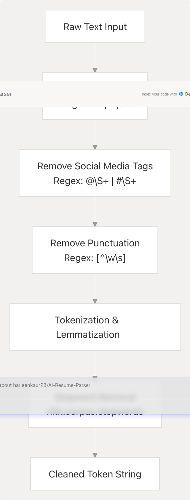
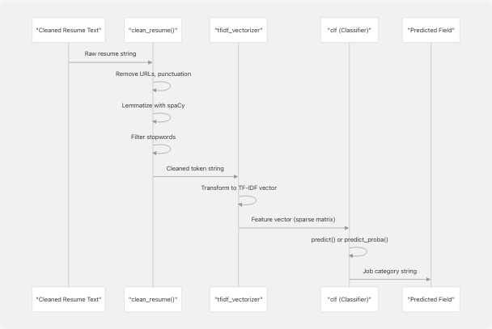
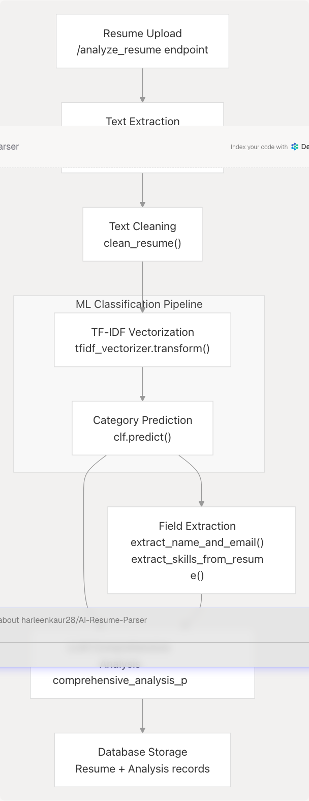

# ML Classification Pipeline

## Purpose and Scope

This document describes the traditional machine learning classification pipeline used to predict job categories from resume text. This pipeline uses a pre-trained TF-IDF vectorizer and scikit-learn classifier to categorize resumes into 25 distinct job fields (e.g., "Java Developer", "Data Science", "HR", etc.). This classification step occurs early in the resume analysis workflow and provides the predicted field that informs subsequent LLM-based comprehensive analysis.

For information about text extraction and preprocessing before classification, see [Text Extraction & Cleaning](3.1.1-text-extraction-and-cleaning). For details on how the predicted category is used by the LLM for structured data extraction, see [Comprehensive Analysis with LLM](3.1.3-comprehensive-analysis-with-llm).

---

## System Architecture

The ML classification pipeline operates as a standalone component within the resume analysis service. It receives cleaned text and returns a predicted job category string.


**Diagram: ML Classification Pipeline Flow**

---

## Pre-trained Model Artifacts

The classification system relies on two serialized model files loaded at server startup:

| Model File | Type | Purpose | Load Location |
| --- | --- | --- | --- |
| `best_model.pkl` | scikit-learn classifier | Predicts 1 of 25 job categories from TF-IDF features | [backend/server.py714-724](https://github.com/harleenkaur28/AI-Resume-Parser/blob/b2bbd83d/backend/server.py#L714-L724) |
| `tfidf.pkl` | TF-IDF vectorizer | Transforms cleaned text into numerical feature vectors | [backend/server.py726-735](https://github.com/harleenkaur28/AI-Resume-Parser/blob/b2bbd83d/backend/server.py#L726-L735) |

### Model Loading Implementation

Both models are loaded at module initialization using Python's `pickle` module:

```
clf = pickle.load(
    open(
        os.path.join(
            os.path.dirname(__file__),
            "app",
            "model",
            "best_model.pkl",
        ),
        "rb",
    )
)
tfidf_vectorizer = pickle.load(
    open(
        os.path.join(
            os.path.dirname(__file__),
            "app",
            "model",
            "tfidf.pkl",
        ),
        "rb",
    )
)
```

**File Structure:**

```
backend/
  app/
    model/
      best_model.pkl     # Trained classifier
      tfidf.pkl          # Fitted TF-IDF vectorizer
      nltk_data/         # NLTK stopwords corpus
```

---

## Text Preprocessing Pipeline

Before classification, resume text undergoes a multi-stage cleaning pipeline implemented in the `clean_resume()` function.



**Diagram: Text Cleaning Stages**

### Implementation Details

The `clean_resume()` function performs the following operations sequentially:

1. **URL Removal**: Strips all HTTP(S) URLs
2. **Social Media Tag Removal**: Removes @ mentions and # hashtags
3. **Punctuation Removal**: Keeps only alphanumeric characters and whitespace
4. **Lemmatization**: Uses spaCy's `en_core_web_sm` model to convert tokens to base forms
5. **Stopword Filtering**: Removes common English stopwords using NLTK's corpus

```
def clean_resume(txt):
    """Clean the resume text by removing unwanted characters and lemmatizing."""
    cleantxt = re.sub(r"https\\S+", "", txt)
    cleantxt = re.sub(r"@\\S+|#\\S+", "", cleantxt)
    cleantxt = re.sub(r"[^\w\s]", "", cleantxt)

    doc = nlp(cleantxt)
    tokens = [
        token.lemma_.lower() for token in doc if token.text.lower() not in stop_words
    ]

    return " ".join(tokens)
```

**Key Dependencies:**

* `spacy`: NLP tokenization and lemmatization
* `nltk.corpus.stopwords`: English stopword list
* `re`: Regular expression pattern matching

---

## Classification Process

The classification process transforms cleaned text into a predicted job category through vectorization and model inference.



**Diagram: Classification Sequence**

### TF-IDF Vectorization

The `tfidf_vectorizer` object is a fitted instance of scikit-learn's `TfidfVectorizer`. It maintains:

* **Vocabulary**: Learned token-to-index mapping
* **IDF Weights**: Inverse document frequency values from training corpus
* **Transform Method**: Converts text to sparse feature vectors

The vectorizer applies:

1. **Term Frequency (TF)**: Count of each token in the document
2. **Inverse Document Frequency (IDF)**: Log-scaled inverse of token's document frequency
3. **L2 Normalization**: Scales vectors to unit length

### Classifier Architecture

The `clf` object (loaded from `best_model.pkl`) is a trained scikit-learn classifier. Based on typical resume classification implementations, this is likely:

* **Model Type**: Logistic Regression, SVM, or Naive Bayes
* **Output Space**: 25 job categories
* **Prediction Method**: `clf.predict(features)` returns single category
* **Probability Method**: `clf.predict_proba(features)` returns confidence scores

**Job Categories (25 total)**: The classifier predicts one of 25 distinct job fields including roles such as "Java Developer", "Python Developer", "Data Science", "DevOps Engineer", "HR", "Sales", "Advocate", etc.

---

## Integration with Resume Analysis Workflow

The classification pipeline integrates with the broader resume analysis system at multiple points:



**Diagram: Classification Pipeline Integration**

### Role in Analysis Flow

1. **Input Source**: Receives cleaned text from `extract_text_from_pdf()`, `process_document()`, or similar extraction functions
2. **Preprocessing**: Applies `clean_resume()` for normalization
3. **Prediction**: Returns predicted job field as string
4. **Downstream Usage**:
   * Passed to LLM as `predicted_category` or `predicted_field` in comprehensive analysis prompts
   * Stored in database as `predicted_field` column
   * Used by tips generator for category-specific advice
   * Informs skills inference when resume lacks explicit skills section

### Prompt Integration Example

The predicted category is injected into LLM prompts:

```
comprehensive_analysis_prompt_template_str_v2 = """
...
Input:
- Raw Resume Text:
```text
{extracted_resume_text}
```

* Basic Extracted Info (Name, Email, Contact – use these if provided, otherwise extract):

```
{basic_info_json}
```

Instructions:

1. Name, Email, Contact: Populate from `basic_info_json`; if missing, extract from `extracted_resume_text`.
2. Predicted Field:
   * Examine the resume's skills, projects, job titles, and domain-specific keywords.
   * Infer the candidate's primary professional field (e.g., "Software Engineering", "Data Science", ...)
     ...
     """

```

---

## NLP Dependencies and Configuration

The classification pipeline requires several NLP libraries and data resources configured at server startup.

### Dependency Installation

```python
# Dependencies from pyproject.toml
dependencies = [
    "scikit-learn>=1.7.0",    # ML classifier and TF-IDF vectorizer
    "spacy>=3.8.7",           # Lemmatization and tokenization
    "nltk>=3.9.1",            # Stopwords corpus
    "en-core-web-sm",         # spaCy English language model
]
```

### Runtime Initialization

```
# NLTK data path configuration
NLTK_DATA_PATH = os.path.join(
    os.path.dirname(__file__),
    "app",
    "model",
    "nltk_data",
)

if not os.path.exists(NLTK_DATA_PATH):
    os.makedirs(NLTK_DATA_PATH)

nltk.data.path.append(NLTK_DATA_PATH)

# Load language models and corpora
nlp = spacy.load("en_core_web_sm")
nltk.download("punkt", download_dir=NLTK_DATA_PATH)
nltk.download("stopwords", download_dir=NLTK_DATA_PATH)
stop_words = set(stopwords.words("english"))
```

**Resource Loading Sequence:**

1. Create NLTK data directory if missing
2. Append custom path to NLTK search paths
3. Load spaCy's English model (`en_core_web_sm`)
4. Download NLTK punkt tokenizer
5. Download NLTK stopwords corpus
6. Initialize stopword set for English

---

## Model Training and Maintenance

While the model artifacts are pre-trained and serialized, the training process likely involved:

### Training Data Requirements

* **Dataset**: Labeled resume corpus with 25 job category labels
* **Features**: TF-IDF features extracted from cleaned resume text
* **Preprocessing**: Same `clean_resume()` pipeline applied to training data

### Model Selection and Tuning

The filename `best_model.pkl` suggests a model selection process:

* Multiple algorithms likely evaluated (e.g., Logistic Regression, SVM, Random Forest)
* Hyperparameter tuning via cross-validation
* Best performing model serialized for production

### TF-IDF Hyperparameters

Common TF-IDF configuration for resume classification:

* **Max Features**: 5000-10000 most frequent tokens
* **N-gram Range**: Unigrams and bigrams (1,2)
* **Min/Max DF**: Filter extremely rare/common terms
* **Sublinear TF**: Use log scaling for term frequencies

**Note**: Actual hyperparameters are embedded in the serialized `tfidf.pkl` object.

---

## Performance Considerations

### Inference Latency

The ML classification pipeline is optimized for low-latency predictions:

| Operation | Typical Latency | Notes |
| --- | --- | --- |
| Text Cleaning | 50-200ms | spaCy lemmatization is compute-intensive |
| TF-IDF Transform | 10-50ms | Sparse matrix operations, scales with vocabulary size |
| Classifier Prediction | 5-20ms | Linear models (LogReg, SVM) are fast |
| **Total** | **65-270ms** | Significantly faster than LLM analysis (4-8s) |

### Memory Footprint

* **TF-IDF Vectorizer**: ~10-50 MB (vocabulary + IDF weights)
* **Classifier Model**: ~5-20 MB (depends on algorithm)
* **spaCy Model**: ~12 MB (`en_core_web_sm`)
* **NLTK Data**: ~1 MB (stopwords corpus)

All models loaded once at startup and held in memory for fast inference.

### Scalability

The classification pipeline supports horizontal scaling:

* Models are thread-safe for concurrent requests
* No state mutation during inference
* Can deploy multiple FastAPI worker processes
* Each worker loads its own model copies

---

## Error Handling and Edge Cases

### Invalid Input Handling

The `clean_resume()` function gracefully handles various edge cases:

* **Empty Text**: Returns empty string after cleaning
* **Non-ASCII Characters**: Removed during punctuation filtering
* **Extremely Short Text**: May result in low-confidence predictions
* **Non-English Text**: spaCy model designed for English; other languages produce poor lemmatization

### Model Prediction Edge Cases

* **Unknown Vocabulary**: TF-IDF vectorizer ignores tokens not in training vocabulary
* **All-Zero Feature Vector**: Occurs when no known tokens present; classifier returns default prediction
* **Confidence Thresholds**: System does not currently reject low-confidence predictions

### Fallback Behavior

When classification fails or returns unexpected results:

1. Predicted field still passed to LLM with note "uncertain"
2. LLM instructed to infer field from resume content directly
3. Database stores any predicted field value for audit trail

---

## Future Enhancements

Potential improvements to the classification pipeline:

1. **Confidence Scoring**: Expose `predict_proba()` scores to assess prediction reliability
2. **Multi-label Classification**: Support resumes spanning multiple fields
3. **Model Retraining**: Implement periodic retraining on newly analyzed resumes
4. **Category Expansion**: Add more granular job categories beyond current 25
5. **Feature Engineering**: Include metadata features (document length, formatting patterns)
6. **Neural Embeddings**: Replace TF-IDF with contextual embeddings (BERT, Sentence-Transformers)

---

## Code Entity Reference

### Key Functions

| Function | File Location | Purpose |
| --- | --- | --- |
| `clean_resume(txt)` | [backend/server.py738-749](https://github.com/harleenkaur28/AI-Resume-Parser/blob/b2bbd83d/backend/server.py#L738-L749) | Preprocess text for classification |
| `predict_category(cleaned_text)` | Inferred usage | Transform text and predict category |

### Key Variables

| Variable | File Location | Type | Description |
| --- | --- | --- | --- |
| `clf` | [backend/server.py714-724](https://github.com/harleenkaur28/AI-Resume-Parser/blob/b2bbd83d/backend/server.py#L714-L724) | sklearn classifier | Trained model for 25-category prediction |
| `tfidf_vectorizer` | [backend/server.py726-735](https://github.com/harleenkaur28/AI-Resume-Parser/blob/b2bbd83d/backend/server.py#L726-L735) | TfidfVectorizer | Fitted feature extractor |
| `nlp` | [backend/server.py702](https://github.com/harleenkaur28/AI-Resume-Parser/blob/b2bbd83d/backend/server.py#L702-L702) | spacy.Language | English language model |
| `stop_words` | [backend/server.py711](https://github.com/harleenkaur28/AI-Resume-Parser/blob/b2bbd83d/backend/server.py#L711-L711) | set | NLTK English stopwords |

### Model File Paths

```
backend/app/model/
  ├── best_model.pkl      # Trained classifier
  ├── tfidf.pkl          # Fitted TF-IDF vectorizer
  └── nltk_data/         # Downloaded NLTK corpora
      ├── corpora/
      │   └── stopwords/
      └── tokenizers/
          └── punkt/
```
