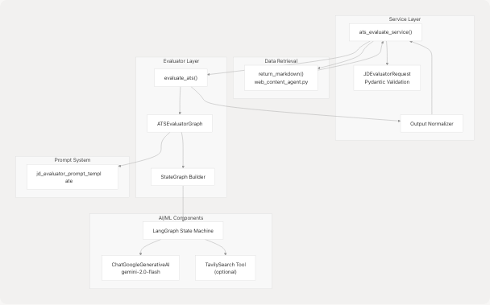
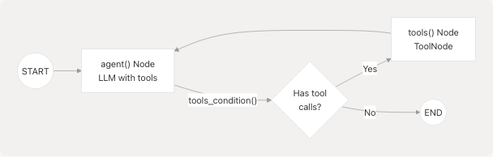
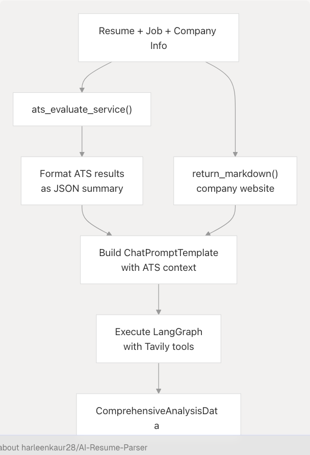

# ATS Evaluation Service

> Source: https://deepwiki.com/harleenkaur28/AI-Resume-Parser/3.2-ats-evaluation-service

# ATS Evaluation Service

Relevant source files

* [backend/app/agents/\_\_init\_\_.py](https://github.com/harleenkaur28/AI-Resume-Parser/blob/b2bbd83d/backend/app/agents/__init__.py)
* [backend/app/agents/web\_content\_agent.py](https://github.com/harleenkaur28/AI-Resume-Parser/blob/b2bbd83d/backend/app/agents/web_content_agent.py)
* [backend/app/agents/websearch\_agent.py](https://github.com/harleenkaur28/AI-Resume-Parser/blob/b2bbd83d/backend/app/agents/websearch_agent.py)
* [backend/app/models/schemas.py](https://github.com/harleenkaur28/AI-Resume-Parser/blob/b2bbd83d/backend/app/models/schemas.py)
* [backend/app/services/ats.py](https://github.com/harleenkaur28/AI-Resume-Parser/blob/b2bbd83d/backend/app/services/ats.py)
* [backend/app/services/ats\_evaluator/graph.py](https://github.com/harleenkaur28/AI-Resume-Parser/blob/b2bbd83d/backend/app/services/ats_evaluator/graph.py)
* [backend/app/services/linkedin\_profile.py](https://github.com/harleenkaur28/AI-Resume-Parser/blob/b2bbd83d/backend/app/services/linkedin_profile.py)
* [backend/app/services/resume\_generator/graph.py](https://github.com/harleenkaur28/AI-Resume-Parser/blob/b2bbd83d/backend/app/services/resume_generator/graph.py)
* [backend/app/services/tailored\_resume.py](https://github.com/harleenkaur28/AI-Resume-Parser/blob/b2bbd83d/backend/app/services/tailored_resume.py)

## Purpose and Scope

The ATS Evaluation Service scores resumes against job descriptions to predict how well they will perform in Applicant Tracking Systems. The service analyzes resume-JD compatibility, provides numerical scores (0-100), and generates actionable improvement suggestions. It leverages Google Gemini 2.0 Flash through a LangGraph state machine to perform semantic matching, keyword analysis, and company-specific tailoring recommendations.

For resume analysis and classification, see [Resume Analysis Service](/harleenkaur28/AI-Resume-Parser/3.1-resume-analysis-service). For generating tailored resumes based on ATS feedback, see [Tailored Resume Service](/harleenkaur28/AI-Resume-Parser/3.5-tailored-resume-service).

---

## Service Overview

The ATS Evaluation Service operates as a two-layer architecture:

1. **Service Layer** ([backend/app/services/ats.py](https://github.com/harleenkaur28/AI-Resume-Parser/blob/b2bbd83d/backend/app/services/ats.py)) - Validates inputs, handles JD retrieval from URLs, and normalizes outputs
2. **Evaluator Layer** ([backend/app/services/ats\_evaluator/graph.py](https://github.com/harleenkaur28/AI-Resume-Parser/blob/b2bbd83d/backend/app/services/ats_evaluator/graph.py)) - Executes LangGraph workflow with LLM and optional web research tools

The service accepts either raw job description text or a URL, fetches company website content for context, and returns a structured evaluation with score justification and improvement recommendations.

**Sources:** [backend/app/services/ats.py1-214](https://github.com/harleenkaur28/AI-Resume-Parser/blob/b2bbd83d/backend/app/services/ats.py#L1-L214) [backend/app/services/ats\_evaluator/graph.py1-213](https://github.com/harleenkaur28/AI-Resume-Parser/blob/b2bbd83d/backend/app/services/ats_evaluator/graph.py#L1-L213)

---

## Data Models

### Input Models

The service uses two request models depending on the calling context:

#### JDEvaluatorRequest

Primary request model used internally by the service layer:

| Field | Type | Required | Description |
| --- | --- | --- | --- |
| `company_name` | `Optional[str]` | No | Company name for context |
| `company_website_content` | `Optional[str]` | No | Pre-fetched website content |
| `jd` | `str` | Yes | Job description text (min 1 char) |
| `jd_link` | `Optional[str]` | No | Alternative to `jd` text |
| `resume` | `str` | Yes | Resume text (min 1 char) |

#### ATSEvaluationRequest

Alternative request model for API endpoints:

| Field | Type | Required | Description |
| --- | --- | --- | --- |
| `resume_text` | `str` | Yes | Full resume text |
| `jd_text` | `str` | Yes | Job description text |
| `company_name` | `Optional[str]` | No | Company name |
| `company_website` | `Optional[str]` | No | Company website URL |

**Sources:** [backend/app/models/schemas.py475-486](https://github.com/harleenkaur28/AI-Resume-Parser/blob/b2bbd83d/backend/app/models/schemas.py#L475-L486) [backend/app/models/schemas.py460-465](https://github.com/harleenkaur28/AI-Resume-Parser/blob/b2bbd83d/backend/app/models/schemas.py#L460-L465)

### Output Models

#### JDEvaluatorResponse

Structured response returned by the service:

| Field | Type | Description |
| --- | --- | --- |
| `success` | `bool` | Operation success flag (default: `True`) |
| `message` | `str` | Human-readable status message |
| `score` | `int` | ATS compatibility score (0-100) |
| `reasons_for_the_score` | `List[str]` | Justifications for the assigned score |
| `suggestions` | `List[str]` | Actionable improvement recommendations |

The service normalizes all output to match this schema, handling edge cases like unparseable JSON or missing fields.

**Sources:** [backend/app/models/schemas.py488-499](https://github.com/harleenkaur28/AI-Resume-Parser/blob/b2bbd83d/backend/app/models/schemas.py#L488-L499)

---

## Service Architecture

### Component Diagram


```

**Sources:** [backend/app/services/ats.py24-192](https://github.com/harleenkaur28/AI-Resume-Parser/blob/b2bbd83d/backend/app/services/ats.py#L24-L192) [backend/app/services/ats\_evaluator/graph.py42-120](https://github.com/harleenkaur28/AI-Resume-Parser/blob/b2bbd83d/backend/app/services/ats_evaluator/graph.py#L42-L120)

### Service Layer Implementation

The `ats_evaluate_service()` function orchestrates the evaluation workflow:

1. **JD Retrieval** - If `jd_link` is provided instead of `jd_text`, fetches content via `return_markdown()` from the web content agent
2. **Validation** - Constructs `JDEvaluatorRequest` to validate all inputs using Pydantic
3. **Evaluation** - Calls `evaluate_ats()` with normalized inputs
4. **Normalization** - Parses JSON output, handles malformed responses, and ensures all required fields exist

```

```

**Sources:** [backend/app/services/ats.py24-113](https://github.com/harleenkaur28/AI-Resume-Parser/blob/b2bbd83d/backend/app/services/ats.py#L24-L113) [backend/app/services/ats.py142-191](https://github.com/harleenkaur28/AI-Resume-Parser/blob/b2bbd83d/backend/app/services/ats.py#L142-L191)

---

## LangGraph State Machine Implementation

### ATSEvaluatorGraph Class

The `ATSEvaluatorGraph` class in [backend/app/services/ats\_evaluator/graph.py48-120](https://github.com/harleenkaur28/AI-Resume-Parser/blob/b2bbd83d/backend/app/services/ats_evaluator/graph.py#L48-L120) encapsulates the LangGraph workflow:

**Constructor Parameters:**

* `resume_text: str` - Full resume content
* `jd_text: str` - Job description
* `company_name: str | None` - Company name for research
* `company_website: str | None` - Website URL to fetch via `return_markdown()`
* `llm: ChatGoogleGenerativeAI | None` - Optional LLM instance (uses shared `app.core.llm.llm` by default)
* `config: GraphConfig | None` - Model configuration (default: `MODEL_NAME`, temp 0.1)

### Graph Architecture

```

```

**Sources:** [backend/app/services/ats\_evaluator/graph.py98-116](https://github.com/harleenkaur28/AI-Resume-Parser/blob/b2bbd83d/backend/app/services/ats_evaluator/graph.py#L98-L116)

### Tool Integration

The graph conditionally binds `TavilySearch` if `TAVILY_API_KEY` is configured:

```
```
def _try_init_tavily() -> list:
    try:
        from langchain_tavily import TavilySearch
        return [TavilySearch(max_results=3, topic="general")]
    except Exception:
        return []
```
```

Tools are bound to the LLM using `llm.bind_tools(tools=self.tools)`, enabling the model to request web searches for company research during evaluation.

**Sources:** [backend/app/services/ats\_evaluator/graph.py27-40](https://github.com/harleenkaur28/AI-Resume-Parser/blob/b2bbd83d/backend/app/services/ats_evaluator/graph.py#L27-L40) [backend/app/services/ats\_evaluator/graph.py73-80](https://github.com/harleenkaur28/AI-Resume-Parser/blob/b2bbd83d/backend/app/services/ats_evaluator/graph.py#L73-L80)

### Agent Node Function

The `agent()` method processes messages through the LLM:

```
```
def agent(self, state: MessagesState):
    msgs = state["messages"]
    inp = [*self.system_prompt] + msgs
    response = self.llm_with_tools.invoke(inp)
    return {"messages": [response]}
```
```

The system prompt is constructed from `jd_evaluator_prompt_template` with:

* Resume text
* Job description
* Company name (or "the company")
* Company website content (fetched via `return_markdown()`)

**Sources:** [backend/app/services/ats\_evaluator/graph.py92-96](https://github.com/harleenkaur28/AI-Resume-Parser/blob/b2bbd83d/backend/app/services/ats_evaluator/graph.py#L92-L96) [backend/app/services/ats\_evaluator/graph.py82-89](https://github.com/harleenkaur28/AI-Resume-Parser/blob/b2bbd83d/backend/app/services/ats_evaluator/graph.py#L82-L89)

---

## Evaluation Workflow

### evaluate\_ats() Function

The `evaluate_ats()` function executes the graph and parses the JSON output:

```

```

**Sources:** [backend/app/services/ats\_evaluator/graph.py122-207](https://github.com/harleenkaur28/AI-Resume-Parser/blob/b2bbd83d/backend/app/services/ats_evaluator/graph.py#L122-L207)

### JSON Parsing Logic

The function handles multiple output formats:

1. **Code Fence Removal** - Strips `` json` and ``  markers using regex
2. **JSON Extraction** - Locates first `{` and last `}` to isolate JSON object
3. **Fallback Parsing** - If initial parse fails, attempts to parse substring between braces
4. **Error Handling** - Raises `HTTPException` with status 500 if JSON is unparseable

```
```
# Strip code fences
code_fence_pattern = re.compile(r"^```(json)?\n", re.IGNORECASE)
content_str = code_fence_pattern.sub("", content_str)
if content_str.endswith("```"):
    content_str = content_str[:content_str.rfind("```")]

# Find and parse JSON
if content_str.startswith("{"):
    json_obj = json.loads(content_str)
else:
    start = content_str.find("{")
    end = content_str.rfind("}")
    json_obj = json.loads(content_str[start:end+1])
```
```

**Sources:** [backend/app/services/ats\_evaluator/graph.py153-204](https://github.com/harleenkaur28/AI-Resume-Parser/blob/b2bbd83d/backend/app/services/ats_evaluator/graph.py#L153-L204)

---

## Integration with Other Services

### Used By Tailored Resume Service

The Tailored Resume Service ([backend/app/services/tailored\_resume.py](https://github.com/harleenkaur28/AI-Resume-Parser/blob/b2bbd83d/backend/app/services/tailored_resume.py)) calls `ats_evaluate_service()` to get ATS feedback before generating optimized resumes:

```
```
ats_result = await ats_evaluate_service(
    resume_text=resume,
    jd_text=jd,
    jd_link=None,
    company_name=company_name,
    company_website=company_website,
)
```
```

The ATS score and suggestions are then passed to the resume generation prompt to guide improvements.

**Sources:** [backend/app/services/resume\_generator/graph.py87-113](https://github.com/harleenkaur28/AI-Resume-Parser/blob/b2bbd83d/backend/app/services/resume_generator/graph.py#L87-L113)

### Used By Resume Pipeline

The `run_resume_pipeline()` function in [backend/app/services/resume\_generator/graph.py72-235](https://github.com/harleenkaur28/AI-Resume-Parser/blob/b2bbd83d/backend/app/services/resume_generator/graph.py#L72-L235) integrates ATS evaluation into the tailored resume workflow:

```

```

**Sources:** [backend/app/services/resume\_generator/graph.py86-149](https://github.com/harleenkaur28/AI-Resume-Parser/blob/b2bbd83d/backend/app/services/resume_generator/graph.py#L86-L149)

---

## Request/Response Flow

### Full End-to-End Flow

```

```

**Sources:** [backend/app/services/ats.py24-113](https://github.com/harleenkaur28/AI-Resume-Parser/blob/b2bbd83d/backend/app/services/ats.py#L24-L113) [backend/app/services/ats\_evaluator/graph.py122-207](https://github.com/harleenkaur28/AI-Resume-Parser/blob/b2bbd83d/backend/app/services/ats_evaluator/graph.py#L122-L207)

---

## Error Handling and Normalization

### Service Layer Error Handling

The service implements comprehensive error handling at multiple levels:

#### JD Retrieval Errors

```
```
try:
    jd_text = web_agent.return_markdown(jd_link)
except Exception as retrieval_error:
    logger.exception("Failed to fetch job description from link")
    raise HTTPException(
        status_code=500,
        detail="Failed to retrieve job description from link.",
    )
```
```

**Sources:** [backend/app/services/ats.py46-60](https://github.com/harleenkaur28/AI-Resume-Parser/blob/b2bbd83d/backend/app/services/ats.py#L46-L60)

#### Validation Errors

```
```
try:
    JDEvaluatorRequest(
        company_name=company_name,
        company_website_content=company_website,
        jd=jd_text,
        resume=resume_text,
    )
except ValidationError as ve:
    logger.warning("ATS evaluation validation error")
    raise HTTPException(status_code=400, detail=str(ve))
```
```

**Sources:** [backend/app/services/ats.py78-97](https://github.com/harleenkaur28/AI-Resume-Parser/blob/b2bbd83d/backend/app/services/ats.py#L78-L97)

### Output Normalization

The service normalizes the raw evaluator output to ensure `JDEvaluatorResponse` compliance:

| Field | Normalization Logic |
| --- | --- |
| `success` | `bool(analysis_json.get("success", True))` |
| `message` | `analysis_json.get("message", "") or ""` - ensures non-None string |
| `score` | `int(analysis_json.get("score", 0))` with exception handling → defaults to 0 |
| `reasons_for_the_score` | Ensures `List[str]` - converts single values to list, stringifies all items |
| `suggestions` | Ensures `List[str]` - converts single values to list, stringifies all items |

```
```
try:
    score = int(analysis_json.get("score", 0))
except Exception:
    score = 0

raw_reasons = analysis_json.get("reasons_for_the_score", []) or []
if isinstance(raw_reasons, list):
    reasons_for_the_score = [str(r) for r in raw_reasons]
else:
    reasons_for_the_score = [str(raw_reasons)]
```
```

**Sources:** [backend/app/services/ats.py142-180](https://github.com/harleenkaur28/AI-Resume-Parser/blob/b2bbd83d/backend/app/services/ats.py#L142-L180)

### Logging

The service includes structured logging at key checkpoints:

* **Entry:** `logger.debug("Starting ATS evaluation")` with company name and JD source flags
* **Invocation:** `logger.debug("Invoking ATS evaluator graph")`
* **Raw Output:** `logger.debug("ATS evaluator raw output")` with output type
* **Normalized Payload:** `logger.debug("ATS evaluator normalized payload")` with all response fields
* **Completion:** `logger.debug("ATS evaluation completed")` with final score and success flag
* **Errors:** `logger.exception()` for retrieval failures, validation errors, and general exceptions

**Sources:** [backend/app/services/ats.py33-40](https://github.com/harleenkaur28/AI-Resume-Parser/blob/b2bbd83d/backend/app/services/ats.py#L33-L40) [backend/app/services/ats.py100-189](https://github.com/harleenkaur28/AI-Resume-Parser/blob/b2bbd83d/backend/app/services/ats.py#L100-L189)

---

## Configuration

### Required Environment Variables

| Variable | Purpose | Used By |
| --- | --- | --- |
| `GOOGLE_API_KEY` | Google Generative AI authentication | `ChatGoogleGenerativeAI` LLM initialization |
| `TAVILY_API_KEY` | Tavily Search API (optional) | `TavilySearch` tool for web research |

### Model Configuration

The ATS evaluator uses `GraphConfig` dataclass with defaults:

```
```
@dataclass
class GraphConfig:
    model: str = MODEL_NAME  # "gemini-2.0-flash-exp" from app.core.llm
    temperature: float = 0.1
```
```

Low temperature (0.1) ensures deterministic, factual outputs suitable for scoring.

**Sources:** [backend/app/services/ats\_evaluator/graph.py42-46](https://github.com/harleenkaur28/AI-Resume-Parser/blob/b2bbd83d/backend/app/services/ats_evaluator/graph.py#L42-L46) [backend/app/core/llm.py](https://github.com/harleenkaur28/AI-Resume-Parser/blob/b2bbd83d/backend/app/core/llm.py)

---

## Usage Example

### Typical Service Call

```
```
from app.services.ats import ats_evaluate_service

result = await ats_evaluate_service(
    resume_text="John Doe\nSoftware Engineer...",
    jd_text="We are seeking a Senior Python Developer...",
    company_name="Acme Corp",
    company_website="https://acme.example.com"
)

print(f"ATS Score: {result.score}/100")
print(f"Reasons: {result.reasons_for_the_score}")
print(f"Suggestions: {result.suggestions}")
```
```

### Alternative with JD Link

```
```
result = await ats_evaluate_service(
    resume_text=resume,
    jd_text=None,  # Not provided
    jd_link="https://jobs.example.com/posting/12345",
    company_name="Example Inc",
    company_website=None
)
```

The service automatically fetches the JD content from the link using the web content agent.

**Sources:** [backend/app/services/ats.py24-30](https://github.com/harleenkaur28/AI-Resume-Parser/blob/b2bbd83d/backend/app/services/ats.py#L24-L30)