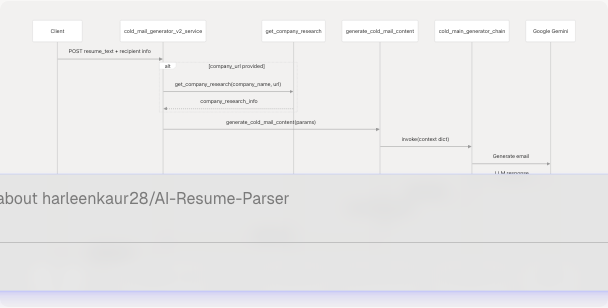
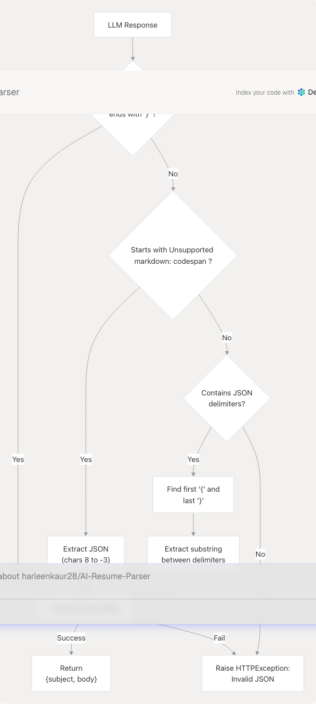
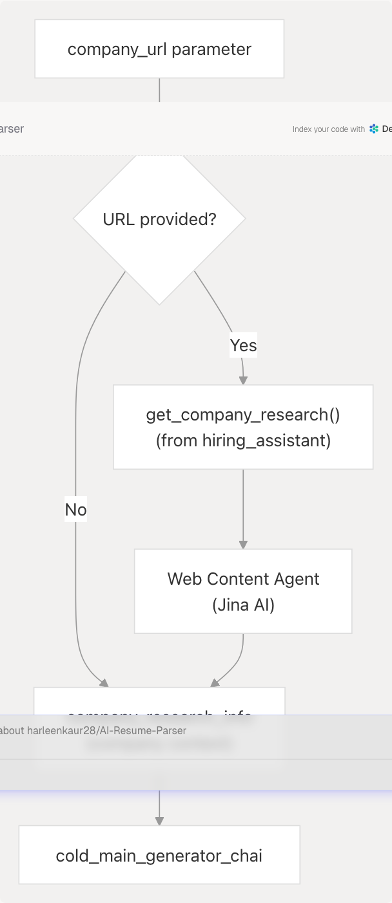

# Cold Mail Generator Service

Relevant source files

* [backend/app/agents/\_\_init\_\_.py](https://github.com/harleenkaur28/AI-Resume-Parser/blob/b2bbd83d/backend/app/agents/__init__.py)
* [backend/app/core/\_\_init\_\_.py](https://github.com/harleenkaur28/AI-Resume-Parser/blob/b2bbd83d/backend/app/core/__init__.py)
* [backend/app/core/llm.py](https://github.com/harleenkaur28/AI-Resume-Parser/blob/b2bbd83d/backend/app/core/llm.py)
* [backend/app/models/schemas.py](https://github.com/harleenkaur28/AI-Resume-Parser/blob/b2bbd83d/backend/app/models/schemas.py)
* [backend/app/services/ats.py](https://github.com/harleenkaur28/AI-Resume-Parser/blob/b2bbd83d/backend/app/services/ats.py)
* [backend/app/services/cold\_mail.py](https://github.com/harleenkaur28/AI-Resume-Parser/blob/b2bbd83d/backend/app/services/cold_mail.py)
* [backend/app/services/linkedin\_profile.py](https://github.com/harleenkaur28/AI-Resume-Parser/blob/b2bbd83d/backend/app/services/linkedin_profile.py)
* [backend/app/services/tailored\_resume.py](https://github.com/harleenkaur28/AI-Resume-Parser/blob/b2bbd83d/backend/app/services/tailored_resume.py)

## Purpose and Scope

The Cold Mail Generator Service provides AI-powered personalized cold email generation for job seekers reaching out to recruiters or hiring managers. The service analyzes resume content, incorporates company research, and generates professional email subject lines and body content tailored to the recipient and target company.

This page covers the cold email generation and editing functionality. For interview preparation features, see [Hiring Assistant Service](/harleenkaur28/AI-Resume-Parser/3.4-hiring-assistant-service). For resume analysis that feeds into this service, see [Resume Analysis Service](/harleenkaur28/AI-Resume-Parser/3.1-resume-analysis-service).

---

## Overview

The Cold Mail Generator Service offers two primary capabilities:

1. **Email Generation**: Creates personalized cold emails from scratch using resume data and recipient information
2. **Email Editing**: Refines previously generated emails based on user feedback and edit instructions

The service is implemented in two versions:

* **V1**: Accepts file uploads (PDF, DOCX, TXT) and processes them into resume text
* **V2**: Accepts pre-processed resume text directly (used when resume is already analyzed)

Both versions leverage Google's Gemini LLM via LangChain prompt chains and optionally integrate company research data to enhance personalization.

**Sources**: [backend/app/services/cold\_mail.py1-554](https://github.com/harleenkaur28/AI-Resume-Parser/blob/b2bbd83d/backend/app/services/cold_mail.py#L1-L554)

---

## Service Architecture


```

**Sources**: [backend/app/services/cold\_mail.py244-554](https://github.com/harleenkaur28/AI-Resume-Parser/blob/b2bbd83d/backend/app/services/cold_mail.py#L244-L554)

---

## Request and Response Models

### ColdMailRequest

The `ColdMailRequest` model defines the input parameters for cold email generation:

| Field | Type | Required | Description |
| --- | --- | --- | --- |
| `recipient_name` | `str` | Yes | Name of the person being emailed |
| `recipient_designation` | `str` | Yes | Job title/designation of the recipient |
| `company_name` | `str` | Yes | Company the recipient works for |
| `sender_name` | `str` | Yes | Name of the email sender (job seeker) |
| `sender_role_or_goal` | `str` | Yes | Primary goal or target role |
| `key_points_to_include` | `str` | Yes | Key achievements/points to highlight |
| `additional_info_for_llm` | `str` | No | Additional context for the LLM |
| `company_url` | `str` | No | Company website URL for research |

**Sources**: [backend/app/models/schemas.py241-280](https://github.com/harleenkaur28/AI-Resume-Parser/blob/b2bbd83d/backend/app/models/schemas.py#L241-L280)

### ColdMailResponse

The `ColdMailResponse` model contains the generated email content:

| Field | Type | Description |
| --- | --- | --- |
| `success` | `bool` | Operation status (default: true) |
| `message` | `str` | Status message |
| `subject` | `str` | Generated email subject line |
| `body` | `str` | Generated email body content |

**Sources**: [backend/app/models/schemas.py282-287](https://github.com/harleenkaur28/AI-Resume-Parser/blob/b2bbd83d/backend/app/models/schemas.py#L282-L287)

---

## V1 Service Flow (File Upload)

### Email Generation with File Upload

```

```

**Sources**: [backend/app/services/cold\_mail.py244-339](https://github.com/harleenkaur28/AI-Resume-Parser/blob/b2bbd83d/backend/app/services/cold_mail.py#L244-L339)

---

## V2 Service Flow (Text-based)

The V2 services skip file processing and operate directly on resume text, making them more efficient when the resume has already been analyzed:

```

```

**Sources**: [backend/app/services/cold\_mail.py445-496](https://github.com/harleenkaur28/AI-Resume-Parser/blob/b2bbd83d/backend/app/services/cold_mail.py#L445-L496)

---

## Email Editing Flow

The editing services allow users to refine generated emails by providing specific edit instructions:

```

```

The edit chain receives all original parameters plus:

* `previous_email_subject`: The previously generated subject
* `previous_email_body`: The previously generated body
* `edit_instructions`: User's requested changes

**Sources**: [backend/app/services/cold\_mail.py126-242](https://github.com/harleenkaur28/AI-Resume-Parser/blob/b2bbd83d/backend/app/services/cold_mail.py#L126-L242) [backend/app/services/cold\_mail.py498-554](https://github.com/harleenkaur28/AI-Resume-Parser/blob/b2bbd83d/backend/app/services/cold_mail.py#L498-L554)

---

## Core Generation Logic

### generate\_cold\_mail\_content

The `generate_cold_mail_content()` function is the core logic for email generation:

**Input Parameters**:

* `resume_text`: Processed resume content
* `recipient_name`, `recipient_designation`, `company_name`: Recipient details
* `sender_name`, `sender_role_or_goal`: Sender details
* `key_points_to_include`: Achievements to highlight
* `additional_info_for_llm`: Extra context
* `company_research`: Research data from web search

**Process**:

1. Invokes `cold_main_generator_chain` with all parameters
2. Receives LLM response (various formats possible)
3. Parses JSON to extract `subject` and `body` fields
4. Returns dictionary with email content

**Sources**: [backend/app/services/cold\_mail.py14-124](https://github.com/harleenkaur28/AI-Resume-Parser/blob/b2bbd83d/backend/app/services/cold_mail.py#L14-L124)

### generate\_cold\_mail\_edit\_content

Similar to generation but includes edit-specific parameters:

**Additional Parameters**:

* `previous_email_subject`: Original subject line
* `previous_email_body`: Original email body
* `edit_instructions`: User's requested changes

Uses `cold_mail_edit_chain` instead of the generation chain.

**Sources**: [backend/app/services/cold\_mail.py126-242](https://github.com/harleenkaur28/AI-Resume-Parser/blob/b2bbd83d/backend/app/services/cold_mail.py#L126-L242)

---

## Response Parsing Strategy

The service implements a robust JSON parsing strategy to handle various LLM response formats:

```

```

**Handled Formats**:

1. **Pure JSON**: `{"subject": "...", "body": "..."}`
2. **Markdown Code Block**: ```` ```json\n{...}\n``` ````
3. **Mixed Content**: Text containing JSON delimiters `{...}`

This multi-strategy approach ensures robustness against various LLM output formats.

**Sources**: [backend/app/services/cold\_mail.py39-114](https://github.com/harleenkaur28/AI-Resume-Parser/blob/b2bbd83d/backend/app/services/cold_mail.py#L39-L114) [backend/app/services/cold\_mail.py163-232](https://github.com/harleenkaur28/AI-Resume-Parser/blob/b2bbd83d/backend/app/services/cold_mail.py#L163-L232)

---

## Company Research Integration

The service optionally enriches email generation with company research data:

```

```

The `get_company_research()` function:

1. Takes company name and URL
2. Uses Web Content Agent to extract website content
3. Returns summarized company information
4. Data is passed to LLM for context-aware email generation

**Sources**: [backend/app/services/cold\_mail.py7](https://github.com/harleenkaur28/AI-Resume-Parser/blob/b2bbd83d/backend/app/services/cold_mail.py#L7-L7) [backend/app/services/cold\_mail.py308-312](https://github.com/harleenkaur28/AI-Resume-Parser/blob/b2bbd83d/backend/app/services/cold_mail.py#L308-L312)

---

## File Processing Pipeline (V1 Only)

```

```

**File Handling Details**:

* Temporary files saved to `backend/uploads/temp_cold_mail_{filename}`
* `process_document()` extracts text based on file type
* LLM formatting applied only to PDF/DOCX (not MD/TXT)
* Files deleted after processing to avoid storage buildup

**Sources**: [backend/app/services/cold\_mail.py262-298](https://github.com/harleenkaur28/AI-Resume-Parser/blob/b2bbd83d/backend/app/services/cold_mail.py#L262-L298) [backend/app/services/cold\_mail.py363-398](https://github.com/harleenkaur28/AI-Resume-Parser/blob/b2bbd83d/backend/app/services/cold_mail.py#L363-L398)

---

## Error Handling

The service implements comprehensive error handling:

| Error Type | HTTP Status | Condition |
| --- | --- | --- |
| LLM Unavailable | 503 | `llm` object is None |
| Unsupported File | 400 | `process_document()` returns None |
| Invalid Resume | 400 | `is_valid_resume()` fails |
| JSON Parse Failure | 500 | LLM response not parseable |
| General Errors | 500 | Any other exception |

All errors return `ErrorResponse` model with descriptive messages.

**Error Response Format**:

```
```
ErrorResponse(
    success=False,
    message="Error description",
    error_detail="Detailed error info"
)
```
```

**Sources**: [backend/app/services/cold\_mail.py255-259](https://github.com/harleenkaur28/AI-Resume-Parser/blob/b2bbd83d/backend/app/services/cold_mail.py#L255-L259) [backend/app/services/cold\_mail.py284-306](https://github.com/harleenkaur28/AI-Resume-Parser/blob/b2bbd83d/backend/app/services/cold_mail.py#L284-L306) [backend/app/services/cold\_mail.py329-338](https://github.com/harleenkaur28/AI-Resume-Parser/blob/b2bbd83d/backend/app/services/cold_mail.py#L329-L338)

---

## LLM Integration

### Prompt Chains

The service uses two LangChain prompt chains:

1. **cold\_main\_generator\_chain**: Main email generation
2. **cold\_mail\_edit\_chain**: Email editing/refinement

Both chains are imported from the `app.data.prompt` module and invoke Google Gemini via the shared `llm` instance.

**Chain Invocation**:

```
```
response = cold_main_generator_chain.invoke({
    "resume_text": resume_text,
    "recipient_name": recipient_name,
    "recipient_designation": recipient_designation,
    "company_name": company_name,
    "sender_name": sender_name,
    "sender_role_or_goal": sender_role_or_goal,
    "key_points_to_include": key_points_to_include,
    "additional_info_for_llm": additional_info_for_llm,
    "company_research": company_research,
})
```

**Sources**: [backend/app/services/cold\_mail.py8-11](https://github.com/harleenkaur28/AI-Resume-Parser/blob/b2bbd83d/backend/app/services/cold_mail.py#L8-L11) [backend/app/services/cold\_mail.py26-38](https://github.com/harleenkaur28/AI-Resume-Parser/blob/b2bbd83d/backend/app/services/cold_mail.py#L26-L38)

### LLM Configuration

The service uses the shared LLM instance from `app.core.llm`:

* **Model**: `gemini-2.0-flash` (via `ChatGoogleGenerativeAI`)
* **Temperature**: 0.1 (for consistent, focused output)
* **Provider**: Google Generative AI

**Sources**: [backend/app/core/llm.py1-37](https://github.com/harleenkaur28/AI-Resume-Parser/blob/b2bbd83d/backend/app/core/llm.py#L1-L37)

---

## Service Comparison Table

| Feature | V1 (File Upload) | V2 (Text Input) |
| --- | --- | --- |
| Input Method | `UploadFile` object | Pre-processed `str` |
| File Processing | Yes (PDF/DOCX/TXT) | No |
| Text Formatting | Yes (LLM-based) | No (assumes pre-formatted) |
| Resume Validation | Yes | No |
| Temp File Management | Yes | No |
| Use Case | First-time upload | Resume already analyzed |
| Performance | Slower (file I/O) | Faster (no file ops) |
| API Endpoints | `/generate-cold-mail` `/edit-cold-mail` | `/generate-cold-mail-v2` `/edit-cold-mail-v2` |

**Sources**: [backend/app/services/cold\_mail.py244-554](https://github.com/harleenkaur28/AI-Resume-Parser/blob/b2bbd83d/backend/app/services/cold_mail.py#L244-L554)

---

## Dependencies

The Cold Mail Generator Service depends on:

| Dependency | Purpose | Source |
| --- | --- | --- |
| `process_document` | Extract text from files | `app.services.process_resume` |
| `format_resume_text_with_llm` | Clean/format resume text | `app.services.data_processor` |
| `is_valid_resume` | Validate resume content | `app.services.process_resume` |
| `get_company_research` | Fetch company info | `app.services.hiring_assiatnat` |
| `cold_main_generator_chain` | Main generation prompt | `app.data.prompt.cold_mail_gen` |
| `cold_mail_edit_chain` | Edit prompt | `app.data.prompt.cold_mail_editor` |
| `llm` | Google Gemini instance | `app.core.llm` |
| `ColdMailRequest` | Request validation | `app.models.schemas` |
| `ColdMailResponse` | Response structure | `app.models.schemas` |
| `ErrorResponse` | Error formatting | `app.models.schemas` |

**Sources**: [backend/app/services/cold\_mail.py1-11](https://github.com/harleenkaur28/AI-Resume-Parser/blob/b2bbd83d/backend/app/services/cold_mail.py#L1-L11)

---

## Usage Patterns

### Pattern 1: Generate from Previously Analyzed Resume

When a resume has already been analyzed (stored in database), use V2:

1. Fetch resume text from database
2. Call `cold_mail_generator_v2_service()` with text
3. Return generated email to frontend
4. Frontend can save to database or allow editing

### Pattern 2: Generate from New Upload

When user uploads a new resume file, use V1:

1. Accept file upload
2. Call `cold_mail_generator_service()` with file
3. Service processes, validates, and generates
4. Return email content

### Pattern 3: Iterative Refinement

For editing generated emails:

1. User reviews generated email
2. Provides edit instructions (e.g., "make it shorter", "add more technical details")
3. Call `cold_mail_editor_v2_service()` with original params + edit instructions
4. Service generates refined version
5. Can repeat until satisfied

**Sources**: [backend/app/services/cold\_mail.py244-554](https://github.com/harleenkaur28/AI-Resume-Parser/blob/b2bbd83d/backend/app/services/cold_mail.py#L244-L554)