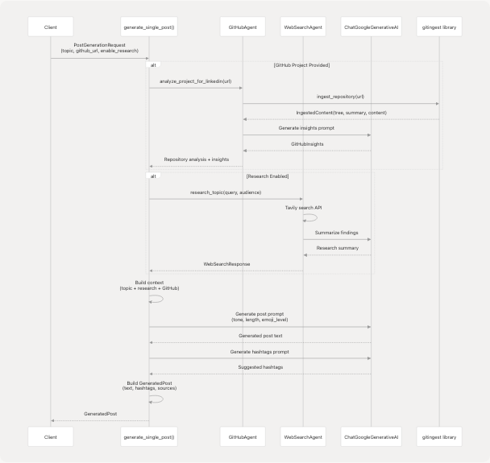
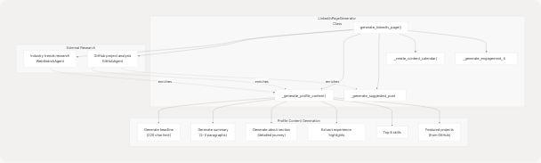
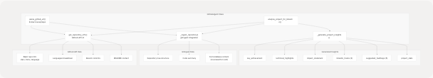
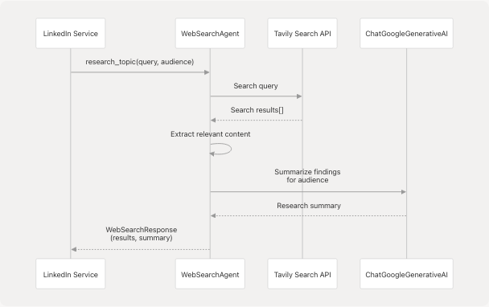
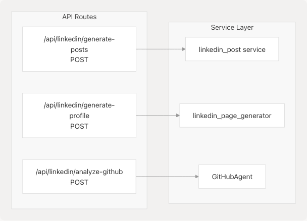

# LinkedIn Services

> Source: https://deepwiki.com/harleenkaur28/AI-Resume-Parser/3.6-linkedin-services

# LinkedIn Services

Relevant source files

* [backend/app/agents/\_\_init\_\_.py](https://github.com/harleenkaur28/AI-Resume-Parser/blob/b2bbd83d/backend/app/agents/__init__.py)
* [backend/app/agents/github\_agent.py](https://github.com/harleenkaur28/AI-Resume-Parser/blob/b2bbd83d/backend/app/agents/github_agent.py)
* [backend/app/models/schemas.py](https://github.com/harleenkaur28/AI-Resume-Parser/blob/b2bbd83d/backend/app/models/schemas.py)
* [backend/app/services/ats.py](https://github.com/harleenkaur28/AI-Resume-Parser/blob/b2bbd83d/backend/app/services/ats.py)
* [backend/app/services/linkedin\_profile.py](https://github.com/harleenkaur28/AI-Resume-Parser/blob/b2bbd83d/backend/app/services/linkedin_profile.py)
* [backend/app/services/tailored\_resume.py](https://github.com/harleenkaur28/AI-Resume-Parser/blob/b2bbd83d/backend/app/services/tailored_resume.py)
* [backend/pyproject.toml](https://github.com/harleenkaur28/AI-Resume-Parser/blob/b2bbd83d/backend/pyproject.toml)
* [backend/requirements.txt](https://github.com/harleenkaur28/AI-Resume-Parser/blob/b2bbd83d/backend/requirements.txt)
* [backend/server.py](https://github.com/harleenkaur28/AI-Resume-Parser/blob/b2bbd83d/backend/server.py)
* [backend/uv.lock](https://github.com/harleenkaur28/AI-Resume-Parser/blob/b2bbd83d/backend/uv.lock)

## Purpose and Scope

The LinkedIn Services module provides AI-powered content generation capabilities for building a professional LinkedIn presence. This includes generating engaging LinkedIn posts with research-backed content, creating comprehensive profile sections, and analyzing GitHub projects for professional storytelling. The services leverage Google Gemini LLM, web search capabilities, and GitHub repository analysis to produce personalized, contextually-rich content.

For general AI/ML integration patterns, see [3.8](/harleenkaur28/AI-Resume-Parser/3.8-llm-integration-and-prompt-engineering). For other career enhancement features, see [3.4](/harleenkaur28/AI-Resume-Parser/3.4-hiring-assistant-service) (Hiring Assistant). For web search and GitHub agent implementations, see [3.7](/harleenkaur28/AI-Resume-Parser/3.7-support-agents).

**Sources:** [backend/app/services/linkedin\_profile.py1-408](https://github.com/harleenkaur28/AI-Resume-Parser/blob/b2bbd83d/backend/app/services/linkedin_profile.py#L1-L408)

---

## System Architecture

The LinkedIn Services system consists of two primary components: **LinkedIn Post Generator** and **LinkedIn Profile Generator**. Both services integrate with support agents (GitHub and Web Search) to enrich content with real-world insights and project details.

### Component Overview


```

**Sources:** [backend/app/services/linkedin\_profile.py1-408](https://github.com/harleenkaur28/AI-Resume-Parser/blob/b2bbd83d/backend/app/services/linkedin_profile.py#L1-L408) [backend/app/models/schemas.py359-442](https://github.com/harleenkaur28/AI-Resume-Parser/blob/b2bbd83d/backend/app/models/schemas.py#L359-L442) [backend/app/agents/github\_agent.py1-418](https://github.com/harleenkaur28/AI-Resume-Parser/blob/b2bbd83d/backend/app/agents/github_agent.py#L1-L418)

---

## Data Models

### Post Generation Models

| Model | Fields | Purpose |
| --- | --- | --- |
| `PostGenerationRequest` | `topic`, `tone`, `audience`, `length`, `hashtags_option`, `cta_text`, `mimic_examples`, `language`, `post_count`, `emoji_level`, `github_project_url`, `enable_research` | Input parameters for LinkedIn post generation |
| `GeneratedPost` | `text`, `hashtags`, `cta_suggestion`, `token_info`, `sources`, `github_project_name` | Individual generated post with metadata |
| `PostGenerationResponse` | `success`, `message`, `posts: List[GeneratedPost]`, `timestamp` | Wrapper containing multiple generated posts |
| `Source` | `title`, `link` | Research source citation |

**Sources:** [backend/app/models/schemas.py359-403](https://github.com/harleenkaur28/AI-Resume-Parser/blob/b2bbd83d/backend/app/models/schemas.py#L359-L403)

### Profile Generation Models

| Model | Fields | Purpose |
| --- | --- | --- |
| `LinkedInPageRequest` | `name`, `current_role`, `industry`, `years_of_experience`, `key_skills`, `achievements`, `company_name`, `target_audience`, `professional_tone`, `include_personal_touch`, `github_profile_url`, `featured_repositories`, `generate_posts`, `post_count`, `content_themes` | Comprehensive profile generation parameters |
| `LinkedInProfileContent` | `headline`, `summary`, `about_section`, `experience_highlights`, `skills_to_highlight`, `featured_projects` | Generated profile sections |
| `LinkedInPageResponse` | `success`, `profile_content`, `suggested_posts`, `content_calendar`, `engagement_tips`, `timestamp` | Complete LinkedIn page bundle |

**Sources:** [backend/app/services/linkedin\_profile.py23-78](https://github.com/harleenkaur28/AI-Resume-Parser/blob/b2bbd83d/backend/app/services/linkedin_profile.py#L23-L78)

### GitHub Integration Models

| Model | Fields | Purpose |
| --- | --- | --- |
| `GitHubAnalysisRequest` | `github_url: HttpUrl` | Request GitHub repository analysis |
| `GitHubInsights` | `key_achievement`, `technical_highlights`, `impact_statement`, `linkedin_hooks`, `suggested_hashtags`, `project_stats` | LinkedIn-optimized project insights |
| `GitHubAnalysisResponse` | `success`, `repository_info`, `linkedin_insights`, `timestamp` | Analyzed repository data for LinkedIn content |

**Sources:** [backend/app/models/schemas.py424-442](https://github.com/harleenkaur28/AI-Resume-Parser/blob/b2bbd83d/backend/app/models/schemas.py#L424-L442)

---

## LinkedIn Post Generation Service

The post generation service creates professional LinkedIn posts with optional GitHub project integration and web research. Posts are tailored by tone, audience, length, and emoji level.

### Post Generation Workflow

```

```

**Sources:** [backend/app/services/linkedin\_post.py](https://github.com/harleenkaur28/AI-Resume-Parser/blob/b2bbd83d/backend/app/services/linkedin_post.py) (referenced but not in provided files), [backend/app/agents/github\_agent.py224-246](https://github.com/harleenkaur28/AI-Resume-Parser/blob/b2bbd83d/backend/app/agents/github_agent.py#L224-L246) [backend/app/models/schemas.py359-403](https://github.com/harleenkaur28/AI-Resume-Parser/blob/b2bbd83d/backend/app/models/schemas.py#L359-L403)

### Key Configuration Parameters

The `PostGenerationRequest` model provides fine-grained control over post characteristics:

* **`length`**: `"Short"` (~50 words), `"Medium"` (~100-150 words), `"Long"` (~200+ words), `"Any"`
* **`emoji_level`**: `0` (none), `1` (minimal), `2` (moderate), `3` (expressive)
* **`hashtags_option`**: `"suggest"`, `"none"`, or custom list
* **`tone`**: Professional, casual, technical, inspirational, etc.
* **`enable_research`**: Boolean to toggle web search enrichment

**Sources:** [backend/app/models/schemas.py360-375](https://github.com/harleenkaur28/AI-Resume-Parser/blob/b2bbd83d/backend/app/models/schemas.py#L360-L375)

---

## LinkedIn Profile Generation Service

The `LinkedInPageGenerator` class creates comprehensive LinkedIn profile content including headline, summary, about section, and suggested posts with a content calendar.

### Profile Generation Architecture

```

```

**Sources:** [backend/app/services/linkedin\_profile.py80-148](https://github.com/harleenkaur28/AI-Resume-Parser/blob/b2bbd83d/backend/app/services/linkedin_profile.py#L80-L148)

### Profile Content Generation Process

The profile generation process consists of multiple LLM invocations to create distinct profile sections:

#### 1. Headline Generation

```
Prompt Context:
- Current role, industry, experience years
- Key skills and achievements
- Target audience
- Industry insights (if available)

Output: 220-character professional headline
```

**Implementation:** [backend/app/services/linkedin\_profile.py175-188](https://github.com/harleenkaur28/AI-Resume-Parser/blob/b2bbd83d/backend/app/services/linkedin_profile.py#L175-L188)

#### 2. Summary Generation

```
Prompt Context: Same as headline
Output: 2-3 paragraph professional summary
```

**Implementation:** [backend/app/services/linkedin\_profile.py190-203](https://github.com/harleenkaur28/AI-Resume-Parser/blob/b2bbd83d/backend/app/services/linkedin_profile.py#L190-L203)

#### 3. About Section Generation

```
Prompt Context: Professional journey, expertise, values, passions
Output: Detailed conversational about section
```

**Implementation:** [backend/app/services/linkedin\_profile.py205-218](https://github.com/harleenkaur28/AI-Resume-Parser/blob/b2bbd83d/backend/app/services/linkedin_profile.py#L205-L218)

#### 4. Experience Highlights Assembly

Combines structured data:

* Years of experience in industry
* Top 3 skills
* Top 3 achievements

**Implementation:** [backend/app/services/linkedin\_profile.py220-226](https://github.com/harleenkaur28/AI-Resume-Parser/blob/b2bbd83d/backend/app/services/linkedin_profile.py#L220-L226)

#### 5. Featured Projects Extraction

For each GitHub repository (up to 3):

* Project name, description
* Primary language
* Star count
* Repository URL

**Implementation:** [backend/app/services/linkedin\_profile.py231-241](https://github.com/harleenkaur28/AI-Resume-Parser/blob/b2bbd83d/backend/app/services/linkedin_profile.py#L231-L241)

**Sources:** [backend/app/services/linkedin\_profile.py149-249](https://github.com/harleenkaur28/AI-Resume-Parser/blob/b2bbd83d/backend/app/services/linkedin_profile.py#L149-L249)

### Suggested Posts Generation

The profile generator creates thematic posts aligned with the professional's background and selected content themes:

```

```

Each post is generated using the `generate_single_post()` function from the post generation service, with context tailored to the theme and professional background.

**Sources:** [backend/app/services/linkedin\_profile.py251-301](https://github.com/harleenkaur28/AI-Resume-Parser/blob/b2bbd83d/backend/app/services/linkedin_profile.py#L251-L301)

### Content Calendar Creation

The content calendar provides a structured posting schedule:

| Day | Content Type | Engagement Goal |
| --- | --- | --- |
| Monday | Industry insights and trends | Position as thought leader |
| Wednesday | Professional development and career tips | Drive discussions |
| Friday | Project highlights and achievements | Showcase expertise |
| Weekend | Thought leadership and reflections | Connect with peers |
| Bi-weekly | Industry news commentary | Thought leadership |
| Monthly | Career milestone or reflection | Inspire others |

**Implementation:** [backend/app/services/linkedin\_profile.py303-355](https://github.com/harleenkaur28/AI-Resume-Parser/blob/b2bbd83d/backend/app/services/linkedin_profile.py#L303-L355)

### Engagement Tips Generation

Personalized engagement tips are generated based on:

* Experience level (mentorship tips for 5+ years)
* GitHub presence (technical content suggestions)
* Personal touch preference (anecdote recommendations)
* Industry-specific networking advice

**Implementation:** [backend/app/services/linkedin\_profile.py357-393](https://github.com/harleenkaur28/AI-Resume-Parser/blob/b2bbd83d/backend/app/services/linkedin_profile.py#L357-L393)

**Sources:** [backend/app/services/linkedin\_profile.py251-393](https://github.com/harleenkaur28/AI-Resume-Parser/blob/b2bbd83d/backend/app/services/linkedin_profile.py#L251-L393)

---

## GitHub Agent Integration

The `GitHubAgent` class provides deep repository analysis for LinkedIn content generation.

### GitHub Agent Architecture

```

```

**Sources:** [backend/app/agents/github\_agent.py49-247](https://github.com/harleenkaur28/AI-Resume-Parser/blob/b2bbd83d/backend/app/agents/github_agent.py#L49-L247)

### Repository Ingestion

The agent optionally uses the `gitingest` library to extract comprehensive repository context:

**Async Path:** [backend/app/agents/github\_agent.py12-16](https://github.com/harleenkaur28/AI-Resume-Parser/blob/b2bbd83d/backend/app/agents/github_agent.py#L12-L16)

```
```
from gitingest import ingest_async as _gitingest_async
```
```

**Sync Fallback:** [backend/app/agents/github\_agent.py18-22](https://github.com/harleenkaur28/AI-Resume-Parser/blob/b2bbd83d/backend/app/agents/github_agent.py#L18-L22)

```
```
from gitingest import ingest as _gitingest_sync
```
```

The ingestion process returns:

* **`tree`**: Directory structure
* **`summary`**: High-level overview
* **`content`**: Full codebase text (truncated to ~1.8M chars if needed)

This data is stored in the `IngestedContent` Pydantic model and truncated for LLM prompts using the `excerpt()` method.

**Implementation:** [backend/app/agents/github\_agent.py161-194](https://github.com/harleenkaur28/AI-Resume-Parser/blob/b2bbd83d/backend/app/agents/github_agent.py#L161-L194)

### LinkedIn Insights Generation

The agent sends repository context to the LLM with a structured prompt to extract LinkedIn-optimized insights:

**Prompt Template:** [backend/app/agents/github\_agent.py274-284](https://github.com/harleenkaur28/AI-Resume-Parser/blob/b2bbd83d/backend/app/agents/github_agent.py#L274-L284)

```
Analyze this GitHub project and provide LinkedIn-friendly insights:

[Project context: name, description, language, stars, topics, README, code summary, tree]

Provide insights in the following format:
1. Key Achievement: What makes this project notable?
2. Technical Highlights: Key technologies and innovations
3. Impact Statement: What problem does it solve?
4. LinkedIn Hooks: 3 engaging ways to present this project
```

The LLM response is parsed to extract structured fields.

**Sources:** [backend/app/agents/github\_agent.py248-332](https://github.com/harleenkaur28/AI-Resume-Parser/blob/b2bbd83d/backend/app/agents/github_agent.py#L248-L332)

### Hashtag Generation

Hashtags are generated from multiple sources:

1. **Language-based**: Primary programming language
2. **Topic-based**: GitHub repository topics (up to 3)
3. **Generic**: `opensource`, `development`, `coding`, `tech`, `innovation` (up to 2)

Hashtags are cleaned (alphanumeric only) and limited to 5 unique tags.

**Implementation:** [backend/app/agents/github\_agent.py381-408](https://github.com/harleenkaur28/AI-Resume-Parser/blob/b2bbd83d/backend/app/agents/github_agent.py#L381-L408)

**Sources:** [backend/app/agents/github\_agent.py381-408](https://github.com/harleenkaur28/AI-Resume-Parser/blob/b2bbd83d/backend/app/agents/github_agent.py#L381-L408)

---

## Web Search Agent Integration

The LinkedIn services integrate with `WebSearchAgent` for industry research and trend analysis.

### Research Workflow

```

```

**Usage in Profile Generation:** [backend/app/services/linkedin\_profile.py96-104](https://github.com/harleenkaur28/AI-Resume-Parser/blob/b2bbd83d/backend/app/services/linkedin_profile.py#L96-L104)

```
```
research = await self.web_agent.research_topic(
    f"{request.industry} trends career opportunities 2024",
    f"Professional with {request.years_of_experience} years experience"
)
industry_insights = research.get("research_summary", "")
```
```

**Sources:** [backend/app/services/linkedin\_profile.py94-105](https://github.com/harleenkaur28/AI-Resume-Parser/blob/b2bbd83d/backend/app/services/linkedin_profile.py#L94-L105) [backend/app/models/schemas.py406-422](https://github.com/harleenkaur28/AI-Resume-Parser/blob/b2bbd83d/backend/app/models/schemas.py#L406-L422)

---

## Service Initialization and Error Handling

### Service Initialization

The `LinkedInPageGenerator` class initializes with optional agent support:

[backend/app/services/linkedin\_profile.py82-85](https://github.com/harleenkaur28/AI-Resume-Parser/blob/b2bbd83d/backend/app/services/linkedin_profile.py#L82-L85)

```
```
def __init__(self):
    self.web_agent = WebSearchAgent() if HAS_AGENTS else None
    self.github_agent = GitHubAgent() if HAS_AGENTS else None
```
```

Agents are imported with fallback to graceful degradation:

[backend/app/services/linkedin\_profile.py13-20](https://github.com/harleenkaur28/AI-Resume-Parser/blob/b2bbd83d/backend/app/services/linkedin_profile.py#L13-L20)

```
```
try:
    from app.agents.websearch_agent import WebSearchAgent
    from app.agents.github_agent import GitHubAgent
    HAS_AGENTS = True
except ImportError:
    HAS_AGENTS = False
```
```

### Error Handling Patterns

**GitHub Analysis Errors:** [backend/app/services/linkedin\_profile.py109-117](https://github.com/harleenkaur28/AI-Resume-Parser/blob/b2bbd83d/backend/app/services/linkedin_profile.py#L109-L117)

```
```
for repo_url in request.featured_repositories:
    try:
        analysis = await self.github_agent.analyze_project_for_linkedin(str(repo_url))
        if not analysis.get("error"):
            github_insights.append(analysis)
    except Exception as e:
        print(f"GitHub analysis failed for {repo_url}: {e}")
```
```

**Industry Research Errors:** [backend/app/services/linkedin\_profile.py96-104](https://github.com/harleenkaur28/AI-Resume-Parser/blob/b2bbd83d/backend/app/services/linkedin_profile.py#L96-L104)

```
```
try:
    research = await self.web_agent.research_topic(...)
    industry_insights = research.get("research_summary", "")
except Exception as e:
    print(f"Industry research failed: {e}")
```
```

Failed enrichments are logged but do not block profile generation—the service continues with available data.

**Sources:** [backend/app/services/linkedin\_profile.py82-148](https://github.com/harleenkaur28/AI-Resume-Parser/blob/b2bbd83d/backend/app/services/linkedin_profile.py#L82-L148)

---

## LLM Integration

All LinkedIn services use the shared LLM instance from the core module:

[backend/app/services/linkedin\_profile.py10](https://github.com/harleenkaur28/AI-Resume-Parser/blob/b2bbd83d/backend/app/services/linkedin_profile.py#L10-L10)

```
```
from app.core.llm import llm
```
```

The LLM is configured as:

* **Model**: `gemini-2.0-flash`
* **Temperature**: `0.1` (deterministic)
* **Provider**: Google Generative AI via `langchain-google-genai`

### Async Invocation Pattern

All LLM calls use the async `ainvoke()` method:

[backend/app/services/linkedin\_profile.py182-188](https://github.com/harleenkaur28/AI-Resume-Parser/blob/b2bbd83d/backend/app/services/linkedin_profile.py#L182-L188)

```
```
headline_response = await llm.ainvoke(headline_prompt)
headline = str(
    headline_response.content 
    if hasattr(headline_response, "content") 
    else headline_response
).strip()
```
```

For LLM configuration details, see [3.8](/harleenkaur28/AI-Resume-Parser/3.8-llm-integration-and-prompt-engineering).

**Sources:** [backend/app/services/linkedin\_profile.py10](https://github.com/harleenkaur28/AI-Resume-Parser/blob/b2bbd83d/backend/app/services/linkedin_profile.py#L10-L10) [backend/app/core/llm.py](https://github.com/harleenkaur28/AI-Resume-Parser/blob/b2bbd83d/backend/app/core/llm.py) (referenced), [backend/app/agents/github\_agent.py286](https://github.com/harleenkaur28/AI-Resume-Parser/blob/b2bbd83d/backend/app/agents/github_agent.py#L286-L286)

---

## API Endpoints

While the service functions are defined in the service layer, they are exposed through FastAPI endpoints (implementation location varies by codebase structure).

### Expected Endpoint Structure

```

```

### Request/Response Flow

**Post Generation:**

```
POST /api/linkedin/generate-posts
Content-Type: application/json

{
  "topic": "AI trends in healthcare",
  "tone": "Professional",
  "audience": ["Healthcare professionals", "Data scientists"],
  "length": "Medium",
  "post_count": 3,
  "enable_research": true,
  "github_project_url": "https://github.com/user/health-ai"
}
```

**Profile Generation:**

```
POST /api/linkedin/generate-profile
Content-Type: application/json

{
  "name": "Jane Doe",
  "current_role": "Senior Data Scientist",
  "industry": "Healthcare Technology",
  "years_of_experience": 8,
  "key_skills": ["Machine Learning", "Python", "Healthcare Analytics"],
  "achievements": ["Published 3 research papers", "Led team of 5 engineers"],
  "generate_posts": true,
  "post_count": 5,
  "featured_repositories": [
    "https://github.com/janedoe/health-ml-pipeline"
  ]
}
```

**Sources:** [backend/app/models/schemas.py359-442](https://github.com/harleenkaur28/AI-Resume-Parser/blob/b2bbd83d/backend/app/models/schemas.py#L359-L442)

---

## Dependencies

### Required Packages

| Package | Purpose | Version |
| --- | --- | --- |
| `langchain` | LLM orchestration framework | >=0.3.25 |
| `langchain-google-genai` | Google Gemini integration | >=2.1.5 |
| `pydantic` | Data validation and schemas | >=2.11.5 |
| `fastapi` | API framework | >=0.115.12 |

### Optional Packages

| Package | Purpose | Fallback Behavior |
| --- | --- | --- |
| `gitingest` | Deep repository analysis | Basic GitHub API only |
| `tavily-python` | Web search enrichment | No research enrichment |

**Sources:** [backend/pyproject.toml1-40](https://github.com/harleenkaur28/AI-Resume-Parser/blob/b2bbd83d/backend/pyproject.toml#L1-L40) [backend/requirements.txt1-121](https://github.com/harleenkaur28/AI-Resume-Parser/blob/b2bbd83d/backend/requirements.txt#L1-L121)

---

## Example Usage Patterns

### Generating Posts with GitHub Integration

```
```
from app.services.linkedin_post import generate_single_post
from app.models.schemas import PostGenerationRequest

request = PostGenerationRequest(
    topic="Open source contribution",
    tone="Inspirational",
    length="Medium",
    post_count=3,
    emoji_level=2,
    github_project_url="https://github.com/user/awesome-project",
    enable_research=True
)

posts = await generate_posts(request)
for post in posts.posts:
    print(post.text)
    print(f"Hashtags: {', '.join(post.hashtags)}")
```
```

### Generating Complete LinkedIn Profile

```
```
from app.services.linkedin_profile import generate_comprehensive_linkedin_page
from app.models.schemas import LinkedInPageRequest

request = LinkedInPageRequest(
    name="John Smith",
    current_role="Machine Learning Engineer",
    industry="Artificial Intelligence",
    years_of_experience=6,
    key_skills=["Python", "TensorFlow", "MLOps", "Computer Vision"],
    achievements=[
        "Built ML pipeline processing 1M+ images daily",
        "Reduced model latency by 40%"
    ],
    generate_posts=True,
    post_count=5,
    featured_repositories=[
        "https://github.com/jsmith/vision-pipeline",
        "https://github.com/jsmith/ml-tools"
    ]
)

response = await generate_comprehensive_linkedin_page(request)
print(response.profile_content.headline)
print(response.profile_content.about_section)
print(f"Generated {len(response.suggested_posts)} posts")
print(f"Content calendar has {len(response.content_calendar)} items")
```
```

**Sources:** [backend/app/services/linkedin\_profile.py401-407](https://github.com/harleenkaur28/AI-Resume-Parser/blob/b2bbd83d/backend/app/services/linkedin_profile.py#L401-L407) [backend/app/models/schemas.py34-78](https://github.com/harleenkaur28/AI-Resume-Parser/blob/b2bbd83d/backend/app/models/schemas.py#L34-L78)

---

## Performance Considerations

### Async Execution

All LinkedIn services use async/await patterns to avoid blocking during:

* LLM API calls (typically 2-5 seconds per generation)
* GitHub API requests (typically 1-2 seconds)
* Repository ingestion (can take 10-60 seconds for large repos)
* Web search queries (typically 2-4 seconds)

### Timeout Configuration

Repository ingestion has a configurable timeout:

[backend/app/agents/github\_agent.py161-163](https://github.com/harleenkaur28/AI-Resume-Parser/blob/b2bbd83d/backend/app/agents/github_agent.py#L161-L163)

```
```
async def _ingest_repository(
    self, url: str, timeout: float = 60.0
) -> Optional[IngestedContent]:
```
```

### Content Truncation

Large repository content is truncated to prevent LLM context overflow:

[backend/app/agents/github\_agent.py184-189](https://github.com/harleenkaur28/AI-Resume-Parser/blob/b2bbd83d/backend/app/agents/github_agent.py#L184-L189)

```
```
max_len = 5 * 3 * 600_000  # ~1.8M chars
if len(content) > max_len:
    content = (
        content[:max_len - 1000]
        + "\n...\n[large repository content truncated]"
    )
```
```

The `IngestedContent.excerpt()` method further truncates for LLM prompts:

[backend/app/agents/github\_agent.py40-46](https://github.com/harleenkaur28/AI-Resume-Parser/blob/b2bbd83d/backend/app/agents/github_agent.py#L40-L46)
```
def excerpt(self, max_chars: int = 4000) -> str:
    if len(content) <= max_chars:
        return content
    return content[:max_chars - 500] + "\n...\n[truncated]" + content[-400:]
```
```

**Sources:** [backend/app/agents/github\_agent.py161-194](https://github.com/harleenkaur28/AI-Resume-Parser/blob/b2bbd83d/backend/app/agents/github_agent.py#L161-L194) [backend/app/agents/github\_agent.py40-46](https://github.com/harleenkaur28/AI-Resume-Parser/blob/b2bbd83d/backend/app/agents/github_agent.py#L40-L46)

---

## Summary

The LinkedIn Services module provides comprehensive AI-powered content generation for professional networking:

1. **Post Generation**: Creates engaging posts with configurable tone, length, and emoji levels, enriched with GitHub project insights and web research
2. **Profile Generation**: Produces complete LinkedIn profiles including headline, summary, about section, experience highlights, and featured projects
3. **Content Strategy**: Generates content calendars and engagement tips tailored to professional background
4. **Agent Integration**: Leverages GitHub Agent for repository analysis and Web Search Agent for industry research
5. **Error Resilience**: Gracefully degrades when optional enrichments fail, ensuring content generation succeeds with available data

All services integrate with the shared Google Gemini LLM and follow async patterns for optimal performance.

**Sources:** [backend/app/services/linkedin\_profile.py1-408](https://github.com/harleenkaur28/AI-Resume-Parser/blob/b2bbd83d/backend/app/services/linkedin_profile.py#L1-L408) [backend/app/agents/github\_agent.py1-418](https://github.com/harleenkaur28/AI-Resume-Parser/blob/b2bbd83d/backend/app/agents/github_agent.py#L1-L418) [backend/app/models/schemas.py359-442](https://github.com/harleenkaur28/AI-Resume-Parser/blob/b2bbd83d/backend/app/models/schemas.py#L359-L442)