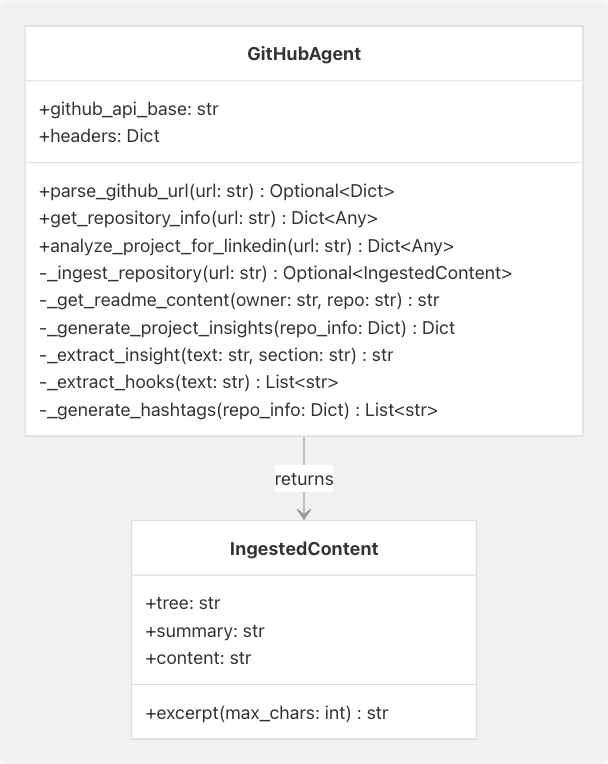
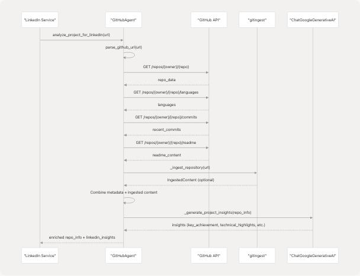
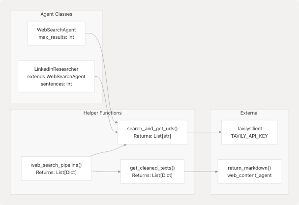
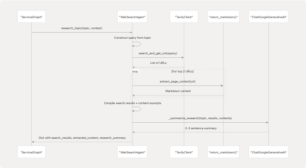
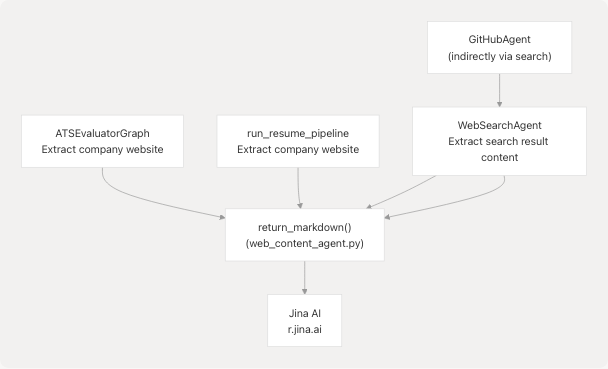

# Support Agents

> Source: https://deepwiki.com/harleenkaur28/AI-Resume-Parser/3.7-support-agents

# Support Agents

Relevant source files

* [backend/app/agents/github\_agent.py](https://github.com/harleenkaur28/AI-Resume-Parser/blob/b2bbd83d/backend/app/agents/github_agent.py)
* [backend/app/agents/web\_content\_agent.py](https://github.com/harleenkaur28/AI-Resume-Parser/blob/b2bbd83d/backend/app/agents/web_content_agent.py)
* [backend/app/agents/websearch\_agent.py](https://github.com/harleenkaur28/AI-Resume-Parser/blob/b2bbd83d/backend/app/agents/websearch_agent.py)
* [backend/app/services/ats\_evaluator/graph.py](https://github.com/harleenkaur28/AI-Resume-Parser/blob/b2bbd83d/backend/app/services/ats_evaluator/graph.py)
* [backend/app/services/resume\_generator/graph.py](https://github.com/harleenkaur28/AI-Resume-Parser/blob/b2bbd83d/backend/app/services/resume_generator/graph.py)
* [backend/pyproject.toml](https://github.com/harleenkaur28/AI-Resume-Parser/blob/b2bbd83d/backend/pyproject.toml)
* [backend/requirements.txt](https://github.com/harleenkaur28/AI-Resume-Parser/blob/b2bbd83d/backend/requirements.txt)
* [backend/server.py](https://github.com/harleenkaur28/AI-Resume-Parser/blob/b2bbd83d/backend/server.py)
* [backend/uv.lock](https://github.com/harleenkaur28/AI-Resume-Parser/blob/b2bbd83d/backend/uv.lock)

## Purpose and Scope

This document describes the **Support Agents** subsystem within the TalentSync backend, which provides external data-gathering capabilities for core AI services. These agents act as specialized utilities that fetch, parse, and extract information from external sources including GitHub repositories, web search results, and web page content.

For information about how these agents are used by specific AI services, see:

* ATS Evaluation Service ([3.2](/harleenkaur28/AI-Resume-Parser/3.2-ats-evaluation-service))
* Cold Mail Generator Service ([3.3](/harleenkaur28/AI-Resume-Parser/3.3-cold-mail-generator-service))
* Tailored Resume Service ([3.5](/harleenkaur28/AI-Resume-Parser/3.5-tailored-resume-service))
* LinkedIn Services ([3.6](/harleenkaur28/AI-Resume-Parser/3.6-linkedin-services))

For information about the LLM integration that processes agent outputs, see [3.8](/harleenkaur28/AI-Resume-Parser/3.8-llm-integration-and-prompt-engineering).

---

## Overview

The support agents provide three specialized capabilities:

| Agent | Primary Function | External Service | Main Use Cases |
| --- | --- | --- | --- |
| **GitHub Agent** | Repository analysis and code ingestion | GitHub API, gitingest library | LinkedIn post generation, project insights |
| **Web Search Agent** | Web search and trend research | Tavily API | Company research, industry trends, ATS evaluation context |
| **Web Content Agent** | URL content extraction | Jina AI (`r.jina.ai`) | Job description fetching, company website analysis |

All agents are designed to be fault-tolerant, returning empty results or gracefully degrading when external services are unavailable.

**Sources:** [backend/app/agents/github\_agent.py](https://github.com/harleenkaur28/AI-Resume-Parser/blob/b2bbd83d/backend/app/agents/github_agent.py) [backend/app/agents/websearch\_agent.py](https://github.com/harleenkaur28/AI-Resume-Parser/blob/b2bbd83d/backend/app/agents/websearch_agent.py) [backend/app/agents/web\_content\_agent.py](https://github.com/harleenkaur28/AI-Resume-Parser/blob/b2bbd83d/backend/app/agents/web_content_agent.py)

---

## Agent Architecture

The following diagram shows the technical structure of the support agents and their integration points:


```

**Sources:** [backend/app/agents/github\_agent.py](https://github.com/harleenkaur28/AI-Resume-Parser/blob/b2bbd83d/backend/app/agents/github_agent.py) [backend/app/agents/websearch\_agent.py](https://github.com/harleenkaur28/AI-Resume-Parser/blob/b2bbd83d/backend/app/agents/websearch_agent.py) [backend/app/agents/web\_content\_agent.py](https://github.com/harleenkaur28/AI-Resume-Parser/blob/b2bbd83d/backend/app/agents/web_content_agent.py) [backend/app/services/ats\_evaluator/graph.py](https://github.com/harleenkaur28/AI-Resume-Parser/blob/b2bbd83d/backend/app/services/ats_evaluator/graph.py) [backend/app/services/resume\_generator/graph.py](https://github.com/harleenkaur28/AI-Resume-Parser/blob/b2bbd83d/backend/app/services/resume_generator/graph.py)

---

## GitHub Agent

The GitHub Agent provides comprehensive repository analysis capabilities, fetching metadata from the GitHub API and optionally ingesting entire codebases for deep analysis.

### Core Classes and Models

```

```

### Key Functionality

#### 1. URL Parsing and Repository Metadata

The agent parses various GitHub URL formats and extracts owner/repository information:

```
```
# Supported URL patterns
github.com/owner/repo
github.com/owner/repo.git
github.com/owner/repo/tree/branch
```
```

**Implementation:** [backend/app/agents/github\_agent.py59-89](https://github.com/harleenkaur28/AI-Resume-Parser/blob/b2bbd83d/backend/app/agents/github_agent.py#L59-L89)

The `get_repository_info` method fetches comprehensive metadata including:

* Repository name, description, stars, forks
* Primary language and language breakdown
* Topics/tags
* License information
* README content (first 1000 characters)
* Recent commit activity

**Implementation:** [backend/app/agents/github\_agent.py90-160](https://github.com/harleenkaur28/AI-Resume-Parser/blob/b2bbd83d/backend/app/agents/github_agent.py#L90-L160)

#### 2. Repository Ingestion (Optional)

When the `gitingest` library is available, the agent can ingest entire repository contents:

| Field | Content | Max Size |
| --- | --- | --- |
| `tree` | Directory structure | ~5000 chars (when used) |
| `summary` | High-level overview | Generated by gitingest |
| `content` | Full codebase content | Truncated at ~9MB |

The ingestion runs asynchronously with a 60-second timeout and handles both sync and async versions of the `gitingest` library:

**Implementation:** [backend/app/agents/github\_agent.py161-194](https://github.com/harleenkaur28/AI-Resume-Parser/blob/b2bbd83d/backend/app/agents/github_agent.py#L161-L194)

#### 3. LinkedIn Insights Generation

The `analyze_project_for_linkedin` method combines repository metadata with optional ingested content to generate LinkedIn-friendly insights:

```

```

The generated insights include:

* **Key Achievement**: Notable aspects of the project
* **Technical Highlights**: Technologies and innovations
* **Impact Statement**: Problem solved or value provided
* **LinkedIn Hooks**: 3 engaging presentation angles
* **Suggested Hashtags**: Based on language, topics, and generic tech tags
* **Project Stats**: Stars, language, activity status

**Implementation:** [backend/app/agents/github\_agent.py224-333](https://github.com/harleenkaur28/AI-Resume-Parser/blob/b2bbd83d/backend/app/agents/github_agent.py#L224-L333)

### Integration Pattern

The GitHub Agent is primarily used by the LinkedIn service when users provide a GitHub repository URL:

**Example Usage:** [backend/app/agents/github\_agent.py412-417](https://github.com/harleenkaur28/AI-Resume-Parser/blob/b2bbd83d/backend/app/agents/github_agent.py#L412-L417)

**Sources:** [backend/app/agents/github\_agent.py1-418](https://github.com/harleenkaur28/AI-Resume-Parser/blob/b2bbd83d/backend/app/agents/github_agent.py#L1-L418)

---

## Web Search Agent

The Web Search Agent provides web search capabilities using the Tavily API and includes specialized research functionality for content generation.

### Core Components

```

```

### Search and URL Extraction

The `search_and_get_urls` function queries Tavily API with configurable parameters:

| Parameter | Default | Description |
| --- | --- | --- |
| `query` | Required | Search query string |
| `num_results` | 10 | Maximum URLs to return |
| `lang` | "en" | Search language |
| `search_depth` | "advanced" | Tavily search depth |

**Implementation:** [backend/app/agents/websearch\_agent.py69-97](https://github.com/harleenkaur28/AI-Resume-Parser/blob/b2bbd83d/backend/app/agents/websearch_agent.py#L69-L97)

The search returns a list of URLs which can then be processed by `get_cleaned_texts` to extract markdown content:

**Implementation:** [backend/app/agents/websearch\_agent.py99-111](https://github.com/harleenkaur28/AI-Resume-Parser/blob/b2bbd83d/backend/app/agents/websearch_agent.py#L99-L111)

### WebSearchAgent Class

The `WebSearchAgent` class provides an object-oriented interface with research capabilities:

#### Methods

1. **`search_web(query, max_results)`**: Basic search returning structured results

   * Returns: `List[Dict[str, str]]` with `title`, `url`, `snippet` fields
   * **Implementation:** [backend/app/agents/websearch\_agent.py133-145](https://github.com/harleenkaur28/AI-Resume-Parser/blob/b2bbd83d/backend/app/agents/websearch_agent.py#L133-L145)
2. **`extract_page_content(url)`**: Fetch markdown from URL

   * Delegates to `return_markdown` from web\_content\_agent
   * **Implementation:** [backend/app/agents/websearch\_agent.py147-149](https://github.com/harleenkaur28/AI-Resume-Parser/blob/b2bbd83d/backend/app/agents/websearch_agent.py#L147-L149)
3. **`research_topic(topic, context)`**: Comprehensive research flow

   * Searches web, extracts content from top 2 URLs
   * Generates LLM-powered summary
   * Returns structured research data
   * **Implementation:** [backend/app/agents/websearch\_agent.py150-169](https://github.com/harleenkaur28/AI-Resume-Parser/blob/b2bbd83d/backend/app/agents/websearch_agent.py#L150-L169)

The `research_topic` method uses the following workflow:

```

```

**Implementation:** [backend/app/agents/websearch\_agent.py171-202](https://github.com/harleenkaur28/AI-Resume-Parser/blob/b2bbd83d/backend/app/agents/websearch_agent.py#L171-L202)

### LinkedInResearcher Class

`LinkedInResearcher` extends `WebSearchAgent` with specialized LinkedIn post generation:

* Inherits research capabilities
* Adds `sentences` parameter to control post length (default: 3)
* `generate_post(topic)` method combines research and LLM generation

**Post Generation Flow:**

1. Research topic using parent class method
2. Extract research summary
3. Generate LinkedIn-optimized post with hook + key points
4. Limit hashtags to 2 max
5. Return research data + generated post

**Implementation:** [backend/app/agents/websearch\_agent.py205-236](https://github.com/harleenkaur28/AI-Resume-Parser/blob/b2bbd83d/backend/app/agents/websearch_agent.py#L205-L236)

### Retry and Rate Limiting

The agent implements robust error handling:

```
```
REQUEST_TIMEOUT = 15  # seconds
MAX_RETRIES = 2
BACKOFF_BASE = 0.7  # exponential backoff multiplier
```
```

The `_get` helper function handles transient HTTP errors (429, 500, 502, 503, 504) with exponential backoff:

**Implementation:** [backend/app/agents/websearch\_agent.py38-60](https://github.com/harleenkaur28/AI-Resume-Parser/blob/b2bbd83d/backend/app/agents/websearch_agent.py#L38-L60)

### Configuration

Tavily API key is loaded from environment:

**Implementation:** [backend/app/agents/websearch\_agent.py63-66](https://github.com/harleenkaur28/AI-Resume-Parser/blob/b2bbd83d/backend/app/agents/websearch_agent.py#L63-L66)

If `TAVILY_API_KEY` is not set, search functions return empty lists gracefully.

**Sources:** [backend/app/agents/websearch\_agent.py1-271](https://github.com/harleenkaur28/AI-Resume-Parser/blob/b2bbd83d/backend/app/agents/websearch_agent.py#L1-L271)

---

## Web Content Agent

The Web Content Agent is the simplest of the three agents, providing a single-purpose utility for extracting clean markdown content from URLs.

### Implementation

The entire agent consists of one function `return_markdown`:

```
```
def return_markdown(url: str, timeout: int = 5000) -> str
```
```

| Parameter | Type | Default | Description |
| --- | --- | --- | --- |
| `url` | str | Required | URL to fetch content from |
| `timeout` | int | 5000 | Request timeout in milliseconds |
| **Returns** | str | - | Markdown content or empty string |

**Implementation:** [backend/app/agents/web\_content\_agent.py4-23](https://github.com/harleenkaur28/AI-Resume-Parser/blob/b2bbd83d/backend/app/agents/web_content_agent.py#L4-L23)

### Jina AI Integration

The function uses Jina AI's Reader service by prefixing URLs with `https://r.jina.ai/`:

```
Original URL: https://example.com/page
Jina AI URL:  https://r.jina.ai/https://example.com/page
```

Jina AI provides:

* CORS bypass for client-side requests
* Automatic content extraction and cleaning
* Markdown conversion
* Ad/navigation removal

### Error Handling

The function is designed for fault tolerance:

* Empty URLs return empty string immediately
* Any exception during request returns empty string
* Non-200 status codes return empty string
* Empty response bodies return empty string

This allows calling code to handle missing content gracefully without try/catch blocks.

### Usage Pattern

The agent is used extensively throughout the codebase:

```

```

**Direct Usage Examples:**

* [backend/app/services/ats\_evaluator/graph.py82](https://github.com/harleenkaur28/AI-Resume-Parser/blob/b2bbd83d/backend/app/services/ats_evaluator/graph.py#L82-L82) - ATS evaluator fetches company website
* [backend/app/services/resume\_generator/graph.py116-118](https://github.com/harleenkaur28/AI-Resume-Parser/blob/b2bbd83d/backend/app/services/resume_generator/graph.py#L116-L118) - Resume pipeline fetches company website
* [backend/app/agents/websearch\_agent.py102](https://github.com/harleenkaur28/AI-Resume-Parser/blob/b2bbd83d/backend/app/agents/websearch_agent.py#L102-L102) - Web search agent extracts URL content
* [backend/app/agents/websearch\_agent.py148](https://github.com/harleenkaur28/AI-Resume-Parser/blob/b2bbd83d/backend/app/agents/websearch_agent.py#L148-L148) - WebSearchAgent delegates to this function

**Sources:** [backend/app/agents/web\_content\_agent.py1-23](https://github.com/harleenkaur28/AI-Resume-Parser/blob/b2bbd83d/backend/app/agents/web_content_agent.py#L1-L23)

---

## Service Integration Patterns

The following diagram shows how support agents integrate with core AI services and the data flow:

```

```

### Integration Examples

#### 1. ATS Evaluator with Web Search

The ATS evaluator uses Tavily as a LangChain tool within the LangGraph state machine:

**Implementation:** [backend/app/services/ats\_evaluator/graph.py27-40](https://github.com/harleenkaur28/AI-Resume-Parser/blob/b2bbd83d/backend/app/services/ats_evaluator/graph.py#L27-L40) [backend/app/services/ats\_evaluator/graph.py73-80](https://github.com/harleenkaur28/AI-Resume-Parser/blob/b2bbd83d/backend/app/services/ats_evaluator/graph.py#L73-L80)

Company website content is fetched directly:

**Implementation:** [backend/app/services/ats\_evaluator/graph.py82](https://github.com/harleenkaur28/AI-Resume-Parser/blob/b2bbd83d/backend/app/services/ats_evaluator/graph.py#L82-L82)

#### 2. Tailored Resume with Multi-Agent Support

The resume pipeline uses both web content agent and Tavily search:

**Web content extraction:** [backend/app/services/resume\_generator/graph.py116-118](https://github.com/harleenkaur28/AI-Resume-Parser/blob/b2bbd83d/backend/app/services/resume_generator/graph.py#L116-L118)

**Tavily tool binding:** [backend/app/services/resume\_generator/graph.py152](https://github.com/harleenkaur28/AI-Resume-Parser/blob/b2bbd83d/backend/app/services/resume_generator/graph.py#L152-L152)

**Usage in graph:** [backend/app/services/resume\_generator/graph.py153](https://github.com/harleenkaur28/AI-Resume-Parser/blob/b2bbd83d/backend/app/services/resume_generator/graph.py#L153-L153)

#### 3. LinkedIn Services with GitHub Agent

The LinkedIn service analyzes GitHub repositories for post generation:

```
```
# Typical flow (not shown directly in provided files, but pattern is clear)
github_agent = GitHubAgent()
repo_analysis = await github_agent.analyze_project_for_linkedin(github_url)
linkedin_insights = repo_analysis['linkedin_insights']
```
```

The agent provides pre-formatted content including hooks, hashtags, and technical highlights.

**Sources:** [backend/app/services/ats\_evaluator/graph.py](https://github.com/harleenkaur28/AI-Resume-Parser/blob/b2bbd83d/backend/app/services/ats_evaluator/graph.py) [backend/app/services/resume\_generator/graph.py](https://github.com/harleenkaur28/AI-Resume-Parser/blob/b2bbd83d/backend/app/services/resume_generator/graph.py) [backend/app/agents/github\_agent.py](https://github.com/harleenkaur28/AI-Resume-Parser/blob/b2bbd83d/backend/app/agents/github_agent.py)

---

## External Service Dependencies

### Dependency Summary

| Service | Purpose | API Key Required | Fallback Behavior |
| --- | --- | --- | --- |
| **GitHub API** | Repository metadata | No (public repos) | Error dict with message |
| **gitingest** | Full repo ingestion | No | Feature skipped, metadata only |
| **Tavily API** | Web search | Yes (`TAVILY_API_KEY`) | Empty results returned |
| **Jina AI** | Content extraction | No | Empty string returned |

### Environment Variables

The following environment variables control agent behavior:

```
```
# Required for web search functionality
TAVILY_API_KEY=tvly-xxxxxxxxxxxxx

# Optional: GitHub API token for higher rate limits
# (Not currently configured in the codebase)
GITHUB_TOKEN=ghp_xxxxxxxxxxxxx
```
```

**Configuration Loading:** [backend/app/agents/websearch\_agent.py16](https://github.com/harleenkaur28/AI-Resume-Parser/blob/b2bbd83d/backend/app/agents/websearch_agent.py#L16-L16) [backend/pyproject.toml25-27](https://github.com/harleenkaur28/AI-Resume-Parser/blob/b2bbd83d/backend/pyproject.toml#L25-L27)

### Rate Limits and Quotas

| Service | Free Tier Limit | Notes |
| --- | --- | --- |
| GitHub API | 60 req/hour (unauthenticated) | Sufficient for typical usage |
| Tavily API | Varies by plan | Configure via API key |
| Jina AI Reader | Unknown | No authentication required |
| gitingest | N/A (local processing) | Optional dependency |

### Error Handling Strategy

All agents implement graceful degradation:

1. **Missing API Keys**: Return empty/minimal results without raising exceptions
2. **Timeout/Network Errors**: Log warning and return fallback data
3. **Rate Limiting**: Implement exponential backoff (WebSearchAgent)
4. **Malformed Responses**: Parse defensively, return partial data if possible

This design ensures that core services can continue functioning even when support agents encounter issues.

**Sources:** [backend/app/agents/github\_agent.py169-193](https://github.com/harleenkaur28/AI-Resume-Parser/blob/b2bbd83d/backend/app/agents/github_agent.py#L169-L193) [backend/app/agents/websearch\_agent.py38-60](https://github.com/harleenkaur28/AI-Resume-Parser/blob/b2bbd83d/backend/app/agents/websearch_agent.py#L38-L60) [backend/app/agents/websearch\_agent.py69-97](https://github.com/harleenkaur28/AI-Resume-Parser/blob/b2bbd83d/backend/app/agents/websearch_agent.py#L69-L97) [backend/app/agents/web\_content\_agent.py1-23](https://github.com/harleenkaur28/AI-Resume-Parser/blob/b2bbd83d/backend/app/agents/web_content_agent.py#L1-L23)

---

## Dependencies and Installation

### Python Package Requirements

```
```
# From pyproject.toml
gitingest>=0.3.1        # Optional for deep repo analysis
tavily-python>=0.7.12   # Required for web search
langchain-tavily>=0.2.11 # LangChain integration for Tavily
bs4>=0.0.2              # HTML parsing (transitive dependency)
```

**Source:** [backend/pyproject.toml25-27](https://github.com/harleenkaur28/AI-Resume-Parser/blob/b2bbd83d/backend/pyproject.toml#L25-L27)

The `gitingest` library is optional - when unavailable, the GitHub agent falls back to metadata-only analysis:

**Optional Import Pattern:** [backend/app/agents/github\_agent.py12-27](https://github.com/harleenkaur28/AI-Resume-Parser/blob/b2bbd83d/backend/app/agents/github_agent.py#L12-L27)

### Service Availability Checks

All agents check for service availability at import time or first use:

* **Tavily**: Checks for `TAVILY_API_KEY` environment variable [backend/app/agents/websearch\_agent.py63-66](https://github.com/harleenkaur28/AI-Resume-Parser/blob/b2bbd83d/backend/app/agents/websearch_agent.py#L63-L66)
* **gitingest**: Try/except import with fallback [backend/app/agents/github\_agent.py12-27](https://github.com/harleenkaur28/AI-Resume-Parser/blob/b2bbd83d/backend/app/agents/github_agent.py#L12-L27)
* **LLM**: Checks for availability before summarization [backend/app/agents/websearch\_agent.py174](https://github.com/harleenkaur28/AI-Resume-Parser/blob/b2bbd83d/backend/app/agents/websearch_agent.py#L174-L174)

This lazy initialization pattern ensures the application can start even if some external services are unavailable.

**Sources:** [backend/pyproject.toml](https://github.com/harleenkaur28/AI-Resume-Parser/blob/b2bbd83d/backend/pyproject.toml) [backend/app/agents/github\_agent.py12-27](https://github.com/harleenkaur28/AI-Resume-Parser/blob/b2bbd83d/backend/app/agents/github_agent.py#L12-L27) [backend/app/agents/websearch\_agent.py63-66](https://github.com/harleenkaur28/AI-Resume-Parser/blob/b2bbd83d/backend/app/agents/websearch_agent.py#L63-L66)