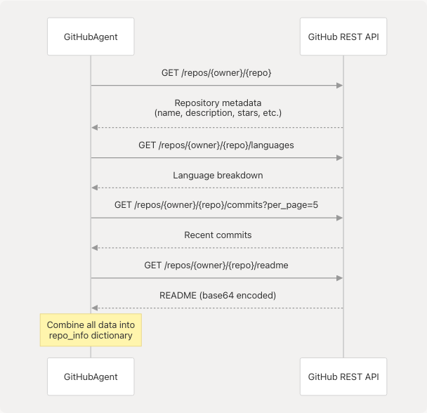
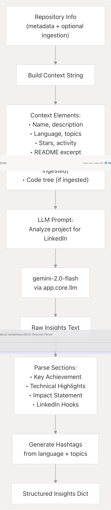
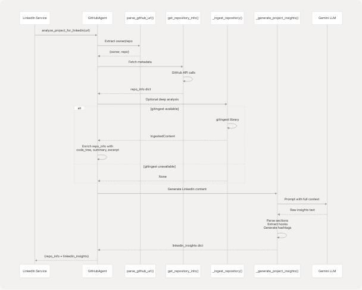
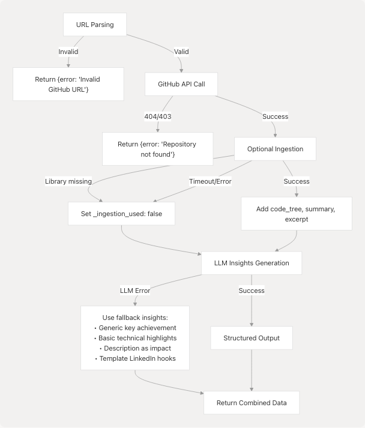

# GitHub Agent

## Purpose and Scope

The GitHub Agent is a specialized support service that extracts project information from GitHub repositories and generates LinkedIn-friendly content insights. It serves as a data enrichment layer for the LinkedIn Services by analyzing repository metadata, codebase structure, and technical details to produce professional content suitable for LinkedIn posts and profiles.

For information about the LinkedIn Services that consume this agent's output, see [LinkedIn Services](3.6-linkedin-services). For other support agents (Web Search, Web Content), see [Support Agents](3.7-support-agents).

**Sources:** [backend/app/agents/github\_agent.py1-418](https://github.com/harleenkaur28/AI-Resume-Parser/blob/b2bbd83d/backend/app/agents/github_agent.py#L1-L418)

---

## Architecture Overview

The GitHub Agent operates as a stateless service within the backend support layer, providing both shallow (API-based) and deep (codebase-level) repository analysis capabilities.


**Sources:** [backend/app/agents/github\_agent.py49-418](https://github.com/harleenkaur28/AI-Resume-Parser/blob/b2bbd83d/backend/app/agents/github_agent.py#L49-L418) [backend/pyproject.toml25](https://github.com/harleenkaur28/AI-Resume-Parser/blob/b2bbd83d/backend/pyproject.toml#L25-L25)

---

## Core Components

### GitHubAgent Class

The main class that orchestrates repository analysis and insight generation.

| Method | Purpose | Return Type |
| --- | --- | --- |
| `parse_github_url(url)` | Extract owner and repo from GitHub URLs | `Optional[Dict[str, str]]` |
| `get_repository_info(url)` | Fetch metadata via GitHub API | `Dict[str, Any]` |
| `_ingest_repository(url)` | Deep codebase analysis (optional) | `Optional[IngestedContent]` |
| `analyze_project_for_linkedin(url)` | Full analysis pipeline | `Dict[str, Any]` |
| `_generate_project_insights(repo_info)` | LLM-powered insight generation | `Dict[str, Any]` |
| `_get_readme_content(owner, repo)` | Fetch README text | `str` |

**Sources:** [backend/app/agents/github\_agent.py49-223](https://github.com/harleenkaur28/AI-Resume-Parser/blob/b2bbd83d/backend/app/agents/github_agent.py#L49-L223)

### IngestedContent Model

Pydantic model representing deep repository ingestion output from the `gitingest` library.

```
class IngestedContent(BaseModel):
    tree: str           # File structure tree
    summary: str        # Repository summary
    content: str        # Full codebase content

    def excerpt(max_chars: int = 4000) -> str:
        # Returns truncated content for LLM prompts
```

**Sources:** [backend/app/agents/github\_agent.py33-46](https://github.com/harleenkaur28/AI-Resume-Parser/blob/b2bbd83d/backend/app/agents/github_agent.py#L33-L46)

---

## GitHub API Integration

The agent uses the GitHub REST API v3 to retrieve repository metadata without requiring authentication.



### Retrieved Metadata

The `get_repository_info()` method constructs a comprehensive dictionary:

| Field | Source | Description |
| --- | --- | --- |
| `name` | `/repos/{owner}/{repo}` | Repository name |
| `full_name` | `/repos/{owner}/{repo}` | Full name (owner/repo) |
| `description` | `/repos/{owner}/{repo}` | Repository description |
| `stars` | `stargazers_count` | Number of stars |
| `forks` | `forks_count` | Number of forks |
| `language` | `/repos/{owner}/{repo}` | Primary language |
| `languages` | `/repos/{owner}/{repo}/languages` | All languages with bytes |
| `topics` | `/repos/{owner}/{repo}` | Repository topics |
| `readme_content` | `/repos/{owner}/{repo}/readme` | First 1000 chars of README |
| `recent_commits` | Count of `/commits?per_page=5` | Activity indicator |
| `is_active` | `recent_commits > 0` | Boolean activity flag |

**Sources:** [backend/app/agents/github\_agent.py90-159](https://github.com/harleenkaur28/AI-Resume-Parser/blob/b2bbd83d/backend/app/agents/github_agent.py#L90-L159)

---

## Deep Repository Ingestion

The agent optionally uses the `gitingest` library for deep codebase analysis. This is a best-effort feature with graceful degradation.

### Dependency Detection


**Sources:** [backend/app/agents/github\_agent.py12-27](https://github.com/harleenkaur28/AI-Resume-Parser/blob/b2bbd83d/backend/app/agents/github_agent.py#L12-L27)

### Ingestion Process

The `_ingest_repository()` method handles async/sync compatibility and content truncation:

```
# Adaptive async execution
if _HAS_GITINGEST_ASYNC:
    summary, tree, content = await _gitingest_async(url)
else:
    # Run sync in thread pool to avoid blocking
    loop = asyncio.get_running_loop()
    summary, tree, content = await loop.run_in_executor(
        None, lambda: _gitingest_sync(url)
    )
```

**Safeguards:**

* 60-second timeout on ingestion
* Content truncated to ~1.8M characters max to prevent memory issues
* All exceptions caught (optional feature)
* Returns `None` if unavailable or fails

**Sources:** [backend/app/agents/github\_agent.py161-202](https://github.com/harleenkaur28/AI-Resume-Parser/blob/b2bbd83d/backend/app/agents/github_agent.py#L161-L202)

---

## LLM-Powered Insight Generation

The agent uses Google Gemini to transform technical repository data into LinkedIn-appropriate content.



### Prompt Structure

The prompt sent to the LLM requests structured insights:

```
Analyze this GitHub project and provide LinkedIn-friendly insights:

Project: {name}
Description: {description}
Main Language: {language}
Stars: {stars}
Topics: {topics}
README excerpt: {readme_content[:500]}
Code Summary: {repo_summary[:600]}  # if ingested
Code Tree (partial): {code_tree[:1200]}  # if ingested

Provide insights in the following format:
1. Key Achievement: What makes this project notable?
2. Technical Highlights: Key technologies and innovations
3. Impact Statement: What problem does it solve?
4. LinkedIn Hooks: 3 engaging ways to present this project
```

**Sources:** [backend/app/agents/github\_agent.py248-332](https://github.com/harleenkaur28/AI-Resume-Parser/blob/b2bbd83d/backend/app/agents/github_agent.py#L248-L332)

### Insight Extraction Methods

| Method | Pattern | Purpose |
| --- | --- | --- |
| `_extract_insight(text, section)` | `r"{section}:?\s\*(.+?)(?=\n\d+. | $)"` |
| `_extract_hooks(text)` | Split by newlines, clean bullets | Extract 3 LinkedIn hook suggestions |
| `_generate_hashtags(repo_info)` | Language + topics + generic tags | Generate 5 relevant hashtags |

**Sources:** [backend/app/agents/github\_agent.py334-408](https://github.com/harleenkaur28/AI-Resume-Parser/blob/b2bbd83d/backend/app/agents/github_agent.py#L334-L408)

---

## Analysis Pipeline

### Complete Flow



**Sources:** [backend/app/agents/github\_agent.py224-246](https://github.com/harleenkaur28/AI-Resume-Parser/blob/b2bbd83d/backend/app/agents/github_agent.py#L224-L246)

---

## Output Schema

The `analyze_project_for_linkedin()` method returns a comprehensive dictionary:

### Top-Level Structure

```
{
    # From GitHub API
    "name": str,
    "full_name": str,
    "description": str,
    "stars": int,
    "forks": int,
    "language": str,
    "languages": dict,
    "topics": list,
    "created_at": str,
    "updated_at": str,
    "homepage": str,
    "license": str,
    "open_issues": int,
    "readme_content": str,
    "recent_commits": int,
    "is_active": bool,
    "url": str,

    # From ingestion (if available)
    "code_tree": str,  # First 5000 chars
    "repo_summary": str,
    "repo_content_excerpt": str,  # Max 6000 chars
    "_ingestion_used": bool,

    # From LLM analysis
    "linkedin_insights": {
        "key_achievement": str,
        "technical_highlights": str,
        "impact_statement": str,
        "linkedin_hooks": [str, str, str],
        "suggested_hashtags": [str, str, str, str, str],
        "project_stats": {
            "stars": int,
            "language": str,
            "is_active": bool
        }
    }
}
```

**Sources:** [backend/app/agents/github\_agent.py224-246](https://github.com/harleenkaur28/AI-Resume-Parser/blob/b2bbd83d/backend/app/agents/github_agent.py#L224-L246) [backend/app/agents/github\_agent.py292-309](https://github.com/harleenkaur28/AI-Resume-Parser/blob/b2bbd83d/backend/app/agents/github_agent.py#L292-L309)

---

## URL Parsing

The `parse_github_url()` method handles various GitHub URL formats:

### Supported Patterns

```
patterns = [
    r"github\.com/([^/]+)/([^/]+?)(?:\.git)?/?$",      # Basic: owner/repo
    r"github\.com/([^/]+)/([^/]+)/.*",                  # With path
    r"github\.com/([^/]+)/([^/]+)$",                    # Exact match
]
```

### Examples

| Input | Extracted |
| --- | --- |
| `https://github.com/user/repo` | `{owner: "user", repo: "repo"}` |
| `github.com/user/repo.git` | `{owner: "user", repo: "repo"}` |
| `https://github.com/user/repo/tree/main` | `{owner: "user", repo: "repo"}` |
| `user/repo` | Normalized to `https://user/repo` → parsed |

**Sources:** [backend/app/agents/github\_agent.py59-88](https://github.com/harleenkaur28/AI-Resume-Parser/blob/b2bbd83d/backend/app/agents/github_agent.py#L59-L88)

---

## Error Handling

The agent implements graceful degradation at multiple levels:

### Failure Modes and Fallbacks



**Sources:** [backend/app/agents/github\_agent.py86-88](https://github.com/harleenkaur28/AI-Resume-Parser/blob/b2bbd83d/backend/app/agents/github_agent.py#L86-L88) [backend/app/agents/github\_agent.py157-159](https://github.com/harleenkaur28/AI-Resume-Parser/blob/b2bbd83d/backend/app/agents/github_agent.py#L157-L159) [backend/app/agents/github\_agent.py314-332](https://github.com/harleenkaur28/AI-Resume-Parser/blob/b2bbd83d/backend/app/agents/github_agent.py#L314-L332)

---

## Integration Points

### Usage in LinkedIn Services

The LinkedIn Profile Generator and LinkedIn Post Generator use this agent to enrich content:

```
# Typical usage pattern
from app.agents.github_agent import analyze_github_for_linkedin

# In LinkedIn service
github_data = await analyze_github_for_linkedin(repo_url)

if not github_data.get("error"):
    # Use insights for content generation
    hooks = github_data["linkedin_insights"]["linkedin_hooks"]
    hashtags = github_data["linkedin_insights"]["suggested_hashtags"]
    project_stats = github_data["linkedin_insights"]["project_stats"]
```

**Sources:** [backend/app/agents/github\_agent.py412-417](https://github.com/harleenkaur28/AI-Resume-Parser/blob/b2bbd83d/backend/app/agents/github_agent.py#L412-L417)

---

## Dependencies

### Required Dependencies

| Package | Purpose | Constraint |
| --- | --- | --- |
| `requests` | GitHub API calls | Core |
| `pydantic` | Data validation | Core |
| `langchain-google-genai` | LLM integration | Core |

### Optional Dependencies

| Package | Purpose | Fallback Behavior |
| --- | --- | --- |
| `gitingest` | Deep repository analysis | Gracefully skipped, uses shallow analysis only |

**Sources:** [backend/pyproject.toml11-30](https://github.com/harleenkaur28/AI-Resume-Parser/blob/b2bbd83d/backend/pyproject.toml#L11-L30) [backend/app/agents/github\_agent.py12-27](https://github.com/harleenkaur28/AI-Resume-Parser/blob/b2bbd83d/backend/app/agents/github_agent.py#L12-L27)

---

## Configuration

### GitHub API Settings

```
github_api_base = "https://api.github.com"
headers = {
    "Accept": "application/vnd.github.v3+json",
    "User-Agent": "TalentSync-LinkedIn-Generator",
}
```

**Note:** No authentication required for public repositories. Rate limits apply (60 requests/hour for unauthenticated requests).

### Ingestion Limits

| Parameter | Value | Purpose |
| --- | --- | --- |
| `timeout` | 60 seconds | Max time for ingestion |
| `max_len` | 5 × 3 × 600,000 chars | Max content size before truncation |
| `excerpt_max_chars` | 4000-6000 chars | Content size for LLM prompts |

**Sources:** [backend/app/agents/github\_agent.py52-57](https://github.com/harleenkaur28/AI-Resume-Parser/blob/b2bbd83d/backend/app/agents/github_agent.py#L52-L57) [backend/app/agents/github\_agent.py162](https://github.com/harleenkaur28/AI-Resume-Parser/blob/b2bbd83d/backend/app/agents/github_agent.py#L162-L162) [backend/app/agents/github\_agent.py184-189](https://github.com/harleenkaur28/AI-Resume-Parser/blob/b2bbd83d/backend/app/agents/github_agent.py#L184-L189)

---

## Performance Considerations

### Execution Times

* **Shallow analysis** (API only): 1-3 seconds (3-4 HTTP requests)
* **Deep analysis** (with ingestion): 10-60 seconds (depends on repository size)
* **LLM insight generation**: 2-5 seconds (single LLM call)

### Optimization Strategies

1. **Content Truncation:** README limited to 1000 chars, ingested content to 6000 chars for LLM
2. **Async Execution:** Uses `asyncio` for non-blocking operations
3. **Thread Pool:** Sync `gitingest` runs in executor to avoid blocking event loop
4. **Early Returns:** URL validation fails fast before API calls
5. **Graceful Degradation:** Missing ingestion library doesn't block analysis

**Sources:** [backend/app/agents/github\_agent.py218-219](https://github.com/harleenkaur28/AI-Resume-Parser/blob/b2bbd83d/backend/app/agents/github_agent.py#L218-L219) [backend/app/agents/github\_agent.py176-177](https://github.com/harleenkaur28/AI-Resume-Parser/blob/b2bbd83d/backend/app/agents/github_agent.py#L176-L177) [backend/app/agents/github\_agent.py238](https://github.com/harleenkaur28/AI-Resume-Parser/blob/b2bbd83d/backend/app/agents/github_agent.py#L238-L238)

---

## Testing and Validation

### URL Parsing Edge Cases

The parser handles:

* Scheme-less URLs (adds `https://`)
* Trailing `.git` extension (removed)
* Repository paths (e.g., `/tree/main`, `/blob/master/file`)
* Leading/trailing slashes

**Sources:** [backend/app/agents/github\_agent.py64-82](https://github.com/harleenkaur28/AI-Resume-Parser/blob/b2bbd83d/backend/app/agents/github_agent.py#L64-L82)

### Insight Parsing Robustness

All parsing methods include fallback values:

* `_extract_insight()` returns generic message on failure
* `_extract_hooks()` returns 3 default hooks if parsing fails
* `_generate_hashtags()` always returns 5 hashtags (from language + topics + generic)

**Sources:** [backend/app/agents/github\_agent.py334-408](https://github.com/harleenkaur28/AI-Resume-Parser/blob/b2bbd83d/backend/app/agents/github_agent.py#L334-L408)
