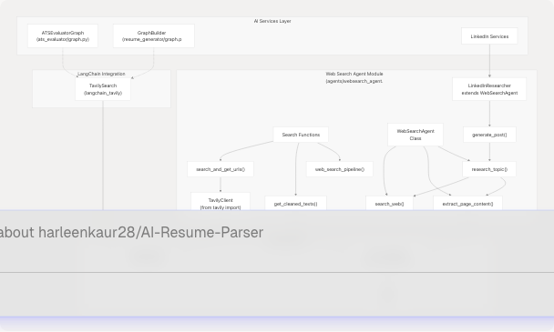
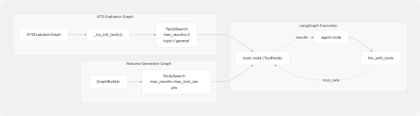

# Web Search Agent

## Purpose and Scope

The Web Search Agent provides intelligent web search capabilities using the Tavily Search API. It enables AI services to gather real-time information about companies, job roles, industry trends, and other topics by searching the web and extracting clean content. This agent is used primarily by the ATS Evaluator ([3.2](/harleenkaur28/AI-Resume-Parser/3.2-ats-evaluation-service)), Tailored Resume Service ([3.5](/harleenkaur28/AI-Resume-Parser/3.5-tailored-resume-service)), and LinkedIn Services ([3.6](/harleenkaur28/AI-Resume-Parser/3.6-linkedin-services)) to enrich their outputs with current information.

For web content extraction from specific URLs, see the Web Content Agent ([3.7.3](/harleenkaur28/AI-Resume-Parser/3.7.3-web-content-agent)). For GitHub repository analysis, see the GitHub Agent ([3.7.1](/harleenkaur28/AI-Resume-Parser/3.7.1-github-agent)).

**Sources:** [backend/app/agents/websearch\_agent.py1-271](https://github.com/harleenkaur28/AI-Resume-Parser/blob/b2bbd83d/backend/app/agents/websearch_agent.py#L1-L271)

---

## Architecture Overview

The Web Search Agent implements a two-stage pipeline: search and content extraction. It uses the Tavily API for high-quality web search results, then leverages the Web Content Agent to extract clean markdown content from the discovered URLs.


```

**Sources:** [backend/app/agents/websearch\_agent.py1-271](https://github.com/harleenkaur28/AI-Resume-Parser/blob/b2bbd83d/backend/app/agents/websearch_agent.py#L1-L271) [backend/app/services/ats\_evaluator/graph.py27-40](https://github.com/harleenkaur28/AI-Resume-Parser/blob/b2bbd83d/backend/app/services/ats_evaluator/graph.py#L27-L40) [backend/app/services/resume\_generator/graph.py151-153](https://github.com/harleenkaur28/AI-Resume-Parser/blob/b2bbd83d/backend/app/services/resume_generator/graph.py#L151-L153)

---

## Core Components

### Tavily Client Integration

The agent initializes a `TavilyClient` instance when the `TAVILY_API_KEY` environment variable is present. The client is stored as a module-level singleton to avoid repeated initialization.

| Component | Type | Purpose |
| --- | --- | --- |
| `_TAVILY_API_KEY` | `str` | Environment variable storing the Tavily API key |
| `_tavily` | `Optional[TavilyClient]` | Singleton client instance, `None` if key is missing |
| `search_and_get_urls()` | Function | Performs web search and returns URLs |

**Configuration:**

* `max_results`: Number of search results to return (default 10)
* `search_depth`: "advanced" or "basic" (controls search quality vs speed)
* `include_answer`: Set to `False` (we extract our own content)
* `include_raw_content`: Set to `False` (we use Jina AI instead)

**Sources:** [backend/app/agents/websearch\_agent.py63-96](https://github.com/harleenkaur28/AI-Resume-Parser/blob/b2bbd83d/backend/app/agents/websearch_agent.py#L63-L96)

### WebSearchAgent Class

The `WebSearchAgent` class provides an object-oriented interface for web searching with LLM-powered summarization.


**Key Methods:**

| Method | Returns | Purpose |
| --- | --- | --- |
| `search_web()` | `List[Dict[str, str]]` | Returns list of URLs with metadata |
| `extract_page_content()` | `str` | Extracts markdown content from a single URL |
| `research_topic()` | `Dict[str, Any]` | Searches, extracts content, and generates summary |
| `_summarize_research()` | `str` | Uses LLM to summarize research findings |

**Sources:** [backend/app/agents/websearch\_agent.py129-203](https://github.com/harleenkaur28/AI-Resume-Parser/blob/b2bbd83d/backend/app/agents/websearch_agent.py#L129-L203)

### LinkedInResearcher Class

The `LinkedInResearcher` extends `WebSearchAgent` to specialize in generating LinkedIn posts from research topics.

**Additional Configuration:**

* `sentences`: Maximum number of sentences for the LinkedIn post (default 3)

**Key Method:**

* `generate_post(topic: str)`: Researches a topic and generates a professional LinkedIn post with hooks and minimal hashtags

**Sources:** [backend/app/agents/websearch\_agent.py205-236](https://github.com/harleenkaur28/AI-Resume-Parser/blob/b2bbd83d/backend/app/agents/websearch_agent.py#L205-L236)

---

## Search Pipeline

The web search pipeline follows a multi-stage process from query to cleaned content.


**Pipeline Stages:**

1. **Search Stage** (`search_and_get_urls`):

   * Sends query to Tavily API
   * Extracts URLs from results
   * Limits to requested number of results
2. **Content Extraction Stage** (`get_cleaned_texts`):

   * Iterates through URLs
   * Fetches markdown content via Jina AI
   * Filters out empty results
   * Returns structured data with URL and content

**Sources:** [backend/app/agents/websearch\_agent.py69-122](https://github.com/harleenkaur28/AI-Resume-Parser/blob/b2bbd83d/backend/app/agents/websearch_agent.py#L69-L122)

---

## LangChain Integration

The Web Search Agent is integrated into LangChain/LangGraph workflows through the `TavilySearch` tool from the `langchain_tavily` package.

### TavilySearch Tool Configuration



**ATS Evaluator Usage:**
[backend/app/services/ats\_evaluator/graph.py27-40](https://github.com/harleenkaur28/AI-Resume-Parser/blob/b2bbd83d/backend/app/services/ats_evaluator/graph.py#L27-L40)

* Tool initialized in `_try_init_tavily()` helper function
* Returns empty list if import fails
* Bound to LLM in `ATSEvaluatorGraph.__init__`
* Maximum 3 results per search

**Resume Generator Usage:**
[backend/app/services/resume\_generator/graph.py151-153](https://github.com/harleenkaur28/AI-Resume-Parser/blob/b2bbd83d/backend/app/services/resume_generator/graph.py#L151-L153)

* Tool created directly in `run_resume_pipeline()`
* Configurable via `max_tool_results` parameter
* Integrated into `GraphBuilder` with system prompts

**Sources:** [backend/app/services/ats\_evaluator/graph.py27-40](https://github.com/harleenkaur28/AI-Resume-Parser/blob/b2bbd83d/backend/app/services/ats_evaluator/graph.py#L27-L40) [backend/app/services/resume\_generator/graph.py151-165](https://github.com/harleenkaur28/AI-Resume-Parser/blob/b2bbd83d/backend/app/services/resume_generator/graph.py#L151-L165)

---

## Error Handling and Resilience

The Web Search Agent implements multiple layers of error handling to ensure graceful degradation.

### Retry Logic

| Parameter | Value | Purpose |
| --- | --- | --- |
| `REQUEST_TIMEOUT` | 15 seconds | Maximum time for HTTP requests |
| `MAX_RETRIES` | 2 | Number of retry attempts |
| `BACKOFF_BASE` | 0.7 | Base delay for exponential backoff |

**Retry Strategy:**

* Retries on transient HTTP errors (429, 500, 502, 503, 504)
* Exponential backoff: `BACKOFF_BASE * (2^attempt)`
* Random user agent rotation to avoid rate limiting

**Sources:** [backend/app/agents/websearch\_agent.py21-59](https://github.com/harleenkaur28/AI-Resume-Parser/blob/b2bbd83d/backend/app/agents/websearch_agent.py#L21-L59)

### Graceful Degradation

```


**Fallback Behaviors:**

* Missing API key: Returns empty list, logs warning
* Search failure: Returns empty list, logs exception
* LLM unavailable: Returns raw content without summarization
* Summarization failure: Returns fallback message

**Sources:** [backend/app/agents/websearch\_agent.py72-96](https://github.com/harleenkaur28/AI-Resume-Parser/blob/b2bbd83d/backend/app/agents/websearch_agent.py#L72-L96) [backend/app/agents/websearch\_agent.py171-202](https://github.com/harleenkaur28/AI-Resume-Parser/blob/b2bbd83d/backend/app/agents/websearch_agent.py#L171-L202)

---

## Usage Patterns

### Direct Function Usage

For simple search and content extraction without classes:

```
# Example usage (not actual code, for illustration)
results = web_search_pipeline(
    query="Python developer salary 2024",
    max_results=5
)
# Returns: [{"url": "...", "md_body_content": "..."}]
```

**Sources:** [backend/app/agents/websearch\_agent.py113-122](https://github.com/harleenkaur28/AI-Resume-Parser/blob/b2bbd83d/backend/app/agents/websearch_agent.py#L113-L122)

### Agent-Based Research

For research with LLM-powered summarization:

```
# Example usage (not actual code, for illustration)
agent = WebSearchAgent(max_results=10)
research = await agent.research_topic(
    topic="machine learning trends",
    context=""
)
# Returns: {
#     "search_results": [...],
#     "extracted_content": [...],
#     "research_summary": "..."
# }
```

**Sources:** [backend/app/agents/websearch\_agent.py150-169](https://github.com/harleenkaur28/AI-Resume-Parser/blob/b2bbd83d/backend/app/agents/websearch_agent.py#L150-L169)

### LinkedIn Post Generation

For generating professional LinkedIn content:

```
# Example usage (not actual code, for illustration)
researcher = LinkedInResearcher(max_results=10, sentences=3)
post_data = await researcher.generate_post(topic="AI in healthcare")
# Returns: {
#     "search_results": [...],
#     "extracted_content": [...],
#     "research_summary": "...",
#     "linkedin_post": "..."
# }
```

**Sources:** [backend/app/agents/websearch\_agent.py210-235](https://github.com/harleenkaur28/AI-Resume-Parser/blob/b2bbd83d/backend/app/agents/websearch_agent.py#L210-L235)

---

## Configuration

### Environment Variables

| Variable | Required | Purpose |
| --- | --- | --- |
| `TAVILY_API_KEY` | Yes | API key for Tavily Search service |

**Sources:** [backend/app/agents/websearch\_agent.py63-66](https://github.com/harleenkaur28/AI-Resume-Parser/blob/b2bbd83d/backend/app/agents/websearch_agent.py#L63-L66)

### User Agent Rotation

The agent rotates through multiple user agent strings to avoid detection and rate limiting:

* Windows Chrome 124
* macOS Safari 16.4
* Linux Chrome 124

**Sources:** [backend/app/agents/websearch\_agent.py25-35](https://github.com/harleenkaur28/AI-Resume-Parser/blob/b2bbd83d/backend/app/agents/websearch_agent.py#L25-L35)

### Search Parameters

**Tavily Search Configuration:**

* `search_depth`: "advanced" (higher quality) vs "basic" (faster)
* `include_answer`: `False` (we generate our own summaries)
* `include_raw_content`: `False` (we use Jina AI for cleaner extraction)
* `include_images`: `False` (text-only focus)

**Sources:** [backend/app/agents/websearch\_agent.py76-84](https://github.com/harleenkaur28/AI-Resume-Parser/blob/b2bbd83d/backend/app/agents/websearch_agent.py#L76-L84)

---

## Integration Points

### Services Using Web Search Agent

| Service | Integration Method | Purpose |
| --- | --- | --- |
| ATS Evaluator | `TavilySearch` tool via LangGraph | Research companies and job market trends |
| Tailored Resume | `TavilySearch` tool via LangGraph | Gather company information and tech stack details |
| LinkedIn Services | `LinkedInResearcher` class | Generate research-backed LinkedIn posts |

**Sources:** [backend/app/services/ats\_evaluator/graph.py27-40](https://github.com/harleenkaur28/AI-Resume-Parser/blob/b2bbd83d/backend/app/services/ats_evaluator/graph.py#L27-L40) [backend/app/services/resume\_generator/graph.py151-153](https://github.com/harleenkaur28/AI-Resume-Parser/blob/b2bbd83d/backend/app/services/resume_generator/graph.py#L151-L153)

### Dependencies

The Web Search Agent depends on:

* **Web Content Agent**: For extracting markdown from URLs ([3.7.3](/harleenkaur28/AI-Resume-Parser/3.7.3-web-content-agent))
* **LLM Core**: For summarizing research findings ([3.8](/harleenkaur28/AI-Resume-Parser/3.8-llm-integration-and-prompt-engineering))
* **Tavily API**: External search service
* **Jina AI**: External content extraction service (via Web Content Agent)

**Sources:** [backend/app/agents/websearch\_agent.py13](https://github.com/harleenkaur28/AI-Resume-Parser/blob/b2bbd83d/backend/app/agents/websearch_agent.py#L13-L13) [backend/app/agents/websearch\_agent.py125](https://github.com/harleenkaur28/AI-Resume-Parser/blob/b2bbd83d/backend/app/agents/websearch_agent.py#L125-L125)
