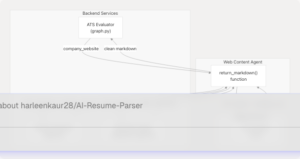
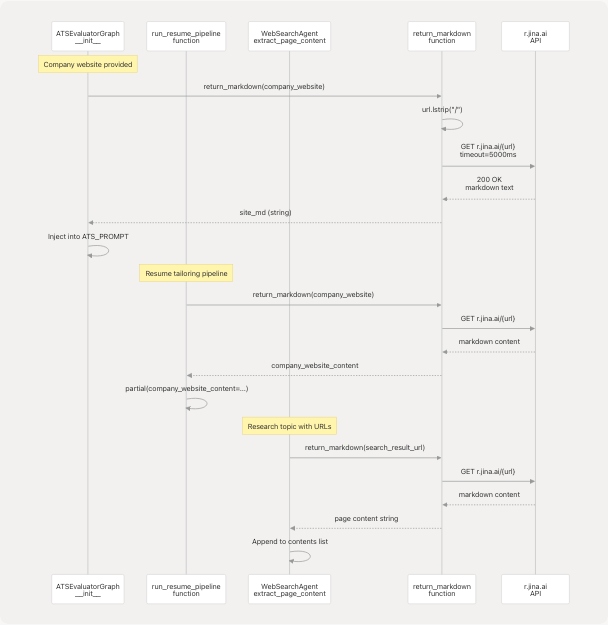

# Web Content Agent

## Purpose and Scope

The Web Content Agent is a lightweight utility service that provides web page content extraction capabilities to other backend services. It converts arbitrary URLs into clean markdown format using the Jina AI Reader API, enabling AI services to consume web content without dealing with HTML parsing, JavaScript rendering, or CORS restrictions.

This page documents the Web Content Agent's architecture, implementation, and integration points. For web search functionality (URL discovery via Tavily), see [Web Search Agent](/harleenkaur28/AI-Resume-Parser/3.7.2-web-search-agent). For GitHub repository analysis, see [GitHub Agent](/harleenkaur28/AI-Resume-Parser/3.7.1-github-agent).

**Sources:** [backend/app/agents/web\_content\_agent.py1-23](https://github.com/harleenkaur28/AI-Resume-Parser/blob/b2bbd83d/backend/app/agents/web_content_agent.py#L1-L23)

---

## Architecture Overview

The Web Content Agent implements a simple proxy pattern, wrapping the Jina AI Reader service to provide a single-function interface for content extraction. Unlike the Web Search Agent which discovers URLs, this agent focuses solely on extracting clean text from known URLs.


```

**Diagram: Web Content Agent Integration Architecture**

**Sources:** [backend/app/agents/web\_content\_agent.py1-23](https://github.com/harleenkaur28/AI-Resume-Parser/blob/b2bbd83d/backend/app/agents/web_content_agent.py#L1-L23) [backend/app/services/ats\_evaluator/graph.py13-82](https://github.com/harleenkaur28/AI-Resume-Parser/blob/b2bbd83d/backend/app/services/ats_evaluator/graph.py#L13-L82) [backend/app/services/resume\_generator/graph.py20-118](https://github.com/harleenkaur28/AI-Resume-Parser/blob/b2bbd83d/backend/app/services/resume_generator/graph.py#L20-L118) [backend/app/agents/websearch\_agent.py13-148](https://github.com/harleenkaur28/AI-Resume-Parser/blob/b2bbd83d/backend/app/agents/websearch_agent.py#L13-L148)

---

## Core Implementation

The Web Content Agent consists of a single function that handles all content extraction logic. The implementation prioritizes simplicity and reliability over complexity.

### Function Signature

```
def return_markdown(url: str, timeout: int = 5000) -> str
```

| Parameter | Type | Default | Description |
| --- | --- | --- | --- |
| `url` | `str` | Required | Target URL to extract content from |
| `timeout` | `int` | `5000` | Request timeout in milliseconds |
| **Returns** | `str` | - | Markdown-formatted page content or empty string on failure |

**Sources:** [backend/app/agents/web\_content\_agent.py4-22](https://github.com/harleenkaur28/AI-Resume-Parser/blob/b2bbd83d/backend/app/agents/web_content_agent.py#L4-L22)

### Processing Flow


**Diagram: Content Extraction Flow**

**Sources:** [backend/app/agents/web\_content\_agent.py4-22](https://github.com/harleenkaur28/AI-Resume-Parser/blob/b2bbd83d/backend/app/agents/web_content_agent.py#L4-L22)

---

## Jina AI Integration

### Service Endpoint

The agent uses Jina AI's Reader API, which provides a simple URL-based interface for converting web pages to markdown:

```
https://r.jina.ai/{target_url}
```

**Key Features of Jina AI Reader:**

* Automatic HTML parsing and cleaning
* JavaScript rendering (handles dynamic content)
* Removes ads, navigation, and boilerplate
* Returns clean markdown format
* CORS-friendly (bypasses browser restrictions)
* No API key required for basic usage

### URL Construction

The function prepends `https://r.jina.ai/` to the input URL, stripping any leading slashes:

```
res = requests.get(
    "https://r.jina.ai/" + url.lstrip("/"),
    timeout=timeout,
)
```

**Example transformations:**

* Input: `"https://company.com/about"`
* Jina URL: `"https://r.jina.ai/https://company.com/about"`
* Returns: Clean markdown of the about page

**Sources:** [backend/app/agents/web\_content\_agent.py11-14](https://github.com/harleenkaur28/AI-Resume-Parser/blob/b2bbd83d/backend/app/agents/web_content_agent.py#L11-L14)

---

## Integration Points

The Web Content Agent is imported and used by three primary services in the backend. Each service uses it for different purposes but follows the same pattern.

### 1. ATS Evaluator Service

**File:** [backend/app/services/ats\_evaluator/graph.py13-82](https://github.com/harleenkaur28/AI-Resume-Parser/blob/b2bbd83d/backend/app/services/ats_evaluator/graph.py#L13-L82)

```
from app.agents.web_content_agent import return_markdown

# Usage in ATSEvaluatorGraph.__init__
site_md = return_markdown(company_website) if company_website else ""

self.system_prompt = ATS_PROMPT.format_messages(
    resume=resume_text.strip(),
    jd=(jd_text or "").strip(),
    company_name=(company_name or "the company"),
    company_website_content=site_md,  # Injected into prompt
)
```

**Purpose:** Fetches company website content to provide context for ATS evaluation. The markdown is injected into the system prompt to help the LLM understand company culture, tech stack, and values when scoring resumes.

**Sources:** [backend/app/services/ats\_evaluator/graph.py13-82](https://github.com/harleenkaur28/AI-Resume-Parser/blob/b2bbd83d/backend/app/services/ats_evaluator/graph.py#L13-L82)

### 2. Resume Generator Service

**File:** [backend/app/services/resume\_generator/graph.py20-118](https://github.com/harleenkaur28/AI-Resume-Parser/blob/b2bbd83d/backend/app/services/resume_generator/graph.py#L20-L118)

```
from app.agents.web_content_agent import return_markdown

# Usage in run_resume_pipeline
company_website_content = (
    return_markdown(company_website) if company_website else ""
)

# Injected into prompt template
prompt = ChatPromptTemplate.from_template(
    """
    Company website content:
    {company_website_content}

    Job description:
    {jd}

    Resume:
    {resume}
    """
).partial(
    company_website_content=company_website_content,
    # ... other params
)
```

**Purpose:** Extracts company information to tailor resumes for specific companies. The LLM uses this content to align the resume with company values, products, and tech stack.

**Sources:** [backend/app/services/resume\_generator/graph.py20-118](https://github.com/harleenkaur28/AI-Resume-Parser/blob/b2bbd83d/backend/app/services/resume_generator/graph.py#L20-L118)

### 3. Web Search Agent

**File:** [backend/app/agents/websearch\_agent.py13-148](https://github.com/harleenkaur28/AI-Resume-Parser/blob/b2bbd83d/backend/app/agents/websearch_agent.py#L13-L148)

```
from app.agents.web_content_agent import return_markdown

# Usage in WebSearchAgent class methods
def extract_page_content(self, url: str) -> str:
    return return_markdown(url)

def get_cleaned_texts(urls: List[str]) -> List[Dict[str, str]]:
    texts: List[Dict[str, str]] = []
    for u in urls:
        md = return_markdown(u)
        if md and md.strip():
            texts.append({
                "url": u,
                "md_body_content": md,
            })
    return texts
```

**Purpose:** Converts search result URLs (from Tavily) into readable content for research and summarization. Used in LinkedIn post generation and topic research.

**Sources:** [backend/app/agents/websearch\_agent.py13-148](https://github.com/harleenkaur28/AI-Resume-Parser/blob/b2bbd83d/backend/app/agents/websearch_agent.py#L13-L148)

---

## Service Interaction Diagram

This diagram shows the exact code entities involved in content extraction flows:



**Diagram: Code-Level Service Integration Flow**

**Sources:** [backend/app/agents/web\_content\_agent.py4-22](https://github.com/harleenkaur28/AI-Resume-Parser/blob/b2bbd83d/backend/app/agents/web_content_agent.py#L4-L22) [backend/app/services/ats\_evaluator/graph.py82](https://github.com/harleenkaur28/AI-Resume-Parser/blob/b2bbd83d/backend/app/services/ats_evaluator/graph.py#L82-L82) [backend/app/services/resume\_generator/graph.py116-118](https://github.com/harleenkaur28/AI-Resume-Parser/blob/b2bbd83d/backend/app/services/resume_generator/graph.py#L116-L118) [backend/app/agents/websearch\_agent.py147-148](https://github.com/harleenkaur28/AI-Resume-Parser/blob/b2bbd83d/backend/app/agents/websearch_agent.py#L147-L148)

---

## Error Handling Strategy

The Web Content Agent implements a fail-safe error handling approach that prioritizes system stability over detailed error reporting.

### Error Scenarios

| Scenario | Behavior | Return Value |
| --- | --- | --- |
| Empty URL input | Early return without request | `""` (empty string) |
| Network timeout | Exception caught | `""` (empty string) |
| HTTP error status | Status check fails | `""` (empty string) |
| Invalid URL format | requests.get() exception | `""` (empty string) |
| Jina service down | Connection error | `""` (empty string) |
| Empty response body | `res.text` is falsy | `""` (empty string) |

### Implementation Details

```
if not url:
    return ""  # Guard clause for empty URLs

try:
    res = requests.get(
        "https://r.jina.ai/" + url.lstrip("/"),
        timeout=timeout,
    )

    # Only return content if both conditions are met
    if res.status_code == 200 and res.text:
        return res.text

    return ""  # Non-200 status or empty response

except Exception:
    return ""  # All exceptions result in empty string
```

**Design Rationale:**

* Silent failures prevent cascading errors in calling services
* Empty string is a valid "no content" indicator that doesn't break prompt templates
* Calling services can check for empty strings and provide fallback behavior
* No logging to avoid log spam from transient network issues

**Sources:** [backend/app/agents/web\_content\_agent.py4-22](https://github.com/harleenkaur28/AI-Resume-Parser/blob/b2bbd83d/backend/app/agents/web_content_agent.py#L4-L22)

---

## Usage Patterns

### Pattern 1: Conditional Fetch with Ternary

Most common pattern - only fetch if URL is provided:

```
company_website_content = (
    return_markdown(company_website) if company_website else ""
)
```

**Advantages:**

* Single line of code
* Handles None or empty string inputs
* No additional error handling needed

**Used in:** [backend/app/services/resume\_generator/graph.py116-118](https://github.com/harleenkaur28/AI-Resume-Parser/blob/b2bbd83d/backend/app/services/resume_generator/graph.py#L116-L118) [backend/app/services/ats\_evaluator/graph.py82](https://github.com/harleenkaur28/AI-Resume-Parser/blob/b2bbd83d/backend/app/services/ats_evaluator/graph.py#L82-L82)

### Pattern 2: Batch Processing

Process multiple URLs and filter out failures:

```
def get_cleaned_texts(urls: List[str]) -> List[Dict[str, str]]:
    texts: List[Dict[str, str]] = []
    for u in urls:
        md = return_markdown(u)
        if md and md.strip():  # Only include successful extractions
            texts.append({
                "url": u,
                "md_body_content": md,
            })
    return texts
```

**Advantages:**

* Automatically filters out failed extractions
* Continues processing even if some URLs fail
* Returns partial results instead of failing entirely

**Used in:** [backend/app/agents/websearch\_agent.py99-110](https://github.com/harleenkaur28/AI-Resume-Parser/blob/b2bbd83d/backend/app/agents/websearch_agent.py#L99-L110)

### Pattern 3: Method Wrapper

Encapsulate in a class method for consistent interface:

```
class WebSearchAgent:
    def extract_page_content(self, url: str) -> str:
        return return_markdown(url)
```

**Advantages:**

* Consistent with other agent methods
* Easy to mock in tests
* Could add logging or caching in the future

**Used in:** [backend/app/agents/websearch\_agent.py147-148](https://github.com/harleenkaur28/AI-Resume-Parser/blob/b2bbd83d/backend/app/agents/websearch_agent.py#L147-L148)

**Sources:** [backend/app/services/resume\_generator/graph.py116-118](https://github.com/harleenkaur28/AI-Resume-Parser/blob/b2bbd83d/backend/app/services/resume_generator/graph.py#L116-L118) [backend/app/services/ats\_evaluator/graph.py82](https://github.com/harleenkaur28/AI-Resume-Parser/blob/b2bbd83d/backend/app/services/ats_evaluator/graph.py#L82-L82) [backend/app/agents/websearch\_agent.py99-110](https://github.com/harleenkaur28/AI-Resume-Parser/blob/b2bbd83d/backend/app/agents/websearch_agent.py#L99-L110) [backend/app/agents/websearch\_agent.py147-148](https://github.com/harleenkaur28/AI-Resume-Parser/blob/b2bbd83d/backend/app/agents/websearch_agent.py#L147-L148)

---

## Performance Characteristics

### Timeout Configuration

| Setting | Value | Rationale |
| --- | --- | --- |
| Default timeout | 5000ms (5 seconds) | Balances completeness vs responsiveness |
| No retries | N/A | Fail-fast to avoid blocking caller |
| No connection pooling | N/A | Low request frequency doesn't warrant pooling |

### Performance Considerations

**Latency Breakdown:**

1. DNS resolution: ~50-200ms
2. TLS handshake with Jina: ~100-300ms
3. Jina fetches target URL: ~500-2000ms
4. Jina processes/cleans HTML: ~200-500ms
5. Response transfer: ~50-200ms
6. **Total: 1-3 seconds typical**

**Blocking Behavior:**

* All calls are synchronous (blocking)
* Called from async services but not awaited
* Blocks the current thread until completion or timeout

**Optimization Opportunities:**

* Could implement async version with `httpx` or `aiohttp`
* Could add result caching for repeated URLs
* Could batch requests if Jina supports it

**Sources:** [backend/app/agents/web\_content\_agent.py4-22](https://github.com/harleenkaur28/AI-Resume-Parser/blob/b2bbd83d/backend/app/agents/web_content_agent.py#L4-L22)

---

## Comparison with Web Search Agent

The Web Content Agent and Web Search Agent serve complementary roles:

| Feature | Web Content Agent | Web Search Agent |
| --- | --- | --- |
| **Primary function** | Extract content from known URLs | Discover URLs via search |
| **External service** | Jina AI (r.jina.ai) | Tavily Search API |
| **Input** | Single URL string | Search query string |
| **Output** | Markdown text | List of URLs + metadata |
| **Error handling** | Silent (returns empty string) | Returns empty list |
| **Integration** | Used by 3 services | Uses Web Content Agent |
| **Authentication** | None required | Requires TAVILY\_API\_KEY |
| **Code location** | `web_content_agent.py` | `websearch_agent.py` |

**Common Usage Pattern:**

```
# 1. Web Search Agent finds URLs
urls = search_and_get_urls("company tech stack", num_results=5)

# 2. Web Content Agent extracts content
for url in urls:
    content = return_markdown(url)
    # Process content...
```
```

**Sources:** [backend/app/agents/web\_content\_agent.py1-23](https://github.com/harleenkaur28/AI-Resume-Parser/blob/b2bbd83d/backend/app/agents/web_content_agent.py#L1-L23) [backend/app/agents/websearch\_agent.py1-271](https://github.com/harleenkaur28/AI-Resume-Parser/blob/b2bbd83d/backend/app/agents/websearch_agent.py#L1-L271)

---

## Limitations and Constraints

### Known Limitations

1. **No Authentication Support**

   * Cannot access pages requiring login
   * No support for passing headers or cookies
   * Limited to publicly accessible URLs
2. **No Rate Limiting**

   * No built-in rate limiting against Jina API
   * Could hit Jina's rate limits under heavy load
   * No backoff or retry logic
3. **Synchronous Only**

   * Blocks calling thread during request
   * Cannot leverage async I/O benefits
   * May cause performance issues with many URLs
4. **No Caching**

   * Fetches same URL multiple times if called repeatedly
   * Wastes bandwidth and increases latency
   * No cache invalidation strategy
5. **Silent Failures**

   * No logging or error reporting
   * Difficult to diagnose issues in production
   * Cannot distinguish between different error types

### Constraints

| Constraint | Impact |
| --- | --- |
| Jina service availability | Total failure if Jina is down |
| Network connectivity | Requires stable internet connection |
| URL format | Must be valid HTTP/HTTPS URL |
| Content size | May timeout on very large pages |
| JavaScript complexity | Jina may not render all dynamic content |

**Sources:** [backend/app/agents/web\_content\_agent.py1-23](https://github.com/harleenkaur28/AI-Resume-Parser/blob/b2bbd83d/backend/app/agents/web_content_agent.py#L1-L23)

---

## Future Enhancement Opportunities

### Potential Improvements

1. **Async Support**

   ```
   ```
   async def return_markdown_async(url: str, timeout: int = 5000) -> str:
       async with httpx.AsyncClient() as client:
           res = await client.get(f"https://r.jina.ai/{url.lstrip('/')}")
           return res.text if res.status_code == 200 else ""
   ```
   ```
2. **Result Caching**

   ```
   ```
   from functools import lru_cache

   @lru_cache(maxsize=128)
   def return_markdown_cached(url: str, timeout: int = 5000) -> str:
       # Current implementation
   ```
   ```
3. **Enhanced Error Handling**

   ```
   ```
   from typing import Tuple

   def return_markdown_with_status(url: str) -> Tuple[str, Optional[str]]:
       """Returns (content, error_message)"""
   ```
   ```
4. **Rate Limiting**

   ```
   ```
   from ratelimit import limits, sleep_and_retry

   @sleep_and_retry
   @limits(calls=10, period=60)  # 10 calls per minute
   def return_markdown(url: str) -> str:
       # Current implementation
   ```
   ```
5. **Logging Integration**

   ```
   ```
   import logging

   logger = logging.getLogger(__name__)

   def return_markdown(url: str) -> str:
       logger.info(f"Fetching content from {url}")
       # ... with error logging
   ```
   ```

**Sources:** [backend/app/agents/web\_content\_agent.py1-23](https://github.com/harleenkaur28/AI-Resume-Parser/blob/b2bbd83d/backend/app/agents/web_content_agent.py#L1-L23)

---

## Dependencies

### Python Libraries

| Package | Version | Purpose |
| --- | --- | --- |
| `requests` | Latest | HTTP client for making GET requests |

### External Services

| Service | Endpoint | Authentication | Purpose |
| --- | --- | --- | --- |
| Jina AI Reader | `r.jina.ai` | None | URL-to-markdown conversion |

### File Dependencies

The Web Content Agent is imported by:

* [backend/app/services/ats\_evaluator/graph.py13](https://github.com/harleenkaur28/AI-Resume-Parser/blob/b2bbd83d/backend/app/services/ats_evaluator/graph.py#L13-L13)
* [backend/app/services/resume\_generator/graph.py20](https://github.com/harleenkaur28/AI-Resume-Parser/blob/b2bbd83d/backend/app/services/resume_generator/graph.py#L20-L20)
* [backend/app/agents/websearch\_agent.py13](https://github.com/harleenkaur28/AI-Resume-Parser/blob/b2bbd83d/backend/app/agents/websearch_agent.py#L13-L13)

**Sources:** [backend/app/agents/web\_content\_agent.py1-2](https://github.com/harleenkaur28/AI-Resume-Parser/blob/b2bbd83d/backend/app/agents/web_content_agent.py#L1-L2)

---

## Summary

The Web Content Agent provides a minimal, reliable interface for converting web URLs to clean markdown content. Its simple design makes it easy to integrate across multiple services while its fail-safe error handling ensures system stability. The agent serves as a critical bridge between web content and AI services, enabling context-aware resume tailoring, ATS evaluation, and research capabilities.

**Key Characteristics:**

* Single-function API (`return_markdown`)
* Zero configuration required
* Silent error handling (returns empty string)
* Synchronous blocking I/O
* Jina AI-powered content extraction
* Used by 3 core backend services

**Sources:** [backend/app/agents/web\_content\_agent.py1-23](https://github.com/harleenkaur28/AI-Resume-Parser/blob/b2bbd83d/backend/app/agents/web_content_agent.py#L1-L23)
