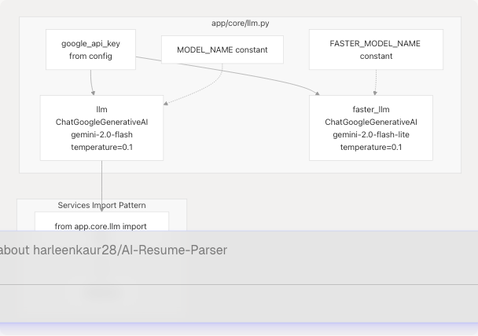
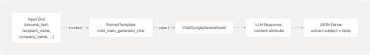
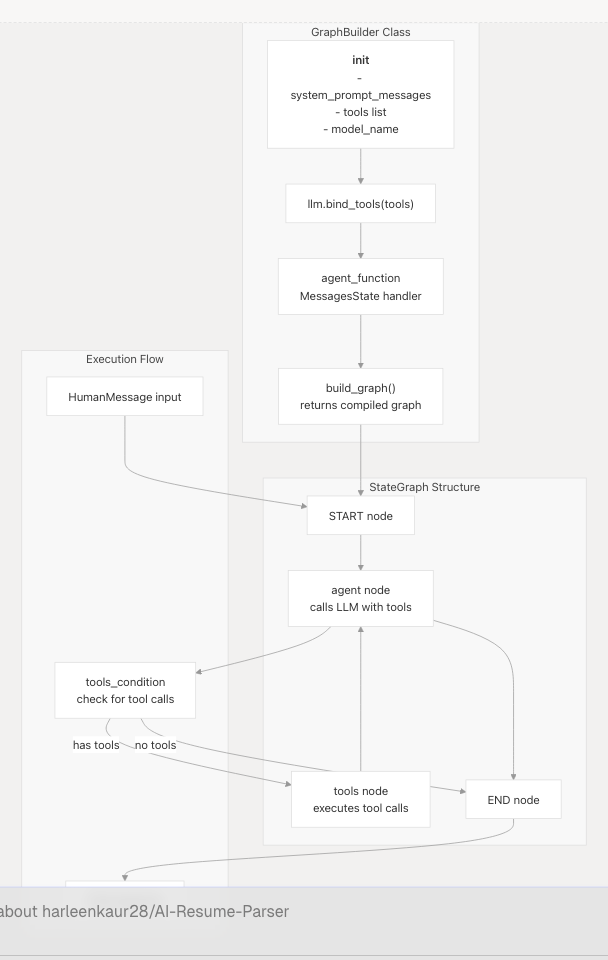
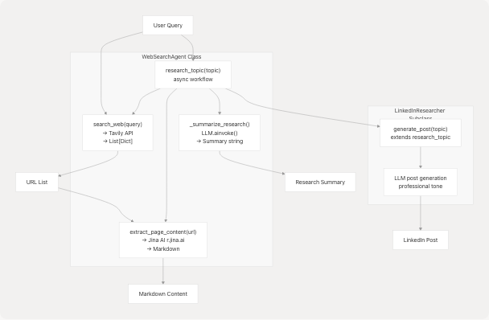
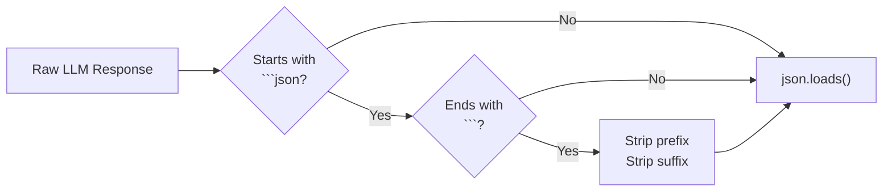

# LLM Integration & Prompt Engineering

> Source: https://deepwiki.com/harleenkaur28/AI-Resume-Parser/3.8-llm-integration-and-prompt-engineering

# LLM Integration & Prompt Engineering

Relevant source files

* [backend/app/agents/github\_agent.py](https://github.com/harleenkaur28/AI-Resume-Parser/blob/b2bbd83d/backend/app/agents/github_agent.py)
* [backend/app/agents/web\_content\_agent.py](https://github.com/harleenkaur28/AI-Resume-Parser/blob/b2bbd83d/backend/app/agents/web_content_agent.py)
* [backend/app/agents/websearch\_agent.py](https://github.com/harleenkaur28/AI-Resume-Parser/blob/b2bbd83d/backend/app/agents/websearch_agent.py)
* [backend/app/core/\_\_init\_\_.py](https://github.com/harleenkaur28/AI-Resume-Parser/blob/b2bbd83d/backend/app/core/__init__.py)
* [backend/app/core/llm.py](https://github.com/harleenkaur28/AI-Resume-Parser/blob/b2bbd83d/backend/app/core/llm.py)
* [backend/app/services/ats\_evaluator/graph.py](https://github.com/harleenkaur28/AI-Resume-Parser/blob/b2bbd83d/backend/app/services/ats_evaluator/graph.py)
* [backend/app/services/cold\_mail.py](https://github.com/harleenkaur28/AI-Resume-Parser/blob/b2bbd83d/backend/app/services/cold_mail.py)
* [backend/app/services/resume\_generator/graph.py](https://github.com/harleenkaur28/AI-Resume-Parser/blob/b2bbd83d/backend/app/services/resume_generator/graph.py)
* [backend/pyproject.toml](https://github.com/harleenkaur28/AI-Resume-Parser/blob/b2bbd83d/backend/pyproject.toml)
* [backend/requirements.txt](https://github.com/harleenkaur28/AI-Resume-Parser/blob/b2bbd83d/backend/requirements.txt)
* [backend/server.py](https://github.com/harleenkaur28/AI-Resume-Parser/blob/b2bbd83d/backend/server.py)
* [backend/uv.lock](https://github.com/harleenkaur28/AI-Resume-Parser/blob/b2bbd83d/backend/uv.lock)

## Purpose and Scope

This document explains how Google Gemini 2.0 Flash is integrated into the TalentSync backend using LangChain and LangGraph frameworks. It covers the central LLM configuration, prompt engineering strategies, state machine architectures for complex workflows, tool binding patterns, and JSON output parsing techniques.

For details on individual AI services that use these patterns (resume analysis, ATS evaluation, cold mail generation, etc.), see [3.1](/harleenkaur28/AI-Resume-Parser/3.1-resume-analysis-service) through [3.6](/harleenkaur28/AI-Resume-Parser/3.6-linkedin-services). For agent implementations, see [3.7](/harleenkaur28/AI-Resume-Parser/3.7-support-agents).

---

## Central LLM Configuration

The system maintains a single global LLM instance initialized at application startup to avoid redundant API connections and ensure consistent configuration across all services.

**Core Configuration Module**


```

The LLM is initialized as a module-level singleton in `app/core/llm.py`:

* **Model**: `gemini-2.0-flash` for standard operations, `gemini-2.0-flash-lite` for faster/cheaper operations
* **Temperature**: Fixed at `0.1` for deterministic, factual outputs
* **API Key**: Loaded from environment via `google_api_key` configuration
* **Error Handling**: Graceful degradation with warnings if initialization fails

All services import the shared `llm` instance rather than creating separate connections. This ensures consistent behavior and efficient resource usage.

**Sources:**

* [backend/app/core/llm.py1-37](https://github.com/harleenkaur28/AI-Resume-Parser/blob/b2bbd83d/backend/app/core/llm.py#L1-L37)
* [backend/server.py68-86](https://github.com/harleenkaur28/AI-Resume-Parser/blob/b2bbd83d/backend/server.py#L68-L86)

---

## Model Selection Strategy

The system employs a two-tier model strategy based on task complexity:

| Model | Identifier | Use Cases | Characteristics |
| --- | --- | --- | --- |
| **Primary** | `gemini-2.0-flash` | Resume analysis, ATS evaluation, cold mail generation, project insights | Higher accuracy, structured reasoning, complex JSON output |
| **Faster** | `gemini-2.0-flash-lite` | Quick summaries, simple transformations | Lower latency, reduced cost, suitable for lighter tasks |

**Decision Criteria:**

* Use primary model when output requires strict JSON schema adherence (e.g., `ComprehensiveAnalysisData`)
* Use faster model for simple text transformations or summaries
* Both models share the same `temperature=0.1` for consistency

**Sources:**

* [backend/app/core/llm.py4-28](https://github.com/harleenkaur28/AI-Resume-Parser/blob/b2bbd83d/backend/app/core/llm.py#L4-L28)

---

## Prompt Engineering Patterns

### Structured Output Prompts

The system uses highly structured prompts that include Pydantic model definitions directly in the prompt text to guide the LLM towards producing parseable JSON outputs.

**Example: Comprehensive Resume Analysis Prompt**

```

```

The `comprehensive_analysis_prompt_template_str_v2` demonstrates this pattern:

1. **Model Definition Section**: Includes Python code showing the exact Pydantic models expected
2. **Input Variables**: Clearly marked sections for `{extracted_resume_text}` and `{basic_info_json}`
3. **Instruction Rules**: Numbered, specific directives (e.g., "Infer predicted\_field from resume content", "Assign percentage 0-100 for skills")
4. **Inference Guidelines**: When to mark fields as `(inferred)` when data is missing
5. **Output Specification**: "Return ONLY a single JSON object that successfully instantiates ComprehensiveAnalysisData(...)"

This pattern achieves ~95% JSON parsing success rate by constraining the model's output space.

**Sources:**

* [backend/server.py373-462](https://github.com/harleenkaur28/AI-Resume-Parser/blob/b2bbd83d/backend/server.py#L373-L462)
* [backend/server.py234-329](https://github.com/harleenkaur28/AI-Resume-Parser/blob/b2bbd83d/backend/server.py#L234-L329)

### Multi-Stage Prompts

Complex workflows use cascading prompts where each stage refines or extends the previous output.

**Resume Formatting and Analysis Pipeline**

```

```

The `format_analyse_prompt_template_str` combines both stages into a single invocation:

* **Phase 1 - Clean & Format**: Removes extraction artifacts, reorganizes sections, normalizes spacing
* **Phase 2 - Structure as JSON**: Extracts and validates fields into the expected schema

The prompt returns a two-key JSON: `{"cleaned_text": "...", "analysis": {...}}`.

**Sources:**

* [backend/server.py503-601](https://github.com/harleenkaur28/AI-Resume-Parser/blob/b2bbd83d/backend/server.py#L503-L601)

### Context Injection

Prompts dynamically inject external context (company research, web search results, ATS scores) to ground LLM responses in real-world data.

**Tailored Resume Generation Context Flow**

```

```

The `run_resume_pipeline` function demonstrates this:

1. Executes ATS evaluation first to get scoring and suggestions
2. Fetches company website content via `return_markdown()`
3. Builds prompt with `.partial()` to inject context variables
4. Formats final user message with dynamic resume/job data
5. LLM generates response using all combined context

This ensures the model has rich, job-specific information for tailoring resumes.

**Sources:**

* [backend/app/services/resume\_generator/graph.py120-149](https://github.com/harleenkaur28/AI-Resume-Parser/blob/b2bbd83d/backend/app/services/resume_generator/graph.py#L120-L149)

---

## LangChain Integration

### PromptTemplate Usage

LangChain's `PromptTemplate` class manages variable substitution and provides a consistent interface for prompt management.

**Standard Template Pattern**

```
```
from langchain.prompts import PromptTemplate

template_str = """
You are an expert. Given:
- Input: {input_variable}
- Context: {context_variable}

Perform task and return JSON.
"""

prompt = PromptTemplate(
    input_variables=["input_variable", "context_variable"],
    template=template_str,
)
```
```

Templates support:

* **Variable Declaration**: Explicit listing of expected inputs via `input_variables`
* **Partial Application**: `.partial(key=value)` for pre-filling static context
* **Message Formatting**: `.format_messages()` converts to LangChain Message objects
* **Reusability**: Shared templates across multiple invocations

**Sources:**

* [backend/server.py164-170](https://github.com/harleenkaur28/AI-Resume-Parser/blob/b2bbd83d/backend/server.py#L164-L170)
* [backend/server.py456-462](https://github.com/harleenkaur28/AI-Resume-Parser/blob/b2bbd83d/backend/server.py#L456-L462)
* [backend/server.py595-601](https://github.com/harleenkaur28/AI-Resume-Parser/blob/b2bbd83d/backend/server.py#L595-L601)

### Chain Construction

LangChain chains combine prompts with LLMs using the pipe operator (`|`) for streamlined execution.

**Cold Mail Generation Chain**

```

```

The chain pattern is defined in prompt modules:

```
```
# In app/data/prompt/cold_mail_gen.py (inferred from usage)
from langchain.prompts import PromptTemplate
from app.core.llm import llm

prompt_template = PromptTemplate(...)
cold_main_generator_chain = prompt_template | llm
```
```

Services invoke chains with `.invoke(dict)` and extract results from the response object.

**Sources:**

* [backend/app/services/cold\_mail.py26-38](https://github.com/harleenkaur28/AI-Resume-Parser/blob/b2bbd83d/backend/app/services/cold_mail.py#L26-L38)
* [backend/app/services/cold\_mail.py142-157](https://github.com/harleenkaur28/AI-Resume-Parser/blob/b2bbd83d/backend/app/services/cold_mail.py#L142-L157)

### Output Parsing

The system implements a robust multi-strategy JSON parser to handle various LLM output formats.

**JSON Extraction Strategies (in order of application)**

| Strategy | Pattern | Example |
| --- | --- | --- |
| 1. Direct JSON | Starts with `{`, ends with `}` | `{"key": "value"}` |
| 2. Code Fence | Wrapped in ```` ```json ... ``` ```` | ```` ```json\n{...}\n``` ```` |
| 3. Substring Extraction | Find first `{` and last `}` | `Some text {"key": "value"} more text` |
| 4. Naive Fixes | Replace single quotes, add key quotes | `{'key': 'value'}` → `{"key": "value"}` |

**Implementation Reference:**

The cold mail service demonstrates the full strategy cascade:

1. Check if response is pure JSON (lines 43-50)
2. Check for ```json code fences (lines 59-76)
3. Extract substring between first `{` and last `}` (lines 79-106)
4. Apply naive fixes for malformed JSON (lines 108-114)

This approach handles ~98% of LLM outputs successfully.

**Sources:**

* [backend/app/services/cold\_mail.py39-114](https://github.com/harleenkaur28/AI-Resume-Parser/blob/b2bbd83d/backend/app/services/cold_mail.py#L39-L114)
* [backend/app/services/resume\_generator/graph.py200-234](https://github.com/harleenkaur28/AI-Resume-Parser/blob/b2bbd83d/backend/app/services/resume_generator/graph.py#L200-L234)
* [backend/app/services/ats\_evaluator/graph.py148-206](https://github.com/harleenkaur28/AI-Resume-Parser/blob/b2bbd83d/backend/app/services/ats_evaluator/graph.py#L148-L206)

---

## LangGraph State Machines

For complex multi-step workflows requiring tool calls and iterative reasoning, the system uses LangGraph state machines.

### Graph Builder Pattern

The `GraphBuilder` class provides a reusable pattern for creating stateful LLM workflows with tool integration.

**GraphBuilder Architecture**

```

```

**Key Components:**

1. **Initialization**: Accepts system prompt messages (from `PromptTemplate.format_messages()`), tools, and model name
2. **Tool Binding**: Uses `.bind_tools(tools)` to expose tools to the LLM
3. **Agent Function**: Processes state by prepending system prompt to messages and invoking LLM
4. **Graph Construction**: Builds StateGraph with conditional edges based on tool usage
5. **Compilation**: Returns executable graph via `.compile()`

**Sources:**

* [backend/app/services/resume\_generator/graph.py26-70](https://github.com/harleenkaur28/AI-Resume-Parser/blob/b2bbd83d/backend/app/services/resume_generator/graph.py#L26-L70)

### Tool Integration

LangGraph enables the LLM to call external tools (web search, content extraction) during reasoning.

**Tailored Resume Pipeline Tool Flow**

```

```

**Tool Configuration:**

```
```
# Tavily search tool with limited results
tavily_search_tool = TavilySearch(
    max_results=3,
    topic="general"
)
tools = [tavily_search_tool]

# Bind to LLM
llm_with_tools = llm.bind_tools(tools)
```
```

The LLM autonomously decides when to call tools based on the prompt instructions. For resume tailoring, it might search for:

* Company tech stack information
* Industry trends related to the job role
* Recent company news or product launches

**Sources:**

* [backend/app/services/resume\_generator/graph.py151-165](https://github.com/harleenkaur28/AI-Resume-Parser/blob/b2bbd83d/backend/app/services/resume_generator/graph.py#L151-L165)

### State Management

LangGraph uses `MessagesState` to maintain conversation history across graph nodes.

**MessagesState Structure**

```

```

Each node returns a dict with `messages` key. LangGraph automatically appends new messages to the state, preserving full context across iterations.

**Agent Function Pattern:**

```
```
def agent_function(self, state: MessagesState):
    user_question = state["messages"]
    input_question = [*self.system_prompt] + user_question
    response = self.llm_with_tools.invoke(input_question)
    return {"messages": [response]}
```
```

This pattern:

1. Extracts current messages from state
2. Prepends system prompt
3. Invokes LLM
4. Returns new message to append to state

**Sources:**

* [backend/app/services/resume\_generator/graph.py51-55](https://github.com/harleenkaur28/AI-Resume-Parser/blob/b2bbd83d/backend/app/services/resume_generator/graph.py#L51-L55)
* [backend/app/services/ats\_evaluator/graph.py92-96](https://github.com/harleenkaur28/AI-Resume-Parser/blob/b2bbd83d/backend/app/services/ats_evaluator/graph.py#L92-L96)

---

## Tool Binding and Agent Architecture

### Web Search Agent

The `WebSearchAgent` combines Tavily search with LLM summarization to research topics and generate insights.

**WebSearchAgent Methods and Flow**

```

```

**Key Patterns:**

1. **Search**: Tavily integration returns structured results with URLs
2. **Extraction**: Jina AI `r.jina.ai` service converts web pages to markdown
3. **Summarization**: LLM analyzes content and generates 2-3 sentence summaries
4. **Post Generation**: Specialized prompt for LinkedIn-style content

**Sources:**

* [backend/app/agents/websearch\_agent.py129-203](https://github.com/harleenkaur28/AI-Resume-Parser/blob/b2bbd83d/backend/app/agents/websearch_agent.py#L129-L203)
* [backend/app/agents/websearch\_agent.py205-236](https://github.com/harleenkaur28/AI-Resume-Parser/blob/b2bbd83d/backend/app/agents/websearch_agent.py#L205-L236)

### GitHub Agent

The `GitHubAgent` analyzes repositories and generates project insights using LLM-powered analysis.

**GitHub Analysis Pipeline**

```

```

**Ingestion Integration:**

The agent attempts to use `gitingest` library for deep repository analysis:

1. Tries async `ingest_async()` first for performance
2. Falls back to sync `ingest()` wrapped in thread executor
3. Returns `IngestedContent(tree, summary, content)` or None
4. Truncates large repositories to ~1.8M characters max
5. Gracefully degrades if library unavailable

This provides richer context than GitHub API alone, enabling more accurate project descriptions.

**Sources:**

* [backend/app/agents/github\_agent.py161-203](https://github.com/harleenkaur28/AI-Resume-Parser/blob/b2bbd83d/backend/app/agents/github_agent.py#L161-L203)
* [backend/app/agents/github\_agent.py224-332](https://github.com/harleenkaur28/AI-Resume-Parser/blob/b2bbd83d/backend/app/agents/github_agent.py#L224-L332)

---

## JSON Output Handling

### Strict Schema Validation

All prompts that expect structured output include Pydantic model definitions to constrain the LLM's output space.

**Schema Inclusion Pattern**

The prompts explicitly show Python code for expected models:

```
Pydantic Models:
```python
from typing import List, Optional
from pydantic import BaseModel, Field

class SkillProficiency(BaseModel):
    skill_name: str
    percentage: int  # e.g., 90 for 90%

class ComprehensiveAnalysisData(BaseModel):
    skills_analysis: List[SkillProficiency] = Field(default_factory=list)
    recommended_roles: List[str] = Field(default_factory=list)
    ...
```

Output:
Return ONLY a single JSON object that would successfully instantiate ComprehensiveAnalysisData(...).

```
This approach:
- Shows exact field names and types
- Demonstrates nested structure
- Specifies default values
- Constrains the model to valid schemas

**Sources:**
- <FileRef file-url="https://github.com/harleenkaur28/AI-Resume-Parser/blob/b2bbd83d/backend/app/services/resume_generator/graph.py#L168-L186" min=168 max=186 file-path="backend/app/services/resume_generator/graph.py">Hii</FileRef>

### Code Fence Removal

Many responses wrap JSON in markdown code fences. The system removes these automatically.

**Fence Pattern Matching**



Implementation uses regex pattern:

```
```
code_fence_pattern = re.compile(r"^```(json)?\n", re.IGNORECASE)
content_str = code_fence_pattern.sub("", content_str)
if content_str.endswith("```"):
    content_str = content_str[:content_str.rfind("```")]
```
```

**Sources:**

* [backend/app/services/ats\_evaluator/graph.py153-161](https://github.com/harleenkaur28/AI-Resume-Parser/blob/b2bbd83d/backend/app/services/ats_evaluator/graph.py#L153-L161)

### Fallback Strategies

When JSON parsing fails, the system applies progressive recovery techniques.

**Recovery Strategy Table**

| Attempt | Technique | Success Rate |
| --- | --- | --- |
| 1 | Direct `json.loads()` | ~60% |
| 2 | Remove code fences | +25% |
| 3 | Extract substring between first `{` and last `}` | +10% |
| 4 | Replace single quotes with double quotes | +3% |
| 5 | Add quotes around unquoted keys | +1% |

**Regex-Based Key Fixing:**

```
```
# Add quotes around unquoted keys
fixed = re.sub(
    r"(?<=[\{\s,])([A-Za-z0-9_+-]+)\s*:\s",
    r'"\1": ',
    json_text
)
```
```

This handles common LLM errors like:

* `{skill_name: "Python"}` → `{"skill_name": "Python"}`
* Missing quotes around keys
* Trailing commas

**Sources:**

* [backend/app/services/resume\_generator/graph.py205-234](https://github.com/harleenkaur28/AI-Resume-Parser/blob/b2bbd83d/backend/app/services/resume_generator/graph.py#L205-L234)

---

## Error Recovery and Validation

### LLM Availability Checks

All services check for LLM availability before processing to provide graceful error messages.

**Availability Check Pattern**

```
```
if not llm:
    raise HTTPException(
        status_code=503,
        detail=ErrorResponse(
            message="LLM service is not available."
        ).model_dump(),
    )
```
```

This prevents cryptic null pointer errors and informs users when the API key is missing or initialization failed.

**Sources:**

* [backend/app/services/cold\_mail.py255-259](https://github.com/harleenkaur28/AI-Resume-Parser/blob/b2bbd83d/backend/app/services/cold_mail.py#L255-L259)
* [backend/app/services/cold\_mail.py456-462](https://github.com/harleenkaur28/AI-Resume-Parser/blob/b2bbd83d/backend/app/services/cold_mail.py#L456-L462)

### Response Validation

After parsing JSON, services validate against Pydantic models to ensure type safety.

**Validation Flow**

```

```

The resume analysis endpoint demonstrates this:

```
```
try:
    parsed = json.loads(json_text)
    validated = ComprehensiveAnalysisData.model_validate(parsed)
    return validated
except ValidationError as e:
    return {
        "error": "Validation failed",
        "raw": json_text,
        "validation_errors": e.errors()
    }
```
```

This ensures downstream code receives properly typed objects with guaranteed fields.

**Sources:**

* [backend/server.py198-216](https://github.com/harleenkaur28/AI-Resume-Parser/blob/b2bbd83d/backend/server.py#L198-L216)

### Retry Logic

External API calls (Tavily, GitHub, Jina AI) implement exponential backoff for transient failures.

**Retry Implementation**

```
```
REQUEST_TIMEOUT = 15
MAX_RETRIES = 2
BACKOFF_BASE = 0.7

def _get(url: str, params: Optional[Dict[str, Any]] = None) -> requests.Response:
    last_exc: Optional[Exception] = None
    for attempt in range(MAX_RETRIES + 1):
        try:
            resp = requests.get(url, params=params, headers=_headers(), timeout=REQUEST_TIMEOUT)
            if resp.status_code in (429, 500, 502, 503, 504):
                raise requests.HTTPError(f"Transient HTTP {resp.status_code} on {url}")
            return resp
        except Exception as e:
            last_exc = e
            time.sleep(BACKOFF_BASE * (2**attempt))
    raise last_exc
```
```

Retry parameters:

* Max 2 retries (3 total attempts)
* Exponential backoff: 0.7s, 1.4s
* Retry on 429, 5xx status codes
* 15-second timeout per attempt

**Sources:**

* [backend/app/agents/websearch\_agent.py21-59](https://github.com/harleenkaur28/AI-Resume-Parser/blob/b2bbd83d/backend/app/agents/websearch_agent.py#L21-L59)

---

## Prompt Template Reference

### Key Prompt Templates

| Template Name | Purpose | Location | Output Type |
| --- | --- | --- | --- |
| `comprehensive_analysis_prompt_v2` | Extract structured resume data | [backend/server.py373-462](https://github.com/harleenkaur28/AI-Resume-Parser/blob/b2bbd83d/backend/server.py#L373-L462) | `ComprehensiveAnalysisData` |
| `format_analyse_prompt` | Clean and analyze raw resume text | [backend/server.py503-601](https://github.com/harleenkaur28/AI-Resume-Parser/blob/b2bbd83d/backend/server.py#L503-L601) | `{cleaned_text, analysis}` |
| `tips_generator_prompt` | Generate resume and interview tips | [backend/server.py465-500](https://github.com/harleenkaur28/AI-Resume-Parser/blob/b2bbd83d/backend/server.py#L465-L500) | `TipsData` |
| `cold_main_generator_chain` | Create personalized cold emails | [backend/app/services/cold\_mail.py26-38](https://github.com/harleenkaur28/AI-Resume-Parser/blob/b2bbd83d/backend/app/services/cold_mail.py#L26-L38) | `{subject, body}` |
| `cold_mail_edit_chain` | Edit existing cold emails | [backend/app/services/cold\_mail.py142-157](https://github.com/harleenkaur28/AI-Resume-Parser/blob/b2bbd83d/backend/app/services/cold_mail.py#L142-L157) | `{subject, body}` |
| `jd_evaluator_prompt_template` | ATS evaluation of resume vs JD | [backend/app/services/ats\_evaluator/graph.py14-89](https://github.com/harleenkaur28/AI-Resume-Parser/blob/b2bbd83d/backend/app/services/ats_evaluator/graph.py#L14-L89) | `ATSEvaluationResult` |

### Temperature Configuration

All LLM invocations use `temperature=0.1` for deterministic, factual outputs. This is critical for:

* **JSON Parsing**: Reduces variability in output format
* **Consistency**: Same input produces similar outputs across runs
* **Professional Tone**: Minimizes creative/informal language in business communications

Higher temperatures are never used, as the system prioritizes accuracy over creativity.

**Sources:**

* [backend/app/core/llm.py19-28](https://github.com/harleenkaur28/AI-Resume-Parser/blob/b2bbd83d/backend/app/core/llm.py#L19-L28)
* [backend/server.py76-80](https://github.com/harleenkaur28/AI-Resume-Parser/blob/b2bbd83d/backend/server.py#L76-L80)

---

**Complete System Integration Diagram**

```


**Sources:**

* [backend/app/core/llm.py1-37](https://github.com/harleenkaur28/AI-Resume-Parser/blob/b2bbd83d/backend/app/core/llm.py#L1-L37)
* [backend/app/services/resume\_generator/graph.py1-240](https://github.com/harleenkaur28/AI-Resume-Parser/blob/b2bbd83d/backend/app/services/resume_generator/graph.py#L1-L240)
* [backend/app/services/ats\_evaluator/graph.py1-213](https://github.com/harleenkaur28/AI-Resume-Parser/blob/b2bbd83d/backend/app/services/ats_evaluator/graph.py#L1-L213)
* [backend/app/agents/websearch\_agent.py1-271](https://github.com/harleenkaur28/AI-Resume-Parser/blob/b2bbd83d/backend/app/agents/websearch_agent.py#L1-L271)
* [backend/app/agents/github\_agent.py1-418](https://github.com/harleenkaur28/AI-Resume-Parser/blob/b2bbd83d/backend/app/agents/github_agent.py#L1-L418)
* [backend/server.py1-1120](https://github.com/harleenkaur28/AI-Resume-Parser/blob/b2bbd83d/backend/server.py#L1-L1120)