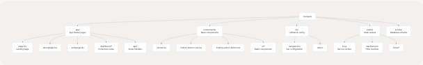
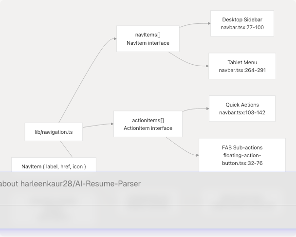
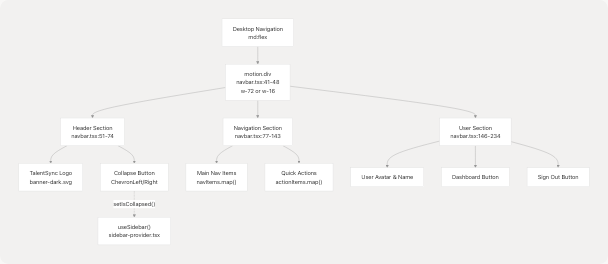
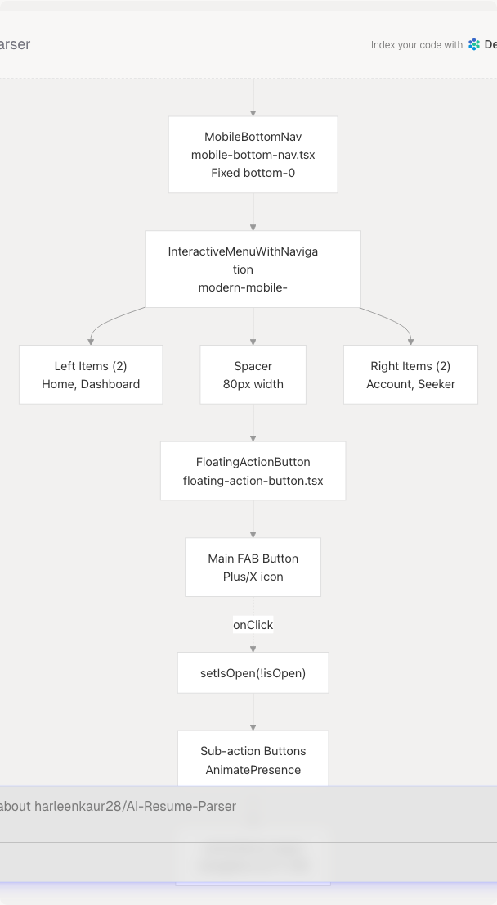
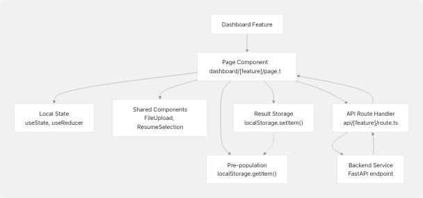
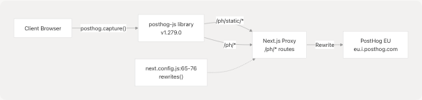

# Frontend Application

## Purpose and Scope

This document provides an overview of the TalentSync frontend application, a Next.js-based Progressive Web Application (PWA) that serves as the user interface for the AI-powered hiring intelligence platform. The frontend provides separate experiences for job seekers and recruiters through a responsive, role-based architecture.

For detailed information about specific subsystems:

* Next.js configuration and PWA setup: see [Next.js Configuration & Dependencies](4.1-next.js-configuration-and-dependencies)
* Authentication flows and NextAuth integration: see [Authentication System](4.2-authentication-system)
* Navigation components and responsive design: see [Navigation System](4.3-navigation-system)
* Public-facing pages: see [Landing & Public Pages](4.4-landing-and-public-pages)
* Protected feature pages: see [Dashboard Pages](4.5-dashboard-pages)
* User profile management: see [Account Management](4.6-account-management)
* Reusable UI components: see [Shared Components](4.7-shared-components)

This page focuses on the overall architecture, technology stack, and how the major subsystems fit together.

---

## Technology Stack

The frontend is built using the following core technologies and libraries:

| Technology | Version | Purpose |
| --- | --- | --- |
| **Next.js** | 15.5.6 | React framework with App Router, server components, and routing |
| **React** | 18.2.0 | UI library for component-based interface |
| **TypeScript** | 5.x | Type-safe development |
| **NextAuth** | 4.24.11 | Authentication with email/password, Google OAuth, GitHub OAuth |
| **Prisma** | 6.9.0 | ORM for PostgreSQL database access |
| **next-pwa** | 5.6.0 | Progressive Web App support with service workers |
| **Tailwind CSS** | 3.3.3 | Utility-first CSS framework |
| **Framer Motion** | 11.0.8 | Animation library for smooth transitions |
| **PostHog** | 1.279.0 | Product analytics and user behavior tracking |
| **Radix UI** | Various | Accessible, unstyled component primitives |
| **Bun** | 1.x | JavaScript runtime and package manager |

**Sources:** [frontend/package.json1-98](https://github.com/harleenkaur28/AI-Resume-Parser/blob/b2bbd83d/frontend/package.json#L1-L98)

---

## Application Structure

### Directory Organization



**Sources:** [frontend/package.json1-98](https://github.com/harleenkaur28/AI-Resume-Parser/blob/b2bbd83d/frontend/package.json#L1-L98) [frontend/app/page.tsx1-60](https://github.com/harleenkaur28/AI-Resume-Parser/blob/b2bbd83d/frontend/app/page.tsx#L1-L60) [frontend/components/navbar.tsx1-398](https://github.com/harleenkaur28/AI-Resume-Parser/blob/b2bbd83d/frontend/components/navbar.tsx#L1-L398) [frontend/lib/navigation.ts1-109](https://github.com/harleenkaur28/AI-Resume-Parser/blob/b2bbd83d/frontend/lib/navigation.ts#L1-L109)

---

### Routing Structure

The application uses Next.js App Router with file-based routing. The routing structure maps directly to the filesystem:

| Route | File Path | Description | Access |
| --- | --- | --- | --- |
| `/` | `app/page.tsx` | Landing page | Public |
| `/about` | `app/about/page.tsx` | About page | Public |
| `/auth` | `app/auth/page.tsx` | Login/Register | Public |
| `/dashboard` | `app/dashboard/page.tsx` | Main dashboard hub | Protected |
| `/dashboard/seeker` | `app/dashboard/seeker/page.tsx` | Job seeker interface | Protected |
| `/dashboard/recruiter` | `app/dashboard/recruiter/page.tsx` | Recruiter interface | Protected (Admin role) |
| `/dashboard/analysis/[id]` | `app/dashboard/analysis/[id]/page.tsx` | Detailed resume analysis | Protected |
| `/dashboard/cold-mail` | `app/dashboard/cold-mail/page.tsx` | Cold email generator | Protected |
| `/dashboard/hiring-assistant` | `app/dashboard/hiring-assistant/page.tsx` | Interview prep | Protected |
| `/dashboard/linkedin-posts` | `app/dashboard/linkedin-posts/page.tsx` | LinkedIn post generator | Protected |
| `/dashboard/ats` | `app/dashboard/ats/page.tsx` | ATS evaluation | Protected |
| `/account` | `app/account/page.tsx` | Account settings | Protected |
| `/api/*` | `app/api/*/route.ts` | API route handlers | Varies |

Protected routes are enforced by [middleware.ts](https://github.com/harleenkaur28/AI-Resume-Parser/blob/b2bbd83d/middleware.ts) which checks session status and role assignment.

**Sources:** [frontend/app/page.tsx1-60](https://github.com/harleenkaur28/AI-Resume-Parser/blob/b2bbd83d/frontend/app/page.tsx#L1-L60) [frontend/lib/navigation.ts1-109](https://github.com/harleenkaur28/AI-Resume-Parser/blob/b2bbd83d/frontend/lib/navigation.ts#L1-L109)

---

## Component Architecture

### Component Hierarchy


**Sources:** [frontend/components/navbar.tsx1-398](https://github.com/harleenkaur28/AI-Resume-Parser/blob/b2bbd83d/frontend/components/navbar.tsx#L1-L398) [frontend/components/mobile-bottom-nav.tsx1-209](https://github.com/harleenkaur28/AI-Resume-Parser/blob/b2bbd83d/frontend/components/mobile-bottom-nav.tsx#L1-L209) [frontend/components/floating-action-button.tsx1-109](https://github.com/harleenkaur28/AI-Resume-Parser/blob/b2bbd83d/frontend/components/floating-action-button.tsx#L1-L109) [frontend/components/sidebar-provider.tsx1-29](https://github.com/harleenkaur28/AI-Resume-Parser/blob/b2bbd83d/frontend/components/sidebar-provider.tsx#L1-L29)

---

### Navigation Configuration

The navigation system is driven by configuration objects defined in `lib/navigation.ts`:



The `NavItem` interface includes `label`, `href`, and `icon` (LucideIcon type). The `ActionItem` extends this with a `description` field for detailed tooltips.

**Sources:** [frontend/lib/navigation.ts1-109](https://github.com/harleenkaur28/AI-Resume-Parser/blob/b2bbd83d/frontend/lib/navigation.ts#L1-L109) [frontend/components/navbar.tsx24](https://github.com/harleenkaur28/AI-Resume-Parser/blob/b2bbd83d/frontend/components/navbar.tsx#L24-L24) [frontend/components/floating-action-button.tsx5](https://github.com/harleenkaur28/AI-Resume-Parser/blob/b2bbd83d/frontend/components/floating-action-button.tsx#L5-L5) [frontend/components/mobile-bottom-nav.tsx6](https://github.com/harleenkaur28/AI-Resume-Parser/blob/b2bbd83d/frontend/components/mobile-bottom-nav.tsx#L6-L6)

---

## Responsive Navigation System

The frontend implements a fully responsive navigation system that adapts to three breakpoints:

### Desktop (≥768px): Collapsible Sidebar



**Sources:** [frontend/components/navbar.tsx41-236](https://github.com/harleenkaur28/AI-Resume-Parser/blob/b2bbd83d/frontend/components/navbar.tsx#L41-L236) [frontend/components/sidebar-provider.tsx1-29](https://github.com/harleenkaur28/AI-Resume-Parser/blob/b2bbd83d/frontend/components/sidebar-provider.tsx#L1-L29)

---

### Tablet (640px-767px): Top Navigation Bar


**Sources:** [frontend/components/navbar.tsx238-391](https://github.com/harleenkaur28/AI-Resume-Parser/blob/b2bbd83d/frontend/components/navbar.tsx#L238-L391)

---

### Mobile (<640px): Bottom Navigation + FAB



The mobile bottom navigation uses the `InteractiveMenuWithNavigation` component which provides smooth animations and active state indicators. The FAB expands to reveal quick action items from the `actionItems` array.

**Sources:** [frontend/components/mobile-bottom-nav.tsx1-209](https://github.com/harleenkaur28/AI-Resume-Parser/blob/b2bbd83d/frontend/components/mobile-bottom-nav.tsx#L1-L209) [frontend/components/floating-action-button.tsx1-109](https://github.com/harleenkaur28/AI-Resume-Parser/blob/b2bbd83d/frontend/components/floating-action-button.tsx#L1-L109) [frontend/components/ui/modern-mobile-menu.tsx1-121](https://github.com/harleenkaur28/AI-Resume-Parser/blob/b2bbd83d/frontend/components/ui/modern-mobile-menu.tsx#L1-L121) [frontend/lib/navigation.ts71-108](https://github.com/harleenkaur28/AI-Resume-Parser/blob/b2bbd83d/frontend/lib/navigation.ts#L71-L108)

---

## State Management

The frontend uses a combination of state management strategies:

### State Management Patterns


### Session Management

The application uses NextAuth's `SessionProvider` to manage authentication state globally:

```
// Pattern used in navbar.tsx:32
const { data: session, status } = useSession();

// Session structure includes:
interface Session {
  user: {
    name?: string;
    email?: string;
    image?: string;
    role?: "User" | "Admin";  // User=Seeker, Admin=Recruiter
  }
}
```

The `status` field indicates whether the session is `"loading"`, `"authenticated"`, or `"unauthenticated"`, enabling conditional UI rendering.

**Sources:** [frontend/components/navbar.tsx32](https://github.com/harleenkaur28/AI-Resume-Parser/blob/b2bbd83d/frontend/components/navbar.tsx#L32-L32) [frontend/components/sidebar-provider.tsx1-29](https://github.com/harleenkaur28/AI-Resume-Parser/blob/b2bbd83d/frontend/components/sidebar-provider.tsx#L1-L29) [frontend/components/mobile-bottom-nav.tsx26](https://github.com/harleenkaur28/AI-Resume-Parser/blob/b2bbd83d/frontend/components/mobile-bottom-nav.tsx#L26-L26)

---

## Progressive Web App (PWA) Configuration

The frontend is configured as a PWA using `next-pwa`:


PWA features are disabled in development mode: `disable: process.env.NODE_ENV === "development"`.

**Sources:** [frontend/next.config.js1-82](https://github.com/harleenkaur28/AI-Resume-Parser/blob/b2bbd83d/frontend/next.config.js#L1-L82)

---

## Build Configuration

### Next.js Configuration Overview

The `next.config.js` includes several important customizations:

| Configuration | Purpose | Reference |
| --- | --- | --- |
| **Image Optimization** | Disabled (`unoptimized: true`) for static export compatibility | [next.config.js14](https://github.com/harleenkaur28/AI-Resume-Parser/blob/b2bbd83d/next.config.js#L14-L14) |
| **External Image Domains** | Allows Google and GitHub avatars | [next.config.js15](https://github.com/harleenkaur28/AI-Resume-Parser/blob/b2bbd83d/next.config.js#L15-L15) |
| **Server External Packages** | Excludes Prisma and bcrypt from bundling | [next.config.js17](https://github.com/harleenkaur28/AI-Resume-Parser/blob/b2bbd83d/next.config.js#L17-L17) |
| **Webpack Aliases** | Provides fallbacks for Node.js modules in browser | [next.config.js18-64](https://github.com/harleenkaur28/AI-Resume-Parser/blob/b2bbd83d/next.config.js#L18-L64) |
| **PostHog Proxy** | Rewrites `/ph/*` to PostHog EU servers | [next.config.js65-76](https://github.com/harleenkaur28/AI-Resume-Parser/blob/b2bbd83d/next.config.js#L65-L76) |
| **Trailing Slash** | Skips redirect for PostHog API compatibility | [next.config.js78](https://github.com/harleenkaur28/AI-Resume-Parser/blob/b2bbd83d/next.config.js#L78-L78) |

### Webpack Customization for PostHog

The configuration includes custom webpack rules to handle PostHog's Node.js dependencies in the browser:

```
// Pattern from next.config.js:25-61
if (!isServer) {
  config.resolve.fallback = {
    child_process: false,
    fs: false,
    net: false,
    tls: false,
    crypto: false,
    path: false,
  };

  // NormalModuleReplacementPlugin to rewrite node: imports
  config.plugins.push(
    new webpack.NormalModuleReplacementPlugin(/^node:(.+)$/, (resource) => {
      resource.request = resource.request.replace(/^node:/, "");
    })
  );
}
```

This prevents PostHog instrumentation from attempting to use Node.js modules in the browser bundle.

**Sources:** [frontend/next.config.js1-82](https://github.com/harleenkaur28/AI-Resume-Parser/blob/b2bbd83d/frontend/next.config.js#L1-L82)

---

## Development Scripts

### Available Commands

The `package.json` defines the following scripts:

| Command | Description | Usage |
| --- | --- | --- |
| `dev` | Start development server | `bun dev` |
| `build` | Production build with Prisma generation | `bun run build` |
| `postinstall` | Auto-generate Prisma client after install | Automatic |
| `start` | Start production server | `bun start` |
| `lint` | Run ESLint | `bun run lint` |
| `seed` | Seed database | `bun run seed` |
| `generate:icons` | Generate PWA icons | `bun run generate:icons` |

The build process includes Prisma client generation (`prisma generate`) before Next.js build, ensuring database types are up-to-date.

**Sources:** [frontend/package.json5-12](https://github.com/harleenkaur28/AI-Resume-Parser/blob/b2bbd83d/frontend/package.json#L5-L12)

---

## Feature Organization Pattern

Features in the dashboard follow a consistent organization pattern:



This pattern enables:

1. **Pre-population**: Features can access resume analysis data from localStorage
2. **Shared Components**: Consistent UX across features (file upload, resume selection)
3. **API Abstraction**: Frontend calls Next.js API routes which proxy to FastAPI backend
4. **Result Caching**: Generated content can be cached for later reference

**Sources:** [frontend/app/page.tsx1-60](https://github.com/harleenkaur28/AI-Resume-Parser/blob/b2bbd83d/frontend/app/page.tsx#L1-L60) [frontend/components/navbar.tsx1-398](https://github.com/harleenkaur28/AI-Resume-Parser/blob/b2bbd83d/frontend/components/navbar.tsx#L1-L398) [frontend/lib/navigation.ts1-109](https://github.com/harleenkaur28/AI-Resume-Parser/blob/b2bbd83d/frontend/lib/navigation.ts#L1-L109)

---

## Analytics Integration

### PostHog Configuration

The frontend integrates PostHog for product analytics:



PostHog requests are proxied through the Next.js server to avoid ad blockers and CORS issues. Static assets are served from `/ph/static/*` and API requests from `/ph/*`.

**Sources:** [frontend/next.config.js65-76](https://github.com/harleenkaur28/AI-Resume-Parser/blob/b2bbd83d/frontend/next.config.js#L65-L76) [frontend/package.json61](https://github.com/harleenkaur28/AI-Resume-Parser/blob/b2bbd83d/frontend/package.json#L61-L61)

---

## Summary

The TalentSync frontend is a sophisticated Next.js application that provides:

1. **Progressive Web App** capabilities with offline support and installability
2. **Responsive Navigation** adapting to desktop (sidebar), tablet (top nav), and mobile (bottom nav + FAB)
3. **Role-Based Access** with separate interfaces for job seekers and recruiters
4. **Type-Safe Development** using TypeScript and Prisma-generated types
5. **Modern Authentication** via NextAuth with multiple providers
6. **Cross-Feature Integration** through localStorage-based data sharing
7. **Production Analytics** with PostHog tracking
8. **Optimized Build Process** using Bun runtime and multi-stage PWA generation

The architecture emphasizes modularity, reusability, and responsive design while maintaining a clear separation between public pages, authenticated dashboards, and admin-only features.

For implementation details of specific subsystems, refer to the child pages linked at the beginning of this document.
