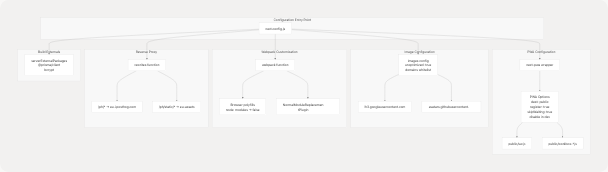
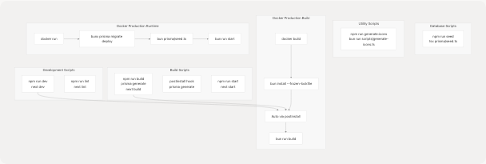
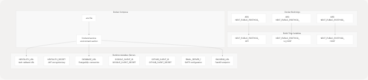
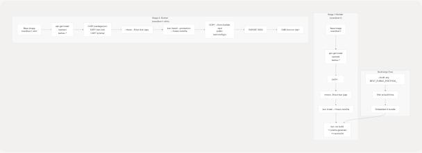

# Next.js Configuration & Dependencies

## Purpose and Scope

This document covers the Next.js configuration and dependency management for the TalentSync frontend application. It details the setup in `next.config.js`, all production and development dependencies, PWA (Progressive Web App) configuration, analytics integration, Webpack customizations, and build processes.

For information about the overall frontend architecture and page routing structure, see [Frontend Architecture](4.2-authentication-system). For deployment and Docker build configuration, see [Docker Images & Build Process](6.2-docker-images-and-build-process). For analytics behavior tracking, see [Monitoring & Analytics](6.6-monitoring-and-analytics).

---

## Next.js Configuration Architecture

The Next.js application is configured through `next.config.js` which applies several critical customizations including PWA capabilities, image optimization, PostHog analytics proxying, and Webpack modifications for browser compatibility.

### Configuration Flow Diagram



**Sources:** [frontend/next.config.js1-81](https://github.com/harleenkaur28/AI-Resume-Parser/blob/b2bbd83d/frontend/next.config.js#L1-L81)

### Key Configuration Objects

The configuration is built using the `withPWA` higher-order function that wraps the base Next.js configuration:

| Configuration Section | Purpose | Key Settings |
| --- | --- | --- |
| **PWA** | Enable Progressive Web App features | `dest: "public"`, `register: true`, `skipWaiting: true`, disabled in development |
| **ESLint** | Build-time linting behavior | `ignoreDuringBuilds: true` |
| **Images** | Image optimization and external domains | `unoptimized: true`, OAuth provider domains whitelisted |
| **Server Externals** | Prevent bundling of server-only packages | `@prisma/client`, `bcrypt` |
| **Webpack** | Browser compatibility patches | Node.js polyfill removal, `node:` scheme handling |
| **Rewrites** | Reverse proxy for analytics | PostHog API proxying to avoid ad blockers |
| **Trailing Slash** | URL handling | `skipTrailingSlashRedirect: true` for PostHog compatibility |

**Sources:** [frontend/next.config.js1-81](https://github.com/harleenkaur28/AI-Resume-Parser/blob/b2bbd83d/frontend/next.config.js#L1-L81)

---

## Core Dependencies

The application uses Bun as the package manager and runtime. Dependencies are defined in `package.json` and locked in `bun.lock`.

### Dependency Categories Diagram


**Sources:** [frontend/package.json1-98](https://github.com/harleenkaur28/AI-Resume-Parser/blob/b2bbd83d/frontend/package.json#L1-L98)

### Production Dependencies Table

| Category | Package | Version | Purpose |
| --- | --- | --- | --- |
| **Framework** | `next` | ^15.5.6 | React framework with SSR/SSG |
|  | `react` | 18.2.0 | UI library |
|  | `react-dom` | 18.2.0 | React DOM renderer |
| **Auth** | `next-auth` | ^4.24.11 | Authentication system with OAuth |
|  | `@next-auth/prisma-adapter` | ^1.0.7 | Database adapter for NextAuth |
|  | `bcrypt` | ^6.0.0 | Password hashing |
| **Database** | `@prisma/client` | ^6.9.0 | ORM client |
|  | `prisma` | ^6.9.0 | Schema management CLI |
| **UI Components** | `@radix-ui/*` | ^1.x | 30+ accessible primitives (dialog, dropdown, etc.) |
|  | `lucide-react` | ^0.515.0 | Icon library |
|  | `framer-motion` | ^11.0.8 | Animation library |
|  | `tailwindcss` | 3.3.3 | Utility-first CSS framework |
| **Forms** | `react-hook-form` | ^7.53.0 | Form state management |
|  | `@hookform/resolvers` | ^3.9.0 | Validation resolvers |
|  | `zod` | ^3.23.8 | Schema validation |
| **PWA** | `next-pwa` | ^5.6.0 | Progressive Web App plugin |
| **Analytics** | `posthog-js` | ^1.279.0 | Product analytics client |
| **Email** | `nodemailer` | ^7.0.3 | Email sending library |
| **Utilities** | `date-fns` | ^3.6.0 | Date manipulation |
|  | `sharp` | ^0.34.2 | Image optimization |
|  | `sonner` | ^1.5.0 | Toast notifications |

**Sources:** [frontend/package.json17-88](https://github.com/harleenkaur28/AI-Resume-Parser/blob/b2bbd83d/frontend/package.json#L17-L88)

### Development Dependencies

| Package | Version | Purpose |
| --- | --- | --- |
| `@types/bcrypt` | ^5.0.2 | TypeScript types for bcrypt |
| `@types/bun` | latest | TypeScript types for Bun runtime |
| `tsx` | ^4.20.2 | TypeScript execution for scripts |

**Sources:** [frontend/package.json90-93](https://github.com/harleenkaur28/AI-Resume-Parser/blob/b2bbd83d/frontend/package.json#L90-L93)

---

## Progressive Web App (PWA) Configuration

The application is configured as a PWA using the `next-pwa` package, enabling offline capabilities, app installation, and caching strategies through Workbox.

### PWA Architecture


**Sources:** [frontend/next.config.js1-6](https://github.com/harleenkaur28/AI-Resume-Parser/blob/b2bbd83d/frontend/next.config.js#L1-L6) [frontend/public/sw.js1-2](https://github.com/harleenkaur28/AI-Resume-Parser/blob/b2bbd83d/frontend/public/sw.js#L1-L2) [frontend/public/workbox-1bb06f5e.js1-2](https://github.com/harleenkaur28/AI-Resume-Parser/blob/b2bbd83d/frontend/public/workbox-1bb06f5e.js#L1-L2)

### PWA Configuration Details

The `withPWA` wrapper in `next.config.js` configures:

```
const withPWA = require("next-pwa")({
  dest: "public",           // Service worker output directory
  register: true,           // Auto-register service worker
  skipWaiting: true,        // Activate new SW immediately
  disable: process.env.NODE_ENV === "development" // Disabled in dev
});
```

**Key PWA Features:**

1. **Automatic Service Worker Generation**: Next.js build automatically generates `public/sw.js` with Workbox runtime
2. **Precaching**: All static assets in `_next/static/*`, manifest, and icons are precached during installation
3. **Skip Waiting**: New service worker activates immediately without waiting for old tabs to close
4. **Development Bypass**: PWA features disabled in development mode to avoid caching issues

**Sources:** [frontend/next.config.js1-6](https://github.com/harleenkaur28/AI-Resume-Parser/blob/b2bbd83d/frontend/next.config.js#L1-L6)

### Workbox Caching Strategies

The generated service worker implements multiple caching strategies for different asset types:

| Asset Type | Strategy | Cache Name | Max Entries | Max Age |
| --- | --- | --- | --- | --- |
| **Start URL** (`/`) | NetworkFirst | `start-url` | N/A | N/A |
| **Google Fonts Webfonts** | CacheFirst | `google-fonts-webfonts` | 4 | 365 days |
| **Google Fonts Stylesheets** | StaleWhileRevalidate | `google-fonts-stylesheets` | 4 | 7 days |
| **Static Fonts** | StaleWhileRevalidate | `static-font-assets` | 4 | 7 days |
| **Images** (jpg, png, svg, etc.) | StaleWhileRevalidate | `static-image-assets` | 64 | 1 day |
| **Next.js Images** | StaleWhileRevalidate | `next-image` | 64 | 1 day |
| **Audio** (mp3, wav, ogg) | CacheFirst | `static-audio-assets` | 32 | 1 day |
| **Video** (mp4) | CacheFirst | `static-video-assets` | 32 | 1 day |
| **JavaScript** | StaleWhileRevalidate | `static-js-assets` | 32 | 1 day |
| **CSS** | StaleWhileRevalidate | `static-style-assets` | 32 | 1 day |
| **Next.js Data** | StaleWhileRevalidate | `next-data` | 32 | 1 day |
| **API Routes** (non-auth) | NetworkFirst | `apis` | 16 | 1 day |
| **Cross-Origin** | NetworkFirst | `cross-origin` | 32 | 1 hour |

**Sources:** [frontend/public/sw.js1-2](https://github.com/harleenkaur28/AI-Resume-Parser/blob/b2bbd83d/frontend/public/sw.js#L1-L2) [frontend/public/workbox-1bb06f5e.js1-2](https://github.com/harleenkaur28/AI-Resume-Parser/blob/b2bbd83d/frontend/public/workbox-1bb06f5e.js#L1-L2)

---

## PostHog Analytics Integration

PostHog is integrated for product analytics and user behavior tracking. The configuration includes client-side initialization and a reverse proxy to bypass ad blockers.

### PostHog Integration Architecture


**Sources:** [frontend/instrumentation-client.ts1-12](https://github.com/harleenkaur28/AI-Resume-Parser/blob/b2bbd83d/frontend/instrumentation-client.ts#L1-L12) [frontend/next.config.js65-79](https://github.com/harleenkaur28/AI-Resume-Parser/blob/b2bbd83d/frontend/next.config.js#L65-L79)

### Client-Side Initialization

PostHog is initialized in `instrumentation-client.ts` which runs on the client:

```
posthog.init(key as string, {
  api_host: apiHost,    // "/ph" (proxied)
  ui_host: uiHost,      // "https://eu.posthog.com"
})
```

The initialization:

* Uses `NEXT_PUBLIC_POSTHOG_KEY` which is embedded at build time
* Routes API calls through `/ph` to avoid ad blockers
* Points UI features to the EU PostHog instance

**Sources:** [frontend/instrumentation-client.ts3-11](https://github.com/harleenkaur28/AI-Resume-Parser/blob/b2bbd83d/frontend/instrumentation-client.ts#L3-L11)

### Reverse Proxy Configuration

The `rewrites` function in `next.config.js` creates a reverse proxy:

```
async rewrites() {
  return [
    {
      source: "/ph/static/:path*",
      destination: "https://eu-assets.i.posthog.com/static/:path*"
    },
    {
      source: "/ph/:path*",
      destination: "https://eu.i.posthog.com/:path*"
    }
  ];
}
```

This configuration:

* Proxies all `/ph/*` requests to PostHog's EU data ingestion endpoint
* Proxies static assets from `/ph/static/*` to PostHog's CDN
* Prevents ad blockers from blocking PostHog since requests appear same-origin
* Requires `skipTrailingSlashRedirect: true` for compatibility

**Sources:** [frontend/next.config.js65-79](https://github.com/harleenkaur28/AI-Resume-Parser/blob/b2bbd83d/frontend/next.config.js#L65-L79)

---

## Webpack Customizations

The Next.js configuration includes custom Webpack modifications to handle Node.js module compatibility issues in browser bundles, particularly for PostHog instrumentation.

### Webpack Configuration Flow


**Sources:** [frontend/next.config.js18-64](https://github.com/harleenkaur28/AI-Resume-Parser/blob/b2bbd83d/frontend/next.config.js#L18-L64)

### Webpack Configuration Code

The configuration uses a three-layer approach for browser compatibility:

**Layer 1 - Fallback Configuration:**

```
config.resolve.fallback = {
  ...(config.resolve.fallback || {}),
  child_process: false,
  fs: false,
  net: false,
  tls: false,
  crypto: false,
  path: false,
};
```

**Layer 2 - Alias Configuration:**

```
config.resolve.alias = {
  ...(config.resolve.alias || {}),
  "node:child_process": false,
  "node:fs": false,
  "node:net": false,
  "node:tls": false,
  "node:crypto": false,
  "node:path": false,
};
```

**Layer 3 - Module Replacement Plugin:**

```
new webpack.NormalModuleReplacementPlugin(/^node:(.+)$/, (resource) => {
  if (resource.request && typeof resource.request === "string") {
    resource.request = resource.request.replace(/^node:/, "");
  }
})
```

This configuration only applies when `!isServer` to ensure server-side code can still use Node.js modules.

**Sources:** [frontend/next.config.js25-61](https://github.com/harleenkaur28/AI-Resume-Parser/blob/b2bbd83d/frontend/next.config.js#L25-L61)

---

## Build and Development Scripts

The application defines several NPM scripts for development, building, and database management.

### Script Execution Flow



**Sources:** [frontend/package.json5-15](https://github.com/harleenkaur28/AI-Resume-Parser/blob/b2bbd83d/frontend/package.json#L5-L15) [frontend/Dockerfile42-48](https://github.com/harleenkaur28/AI-Resume-Parser/blob/b2bbd83d/frontend/Dockerfile#L42-L48) [docker-compose.prod.yaml49](https://github.com/harleenkaur28/AI-Resume-Parser/blob/b2bbd83d/docker-compose.prod.yaml#L49-L49)

### Script Definitions

| Script | Command | Purpose |
| --- | --- | --- |
| `dev` | `next dev` | Start development server on port 3000 |
| `build` | `prisma generate && next build` | Generate Prisma client and build production bundle |
| `postinstall` | `prisma generate` | Auto-run after dependency installation |
| `start` | `next start` | Start production server |
| `lint` | `next lint` | Run ESLint checks |
| `seed` | `tsx prisma/seed.ts` | Seed database with initial data |
| `generate:icons` | `bun run scripts/generate-icons.ts` | Generate icon assets |

**Sources:** [frontend/package.json5-12](https://github.com/harleenkaur28/AI-Resume-Parser/blob/b2bbd83d/frontend/package.json#L5-L12)

### Prisma Seed Configuration

The `package.json` includes a `prisma` section that configures the seed script:

```
"prisma": {
  "seed": "tsx prisma/seed.ts"
}
```

This allows running `prisma db seed` to execute the TypeScript seed file.

**Sources:** [frontend/package.json14-16](https://github.com/harleenkaur28/AI-Resume-Parser/blob/b2bbd83d/frontend/package.json#L14-L16)

---

## Environment Variables

The application requires both build-time and runtime environment variables.

### Environment Variable Categories



**Sources:** [frontend/Dockerfile10-18](https://github.com/harleenkaur28/AI-Resume-Parser/blob/b2bbd83d/frontend/Dockerfile#L10-L18) [docker-compose.prod.yaml42-48](https://github.com/harleenkaur28/AI-Resume-Parser/blob/b2bbd83d/docker-compose.prod.yaml#L42-L48)

### Build-Time Variables (NEXT\_PUBLIC\_\*)

These variables are embedded into the client-side JavaScript bundle during `next build`:

| Variable | Default | Purpose |
| --- | --- | --- |
| `NEXT_PUBLIC_POSTHOG_KEY` | (required) | PostHog project API key |
| `NEXT_PUBLIC_POSTHOG_UI_HOST` | `https://eu.posthog.com` | PostHog UI host |
| `NEXT_PUBLIC_POSTHOG_HOST` | `/ph` | PostHog API host (proxied) |

These must be provided as Docker build arguments:

```
ARG NEXT_PUBLIC_POSTHOG_KEY
ARG NEXT_PUBLIC_POSTHOG_UI_HOST
ARG NEXT_PUBLIC_POSTHOG_HOST

ENV NEXT_PUBLIC_POSTHOG_KEY=$NEXT_PUBLIC_POSTHOG_KEY
ENV NEXT_PUBLIC_POSTHOG_UI_HOST=$NEXT_PUBLIC_POSTHOG_UI_HOST
ENV NEXT_PUBLIC_POSTHOG_HOST=$NEXT_PUBLIC_POSTHOG_HOST
```

**Sources:** [frontend/Dockerfile10-18](https://github.com/harleenkaur28/AI-Resume-Parser/blob/b2bbd83d/frontend/Dockerfile#L10-L18) [docker-compose.prod.yaml37-40](https://github.com/harleenkaur28/AI-Resume-Parser/blob/b2bbd83d/docker-compose.prod.yaml#L37-L40)

### Runtime Variables (Server-Only)

These variables are required at runtime but not embedded in the client bundle:

| Variable | Purpose | Example |
| --- | --- | --- |
| `NODE_ENV` | Environment mode | `production` |
| `NEXTAUTH_URL` | NextAuth callback URL | `https://talentsync.tashif.codes` |
| `NEXTAUTH_SECRET` | JWT signing secret | (random string) |
| `DATABASE_URL` | PostgreSQL connection | `postgresql://user:pass@db:5432/dbname` |
| `BACKEND_URL` | FastAPI service URL | `http://backend:8000` |
| `GOOGLE_CLIENT_ID` | Google OAuth client ID | (from Google Console) |
| `GOOGLE_CLIENT_SECRET` | Google OAuth secret | (from Google Console) |
| `GITHUB_CLIENT_ID` | GitHub OAuth client ID | (from GitHub) |
| `GITHUB_CLIENT_SECRET` | GitHub OAuth secret | (from GitHub) |
| `EMAIL_SERVER_HOST` | SMTP host | `smtp.gmail.com` |
| `EMAIL_SERVER_PORT` | SMTP port | `587` |
| `EMAIL_SERVER_USER` | SMTP username | Email address |
| `EMAIL_SERVER_PASSWORD` | SMTP password | App password |
| `EMAIL_FROM` | Sender email | `noreply@domain.com` |

**Sources:** [frontend/Dockerfile100-125](https://github.com/harleenkaur28/AI-Resume-Parser/blob/b2bbd83d/frontend/Dockerfile#L100-L125) [docker-compose.prod.yaml44-48](https://github.com/harleenkaur28/AI-Resume-Parser/blob/b2bbd83d/docker-compose.prod.yaml#L44-L48)

---

## Production Build Process

The production build uses a multi-stage Docker build to create an optimized image.

### Docker Build Stages



**Sources:** [frontend/Dockerfile1-99](https://github.com/harleenkaur28/AI-Resume-Parser/blob/b2bbd83d/frontend/Dockerfile#L1-L99)

### Build Stage (Builder)

The builder stage [frontend/Dockerfile2-48](https://github.com/harleenkaur28/AI-Resume-Parser/blob/b2bbd83d/frontend/Dockerfile#L2-L48) performs the following steps:

1. **Base Image**: Uses `oven/bun:1` with full Node.js environment
2. **System Dependencies**: Installs OpenSSL and TeXLive packages for LaTeX compilation
3. **File Copy**: Copies all application source files
4. **Permissions**: Changes ownership to `bun:bun` user for security
5. **Dependencies**: Runs `bun install --frozen-lockfile` to install all dependencies
6. **Build**: Executes `bun run build` which:
   * Runs `prisma generate` to generate Prisma client
   * Runs `next build` to create production bundle
   * Generates service worker via `next-pwa`

**Sources:** [frontend/Dockerfile2-48](https://github.com/harleenkaur28/AI-Resume-Parser/blob/b2bbd83d/frontend/Dockerfile#L2-L48)

### Runtime Stage (Runner)

The runner stage [frontend/Dockerfile50-98](https://github.com/harleenkaur28/AI-Resume-Parser/blob/b2bbd83d/frontend/Dockerfile#L50-L98) creates the final production image:

1. **Base Image**: Uses `oven/bun:1-slim` for smaller image size
2. **System Dependencies**: Installs minimal runtime dependencies (OpenSSL, TeXLive)
3. **Copy Metadata**: Copies `package.json`, `bun.lock`, and Prisma schema
4. **Production Dependencies**: Installs only production dependencies with `--production` flag
5. **Copy Built Assets**: Copies compiled `.next` directory, `public` folder, and config from builder
6. **Expose Port**: Exposes port 3000
7. **Start Command**: Runs `bun run start` which executes `next start`

**Sources:** [frontend/Dockerfile50-98](https://github.com/harleenkaur28/AI-Resume-Parser/blob/b2bbd83d/frontend/Dockerfile#L50-L98)

### Docker Compose Production Setup

The production deployment [docker-compose.prod.yaml33-55](https://github.com/harleenkaur28/AI-Resume-Parser/blob/b2bbd83d/docker-compose.prod.yaml#L33-L55) orchestrates the frontend container:

```
frontend:
  build:
    context: ./frontend
    dockerfile: Dockerfile
    args:
      NEXT_PUBLIC_POSTHOG_KEY: ${NEXT_PUBLIC_POSTHOG_KEY}
      NEXT_PUBLIC_POSTHOG_UI_HOST: ${NEXT_PUBLIC_POSTHOG_UI_HOST:-https://eu.posthog.com}
      NEXT_PUBLIC_POSTHOG_HOST: ${NEXT_PUBLIC_POSTHOG_HOST:-https://eu.i.posthog.com}
  environment:
    NODE_ENV: production
    NEXTAUTH_URL: https://talentsync.tashif.codes
    DATABASE_URL: "postgresql://${POSTGRES_USER}:${POSTGRES_PASSWORD}@db:5432/${POSTGRES_DB}?schema=public"
    BACKEND_URL: http://backend:8000
  command: sh -c "bunx prisma migrate deploy && bun prisma/seed.ts && bun run start"
```

The startup command sequence:

1. `bunx prisma migrate deploy` - Apply database migrations
2. `bun prisma/seed.ts` - Seed database with initial data
3. `bun run start` - Start Next.js production server

**Sources:** [docker-compose.prod.yaml33-55](https://github.com/harleenkaur28/AI-Resume-Parser/blob/b2bbd83d/docker-compose.prod.yaml#L33-L55)

---

## CI/CD Integration

The GitHub Actions deployment workflow [.github/workflows/deploy.yaml1-42](https://github.com/harleenkaur28/AI-Resume-Parser/blob/b2bbd83d/.github/workflows/deploy.yaml#L1-L42) automates the build and deployment process:

```
- name: Deploy to VPS
  script: |
    cd ${{ env.VPS_PROJECT_PATH }}
    git pull origin main
    docker compose -f docker-compose.prod.yaml build
    docker compose -f docker-compose.prod.yaml up -d --force-recreate
```

This workflow:

1. Triggers on push to `main` branch
2. SSHs into the production VPS
3. Pulls latest code from Git
4. Rebuilds Docker images (including frontend)
5. Recreates containers with new images
6. Runs database migrations and seeding automatically via `command` directive

**Sources:** [.github/workflows/deploy.yaml22-41](https://github.com/harleenkaur28/AI-Resume-Parser/blob/b2bbd83d/.github/workflows/deploy.yaml#L22-L41)

---

## Summary

The Next.js frontend configuration provides:

1. **PWA Capabilities**: Offline support, app installation, and advanced caching via next-pwa and Workbox
2. **Analytics Integration**: PostHog product analytics with reverse proxy to bypass ad blockers
3. **Browser Compatibility**: Webpack customizations to handle Node.js module imports in browser bundles
4. **Build Optimization**: Multi-stage Docker builds with Bun runtime for fast builds and small images
5. **Database Integration**: Prisma ORM with automatic client generation and migration support
6. **Authentication**: NextAuth with OAuth providers and email verification
7. **UI Framework**: Comprehensive Radix UI component library with Tailwind CSS styling

The configuration balances developer experience (fast builds with Bun, hot reload in dev) with production optimization (minimal runtime image, static asset caching, environment security).

**Sources:** [frontend/next.config.js1-81](https://github.com/harleenkaur28/AI-Resume-Parser/blob/b2bbd83d/frontend/next.config.js#L1-L81) [frontend/package.json1-98](https://github.com/harleenkaur28/AI-Resume-Parser/blob/b2bbd83d/frontend/package.json#L1-L98) [frontend/Dockerfile1-125](https://github.com/harleenkaur28/AI-Resume-Parser/blob/b2bbd83d/frontend/Dockerfile#L1-L125) [docker-compose.prod.yaml33-55](https://github.com/harleenkaur28/AI-Resume-Parser/blob/b2bbd83d/docker-compose.prod.yaml#L33-L55)
