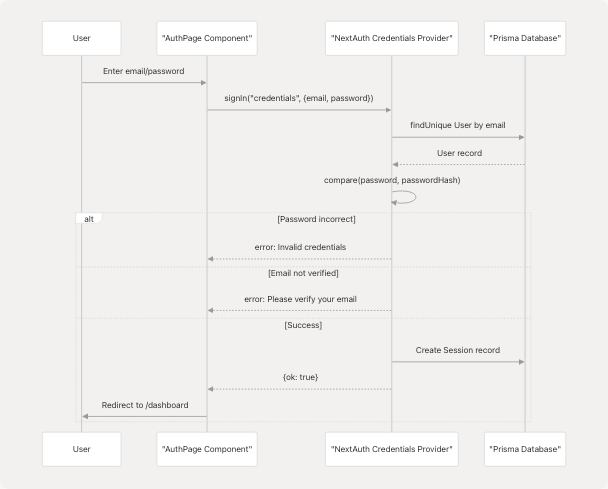
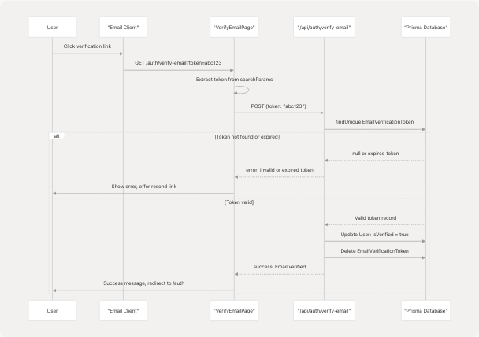
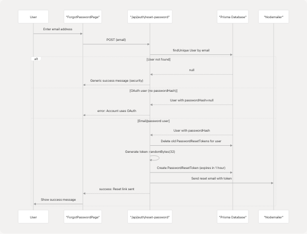
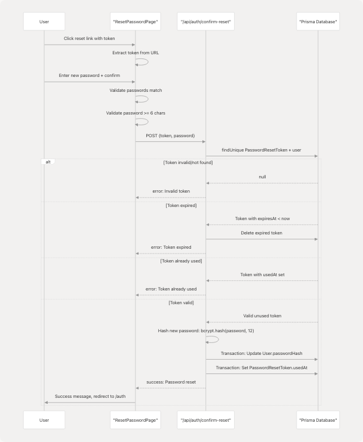

# Authentication System

Relevant source files

* [frontend/app/api/auth/[...nextauth]/route.ts](frontend/app/api/auth/%5B...nextauth%5D/route.ts)
* [frontend/app/api/auth/confirm-reset/route.ts](https://github.com/harleenkaur28/AI-Resume-Parser/blob/b2bbd83d/frontend/app/api/auth/confirm-reset/route.ts)
* [frontend/app/api/auth/register/route.ts](https://github.com/harleenkaur28/AI-Resume-Parser/blob/b2bbd83d/frontend/app/api/auth/register/route.ts)
* [frontend/app/api/auth/reset-password/route.ts](https://github.com/harleenkaur28/AI-Resume-Parser/blob/b2bbd83d/frontend/app/api/auth/reset-password/route.ts)
* [frontend/app/api/auth/update-role/route.ts](https://github.com/harleenkaur28/AI-Resume-Parser/blob/b2bbd83d/frontend/app/api/auth/update-role/route.ts)
* [frontend/app/auth/forgot-password/page.tsx](https://github.com/harleenkaur28/AI-Resume-Parser/blob/b2bbd83d/frontend/app/auth/forgot-password/page.tsx)
* [frontend/app/auth/page.tsx](https://github.com/harleenkaur28/AI-Resume-Parser/blob/b2bbd83d/frontend/app/auth/page.tsx)
* [frontend/app/auth/resend-verification/page.tsx](https://github.com/harleenkaur28/AI-Resume-Parser/blob/b2bbd83d/frontend/app/auth/resend-verification/page.tsx)
* [frontend/app/auth/reset-password/page.tsx](https://github.com/harleenkaur28/AI-Resume-Parser/blob/b2bbd83d/frontend/app/auth/reset-password/page.tsx)
* [frontend/app/auth/verify-email/page.tsx](https://github.com/harleenkaur28/AI-Resume-Parser/blob/b2bbd83d/frontend/app/auth/verify-email/page.tsx)
* [frontend/app/select-role/page.tsx](https://github.com/harleenkaur28/AI-Resume-Parser/blob/b2bbd83d/frontend/app/select-role/page.tsx)
* [frontend/middleware.ts](https://github.com/harleenkaur28/AI-Resume-Parser/blob/b2bbd83d/frontend/middleware.ts)

## Purpose and Scope

This document covers the comprehensive authentication system implemented in TalentSync using NextAuth. The system provides multiple authentication methods (email/password, Google OAuth, GitHub OAuth), email verification, password reset functionality, role-based access control, and middleware-enforced route protection.

For database schema details related to user authentication, see [Database & Data Models](/harleenkaur28/AI-Resume-Parser/5-database-and-data-models). For role selection UI and middleware implementation specifically, see subsections [Role Selection & Management](/harleenkaur28/AI-Resume-Parser/4.2.4-role-selection-and-management) and [Middleware & Route Protection](/harleenkaur28/AI-Resume-Parser/4.2.5-middleware-and-route-protection).

---

## System Architecture

The authentication system is built on NextAuth with custom extensions for email verification, role management, and OAuth integration. It consists of frontend UI components, API routes, middleware for route protection, and database-backed token management.

### Authentication Component Architecture


```

**Sources:** [frontend/app/auth/page.tsx1-928](https://github.com/harleenkaur28/AI-Resume-Parser/blob/b2bbd83d/frontend/app/auth/page.tsx#L1-L928) [frontend/middleware.ts1-75](https://github.com/harleenkaur28/AI-Resume-Parser/blob/b2bbd83d/frontend/middleware.ts#L1-L75) [frontend/app/api/auth/register/route.ts1-176](https://github.com/harleenkaur28/AI-Resume-Parser/blob/b2bbd83d/frontend/app/api/auth/register/route.ts#L1-L176)

---

## Authentication Providers

The system supports three authentication providers configured in NextAuth.

### Provider Configuration

| Provider | Implementation | User Data Handling |
| --- | --- | --- |
| **Credentials** | Email/password with bcrypt hashing | Creates user with `passwordHash` field |
| **Google OAuth** | NextAuth GoogleProvider | Auto-creates user without `passwordHash` |
| **GitHub OAuth** | NextAuth GithubProvider | Auto-creates user without `passwordHash` |

### Credentials Provider Flow

```

```

**Sources:** [frontend/app/auth/page.tsx151-186](https://github.com/harleenkaur28/AI-Resume-Parser/blob/b2bbd83d/frontend/app/auth/page.tsx#L151-L186) [frontend/lib/auth-options.ts](https://github.com/harleenkaur28/AI-Resume-Parser/blob/b2bbd83d/frontend/lib/auth-options.ts) (referenced but not provided)

### OAuth Provider Flow

OAuth providers (Google, GitHub) bypass password verification and email verification requirements. The `isVerified` field is automatically set to `true` for OAuth users.

**Implementation:**

* Google OAuth button: [frontend/app/auth/page.tsx424-453](https://github.com/harleenkaur28/AI-Resume-Parser/blob/b2bbd83d/frontend/app/auth/page.tsx#L424-L453)
* GitHub OAuth button: [frontend/app/auth/page.tsx455-467](https://github.com/harleenkaur28/AI-Resume-Parser/blob/b2bbd83d/frontend/app/auth/page.tsx#L455-L467)
* OAuth handler: Calls `signIn(provider, {callbackUrl: "/dashboard"})` at [frontend/app/auth/page.tsx145-149](https://github.com/harleenkaur28/AI-Resume-Parser/blob/b2bbd83d/frontend/app/auth/page.tsx#L145-L149)

**Sources:** [frontend/app/auth/page.tsx145-149](https://github.com/harleenkaur28/AI-Resume-Parser/blob/b2bbd83d/frontend/app/auth/page.tsx#L145-L149) [frontend/app/auth/page.tsx424-467](https://github.com/harleenkaur28/AI-Resume-Parser/blob/b2bbd83d/frontend/app/auth/page.tsx#L424-L467)

---

## Registration & Email Verification

### Registration Flow

The registration process creates a user account with an unverified status and sends a verification email containing a unique token.

#### Registration State Machine

```

```

**Sources:** [frontend/app/auth/page.tsx188-274](https://github.com/harleenkaur28/AI-Resume-Parser/blob/b2bbd83d/frontend/app/auth/page.tsx#L188-L274) [frontend/app/api/auth/register/route.ts68-176](https://github.com/harleenkaur28/AI-Resume-Parser/blob/b2bbd83d/frontend/app/api/auth/register/route.ts#L68-L176)

### Email Verification Token System

The system uses cryptographically secure tokens stored in the `EmailVerificationToken` table.

**Token Generation:** [frontend/app/api/auth/register/route.ts103-104](https://github.com/harleenkaur28/AI-Resume-Parser/blob/b2bbd83d/frontend/app/api/auth/register/route.ts#L103-L104)

```
```
const verificationToken = randomBytes(32).toString("hex");
const tokenExpiresAt = new Date(Date.now() + 24 * 60 * 60 * 1000); // 24 hours
```
```

**Token Storage:** [frontend/app/api/auth/register/route.ts132-138](https://github.com/harleenkaur28/AI-Resume-Parser/blob/b2bbd83d/frontend/app/api/auth/register/route.ts#L132-L138)

* Creates `EmailVerificationToken` record linked to `userId`
* Token expires after 24 hours

**Email Template:** [frontend/app/api/auth/register/route.ts35-66](https://github.com/harleenkaur28/AI-Resume-Parser/blob/b2bbd83d/frontend/app/api/auth/register/route.ts#L35-L66)

* Sends HTML email via Nodemailer
* Contains verification URL: `${NEXTAUTH_URL}/auth/verify-email?token=${token}`
* Styled with inline CSS for email client compatibility

### Email Verification Process

```

```

**Sources:** [frontend/app/auth/verify-email/page.tsx18-222](https://github.com/harleenkaur28/AI-Resume-Parser/blob/b2bbd83d/frontend/app/auth/verify-email/page.tsx#L18-L222) [frontend/app/api/auth/verify-email/route.ts](https://github.com/harleenkaur28/AI-Resume-Parser/blob/b2bbd83d/frontend/app/api/auth/verify-email/route.ts) (referenced but not provided)

### Resend Verification Email

Users can request a new verification email if the original expires or is lost.

**UI Implementation:** [frontend/app/auth/resend-verification/page.tsx20-293](https://github.com/harleenkaur28/AI-Resume-Parser/blob/b2bbd83d/frontend/app/auth/resend-verification/page.tsx#L20-L293)

* Pre-fills email from URL parameter: `?email=user@example.com`
* Auto-triggers resend if email parameter present: [frontend/app/auth/resend-verification/page.tsx35-42](https://github.com/harleenkaur28/AI-Resume-Parser/blob/b2bbd83d/frontend/app/auth/resend-verification/page.tsx#L35-L42)

**API Endpoint:** [frontend/app/api/auth/resend-verification/route.ts](https://github.com/harleenkaur28/AI-Resume-Parser/blob/b2bbd83d/frontend/app/api/auth/resend-verification/route.ts) (referenced but not provided)

* Deletes old verification tokens for the user
* Generates new token with fresh 24-hour expiry
* Sends new verification email

**Sources:** [frontend/app/auth/resend-verification/page.tsx1-293](https://github.com/harleenkaur28/AI-Resume-Parser/blob/b2bbd83d/frontend/app/auth/resend-verification/page.tsx#L1-L293) [frontend/app/auth/page.tsx128-143](https://github.com/harleenkaur28/AI-Resume-Parser/blob/b2bbd83d/frontend/app/auth/page.tsx#L128-L143)

---

## Login Flow

### Credentials Login Process

The credentials login validates email/password and enforces email verification before granting access.

**Login Handler:** [frontend/app/auth/page.tsx151-186](https://github.com/harleenkaur28/AI-Resume-Parser/blob/b2bbd83d/frontend/app/auth/page.tsx#L151-L186)

```

```

**Email Verification Error Handling:** [frontend/app/auth/page.tsx163-177](https://github.com/harleenkaur28/AI-Resume-Parser/blob/b2bbd83d/frontend/app/auth/page.tsx#L163-L177)

* Displays inline error message
* Provides clickable link to resend verification email
* Pre-fills email in resend form

**Sources:** [frontend/app/auth/page.tsx151-186](https://github.com/harleenkaur28/AI-Resume-Parser/blob/b2bbd83d/frontend/app/auth/page.tsx#L151-L186)

### OAuth Login Process

OAuth logins bypass email verification and password checks entirely.

**Flow:**

1. User clicks "Continue with Google/GitHub"
2. Calls `signIn(provider, {callbackUrl: "/dashboard"})` at [frontend/app/auth/page.tsx145-149](https://github.com/harleenkaur28/AI-Resume-Parser/blob/b2bbd83d/frontend/app/auth/page.tsx#L145-L149)
3. NextAuth redirects to OAuth provider
4. Provider authenticates user and returns profile
5. NextAuth creates or updates user record with `isVerified: true`
6. Session created, user redirected to `/dashboard` or `/select-role` if no role assigned

**OAuth User Characteristics:**

* `passwordHash` is `null` (cannot use password reset)
* `isVerified` is `true` by default
* `image` field populated from OAuth provider avatar

**Sources:** [frontend/app/auth/page.tsx145-149](https://github.com/harleenkaur28/AI-Resume-Parser/blob/b2bbd83d/frontend/app/auth/page.tsx#L145-L149) [frontend/app/auth/page.tsx424-467](https://github.com/harleenkaur28/AI-Resume-Parser/blob/b2bbd83d/frontend/app/auth/page.tsx#L424-L467)

---

## Password Reset Flow

### Forgot Password Request

Users without OAuth accounts can request a password reset via email.

#### Password Reset Request Flow

```

```

**Sources:** [frontend/app/auth/forgot-password/page.tsx1-237](https://github.com/harleenkaur28/AI-Resume-Parser/blob/b2bbd83d/frontend/app/auth/forgot-password/page.tsx#L1-L237) [frontend/app/api/auth/reset-password/route.ts59-134](https://github.com/harleenkaur28/AI-Resume-Parser/blob/b2bbd83d/frontend/app/api/auth/reset-password/route.ts#L59-L134)

### Password Reset Token Management

**Token Generation:** [frontend/app/api/auth/reset-password/route.ts91-92](https://github.com/harleenkaur28/AI-Resume-Parser/blob/b2bbd83d/frontend/app/api/auth/reset-password/route.ts#L91-L92)

```
```
const token = randomBytes(32).toString("hex");
const expiresAt = new Date(Date.now() + 60 * 60 * 1000); // 1 hour
```
```

**Token Security:**

* Old tokens deleted before creating new one: [frontend/app/api/auth/reset-password/route.ts86-88](https://github.com/harleenkaur28/AI-Resume-Parser/blob/b2bbd83d/frontend/app/api/auth/reset-password/route.ts#L86-L88)
* Expires after 1 hour (shorter than verification tokens)
* Single-use: marked with `usedAt` timestamp after use

**Email Template:** [frontend/app/api/auth/reset-password/route.ts25-57](https://github.com/harleenkaur28/AI-Resume-Parser/blob/b2bbd83d/frontend/app/api/auth/reset-password/route.ts#L25-L57)

* Reset URL: `${NEXTAUTH_URL}/auth/reset-password?token=${token}`
* Clear expiration notice: "This link will expire in 1 hour"

### Password Reset Confirmation

```

```

**Sources:** [frontend/app/auth/reset-password/page.tsx27-324](https://github.com/harleenkaur28/AI-Resume-Parser/blob/b2bbd83d/frontend/app/auth/reset-password/page.tsx#L27-L324) [frontend/app/api/auth/confirm-reset/route.ts11-88](https://github.com/harleenkaur28/AI-Resume-Parser/blob/b2bbd83d/frontend/app/api/auth/confirm-reset/route.ts#L11-L88)

**Key Security Features:**

* Token validation: [frontend/app/api/auth/confirm-reset/route.ts17-48](https://github.com/harleenkaur28/AI-Resume-Parser/blob/b2bbd83d/frontend/app/api/auth/confirm-reset/route.ts#L17-L48)
* Expiration check: [frontend/app/api/auth/confirm-reset/route.ts30-40](https://github.com/harleenkaur28/AI-Resume-Parser/blob/b2bbd83d/frontend/app/api/auth/confirm-reset/route.ts#L30-L40)
* Single-use enforcement via `usedAt`: [frontend/app/api/auth/confirm-reset/route.ts43-48](https://github.com/harleenkaur28/AI-Resume-Parser/blob/b2bbd83d/frontend/app/api/auth/confirm-reset/route.ts#L43-L48)
* Transaction ensures atomicity: [frontend/app/api/auth/confirm-reset/route.ts54-63](https://github.com/harleenkaur28/AI-Resume-Parser/blob/b2bbd83d/frontend/app/api/auth/confirm-reset/route.ts#L54-L63)

---

## Role Selection & Management

### Role Assignment Flow

Users authenticating via OAuth do not select a role during registration. They must select a role before accessing the dashboard.

#### Role Selection State Machine

```

```

**Sources:** [frontend/app/select-role/page.tsx1-156](https://github.com/harleenkaur28/AI-Resume-Parser/blob/b2bbd83d/frontend/app/select-role/page.tsx#L1-L156) [frontend/app/api/auth/update-role/route.ts1-65](https://github.com/harleenkaur28/AI-Resume-Parser/blob/b2bbd83d/frontend/app/api/auth/update-role/route.ts#L1-L65)

### Update Role API

**Endpoint:** `/api/auth/update-role`

**Role Mapping:** [frontend/app/api/auth/update-role/route.ts26-31](https://github.com/harleenkaur28/AI-Resume-Parser/blob/b2bbd83d/frontend/app/api/auth/update-role/route.ts#L26-L31)

```
```
// Frontend sends "user" or "admin"
// Backend maps to database Role.name: "User" or "Admin"
const roleName = roleId === "user" ? "User" : "Admin";
```
```

**Database Update:** [frontend/app/api/auth/update-role/route.ts41-45](https://github.com/harleenkaur28/AI-Resume-Parser/blob/b2bbd83d/frontend/app/api/auth/update-role/route.ts#L41-L45)

* Updates `User.roleId` field
* Includes role relation in response

**Session Refresh:** [frontend/app/select-role/page.tsx52-56](https://github.com/harleenkaur28/AI-Resume-Parser/blob/b2bbd83d/frontend/app/select-role/page.tsx#L52-L56)

```
```
const updated = await update(); // Refresh NextAuth session
if (updated?.user && (updated.user as any).role) {
  router.replace("/dashboard");
}
```
```

**Sources:** [frontend/app/select-role/page.tsx33-67](https://github.com/harleenkaur28/AI-Resume-Parser/blob/b2bbd83d/frontend/app/select-role/page.tsx#L33-L67) [frontend/app/api/auth/update-role/route.ts6-64](https://github.com/harleenkaur28/AI-Resume-Parser/blob/b2bbd83d/frontend/app/api/auth/update-role/route.ts#L6-L64)

---

## Middleware & Route Protection

The authentication middleware enforces access control on all routes, ensuring users are authenticated and have assigned roles before accessing protected pages.

### Middleware Logic Flow

```

```

**Sources:** [frontend/middleware.ts1-75](https://github.com/harleenkaur28/AI-Resume-Parser/blob/b2bbd83d/frontend/middleware.ts#L1-L75)

### Middleware Implementation Details

**Public Paths:** [frontend/middleware.ts42-55](https://github.com/harleenkaur28/AI-Resume-Parser/blob/b2bbd83d/frontend/middleware.ts#L42-L55)

* Landing page: `/`
* About page: `/about`
* Auth pages: `/auth`, `/auth/verify-email`, `/auth/resend-verification`, `/auth/forgot-password`, `/auth/reset-password`
* API routes: `/api/*`
* Next.js internals: `/_next/*`
* Static assets: `*.{css,js,png,jpg,...}`
* PostHog analytics proxy: `/ph/*`

**Role Enforcement Logic:** [frontend/middleware.ts14-26](https://github.com/harleenkaur28/AI-Resume-Parser/blob/b2bbd83d/frontend/middleware.ts#L14-L26)

```
```
// If authenticated but no role, redirect to role selection
if (token && !token.role && pathname !== "/select-role" && ...) {
  return NextResponse.redirect(new URL("/select-role", req.url));
}

// If has role but on select-role page, redirect to dashboard
if (token && token.role && pathname === "/select-role") {
  return NextResponse.redirect(new URL("/dashboard", req.url));
}
```
```

**Authorization Callback:** [frontend/middleware.ts36-64](https://github.com/harleenkaur28/AI-Resume-Parser/blob/b2bbd83d/frontend/middleware.ts#L36-L64)

* Returns `true` for public paths
* Returns `true` for `/select-role` if token exists (even without role)
* Returns `true` for protected pages only if token exists

**Matcher Configuration:** [frontend/middleware.ts69-74](https://github.com/harleenkaur28/AI-Resume-Parser/blob/b2bbd83d/frontend/middleware.ts#L69-L74)

```
```
matcher: ["/((?!api/auth|_next/static|_next/image|favicon.ico|ph).*)"]
```
```

Excludes NextAuth internal routes, static assets, and PostHog proxy from middleware processing.

**Sources:** [frontend/middleware.ts1-75](https://github.com/harleenkaur28/AI-Resume-Parser/blob/b2bbd83d/frontend/middleware.ts#L1-L75)

---

## Session Management

### NextAuth Session Structure

NextAuth sessions are stored in the database and managed server-side with JWT tokens for client access.

**Session Token Contents:**

* `user.id`: User database ID
* `user.email`: User email address
* `user.name`: User display name
* `user.image`: Avatar URL (from OAuth or registration)
* `user.role`: Role name ("User" or "Admin") - custom field

**Session Retrieval:**

Client-side: [frontend/app/auth/page.tsx40](https://github.com/harleenkaur28/AI-Resume-Parser/blob/b2bbd83d/frontend/app/auth/page.tsx#L40-L40)

```
```
const { data: session, status } = useSession();
```
```

Server-side (API routes): [frontend/app/api/auth/update-role/route.ts8](https://github.com/harleenkaur28/AI-Resume-Parser/blob/b2bbd83d/frontend/app/api/auth/update-role/route.ts#L8-L8)

```
```
const session = await getServerSession(authOptions);
```
```

**Session Update:**
After role assignment, session must be refreshed: [frontend/app/select-role/page.tsx52-53](https://github.com/harleenkaur28/AI-Resume-Parser/blob/b2bbd83d/frontend/app/select-role/page.tsx#L52-L53)

```
```
const updated = await update(); // Force session refresh
```
```

### Token Structure & Callbacks

The JWT token is customized via callbacks in `authOptions` to include role information.

**Expected Callback Structure (in authOptions):**

```
```
callbacks: {
  async jwt({ token, user }) {
    if (user) {
      token.role = user.role?.name; // Add role to token
    }
    return token;
  },
  async session({ session, token }) {
    if (session.user) {
      session.user.role = token.role; // Add role to session
    }
    return session;
  }
}
```
```

**Sources:** frontend/app/api/auth/[...nextauth]/route.ts:1-7, [frontend/lib/auth-options.ts](https://github.com/harleenkaur28/AI-Resume-Parser/blob/b2bbd83d/frontend/lib/auth-options.ts) (referenced but not provided), [frontend/app/auth/page.tsx40](https://github.com/harleenkaur28/AI-Resume-Parser/blob/b2bbd83d/frontend/app/auth/page.tsx#L40-L40) [frontend/app/api/auth/update-role/route.ts8](https://github.com/harleenkaur28/AI-Resume-Parser/blob/b2bbd83d/frontend/app/api/auth/update-role/route.ts#L8-L8)

---

## Authentication Data Models

### User Model Fields

| Field | Type | Purpose | Set By |
| --- | --- | --- | --- |
| `id` | String | Primary key (UUID) | Auto-generated |
| `email` | String | Unique email address | User input / OAuth |
| `name` | String | Display name | User input / OAuth |
| `passwordHash` | String? | Bcrypt hashed password | Registration (null for OAuth) |
| `image` | String? | Avatar URL | User input / OAuth provider |
| `isVerified` | Boolean | Email verification status | `false` on registration, `true` after verification or OAuth |
| `roleId` | String? | Foreign key to Role | Selected during registration or after OAuth |
| `createdAt` | DateTime | Account creation timestamp | Auto-generated |

### Email Verification Token Model

| Field | Type | Purpose |
| --- | --- | --- |
| `id` | String | Primary key (UUID) |
| `token` | String | Unique 64-char hex token |
| `userId` | String | Foreign key to User |
| `expiresAt` | DateTime | Token expiration (24 hours from creation) |
| `createdAt` | DateTime | Token creation timestamp |

### Password Reset Token Model

| Field | Type | Purpose |
| --- | --- | --- |
| `id` | String | Primary key (UUID) |
| `token` | String | Unique 64-char hex token |
| `userId` | String | Foreign key to User |
| `expiresAt` | DateTime | Token expiration (1 hour from creation) |
| `usedAt` | DateTime? | Timestamp when token was used (null if unused) |
| `createdAt` | DateTime | Token creation timestamp |

### Role Model

| Field | Type | Values |
| --- | --- | --- |
| `id` | String | Primary key (UUID) |
| `name` | String | "User" or "Admin" |

**Role Semantics:**

* "User" (role ID "user" in frontend): Job seeker - access to resume analysis, cold mail, hiring assistant, LinkedIn posts
* "Admin" (role ID "admin" in frontend): Recruiter - access to candidate dashboard, bulk processing, ATS evaluation

**Sources:** [frontend/app/api/auth/register/route.ts109-129](https://github.com/harleenkaur28/AI-Resume-Parser/blob/b2bbd83d/frontend/app/api/auth/register/route.ts#L109-L129) [frontend/app/api/auth/update-role/route.ts26-38](https://github.com/harleenkaur28/AI-Resume-Parser/blob/b2bbd83d/frontend/app/api/auth/update-role/route.ts#L26-L38) [frontend/prisma/schema.prisma](https://github.com/harleenkaur28/AI-Resume-Parser/blob/b2bbd83d/frontend/prisma/schema.prisma) (referenced but not provided)

---

## Error Handling & User Feedback

### Error Display Patterns

All authentication pages use consistent error handling with inline error messages and helpful recovery actions.

**Error Display Component:** [frontend/app/auth/page.tsx393-409](https://github.com/harleenkaur28/AI-Resume-Parser/blob/b2bbd83d/frontend/app/auth/page.tsx#L393-L409)

* Red background for errors (`bg-red-500/10`)
* Green background for success (`bg-green-500/10`)
* AlertCircle icon for visual feedback
* Actionable links embedded in error messages

**Common Error Scenarios:**

| Scenario | Error Message | Recovery Action |
| --- | --- | --- |
| Unverified email on login | "Please verify your email before signing in." | Link to `/auth/resend-verification?email=...` |
| Invalid credentials | "Invalid email or password" | User can retry or use forgot password |
| Password reset for OAuth user | "This account was created with OAuth..." | User must sign in with OAuth provider |
| Expired verification token | "Invalid or expired reset token" | Link to request new token |
| Password mismatch | "Passwords do not match" | Client-side validation, immediate feedback |
| Weak password | "Password must be at least 6 characters" | Client-side validation |
| Missing role | "Please select a role" | Inline form validation |

### Loading States

All authentication operations display full-screen loading overlays during async operations.

**Loading Overlay Implementation:** [frontend/app/auth/page.tsx311-342](https://github.com/harleenkaur28/AI-Resume-Parser/blob/b2bbd83d/frontend/app/auth/page.tsx#L311-L342)

* Backdrop blur effect
* Animated pulse loader
* Status message ("Processing Authentication...", "Sending Verification...", etc.)
* Three animated dots for visual feedback

**Specific Loading Messages:**

* Registration: "Creating Account..."
* Login: "Signing in..."
* Email verification: "Verifying your email, please wait..."
* Password reset request: "Sending Reset Link"
* Password reset confirmation: "Resetting Password"

**Sources:** [frontend/app/auth/page.tsx311-342](https://github.com/harleenkaur28/AI-Resume-Parser/blob/b2bbd83d/frontend/app/auth/page.tsx#L311-L342) [frontend/app/auth/verify-email/page.tsx79-93](https://github.com/harleenkaur28/AI-Resume-Parser/blob/b2bbd83d/frontend/app/auth/verify-email/page.tsx#L79-L93) [frontend/app/auth/resend-verification/page.tsx83-127](https://github.com/harleenkaur28/AI-Resume-Parser/blob/b2bbd83d/frontend/app/auth/resend-verification/page.tsx#L83-L127)

---

## Security Considerations

### Password Security

* **Hashing Algorithm:** bcrypt with salt rounds = 12
* **Implementation:** [frontend/app/api/auth/register/route.ts100](https://github.com/harleenkaur28/AI-Resume-Parser/blob/b2bbd83d/frontend/app/api/auth/register/route.ts#L100-L100) [frontend/app/api/auth/confirm-reset/route.ts51](https://github.com/harleenkaur28/AI-Resume-Parser/blob/b2bbd83d/frontend/app/api/auth/confirm-reset/route.ts#L51-L51)
* **Minimum Length:** 6 characters enforced in both frontend and backend

### Token Security

**Email Verification Tokens:**

* 64-character hex strings (256 bits of entropy): [frontend/app/api/auth/register/route.ts103](https://github.com/harleenkaur28/AI-Resume-Parser/blob/b2bbd83d/frontend/app/api/auth/register/route.ts#L103-L103)
* 24-hour expiration window
* Deleted after successful verification
* Cryptographically random: `crypto.randomBytes(32)`

**Password Reset Tokens:**

* 64-character hex strings (256 bits of entropy): [frontend/app/api/auth/reset-password/route.ts91](https://github.com/harleenkaur28/AI-Resume-Parser/blob/b2bbd83d/frontend/app/api/auth/reset-password/route.ts#L91-L91)
* 1-hour expiration window (shorter for higher security)
* Single-use enforcement via `usedAt` field
* Old tokens deleted before issuing new ones: [frontend/app/api/auth/reset-password/route.ts86-88](https://github.com/harleenkaur28/AI-Resume-Parser/blob/b2bbd83d/frontend/app/api/auth/reset-password/route.ts#L86-L88)

### Email Security

**Anti-Enumeration:**
Password reset returns generic success message regardless of whether user exists: [frontend/app/api/auth/reset-password/route.ts70-75](https://github.com/harleenkaur28/AI-Resume-Parser/blob/b2bbd83d/frontend/app/api/auth/reset-password/route.ts#L70-L75)
```
// Don't reveal whether the email exists or not for security
return NextResponse.json(
  { message: "If an account with this email exists, a password reset link has been sent." }
);
```
```

### Session Security

* Server-side session storage in database
* JWT tokens with short expiration
* HTTPOnly cookies (NextAuth default)
* CSRF protection via NextAuth

**Sources:** [frontend/app/api/auth/register/route.ts100-104](https://github.com/harleenkaur28/AI-Resume-Parser/blob/b2bbd83d/frontend/app/api/auth/register/route.ts#L100-L104) [frontend/app/api/auth/reset-password/route.ts86-92](https://github.com/harleenkaur28/AI-Resume-Parser/blob/b2bbd83d/frontend/app/api/auth/reset-password/route.ts#L86-L92) [frontend/app/api/auth/confirm-reset/route.ts43-63](https://github.com/harleenkaur28/AI-Resume-Parser/blob/b2bbd83d/frontend/app/api/auth/confirm-reset/route.ts#L43-L63)