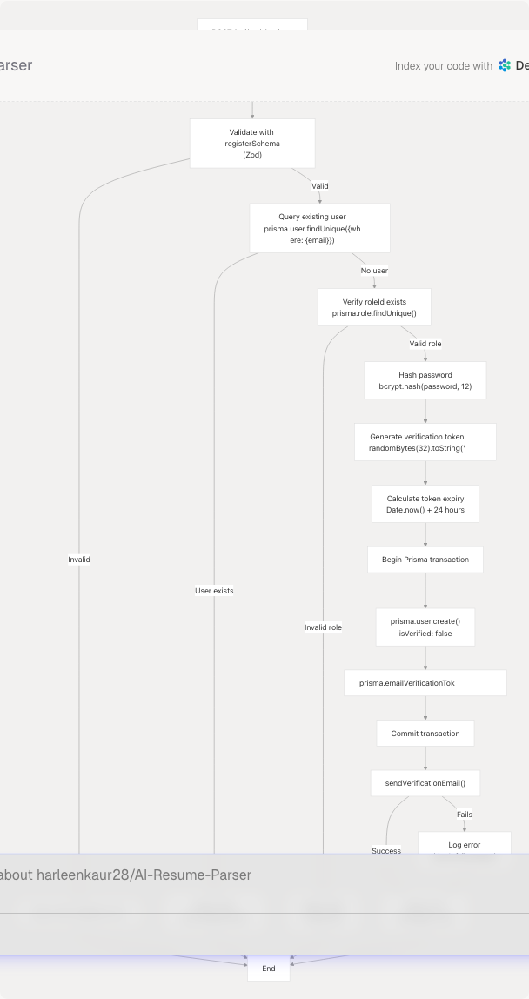
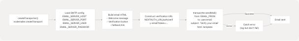
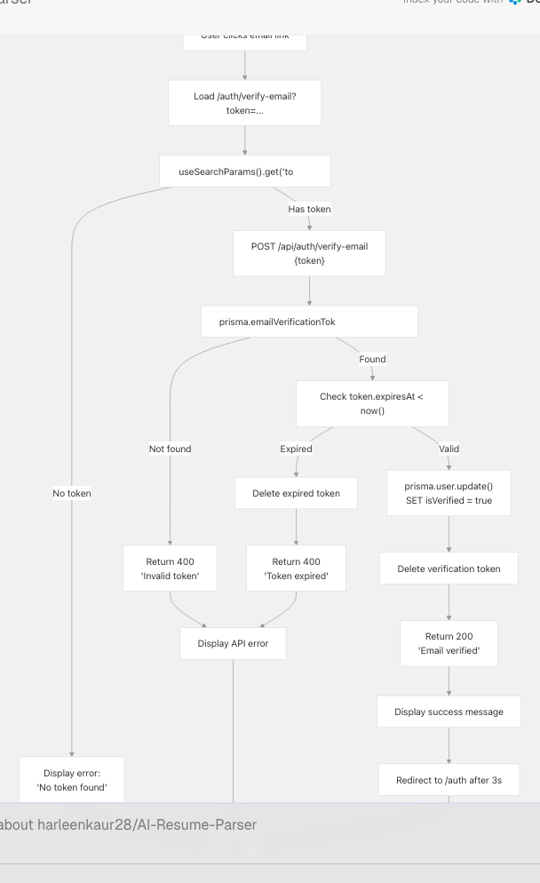
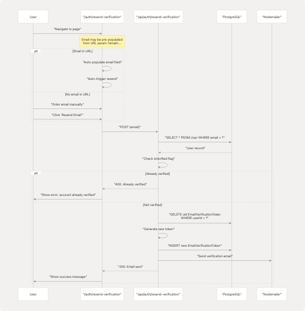

# Registration & Email Verification

## Purpose and Scope

This document covers the user registration process and email verification system in TalentSync. It explains how new users create accounts, how verification tokens are generated and managed, and how email verification ensures account validity before allowing login.

For login functionality and OAuth providers, see [Login & OAuth](4.2.2-login-and-oauth). For password management after registration, see [Password Reset Flow](4.2.3-password-reset-flow).

## Registration Flow Overview

The registration system follows a multi-step flow that requires email verification before allowing login. Users can register via email/password or OAuth providers (Google, GitHub), though OAuth users skip the email verification step.

**Diagram: End-to-End Registration Flow**


## Registration Form Structure

The registration form is implemented in the "register" tab of the authentication page at `/auth?tab=register`. It collects user information and performs client-side validation before submitting to the API.

**Table: Registration Form Fields**

| Field | Type | Validation | Required | Notes |
| --- | --- | --- | --- | --- |
| `name` | text | min 1 character | Yes | User's full name |
| `email` | email | valid email format | Yes | Must be unique in database |
| `password` | password | min 6 characters | Yes | Hashed with bcrypt (12 rounds) |
| `confirmPassword` | password | must match password | Yes | Client-side only, not sent to API |
| `roleId` | select | valid role ID from `/api/roles` | Yes | Either "Seeker" or "Recruiter" |
| `avatarUrl` | url | valid URL or empty | No | Optional profile picture URL |

**Form State Management**

The registration form maintains state using React's `useState` hook:

```
const [registerForm, setRegisterForm] = useState({
  name: "",
  email: "",
  password: "",
  confirmPassword: "",
  roleId: "",
  avatarUrl: "",
});
```

**Client-Side Validation**

Before submitting, the form validates:

1. Password match: `registerForm.password !== registerForm.confirmPassword`
2. Password length: `registerForm.password.length < 6`
3. Role selection: `!registerForm.roleId`
4. Avatar URL format (optional): `validateAvatarUrl(registerForm.avatarUrl)`

## Registration API Endpoint

The registration endpoint at `/api/auth/register` handles user creation, token generation, and email sending in a single atomic transaction.

**Diagram: Registration API Processing**



**Zod Validation Schema**

The API uses Zod for request validation:

```
const registerSchema = z.object({
  name: z.string().min(1, "Name is required"),
  email: z.string().email("Invalid email format"),
  password: z.string().min(6, "Password must be at least 6 characters"),
  roleId: z.string().min(1, "Role is required"),
  avatarUrl: z.union([
    z.string().url("Invalid avatar URL"),
    z.literal(""),
    z.null(),
    z.undefined()
  ]).optional().transform(val => val || null),
});
```

## Email Verification Token System

Verification tokens are cryptographically secure random strings stored in the `EmailVerificationToken` table with an expiration time.

**Table: EmailVerificationToken Schema**

| Field | Type | Constraints | Description |
| --- | --- | --- | --- |
| `id` | String | Primary Key (cuid) | Unique token ID |
| `token` | String | Unique, indexed | 64-char hex string (32 bytes) |
| `expiresAt` | DateTime | Required | Token expires after 24 hours |
| `createdAt` | DateTime | Default: now() | Token creation timestamp |
| `userId` | String | Foreign Key → User.id | Owner of the token |

**Token Generation Process**

1. Generate random bytes: `randomBytes(32)`
2. Convert to hexadecimal: `.toString("hex")` (produces 64 characters)
3. Set expiration: `Date.now() + 24 * 60 * 60 * 1000` (24 hours from now)
4. Store in database with `userId` relationship

**Token Security Properties**

* **Uniqueness**: 32 bytes = 256 bits of entropy, collision probability negligible
* **Expiration**: 24-hour validity window prevents indefinite token reuse
* **Single-use**: Once verified, user's `isVerified` flag is set to `true`
* **Database cleanup**: Expired tokens can be removed via scheduled job (not shown in code)

## Email Delivery with Nodemailer

The system uses Nodemailer with SMTP to send verification emails. Configuration is loaded from environment variables.

**Diagram: Email Sending Process**



**SMTP Configuration**

Nodemailer transporter configuration:

```
const createTransporter = () => {
  return nodemailer.createTransport({
    host: process.env.EMAIL_SERVER_HOST,
    port: Number(process.env.EMAIL_SERVER_PORT) || 587,
    secure: false, // Use TLS
    auth: {
      user: process.env.EMAIL_SERVER_USER,
      pass: process.env.EMAIL_SERVER_PASSWORD,
    },
  });
};
```

**Email Template Structure**

The verification email contains:

1. Personalized greeting with user's name
2. Explanation of email purpose
3. Prominent "Verify Email Address" button linking to verification URL
4. Plain text URL as fallback
5. Expiration notice (24 hours)
6. Footer with platform branding

The verification URL format: `${NEXTAUTH_URL}/auth/verify-email?token=${token}`

## Email Verification Flow

Users verify their email by clicking the link sent to their inbox, which redirects to `/auth/verify-email?token=<token>`.

**Diagram: Email Verification Process**



**Frontend Verification Component**

The `VerifyEmailContent` component handles the verification UI:

1. Extracts token from URL query parameters using `useSearchParams()`
2. Automatically calls verification API on component mount
3. Shows loading state during API call
4. Displays success or error messages
5. Auto-redirects to `/auth` after 3 seconds on success

**Verification States**

| State | UI Display | Actions Available |
| --- | --- | --- |
| Loading | Pulse loader with "Verifying..." | None |
| Success | Green checkmark, success message | Auto-redirect to login |
| Error (invalid token) | Red alert icon, error message | Link to resend verification |
| Error (expired token) | Red alert icon, expiration message | Link to resend verification |
| No token | Red alert icon, "No token found" | Link to resend verification |

## Resend Verification Flow

Users who didn't receive the verification email or whose token expired can request a new verification email at `/auth/resend-verification`.

**Diagram: Resend Verification Process**



**Auto-populate from URL**

The resend page supports URL parameters for better UX flow:

* From login error: `/auth/resend-verification?email=user@example.com`
* From registration success: Link includes email parameter
* Email is auto-filled and resend is automatically triggered

**Resend UI States**

The component manages multiple states:

```
const [email, setEmail] = useState("");
const [isLoading, setIsLoading] = useState(false);
const [error, setError] = useState<string | null>(null);
const [success, setSuccess] = useState<string | null>(null);
```

When email is in URL, the component automatically calls `handleResend()` on mount, triggering the API request without user interaction.

## User Registration Links to Authentication

After successful registration, users cannot log in until they verify their email. The authentication system enforces this through NextAuth credentials provider.

**Diagram: Registration to Login Flow**

## Error Handling and User Feedback

The registration system provides comprehensive error handling at multiple levels.

**Table: Registration Error Scenarios**

| Error Type | Detection Point | User Feedback | Recovery Action |
| --- | --- | --- | --- |
| Passwords don't match | Client (form) | Red alert banner | Re-enter confirm password |
| Password too short | Client + Server | "Must be 6+ characters" | Enter longer password |
| Email already exists | Server (DB query) | "User with email exists" | Use different email or login |
| Invalid role | Server (DB query) | "Invalid role selected" | Select valid role |
| Invalid avatar URL | Client (URL validation) | "Please enter valid URL" | Fix URL or leave empty |
| Email send fails | Server (SMTP) | Logged, not shown to user | User can resend later |
| Login before verify | Login attempt | "Please verify your email" | Link to resend verification |

**Login Prevention for Unverified Users**

When unverified users attempt to login, they receive a contextual error message with a link to resend verification:

```
if (result?.error) {
  if (result.error.includes("verify your email")) {
    setError(
      <div>
        Please verify your email before signing in.{" "}
        <Link
          href={`/auth/resend-verification?email=${encodeURIComponent(loginForm.email)}`}
          className="text-[#76ABAE] hover:underline font-medium"
        >
          Resend verification email
        </Link>
      </div>
    );
  }
}
```

## Data Flow Summary

**Table: Registration Data Journey**

| Stage | Location | Data Format | Storage |
| --- | --- | --- | --- |
| Form Input | Frontend state | `registerForm` object | React useState |
| API Request | HTTP POST body | JSON payload | Network transmission |
| Validation | API route | Zod parsed object | Memory |
| Password Hashing | bcrypt | Hashed string (60 chars) | Memory |
| Token Generation | crypto.randomBytes | 64-char hex string | Memory |
| User Creation | Prisma transaction | User model | PostgreSQL User table |
| Token Storage | Prisma transaction | EmailVerificationToken model | PostgreSQL EmailVerificationToken table |
| Email Sending | Nodemailer | HTML template | SMTP server → inbox |
| Token Verification | API route | Token lookup | PostgreSQL query |
| User Update | Prisma update | `isVerified: true` | PostgreSQL User table |
| Token Deletion | Prisma delete | Token removed | PostgreSQL EmailVerificationToken table |

## Security Considerations

The registration and email verification system implements several security measures:

**Password Security**

* Minimum 6 characters enforced client and server-side
* Hashed with bcrypt using 12 salt rounds
* Never stored or transmitted in plain text
* Confirm password only validated client-side (not sent to API)

**Token Security**

* 256-bit entropy (32 bytes) prevents brute force attacks
* 24-hour expiration limits attack window
* Tokens deleted after successful verification (single-use)
* Unique constraint prevents token collision

**Email Validation**

* Server-side verification prevents login before email confirmation
* `isVerified` flag stored in database, not client-controlled
* Email uniqueness enforced at database level

**Error Message Security**

* Existing user check returns same message as valid email to prevent enumeration
* No distinction between "user not found" and "wrong password"
* Email send failures logged server-side but not exposed to client

**Transaction Integrity**

* User creation and token creation in single database transaction
* Ensures atomicity: both succeed or both fail
* Prevents orphaned users or tokens
