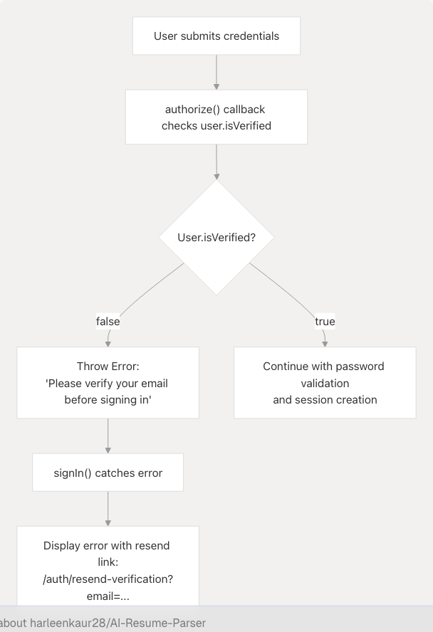
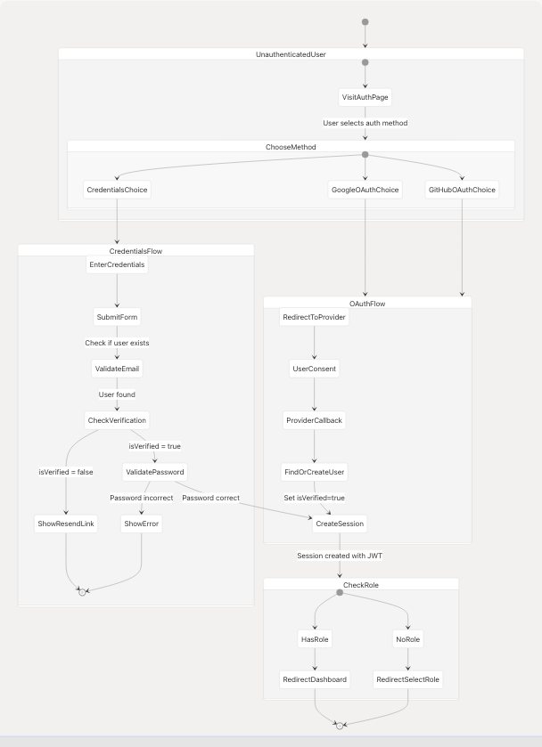

# Login & OAuth

This document describes the login and OAuth authentication mechanisms in TalentSync, including credentials-based login, Google OAuth, and GitHub OAuth flows. It covers the NextAuth integration, session creation, and the email verification gate that prevents unverified users from accessing the application.

For information about user registration and email verification, see [Registration & Email Verification](/harleenkaur28/AI-Resume-Parser/4.2.1-registration-and-email-verification). For password reset functionality, see [Password Reset Flow](/harleenkaur28/AI-Resume-Parser/4.2.3-password-reset-flow). For middleware-based route protection, see [Middleware & Route Protection](/harleenkaur28/AI-Resume-Parser/4.2.5-middleware-and-route-protection).

---

## Authentication Methods Overview

TalentSync supports three authentication methods, all implemented through NextAuth:

| Method | Provider | User Experience | Email Verification Required |
| --- | --- | --- | --- |
| Email/Password | `credentials` | Manual form entry | Yes |
| Google OAuth | `google` | One-click sign-in | No (OAuth providers are pre-verified) |
| GitHub OAuth | `github` | One-click sign-in | No (OAuth providers are pre-verified) |

All three methods converge to create a NextAuth session with user data including role information. The `AuthPage` component [frontend/app/auth/page.tsx39-903](https://github.com/harleenkaur28/AI-Resume-Parser/blob/b2bbd83d/frontend/app/auth/page.tsx#L39-L903) provides a unified interface with tabs for login and registration.

**Sources:** [frontend/app/auth/page.tsx1-929](https://github.com/harleenkaur28/AI-Resume-Parser/blob/b2bbd83d/frontend/app/auth/page.tsx#L1-L929)

---

## Authentication Page Structure

The authentication interface is organized as a tabbed layout with shared OAuth buttons and separate forms for credentials:


```

**Diagram: Authentication Page Component Hierarchy**

The page uses URL query parameters to control the default tab: `?tab=register` opens the registration tab, otherwise it defaults to login [frontend/app/auth/page.tsx49-50](https://github.com/harleenkaur28/AI-Resume-Parser/blob/b2bbd83d/frontend/app/auth/page.tsx#L49-L50)

**Sources:** [frontend/app/auth/page.tsx39-903](https://github.com/harleenkaur28/AI-Resume-Parser/blob/b2bbd83d/frontend/app/auth/page.tsx#L39-L903)

---

## Credentials Login Flow

The credentials login flow uses NextAuth's `signIn` function with the `credentials` provider:


**Diagram: Credentials Login Sequence**

The `handleLogin` function implements this flow [frontend/app/auth/page.tsx151-186](https://github.com/harleenkaur28/AI-Resume-Parser/blob/b2bbd83d/frontend/app/auth/page.tsx#L151-L186):

1. **Form Submission**: User submits email and password
2. **NextAuth Call**: `signIn('credentials', {email, password, redirect: false})`
3. **Authorize Callback**: NextAuth calls the `authorize()` function configured in `[...nextauth]/route.ts`
4. **User Lookup**: Database query to find user by email
5. **Verification Check**: If user exists but `isVerified` is false, throw error
6. **Password Validation**: Use bcrypt to compare passwords
7. **Session Creation**: On success, NextAuth creates session with JWT
8. **Redirect**: Client-side redirect to `/dashboard`

**Email Verification Gate**: The login process specifically checks for unverified users [frontend/app/auth/page.tsx163-177](https://github.com/harleenkaur28/AI-Resume-Parser/blob/b2bbd83d/frontend/app/auth/page.tsx#L163-L177) and displays a link to resend verification email instead of logging them in.

**Sources:** [frontend/app/auth/page.tsx151-186](https://github.com/harleenkaur28/AI-Resume-Parser/blob/b2bbd83d/frontend/app/auth/page.tsx#L151-L186)

---

## OAuth Login Flow

Both Google and GitHub OAuth follow the same flow pattern through NextAuth:


**Diagram: OAuth Login Sequence**

### OAuth Button Implementation

The OAuth buttons are rendered identically in both login and register tabs [frontend/app/auth/page.tsx423-467](https://github.com/harleenkaur28/AI-Resume-Parser/blob/b2bbd83d/frontend/app/auth/page.tsx#L423-L467):

```
// Google OAuth Button
<Button
  onClick={() => handleOAuthSignIn("google")}
  disabled={isLoading}
  type="button"
  className="w-full h-12 bg-white hover:bg-gray-50 text-gray-900..."
>
  {isLoading ? <Loader /> : <GoogleSVGIcon />}
  Continue with Google
</Button>

// GitHub OAuth Button  
<Button
  onClick={() => handleOAuthSignIn("github")}
  disabled={isLoading}
  type="button"
  className="w-full h-12 bg-[#24292F] hover:bg-[#1C2128]..."
>
  {isLoading ? <Loader /> : <Github className="h-5 w-5" />}
  Continue with GitHub
</Button>
```

The `handleOAuthSignIn` function [frontend/app/auth/page.tsx145-149](https://github.com/harleenkaur28/AI-Resume-Parser/blob/b2bbd83d/frontend/app/auth/page.tsx#L145-L149) simply calls NextAuth's `signIn` with the provider name:

```
const handleOAuthSignIn = async (provider: string) => {
  setIsLoading(true);
  await signIn(provider, { callbackUrl: "/dashboard" });
  setIsLoading(false);
};
```

### OAuth vs Credentials Differences

| Aspect | Credentials | OAuth |
| --- | --- | --- |
| User Creation | Manual registration required | Auto-created on first sign-in |
| Email Verification | Required, enforced at login | Not required (provider verified) |
| Password Storage | `passwordHash` field populated | `passwordHash` is NULL |
| Profile Image | Optional, user-provided URL | Automatically from OAuth profile |
| Role Assignment | Required during registration | Deferred to `/select-role` page |

OAuth users are automatically marked as verified (`isVerified = true`) because OAuth providers have already verified the email address.

**Sources:** [frontend/app/auth/page.tsx145-149](https://github.com/harleenkaur28/AI-Resume-Parser/blob/b2bbd83d/frontend/app/auth/page.tsx#L145-L149) [frontend/app/auth/page.tsx423-467](https://github.com/harleenkaur28/AI-Resume-Parser/blob/b2bbd83d/frontend/app/auth/page.tsx#L423-L467) [frontend/app/auth/page.tsx593-637](https://github.com/harleenkaur28/AI-Resume-Parser/blob/b2bbd83d/frontend/app/auth/page.tsx#L593-L637)

---

## NextAuth Session Flow

After successful authentication (credentials or OAuth), NextAuth creates a session:


**Diagram: NextAuth Session Creation and Access**

The session object contains:

* `user.id`: Database user ID
* `user.email`: User's email
* `user.name`: User's name
* `user.role`: Role name (e.g., "Seeker", "Recruiter")
* `user.image`: Avatar URL
* `user.isVerified`: Boolean indicating email verification status

Client components access the session using the `useSession()` hook [frontend/app/auth/page.tsx40](https://github.com/harleenkaur28/AI-Resume-Parser/blob/b2bbd83d/frontend/app/auth/page.tsx#L40-L40):

```
const { data: session, status } = useSession();
```

The session status can be:

* `"loading"`: Session is being fetched
* `"authenticated"`: User is logged in
* `"unauthenticated"`: No session exists

**Sources:** [frontend/app/auth/page.tsx40](https://github.com/harleenkaur28/AI-Resume-Parser/blob/b2bbd83d/frontend/app/auth/page.tsx#L40-L40) [frontend/app/auth/page.tsx276-290](https://github.com/harleenkaur28/AI-Resume-Parser/blob/b2bbd83d/frontend/app/auth/page.tsx#L276-L290)

---

## Login Page Session Redirect

The authentication page implements automatic redirection if a session already exists [frontend/app/auth/page.tsx118-122](https://github.com/harleenkaur28/AI-Resume-Parser/blob/b2bbd83d/frontend/app/auth/page.tsx#L118-L122):

```
useEffect(() => {
  if (session) {
    router.push("/dashboard");
  }
}, [session, router]);
```

This prevents logged-in users from accessing the login page. The page shows different states based on session status:

| Status | Display |
| --- | --- |
| `"loading"` | "Loading authentication..." message |
| Authenticated | "Redirecting to dashboard..." message + redirect |
| Unauthenticated | Show login/register tabs |

**Sources:** [frontend/app/auth/page.tsx118-122](https://github.com/harleenkaur28/AI-Resume-Parser/blob/b2bbd83d/frontend/app/auth/page.tsx#L118-L122) [frontend/app/auth/page.tsx276-290](https://github.com/harleenkaur28/AI-Resume-Parser/blob/b2bbd83d/frontend/app/auth/page.tsx#L276-L290)

---

## Email Verification Enforcement

For credentials-based login, email verification is strictly enforced:



**Diagram: Email Verification Check During Login**

The error handling in `handleLogin` specifically detects verification errors [frontend/app/auth/page.tsx163-177](https://github.com/harleenkaur28/AI-Resume-Parser/blob/b2bbd83d/frontend/app/auth/page.tsx#L163-L177):

```
if (result?.error) {
  // Check if error is related to email verification
  if (result.error.includes("verify your email")) {
    setError(
      <div>
        Please verify your email before signing in.{" "}
        <Link
          href={`/auth/resend-verification?email=${encodeURIComponent(loginForm.email)}`}
          className="text-[#76ABAE] hover:underline font-medium"
        >
          Resend verification email
        </Link>
      </div>
    );
  } else {
    setError("Invalid email or password");
  }
}
```

The error message includes a clickable link to resend the verification email, pre-populating the user's email address.

**Sources:** [frontend/app/auth/page.tsx163-177](https://github.com/harleenkaur28/AI-Resume-Parser/blob/b2bbd83d/frontend/app/auth/page.tsx#L163-L177)

---

## URL Error Parameters

The authentication page handles error states passed via URL parameters [frontend/app/auth/page.tsx124-143](https://github.com/harleenkaur28/AI-Resume-Parser/blob/b2bbd83d/frontend/app/auth/page.tsx#L124-L143):

```
useEffect(() => {
  const errorParam = searchParams.get("error");
  if (errorParam === "unverified") {
    const emailParam = searchParams.get("email");
    setError(
      <div>
        Please verify your email before signing in.{" "}
        <Link
          href={`/auth/resend-verification${
            emailParam ? `?email=${encodeURIComponent(emailParam)}` : ""
          }`}
          className="text-[#76ABAE] hover:underline font-medium"
        >
          Resend verification email
        </Link>
      </div>
    );
  }
}, [searchParams]);
```

This allows middleware or other parts of the system to redirect to `/auth?error=unverified&email=...` to inform users they need to verify their email.

**Sources:** [frontend/app/auth/page.tsx124-143](https://github.com/harleenkaur28/AI-Resume-Parser/blob/b2bbd83d/frontend/app/auth/page.tsx#L124-L143)

---

## Loading States and UX

The authentication page implements multiple loading states for optimal user experience:

### Initial Page Load

A full-screen loader with pulse animation [frontend/app/auth/page.tsx294-308](https://github.com/harleenkaur28/AI-Resume-Parser/blob/b2bbd83d/frontend/app/auth/page.tsx#L294-L308):

```
<AnimatePresence>
  {isPageLoading && (
    <motion.div
      initial={{ opacity: 1 }}
      exit={{ opacity: 0 }}
      className="fixed inset-0 bg-gradient-to-br from-[#222831] via-[#31363F] to-[#222831] 
                 flex items-center justify-center z-50"
    >
      <Loader variant="pulse" size="xl" text="Loading authentication..." />
    </motion.div>
  )}
</AnimatePresence>
```

### Authentication Request Loading

A full-screen overlay with backdrop blur during login/OAuth [frontend/app/auth/page.tsx311-342](https://github.com/harleenkaur28/AI-Resume-Parser/blob/b2bbd83d/frontend/app/auth/page.tsx#L311-L342):

```
<AnimatePresence>
  {isLoading && (
    <motion.div
      initial={{ opacity: 0 }}
      animate={{ opacity: 1 }}
      exit={{ opacity: 0 }}
      className="fixed inset-0 bg-black/50 backdrop-blur-md z-50 flex items-center justify-center"
    >
      <motion.div className="bg-white/10 backdrop-blur-lg rounded-3xl p-10 border border-white/20">
        <Loader variant="pulse" size="xl" className="text-[#76ABAE]" />
        <h3 className="text-[#EEEEEE] font-semibold text-xl mb-3">
          Processing Authentication
        </h3>
        <p className="text-[#EEEEEE]/70 text-sm leading-relaxed">
          Please wait while we authenticate your request...
        </p>
        <div className="mt-6 flex justify-center space-x-2">
          <div className="w-2 h-2 bg-[#76ABAE] rounded-full animate-pulse"></div>
          <div className="w-2 h-2 bg-[#76ABAE] rounded-full animate-pulse delay-75"></div>
          <div className="w-2 h-2 bg-[#76ABAE] rounded-full animate-pulse delay-150"></div>
        </div>
      </motion.div>
    </motion.div>
  )}
</AnimatePresence>
```

Both OAuth buttons and the credentials form submit button are disabled during loading to prevent duplicate submissions.

**Sources:** [frontend/app/auth/page.tsx294-342](https://github.com/harleenkaur28/AI-Resume-Parser/blob/b2bbd83d/frontend/app/auth/page.tsx#L294-L342) [frontend/app/auth/page.tsx426-427](https://github.com/harleenkaur28/AI-Resume-Parser/blob/b2bbd83d/frontend/app/auth/page.tsx#L426-L427) [frontend/app/auth/page.tsx570](https://github.com/harleenkaur28/AI-Resume-Parser/blob/b2bbd83d/frontend/app/auth/page.tsx#L570-L570)

---

## Form Validation

### Login Form Validation

The login form implements basic HTML5 validation [frontend/app/auth/page.tsx481-575](https://github.com/harleenkaur28/AI-Resume-Parser/blob/b2bbd83d/frontend/app/auth/page.tsx#L481-L575):

* Email field: `type="email"` and `required`
* Password field: `type="password"` and `required`
* Additional validation happens server-side in the authorize callback

### Password Visibility Toggle

Both forms include password visibility toggles [frontend/app/auth/page.tsx531-542](https://github.com/harleenkaur28/AI-Resume-Parser/blob/b2bbd83d/frontend/app/auth/page.tsx#L531-L542):

```
<button
  type="button"
  onClick={() => setShowPassword(!showPassword)}
  className="absolute right-3 top-1/2 -translate-y-1/2 text-[#76ABAE] hover:text-[#EEEEEE] 
             transition-colors"
>
  {showPassword ? <EyeOff className="h-4 w-4" /> : <Eye className="h-4 w-4" />}
</button>
```

The password input's `type` attribute switches between `"password"` and `"text"` based on the `showPassword` state.

**Sources:** [frontend/app/auth/page.tsx519-542](https://github.com/harleenkaur28/AI-Resume-Parser/blob/b2bbd83d/frontend/app/auth/page.tsx#L519-L542) [frontend/app/auth/page.tsx43-44](https://github.com/harleenkaur28/AI-Resume-Parser/blob/b2bbd83d/frontend/app/auth/page.tsx#L43-L44)

---

## Error Display Component

Errors are displayed in a consistent banner format [frontend/app/auth/page.tsx393-409](https://github.com/harleenkaur28/AI-Resume-Parser/blob/b2bbd83d/frontend/app/auth/page.tsx#L393-L409):

```
{error && (
  <motion.div
    initial={{ opacity: 0, y: -10 }}
    animate={{ opacity: 1, y: 0 }}
    className={`mb-6 p-4 rounded-xl backdrop-blur-lg border text-sm ${
      typeof error === "string" && error.includes("Registration Successful")
        ? "bg-green-500/10 border-green-500/30 text-green-200"
        : "bg-red-500/10 border-red-500/30 text-red-200"
    }`}
  >
    <div className="flex items-start space-x-2">
      <AlertCircle className="h-4 w-4 mt-0.5 flex-shrink-0" />
      <div>{error}</div>
    </div>
  </motion.div>
)}
```

The error state can be either a string or a React node, allowing for rich error messages with links (e.g., "Resend verification email" link).

**Sources:** [frontend/app/auth/page.tsx393-409](https://github.com/harleenkaur28/AI-Resume-Parser/blob/b2bbd83d/frontend/app/auth/page.tsx#L393-L409) [frontend/app/auth/page.tsx46](https://github.com/harleenkaur28/AI-Resume-Parser/blob/b2bbd83d/frontend/app/auth/page.tsx#L46-L46)

---

## Login Flow Summary

```


**Diagram: Complete Login State Machine**

This state machine shows all possible paths through the login system, including the role check that happens after session creation (handled by middleware, see [Middleware & Route Protection](/harleenkaur28/AI-Resume-Parser/4.2.5-middleware-and-route-protection)).

**Sources:** [frontend/app/auth/page.tsx1-929](https://github.com/harleenkaur28/AI-Resume-Parser/blob/b2bbd83d/frontend/app/auth/page.tsx#L1-L929)

---

## Component File Structure

```
frontend/app/auth/
├── page.tsx                    # Main auth page (login/register tabs)
├── verify-email/
│   └── page.tsx               # Email verification handler
├── resend-verification/
│   └── page.tsx               # Resend verification email
├── forgot-password/
│   └── page.tsx               # Request password reset
└── reset-password/
    └── page.tsx               # Reset password with token

frontend/app/api/auth/
├── [...nextauth]/
│   └── route.ts               # NextAuth configuration (credentials & OAuth)
├── register/
│   └── route.ts               # Registration endpoint
├── verify-email/
│   └── route.ts               # Email verification endpoint
├── resend-verification/
│   └── route.ts               # Resend verification endpoint
├── reset-password/
│   └── route.ts               # Password reset request endpoint
└── confirm-reset/
    └── route.ts               # Password reset confirmation endpoint
```

The main authentication page handles both login and registration, with OAuth integration shared between both flows. Related authentication features (email verification, password reset) are organized in separate subdirectories.

**Sources:** [frontend/app/auth/page.tsx1-929](https://github.com/harleenkaur28/AI-Resume-Parser/blob/b2bbd83d/frontend/app/auth/page.tsx#L1-L929)
