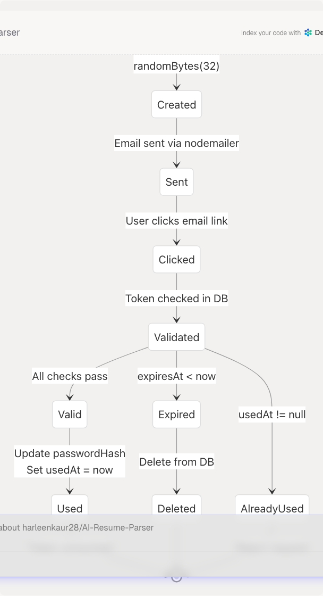
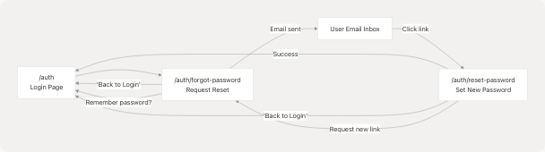

# Password Reset Flow

## Purpose and Scope

This document describes the password reset flow for users who have forgotten their credentials. The system implements a secure token-based password reset mechanism that involves email verification, time-limited tokens, and one-time use validation.

This page covers the complete journey from requesting a password reset to successfully updating credentials. For initial user registration and email verification, see [Registration & Email Verification](4.2.1-registration-and-email-verification). For standard login procedures, see [Login & OAuth](4.2.2-login-and-oauth).

---

## Overview

The password reset flow is a two-step process:

1. **Request Reset**: User provides their email address and receives a reset link via email
2. **Confirm Reset**: User clicks the email link and sets a new password

The system uses cryptographically secure tokens that expire after 1 hour and can only be used once. Only users with email/password authentication can reset passwords; OAuth users (Google, GitHub) are blocked from this flow since they authenticate through external providers.

---

## System Architecture

### High-Level Component Diagram


---

## Complete Password Reset Sequence

### End-to-End Flow Diagram

---

## Token Lifecycle State Machine

### Password Reset Token States



---

## Frontend Pages

### Forgot Password Page (`/auth/forgot-password`)

The forgot password page is a standalone form where users request a password reset by entering their email address.

**Component**: `ForgotPasswordPage` at [frontend/app/auth/forgot-password/page.tsx19-237](https://github.com/harleenkaur28/AI-Resume-Parser/blob/b2bbd83d/frontend/app/auth/forgot-password/page.tsx#L19-L237)

**Key Features**:

* Email input with validation
* Loading states with animated overlay
* Success/error message display
* Link back to login page

**State Management**:

| State Variable | Type | Purpose |
| --- | --- | --- |
| `isPageLoading` | `boolean` | Initial page load animation (600ms) |
| `email` | `string` | User's email input |
| `isLoading` | `boolean` | Request in progress |
| `error` | `string | null` | Error message to display |
| `success` | `string | null` | Success message to display |

**Form Submission Flow**:

```
// frontend/app/auth/forgot-password/page.tsx:32-60
const handleSubmit = async (e: React.FormEvent) => {
  e.preventDefault();
  // Validate email not empty
  // POST to /api/auth/reset-password
  // Display success or error message
};
```

---

### Reset Password Page (`/auth/reset-password`)

The reset password page allows users to set a new password using the token from their email.

**Component**: `ResetPasswordContent` at [frontend/app/auth/reset-password/page.tsx27-310](https://github.com/harleenkaur28/AI-Resume-Parser/blob/b2bbd83d/frontend/app/auth/reset-password/page.tsx#L27-L310)

**Key Features**:

* Token extraction from URL query parameter
* Dual password inputs (new + confirm)
* Password visibility toggles
* Validation (6+ characters, passwords match)
* Auto-redirect to login on success

**State Management**:

| State Variable | Type | Purpose |
| --- | --- | --- |
| `token` | `string | null` | Reset token from URL `?token=...` |
| `password` | `string` | New password input |
| `confirmPassword` | `string` | Password confirmation input |
| `showPassword` | `boolean` | Toggle password visibility |
| `showConfirmPassword` | `boolean` | Toggle confirm password visibility |
| `isLoading` | `boolean` | Request in progress |
| `error` | `string | null` | Error message to display |
| `success` | `string | null` | Success message to display |

**Token Extraction**:

```
// frontend/app/auth/reset-password/page.tsx:46-55
useEffect(() => {
  const tokenFromUrl = searchParams.get("token");
  if (tokenFromUrl) {
    setToken(tokenFromUrl);
  } else {
    setError("No reset token found...");
  }
}, [searchParams]);
```

**Validation and Submission**:

```
// frontend/app/auth/reset-password/page.tsx:57-97
const handleSubmit = async (e: React.FormEvent) => {
  // Check token exists
  // Validate passwords match
  // Validate password length >= 6
  // POST to /api/auth/confirm-reset
  // On success: setTimeout redirect to /auth
};
```

---

## Backend API Routes

### POST `/api/auth/reset-password`

Initiates the password reset process by creating a token and sending an email.

**Route Handler**: [frontend/app/api/auth/reset-password/route.ts59-134](https://github.com/harleenkaur28/AI-Resume-Parser/blob/b2bbd83d/frontend/app/api/auth/reset-password/route.ts#L59-L134)

**Request Schema**:

```
// frontend/app/api/auth/reset-password/route.ts:7-9
const resetPasswordSchema = z.object({
  email: z.string().email("Invalid email format"),
});
```

**Request Body**:

```
{
  "email": "user@example.com"
}
```

**Processing Steps**:

1. **Validate Email**: Parse with Zod schema
2. **Find User**: Query `prisma.user.findUnique({ where: { email } })`
3. **Security Check**: Return generic success message if user not found (prevent email enumeration)
4. **OAuth Check**: Return error if `user.passwordHash` is null (OAuth users can't reset)
5. **Clean Old Tokens**: Delete existing tokens with `prisma.passwordResetToken.deleteMany({ where: { userId } })`
6. **Generate Token**: Create 32-byte hex token with `randomBytes(32).toString("hex")`
7. **Set Expiry**: Token expires in 1 hour (`Date.now() + 60 * 60 * 1000`)
8. **Store Token**: Insert into database with `prisma.passwordResetToken.create()`
9. **Send Email**: Call `sendPasswordResetEmail()` with token
10. **Return Success**: Generic message for security

**Response (Success)**:

```
{
  "message": "If an account with this email exists, a password reset link has been sent."
}
```

**Response (OAuth User)**:

```
{
  "error": "This account was created with OAuth and doesn't have a password to reset..."
}
```

---

### POST `/api/auth/confirm-reset`

Validates the reset token and updates the user's password.

**Route Handler**: [frontend/app/api/auth/confirm-reset/route.ts11-88](https://github.com/harleenkaur28/AI-Resume-Parser/blob/b2bbd83d/frontend/app/api/auth/confirm-reset/route.ts#L11-L88)

**Request Schema**:

```
// frontend/app/api/auth/confirm-reset/route.ts:6-9
const confirmResetSchema = z.object({
  token: z.string().min(1, "Token is required"),
  password: z.string().min(6, "Password must be at least 6 characters"),
});
```

**Request Body**:

```
{
  "token": "abc123...",
  "password": "newSecurePassword123"
}
```

**Processing Steps**:

1. **Validate Input**: Parse with Zod schema
2. **Find Token**: Query `prisma.passwordResetToken.findUnique({ where: { token }, include: { user: true } })`
3. **Check Existence**: Return error if token not found
4. **Check Expiry**: Compare `resetToken.expiresAt < new Date()`, delete if expired
5. **Check Usage**: Reject if `resetToken.usedAt !== null`
6. **Hash Password**: Generate bcrypt hash with `hash(password, 12)`
7. **Update Database**: Use transaction to:
   * Update `user.passwordHash`
   * Set `passwordResetToken.usedAt = new Date()`
8. **Return Success**: User can now login

**Response (Success)**:

```
{
  "success": true,
  "message": "Password reset successfully! You can now sign in with your new password."
}
```

**Response (Invalid Token)**:

```
{
  "error": "Invalid or expired reset token"
}
```

**Response (Already Used)**:

```
{
  "error": "This reset token has already been used. Please request a new password reset if needed."
}
```

---

## Email Service

### Email Configuration

The system uses `nodemailer` to send password reset emails via SMTP.

**Transporter Creation**:

```
// frontend/app/api/auth/reset-password/route.ts:12-22
const createTransporter = () => {
  return nodemailer.createTransport({
    host: process.env.EMAIL_SERVER_HOST,
    port: Number(process.env.EMAIL_SERVER_PORT) || 587,
    secure: false, // Use TLS
    auth: {
      user: process.env.EMAIL_SERVER_USER,
      pass: process.env.EMAIL_SERVER_PASSWORD,
    },
  });
};
```

**Environment Variables Required**:

| Variable | Purpose |
| --- | --- |
| `EMAIL_SERVER_HOST` | SMTP server hostname |
| `EMAIL_SERVER_PORT` | SMTP port (default: 587) |
| `EMAIL_SERVER_USER` | SMTP authentication username |
| `EMAIL_SERVER_PASSWORD` | SMTP authentication password |
| `EMAIL_FROM` | Sender email address |
| `NEXTAUTH_URL` | Base URL for constructing reset links |

---

### Password Reset Email Template

The reset email contains a clickable button and a fallback URL.

**Email Function**: [frontend/app/api/auth/reset-password/route.ts24-57](https://github.com/harleenkaur28/AI-Resume-Parser/blob/b2bbd83d/frontend/app/api/auth/reset-password/route.ts#L24-L57)

**Reset URL Format**:

```
https://{NEXTAUTH_URL}/auth/reset-password?token={32-byte-hex-token}
```

**Email Content Structure**:

* **Subject**: "Reset your password - TalentSync AI"
* **Greeting**: Personalized with user's name
* **Call to Action**: Blue button with reset link
* **Fallback**: Plain text URL for copying
* **Security Notice**: Token expires in 1 hour
* **Footer**: Branding text

**HTML Template** (abbreviated):

```
<div style="max-width: 600px; margin: 0 auto;">
  <h2>Reset Your Password</h2>
  <div style="background: #f8f9fa; padding: 20px;">
    <p>Hello {name},</p>
    <p>To reset your password, click the button below:</p>
    <a href="{resetUrl}" style="background: #76ABAE; color: white; padding: 12px 30px;">
      Reset Password
    </a>
    <p>This link will expire in 1 hour.</p>
  </div>
</div>
```

---

## Database Schema

### PasswordResetToken Model

The `PasswordResetToken` table stores temporary tokens for password resets.

**Prisma Model Structure**:

| Field | Type | Constraints | Purpose |
| --- | --- | --- | --- |
| `id` | `String` | Primary Key, UUID | Unique identifier |
| `token` | `String` | Unique, indexed | The reset token (32-byte hex) |
| `expiresAt` | `DateTime` | Required | Expiration timestamp (1 hour) |
| `usedAt` | `DateTime?` | Optional | When token was consumed (null = unused) |
| `userId` | `String` | Foreign Key | References User.id |
| `user` | `User` | Relation | Associated user record |
| `createdAt` | `DateTime` | Auto-generated | When token was created |

**Token Generation**:

```
// frontend/app/api/auth/reset-password/route.ts:91-100
const token = randomBytes(32).toString("hex");
const expiresAt = new Date(Date.now() + 60 * 60 * 1000); // 1 hour

await prisma.passwordResetToken.create({
  data: {
    token,
    expiresAt,
    userId: user.id,
  },
});
```

**Token Validation**:

```
// frontend/app/api/auth/confirm-reset/route.ts:17-48
const resetToken = await prisma.passwordResetToken.findUnique({
  where: { token },
  include: { user: true },
});

// Check: exists, not expired, not used
if (!resetToken) return error("Invalid or expired");
if (resetToken.expiresAt < new Date()) return error("Expired");
if (resetToken.usedAt) return error("Already used");
```

---

## Security Features

### Token Security Measures

| Feature | Implementation | Purpose |
| --- | --- | --- |
| **Cryptographic Randomness** | `randomBytes(32)` from Node.js crypto | Prevents token prediction |
| **One-Time Use** | `usedAt` timestamp | Prevents replay attacks |
| **Time Expiration** | 1-hour TTL | Limits attack window |
| **Token Cleanup** | Delete old tokens before creating new | Prevents token accumulation |
| **Email Enumeration Protection** | Generic success message | Doesn't reveal if email exists |
| **OAuth Prevention** | Check `passwordHash` field | Blocks OAuth users from resetting |
| **Password Hashing** | bcrypt with 12 rounds | Secure password storage |
| **Database Transaction** | Atomic password + token update | Ensures consistency |

**Preventing Email Enumeration**:

```
// frontend/app/api/auth/reset-password/route.ts:69-75
if (!user) {
  // Don't reveal whether the email exists or not for security
  return NextResponse.json(
    { message: "If an account with this email exists, a password reset link has been sent." },
    { status: 200 }
  );
}
```

**Preventing OAuth Account Reset**:

```
// frontend/app/api/auth/reset-password/route.ts:77-83
if (!user.passwordHash) {
  return NextResponse.json(
    { error: "This account was created with OAuth and doesn't have a password to reset..." },
    { status: 400 }
  );
}
```

**One-Time Token Usage**:

```
// frontend/app/api/auth/confirm-reset/route.ts:42-48
if (resetToken.usedAt) {
  return NextResponse.json(
    { error: "This reset token has already been used..." },
    { status: 400 }
  );
}
```

---

## UI/UX Features

### Loading States

Both pages implement sophisticated loading overlays during async operations.

**Page Load Animation**:

* 600ms initial fade-in with `Loader` component
* Uses `framer-motion` for smooth transitions
* Prevents layout shift

**Request Loading Overlay**:

```
// frontend/app/auth/forgot-password/page.tsx:81-116
<AnimatePresence>
  {isLoading && (
    <motion.div className="fixed inset-0 bg-black/50 backdrop-blur-md z-50">
      <motion.div className="bg-white/10 backdrop-blur-lg rounded-3xl p-10">
        <Loader variant="pulse" size="xl" className="text-[#76ABAE]" />
        <h3>Sending Reset Link</h3>
        <p>We're sending a password reset link to your email address...</p>
        {/* Animated dots */}
      </motion.div>
    </motion.div>
  )}
</AnimatePresence>
```

**Loading Variants**:

* **Forgot Password**: "Sending Reset Link"
* **Reset Password**: "Resetting Password"

---

### Error Handling

Both pages display contextual error messages with clear visual feedback.

**Error Display Pattern**:

```
// frontend/app/auth/forgot-password/page.tsx:160-165
{error && (
  <div className="mb-4 p-3 bg-red-500/20 border border-red-500/30 rounded-lg text-red-200 text-sm flex items-center space-x-2">
    <AlertCircle className="h-4 w-4 flex-shrink-0" />
    <span>{error}</span>
  </div>
)}
```

**Common Error Messages**:

| Error | Source | Message |
| --- | --- | --- |
| Empty email | Frontend validation | "Please enter your email address." |
| OAuth account | Backend | "This account was created with OAuth..." |
| No token in URL | Frontend | "No reset token found in the URL..." |
| Token expired | Backend | "Reset token has expired. Please request a new password reset." |
| Token used | Backend | "This reset token has already been used..." |
| Passwords mismatch | Frontend | "Passwords do not match." |
| Password too short | Frontend | "Password must be at least 6 characters long." |

---

### Success States

Success messages are displayed with green styling and provide next actions.

**Forgot Password Success**:

```
// frontend/app/auth/forgot-password/page.tsx:145-149
{success ? (
  <CheckCircle className="mx-auto h-10 w-10 text-green-400 mb-4" />
) : (
  <Send className="mx-auto h-10 w-10 text-[#76ABAE] mb-4" />
)}
```

**Reset Password Success**:

* Displays success message
* Shows "Go to Login" button
* Auto-redirects after 3 seconds with `setTimeout(() => router.push('/auth'), 3000)`

**Secondary Actions**:

* "Send Another Email" button on forgot password page
* "Request New Reset Link" button if token is invalid

---

## Integration with Auth System

### Login Page Integration

The forgot password flow is initiated from the main authentication page.

**Entry Point**: [frontend/app/auth/page.tsx559-564](https://github.com/harleenkaur28/AI-Resume-Parser/blob/b2bbd83d/frontend/app/auth/page.tsx#L559-L564)

```
<Link
  href="/auth/forgot-password"
  className="text-sm text-[#76ABAE] hover:text-[#76ABAE]/80 transition-colors font-medium"
>
  Forgot password?
</Link>
```

**Position**: Located in the login form, below the password field and next to "Remember me" checkbox.

---

### Navigation Flow



**Navigation Links**:

| From Page | To Page | Trigger |
| --- | --- | --- |
| Login → Forgot Password | `/auth` → `/auth/forgot-password` | "Forgot password?" link |
| Forgot Password → Login | `/auth/forgot-password` → `/auth` | "Back to Login" button |
| Forgot Password → Login | `/auth/forgot-password` → `/auth` | "Sign in here" link |
| Reset Password → Login | `/auth/reset-password` → `/auth` | Auto-redirect after success |
| Reset Password → Login | `/auth/reset-password` → `/auth` | "Back to Login" button |
| Reset Password → Forgot Password | `/auth/reset-password` → `/auth/forgot-password` | "Request New Reset Link" |

---

## Error Recovery Paths

### Invalid or Expired Token

If a user's token is invalid or expired, they can request a new one.

**Flow**:

1. User clicks old reset link
2. `/auth/reset-password?token=...` detects invalid token
3. Error message displayed: "Invalid or expired reset token"
4. "Request New Reset Link" button redirects to `/auth/forgot-password`
5. User re-enters email to get fresh token

**Code**: [frontend/app/auth/reset-password/page.tsx295-301](https://github.com/harleenkaur28/AI-Resume-Parser/blob/b2bbd83d/frontend/app/auth/reset-password/page.tsx#L295-L301)

---

### Email Not Received

If the user doesn't receive the reset email, they can resend it.

**Options**:

1. **"Send Another Email"** button on success screen (forgot password page)
2. Navigate back to `/auth/forgot-password` and re-submit
3. Check spam folder (mentioned in email template)

**Implementation**: [frontend/app/auth/forgot-password/page.tsx176-187](https://github.com/harleenkaur28/AI-Resume-Parser/blob/b2bbd83d/frontend/app/auth/forgot-password/page.tsx#L176-L187)

---

### OAuth User Attempts Reset

OAuth users (Google, GitHub) don't have passwords and cannot use this flow.

**Protection**:

```
// frontend/app/api/auth/reset-password/route.ts:78-83
if (!user.passwordHash) {
  return NextResponse.json(
    { error: "This account was created with OAuth and doesn't have a password to reset. Please sign in with your OAuth provider." },
    { status: 400 }
  );
}
```

**User Experience**: Error message clearly explains to use their OAuth provider instead.

---

## Testing Considerations

### Test Scenarios

| Scenario | Expected Behavior |
| --- | --- |
| Valid email, valid token | Password successfully reset |
| Non-existent email | Generic success message (no email sent) |
| OAuth user email | Error: use OAuth provider |
| Token expired (>1 hour) | Error: token expired, deleted from DB |
| Token already used | Error: token already used |
| Passwords don't match | Frontend validation error |
| Password < 6 characters | Frontend validation error |
| Token in URL missing | Error: no token found |
| Email sending fails | Backend logs error, user sees success |

---

## Related Components

### Shared UI Components

* **`Loader`**: Loading spinner/pulse animations at [frontend/app/auth/forgot-password/page.tsx17](https://github.com/harleenkaur28/AI-Resume-Parser/blob/b2bbd83d/frontend/app/auth/forgot-password/page.tsx#L17-L17)
* **`Button`**: Styled button component from UI library
* **`Input`**: Form input with consistent styling
* **`Card`**: Container with glassmorphism effect
* **`Label`**: Form labels with accessibility

### Icons Used

* **`ArrowLeft`**: Back navigation buttons
* **`Mail`**: Email input field icon
* **`Send`**: Forgot password page icon
* **`Lock`**: Password input field icons
* **`Eye` / `EyeOff`**: Password visibility toggles
* **`AlertCircle`**: Error message indicators
* **`CheckCircle`**: Success message indicators

---

## Summary

The password reset flow implements industry-standard security practices:

* **Token-based authentication** with cryptographic randomness
* **Time-limited tokens** (1 hour expiration)
* **One-time use enforcement** via `usedAt` tracking
* **Email verification** via nodemailer SMTP
* **OAuth protection** prevents password reset for external accounts
* **Email enumeration prevention** with generic messages
* **Atomic database updates** using Prisma transactions
* **Clear user feedback** with loading states, errors, and success messages

The implementation uses modern React patterns (hooks, Suspense), TypeScript for type safety, Zod for validation, and framer-motion for smooth animations.
