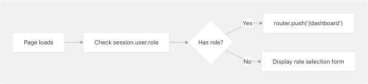
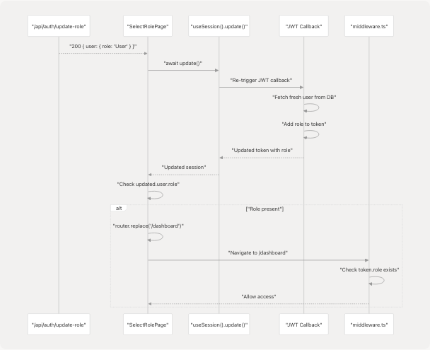

# Role Selection & Management

Relevant source files

* [frontend/app/api/auth/[...nextauth]/route.ts](frontend/app/api/auth/%5B...nextauth%5D/route.ts)
* [frontend/app/api/auth/update-role/route.ts](https://github.com/harleenkaur28/AI-Resume-Parser/blob/b2bbd83d/frontend/app/api/auth/update-role/route.ts)
* [frontend/app/select-role/page.tsx](https://github.com/harleenkaur28/AI-Resume-Parser/blob/b2bbd83d/frontend/app/select-role/page.tsx)
* [frontend/middleware.ts](https://github.com/harleenkaur28/AI-Resume-Parser/blob/b2bbd83d/frontend/middleware.ts)

## Purpose and Scope

This document covers the role selection and management system that assigns users to either the "User" (job seeker) or "Admin" (recruiter) role after authentication. This system ensures that all authenticated users have an assigned role before accessing protected application features.

For information about the authentication flow prior to role selection, see [Login & OAuth](/harleenkaur28/AI-Resume-Parser/4.2.2-login-and-oauth). For details on how middleware enforces role-based access control, see [Middleware & Route Protection](/harleenkaur28/AI-Resume-Parser/4.2.5-middleware-and-route-protection).

---

## System Overview

The role selection system operates as a mandatory post-authentication step for users who have successfully logged in but have not yet been assigned a role. The system prevents access to protected routes until a role is selected and enforces automatic redirects based on role state.

### Role Types

| Role ID (UI) | Role Name (Database) | Description | Access Level |
| --- | --- | --- | --- |
| `user` | `User` | Job seekers using resume analysis, cold mail, hiring assistant | Standard user features |
| `admin` | `Admin` | Recruiters managing candidates, bulk processing, ATS evaluation | Administrative + recruiter features |

**Sources:** [frontend/app/api/auth/update-role/route.ts26-28](https://github.com/harleenkaur28/AI-Resume-Parser/blob/b2bbd83d/frontend/app/api/auth/update-role/route.ts#L26-L28)

---

## Role Selection Flow

**Sources:** [frontend/middleware.ts14-31](https://github.com/harleenkaur28/AI-Resume-Parser/blob/b2bbd83d/frontend/middleware.ts#L14-L31) [frontend/app/select-role/page.tsx26-67](https://github.com/harleenkaur28/AI-Resume-Parser/blob/b2bbd83d/frontend/app/select-role/page.tsx#L26-L67)

---

## Role Selection Page Component

The `/select-role` page is a client component that presents users with a choice between the "User" and "Recruiter" roles.

### Component Structure

The page is implemented in [frontend/app/select-role/page.tsx](https://github.com/harleenkaur28/AI-Resume-Parser/blob/b2bbd83d/frontend/app/select-role/page.tsx) and uses the following key hooks:

* `useSession()` - Accesses and updates the NextAuth session
* `useRouter()` - Handles navigation after role selection
* `useState()` - Manages selected role, loading state, and errors

### Initial Role Check


```

The component automatically redirects users who already have a role assigned:

```
```
useEffect(() => {
    // If user already has a role, redirect to dashboard
    if (session?.user && (session.user as any).role) {
        router.push("/dashboard");
    }
}, [session, router]);
```
```

**Sources:** [frontend/app/select-role/page.tsx26-31](https://github.com/harleenkaur28/AI-Resume-Parser/blob/b2bbd83d/frontend/app/select-role/page.tsx#L26-L31)

### Role Selection UI

The interface presents two radio button options using shadcn/ui components:

| Component | Usage | Props |
| --- | --- | --- |
| `RadioGroup` | Container for role options | `value`, `onValueChange` |
| `RadioGroupItem` | Individual role option | `value="user"` or `value="admin"` |
| `Label` | Role title and description | Associated with radio button |
| `Button` | Submit selection | Disabled when no role selected |

**Sources:** [frontend/app/select-role/page.tsx93-149](https://github.com/harleenkaur28/AI-Resume-Parser/blob/b2bbd83d/frontend/app/select-role/page.tsx#L93-L149)

---

## Role Update API Endpoint

### Request Flow

```

```

**Sources:** [frontend/app/api/auth/update-role/route.ts6-64](https://github.com/harleenkaur28/AI-Resume-Parser/blob/b2bbd83d/frontend/app/api/auth/update-role/route.ts#L6-L64) [frontend/app/select-role/page.tsx43-57](https://github.com/harleenkaur28/AI-Resume-Parser/blob/b2bbd83d/frontend/app/select-role/page.tsx#L43-L57)

### Endpoint Implementation

The API route at [frontend/app/api/auth/update-role/route.ts](https://github.com/harleenkaur28/AI-Resume-Parser/blob/b2bbd83d/frontend/app/api/auth/update-role/route.ts) handles role assignment:

#### Authentication Check

```
```
const session = await getServerSession(authOptions);

if (!session?.user?.email) {
  return NextResponse.json(
    { error: "Unauthorized" },
    { status: 401 }
  );
}
```
```

**Sources:** [frontend/app/api/auth/update-role/route.ts8-15](https://github.com/harleenkaur28/AI-Resume-Parser/blob/b2bbd83d/frontend/app/api/auth/update-role/route.ts#L8-L15)

#### Role ID Mapping

The endpoint maps the frontend role identifiers to database role names:

```
```
// Map incoming roleId to actual Role.name in database
// UI sends "user" or "admin"; in DB we store roles as "User" and "Admin"
const roleName = roleId === "user" ? "User" : "Admin";
```
```

This mapping ensures consistency between the UI convention (lowercase) and the database schema (capitalized).

**Sources:** [frontend/app/api/auth/update-role/route.ts26-28](https://github.com/harleenkaur28/AI-Resume-Parser/blob/b2bbd83d/frontend/app/api/auth/update-role/route.ts#L26-L28)

#### Database Update

```
```
const role = await prisma.role.findUnique({
  where: { name: roleName }
});

const updatedUser = await prisma.user.update({
  where: { email: session.user.email },
  data: { roleId: role.id },
  include: { role: true }
});
```
```

**Sources:** [frontend/app/api/auth/update-role/route.ts29-45](https://github.com/harleenkaur28/AI-Resume-Parser/blob/b2bbd83d/frontend/app/api/auth/update-role/route.ts#L29-L45)

---

## Middleware Enforcement

The middleware at [frontend/middleware.ts](https://github.com/harleenkaur28/AI-Resume-Parser/blob/b2bbd83d/frontend/middleware.ts) enforces role requirements across the application.

### Role State Detection and Redirect Logic

```

```

**Sources:** [frontend/middleware.ts4-34](https://github.com/harleenkaur28/AI-Resume-Parser/blob/b2bbd83d/frontend/middleware.ts#L4-L34)

### Middleware Implementation Details

The middleware uses NextAuth's `withAuth` wrapper and implements two key checks:

#### 1. No Role Redirect

If an authenticated user has no role and is not already on `/select-role`, redirect them:

```
```
if (
  token && 
  !token.role && 
  pathname !== "/select-role" && 
  pathname !== "/auth" && 
  pathname !== "/" &&
  !pathname.startsWith("/api/") &&
  !pathname.startsWith("/_next/") &&
  !pathname.includes(".")
) {
  return NextResponse.redirect(new URL("/select-role", req.url));
}
```
```

**Sources:** [frontend/middleware.ts14-26](https://github.com/harleenkaur28/AI-Resume-Parser/blob/b2bbd83d/frontend/middleware.ts#L14-L26)

#### 2. Has Role Redirect

If a user with a role attempts to access `/select-role`, redirect to dashboard:

```
```
if (token && token.role && pathname === "/select-role") {
  return NextResponse.redirect(new URL("/dashboard", req.url));
}
```
```

This prevents users from re-selecting their role after it has been assigned.

**Sources:** [frontend/middleware.ts28-31](https://github.com/harleenkaur28/AI-Resume-Parser/blob/b2bbd83d/frontend/middleware.ts#L28-L31)

### Authorization Callback

The middleware's authorization callback determines whether a request should proceed:

```
```
authorized: ({ token, req }) => {
  const { pathname } = req.nextUrl;

  // Allow access to public pages
  if (
    pathname === "/" || 
    pathname === "/about" ||
    pathname === "/auth" || 
    pathname.startsWith("/auth/verify-email") ||
    // ... other public paths
  ) {
    return true;
  }

  // For select-role page, require authentication but not role
  if (pathname === "/select-role") {
    return !!token;
  }

  // For protected pages, require authentication and role
  return !!token;
}
```
```

**Sources:** [frontend/middleware.ts36-64](https://github.com/harleenkaur28/AI-Resume-Parser/blob/b2bbd83d/frontend/middleware.ts#L36-L64)

---

## Session Update Mechanism

After the role is assigned via the API, the client must update its NextAuth session to reflect the change.

### Session Update Process

```

```

**Sources:** [frontend/app/select-role/page.tsx51-57](https://github.com/harleenkaur28/AI-Resume-Parser/blob/b2bbd83d/frontend/app/select-role/page.tsx#L51-L57)

### Client-Side Update Code

The role selection handler ensures the session is updated before navigation:

```
```
if (response.ok) {
  // Refresh the session so middleware sees the new role immediately
  const updated = await update();
  // Navigate only after we confirm role is present in session
  if (updated?.user && (updated.user as any).role) {
    router.replace("/dashboard");
  }
}
```
```

The `update()` function triggers NextAuth to re-fetch the session, which in turn triggers the JWT callback to refresh the token with the latest user data including the newly assigned role. The navigation to `/dashboard` only occurs after confirming the role is present in the updated session.

**Sources:** [frontend/app/select-role/page.tsx51-57](https://github.com/harleenkaur28/AI-Resume-Parser/blob/b2bbd83d/frontend/app/select-role/page.tsx#L51-L57)

---

## Data Model Integration

### Database Schema

The role selection system interacts with the following database models:

```

```

### Prisma Queries

The role update endpoint executes two sequential queries:

1. **Find Role by Name:**

   ```
   ```
   await prisma.role.findUnique({
     where: { name: roleName }
   })
   ```
   ```
2. **Update User with Role ID:**

   ```
   ```
   await prisma.user.update({
     where: { email: session.user.email },
     data: { roleId: role.id },
     include: { role: true }
   })
   ```

The `include: { role: true }` ensures the response contains the full role object, not just the role ID.

**Sources:** [frontend/app/api/auth/update-role/route.ts29-45](https://github.com/harleenkaur28/AI-Resume-Parser/blob/b2bbd83d/frontend/app/api/auth/update-role/route.ts#L29-L45)

---

## Error Handling

The system implements error handling at multiple levels:

### API Level Errors

| Status Code | Condition | Response |
| --- | --- | --- |
| 401 | No session or email | `{ error: "Unauthorized" }` |
| 400 | Missing roleId | `{ error: "Role ID is required" }` |
| 400 | Invalid role | `{ error: "Invalid role" }` |
| 500 | Database or server error | `{ error: "Internal server error" }` |

**Sources:** [frontend/app/api/auth/update-role/route.ts10-62](https://github.com/harleenkaur28/AI-Resume-Parser/blob/b2bbd83d/frontend/app/api/auth/update-role/route.ts#L10-L62)

### Client Level Errors

The role selection page handles errors with user feedback:

```
```
try {
  const response = await fetch("/api/auth/update-role", {
    method: "POST",
    headers: { "Content-Type": "application/json" },
    body: JSON.stringify({ roleId: selectedRole }),
  });

  if (response.ok) {
    // Success flow...
  } else {
    const errorData = await response.json();
    setError(errorData.error || "Failed to update role");
  }
} catch (error) {
  setError("Something went wrong. Please try again.");
} finally {
  setIsLoading(false);
}
```
```

**Sources:** [frontend/app/select-role/page.tsx42-66](https://github.com/harleenkaur28/AI-Resume-Parser/blob/b2bbd83d/frontend/app/select-role/page.tsx#L42-L66)

---

## Summary

The role selection system ensures that every authenticated user has an assigned role before accessing protected features. The system combines:

1. **UI Component** (`/select-role` page) - Presents role options with descriptions
2. **API Endpoint** (`/api/auth/update-role`) - Updates the user's role in the database
3. **Middleware** (`middleware.ts`) - Enforces role requirements and automatic redirects
4. **Session Management** - Updates NextAuth session to reflect role changes immediately

The system uses automatic redirects to guide users through the role selection flow and prevents access to protected routes until a role is assigned. The middleware ensures that users with roles cannot re-access the role selection page, maintaining role assignment integrity.

**Sources:** [frontend/app/select-role/page.tsx](https://github.com/harleenkaur28/AI-Resume-Parser/blob/b2bbd83d/frontend/app/select-role/page.tsx) [frontend/app/api/auth/update-role/route.ts](https://github.com/harleenkaur28/AI-Resume-Parser/blob/b2bbd83d/frontend/app/api/auth/update-role/route.ts) [frontend/middleware.ts](https://github.com/harleenkaur28/AI-Resume-Parser/blob/b2bbd83d/frontend/middleware.ts)