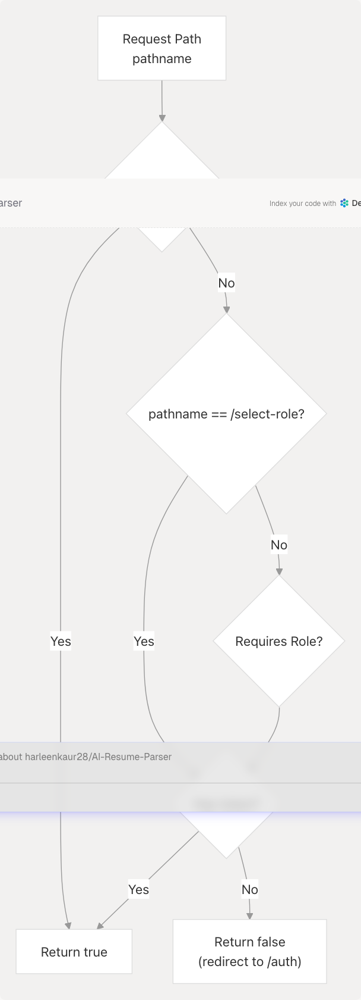
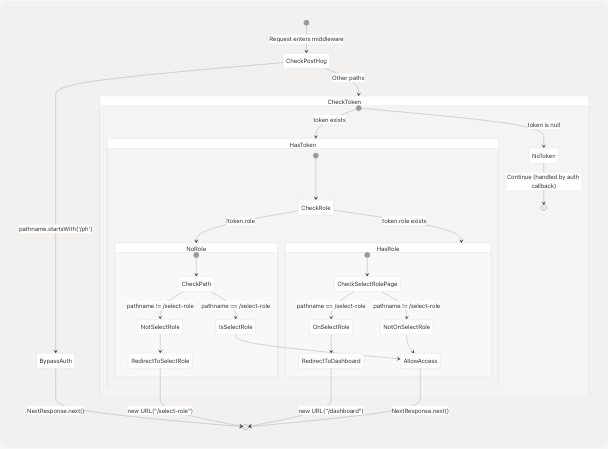
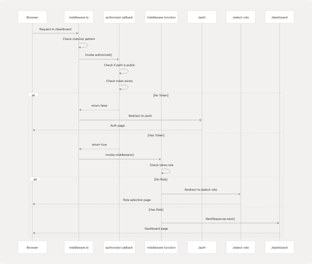

# Middleware & Route Protection

> Source: https://deepwiki.com/harleenkaur28/AI-Resume-Parser/4.2.5-middleware-and-route-protection

# Middleware & Route Protection

Relevant source files

* [frontend/app/api/auth/[...nextauth]/route.ts](frontend/app/api/auth/%5B...nextauth%5D/route.ts)
* [frontend/app/api/auth/update-role/route.ts](https://github.com/harleenkaur28/AI-Resume-Parser/blob/b2bbd83d/frontend/app/api/auth/update-role/route.ts)
* [frontend/app/select-role/page.tsx](https://github.com/harleenkaur28/AI-Resume-Parser/blob/b2bbd83d/frontend/app/select-role/page.tsx)
* [frontend/middleware.ts](https://github.com/harleenkaur28/AI-Resume-Parser/blob/b2bbd83d/frontend/middleware.ts)

## Purpose and Scope

This document covers the Next.js middleware implementation that enforces authentication and role-based access control across the TalentSync application. The middleware intercepts every request to protected routes, validates user authentication status, ensures role assignment, and performs automatic redirects based on user state.

For information about the authentication providers and session management, see [Login & OAuth](/harleenkaur28/AI-Resume-Parser/4.2.2-login-and-oauth). For details on how roles are assigned and updated, see [Role Selection & Management](/harleenkaur28/AI-Resume-Parser/4.2.4-role-selection-and-management).

## Overview

The route protection system is implemented using NextAuth's `withAuth` middleware wrapper, which provides a two-layer authorization mechanism:

1. **Authorization Callback**: Determines whether a request is allowed to proceed based on the token and path
2. **Middleware Function**: Performs additional routing logic and redirects after authorization passes

The middleware enforces a strict state machine where users must be authenticated and have an assigned role before accessing protected features, while allowing public access to landing pages, authentication flows, and static assets.

**Sources**: [frontend/middleware.ts1-74](https://github.com/harleenkaur28/AI-Resume-Parser/blob/b2bbd83d/frontend/middleware.ts#L1-L74)

## Middleware Architecture

The following diagram illustrates how the middleware integrates with NextAuth and the application routing system:


```

**Sources**: [frontend/middleware.ts4-34](https://github.com/harleenkaur28/AI-Resume-Parser/blob/b2bbd83d/frontend/middleware.ts#L4-L34) [frontend/middleware.ts36-66](https://github.com/harleenkaur28/AI-Resume-Parser/blob/b2bbd83d/frontend/middleware.ts#L36-L66)

## Authorization Callback Logic

The `authorized` callback in the `withAuth` configuration determines whether a request should proceed. It receives the NextAuth token and request object, returning `true` to allow access or `false` to trigger an authentication redirect.

### Public Path Whitelist

The following paths are accessible without authentication:

| Path Pattern | Description | Authorization |
| --- | --- | --- |
| `/` | Landing page | Always allowed |
| `/about` | About page | Always allowed |
| `/auth` | Authentication page | Always allowed |
| `/auth/verify-email` | Email verification | Always allowed |
| `/auth/resend-verification` | Resend verification email | Always allowed |
| `/auth/forgot-password` | Password reset request | Always allowed |
| `/auth/reset-password` | Password reset form | Always allowed |
| `/api/*` | API routes | Always allowed (have own auth) |
| `/_next/*` | Next.js internals | Always allowed |
| `/ph/*` | PostHog analytics proxy | Always allowed |
| `*.*` | Static assets (files with extensions) | Always allowed |

### Protected Path Logic

```

```

**Implementation**:

```
```
callbacks: {
  authorized: ({ token, req }) => {
    const { pathname } = req.nextUrl;

    // Public paths
    if (pathname === "/" || pathname === "/about" || ...) {
      return true;
    }

    // Select role page requires auth but not role
    if (pathname === "/select-role") {
      return !!token;
    }

    // Protected pages require authentication
    return !!token;
  },
}
```
```

**Sources**: [frontend/middleware.ts36-66](https://github.com/harleenkaur28/AI-Resume-Parser/blob/b2bbd83d/frontend/middleware.ts#L36-L66)

## Middleware Function Logic

After the authorization callback passes, the main middleware function performs additional validation and routing logic based on the user's role assignment state.

### Role Assignment Enforcement Flow

```

```

### Path Exclusions for Role Check

The middleware excludes certain paths from role enforcement logic to prevent redirect loops and allow necessary functionality:

| Exclusion Pattern | Reason |
| --- | --- |
| `/select-role` | Destination for users without roles |
| `/auth` | Users may be completing auth flow |
| `/` | Public landing page |
| `/api/*` | API routes handled separately |
| `/_next/*` | Next.js framework files |
| `*.*` | Static assets |

**Implementation**:

```
```
function middleware(req) {
  const token = req.nextauth.token;
  const { pathname } = req.nextUrl;

  // Bypass PostHog proxy
  if (pathname.startsWith('/ph')) {
    return NextResponse.next();
  }

  // Authenticated but no role -> force role selection
  if (
    token && 
    !token.role && 
    pathname !== "/select-role" && 
    pathname !== "/auth" && 
    pathname !== "/" &&
    !pathname.startsWith("/api/") &&
    !pathname.startsWith("/_next/") &&
    !pathname.includes(".")
  ) {
    return NextResponse.redirect(new URL("/select-role", req.url));
  }

  // Has role but on select-role page -> redirect to dashboard
  if (token && token.role && pathname === "/select-role") {
    return NextResponse.redirect(new URL("/dashboard", req.url));
  }

  return NextResponse.next();
}
```
```

**Sources**: [frontend/middleware.ts4-34](https://github.com/harleenkaur28/AI-Resume-Parser/blob/b2bbd83d/frontend/middleware.ts#L4-L34)

## Route Protection Patterns

The middleware implements several distinct protection patterns based on route requirements:

### 1. Completely Public Routes

Routes accessible to all users without any authentication:

* Landing page (`/`)
* About page (`/about`)
* Static assets (`*.css`, `*.js`, `*.png`, etc.)

### 2. Auth Flow Routes

Routes needed during authentication that don't require existing sessions:

* Login/Register (`/auth`)
* Email verification (`/auth/verify-email`)
* Password reset (`/auth/forgot-password`, `/auth/reset-password`)

### 3. Auth-Only Routes

Routes requiring authentication but not role assignment:

* Role selection (`/select-role`)

### 4. Protected Dashboard Routes

Routes requiring both authentication and role assignment:

* Main dashboard (`/dashboard`)
* Feature pages (`/dashboard/seeker`, `/dashboard/cold-mail`, etc.)
* Account settings (`/account`)

### Complete Request Flow

```

```

**Sources**: [frontend/middleware.ts1-74](https://github.com/harleenkaur28/AI-Resume-Parser/blob/b2bbd83d/frontend/middleware.ts#L1-L74)

## Role Selection Integration

The middleware works closely with the role selection page to ensure users have assigned roles before accessing protected features.

### Role Selection Page Protection

The `/select-role` page itself is protected by the middleware but with special logic:

1. **Requires authentication**: Users must have a valid token to access this page
2. **Does not require role**: This is the page where users select their role
3. **Automatic redirect if role exists**: Users with existing roles are immediately redirected to dashboard

**Client-Side Protection**:

The role selection page also implements client-side checks using NextAuth's `useSession` hook:

```
```
useEffect(() => {
  // If user already has a role, redirect to dashboard
  if (session?.user && (session.user as any).role) {
    router.push("/dashboard");
  }
}, [session, router]);
```
```

**Sources**: [frontend/app/select-role/page.tsx26-31](https://github.com/harleenkaur28/AI-Resume-Parser/blob/b2bbd83d/frontend/app/select-role/page.tsx#L26-L31)

### Role Update API Interaction

When a user selects a role, the following sequence occurs:

```


**Key Implementation Details**:

1. **Role ID Mapping**: The UI sends `"user"` or `"admin"`, which the API maps to `"User"` and `"Admin"` respectively to match the database schema
2. **Session Update**: After role assignment, the session is refreshed using `update()` to ensure the new role is immediately available in the token
3. **Client-Side Navigation**: The page waits for session confirmation before navigating to prevent middleware rejection

**Sources**: [frontend/app/select-role/page.tsx33-67](https://github.com/harleenkaur28/AI-Resume-Parser/blob/b2bbd83d/frontend/app/select-role/page.tsx#L33-L67) [frontend/app/api/auth/update-role/route.ts1-64](https://github.com/harleenkaur28/AI-Resume-Parser/blob/b2bbd83d/frontend/app/api/auth/update-role/route.ts#L1-L64)

## Matcher Configuration

The middleware uses a Next.js matcher pattern to determine which requests should be processed. The configuration excludes paths that should bypass middleware entirely.

### Matcher Pattern

```
```
export const config = {
  matcher: [
    // Exclude API, next internals, static assets, favicon and PostHog proxy paths
    "/((?!api/auth|_next/static|_next/image|favicon.ico|ph).*)",
  ],
};
```
```

This regex pattern matches all paths **except**:

| Excluded Pattern | Description |
| --- | --- |
| `api/auth` | NextAuth API routes (handle own auth) |
| `_next/static` | Static files bundled by Next.js |
| `_next/image` | Next.js image optimization endpoint |
| `favicon.ico` | Favicon file |
| `ph` | PostHog analytics proxy |

**Why These Exclusions?**

1. **`api/auth`**: NextAuth's own API routes must be accessible during authentication flow
2. **`_next/static` and `_next/image`**: Framework assets shouldn't trigger auth checks
3. **`favicon.ico`**: Browser automatically requests this; no need to process
4. **`ph`**: PostHog proxy needs to be accessible for analytics without auth overhead

**Additional In-Function Bypass**:

The middleware function explicitly checks for PostHog paths as an additional safety measure:

```
```
if (pathname.startsWith('/ph')) {
  return NextResponse.next();
}
```
```

This ensures PostHog analytics continue working even if the matcher pattern is modified.

**Sources**: [frontend/middleware.ts69-74](https://github.com/harleenkaur28/AI-Resume-Parser/blob/b2bbd83d/frontend/middleware.ts#L69-L74) [frontend/middleware.ts9-12](https://github.com/harleenkaur28/AI-Resume-Parser/blob/b2bbd83d/frontend/middleware.ts#L9-L12)

## Error Handling and Edge Cases

The middleware handles several edge cases to prevent redirect loops and ensure smooth user experience:

### Edge Case: Simultaneous Role Check and Navigation

**Problem**: User completes role selection, but middleware hasn't received updated token yet.

**Solution**: The role selection page explicitly waits for session update before navigating:

```
```
if (response.ok) {
  // Refresh the session so middleware sees the new role immediately
  const updated = await update();
  // Navigate only after we confirm role is present in session
  if (updated?.user && (updated.user as any).role) {
    router.replace("/dashboard");
  }
}
```
```

**Sources**: [frontend/app/select-role/page.tsx51-57](https://github.com/harleenkaur28/AI-Resume-Parser/blob/b2bbd83d/frontend/app/select-role/page.tsx#L51-L57)

### Edge Case: Direct URL Access to Select Role

**Problem**: User with existing role bookmarks or directly accesses `/select-role`.

**Solution**: Middleware redirects to dashboard if token has role:

```
```
if (token && token.role && pathname === "/select-role") {
  return NextResponse.redirect(new URL("/dashboard", req.url));
}
```
```

**Sources**: [frontend/middleware.ts28-31](https://github.com/harleenkaur28/AI-Resume-Parser/blob/b2bbd83d/frontend/middleware.ts#L28-L31)

### Edge Case: New Registration Without Role

**Problem**: User completes registration but hasn't selected a role yet.

**Solution**: Authorization callback allows `/select-role` access with token only (no role required), and middleware redirects all other protected paths to role selection.

## Security Considerations

The middleware implements several security best practices:

### 1. Token-Based Authorization

All authorization decisions are based on the NextAuth JWT token, which is cryptographically signed and cannot be forged by clients.

### 2. Server-Side Enforcement

Middleware runs on the server (Edge Runtime), preventing client-side bypass. Even if a user manipulates browser state, the server validates every request.

### 3. Granular Path Control

Different protection levels (public, auth-only, auth+role) ensure users can only access features appropriate to their authentication state.

### 4. API Route Independence

API routes (except `/api/auth`) are excluded from middleware, allowing them to implement their own authorization logic. For example, `/api/auth/update-role` checks session server-side:

```
```
const session = await getServerSession(authOptions);

if (!session?.user?.email) {
  return NextResponse.json(
    { error: "Unauthorized" },
    { status: 401 }
  );
}
```
```

**Sources**: [frontend/app/api/auth/update-role/route.ts8-15](https://github.com/harleenkaur28/AI-Resume-Parser/blob/b2bbd83d/frontend/app/api/auth/update-role/route.ts#L8-L15)

### 5. Redirect Safety

All redirects use `new URL(..., req.url)` to preserve the original request's origin, preventing open redirect vulnerabilities.

## Integration with NextAuth

The middleware tightly integrates with NextAuth's authentication system:

### Token Structure

The middleware accesses token properties through `req.nextauth.token`:

| Property | Type | Usage |
| --- | --- | --- |
| `token` | `JWT | null` | Overall token presence (authentication check) |
| `token.role` | `string | undefined` | User's assigned role (role requirement check) |
| `token.email` | `string` | User identifier (used in API routes) |

### Session Synchronization

Changes to user data (like role assignment) are reflected in the token through NextAuth's JWT callback, which runs on every request:

```
```
// In authOptions
callbacks: {
  async jwt({ token, user, trigger }) {
    if (trigger === "update" || user) {
      // Fetch latest user data including role
      const dbUser = await prisma.user.findUnique({
        where: { email: token.email },
        include: { role: true }
      });
      token.role = dbUser?.role?.name;
    }
    return token;
  }
}
```
```

This ensures the middleware always has access to the user's current role.

**Sources**: Referenced from authentication system context

## Summary

The middleware and route protection system implements a three-stage security model:

1. **Matcher Exclusion**: Filters out paths that should never be processed
2. **Authorization Callback**: Validates authentication and determines public vs. protected access
3. **Middleware Function**: Enforces role assignment and handles state-based redirects

This layered approach ensures that:

* Public content remains accessible
* Authentication is required for protected features
* Users complete role selection before accessing the dashboard
* No redirect loops occur during authentication flows
* Session state is synchronized with database state

The system seamlessly integrates with NextAuth, the role selection flow, and API route authorization to provide comprehensive access control across the application.