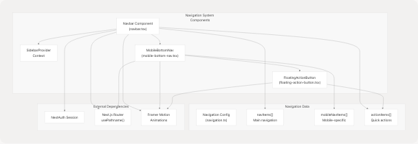
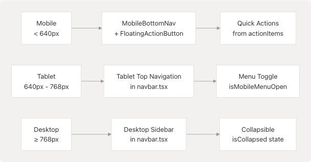
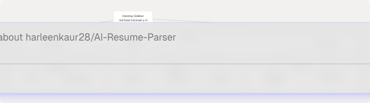
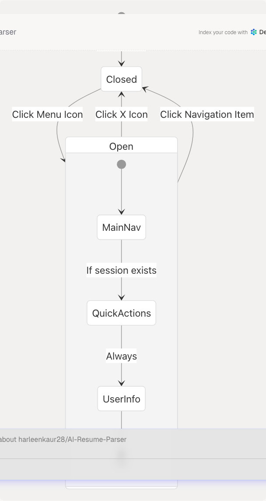
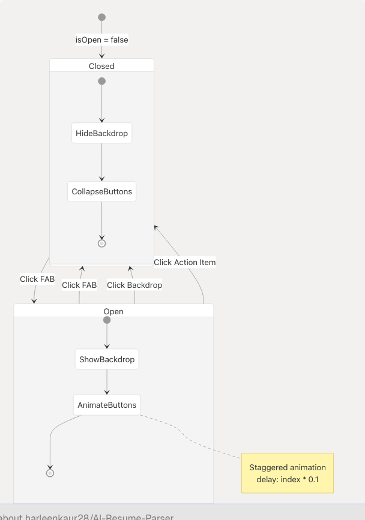
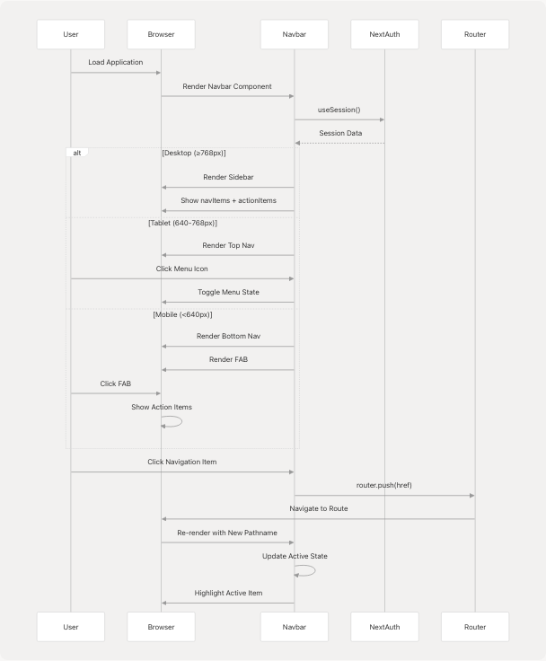

# Navigation System

> Source: https://deepwiki.com/harleenkaur28/AI-Resume-Parser/4.3-navigation-system

# Navigation System

Relevant source files

* [frontend/components/example-action-pages.tsx](https://github.com/harleenkaur28/AI-Resume-Parser/blob/b2bbd83d/frontend/components/example-action-pages.tsx)
* [frontend/components/floating-action-button.tsx](https://github.com/harleenkaur28/AI-Resume-Parser/blob/b2bbd83d/frontend/components/floating-action-button.tsx)
* [frontend/components/mobile-bottom-nav.tsx](https://github.com/harleenkaur28/AI-Resume-Parser/blob/b2bbd83d/frontend/components/mobile-bottom-nav.tsx)
* [frontend/components/navbar.tsx](https://github.com/harleenkaur28/AI-Resume-Parser/blob/b2bbd83d/frontend/components/navbar.tsx)
* [frontend/components/ui/modern-mobile-menu.css](https://github.com/harleenkaur28/AI-Resume-Parser/blob/b2bbd83d/frontend/components/ui/modern-mobile-menu.css)
* [frontend/components/ui/modern-mobile-menu.tsx](https://github.com/harleenkaur28/AI-Resume-Parser/blob/b2bbd83d/frontend/components/ui/modern-mobile-menu.tsx)
* [frontend/lib/navigation.ts](https://github.com/harleenkaur28/AI-Resume-Parser/blob/b2bbd83d/frontend/lib/navigation.ts)

## Purpose and Scope

This document describes the responsive navigation system in TalentSync's frontend application. The system provides three distinct navigation interfaces optimized for different screen sizes: a collapsible sidebar for desktop, a top navigation bar for tablets, and a bottom navigation bar with floating action button (FAB) for mobile devices. The system integrates with NextAuth for session management and displays role-appropriate navigation options.

For authentication-related routing and middleware protection, see [Middleware & Route Protection](/harleenkaur28/AI-Resume-Parser/4.2.5-middleware-and-route-protection). For information about dashboard layout and page organization, see [Dashboard Pages](/harleenkaur28/AI-Resume-Parser/4.5-dashboard-pages).

---

## Navigation Architecture Overview

The navigation system consists of four primary components that work together to provide a seamless experience across device sizes:


```

**Sources:** [frontend/components/navbar.tsx1-397](https://github.com/harleenkaur28/AI-Resume-Parser/blob/b2bbd83d/frontend/components/navbar.tsx#L1-L397) [frontend/components/mobile-bottom-nav.tsx1-209](https://github.com/harleenkaur28/AI-Resume-Parser/blob/b2bbd83d/frontend/components/mobile-bottom-nav.tsx#L1-L209) [frontend/components/floating-action-button.tsx1-109](https://github.com/harleenkaur28/AI-Resume-Parser/blob/b2bbd83d/frontend/components/floating-action-button.tsx#L1-L109) [frontend/lib/navigation.ts1-109](https://github.com/harleenkaur28/AI-Resume-Parser/blob/b2bbd83d/frontend/lib/navigation.ts#L1-L109)

---

## Responsive Breakpoint Strategy

The navigation system adapts to three distinct viewport ranges using Tailwind CSS breakpoints:

| Device Type | Screen Size | Navigation Mode | Component Visibility |
| --- | --- | --- | --- |
| Mobile | < 640px (sm) | Bottom Navigation + FAB | `MobileBottomNav` visible, sidebar/top nav hidden |
| Tablet | 640px - 768px (sm to md) | Top Navigation Bar | Top nav visible, sidebar/bottom nav hidden |
| Desktop | ≥ 768px (md+) | Collapsible Sidebar | Sidebar visible, tablet/mobile nav hidden |

```

```

**Sources:** [frontend/components/navbar.tsx40-47](https://github.com/harleenkaur28/AI-Resume-Parser/blob/b2bbd83d/frontend/components/navbar.tsx#L40-L47) [frontend/components/navbar.tsx238-242](https://github.com/harleenkaur28/AI-Resume-Parser/blob/b2bbd83d/frontend/components/navbar.tsx#L238-L242) [frontend/components/mobile-bottom-nav.tsx55-63](https://github.com/harleenkaur28/AI-Resume-Parser/blob/b2bbd83d/frontend/components/mobile-bottom-nav.tsx#L55-L63)

---

## Desktop Sidebar Navigation

### Component Structure

The desktop sidebar is implemented in the `Navbar` component and is visible on screens ≥768px. It uses the `useSidebar()` hook from `SidebarProvider` to manage collapse state.

```

```

**Sources:** [frontend/components/navbar.tsx40-236](https://github.com/harleenkaur28/AI-Resume-Parser/blob/b2bbd83d/frontend/components/navbar.tsx#L40-L236) [frontend/components/navbar.tsx77-143](https://github.com/harleenkaur28/AI-Resume-Parser/blob/b2bbd83d/frontend/components/navbar.tsx#L77-L143) [frontend/components/navbar.tsx145-234](https://github.com/harleenkaur28/AI-Resume-Parser/blob/b2bbd83d/frontend/components/navbar.tsx#L145-L234)

### Collapse Functionality

The sidebar can be collapsed to a minimal 64px width, showing only icons:

| State | Width | Content Display |
| --- | --- | --- |
| Expanded (`isCollapsed = false`) | 288px (`w-72`) | Icons + labels + descriptions |
| Collapsed (`isCollapsed = true`) | 64px (`w-16`) | Icons only with tooltips |

The collapse state is managed by the `SidebarProvider` context and toggled via the `ChevronLeft`/`ChevronRight` button:

[frontend/components/navbar.tsx62-74](https://github.com/harleenkaur28/AI-Resume-Parser/blob/b2bbd83d/frontend/components/navbar.tsx#L62-L74)

### Active Route Highlighting

Active routes are determined by comparing `pathname` from `usePathname()` with each navigation item's `href`:

[frontend/components/navbar.tsx81-98](https://github.com/harleenkaur28/AI-Resume-Parser/blob/b2bbd83d/frontend/components/navbar.tsx#L81-L98)

Active items receive the class `text-[#76ABAE] bg-[#76ABAE]/10` while inactive items use `text-[#EEEEEE]/80`.

**Sources:** [frontend/components/navbar.tsx41-47](https://github.com/harleenkaur28/AI-Resume-Parser/blob/b2bbd83d/frontend/components/navbar.tsx#L41-L47) [frontend/components/navbar.tsx51-74](https://github.com/harleenkaur28/AI-Resume-Parser/blob/b2bbd83d/frontend/components/navbar.tsx#L51-L74) [frontend/components/navbar.tsx77-100](https://github.com/harleenkaur28/AI-Resume-Parser/blob/b2bbd83d/frontend/components/navbar.tsx#L77-L100)

---

## Tablet Navigation

The tablet navigation displays a fixed top bar with a hamburger menu for screens between 640px and 768px:

```

```

### Menu Structure

The expandable menu contains:

1. **Main Navigation Items** - Mapped from `navItems` array
2. **Quick Actions Section** - Displayed only for authenticated users from `actionItems`
3. **User Section** - Profile info, Dashboard link, and Sign Out button (authenticated) or Sign In/Get Started buttons (unauthenticated)

[frontend/components/navbar.tsx264-388](https://github.com/harleenkaur28/AI-Resume-Parser/blob/b2bbd83d/frontend/components/navbar.tsx#L264-L388)

### Toggle State Management

The menu toggle state is managed by local component state:

[frontend/components/navbar.tsx30](https://github.com/harleenkaur28/AI-Resume-Parser/blob/b2bbd83d/frontend/components/navbar.tsx#L30-L30)
[frontend/components/navbar.tsx251-260](https://github.com/harleenkaur28/AI-Resume-Parser/blob/b2bbd83d/frontend/components/navbar.tsx#L251-L260)

**Sources:** [frontend/components/navbar.tsx238-391](https://github.com/harleenkaur28/AI-Resume-Parser/blob/b2bbd83d/frontend/components/navbar.tsx#L238-L391) [frontend/components/navbar.tsx264-330](https://github.com/harleenkaur28/AI-Resume-Parser/blob/b2bbd83d/frontend/components/navbar.tsx#L264-L330)

---

## Mobile Bottom Navigation

### Architecture

The mobile bottom navigation consists of two integrated components:

```

```

**Sources:** [frontend/components/mobile-bottom-nav.tsx1-209](https://github.com/harleenkaur28/AI-Resume-Parser/blob/b2bbd83d/frontend/components/mobile-bottom-nav.tsx#L1-L209) [frontend/components/floating-action-button.tsx1-109](https://github.com/harleenkaur28/AI-Resume-Parser/blob/b2bbd83d/frontend/components/floating-action-button.tsx#L1-L109)

### Mobile Navigation Items

Mobile navigation uses a separate configuration optimized for mobile UX:

[frontend/lib/navigation.ts48-69](https://github.com/harleenkaur28/AI-Resume-Parser/blob/b2bbd83d/frontend/lib/navigation.ts#L48-L69)

The items are split to accommodate the centered FAB:

* **Left side**: Home, Dashboard
* **Spacer**: 80px for FAB
* **Right side**: Account, Seeker

[frontend/components/mobile-bottom-nav.tsx139-176](https://github.com/harleenkaur28/AI-Resume-Parser/blob/b2bbd83d/frontend/components/mobile-bottom-nav.tsx#L139-L176)

### Active Route Detection

The mobile navigation determines the active item by matching the current pathname:

[frontend/components/mobile-bottom-nav.tsx31-38](https://github.com/harleenkaur28/AI-Resume-Parser/blob/b2bbd83d/frontend/components/mobile-bottom-nav.tsx#L31-L38)

**Sources:** [frontend/components/mobile-bottom-nav.tsx23-63](https://github.com/harleenkaur28/AI-Resume-Parser/blob/b2bbd83d/frontend/components/mobile-bottom-nav.tsx#L23-L63) [frontend/components/mobile-bottom-nav.tsx139-206](https://github.com/harleenkaur28/AI-Resume-Parser/blob/b2bbd83d/frontend/components/mobile-bottom-nav.tsx#L139-L206)

---

## Floating Action Button (FAB)

### Component Behavior

The FAB provides quick access to primary actions through an expandable radial menu:

```

```

### Action Items Display

When opened, the FAB displays all items from `actionItems` in a vertical stack:

[frontend/components/floating-action-button.tsx32-76](https://github.com/harleenkaur28/AI-Resume-Parser/blob/b2bbd83d/frontend/components/floating-action-button.tsx#L32-L76)

Each action button includes:

* **Label**: Displayed to the left in a tooltip-style bubble
* **Icon**: Rendered in a circular button with `#76ABAE` background
* **Animation**: Staggered scale and fade-in animation

### Navigation Integration

On action selection, the FAB closes and navigates to the target route:

[frontend/components/floating-action-button.tsx21-24](https://github.com/harleenkaur28/AI-Resume-Parser/blob/b2bbd83d/frontend/components/floating-action-button.tsx#L21-L24)

**Sources:** [frontend/components/floating-action-button.tsx1-109](https://github.com/harleenkaur28/AI-Resume-Parser/blob/b2bbd83d/frontend/components/floating-action-button.tsx#L1-L109) [frontend/components/floating-action-button.tsx32-91](https://github.com/harleenkaur28/AI-Resume-Parser/blob/b2bbd83d/frontend/components/floating-action-button.tsx#L32-L91)

---

## Navigation Configuration

### Data Structure

All navigation items are defined in a centralized configuration file:

```

```

### NavItem Interface

[frontend/lib/navigation.ts15-19](https://github.com/harleenkaur28/AI-Resume-Parser/blob/b2bbd83d/frontend/lib/navigation.ts#L15-L19)

### ActionItem Interface

[frontend/lib/navigation.ts21-23](https://github.com/harleenkaur28/AI-Resume-Parser/blob/b2bbd83d/frontend/lib/navigation.ts#L21-L23)

### Main Navigation Items

[frontend/lib/navigation.ts25-46](https://github.com/harleenkaur28/AI-Resume-Parser/blob/b2bbd83d/frontend/lib/navigation.ts#L25-L46)

These items appear in the desktop sidebar and tablet navigation.

### Action Items

[frontend/lib/navigation.ts71-108](https://github.com/harleenkaur28/AI-Resume-Parser/blob/b2bbd83d/frontend/lib/navigation.ts#L71-L108)

Action items appear in:

1. Desktop sidebar "Quick Actions" section (when authenticated)
2. Tablet navigation menu (when authenticated)
3. Mobile FAB menu
4. Desktop FAB menu (if implemented)

**Sources:** [frontend/lib/navigation.ts1-109](https://github.com/harleenkaur28/AI-Resume-Parser/blob/b2bbd83d/frontend/lib/navigation.ts#L1-L109) [frontend/lib/navigation.ts15-23](https://github.com/harleenkaur28/AI-Resume-Parser/blob/b2bbd83d/frontend/lib/navigation.ts#L15-L23) [frontend/lib/navigation.ts25-108](https://github.com/harleenkaur28/AI-Resume-Parser/blob/b2bbd83d/frontend/lib/navigation.ts#L25-L108)

---

## Session-Based Navigation

### Authentication State Detection

All navigation components use NextAuth's `useSession()` hook to determine authentication state:

[frontend/components/navbar.tsx32](https://github.com/harleenkaur28/AI-Resume-Parser/blob/b2bbd83d/frontend/components/navbar.tsx#L32-L32)

### Conditional Rendering

The navigation system adapts based on authentication status:

| Section | Authenticated | Unauthenticated |
| --- | --- | --- |
| Quick Actions | Visible | Hidden |
| User Profile | Visible with Avatar, Name, Role | Hidden |
| Dashboard Link | Visible | Hidden |
| Sign Out Button | Visible | Hidden |
| Sign In Button | Hidden | Visible |
| Get Started Button | Hidden | Visible |

### Role-Based Display

User roles are displayed in the sidebar user section:

[frontend/components/navbar.tsx172-175](https://github.com/harleenkaur28/AI-Resume-Parser/blob/b2bbd83d/frontend/components/navbar.tsx#L172-L175)

The role mapping converts `"Admin"` to `"Recruiter"` for display purposes.

**Sources:** [frontend/components/navbar.tsx32-36](https://github.com/harleenkaur28/AI-Resume-Parser/blob/b2bbd83d/frontend/components/navbar.tsx#L32-L36) [frontend/components/navbar.tsx103-142](https://github.com/harleenkaur28/AI-Resume-Parser/blob/b2bbd83d/frontend/components/navbar.tsx#L103-L142) [frontend/components/navbar.tsx147-234](https://github.com/harleenkaur28/AI-Resume-Parser/blob/b2bbd83d/frontend/components/navbar.tsx#L147-L234)

---

## Component Integration Pattern

### Import and Usage

The navigation system is integrated into the application layout through the `Navbar` component:

```
```
import { Navbar } from "@/components/navbar";

export default function Layout({ children }) {
  return (
    <>
      <Navbar />
      <main>{children}</main>
    </>
  );
}
```
```

The `Navbar` component internally manages all navigation modes:

[frontend/components/navbar.tsx38-396](https://github.com/harleenkaur28/AI-Resume-Parser/blob/b2bbd83d/frontend/components/navbar.tsx#L38-L396)

### Sidebar Provider Context

The desktop sidebar uses a context provider for collapse state management:

[frontend/components/navbar.tsx23](https://github.com/harleenkaur28/AI-Resume-Parser/blob/b2bbd83d/frontend/components/navbar.tsx#L23-L23)
[frontend/components/navbar.tsx31](https://github.com/harleenkaur28/AI-Resume-Parser/blob/b2bbd83d/frontend/components/navbar.tsx#L31-L31)

This allows the collapse state to be shared across components if needed.

### Animation System

All navigation components use Framer Motion for smooth transitions:

[frontend/components/navbar.tsx5](https://github.com/harleenkaur28/AI-Resume-Parser/blob/b2bbd83d/frontend/components/navbar.tsx#L5-L5)
[frontend/components/navbar.tsx41-47](https://github.com/harleenkaur28/AI-Resume-Parser/blob/b2bbd83d/frontend/components/navbar.tsx#L41-L47)
[frontend/components/navbar.tsx239-242](https://github.com/harleenkaur28/AI-Resume-Parser/blob/b2bbd83d/frontend/components/navbar.tsx#L239-L242)

**Sources:** [frontend/components/navbar.tsx1-28](https://github.com/harleenkaur28/AI-Resume-Parser/blob/b2bbd83d/frontend/components/navbar.tsx#L1-L28) [frontend/components/navbar.tsx28-397](https://github.com/harleenkaur28/AI-Resume-Parser/blob/b2bbd83d/frontend/components/navbar.tsx#L28-L397) [frontend/components/sidebar-provider.tsx](https://github.com/harleenkaur28/AI-Resume-Parser/blob/b2bbd83d/frontend/components/sidebar-provider.tsx) (referenced but not provided)

---

## Styling and Theming

### Color Scheme

The navigation system uses a consistent color palette:

| Element | Color | Usage |
| --- | --- | --- |
| Primary Accent | `#76ABAE` | Active states, hover effects, FAB background |
| Background | `black/20` with `backdrop-blur-xl` | Glassmorphic effect |
| Text Primary | `#EEEEEE` | Main text color |
| Text Secondary | `#EEEEEE/70` or `#EEEEEE/80` | Inactive items |
| Border | `white/10` | Dividers and borders |

### CSS Modules

The mobile menu uses a dedicated CSS file for advanced animations:

[frontend/components/ui/modern-mobile-menu.css1-163](https://github.com/harleenkaur28/AI-Resume-Parser/blob/b2bbd83d/frontend/components/ui/modern-mobile-menu.css#L1-L163)

Key animations include:

* Active item elevation: `translateY(-4px)`
* Ripple effect on tap
* Slide-up animation on mount
* Text underline with dynamic width

**Sources:** [frontend/components/navbar.tsx44-49](https://github.com/harleenkaur28/AI-Resume-Parser/blob/b2bbd83d/frontend/components/navbar.tsx#L44-L49) [frontend/components/ui/modern-mobile-menu.css1-163](https://github.com/harleenkaur28/AI-Resume-Parser/blob/b2bbd83d/frontend/components/ui/modern-mobile-menu.css#L1-L163) [frontend/components/floating-action-button.tsx67](https://github.com/harleenkaur28/AI-Resume-Parser/blob/b2bbd83d/frontend/components/floating-action-button.tsx#L67-L67)

---

## Navigation Flow Diagram

```


**Sources:** [frontend/components/navbar.tsx28-397](https://github.com/harleenkaur28/AI-Resume-Parser/blob/b2bbd83d/frontend/components/navbar.tsx#L28-L397) [frontend/components/mobile-bottom-nav.tsx23-63](https://github.com/harleenkaur28/AI-Resume-Parser/blob/b2bbd83d/frontend/components/mobile-bottom-nav.tsx#L23-L63) [frontend/components/floating-action-button.tsx11-106](https://github.com/harleenkaur28/AI-Resume-Parser/blob/b2bbd83d/frontend/components/floating-action-button.tsx#L11-L106)