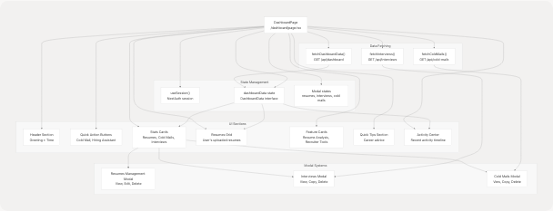

# Dashboard Pages

> Source: https://deepwiki.com/harleenkaur28/AI-Resume-Parser/4.5-dashboard-pages

# Dashboard Pages

Relevant source files

* [frontend/app/dashboard/page.tsx](https://github.com/harleenkaur28/AI-Resume-Parser/blob/b2bbd83d/frontend/app/dashboard/page.tsx)
* [frontend/app/dashboard/seeker/page.tsx](https://github.com/harleenkaur28/AI-Resume-Parser/blob/b2bbd83d/frontend/app/dashboard/seeker/page.tsx)
* [frontend/app/dashboard/tips/page.tsx](https://github.com/harleenkaur28/AI-Resume-Parser/blob/b2bbd83d/frontend/app/dashboard/tips/page.tsx)
* [frontend/components/file-upload.tsx](https://github.com/harleenkaur28/AI-Resume-Parser/blob/b2bbd83d/frontend/components/file-upload.tsx)
* [frontend/components/ui/loader.tsx](https://github.com/harleenkaur28/AI-Resume-Parser/blob/b2bbd83d/frontend/components/ui/loader.tsx)

## Purpose and Scope

This document provides an overview of the dashboard system within the TalentSync frontend application. It covers the organization of dashboard pages, shared patterns, data flow between features, and component architecture. The dashboard serves as the central hub for both job seekers and recruiters to access AI-powered career tools.

For specific implementation details of individual dashboard features, see:

* Main Dashboard implementation: [4.5.1](/harleenkaur28/AI-Resume-Parser/4.5.1-main-dashboard)
* Resume Upload & Analysis: [4.5.2](/harleenkaur28/AI-Resume-Parser/4.5.2-resume-upload-and-analysis)
* Detailed Analysis View: [4.5.3](/harleenkaur28/AI-Resume-Parser/4.5.3-detailed-analysis-view)
* Cold Mail Generator: [4.5.4](/harleenkaur28/AI-Resume-Parser/4.5.4-cold-mail-generator)
* Hiring Assistant: [4.5.5](/harleenkaur28/AI-Resume-Parser/4.5.5-hiring-assistant)
* LinkedIn Post Generator: [4.5.6](/harleenkaur28/AI-Resume-Parser/4.5.6-linkedin-post-generator)

For authentication and access control, see [4.2](/harleenkaur28/AI-Resume-Parser/4.2-authentication-system). For navigation components, see [4.3](/harleenkaur28/AI-Resume-Parser/4.3-navigation-system).

---

## Dashboard Architecture Overview

The dashboard follows a hub-and-spoke pattern where the main dashboard (`/dashboard`) acts as the central navigation point to specialized feature pages. All dashboard pages share common visual styling, loading patterns, and state management strategies.

### Dashboard Route Structure

The dashboard is organized under the `/dashboard` route with the following structure:

| Route | Purpose | Primary Component |
| --- | --- | --- |
| `/dashboard` | Main dashboard hub | `frontend/app/dashboard/page.tsx` |
| `/dashboard/seeker` | Resume upload interface | `frontend/app/dashboard/seeker/page.tsx` |
| `/dashboard/analysis/[id]` | Detailed resume analysis | Covered in [4.5.3](/harleenkaur28/AI-Resume-Parser/4.5.3-detailed-analysis-view) |
| `/dashboard/cold-mail` | Cold email generation | Covered in [4.5.4](/harleenkaur28/AI-Resume-Parser/4.5.4-cold-mail-generator) |
| `/dashboard/hiring-assistant` | Interview preparation | Covered in [4.5.5](/harleenkaur28/AI-Resume-Parser/4.5.5-hiring-assistant) |
| `/dashboard/linkedin-posts` | LinkedIn content generation | Covered in [4.5.6](/harleenkaur28/AI-Resume-Parser/4.5.6-linkedin-post-generator) |
| `/dashboard/tips` | Career tips and advice | `frontend/app/dashboard/tips/page.tsx` |
| `/dashboard/ats` | ATS evaluation | Covered in recruiter features |
| `/dashboard/recruiter` | Recruiter dashboard | Covered in recruiter features |

**Sources:** [frontend/app/dashboard/page.tsx1-2325](https://github.com/harleenkaur28/AI-Resume-Parser/blob/b2bbd83d/frontend/app/dashboard/page.tsx#L1-L2325)

---

## Main Dashboard Hub Architecture

The main dashboard page at `/dashboard` serves as the primary entry point and navigation hub. It displays user statistics, recent activity, and provides quick access to all features.

### Dashboard Page Component Structure


```

**Sources:** [frontend/app/dashboard/page.tsx109-1051](https://github.com/harleenkaur28/AI-Resume-Parser/blob/b2bbd83d/frontend/app/dashboard/page.tsx#L109-L1051)

---

## Dashboard Data Interfaces

The main dashboard uses TypeScript interfaces to define the structure of data fetched from the backend.

### DashboardData Interface

```
```
interface DashboardData {
  user: {
    name: string;
    email: string;
    image?: string;
  };
  stats: {
    totalResumes: number;
    totalColdMails: number;
    totalInterviews: number;
  };
  recentActivity: Array<{
    id: string;
    type: "resume" | "cold_mail" | "interview";
    title: string;
    description: string;
    date: string;
  }>;
  resumes: Array<{
    id: string;
    customName: string;
    uploadDate: string;
    predictedField?: string;
    candidateName?: string;
  }>;
}
```
```

**Sources:** [frontend/app/dashboard/page.tsx57-82](https://github.com/harleenkaur28/AI-Resume-Parser/blob/b2bbd83d/frontend/app/dashboard/page.tsx#L57-L82)

### Session Management Interfaces

Additional interfaces for viewing and managing user-generated content:

| Interface | Purpose | Key Fields |
| --- | --- | --- |
| `InterviewSession` | Interview preparation sessions | `role`, `companyName`, `questionsAndAnswers` |
| `ColdMailSession` | Cold mail generation sessions | `recipientName`, `companyName`, `emails` |

**Sources:** [frontend/app/dashboard/page.tsx84-107](https://github.com/harleenkaur28/AI-Resume-Parser/blob/b2bbd83d/frontend/app/dashboard/page.tsx#L84-L107)

---

## Resume Upload and Analysis Flow

The seeker dashboard page (`/dashboard/seeker`) provides the primary interface for uploading and analyzing resumes. It uses the `FileUpload` component as its core functionality.

### Seeker Dashboard Page Structure

```

```

**Sources:** [frontend/app/dashboard/seeker/page.tsx20-196](https://github.com/harleenkaur28/AI-Resume-Parser/blob/b2bbd83d/frontend/app/dashboard/seeker/page.tsx#L20-L196) [frontend/components/file-upload.tsx64-467](https://github.com/harleenkaur28/AI-Resume-Parser/blob/b2bbd83d/frontend/components/file-upload.tsx#L64-L467)

### FileUpload Component API

The `FileUpload` component is the primary interface for resume analysis:

| Prop | Type | Description |
| --- | --- | --- |
| `onUploadSuccess` | `() => void | undefined` | Optional callback triggered after successful upload |

**Component Methods:**

* `onDrop(acceptedFiles)` - Handles file drop events from react-dropzone
* `handleUpload()` - Uploads file and triggers analysis via `/api/analysis`
* `handleDetailedAnalysis()` - Navigates to full analysis page using `resumeId`
* `handleGetTips()` - Navigates to tips page with job category and skills
* `handleColdMailGenerator()` - Stores analysis data in localStorage and navigates
* `handleHiringAssistant()` - Stores analysis data in localStorage and navigates

**Sources:** [frontend/components/file-upload.tsx60-467](https://github.com/harleenkaur28/AI-Resume-Parser/blob/b2bbd83d/frontend/components/file-upload.tsx#L60-L467)

---

## Data Flow Between Dashboard Features

Dashboard features share data through multiple mechanisms to provide a seamless user experience. The primary pattern is localStorage-based data transfer for analysis results.

### Cross-Feature Data Sharing Pattern

```


**Sources:** [frontend/components/file-upload.tsx154-192](https://github.com/harleenkaur28/AI-Resume-Parser/blob/b2bbd83d/frontend/components/file-upload.tsx#L154-L192)

### localStorage Data Structure

The following data is stored in localStorage for cross-feature sharing:

| Key | Data Structure | Purpose |
| --- | --- | --- |
| `resumeFile` | `{name, size, type, lastModified}` | File metadata for reference |
| `analysisData` | Full `analysis` object from API | Resume analysis data including skills, experience, projects |

**Data Stored in `analysisData`:**

```
```
{
  id: string;
  name: string;
  email: string;
  contact?: string;
  predictedField: string;
  skillsAnalysis: Array<{skill_name, percentage}>;
  recommendedRoles: string[];
  languages: Array<{language}>;
  education: Array<{education_detail}>;
  workExperience: Array<{role, company_and_duration, bullet_points}>;
  projects: Array<{title, technologies_used, description}>;
  uploadedAt: string;
}
```
```

**Sources:** [frontend/components/file-upload.tsx22-58](https://github.com/harleenkaur28/AI-Resume-Parser/blob/b2bbd83d/frontend/components/file-upload.tsx#L22-L58) [frontend/components/file-upload.tsx154-192](https://github.com/harleenkaur28/AI-Resume-Parser/blob/b2bbd83d/frontend/components/file-upload.tsx#L154-L192)

---

## Modal Systems for Data Management

The main dashboard implements three modal systems for viewing and managing user data: resumes, interviews, and cold mails. Each modal provides CRUD operations and detailed views.

### Resumes Management Modal

Located in the main dashboard, this modal allows users to view all resumes, rename them, and delete them.

**Key Features:**

* Full list of uploaded resumes with metadata
* Inline editing of `customName`
* Delete confirmation dialog
* Quick navigation to analysis page
* CRUD operations via API endpoints

**API Operations:**

| Operation | Method | Endpoint | Handler |
| --- | --- | --- | --- |
| Rename | PATCH | `/api/resumes?id={resumeId}` | `handleRenameResume()` |
| Delete | DELETE | `/api/resumes?id={resumeId}` | `handleDeleteResume()` |

**Sources:** [frontend/app/dashboard/page.tsx260-377](https://github.com/harleenkaur28/AI-Resume-Parser/blob/b2bbd83d/frontend/app/dashboard/page.tsx#L260-L377) [frontend/app/dashboard/page.tsx1056-1234](https://github.com/harleenkaur28/AI-Resume-Parser/blob/b2bbd83d/frontend/app/dashboard/page.tsx#L1056-L1234)

### Interviews Modal

Displays all interview preparation sessions with full question-answer pairs.

**Features:**

* List of interview sessions grouped by role and company
* Expandable Q&A sections
* Copy individual answers to clipboard
* Delete session functionality
* Lazy loading (fetched only when modal opens)

**State Management:**

```
```
const [showInterviewsModal, setShowInterviewsModal] = useState(false);
const [interviewsData, setInterviewsData] = useState<InterviewSession[]>([]);
const [isLoadingInterviews, setIsLoadingInterviews] = useState(false);
```
```

**Sources:** [frontend/app/dashboard/page.tsx128-138](https://github.com/harleenkaur28/AI-Resume-Parser/blob/b2bbd83d/frontend/app/dashboard/page.tsx#L128-L138) [frontend/app/dashboard/page.tsx174-200](https://github.com/harleenkaur28/AI-Resume-Parser/blob/b2bbd83d/frontend/app/dashboard/page.tsx#L174-L200) [frontend/app/dashboard/page.tsx1235-1473](https://github.com/harleenkaur28/AI-Resume-Parser/blob/b2bbd83d/frontend/app/dashboard/page.tsx#L1235-L1473)

### Cold Mails Modal

Displays all cold mail generation sessions with email content.

**Features:**

* Session-based organization (recipient + company)
* Multiple emails per session
* Copy email subject and body
* Delete session functionality
* Automatic refresh after deletion

**API Operations:**

| Operation | Method | Endpoint | Handler |
| --- | --- | --- | --- |
| Fetch | GET | `/api/cold-mails` | `fetchColdMails()` |
| Delete | DELETE | `/api/cold-mails?id={coldMailId}` | `handleDeleteColdMail()` |

**Sources:** [frontend/app/dashboard/page.tsx202-257](https://github.com/harleenkaur28/AI-Resume-Parser/blob/b2bbd83d/frontend/app/dashboard/page.tsx#L202-L257) [frontend/app/dashboard/page.tsx316-343](https://github.com/harleenkaur28/AI-Resume-Parser/blob/b2bbd83d/frontend/app/dashboard/page.tsx#L316-L343) [frontend/app/dashboard/page.tsx1474-1746](https://github.com/harleenkaur28/AI-Resume-Parser/blob/b2bbd83d/frontend/app/dashboard/page.tsx#L1474-L1746)

---

## Shared Visual and Interaction Patterns

All dashboard pages follow consistent design patterns for user experience cohesion.

### Page Loading Pattern

Every dashboard page implements a page loading animation using Framer Motion:

```
```
const [isPageLoading, setIsPageLoading] = useState(true);

useEffect(() => {
  const timer = setTimeout(() => setIsPageLoading(false), 100);
  return () => clearTimeout(timer);
}, []);

// Render
<AnimatePresence>
  {isPageLoading && (
    <motion.div
      initial={{ opacity: 1 }}
      exit={{ opacity: 0 }}
      className="fixed inset-0 bg-gradient-to-br from-[#222831] via-[#31363F] to-[#222831] flex items-center justify-center z-50"
    >
      <Loader variant="pulse" size="xl" text="Loading your dashboard..." />
    </motion.div>
  )}
</AnimatePresence>
```
```

**Sources:** [frontend/app/dashboard/page.tsx112](https://github.com/harleenkaur28/AI-Resume-Parser/blob/b2bbd83d/frontend/app/dashboard/page.tsx#L112-L112) [frontend/app/dashboard/page.tsx424-458](https://github.com/harleenkaur28/AI-Resume-Parser/blob/b2bbd83d/frontend/app/dashboard/page.tsx#L424-L458) [frontend/app/dashboard/seeker/page.tsx21-45](https://github.com/harleenkaur28/AI-Resume-Parser/blob/b2bbd83d/frontend/app/dashboard/seeker/page.tsx#L21-L45)

### Loader Component Variants

The `Loader` component from `@/components/ui/loader` provides multiple variants:

| Variant | Use Case | Example Page |
| --- | --- | --- |
| `dots` | Quick loading states | Tips page |
| `pulse` | Full-page loading | Dashboard pages |
| `spinner` | Inline loading | Data fetching |
| `default` | Complex animations | General purpose |

**LoaderOverlay Component:**

* Full-screen overlay with gradient background
* Used for major navigation transitions
* Accepts `text`, `variant`, and `size` props

**Sources:** [frontend/components/ui/loader.tsx1-219](https://github.com/harleenkaur28/AI-Resume-Parser/blob/b2bbd83d/frontend/components/ui/loader.tsx#L1-L219)

### Gradient Background Pattern

All dashboard pages use a consistent gradient background:

```
```
<div className="min-h-screen bg-gradient-to-br from-[#222831] via-[#31363F] to-[#222831]">
  {/* Animated background elements */}
  <div className="absolute inset-0 overflow-hidden">
    <div className="absolute -top-10 -left-10 w-72 h-72 bg-[#76ABAE]/10 rounded-full blur-3xl animate-pulse"></div>
    <div className="absolute top-1/2 -right-20 w-96 h-96 bg-[#31363F]/30 rounded-full blur-3xl animate-pulse delay-1000"></div>
    <div className="absolute -bottom-20 left-1/3 w-80 h-80 bg-[#76ABAE]/15 rounded-full blur-3xl animate-pulse delay-2000"></div>
  </div>
  {/* Content */}
</div>
```
```

**Color Scheme:**

* Primary: `#76ABAE` (teal accent)
* Background: `#222831` and `#31363F` (dark grays)
* Text: `#EEEEEE` (light gray)

**Sources:** [frontend/app/dashboard/page.tsx461-467](https://github.com/harleenkaur28/AI-Resume-Parser/blob/b2bbd83d/frontend/app/dashboard/page.tsx#L461-L467) [frontend/app/dashboard/seeker/page.tsx48](https://github.com/harleenkaur28/AI-Resume-Parser/blob/b2bbd83d/frontend/app/dashboard/seeker/page.tsx#L48-L48)

---

## Quick Actions and Navigation

The dashboard provides multiple navigation entry points to features.

### Quick Action Buttons (Main Dashboard)

Located at the top of the main dashboard, these buttons provide one-click access to primary features:

```
```
<Link href="/dashboard/cold-mail">
  <Button className="bg-gradient-to-r from-[#76ABAE] to-[#5A8B8F]">
    <Mail className="h-5 w-5 mr-2" />
    Cold Mail Generator
    <Zap className="h-4 w-4 ml-2" />
  </Button>
</Link>

<Link href="/dashboard/hiring-assistant">
  <Button className="bg-gradient-to-r from-[#31363F] to-[#4C566A]">
    <Users className="h-5 w-5 mr-2" />
    Hiring Assistant
    <Target className="h-4 w-4 ml-2" />
  </Button>
</Link>
```
```

**Sources:** [frontend/app/dashboard/page.tsx534-554](https://github.com/harleenkaur28/AI-Resume-Parser/blob/b2bbd83d/frontend/app/dashboard/page.tsx#L534-L554)

### Stats Cards Navigation

Each stat card is clickable and opens its corresponding modal:

| Card | Click Action | Handler |
| --- | --- | --- |
| Total Resumes | Opens resumes modal | `onClick={() => setShowResumesModal(true)}` |
| Cold Emails | Opens cold mails modal | `onClick={handleShowColdMails}` |
| Interview Sessions | Opens interviews modal | `onClick={handleShowInterviews}` |

**Sources:** [frontend/app/dashboard/page.tsx557-686](https://github.com/harleenkaur28/AI-Resume-Parser/blob/b2bbd83d/frontend/app/dashboard/page.tsx#L557-L686)

### Feature Cards Section

Two large feature cards provide access to main workflows:

1. **Resume Analysis Card**
   * Links to `/dashboard/seeker`
   * Highlights: ATS Compatibility, Skill Gap Analysis, Recommendations
2. **For Recruiters Card**
   * Links to `/dashboard/recruiter`
   * Highlights: Candidate Matching, Bulk Processing, Question Generator

**Sources:** [frontend/app/dashboard/page.tsx789-890](https://github.com/harleenkaur28/AI-Resume-Parser/blob/b2bbd83d/frontend/app/dashboard/page.tsx#L789-L890)

---

## Activity Center and Recent Activity

The Activity Center displays a timeline of user actions across all dashboard features.

### Activity Timeline Structure

```
```
interface ActivityItem {
  id: string;
  type: "resume" | "cold_mail" | "interview";
  title: string;
  description: string;
  date: string;
}
```
```

**Activity Icon Mapping:**

| Activity Type | Icon | Color |
| --- | --- | --- |
| `resume` | `FileText` | `#76ABAE` (teal) |
| `cold_mail` | `Mail` | `blue-400` |
| `interview` | `Users` | `green-400` |

**Empty State:**

When no activity exists, the dashboard displays an onboarding message with quick action buttons to get started.

**Sources:** [frontend/app/dashboard/page.tsx68-74](https://github.com/harleenkaur28/AI-Resume-Parser/blob/b2bbd83d/frontend/app/dashboard/page.tsx#L68-L74) [frontend/app/dashboard/page.tsx380-391](https://github.com/harleenkaur28/AI-Resume-Parser/blob/b2bbd83d/frontend/app/dashboard/page.tsx#L380-L391) [frontend/app/dashboard/page.tsx950-1050](https://github.com/harleenkaur28/AI-Resume-Parser/blob/b2bbd83d/frontend/app/dashboard/page.tsx#L950-L1050)

---

## Error Handling and User Feedback

Dashboard pages implement consistent error handling and user feedback patterns.

### Toast Notifications

All CRUD operations display toast notifications using the `useToast` hook:

```
```
const { toast } = useToast();

// Success example
toast({
  title: "Success",
  description: "Resume deleted successfully",
});

// Error example
toast({
  title: "Error",
  description: error instanceof Error ? error.message : "Failed to delete resume",
  variant: "destructive",
});
```
```

**Common Toast Usage:**

* API fetch failures
* CRUD operation confirmations
* Clipboard copy confirmations
* Validation errors

**Sources:** [frontend/app/dashboard/page.tsx144](https://github.com/harleenkaur28/AI-Resume-Parser/blob/b2bbd83d/frontend/app/dashboard/page.tsx#L144-L144) [frontend/app/dashboard/page.tsx156-168](https://github.com/harleenkaur28/AI-Resume-Parser/blob/b2bbd83d/frontend/app/dashboard/page.tsx#L156-L168) [frontend/app/dashboard/page.tsx268-284](https://github.com/harleenkaur28/AI-Resume-Parser/blob/b2bbd83d/frontend/app/dashboard/page.tsx#L268-L284)

### Loading States

Multiple loading states are used throughout dashboard pages:

| State Variable | Purpose | Component |
| --- | --- | --- |
| `isPageLoading` | Initial page load animation | `AnimatePresence` + `Loader` |
| `isLoadingData` | Dashboard data fetching | Inline `Loader` in cards |
| `isLoadingInterviews` | Interviews modal data | `Loader` in modal |
| `isLoadingColdMails` | Cold mails modal data | `Loader` in modal |
| `isUploading` | Resume upload/analysis | `LoaderOverlay` full-screen |

**Sources:** [frontend/app/dashboard/page.tsx112](https://github.com/harleenkaur28/AI-Resume-Parser/blob/b2bbd83d/frontend/app/dashboard/page.tsx#L112-L112) [frontend/app/dashboard/page.tsx117](https://github.com/harleenkaur28/AI-Resume-Parser/blob/b2bbd83d/frontend/app/dashboard/page.tsx#L117-L117) [frontend/app/dashboard/page.tsx132-133](https://github.com/harleenkaur28/AI-Resume-Parser/blob/b2bbd83d/frontend/app/dashboard/page.tsx#L132-L133) [frontend/components/file-upload.tsx68](https://github.com/harleenkaur28/AI-Resume-Parser/blob/b2bbd83d/frontend/components/file-upload.tsx#L68-L68)

---

## Tips Page Lazy Loading

The tips page uses React Suspense for lazy loading of the main client component:

```
```
// frontend/app/dashboard/tips/page.tsx
export default function TipsPage() {
  return (
    <Suspense
      fallback={
        <LoaderOverlay
          text="Generating personalized career tips..."
          variant="dots"
          size="xl"
        />
      }
    >
      <TipsClient />
    </Suspense>
  );
}
```
```

This pattern separates the loading boundary from the client component implementation, allowing for better code splitting and progressive loading.

**Sources:** [frontend/app/dashboard/tips/page.tsx7-21](https://github.com/harleenkaur28/AI-Resume-Parser/blob/b2bbd83d/frontend/app/dashboard/tips/page.tsx#L7-L21)

---

## Dashboard Page Animations

All dashboard pages use Framer Motion for smooth animations and transitions.

### Common Animation Patterns

**Staggered Entry Animation:**

```
```
// Cards appear sequentially
<motion.div
  initial={{ opacity: 0, y: 20 }}
  animate={{ opacity: 1, y: 0 }}
  transition={{ duration: 0.5, delay: 0.1 * index }}
>
```
```

**Exit Animation:**

```
```
<AnimatePresence>
  {condition && (
    <motion.div
      initial={{ opacity: 0 }}
      animate={{ opacity: 1 }}
      exit={{ opacity: 0 }}
    >
```
```

**Hover Effects:**

```
```
// Button hover translation
<Button className="group">
  <ArrowRight className="ml-2 h-5 w-5 group-hover:translate-x-1 transition-transform" />
</Button>
```
```

**Sources:** [frontend/app/dashboard/page.tsx448-458](https://github.com/harleenkaur28/AI-Resume-Parser/blob/b2bbd83d/frontend/app/dashboard/page.tsx#L448-L458) [frontend/app/dashboard/page.tsx491-531](https://github.com/harleenkaur28/AI-Resume-Parser/blob/b2bbd83d/frontend/app/dashboard/page.tsx#L491-L531) [frontend/app/dashboard/page.tsx558-599](https://github.com/harleenkaur28/AI-Resume-Parser/blob/b2bbd83d/frontend/app/dashboard/page.tsx#L558-L599)

---

## Summary

The dashboard system implements a cohesive set of pages that share:

* Consistent visual design with gradient backgrounds and color scheme
* Uniform loading patterns using `Loader` and `LoaderOverlay` components
* Modal systems for data management (resumes, interviews, cold mails)
* localStorage-based data sharing between features
* Toast notifications for user feedback
* Framer Motion animations for smooth transitions
* React hooks for state management (`useState`, `useEffect`, `useSession`, `useRouter`)

The hub-and-spoke architecture ensures users can easily navigate between features while maintaining context through localStorage data transfer. Each specialized page focuses on a specific workflow while maintaining visual and interaction consistency with the overall dashboard system.