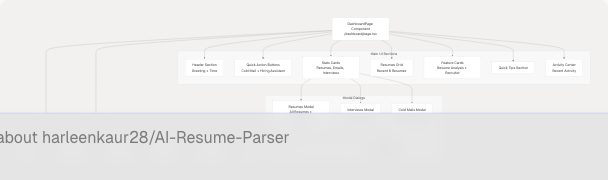
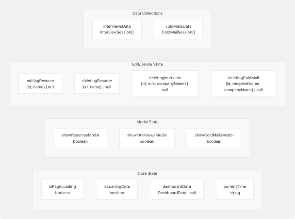
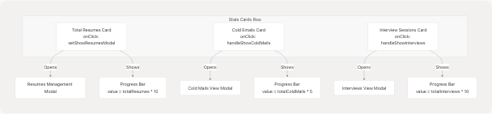
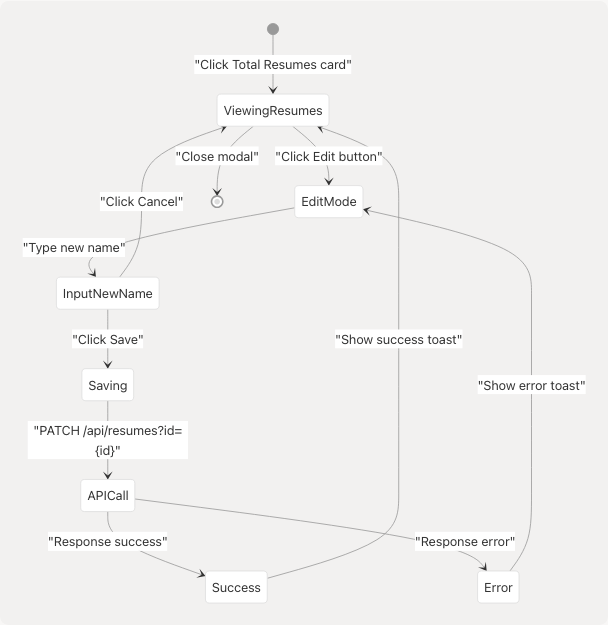

# Main Dashboard

> Source: https://deepwiki.com/harleenkaur28/AI-Resume-Parser/4.5.1-main-dashboard

# Main Dashboard

Relevant source files

* [frontend/app/dashboard/page.tsx](https://github.com/harleenkaur28/AI-Resume-Parser/blob/b2bbd83d/frontend/app/dashboard/page.tsx)

## Purpose and Scope

This document describes the Main Dashboard page ([frontend/app/dashboard/page.tsx109-1738](https://github.com/harleenkaur28/AI-Resume-Parser/blob/b2bbd83d/frontend/app/dashboard/page.tsx#L109-L1738)), which serves as the central hub for authenticated users in the TalentSync platform. The Main Dashboard displays user statistics, recent activity, and provides quick access to all major features including resume analysis, cold mail generation, and hiring assistant tools.

For information about navigation to this page, see [Middleware & Route Protection](/harleenkaur28/AI-Resume-Parser/4.2.5-middleware-and-route-protection). For details about individual feature pages accessible from this dashboard, see [Resume Upload & Analysis](/harleenkaur28/AI-Resume-Parser/4.5.2-resume-upload-and-analysis), [Cold Mail Generator](/harleenkaur28/AI-Resume-Parser/4.5.4-cold-mail-generator), and [Hiring Assistant](/harleenkaur28/AI-Resume-Parser/4.5.5-hiring-assistant).

## Overview

The Main Dashboard is implemented as a Next.js client component that orchestrates multiple UI sections and modals to provide a comprehensive view of the user's activity and quick access to platform features. The page is protected by NextAuth authentication and automatically redirects unauthenticated users to the login page.

**Sources:** [frontend/app/dashboard/page.tsx1-15](https://github.com/harleenkaur28/AI-Resume-Parser/blob/b2bbd83d/frontend/app/dashboard/page.tsx#L1-L15) [frontend/app/dashboard/page.tsx109-145](https://github.com/harleenkaur28/AI-Resume-Parser/blob/b2bbd83d/frontend/app/dashboard/page.tsx#L109-L145)

### Component Architecture


```

**Sources:** [frontend/app/dashboard/page.tsx109-1738](https://github.com/harleenkaur28/AI-Resume-Parser/blob/b2bbd83d/frontend/app/dashboard/page.tsx#L109-L1738)

## Data Types and State Management

### Primary Data Structures

The dashboard component manages several TypeScript interfaces that define the shape of data retrieved from API endpoints:

| Interface | Purpose | Key Fields |
| --- | --- | --- |
| `DashboardData` | Main dashboard data container | `user`, `stats`, `recentActivity`, `resumes` |
| `InterviewSession` | Interview practice session | `id`, `role`, `companyName`, `questionsAndAnswers` |
| `ColdMailSession` | Cold email generation session | `id`, `recipientName`, `companyName`, `emails` |

**Sources:** [frontend/app/dashboard/page.tsx57-107](https://github.com/harleenkaur28/AI-Resume-Parser/blob/b2bbd83d/frontend/app/dashboard/page.tsx#L57-L107)

### State Variables

```

```

**Sources:** [frontend/app/dashboard/page.tsx112-144](https://github.com/harleenkaur28/AI-Resume-Parser/blob/b2bbd83d/frontend/app/dashboard/page.tsx#L112-L144)

## Data Fetching and API Integration

### Dashboard Data Flow

```

```

**Sources:** [frontend/app/dashboard/page.tsx147-172](https://github.com/harleenkaur28/AI-Resume-Parser/blob/b2bbd83d/frontend/app/dashboard/page.tsx#L147-L172) [frontend/app/dashboard/page.tsx175-228](https://github.com/harleenkaur28/AI-Resume-Parser/blob/b2bbd83d/frontend/app/dashboard/page.tsx#L175-L228)

### API Endpoints Used

| Endpoint | Method | Purpose | Response Type |
| --- | --- | --- | --- |
| `/api/dashboard` | GET | Fetch user stats, recent activity, and resumes | `DashboardData` |
| `/api/interviews` | GET | Fetch all interview sessions | `InterviewSession[]` |
| `/api/interviews?id={id}` | DELETE | Delete interview session | `{success: boolean}` |
| `/api/cold-mails` | GET | Fetch all cold mail sessions | `ColdMailSession[]` |
| `/api/cold-mails?id={id}` | DELETE | Delete cold mail session | `{success: boolean}` |
| `/api/resumes?id={id}` | DELETE | Delete resume and analyses | `{success: boolean}` |
| `/api/resumes?id={id}` | PATCH | Rename resume | `{success: boolean}` |

**Sources:** [frontend/app/dashboard/page.tsx147-377](https://github.com/harleenkaur28/AI-Resume-Parser/blob/b2bbd83d/frontend/app/dashboard/page.tsx#L147-L377)

## UI Sections

### Header Section with Dynamic Greeting

The header section displays a personalized greeting based on the current time of day and shows the current time in a badge component.

| Time Range | Greeting |
| --- | --- |
| 00:00 - 11:59 | "Good morning" |
| 12:00 - 16:59 | "Good afternoon" |
| 17:00 - 23:59 | "Good evening" |

The greeting function uses the local browser time to determine the appropriate message:

**Sources:** [frontend/app/dashboard/page.tsx393-415](https://github.com/harleenkaur28/AI-Resume-Parser/blob/b2bbd83d/frontend/app/dashboard/page.tsx#L393-L415) [frontend/app/dashboard/page.tsx497-531](https://github.com/harleenkaur28/AI-Resume-Parser/blob/b2bbd83d/frontend/app/dashboard/page.tsx#L497-L531)

### Stats Cards with Interactive Actions

Three primary stats cards display aggregate metrics and serve as navigation triggers to detailed modal views:

```

```

**Sources:** [frontend/app/dashboard/page.tsx557-686](https://github.com/harleenkaur28/AI-Resume-Parser/blob/b2bbd83d/frontend/app/dashboard/page.tsx#L557-L686)

### Quick Action Buttons

Two prominent call-to-action buttons provide direct navigation to the most-used features:

| Button | Route | Icon | Purpose |
| --- | --- | --- | --- |
| Cold Mail Generator | `/dashboard/cold-mail` | `Mail` | Generate personalized cold emails |
| Hiring Assistant | `/dashboard/hiring-assistant` | `Users` | Get interview Q&A assistance |

**Sources:** [frontend/app/dashboard/page.tsx534-554](https://github.com/harleenkaur28/AI-Resume-Parser/blob/b2bbd83d/frontend/app/dashboard/page.tsx#L534-L554)

### Resumes Grid Display

The dashboard displays up to 6 recent resumes in a responsive grid layout. Each resume card includes:

* Custom name
* Upload date
* Predicted field (job category) badge
* Candidate name (if extracted)
* "View Analysis" button linking to `/dashboard/analysis/{id}`

If more than 6 resumes exist, a "View All Resumes" button appears to open the full resumes modal.

**Sources:** [frontend/app/dashboard/page.tsx688-786](https://github.com/harleenkaur28/AI-Resume-Parser/blob/b2bbd83d/frontend/app/dashboard/page.tsx#L688-L786)

### Feature Cards

Two feature cards promote different user paths:

#### Resume Analysis Card

* Highlights: ATS Compatibility Check, Skill Gap Analysis, Industry-Specific Recommendations
* Action: Links to `/dashboard/seeker` for resume upload

#### For Recruiters Card

* Highlights: Smart Candidate Matching, Bulk Resume Processing, Interview Question Generator
* Action: Links to `/dashboard/recruiter` for recruiter tools

**Sources:** [frontend/app/dashboard/page.tsx789-890](https://github.com/harleenkaur28/AI-Resume-Parser/blob/b2bbd83d/frontend/app/dashboard/page.tsx#L789-L890)

### Activity Center

The Activity Center displays recent user actions across all features. Each activity item includes:

* Type-specific icon (FileText, Mail, Users)
* Title and description
* Date of activity

When no activity exists, the component displays an empty state with call-to-action buttons.

**Sources:** [frontend/app/dashboard/page.tsx951-1051](https://github.com/harleenkaur28/AI-Resume-Parser/blob/b2bbd83d/frontend/app/dashboard/page.tsx#L951-L1051) [frontend/app/dashboard/page.tsx380-391](https://github.com/harleenkaur28/AI-Resume-Parser/blob/b2bbd83d/frontend/app/dashboard/page.tsx#L380-L391)

## Modal Dialogs

### Resumes Management Modal

The resumes modal provides full CRUD operations for user resumes:

```

```

**Sources:** [frontend/app/dashboard/page.tsx1056-1230](https://github.com/harleenkaur28/AI-Resume-Parser/blob/b2bbd83d/frontend/app/dashboard/page.tsx#L1056-L1230) [frontend/app/dashboard/page.tsx260-285](https://github.com/harleenkaur28/AI-Resume-Parser/blob/b2bbd83d/frontend/app/dashboard/page.tsx#L260-L285) [frontend/app/dashboard/page.tsx346-377](https://github.com/harleenkaur28/AI-Resume-Parser/blob/b2bbd83d/frontend/app/dashboard/page.tsx#L346-L377)

### Interviews Modal

Displays all interview practice sessions with full Q&A content. Each session shows:

* Role and company name
* Creation timestamp
* Number of questions
* Expandable Q&A pairs with copy-to-clipboard functionality
* Delete button per session

**Key Functions:**

* `fetchInterviews()`: Retrieves all interview sessions from `/api/interviews`
* `handleDeleteInterview()`: Deletes session via `DELETE /api/interviews?id={id}`
* `copyToClipboard()`: Copies individual answers to system clipboard

**Sources:** [frontend/app/dashboard/page.tsx1297-1442](https://github.com/harleenkaur28/AI-Resume-Parser/blob/b2bbd83d/frontend/app/dashboard/page.tsx#L1297-L1442) [frontend/app/dashboard/page.tsx175-200](https://github.com/harleenkaur28/AI-Resume-Parser/blob/b2bbd83d/frontend/app/dashboard/page.tsx#L175-L200) [frontend/app/dashboard/page.tsx288-314](https://github.com/harleenkaur28/AI-Resume-Parser/blob/b2bbd83d/frontend/app/dashboard/page.tsx#L288-L314)

### Cold Mails Modal

Displays all cold email generation sessions with email content. Each session shows:

* Recipient name and designation
* Company name
* Creation timestamp
* Multiple emails with subject and body
* Copy-to-clipboard functionality
* Delete button per session

**Key Functions:**

* `fetchColdMails()`: Retrieves all cold mail sessions from `/api/cold-mails`
* `handleDeleteColdMail()`: Deletes session via `DELETE /api/cold-mails?id={id}`
* `copyToClipboard()`: Copies subject + body to system clipboard

**Sources:** [frontend/app/dashboard/page.tsx1444-1601](https://github.com/harleenkaur28/AI-Resume-Parser/blob/b2bbd83d/frontend/app/dashboard/page.tsx#L1444-L1601) [frontend/app/dashboard/page.tsx203-228](https://github.com/harleenkaur28/AI-Resume-Parser/blob/b2bbd83d/frontend/app/dashboard/page.tsx#L203-L228) [frontend/app/dashboard/page.tsx317-343](https://github.com/harleenkaur28/AI-Resume-Parser/blob/b2bbd83d/frontend/app/dashboard/page.tsx#L317-L343)

## User Interaction Workflows

### Resume Rename Workflow

```


**Sources:** [frontend/app/dashboard/page.tsx1117-1146](https://github.com/harleenkaur28/AI-Resume-Parser/blob/b2bbd83d/frontend/app/dashboard/page.tsx#L1117-L1146) [frontend/app/dashboard/page.tsx346-377](https://github.com/harleenkaur28/AI-Resume-Parser/blob/b2bbd83d/frontend/app/dashboard/page.tsx#L346-L377)

### Delete Operation Workflow

All delete operations (resumes, interviews, cold mails) follow a consistent pattern:

1. User clicks delete button on item
2. Confirmation dialog opens with item details
3. User confirms or cancels
4. If confirmed:
   * API DELETE request sent to appropriate endpoint
   * Success toast displayed
   * Dashboard data refreshed via `fetchDashboardData()`
   * Affected modal data refreshed (if applicable)

**Sources:** [frontend/app/dashboard/page.tsx1233-1295](https://github.com/harleenkaur28/AI-Resume-Parser/blob/b2bbd83d/frontend/app/dashboard/page.tsx#L1233-L1295) [frontend/app/dashboard/page.tsx1603-1668](https://github.com/harleenkaur28/AI-Resume-Parser/blob/b2bbd83d/frontend/app/dashboard/page.tsx#L1603-L1668) [frontend/app/dashboard/page.tsx1670-1735](https://github.com/harleenkaur28/AI-Resume-Parser/blob/b2bbd83d/frontend/app/dashboard/page.tsx#L1670-L1735)

## Animation and Visual Effects

The dashboard uses Framer Motion (`motion` from `framer-motion`) for smooth transitions:

| Animation Type | Element | Configuration |
| --- | --- | --- |
| Page Load | Full page overlay | `initial: {opacity: 1}`, `exit: {opacity: 0}` |
| Section Fade-in | Cards and sections | `initial: {opacity: 0, y: 20}`, staggered delays |
| Modal Open/Close | All modals | `initial: {opacity: 0, scale: 0.95}` |
| Activity Items | Recent activity list | Staggered fade-in with `delay: index * 0.1` |

Background effects include animated gradient blobs with pulsing animations:

**Sources:** [frontend/app/dashboard/page.tsx448-458](https://github.com/harleenkaur28/AI-Resume-Parser/blob/b2bbd83d/frontend/app/dashboard/page.tsx#L448-L458) [frontend/app/dashboard/page.tsx462-467](https://github.com/harleenkaur28/AI-Resume-Parser/blob/b2bbd83d/frontend/app/dashboard/page.tsx#L462-L467)

## Authentication and Route Protection

The dashboard implements multiple layers of authentication checking:

1. **NextAuth Session Check**: Uses `useSession()` hook to verify authentication status
2. **Automatic Redirect**: Unauthenticated users redirected to `/auth` via `useEffect`
3. **Loading States**: Displays loader overlays during session loading
4. **Session Data**: Accesses user information via `session.user` for display

**Sources:** [frontend/app/dashboard/page.tsx110](https://github.com/harleenkaur28/AI-Resume-Parser/blob/b2bbd83d/frontend/app/dashboard/page.tsx#L110-L110) [frontend/app/dashboard/page.tsx418-422](https://github.com/harleenkaur28/AI-Resume-Parser/blob/b2bbd83d/frontend/app/dashboard/page.tsx#L418-L422) [frontend/app/dashboard/page.tsx436-444](https://github.com/harleenkaur28/AI-Resume-Parser/blob/b2bbd83d/frontend/app/dashboard/page.tsx#L436-L444)

## Component Dependencies

The dashboard imports and utilizes numerous UI components from the project's component library:

| Component Category | Components Used |
| --- | --- |
| shadcn/ui Core | `Button`, `Card`, `CardContent`, `CardDescription`, `CardHeader`, `CardTitle`, `Badge`, `Progress`, `Input`, `Label` |
| Custom Components | `Loader`, `LoaderOverlay` |
| Icons (lucide-react) | 30+ icons including `FileText`, `Users`, `Mail`, `Trash2`, `Edit`, `Eye`, `Copy`, `X` |
| Layout | `Dialog`, `DialogContent`, `DialogHeader`, `DialogTitle`, etc. |
| Hooks | `useSession`, `useRouter`, `useToast` |

**Sources:** [frontend/app/dashboard/page.tsx1-55](https://github.com/harleenkaur28/AI-Resume-Parser/blob/b2bbd83d/frontend/app/dashboard/page.tsx#L1-L55)

## Performance Considerations

The dashboard implements several performance optimizations:

* **Lazy Loading**: Modal content fetched only when modals are opened
* **Conditional Rendering**: Heavy sections rendered only after page load animation completes
* **Optimistic UI**: Loading states prevent user interaction during data fetches
* **Data Refresh Strategy**: Targeted refreshes after mutations (e.g., only affected data refreshed after delete)
* **Pagination**: Resumes grid shows only 6 items initially, with "View All" for the rest

**Sources:** [frontend/app/dashboard/page.tsx425-434](https://github.com/harleenkaur28/AI-Resume-Parser/blob/b2bbd83d/frontend/app/dashboard/page.tsx#L425-L434) [frontend/app/dashboard/page.tsx231-234](https://github.com/harleenkaur28/AI-Resume-Parser/blob/b2bbd83d/frontend/app/dashboard/page.tsx#L231-L234) [frontend/app/dashboard/page.tsx237-240](https://github.com/harleenkaur28/AI-Resume-Parser/blob/b2bbd83d/frontend/app/dashboard/page.tsx#L237-L240)