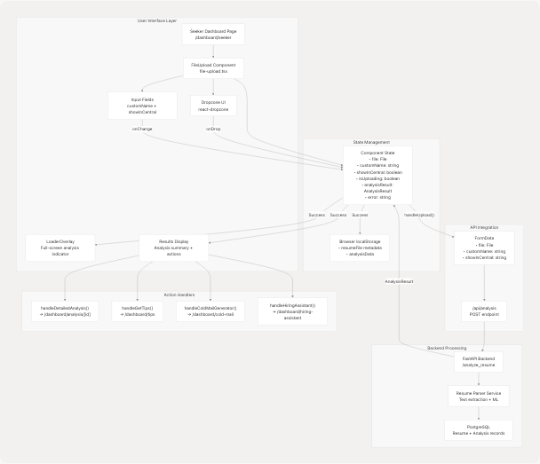
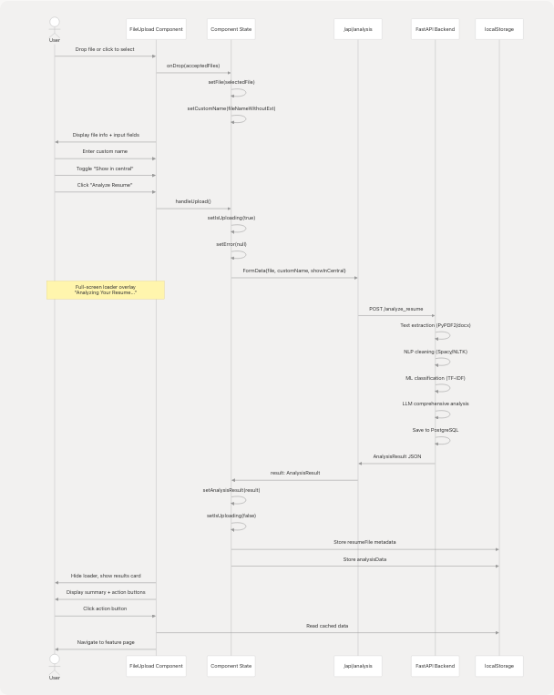
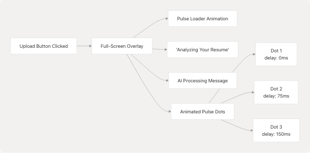
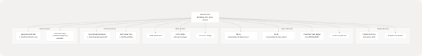

# Resume Upload & Analysis

## Purpose and Scope

This page documents the resume upload and initial analysis functionality in the TalentSync frontend application. It covers the file upload user interface, the analysis request flow, results display, and integration with other dashboard features.

This page focuses on the initial upload and summary analysis. For detailed analysis visualization, see [Detailed Analysis View](4.5.3-detailed-analysis-view). For tips generation based on analysis, see [Career Tips](4.5.3-detailed-analysis-view). For the backend resume parsing and ML classification, see [Resume Analysis Service](3.1-resume-analysis-service).

---

## Component Architecture

The resume upload and analysis feature is implemented through two primary components:

### FileUpload Component

The main component used throughout the application, located at [frontend/components/file-upload.tsx1-468](https://github.com/harleenkaur28/AI-Resume-Parser/blob/b2bbd83d/frontend/components/file-upload.tsx#L1-L468) This component provides a comprehensive drag-and-drop interface with the following capabilities:

| Feature | Description | Implementation |
| --- | --- | --- |
| File Selection | Drag-and-drop or click to select | `react-dropzone` library |
| File Validation | Accept only PDF, TXT, MD, DOCX | `accept` prop configuration |
| Custom Naming | User-defined resume identifier | State management with `customName` |
| Central Repository | Optional visibility toggle | `showInCentral` checkbox |
| Analysis Results | Summary display with actions | Conditional rendering based on `analysisResult` |

### UploadResume Component

A simpler alternative implementation at [frontend/components/upload-resume.tsx1-185](https://github.com/harleenkaur28/AI-Resume-Parser/blob/b2bbd83d/frontend/components/upload-resume.tsx#L1-L185) providing basic upload functionality with callbacks for success/error handling. This component is used in contexts where minimal UI complexity is required.

**Sources:** [frontend/components/file-upload.tsx1-468](https://github.com/harleenkaur28/AI-Resume-Parser/blob/b2bbd83d/frontend/components/file-upload.tsx#L1-L468) [frontend/components/upload-resume.tsx1-185](https://github.com/harleenkaur28/AI-Resume-Parser/blob/b2bbd83d/frontend/components/upload-resume.tsx#L1-L185)

---

## System Architecture Diagram



**Sources:** [frontend/components/file-upload.tsx64-133](https://github.com/harleenkaur28/AI-Resume-Parser/blob/b2bbd83d/frontend/components/file-upload.tsx#L64-L133) [frontend/app/dashboard/seeker/page.tsx20-196](https://github.com/harleenkaur28/AI-Resume-Parser/blob/b2bbd83d/frontend/app/dashboard/seeker/page.tsx#L20-L196)

---

## Upload Flow Sequence

The resume upload and analysis process follows a multi-stage sequence with clear user feedback at each step:



**Sources:** [frontend/components/file-upload.tsx75-132](https://github.com/harleenkaur28/AI-Resume-Parser/blob/b2bbd83d/frontend/components/file-upload.tsx#L75-L132) [frontend/components/file-upload.tsx99-132](https://github.com/harleenkaur28/AI-Resume-Parser/blob/b2bbd83d/frontend/components/file-upload.tsx#L99-L132)

---

## File Upload Implementation

### Dropzone Configuration

The file upload component uses `react-dropzone` for drag-and-drop functionality with specific file type restrictions:

```
// Configuration at frontend/components/file-upload.tsx:87-97
const { getRootProps, getInputProps, isDragActive } = useDropzone({
    onDrop,
    accept: {
        "application/pdf": [".pdf"],
        "text/plain": [".txt"],
        "text/markdown": [".md"],
        "application/vnd.openxmlformats-officedocument.wordprocessingml.document": [".docx"]
    },
    maxFiles: 1
});
```

### File Selection Handler

When a file is selected, the component automatically populates the custom name field:

[frontend/components/file-upload.tsx75-85](https://github.com/harleenkaur28/AI-Resume-Parser/blob/b2bbd83d/frontend/components/file-upload.tsx#L75-L85)

| Step | Action | State Update |
| --- | --- | --- |
| 1 | File selected via drag-and-drop or click | `setFile(selectedFile)` |
| 2 | Extract filename without extension | `nameWithoutExt = file.name.replace(/\.[^/.]+$/, "")` |
| 3 | Populate custom name field | `setCustomName(nameWithoutExt)` |
| 4 | Clear previous errors/results | `setError(null)`, `setAnalysisResult(null)` |

**Sources:** [frontend/components/file-upload.tsx75-85](https://github.com/harleenkaur28/AI-Resume-Parser/blob/b2bbd83d/frontend/components/file-upload.tsx#L75-L85)

---

## API Request Construction

### FormData Payload

The upload handler constructs a `FormData` object containing the file and metadata:

[frontend/components/file-upload.tsx99-114](https://github.com/harleenkaur28/AI-Resume-Parser/blob/b2bbd83d/frontend/components/file-upload.tsx#L99-L114)

```
const formData = new FormData();
formData.append("file", file);                              // Resume file (PDF/DOCX/TXT/MD)
formData.append("customName", customName.trim());          // User-defined name
formData.append("showInCentral", showInCentral.toString()); // Boolean as string
```

### Request Execution

The component sends a POST request to the Next.js API route:

```
const response = await fetch(`/api/analysis`, {
    method: "POST",
    body: formData  // No Content-Type header - browser sets multipart/form-data
});
```

The `/api/analysis` route acts as a proxy, forwarding the request to the FastAPI backend at `/analyze_resume` endpoint.

**Sources:** [frontend/components/file-upload.tsx106-114](https://github.com/harleenkaur28/AI-Resume-Parser/blob/b2bbd83d/frontend/components/file-upload.tsx#L106-L114)

---

## Analysis Result Structure

### AnalysisResult Interface

The backend returns a comprehensive analysis result with the following TypeScript interface:

[frontend/components/file-upload.tsx22-58](https://github.com/harleenkaur28/AI-Resume-Parser/blob/b2bbd83d/frontend/components/file-upload.tsx#L22-L58)

```
interface AnalysisResult {
    success: boolean;
    message: string;
    data: {
        resumeId: string;                           // Database ID for navigation
        analysis: {
            id: string;
            name: string;                           // Extracted from resume
            email: string;                          // Extracted from resume
            contact?: string;                       // Optional phone number
            predictedField: string;                 // ML classification result
            skillsAnalysis: Array<{
                skill_name: string;
                percentage: number;                 // Proficiency score
            }>;
            recommendedRoles: string[];             // AI-suggested positions
            languages: Array<{
                language: string;
            }>;
            education: Array<{
                education_detail: string;
            }>;
            workExperience: Array<{
                role: string;
                company_and_duration: string;
                bullet_points: string[];
            }>;
            projects: Array<{
                title: string;
                technologies_used: string[];
                description: string;
            }>;
            uploadedAt: string;
        };
        cleanedText: string;                        // NLP-processed resume text
    };
}
```

**Sources:** [frontend/components/file-upload.tsx22-58](https://github.com/harleenkaur28/AI-Resume-Parser/blob/b2bbd83d/frontend/components/file-upload.tsx#L22-L58)

---

## Loading States and User Feedback

### Full-Screen Analysis Overlay

During the analysis process, a full-screen animated overlay provides user feedback:

[frontend/components/file-upload.tsx196-229](https://github.com/harleenkaur28/AI-Resume-Parser/blob/b2bbd83d/frontend/components/file-upload.tsx#L196-L229)



The overlay uses `framer-motion` for smooth entrance/exit animations:

* Initial opacity: 0
* Animate to opacity: 1
* Background: `bg-black/50 backdrop-blur-md`
* Z-index: 50 (above all other content)

**Sources:** [frontend/components/file-upload.tsx196-229](https://github.com/harleenkaur28/AI-Resume-Parser/blob/b2bbd83d/frontend/components/file-upload.tsx#L196-L229) [frontend/components/ui/loader.tsx76-105](https://github.com/harleenkaur28/AI-Resume-Parser/blob/b2bbd83d/frontend/components/ui/loader.tsx#L76-L105)

---

## Results Display Component

### Summary Card Layout

Upon successful analysis, the component displays a comprehensive summary card:

[frontend/components/file-upload.tsx342-463](https://github.com/harleenkaur28/AI-Resume-Parser/blob/b2bbd83d/frontend/components/file-upload.tsx#L342-L463)



**Sources:** [frontend/components/file-upload.tsx342-463](https://github.com/harleenkaur28/AI-Resume-Parser/blob/b2bbd83d/frontend/components/file-upload.tsx#L342-L463)

---

## Cross-Feature Integration

### LocalStorage Data Persistence

The component stores analysis data in `localStorage` to enable seamless transitions to related features:

[frontend/components/file-upload.tsx154-172](https://github.com/harleenkaur28/AI-Resume-Parser/blob/b2bbd83d/frontend/components/file-upload.tsx#L154-L172)

#### Storage Schema

| Key | Data Structure | Purpose |
| --- | --- | --- |
| `resumeFile` | `{ name, size, type, lastModified }` | File metadata for re-upload or reference |
| `analysisData` | Full `analysis` object | Pre-populate forms in other features |

#### Usage Pattern

```
// Store data when navigating to Cold Mail Generator
localStorage.setItem("resumeFile", JSON.stringify({
    name: file.name,
    size: file.size,
    type: file.type,
    lastModified: file.lastModified
}));
localStorage.setItem("analysisData", JSON.stringify(analysisResult.data.analysis));

// Navigate to feature
router.push("/dashboard/cold-mail");
```

### Navigation Handlers

The component provides four navigation handlers that integrate with other dashboard features:

#### handleDetailedAnalysis()

[frontend/components/file-upload.tsx134-139](https://github.com/harleenkaur28/AI-Resume-Parser/blob/b2bbd83d/frontend/components/file-upload.tsx#L134-L139)

Navigates to the comprehensive analysis view using the resume ID:

* Target: `/dashboard/analysis/${resumeId}`
* Data: Fetched from database via API
* See: [Detailed Analysis View](4.5.3-detailed-analysis-view)

#### handleGetTips()

[frontend/components/file-upload.tsx141-152](https://github.com/harleenkaur28/AI-Resume-Parser/blob/b2bbd83d/frontend/components/file-upload.tsx#L141-L152)

Passes analysis data to the tips page via query parameters:

* Target: `/dashboard/tips?category=${jobCategory}&skills=${skills}`
* Data: `predictedField` and comma-separated `skillsAnalysis`
* See: Career Tips page

#### handleColdMailGenerator()

[frontend/components/file-upload.tsx154-172](https://github.com/harleenkaur28/AI-Resume-Parser/blob/b2bbd83d/frontend/components/file-upload.tsx#L154-L172)

Stores data in localStorage and navigates to cold mail feature:

* Target: `/dashboard/cold-mail`
* Data: `resumeFile` metadata + `analysisData`
* See: [Cold Mail Generator](4.5.4-cold-mail-generator)

#### handleHiringAssistant()

[frontend/components/file-upload.tsx174-192](https://github.com/harleenkaur28/AI-Resume-Parser/blob/b2bbd83d/frontend/components/file-upload.tsx#L174-L192)

Stores data in localStorage and navigates to interview prep:

* Target: `/dashboard/hiring-assistant`
* Data: `resumeFile` metadata + `analysisData`
* See: [Hiring Assistant](4.5.5-hiring-assistant)

**Sources:** [frontend/components/file-upload.tsx134-192](https://github.com/harleenkaur28/AI-Resume-Parser/blob/b2bbd83d/frontend/components/file-upload.tsx#L134-L192)

---

## Seeker Dashboard Integration

### Page Layout

The FileUpload component is embedded in the Seeker Dashboard page at [frontend/app/dashboard/seeker/page.tsx1-196](https://github.com/harleenkaur28/AI-Resume-Parser/blob/b2bbd83d/frontend/app/dashboard/seeker/page.tsx#L1-L196) This page provides context and additional feature links around the upload component.


### Animation Sequence

The page uses staggered `framer-motion` animations for visual polish:

| Element | Delay | Animation |
| --- | --- | --- |
| Back Button | 0ms | `x: -20 → 0`, `opacity: 0 → 1` |
| Main Header | 200ms | `y: 20 → 0`, `opacity: 0 → 1` |
| Upload Component | 400ms | `scale: 0.95 → 1`, `opacity: 0 → 1` |
| Features Grid | 600ms | `y: 20 → 0`, `opacity: 0 → 1` |
| Additional Services | 800ms | `y: 20 → 0`, `opacity: 0 → 1` |

**Sources:** [frontend/app/dashboard/seeker/page.tsx48-189](https://github.com/harleenkaur28/AI-Resume-Parser/blob/b2bbd83d/frontend/app/dashboard/seeker/page.tsx#L48-L189)

---

## Error Handling

### Client-Side Validation

The component validates user input before submission:

[frontend/components/file-upload.tsx99-100](https://github.com/harleenkaur28/AI-Resume-Parser/blob/b2bbd83d/frontend/components/file-upload.tsx#L99-L100)

```
if (!file || !customName.trim()) return;  // Prevents empty submissions
```

The submit button is disabled when validation fails:

```
disabled={isUploading || !customName.trim()}
```

### Server Error Display

If the API request fails, an error message is displayed with visual feedback:

[frontend/components/file-upload.tsx127-131](https://github.com/harleenkaur28/AI-Resume-Parser/blob/b2bbd83d/frontend/components/file-upload.tsx#L127-L131)


The error display at [frontend/components/file-upload.tsx328-337](https://github.com/harleenkaur28/AI-Resume-Parser/blob/b2bbd83d/frontend/components/file-upload.tsx#L328-L337) provides clear user feedback with red-themed styling and an alert icon.

**Sources:** [frontend/components/file-upload.tsx99-100](https://github.com/harleenkaur28/AI-Resume-Parser/blob/b2bbd83d/frontend/components/file-upload.tsx#L99-L100) [frontend/components/file-upload.tsx127-131](https://github.com/harleenkaur28/AI-Resume-Parser/blob/b2bbd83d/frontend/components/file-upload.tsx#L127-L131) [frontend/components/file-upload.tsx328-337](https://github.com/harleenkaur28/AI-Resume-Parser/blob/b2bbd83d/frontend/components/file-upload.tsx#L328-L337)

---

## Alternative Upload Component

### Simplified UploadResume Component

The codebase includes a simpler upload component at [frontend/components/upload-resume.tsx1-185](https://github.com/harleenkaur28/AI-Resume-Parser/blob/b2bbd83d/frontend/components/upload-resume.tsx#L1-L185) with callback-based architecture:

#### Key Differences

| Feature | FileUpload | UploadResume |
| --- | --- | --- |
| UI Style | Drag-and-drop with `react-dropzone` | Traditional file input |
| Results Display | Inline comprehensive summary | Callback to parent |
| Error Handling | Inline error display | Callback to parent |
| Navigation | Built-in action buttons | Parent controls navigation |
| Styling | Glassmorphism with backdrop-blur | Standard Bootstrap-style |

#### Usage Pattern

```
<UploadResume
    onSuccess={(result) => {
        // Parent handles success
        console.log(result);
    }}
    onError={(error) => {
        // Parent handles error
        console.error(error);
    }}
/>
```

This component is suitable for contexts where the parent component needs full control over the upload lifecycle and result handling.

**Sources:** [frontend/components/upload-resume.tsx1-185](https://github.com/harleenkaur28/AI-Resume-Parser/blob/b2bbd83d/frontend/components/upload-resume.tsx#L1-L185)

---

## Performance Considerations

### File Size Handling

While the component doesn't enforce explicit file size limits, the backend and API routes may have limits:

* Browser FormData automatically handles multipart encoding
* File size displayed in KB: [frontend/components/file-upload.tsx273](https://github.com/harleenkaur28/AI-Resume-Parser/blob/b2bbd83d/frontend/components/file-upload.tsx#L273-L273)
* Large files (>5MB) may experience longer upload/processing times

### Analysis Duration

The backend processing typically takes 4-8 seconds, consisting of:

1. File upload (~1-2s depending on size)
2. Text extraction (PDF/DOCX parsing)
3. NLP cleaning and tokenization
4. ML classification with TF-IDF vectorization
5. LLM comprehensive analysis via Google Gemini
6. Database persistence

The loading overlay provides continuous feedback during this period to maintain user engagement.

### State Management Optimization

The component uses React state efficiently:

* Single `analysisResult` state for entire response
* Conditional rendering prevents unnecessary re-renders
* LocalStorage writes are synchronous but small payloads

**Sources:** [frontend/components/file-upload.tsx64-73](https://github.com/harleenkaur28/AI-Resume-Parser/blob/b2bbd83d/frontend/components/file-upload.tsx#L64-L73)

---

## Database Persistence

### Schema Changes

The application stores the raw resume text in the database rather than file URLs, as evidenced by the migration:

[frontend/prisma/migrations/20250613172024\_replace\_file\_url\_with\_raw\_text/migration.sql1-13](https://github.com/harleenkaur28/AI-Resume-Parser/blob/b2bbd83d/frontend/prisma/migrations/20250613172024_replace_file_url_with_raw_text/migration.sql#L1-L13)

This change enables:

* Full-text search capabilities
* Easier data processing without file system access
* Simplified backup and migration procedures
* Direct access to cleaned text for re-analysis

### Data Models

The resume upload process creates two database records:

1. **Resume** record with `rawText` field containing cleaned resume content
2. **Analysis** record with comprehensive structured data

The `resumeId` returned in the response links these records for retrieval in the Detailed Analysis view.

**Sources:** [frontend/prisma/migrations/20250613172024\_replace\_file\_url\_with\_raw\_text/migration.sql1-13](https://github.com/harleenkaur28/AI-Resume-Parser/blob/b2bbd83d/frontend/prisma/migrations/20250613172024_replace_file_url_with_raw_text/migration.sql#L1-L13)
