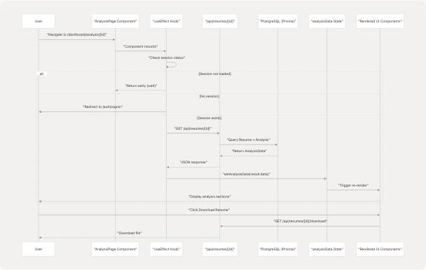
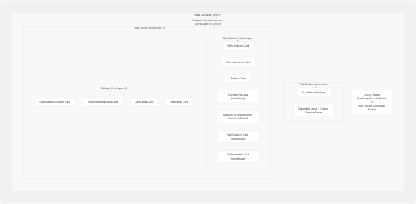
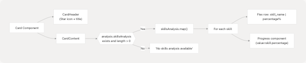
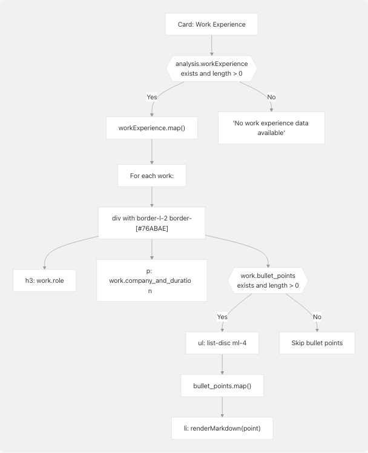
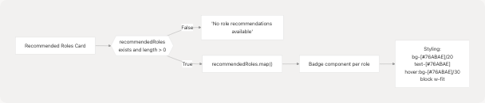
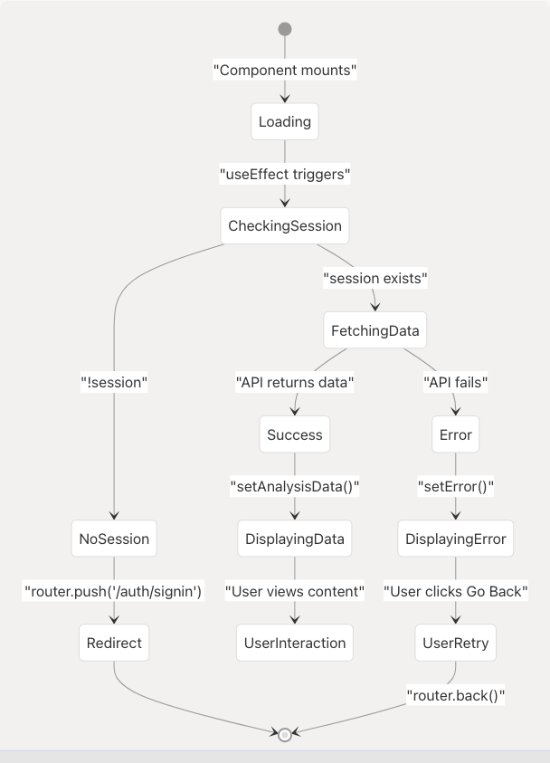
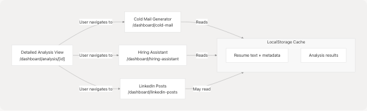

# Detailed Analysis View

* [frontend/app/dashboard/analysis/[id]/page.tsx](frontend/app/dashboard/analysis/%5Bid%5D/page.tsx)
* [frontend/app/dashboard/linkedin-posts/page.tsx](https://github.com/harleenkaur28/AI-Resume-Parser/blob/b2bbd83d/frontend/app/dashboard/linkedin-posts/page.tsx)
* [frontend/components/linkedin-posts-button.tsx](https://github.com/harleenkaur28/AI-Resume-Parser/blob/b2bbd83d/frontend/components/linkedin-posts-button.tsx)
* [frontend/lib/markdown-renderer.tsx](https://github.com/harleenkaur28/AI-Resume-Parser/blob/b2bbd83d/frontend/lib/markdown-renderer.tsx)

## Purpose and Scope

The Detailed Analysis View displays comprehensive resume analysis results to authenticated users after their resume has been processed by the Resume Analysis Service (see [3.1](3.1-resume-analysis-service)). This page presents structured information including skills analysis, work experience, projects, education, and optional sections like publications, certifications, and achievements. Users access this view by navigating from the Resume Upload & Analysis page (see [4.5.2](4.5.2-resume-upload-and-analysis)) or directly via the route `/dashboard/analysis/[id]`.

This document covers the frontend implementation, data model, layout architecture, and rendering logic. For backend analysis processing, see [3.1.3](3.1.3-comprehensive-analysis-with-llm). For data persistence, see [5.1](5.1-prisma-schema).

---

## Route and File Structure

The Detailed Analysis View is implemented as a Next.js dynamic route page located at frontend/app/dashboard/analysis/[id]/page.tsx:1-834. The `[id]` parameter represents the unique resume identifier (UUID) stored in the PostgreSQL database.

**Route Pattern:**

* URL: `/dashboard/analysis/[id]`
* Example: `/dashboard/analysis/550e8400-e29b-41d4-a716-446655440000`
* Protected: Requires authenticated session via NextAuth middleware

**Key Dependencies:**

* `framer-motion`: Animation library for page transitions
* `next-auth/react`: Session management via `useSession` hook
* `lucide-react`: Icon library for UI elements
* Custom UI components from `@/components/ui/*`
* Markdown renderer from `@/lib/markdown-renderer`

---

## Data Flow Architecture

The following diagram illustrates how analysis data flows from the API through the component state to the rendered UI:



**Data Fetching Implementation:**

The component uses `useEffect` to fetch data on mount frontend/app/dashboard/analysis/[id]/page.tsx:119-147:

```
useEffect(() => {
    if (status === "loading") return;
    if (!session) {
        router.push("/auth/signin");
        return;
    }

    const fetchAnalysis = async () => {
        try {
            const response = await fetch(`/api/resumes/${params.id}`);
            if (!response.ok) {
                throw new Error(errorData.message || "Failed to fetch analysis");
            }
            const result = await response.json();
            setAnalysisData(result.data);
        } catch (err) {
            setError(err instanceof Error ? err.message : "Failed to fetch analysis");
        } finally {
            setLoading(false);
        }
    };

    if (params.id) {
        fetchAnalysis();
    }
}, [params.id, session, status, router]);
```

---

## Data Model Interface

The `AnalysisData` interface defines the complete structure of data displayed on this page:


**Interface Definition:**

The TypeScript interface is defined at frontend/app/dashboard/analysis/[id]/page.tsx:33-109 and matches the Prisma schema from the backend. Key characteristics:

* **Required fields**: Basic info (name, email), skills, work experience, projects, education
* **Optional fields**: Publications, positions of responsibility, certifications, achievements (nullable arrays)
* **Nested objects**: All sections use structured objects rather than flat strings
* **Type safety**: Enforced through TypeScript for compile-time validation

---

## Layout Architecture

The page uses a responsive two-column layout with a sticky header:



**Responsive Behavior:**

| Breakpoint | Layout | Stack Order |
| --- | --- | --- |
| Mobile (< 1280px) | Single column, full width | Main content first, then sidebar |
| Desktop (≥ 1280px) | Two columns (2:1 ratio) | Main content left, sidebar right |

**Styling System:**

* Background: Gradient from `#222831` → `#31363F` → `#222831`
* Cards: `backdrop-blur-lg bg-white/5 border-white/10`
* Text colors: `#EEEEEE` (primary), `#76ABAE` (accent)
* Spacing: `space-y-8` between major sections

---

## Component Hierarchy and Rendering Logic

The following diagram maps UI sections to their rendering logic and data sources:


**Conditional Rendering Pattern:**

Optional sections use a consistent pattern frontend/app/dashboard/analysis/[id]/page.tsx:395-584:

```
{analysis.publications && analysis.publications.length > 0 && (
    <Card className="backdrop-blur-lg bg-white/5 border-white/10">
        <CardHeader>
            <CardTitle className="text-[#EEEEEE] flex items-center">
                <BookOpen className="mr-2 h-5 w-5 text-[#76ABAE]" />
                Publications
            </CardTitle>
        </CardHeader>
        <CardContent className="space-y-6">
            {analysis.publications.map((publication, index) => (
                // Render publication item
            ))}
        </CardContent>
    </Card>
)}
```

This pattern is repeated for:

* Publications frontend/app/dashboard/analysis/[id]/page.tsx:395-448
* Positions of Responsibility frontend/app/dashboard/analysis/[id]/page.tsx:451-490
* Certifications frontend/app/dashboard/analysis/[id]/page.tsx:493-545
* Achievements frontend/app/dashboard/analysis/[id]/page.tsx:548-584

---

## Skills Analysis Section

The Skills Analysis section displays skill proficiency as progress bars with percentage values:

**Implementation:**



**Code Structure:**

Located at frontend/app/dashboard/analysis/[id]/page.tsx:242-271, each skill is rendered with:

1. **Name and percentage display**: Flex container with space-between
2. **Progress bar**: Uses `Progress` component from `@/components/ui/progress`
3. **Styling**: Accent color `#76ABAE` for percentage text

**Data Format:**

```
skillsAnalysis: [
    { skill_name: "Python", percentage: 95 },
    { skill_name: "Machine Learning", percentage: 85 },
    // ...
]
```

---

## Work Experience Section

The Work Experience section displays professional history with role, company, duration, and bullet points:

**Rendering Flow:**



**Markdown Rendering:**

Bullet points use the `renderMarkdown` function from [frontend/lib/markdown-renderer.tsx65-133](https://github.com/harleenkaur28/AI-Resume-Parser/blob/b2bbd83d/frontend/lib/markdown-renderer.tsx#L65-L133) to support:

* **Bold text**: `**text**` → styled with `text-[#76ABAE] font-bold`
* **Links**: `<FileRef file-url="https://github.com/harleenkaur28/AI-Resume-Parser/blob/b2bbd83d/text" undefined file-path="text">Hii</FileRef>` → clickable anchor tags
* **List items**: Converted to `<ul>` with `<li>` elements

Example usage at frontend/app/dashboard/analysis/[id]/page.tsx:304-306:

```
<span className="inline">
    {renderMarkdown(point)}
</span>
```

---

## Projects Section

The Projects section displays project details with technologies, links, and descriptions:

**Component Structure:**


**Link Handling:**

Projects can have two types of links frontend/app/dashboard/analysis/[id]/page.tsx:340-364:

1. **Live Link** (`project.live_link`): Displayed with `ExternalLink` icon
2. **Repository Link** (`project.repo_link`): Displayed with `GithubIcon`

Both links:

* Open in new tab (`target="_blank"`)
* Include `rel="noopener noreferrer"` for security
* Use accent color with hover effect: `text-[#76ABAE] hover:text-white`

**Technology Badges:**

Technologies are displayed as styled badges frontend/app/dashboard/analysis/[id]/page.tsx:366-379:

* Background: `bg-[#76ABAE]/10`
* Border: `border-[#76ABAE]/30`
* Text color: `text-[#76ABAE]`
* Layout: Flex wrap for responsive display

---

## Publications Section (Conditional)

The Publications section appears only when the candidate has publications in their resume:

**Conditional Rendering:**


**Field Display Logic:**

Each publication field is conditionally rendered frontend/app/dashboard/analysis/[id]/page.tsx:413-442:

| Field | Display Pattern | Styling |
| --- | --- | --- |
| `title` | Always shown | `text-[#EEEEEE] font-semibold mb-2` |
| `authors` | If exists: "Authors: {authors}" | `text-[#76ABAE]` |
| `journal_conference` | If exists: {journal\_conference} | `text-[#EEEEEE]/80` |
| `year` | If exists: "Year: {year}" | `text-[#EEEEEE]/60` |
| `doi` | If exists: "DOI: {doi}" | `text-[#EEEEEE]/60` |
| `url` | If exists: "View Publication" link | `text-[#76ABAE] hover:underline` |

---

## Positions of Responsibility Section (Conditional)

Similar to Publications, this section renders only when data exists:

**Data Structure:**

```
positionsOfResponsibility: [
    {
        title: string,
        organization: string,
        duration?: string,
        description?: string
    }
]
```

**Rendering Logic:**

Located at frontend/app/dashboard/analysis/[id]/page.tsx:451-490, each position displays:

1. **Title**: `h3` with semibold font
2. **Organization**: Primary accent color (`text-[#76ABAE]`)
3. **Duration** (optional): If exists, shown below organization
4. **Description** (optional): If exists, rendered with `renderMarkdown()` for formatting support

---

## Certifications Section (Conditional)

The Certifications section displays professional certifications with detailed metadata:

**Certification Fields:**


**Field Display:**

Implementation at frontend/app/dashboard/analysis/[id]/page.tsx:503-542:

| Field | Display | Style |
| --- | --- | --- |
| `name` | Required, always shown | `text-[#EEEEEE] font-semibold mb-2` |
| `issuing_organization` | Required | `text-[#76ABAE]` |
| `issue_date` | Optional: "Issued: {date}" | `text-[#EEEEEE]/80` |
| `expiry_date` | Optional: "Expires: {date}" | `text-[#EEEEEE]/80` |
| `credential_id` | Optional: "ID: {id}" | `text-[#EEEEEE]/60` |
| `url` | Optional: "View Certificate" link | `text-[#76ABAE] hover:underline` |

---

## Achievements Section (Conditional)

The Achievements section displays awards, recognitions, and accomplishments:

**Achievement Structure:**

```
achievements: [
    {
        title: string,
        description?: string,
        year?: string,
        category?: string
    }
]
```

**Rendering Implementation:**

Located at frontend/app/dashboard/analysis/[id]/page.tsx:548-584, each achievement shows:

1. **Title**: Main heading in semibold font
2. **Category Badge** (optional): If exists, displayed as colored badge before other details
3. **Year** (optional): If exists, shown in accent color
4. **Description** (optional): If exists, rendered with markdown support

**Category Badge Styling:**

```
<Badge className="bg-[#76ABAE]/10 text-[#76ABAE] border border-[#76ABAE]/30 text-xs mb-2">
    {achievement.category}
</Badge>
```

---

## Sidebar: Candidate Information Card

The Candidate Information card displays personal details and social links:

**Information Hierarchy:**


**URL Shortening Logic:**

Social links are displayed with shortened URLs for better UX. Implementation at frontend/app/dashboard/analysis/[id]/page.tsx:642-741:

**LinkedIn/GitHub URL Processing:**

```
const url = new URL(link);
// Show everything after hostname (strip leading '/')
return url.pathname.replace(/^\/+/, "") || 
       url.search.replace(/^\?/, "") || 
       url.hash.replace(/^#/, "");
```

**Blog/Portfolio URL Processing:**

```
const url = new URL(link);
const display = `${url.host}${url.pathname}${url.search}${url.hash}`.replace(/\/$/, "");
return display;
```

This ensures:

* LinkedIn shows: `in/username` instead of `https://linkedin.com/in/username`
* GitHub shows: `username` instead of `https://github.com/username`
* Blog/Portfolio shows: `domain.com/path` instead of full URL with protocol

---

## Sidebar: Recommended Roles Card

The Recommended Roles card displays AI-suggested job roles based on resume analysis:

**Implementation:**



Each role is rendered as a clickable badge at frontend/app/dashboard/analysis/[id]/page.tsx:760-768. The badges use:

* Semi-transparent background for glass-morphism effect
* Accent color text
* Hover state for interactivity
* Block display with fit width for stacked appearance

---

## Sidebar: Languages and Education Cards

These two cards display simple list information without complex formatting:

**Languages Card:**

Located at frontend/app/dashboard/analysis/[id]/page.tsx:779-801, displays:

* Each language in a simple text format
* No proficiency levels or details
* Falls back to "No language information available" if empty

**Data structure:**

```
languages: [
    { language: "English" },
    { language: "Spanish" },
    // ...
]
```

**Education Card:**

Located at frontend/app/dashboard/analysis/[id]/page.tsx:804-826, displays:

* Education details as simple paragraphs
* No structured breakdown (degree, institution, year separated)
* Falls back to "No education information available" if empty

**Data structure:**

```
education: [
    { education_detail: "Bachelor of Science in Computer Science, MIT, 2020" },
    { education_detail: "Master of Science in AI, Stanford, 2022" },
    // ...
]
```

Both cards use minimal styling to keep focus on the main content sections.

---

## Interactive Features

### Download Resume Button

The download button triggers a browser navigation to download the original resume file:

```
<Button
    onClick={() => {
        window.open(`/api/resumes/${params.id}/download`, "_blank");
    }}
    className="bg-[#76ABAE] hover:bg-[#76ABAE]/90"
>
    <Download className="mr-2 h-4 w-4" />
    Download Resume
</Button>
```

Located in the sticky header at frontend/app/dashboard/analysis/[id]/page.tsx:211-219, this button:

* Opens download endpoint in new tab
* Uses the same resume ID from the page URL
* Backend handles file retrieval and content-type headers

### Back Navigation

The back button uses Next.js router for navigation frontend/app/dashboard/analysis/[id]/page.tsx:203-210:

```
<Button
    onClick={() => router.back()}
    variant="ghost"
    className="text-[#EEEEEE] hover:text-[#76ABAE]"
>
    <ArrowLeft className="mr-2 h-4 w-4" />
    Back
</Button>
```

This returns users to their previous page (typically the dashboard or resume upload page).

---

## Markdown Rendering System

The page uses a custom markdown renderer for formatting descriptions and bullet points:

**Markdown Renderer Architecture:**

**Supported Markdown Features:**

Implementation in [frontend/lib/markdown-renderer.tsx13-133](https://github.com/harleenkaur28/AI-Resume-Parser/blob/b2bbd83d/frontend/lib/markdown-renderer.tsx#L13-L133):

| Syntax | Output | Styling |
| --- | --- | --- |
| `**text**` | Bold text | `text-[#76ABAE] font-bold` |
| `<FileRef file-url="https://github.com/harleenkaur28/AI-Resume-Parser/blob/b2bbd83d/text" undefined file-path="text">Hii</FileRef>` | Hyperlink | `text-[#76ABAE] hover:underline` |
| `* item` or `- item` | List item | `list-disc ml-4 space-y-1` |
| `## heading` | H2 heading | `font-bold text-base mb-3` |
| `### heading` | H3 heading | `font-semibold text-sm mb-2` |

**Usage in Analysis Page:**

The renderer is called for:

1. Work experience bullet points frontend/app/dashboard/analysis/[id]/page.tsx:304
2. Project descriptions frontend/app/dashboard/analysis/[id]/page.tsx:382
3. Position descriptions frontend/app/dashboard/analysis/[id]/page.tsx:481
4. Achievement descriptions frontend/app/dashboard/analysis/[id]/page.tsx:576

This provides consistent formatting across all text-heavy sections.

---

## Animation and Transitions

The page uses Framer Motion for smooth entrance animations:

**Animation Sequence:**

**Animation Configuration:**

1. **Sticky Header** frontend/app/dashboard/analysis/[id]/page.tsx:196-200:

   * Initial: `{ opacity: 0, x: -20 }`
   * Animate: `{ opacity: 1, x: 0 }`
   * Duration: 0.5s
2. **Main Content** frontend/app/dashboard/analysis/[id]/page.tsx:223-227:

   * Initial: `{ opacity: 0, y: 20 }`
   * Animate: `{ opacity: 1, y: 0 }`
   * Duration: 0.8s, delay: 0.2s

These animations create a polished, professional entrance effect without overwhelming the user.

---

## State Management and Error Handling

The component uses React hooks for state management:

**State Variables:**

```
const [analysisData, setAnalysisData] = useState<AnalysisData | null>(null);
const [loading, setLoading] = useState(true);
const [error, setError] = useState<string | null>(null);
```

**State Flow Diagram:**



**Error Handling:**

Three error states are handled frontend/app/dashboard/analysis/[id]/page.tsx:149-190:

1. **Loading State**: Displays centered spinner with "Loading analysis..." message
2. **Error State**: Shows error message with "Go Back" button
3. **No Data State**: Shows "No analysis data found" with "Go Back" button

All states use consistent styling with the app's color scheme.

---

## Integration with Other Features

The Detailed Analysis View serves as a data source for other features via localStorage caching:

**Cross-Feature Data Flow:**



While the Detailed Analysis View itself doesn't write to localStorage, users typically arrive here from the Resume Upload page ([4.5.2](4.5.2-resume-upload-and-analysis)), which does cache the analysis data. This allows seamless transitions to other features that can pre-populate forms with the user's information.

**Related Pages:**

* For resume upload and initial analysis, see [4.5.2](4.5.2-resume-upload-and-analysis)
* For cold email generation using this data, see [4.5.4](4.5.4-cold-mail-generator)
* For interview preparation using this data, see [4.5.5](4.5.5-hiring-assistant)
* For backend analysis processing, see [3.1.3](3.1.3-comprehensive-analysis-with-llm)
