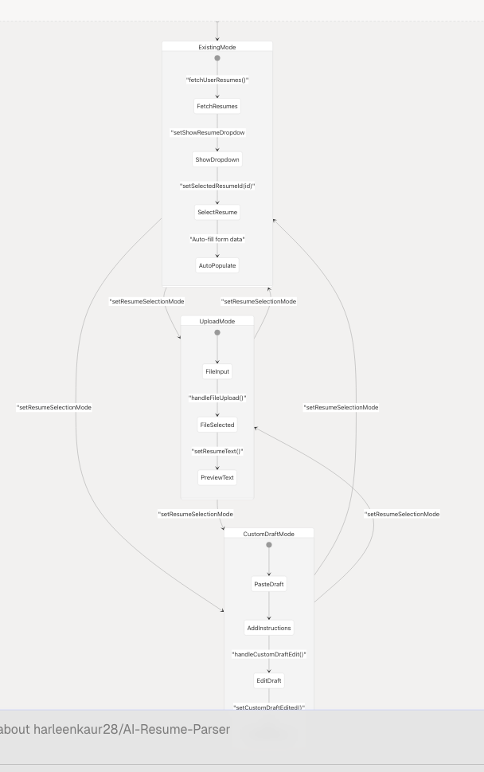
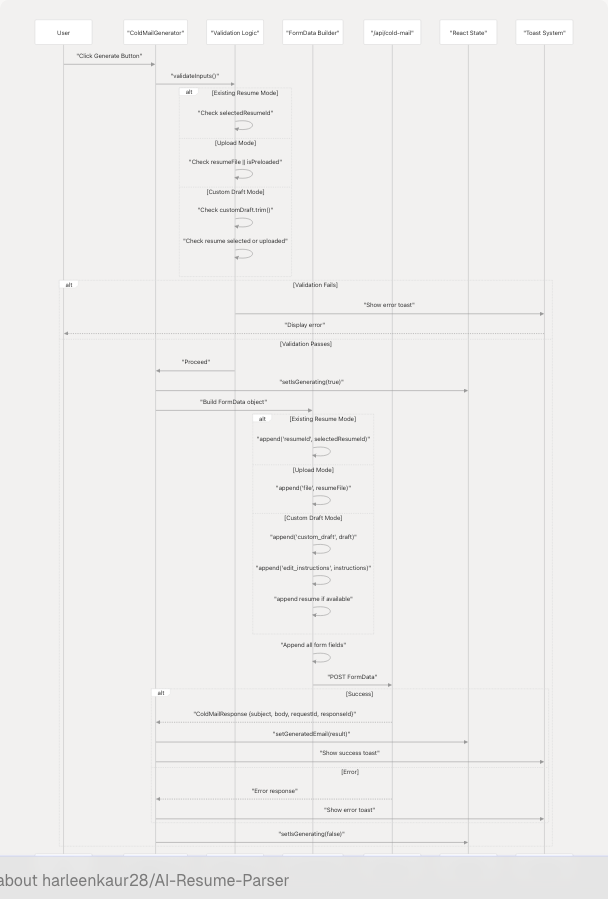
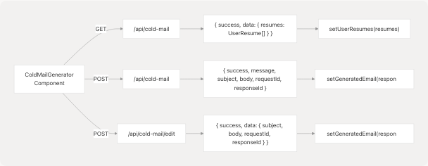

# Cold Mail Generator

> Source: https://deepwiki.com/harleenkaur28/AI-Resume-Parser/4.5.4-cold-mail-generator

# Cold Mail Generator

Relevant source files

* [frontend/app/dashboard/cold-mail/page.tsx](https://github.com/harleenkaur28/AI-Resume-Parser/blob/b2bbd83d/frontend/app/dashboard/cold-mail/page.tsx)
* [frontend/app/dashboard/hiring-assistant/page.tsx](https://github.com/harleenkaur28/AI-Resume-Parser/blob/b2bbd83d/frontend/app/dashboard/hiring-assistant/page.tsx)
* [frontend/components/cold-mail/ResumeSelection.tsx](https://github.com/harleenkaur28/AI-Resume-Parser/blob/b2bbd83d/frontend/components/cold-mail/ResumeSelection.tsx)
* [frontend/components/ui/toast.tsx](https://github.com/harleenkaur28/AI-Resume-Parser/blob/b2bbd83d/frontend/components/ui/toast.tsx)

## Purpose and Scope

The Cold Mail Generator is an AI-powered feature that enables users to create personalized cold emails for networking and job applications. This page documents the frontend implementation of the cold mail generation interface, including resume selection mechanisms, form handling, email generation workflows, and the edit/enhancement capabilities.

For backend cold mail generation service details including LLM integration and company research, see [3.3](/harleenkaur28/AI-Resume-Parser/3.3-cold-mail-generator-service). For the shared resume selection pattern used across features, compare with the Hiring Assistant implementation at [4.5.5](/harleenkaur28/AI-Resume-Parser/4.5.5-hiring-assistant).

---

## Component Architecture

The Cold Mail Generator page is structured as a multi-panel interface with distinct responsibilities for input collection, resume management, and output display.

### Component Hierarchy


```

**Sources:** [frontend/app/dashboard/cold-mail/page.tsx1-806](https://github.com/harleenkaur28/AI-Resume-Parser/blob/b2bbd83d/frontend/app/dashboard/cold-mail/page.tsx#L1-L806) [frontend/components/cold-mail/ResumeSelection.tsx1-697](https://github.com/harleenkaur28/AI-Resume-Parser/blob/b2bbd83d/frontend/components/cold-mail/ResumeSelection.tsx#L1-L697)

---

## State Management

The page maintains extensive state to handle the three-mode resume selection system, form data, generated content, and editing workflows.

### State Variables

| State Variable | Type | Purpose |
| --- | --- | --- |
| `isPageLoading` | `boolean` | Controls initial page load animation |
| `isGenerating` | `boolean` | Tracks email generation API call |
| `isEditing` | `boolean` | Tracks email editing API call |
| `generatedEmail` | `object | null` | Stores subject, body, requestId, responseId |
| `resumeFile` | `File | null` | Currently selected file in upload mode |
| `resumeText` | `string` | Preview text for uploaded file |
| `isPreloaded` | `boolean` | Indicates resume was pre-populated from analysis |
| `editMode` | `boolean` | Controls visibility of edit UI |
| `editInstructions` | `string` | User instructions for editing email |
| `customDraft` | `string` | User's pasted draft in custom draft mode |
| `customDraftEdited` | `string` | Enhanced version of custom draft |
| `userResumes` | `UserResume[]` | List of user's saved resumes |
| `selectedResumeId` | `string` | ID of selected existing resume |
| `isLoadingResumes` | `boolean` | Loading state for resume fetch |
| `showResumeDropdown` | `boolean` | Controls resume dropdown visibility |
| `resumeSelectionMode` | `"existing" | "upload" | "customDraft"` | Active resume selection mode |
| `formData` | `object` | Email generation form fields |

### Form Data Structure

```
```
interface FormData {
  recipient_name: string;
  recipient_designation: string;
  company_name: string;
  sender_name: string;
  sender_role_or_goal: string;
  key_points_to_include: string;
  additional_info_for_llm: string;
  company_url: string;
}
```
```

**Sources:** [frontend/app/dashboard/cold-mail/page.tsx34-73](https://github.com/harleenkaur28/AI-Resume-Parser/blob/b2bbd83d/frontend/app/dashboard/cold-mail/page.tsx#L34-L73)

---

## Resume Selection System

The Cold Mail Generator implements a three-mode resume selection system, allowing users to choose between existing resumes, upload new files, or provide custom drafts for enhancement.

### Resume Selection Mode Toggle

The mode toggle is implemented as a segmented control using three buttons that switch the `resumeSelectionMode` state. Each mode renders different UI components and validation logic.

```

```

**Sources:** [frontend/app/dashboard/cold-mail/page.tsx52-59](https://github.com/harleenkaur28/AI-Resume-Parser/blob/b2bbd83d/frontend/app/dashboard/cold-mail/page.tsx#L52-L59) [frontend/components/cold-mail/ResumeSelection.tsx107-138](https://github.com/harleenkaur28/AI-Resume-Parser/blob/b2bbd83d/frontend/components/cold-mail/ResumeSelection.tsx#L107-L138)

### Existing Resume Mode

In existing resume mode, the component fetches user's saved resumes via `GET /api/cold-mail` and displays them in a dropdown. Selecting a resume auto-populates form fields with candidate name and predicted field if available.

**Dropdown Implementation:**

* Uses `AnimatePresence` from Framer Motion for smooth open/close animations [frontend/components/cold-mail/ResumeSelection.tsx185-278](https://github.com/harleenkaur28/AI-Resume-Parser/blob/b2bbd83d/frontend/components/cold-mail/ResumeSelection.tsx#L185-L278)
* Displays resume metadata: custom name, candidate name, predicted field, upload date [frontend/components/cold-mail/ResumeSelection.tsx232-260](https://github.com/harleenkaur28/AI-Resume-Parser/blob/b2bbd83d/frontend/components/cold-mail/ResumeSelection.tsx#L232-L260)
* Auto-populates `sender_name` and `sender_role_or_goal` when resume is selected [frontend/components/cold-mail/ResumeSelection.tsx210-228](https://github.com/harleenkaur28/AI-Resume-Parser/blob/b2bbd83d/frontend/components/cold-mail/ResumeSelection.tsx#L210-L228)

### Upload Mode

Upload mode provides a drag-and-drop style file input accepting PDF, DOC, DOCX, TXT, and MD files. The file is stored in `resumeFile` state and a preview is generated.

**File Preview Logic:**

* For TXT/MD files: reads first 500 characters [frontend/components/cold-mail/ResumeSelection.tsx87-93](https://github.com/harleenkaur28/AI-Resume-Parser/blob/b2bbd83d/frontend/components/cold-mail/ResumeSelection.tsx#L87-L93)
* For binary files: shows filename and size [frontend/components/cold-mail/ResumeSelection.tsx95-99](https://github.com/harleenkaur28/AI-Resume-Parser/blob/b2bbd83d/frontend/components/cold-mail/ResumeSelection.tsx#L95-L99)
* Displays with green checkmark icon when file is loaded [frontend/components/cold-mail/ResumeSelection.tsx308-331](https://github.com/harleenkaur28/AI-Resume-Parser/blob/b2bbd83d/frontend/components/cold-mail/ResumeSelection.tsx#L308-L331)

### Custom Draft Mode

Custom draft mode allows users to paste an existing email draft and provide enhancement instructions. This mode optionally accepts a resume (either selected or uploaded) to enhance the draft with resume-relevant information.

**UI Components:**

1. Resume picker (optional) - same dropdown as existing mode [frontend/components/cold-mail/ResumeSelection.tsx391-526](https://github.com/harleenkaur28/AI-Resume-Parser/blob/b2bbd83d/frontend/components/cold-mail/ResumeSelection.tsx#L391-L526)
2. File upload (optional) - same as upload mode [frontend/components/cold-mail/ResumeSelection.tsx536-616](https://github.com/harleenkaur28/AI-Resume-Parser/blob/b2bbd83d/frontend/components/cold-mail/ResumeSelection.tsx#L536-L616)
3. Draft textarea - for pasting email draft [frontend/components/cold-mail/ResumeSelection.tsx642-647](https://github.com/harleenkaur28/AI-Resume-Parser/blob/b2bbd83d/frontend/components/cold-mail/ResumeSelection.tsx#L642-L647)
4. Edit instructions textarea - for enhancement guidance [frontend/components/cold-mail/ResumeSelection.tsx652-658](https://github.com/harleenkaur28/AI-Resume-Parser/blob/b2bbd83d/frontend/components/cold-mail/ResumeSelection.tsx#L652-L658)
5. "Edit My Draft" button - triggers `handleCustomDraftEdit()` [frontend/components/cold-mail/ResumeSelection.tsx660-678](https://github.com/harleenkaur28/AI-Resume-Parser/blob/b2bbd83d/frontend/components/cold-mail/ResumeSelection.tsx#L660-L678)

**Sources:** [frontend/components/cold-mail/ResumeSelection.tsx54-80](https://github.com/harleenkaur28/AI-Resume-Parser/blob/b2bbd83d/frontend/components/cold-mail/ResumeSelection.tsx#L54-L80) [frontend/components/cold-mail/ResumeSelection.tsx385-692](https://github.com/harleenkaur28/AI-Resume-Parser/blob/b2bbd83d/frontend/components/cold-mail/ResumeSelection.tsx#L385-L692)

---

## Email Generation Flow

The email generation process involves validation, form data collection, API communication, and state updates.

### Generation Sequence

```

```

**Sources:** [frontend/app/dashboard/cold-mail/page.tsx192-348](https://github.com/harleenkaur28/AI-Resume-Parser/blob/b2bbd83d/frontend/app/dashboard/cold-mail/page.tsx#L192-L348)

### Validation Logic

The `generateColdMail` function implements mode-specific validation:

**Existing Resume Mode Validation:**

```
```
if (!selectedResumeId) {
  toast({ 
    title: "Resume Required",
    description: "Please select a resume from your saved resumes.",
    variant: "destructive" 
  });
  return;
}
```
```

[frontend/app/dashboard/cold-mail/page.tsx193-201](https://github.com/harleenkaur28/AI-Resume-Parser/blob/b2bbd83d/frontend/app/dashboard/cold-mail/page.tsx#L193-L201)

**Upload Mode Validation:**

* Must have `resumeFile` or `isPreloaded` must be true
* If preloaded but no file re-uploaded, shows specific error [frontend/app/dashboard/cold-mail/page.tsx202-220](https://github.com/harleenkaur28/AI-Resume-Parser/blob/b2bbd83d/frontend/app/dashboard/cold-mail/page.tsx#L202-L220)

**Custom Draft Mode Validation:**

* Draft text must be non-empty
* Requires either `selectedResumeId` or `resumeFile` for enhancement [frontend/app/dashboard/cold-mail/page.tsx221-240](https://github.com/harleenkaur28/AI-Resume-Parser/blob/b2bbd83d/frontend/app/dashboard/cold-mail/page.tsx#L221-L240)

**Common Validation:**

```
```
if (!formData.recipient_name || !formData.company_name || !formData.sender_name) {
  toast({
    title: "Required Fields Missing",
    description: "Please fill in recipient name, company name, and your name.",
    variant: "destructive"
  });
  return;
}
```
```

[frontend/app/dashboard/cold-mail/page.tsx242-254](https://github.com/harleenkaur28/AI-Resume-Parser/blob/b2bbd83d/frontend/app/dashboard/cold-mail/page.tsx#L242-L254)

### FormData Construction

The function builds a `FormData` object with multipart/form-data encoding for file uploads:

**Resume Data Appending:**

* Existing mode: `formDataToSend.append("resumeId", selectedResumeId)` [frontend/app/dashboard/cold-mail/page.tsx263](https://github.com/harleenkaur28/AI-Resume-Parser/blob/b2bbd83d/frontend/app/dashboard/cold-mail/page.tsx#L263-L263)
* Upload mode: `formDataToSend.append("file", resumeFile!)` [frontend/app/dashboard/cold-mail/page.tsx265](https://github.com/harleenkaur28/AI-Resume-Parser/blob/b2bbd83d/frontend/app/dashboard/cold-mail/page.tsx#L265-L265)
* Custom draft mode: appends resume if available, plus draft and instructions [frontend/app/dashboard/cold-mail/page.tsx266-279](https://github.com/harleenkaur28/AI-Resume-Parser/blob/b2bbd83d/frontend/app/dashboard/cold-mail/page.tsx#L266-L279)

**Form Fields Appending:**
All form data fields are appended individually [frontend/app/dashboard/cold-mail/page.tsx281-302](https://github.com/harleenkaur28/AI-Resume-Parser/blob/b2bbd83d/frontend/app/dashboard/cold-mail/page.tsx#L281-L302)

**Endpoint Selection:**

* Custom draft mode uses `/api/cold-mail/edit` endpoint
* Other modes use `/api/cold-mail` endpoint [frontend/app/dashboard/cold-mail/page.tsx305-308](https://github.com/harleenkaur28/AI-Resume-Parser/blob/b2bbd83d/frontend/app/dashboard/cold-mail/page.tsx#L305-L308)

**Sources:** [frontend/app/dashboard/cold-mail/page.tsx192-348](https://github.com/harleenkaur28/AI-Resume-Parser/blob/b2bbd83d/frontend/app/dashboard/cold-mail/page.tsx#L192-L348)

---

## Email Editing Feature

The editing feature allows users to modify generated emails or enhance custom drafts with AI-powered refinement based on natural language instructions.

### Edit Workflow Diagram

```

```

**Sources:** [frontend/app/dashboard/cold-mail/page.tsx382-491](https://github.com/harleenkaur28/AI-Resume-Parser/blob/b2bbd83d/frontend/app/dashboard/cold-mail/page.tsx#L382-L491)

### Edit Function Implementation

The `editColdMail` function handles editing of already-generated emails:

1. **Pre-checks:** Verifies `generatedEmail` exists and `editInstructions` is non-empty [frontend/app/dashboard/cold-mail/page.tsx383-399](https://github.com/harleenkaur28/AI-Resume-Parser/blob/b2bbd83d/frontend/app/dashboard/cold-mail/page.tsx#L383-L399)
2. **Resume handling:** Uses existing selection mode and resume state [frontend/app/dashboard/cold-mail/page.tsx407-419](https://github.com/harleenkaur28/AI-Resume-Parser/blob/b2bbd83d/frontend/app/dashboard/cold-mail/page.tsx#L407-L419)
3. **FormData construction:** Includes original email subject/body and edit instructions [frontend/app/dashboard/cold-mail/page.tsx422-453](https://github.com/harleenkaur28/AI-Resume-Parser/blob/b2bbd83d/frontend/app/dashboard/cold-mail/page.tsx#L422-L453)
4. **API call:** POST to `/api/cold-mail/edit` with edit-specific fields [frontend/app/dashboard/cold-mail/page.tsx455-458](https://github.com/harleenkaur28/AI-Resume-Parser/blob/b2bbd83d/frontend/app/dashboard/cold-mail/page.tsx#L455-L458)
5. **State updates:** Updates generated email with new content, clears edit instructions, exits edit mode [frontend/app/dashboard/cold-mail/page.tsx462-470](https://github.com/harleenkaur28/AI-Resume-Parser/blob/b2bbd83d/frontend/app/dashboard/cold-mail/page.tsx#L462-L470)

### Custom Draft Enhancement

The `handleCustomDraftEdit` function enhances user-provided drafts:

**Key Differences from Standard Edit:**

* Operates on `customDraft` instead of `generatedEmail`
* Passes empty string for subject: `formDataToSend.append("generated_email_subject", "")` [frontend/app/dashboard/cold-mail/page.tsx548](https://github.com/harleenkaur28/AI-Resume-Parser/blob/b2bbd83d/frontend/app/dashboard/cold-mail/page.tsx#L548-L548)
* Uses `customDraft` as body for enhancement [frontend/app/dashboard/cold-mail/page.tsx549](https://github.com/harleenkaur28/AI-Resume-Parser/blob/b2bbd83d/frontend/app/dashboard/cold-mail/page.tsx#L549-L549)
* Updates `customDraftEdited` state with enhanced version [frontend/app/dashboard/cold-mail/page.tsx558](https://github.com/harleenkaur28/AI-Resume-Parser/blob/b2bbd83d/frontend/app/dashboard/cold-mail/page.tsx#L558-L558)
* Also updates `generatedEmail` so enhanced draft displays in output panel [frontend/app/dashboard/cold-mail/page.tsx560-565](https://github.com/harleenkaur28/AI-Resume-Parser/blob/b2bbd83d/frontend/app/dashboard/cold-mail/page.tsx#L560-L565)

**Sources:** [frontend/app/dashboard/cold-mail/page.tsx493-586](https://github.com/harleenkaur28/AI-Resume-Parser/blob/b2bbd83d/frontend/app/dashboard/cold-mail/page.tsx#L493-L586)

---

## Pre-population Mechanism

The Cold Mail Generator supports automatic pre-population of form fields and resume data when navigating from the Resume Analysis page.

### Pre-population Flow

```

```

**Sources:** [frontend/app/dashboard/cold-mail/page.tsx112-162](https://github.com/harleenkaur28/AI-Resume-Parser/blob/b2bbd83d/frontend/app/dashboard/cold-mail/page.tsx#L112-L162)

### Pre-population Data Mapping

The `useEffect` hook checks localStorage on mount and maps analysis data to form fields:

| Analysis Data Field | Form Field | Mapping Logic |
| --- | --- | --- |
| `name` | `sender_name` | Direct copy if not already set |
| `skills` (array) | `key_points_to_include` | Joined with ", " separator |
| `predicted_field` | `sender_role_or_goal` | Direct copy if not already set |

**File Data Handling:**

* Constructs preview text: `"${name} (${size} KB) - Pre-loaded from analysis"` [frontend/app/dashboard/cold-mail/page.tsx129-133](https://github.com/harleenkaur28/AI-Resume-Parser/blob/b2bbd83d/frontend/app/dashboard/cold-mail/page.tsx#L129-L133)
* Sets `isPreloaded` flag to track that file needs re-upload [frontend/app/dashboard/cold-mail/page.tsx134](https://github.com/harleenkaur28/AI-Resume-Parser/blob/b2bbd83d/frontend/app/dashboard/cold-mail/page.tsx#L134-L134)
* Switches to upload mode automatically [frontend/app/dashboard/cold-mail/page.tsx135](https://github.com/harleenkaur28/AI-Resume-Parser/blob/b2bbd83d/frontend/app/dashboard/cold-mail/page.tsx#L135-L135)

**Cleanup:**
Data is removed from localStorage after 100ms delay to ensure processing completes [frontend/app/dashboard/cold-mail/page.tsx146-149](https://github.com/harleenkaur28/AI-Resume-Parser/blob/b2bbd83d/frontend/app/dashboard/cold-mail/page.tsx#L146-L149)

**Sources:** [frontend/app/dashboard/cold-mail/page.tsx119-159](https://github.com/harleenkaur28/AI-Resume-Parser/blob/b2bbd83d/frontend/app/dashboard/cold-mail/page.tsx#L119-L159)

---

## API Integration

The Cold Mail Generator integrates with three backend endpoints for resume fetching, email generation, and email editing.

### API Endpoints

```


### Fetch Resumes Endpoint

**Request:**

```
```
const response = await fetch("/api/cold-mail", {
  method: "GET",
});
```
```

[frontend/app/dashboard/cold-mail/page.tsx78-80](https://github.com/harleenkaur28/AI-Resume-Parser/blob/b2bbd83d/frontend/app/dashboard/cold-mail/page.tsx#L78-L80)

**Response Type:**

```
```
interface FetchResumesResponse {
  success: boolean;
  data?: {
    resumes: UserResume[];
  };
}

interface UserResume {
  id: string;
  customName: string;
  uploadDate: string;
  candidateName?: string;
  predictedField?: string;
}
```
```

[frontend/app/dashboard/cold-mail/page.tsx26-32](https://github.com/harleenkaur28/AI-Resume-Parser/blob/b2bbd83d/frontend/app/dashboard/cold-mail/page.tsx#L26-L32)

**Usage:** Called in `fetchUserResumes()` during component mount and updates `userResumes` state [frontend/app/dashboard/cold-mail/page.tsx75-93](https://github.com/harleenkaur28/AI-Resume-Parser/blob/b2bbd83d/frontend/app/dashboard/cold-mail/page.tsx#L75-L93)

### Generate Email Endpoint

**Request:**

```
```
const formDataToSend = new FormData();
// Add resume data based on mode
// Add all form fields
// Optional: company_url

const response = await fetch("/api/cold-mail", {
  method: "POST",
  body: formDataToSend,
});
```
```

[frontend/app/dashboard/cold-mail/page.tsx310-313](https://github.com/harleenkaur28/AI-Resume-Parser/blob/b2bbd83d/frontend/app/dashboard/cold-mail/page.tsx#L310-L313)

**Response Type:**

```
```
interface ColdMailResponse {
  success: boolean;
  message: string;
  subject: string;
  body: string;
  requestId?: string;
  responseId?: string;
}
```
```

[frontend/app/dashboard/cold-mail/page.tsx17-24](https://github.com/harleenkaur28/AI-Resume-Parser/blob/b2bbd83d/frontend/app/dashboard/cold-mail/page.tsx#L17-L24)

**FormData Fields:**

* `resumeId` (existing mode) or `file` (upload mode) or both conditionally (custom draft)
* `recipient_name`, `recipient_designation`, `company_name` (required)
* `sender_name`, `sender_role_or_goal`, `key_points_to_include` (required)
* `additional_info_for_llm` (optional)
* `company_url` (optional)
* `custom_draft` (custom draft mode only)
* `edit_instructions` (custom draft mode only)

### Edit Email Endpoint

**Request:**

```
```
const formDataToSend = new FormData();
// Add resume data
// Add all form fields
// Add edit-specific fields:
formDataToSend.append("generated_email_subject", generatedEmail.subject);
formDataToSend.append("generated_email_body", generatedEmail.body);
formDataToSend.append("edit_inscription", editInstructions);
formDataToSend.append("cold_mail_request_id", generatedEmail.requestId);

const response = await fetch("/api/cold-mail/edit", {
  method: "POST",
  body: formDataToSend,
});
```
```

[frontend/app/dashboard/cold-mail/page.tsx404-458](https://github.com/harleenkaur28/AI-Resume-Parser/blob/b2bbd83d/frontend/app/dashboard/cold-mail/page.tsx#L404-L458)

**Response Structure:** Same as `ColdMailResponse` but wrapped in data object:

```
```
interface EditResponse {
  success: boolean;
  message?: string;
  data: {
    subject: string;
    body: string;
    requestId?: string;
    responseId?: string;
  };
}
```
```

[frontend/app/dashboard/cold-mail/page.tsx460-468](https://github.com/harleenkaur28/AI-Resume-Parser/blob/b2bbd83d/frontend/app/dashboard/cold-mail/page.tsx#L460-L468)

**Sources:** [frontend/app/dashboard/cold-mail/page.tsx75-93](https://github.com/harleenkaur28/AI-Resume-Parser/blob/b2bbd83d/frontend/app/dashboard/cold-mail/page.tsx#L75-L93) [frontend/app/dashboard/cold-mail/page.tsx192-348](https://github.com/harleenkaur28/AI-Resume-Parser/blob/b2bbd83d/frontend/app/dashboard/cold-mail/page.tsx#L192-L348) [frontend/app/dashboard/cold-mail/page.tsx382-491](https://github.com/harleenkaur28/AI-Resume-Parser/blob/b2bbd83d/frontend/app/dashboard/cold-mail/page.tsx#L382-L491)

---

## User Feedback System

The page implements comprehensive user feedback through toast notifications and loading states.

### Toast Notifications

The component uses the `useToast` hook to display feedback for various user actions:

**Success Notifications:**

* Resume pre-loaded: "Resume Pre-loaded!" [frontend/app/dashboard/cold-mail/page.tsx151-155](https://github.com/harleenkaur28/AI-Resume-Parser/blob/b2bbd83d/frontend/app/dashboard/cold-mail/page.tsx#L151-L155)
* Email generated: "Email Generated Successfully!" with mode-specific description [frontend/app/dashboard/cold-mail/page.tsx324-332](https://github.com/harleenkaur28/AI-Resume-Parser/blob/b2bbd83d/frontend/app/dashboard/cold-mail/page.tsx#L324-L332)
* Email edited: "Email Edited Successfully!" [frontend/app/dashboard/cold-mail/page.tsx471-475](https://github.com/harleenkaur28/AI-Resume-Parser/blob/b2bbd83d/frontend/app/dashboard/cold-mail/page.tsx#L471-L475)
* Draft enhanced: "Draft Enhanced Successfully!" [frontend/app/dashboard/cold-mail/page.tsx566-570](https://github.com/harleenkaur28/AI-Resume-Parser/blob/b2bbd83d/frontend/app/dashboard/cold-mail/page.tsx#L566-L570)
* Content copied: "Copied!" [frontend/app/dashboard/cold-mail/page.tsx353-356](https://github.com/harleenkaur28/AI-Resume-Parser/blob/b2bbd83d/frontend/app/dashboard/cold-mail/page.tsx#L353-L356)

**Error Notifications:**

* Resume required [frontend/app/dashboard/cold-mail/page.tsx195-200](https://github.com/harleenkaur28/AI-Resume-Parser/blob/b2bbd83d/frontend/app/dashboard/cold-mail/page.tsx#L195-L200)
* Draft required [frontend/app/dashboard/cold-mail/page.tsx222-229](https://github.com/harleenkaur28/AI-Resume-Parser/blob/b2bbd83d/frontend/app/dashboard/cold-mail/page.tsx#L222-L229)
* Required fields missing [frontend/app/dashboard/cold-mail/page.tsx247-253](https://github.com/harleenkaur28/AI-Resume-Parser/blob/b2bbd83d/frontend/app/dashboard/cold-mail/page.tsx#L247-L253)
* Generation failed [frontend/app/dashboard/cold-mail/page.tsx337-344](https://github.com/harleenkaur28/AI-Resume-Parser/blob/b2bbd83d/frontend/app/dashboard/cold-mail/page.tsx#L337-L344)
* Edit failed [frontend/app/dashboard/cold-mail/page.tsx480-487](https://github.com/harleenkaur28/AI-Resume-Parser/blob/b2bbd83d/frontend/app/dashboard/cold-mail/page.tsx#L480-L487)
* Enhancement failed [frontend/app/dashboard/cold-mail/page.tsx575-582](https://github.com/harleenkaur28/AI-Resume-Parser/blob/b2bbd83d/frontend/app/dashboard/cold-mail/page.tsx#L575-L582)
* Copy failed [frontend/app/dashboard/cold-mail/page.tsx359-363](https://github.com/harleenkaur28/AI-Resume-Parser/blob/b2bbd83d/frontend/app/dashboard/cold-mail/page.tsx#L359-L363)

### Loading States

The page implements multiple loading indicators:

**`PageLoader` Component:**

* Shows during initial page load (`isPageLoading`)
* Hides content until data is ready [frontend/app/dashboard/cold-mail/page.tsx590-591](https://github.com/harleenkaur28/AI-Resume-Parser/blob/b2bbd83d/frontend/app/dashboard/cold-mail/page.tsx#L590-L591)

**`LoadingOverlay` Component:**

* Displays during email generation (`isGenerating`)
* Displays during email editing (`isEditing`)
* Provides visual feedback that operation is in progress [frontend/app/dashboard/cold-mail/page.tsx593](https://github.com/harleenkaur28/AI-Resume-Parser/blob/b2bbd83d/frontend/app/dashboard/cold-mail/page.tsx#L593-L593)

**Inline Loaders:**

* Resume dropdown shows spinner while `isLoadingResumes` [frontend/components/cold-mail/ResumeSelection.tsx194-201](https://github.com/harleenkaur28/AI-Resume-Parser/blob/b2bbd83d/frontend/components/cold-mail/ResumeSelection.tsx#L194-L201)
* Generate button shows animated spinner and progress bar while generating [frontend/app/dashboard/cold-mail/page.tsx719-773](https://github.com/harleenkaur28/AI-Resume-Parser/blob/b2bbd83d/frontend/app/dashboard/cold-mail/page.tsx#L719-L773)
* Edit Draft button shows spinner while editing [frontend/components/cold-mail/ResumeSelection.tsx667-671](https://github.com/harleenkaur28/AI-Resume-Parser/blob/b2bbd83d/frontend/components/cold-mail/ResumeSelection.tsx#L667-L671)

**Button Disabled States:**

* Generate button disabled when missing required data or during generation [frontend/app/dashboard/cold-mail/page.tsx703-715](https://github.com/harleenkaur28/AI-Resume-Parser/blob/b2bbd83d/frontend/app/dashboard/cold-mail/page.tsx#L703-L715)
* Edit button disabled when no instructions provided or during editing [frontend/components/cold-mail/ResumeSelection.tsx662-664](https://github.com/harleenkaur28/AI-Resume-Parser/blob/b2bbd83d/frontend/components/cold-mail/ResumeSelection.tsx#L662-L664)

**Sources:** [frontend/app/dashboard/cold-mail/page.tsx10](https://github.com/harleenkaur28/AI-Resume-Parser/blob/b2bbd83d/frontend/app/dashboard/cold-mail/page.tsx#L10-L10) [frontend/app/dashboard/cold-mail/page.tsx350-364](https://github.com/harleenkaur28/AI-Resume-Parser/blob/b2bbd83d/frontend/app/dashboard/cold-mail/page.tsx#L350-L364)

---

## Utility Functions

The page implements several utility functions for user interactions with generated content.

### Copy to Clipboard

The `copyToClipboard` function uses the Clipboard API to copy email content:

```
```
const copyToClipboard = async (text: string) => {
  try {
    await navigator.clipboard.writeText(text);
    toast({
      title: "Copied!",
      description: "Email content copied to clipboard.",
    });
  } catch (error) {
    toast({
      title: "Copy Failed",
      description: "Could not copy to clipboard.",
      variant: "destructive",
    });
  }
};
```
```

[frontend/app/dashboard/cold-mail/page.tsx350-364](https://github.com/harleenkaur28/AI-Resume-Parser/blob/b2bbd83d/frontend/app/dashboard/cold-mail/page.tsx#L350-L364)

This function is passed to `GeneratedEmailPanel` for copy buttons on subject and body sections.

### Download as Text

The `downloadAsText` function creates a downloadable text file containing the generated email:

```
```
const downloadAsText = () => {
  if (!generatedEmail) return;

  const content = `Subject: ${generatedEmail.subject}\n\n${generatedEmail.body}`;
  const blob = new Blob([content], { type: "text/plain" });
  const url = URL.createObjectURL(blob);
  const a = document.createElement("a");
  a.href = url;
  a.download = "cold-email.txt";
  document.body.appendChild(a);
  a.click();
  document.body.removeChild(a);
  URL.revokeObjectURL(url);
};
```
```

[frontend/app/dashboard/cold-mail/page.tsx366-379](https://github.com/harleenkaur28/AI-Resume-Parser/blob/b2bbd83d/frontend/app/dashboard/cold-mail/page.tsx#L366-L379)

**Process:**

1. Combines subject and body with formatting
2. Creates a `Blob` with `text/plain` MIME type
3. Generates object URL for the blob
4. Creates temporary anchor element and triggers click
5. Cleans up DOM and revokes object URL

**Sources:** [frontend/app/dashboard/cold-mail/page.tsx350-379](https://github.com/harleenkaur28/AI-Resume-Parser/blob/b2bbd83d/frontend/app/dashboard/cold-mail/page.tsx#L350-L379)

---

## Responsive Design

The page implements mobile-first responsive design with breakpoint-specific adaptations.

### Layout Adaptations

**Container Padding:**

```
px-4 sm:px-6 lg:px-8 py-4 sm:py-8
```

* Mobile: 16px horizontal, 16px vertical
* Tablet (sm): 24px horizontal, 32px vertical
* Desktop (lg): 32px horizontal, 32px vertical

**Grid Layout:**

```
grid grid-cols-1 xl:grid-cols-2 gap-6 lg:gap-8
```

* Mobile/Tablet: Single column stacking
* Desktop (xl): Two-column side-by-side layout [frontend/app/dashboard/cold-mail/page.tsx637](https://github.com/harleenkaur28/AI-Resume-Parser/blob/b2bbd83d/frontend/app/dashboard/cold-mail/page.tsx#L637-L637)

**Header Typography:**

```
text-3xl sm:text-4xl md:text-5xl
```

* Mobile: 30px
* Tablet (sm): 36px
* Desktop (md): 48px [frontend/app/dashboard/cold-mail/page.tsx627](https://github.com/harleenkaur28/AI-Resume-Parser/blob/b2bbd83d/frontend/app/dashboard/cold-mail/page.tsx#L627-L627)

**Back Button Text:**

```
```
<span className="hidden sm:inline">Back to Dashboard</span>
<span className="sm:hidden">Back</span>
```
```

Shows abbreviated text on mobile [frontend/app/dashboard/cold-mail/page.tsx610-611](https://github.com/harleenkaur28/AI-Resume-Parser/blob/b2bbd83d/frontend/app/dashboard/cold-mail/page.tsx#L610-L611)

### Component-Level Responsiveness

**Resume Dropdown:**

* Fixed height with scrolling on mobile: `max-h-64 overflow-y-auto` [frontend/components/cold-mail/ResumeSelection.tsx203](https://github.com/harleenkaur28/AI-Resume-Parser/blob/b2bbd83d/frontend/components/cold-mail/ResumeSelection.tsx#L203-L203)
* Truncates long resume names: `truncate` utility [frontend/components/cold-mail/ResumeSelection.tsx234](https://github.com/harleenkaur28/AI-Resume-Parser/blob/b2bbd83d/frontend/components/cold-mail/ResumeSelection.tsx#L234-L234)

**File Upload Label:**

* Height adjusts: `h-28` (112px) maintains consistent touch target [frontend/components/cold-mail/ResumeSelection.tsx302](https://github.com/harleenkaur28/AI-Resume-Parser/blob/b2bbd83d/frontend/components/cold-mail/ResumeSelection.tsx#L302-L302)
* File format badges stack with `space-x-2` [frontend/components/cold-mail/ResumeSelection.tsx345-358](https://github.com/harleenkaur28/AI-Resume-Parser/blob/b2bbd83d/frontend/components/cold-mail/ResumeSelection.tsx#L345-L358)

**Generate Button:**

* Full width on all screen sizes: `w-full` [frontend/app/dashboard/cold-mail/page.tsx716](https://github.com/harleenkaur28/AI-Resume-Parser/blob/b2bbd83d/frontend/app/dashboard/cold-mail/page.tsx#L716-L716)
* Fixed height for consistent touch target: `h-14` [frontend/app/dashboard/cold-mail/page.tsx716](https://github.com/harleenkaur28/AI-Resume-Parser/blob/b2bbd83d/frontend/app/dashboard/cold-mail/page.tsx#L716-L716)
* Text adjusts for loading state [frontend/app/dashboard/cold-mail/page.tsx739-760](https://github.com/harleenkaur28/AI-Resume-Parser/blob/b2bbd83d/frontend/app/dashboard/cold-mail/page.tsx#L739-L760)

**Sources:** [frontend/app/dashboard/cold-mail/page.tsx595-637](https://github.com/harleenkaur28/AI-Resume-Parser/blob/b2bbd83d/frontend/app/dashboard/cold-mail/page.tsx#L595-L637) [frontend/components/cold-mail/ResumeSelection.tsx104-363](https://github.com/harleenkaur28/AI-Resume-Parser/blob/b2bbd83d/frontend/components/cold-mail/ResumeSelection.tsx#L104-L363)