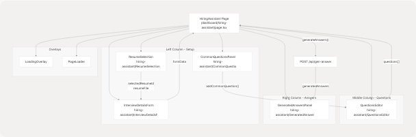
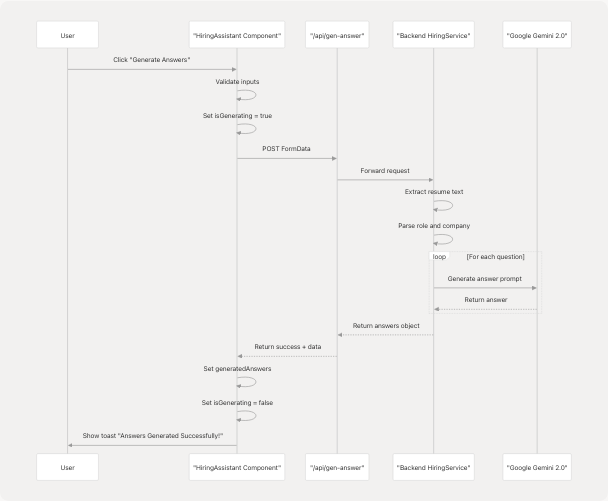

# Hiring Assistant

This document describes the Hiring Assistant feature, an AI-powered interview preparation tool that generates personalized answers to interview questions based on the user's resume and target role. The page is located at `/dashboard/hiring-assistant` and provides job seekers with tailored responses for common and custom interview questions.

For information about the backend service that powers this feature, see [3.4](3.4-hiring-assistant-service). For cold email generation, see [4.5.4](4.5.4-cold-mail-generator). For the detailed analysis view that feeds data into this feature, see [4.5.3](4.5.3-detailed-analysis-view).

---

## Overview

The Hiring Assistant page enables users to generate AI-powered interview answers by providing:

* Their resume (from saved resumes or new upload)
* Target role and company information
* A list of interview questions (custom or from common templates)
* Optional company knowledge and company URL for context enrichment

The feature uses the `/api/gen-answer` endpoint which invokes the backend's `HiringService` to generate role-specific, personalized answers using Google Gemini 2.0 Flash.

**Sources:** [frontend/app/dashboard/hiring-assistant/page.tsx1-579](https://github.com/harleenkaur28/AI-Resume-Parser/blob/b2bbd83d/frontend/app/dashboard/hiring-assistant/page.tsx#L1-L579)

---

## Page Architecture

### Component Structure

The page is built using a three-column responsive layout with specialized components for each section:



**Sources:** [frontend/app/dashboard/hiring-assistant/page.tsx419-548](https://github.com/harleenkaur28/AI-Resume-Parser/blob/b2bbd83d/frontend/app/dashboard/hiring-assistant/page.tsx#L419-L548)

---

## State Management

### Primary State Variables

The `HiringAssistant` component manages multiple categories of state:

| State Category | Variables | Purpose |
| --- | --- | --- |
| **Loading States** | `isPageLoading`, `isGenerating` | Control UI loading indicators and disable actions |
| **Generated Content** | `generatedAnswers` | Object mapping questions to AI-generated answers |
| **Resume Selection** | `resumeFile`, `resumeText`, `isPreloaded`, `resumeSelectionMode` | Handle resume upload or selection |
| **Resume List** | `userResumes`, `selectedResumeId`, `isLoadingResumes`, `showResumeDropdown` | Manage existing resumes dropdown |
| **Questions** | `questions` | Array of interview question strings |
| **Form Data** | `formData` | Contains `role`, `company`, `word_limit`, `user_company_knowledge`, `company_url` |

```
interface HiringAssistantRequest {
  resume_file: File;
  role: string;
  company: string;
  questions_list: string[];
  word_limit: number;
  user_company_knowledge?: string;
  company_url?: string;
}

interface HiringAssistantResponse {
  success: boolean;
  message: string;
  data: { [key: string]: string };  // question -> answer mapping
}

interface UserResume {
  id: string;
  customName: string;
  uploadDate: string;
  candidateName?: string;
  predictedField?: string;
}
```

**Sources:** [frontend/app/dashboard/hiring-assistant/page.tsx19-41](https://github.com/harleenkaur28/AI-Resume-Parser/blob/b2bbd83d/frontend/app/dashboard/hiring-assistant/page.tsx#L19-L41) [frontend/app/dashboard/hiring-assistant/page.tsx44-72](https://github.com/harleenkaur28/AI-Resume-Parser/blob/b2bbd83d/frontend/app/dashboard/hiring-assistant/page.tsx#L44-L72)

---

## Resume Selection Modes

The feature supports two resume input modes controlled by `resumeSelectionMode`:

1. **`"existing"`** - Select from previously uploaded and analyzed resumes
2. **`"upload"`** - Upload a new resume file (PDF, DOC, DOCX, TXT, MD)

The `ResumeSelection` component renders different UI based on the active mode:

* **Existing mode**: Displays a dropdown with `userResumes` fetched from `/api/gen-answer` GET
* **Upload mode**: Shows a drag-and-drop file upload area

**Sources:** [frontend/app/dashboard/hiring-assistant/page.tsx59-61](https://github.com/harleenkaur28/AI-Resume-Parser/blob/b2bbd83d/frontend/app/dashboard/hiring-assistant/page.tsx#L59-L61) [frontend/app/dashboard/hiring-assistant/page.tsx88-106](https://github.com/harleenkaur28/AI-Resume-Parser/blob/b2bbd83d/frontend/app/dashboard/hiring-assistant/page.tsx#L88-L106)

---

## Data Pre-population from Resume Analysis

The page checks `localStorage` on mount for pre-populated data from the Resume Analysis feature:


This flow enables seamless navigation from the analysis view to interview preparation without requiring the user to re-upload their resume.

**Sources:** [frontend/app/dashboard/hiring-assistant/page.tsx125-173](https://github.com/harleenkaur28/AI-Resume-Parser/blob/b2bbd83d/frontend/app/dashboard/hiring-assistant/page.tsx#L125-L173)

---

## Interview Question Management

### Common Questions

The page provides 10 pre-defined common interview questions users can quickly add:

```
const commonQuestions = [
  "Tell me about yourself.",
  "Why do you want to work for our company?",
  "What are your greatest strengths?",
  "What is your biggest weakness?",
  "Where do you see yourself in 5 years?",
  "Why are you leaving your current job?",
  "Describe a challenging project you worked on.",
  "How do you handle stress and pressure?",
  "What motivates you?",
  "Do you have any questions for us?",
];
```

**Sources:** [frontend/app/dashboard/hiring-assistant/page.tsx74-85](https://github.com/harleenkaur28/AI-Resume-Parser/blob/b2bbd83d/frontend/app/dashboard/hiring-assistant/page.tsx#L74-L85)

### Question Operations

| Function | Parameters | Description |
| --- | --- | --- |
| `addQuestion()` | None | Appends empty string to `questions` array |
| `removeQuestion(index)` | `index: number` | Removes question at index (minimum 1 question required) |
| `updateQuestion(index, value)` | `index: number`, `value: string` | Updates question text at index |
| `addCommonQuestion(question)` | `question: string` | Adds common question if not already in list |

**Sources:** [frontend/app/dashboard/hiring-assistant/page.tsx203-223](https://github.com/harleenkaur28/AI-Resume-Parser/blob/b2bbd83d/frontend/app/dashboard/hiring-assistant/page.tsx#L203-L223)

---

## Answer Generation Flow

### Validation and Request Construction

The `generateAnswers()` function performs multi-step validation before sending the request:

1. **Resume validation**: Check based on `resumeSelectionMode`
   * `"existing"`: Ensure `selectedResumeId` is set
   * `"upload"`: Ensure `resumeFile` exists (or `isPreloaded`)
2. **Form validation**: Require `role` and `company`
3. **Questions validation**: Filter and require at least one non-empty question

### FormData Construction

```
const formDataToSend = new FormData();

// Resume data based on mode
if (resumeSelectionMode === "existing") {
  formDataToSend.append("resumeId", selectedResumeId);
} else {
  formDataToSend.append("file", resumeFile!);
}

// Required fields
formDataToSend.append("role", formData.role);
formDataToSend.append("company_name", formData.company);
formDataToSend.append("word_limit", formData.word_limit.toString());
formDataToSend.append("questions", JSON.stringify(validQuestions));

// Optional fields
if (formData.user_company_knowledge) {
  formDataToSend.append("user_knowledge", formData.user_company_knowledge);
}
if (formData.company_url) {
  formDataToSend.append("company_url", formData.company_url);
}
```

**Sources:** [frontend/app/dashboard/hiring-assistant/page.tsx225-300](https://github.com/harleenkaur28/AI-Resume-Parser/blob/b2bbd83d/frontend/app/dashboard/hiring-assistant/page.tsx#L225-L300)

---

## API Integration

### Endpoints

The Hiring Assistant interacts with `/api/gen-answer` via two operations:

| Method | Purpose | Request Format | Response Format |
| --- | --- | --- | --- |
| `GET` | Fetch user's saved resumes | None | `{ success: bool, data: { resumes: UserResume[] } }` |
| `POST` | Generate interview answers | `FormData` with resume, role, company, questions | `{ success: bool, message: string, data: { [question: string]: answer: string } }` |

### Request Flow



**Sources:** [frontend/app/dashboard/hiring-assistant/page.tsx302-330](https://github.com/harleenkaur28/AI-Resume-Parser/blob/b2bbd83d/frontend/app/dashboard/hiring-assistant/page.tsx#L302-L330)

---

## User Interactions

### Copy and Download Functions

The generated answers can be exported in two ways:

**Copy to Clipboard**:

```
const copyToClipboard = async (text: string) => {
  try {
    await navigator.clipboard.writeText(text);
    toast({ title: "Copied!", description: "Answer copied to clipboard." });
  } catch (error) {
    toast({ title: "Copy Failed", variant: "destructive" });
  }
};
```

**Download as Text File**:

```
const downloadAsText = () => {
  let content = `Interview Answers for ${formData.role} at ${formData.company}\n\n`;
  Object.entries(generatedAnswers).forEach(([question, answer]) => {
    content += `Q: ${question}\n\nA: ${answer}\n\n---\n\n`;
  });

  const blob = new Blob([content], { type: "text/plain" });
  const url = URL.createObjectURL(blob);
  const a = document.createElement("a");
  a.href = url;
  a.download = "interview-answers.txt";
  // ... trigger download
};
```

**Sources:** [frontend/app/dashboard/hiring-assistant/page.tsx333-365](https://github.com/harleenkaur28/AI-Resume-Parser/blob/b2bbd83d/frontend/app/dashboard/hiring-assistant/page.tsx#L333-L365)

---

## UI Layout and Responsive Design

### Grid Layout

The page uses a responsive 3-column grid on large screens, stacking vertically on mobile:

```
// lg:grid-cols-3 gap-6 lg:gap-8
<div className="grid grid-cols-1 lg:grid-cols-3 gap-6 lg:gap-8 lg:items-start">
  {/* Column 1: Interview Details + Common Questions */}
  <div className="lg:col-span-1">
    <Card>...</Card>
    <CommonQuestionsPanel />
  </div>

  {/* Column 2: Questions Editor */}
  <div className="lg:col-span-1">
    <QuestionsEditor />
  </div>

  {/* Column 3: Generated Answers */}
  <div className="lg:col-span-1">
    <GeneratedAnswersPanel />
  </div>
</div>
```

**Sources:** [frontend/app/dashboard/hiring-assistant/page.tsx419-549](https://github.com/harleenkaur28/AI-Resume-Parser/blob/b2bbd83d/frontend/app/dashboard/hiring-assistant/page.tsx#L419-L549)

### Loading States

Two loading overlays provide feedback during operations:

1. **`PageLoader`**: Full-screen initial page load (100ms delay)
2. **`LoadingOverlay`**: Semi-transparent overlay during answer generation with "Generating answers..." text

**Sources:** [frontend/app/dashboard/hiring-assistant/page.tsx370-373](https://github.com/harleenkaur28/AI-Resume-Parser/blob/b2bbd83d/frontend/app/dashboard/hiring-assistant/page.tsx#L370-L373)

---

## Form Data Structure

The `formData` state object contains all interview context:

| Field | Type | Required | Default | Description |
| --- | --- | --- | --- | --- |
| `role` | `string` | Yes | `""` | Target job role/title |
| `company` | `string` | Yes | `""` | Target company name |
| `word_limit` | `number` | No | `150` | Maximum words per answer |
| `user_company_knowledge` | `string` | No | `""` | User's existing knowledge about the company |
| `company_url` | `string` | No | `""` | Company website URL for context gathering |

The `role` field is automatically populated from `analysisData.predicted_field` when data is pre-loaded from localStorage.

**Sources:** [frontend/app/dashboard/hiring-assistant/page.tsx65-71](https://github.com/harleenkaur28/AI-Resume-Parser/blob/b2bbd83d/frontend/app/dashboard/hiring-assistant/page.tsx#L65-L71) [frontend/app/dashboard/hiring-assistant/page.tsx150-154](https://github.com/harleenkaur28/AI-Resume-Parser/blob/b2bbd83d/frontend/app/dashboard/hiring-assistant/page.tsx#L150-L154)

---

## Error Handling and Validation

The component implements comprehensive validation at multiple levels:

### Client-Side Validation


**Sources:** [frontend/app/dashboard/hiring-assistant/page.tsx226-273](https://github.com/harleenkaur28/AI-Resume-Parser/blob/b2bbd83d/frontend/app/dashboard/hiring-assistant/page.tsx#L226-L273)

### Toast Notifications

All user feedback is delivered through the `useToast` hook with standardized messages:

| Trigger | Toast Type | Title | Description |
| --- | --- | --- | --- |
| Resume pre-loaded | Success | "Resume Pre-loaded!" | "Your resume and details have been automatically filled..." |
| Missing resume | Destructive | "Resume Required" | "Please select a resume from your saved resumes." |
| Missing form fields | Destructive | "Required Fields Missing" | "Please fill in the role and company name." |
| No questions | Destructive | "Questions Required" | "Please add at least one interview question." |
| Generation success | Success | "Answers Generated Successfully!" | "Your interview answers have been generated..." |
| Generation failure | Destructive | "Generation Failed" | Error message from API or generic error |
| Copy success | Default | "Copied!" | "Answer copied to clipboard." |
| Copy failure | Destructive | "Copy Failed" | "Could not copy to clipboard." |

**Sources:** [frontend/app/dashboard/hiring-assistant/page.tsx162-166](https://github.com/harleenkaur28/AI-Resume-Parser/blob/b2bbd83d/frontend/app/dashboard/hiring-assistant/page.tsx#L162-L166) [frontend/app/dashboard/hiring-assistant/page.tsx229-327](https://github.com/harleenkaur28/AI-Resume-Parser/blob/b2bbd83d/frontend/app/dashboard/hiring-assistant/page.tsx#L229-L327) [frontend/app/dashboard/hiring-assistant/page.tsx333-346](https://github.com/harleenkaur28/AI-Resume-Parser/blob/b2bbd83d/frontend/app/dashboard/hiring-assistant/page.tsx#L333-L346)

---

## Complete Data Flow

### End-to-End Sequence


**Sources:** [frontend/app/dashboard/hiring-assistant/page.tsx125-330](https://github.com/harleenkaur28/AI-Resume-Parser/blob/b2bbd83d/frontend/app/dashboard/hiring-assistant/page.tsx#L125-L330)

---

## Key Component Dependencies

The Hiring Assistant page imports and uses the following components:

| Component | Path | Purpose |
| --- | --- | --- |
| `Button` | `@/components/ui/button` | Primary action buttons |
| `Card`, `CardContent`, `CardHeader`, `CardTitle` | `@/components/ui/card` | Container components |
| `Loader` | `@/components/ui/loader` | Loading spinners |
| `useToast` | `@/hooks/use-toast` | Toast notifications |
| `ResumeSelection` | `@/components/hiring-assistant/ResumeSelection` | Resume input UI |
| `InterviewDetailsForm` | `@/components/hiring-assistant/InterviewDetailsForm` | Form for role, company, etc. |
| `CommonQuestionsPanel` | `@/components/hiring-assistant/CommonQuestionsPanel` | Quick-add questions |
| `QuestionsEditor` | `@/components/hiring-assistant/QuestionsEditor` | Add/edit/remove questions |
| `GeneratedAnswersPanel` | `@/components/hiring-assistant/GeneratedAnswersPanel` | Display generated answers |
| `LoadingOverlay` | `@/components/hiring-assistant/LoadingOverlay` | Full-screen loading state |
| `PageLoader` | `@/components/hiring-assistant/PageLoader` | Initial page load indicator |

**Sources:** [frontend/app/dashboard/hiring-assistant/page.tsx1-17](https://github.com/harleenkaur28/AI-Resume-Parser/blob/b2bbd83d/frontend/app/dashboard/hiring-assistant/page.tsx#L1-L17)

---

## Styling and Animations

The page uses consistent styling patterns:

* **Background**: `bg-gradient-to-br from-[#222831] via-[#31363F] to-[#222831]`
* **Cards**: `backdrop-blur-xl bg-white/5 border border-white/10`
* **Primary color**: `#76ABAE` (teal) for highlights and buttons
* **Text colors**: `#EEEEEE` for primary text, with opacity variations for secondary text

Animations are implemented using Framer Motion:

* **Initial load**: Fade-in with staggered delays for columns
* **Button hover**: Scale to 1.01
* **Button tap**: Scale to 0.99
* **Generate button loading**: Pulsing background gradient with spinning loader

**Sources:** [frontend/app/dashboard/hiring-assistant/page.tsx372-575](https://github.com/harleenkaur28/AI-Resume-Parser/blob/b2bbd83d/frontend/app/dashboard/hiring-assistant/page.tsx#L372-L575)
